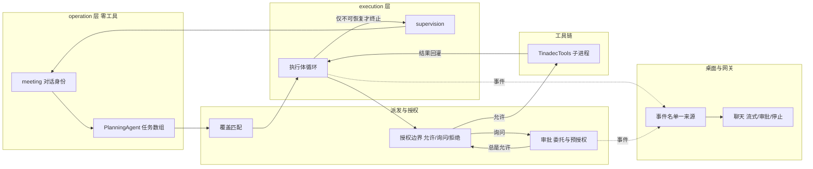

## Product Overview
打通并闭合 TinadecOffice 的「模型 → 工具 → 结果回模型」执行链路：让一条用户消息从规划、派发、执行、审批、工具结果回灌到收尾汇报全程不丢上下文、不把可恢复的失败变成终止，并且全过程在桌面上可见、可中断、可审批。

## Core Features
- **执行体循环闭合**：工具调用失败（含被拒、超时、进程异常）作为一条工具结果回灌给执行体模型继续下一轮，而不是一次失败即把任务判成终态；同一任务连续失败达到阈值才收敛收尾。
- **写操作默认「询问」而非「拒绝」**：当执行体只持有只读授权却发起写操作时，系统向用户发起审批请求，而不是在授权决策点直接判否；工作区之外的路径仍按既有边界拒绝。
- **超时不冻结**：工具线路超时给工具自身超时留出余量，避免内核侧总是先于工具超时；写类操作超时不再把整条运行置为暂停，而是把「结果未知」作为结果回灌模型并由模型决定重试或收敛。
- **审批闭环**：只读类工具在询问模式下默认免人工审批；用户批准时可选「本会话内总是允许这类操作」，该决定对当前待决请求立即放行、对后续同范围请求自动放行；写工具不再每次调用重复询问。
- **规划/派发闭环**：规划解析失败产生的回落任务不再因「工具面最窄」而被就近派给只读执行体；开放式目标显式派给能力面最广的执行体。每个任务的派发原因进入任务证据与事件，可在回放/编排视图中诊断。
- **桌面可见性与会话连续性**：桌面端订阅并消费内核真实发出的事件（工具请求/完成/失败、审批决策、运行失败、执行体分配等），逐字渲染流式回复；聊天消息内直接批准/拒绝；输入区在有活跃运行时显示停止按钮；工具结果与运行证据进入会话历史，使下一条用户消息能感知上一轮的工具体验；排队中的消息在运行结束时不静默作废，而是被执行或给出明确反馈。
- **一键起链路**：开发环境一条命令即可构建并拉起工具子进程，缺失依赖时给出可执行的修复提示。

## Tech Stack Selection
沿用仓库既有技术栈，不引入新框架：

- 内核：.NET 10 / C#（模块化单体，MAF 1.18.0 为智能体基线），EF Core（SQLite / PostgreSQL 双提供器），纯函数策略层用 F#
- 工具子进程：.NET 10 控制台进程（`TinadecTools`），源生成器 `TinadecTools.Generators`
- 网关：Bun + Hono（TypeScript），SSE 原样透传
- 桌面：Electron + Vue 3 + TypeScript（`apps/desktop` 承载控制器/API，`apps/TinadecUI` 承载卡片式 UI 与渲染注册表）
- 测试：xUnit（内核四套 + 架构规则测试）、vitest（桌面与网关）、`npm run check:drift` 契约漂移校验

## Implementation Approach

核心策略是「只缝接缝、不动骨架」，本批不改「对话身份与执行体分离」与「静态一次性规划」两条产品定义（架构级取舍另立第二批次），因此全部改动落在既有模块的边界判定与事件/投影层。

1. **失败语义从「终止」改为「回馈」**：在派发结果的判定分支上，把「非完成即判死」改成「可回馈的失败类型 → 写回工具轮次 → 交回模型继续」，仅保留真正不可恢复的类型判死；收敛由既有的循环守卫（重复调用 / 连续错误 / 连续空响应）与 token 预算承担，不引入新的轮次硬闸门。这是本批最高优先级，它单独决定了链路能否迭代。
2. **授权从二档改三档**：现有资源决策只产出「允许 / 拒绝」，写操作因缺少写授权落到拒绝并优先于审批。改为引入「允许 / 询问 / 拒绝」三档语义，把「级别未授予但可通过审批升级」映射为询问，把「路径越界 / 无任何授权」保持为拒绝。这样既保留了治理的 fail-closed 语义，又让写操作能走到人工决策点。
3. **复用既有审批底座而非新建并行机制**：仓库已有审批委托（`approval_delegations`）与预授权（`pre_authorizations`，支持风险上限、作用域、预算、参数哈希、过期），并已实现「命中预授权即自动铸出审批」的路径。本批只补两件事：用户可创建的入口（含「本会话总是允许」）与只读类工具的默认免审策略。
4. **派发确定性重排**：覆盖匹配当前在「必需工具为空」时按工具面最窄胜出，导致回落任务被派给只读执行体。改为区分两种情形——声明了必需工具时保持「最少额外工具 + slug 序」的确定性；未声明必需工具（开放目标）时改为「能力面最广优先」，使开放式目标落到具备写能力的执行体。同时把派发原因写进任务节点与事件，形成可诊断证据。
5. **桌面以事件名为单一来源对齐**：内核写的是命名 SSE 帧，浏览器只把帧派发给已注册的同名监听，其余静默丢弃。因此先在内核侧把事件名收敛为一处常量清单，再据此生成/维护桌面端监听表与分派表，从机制上消除「订阅名与发出名不一致」。
6. **会话连续性以「运行证据入会话历史」实现**：把运行终态的工具调用与结果摘要持久化为会话历史的一部分，使下一条消息的历史装配能读到它；排队消息在运行终结时由「作废」改为「执行」。

关键取舍与理由：
- 不引入新的「轮次上限」类主闸门——上一轮重构已明确轮次是保险丝而非主控，本批沿用无进展检测与 token 预算作为收敛主控，避免回退。
- 超时改为「结果未知但可回馈」而非「暂停整条运行」：暂停语义原本用于防止未知副作用被静默重试；改为回馈时把「结果未知」作为显式类别写入工具结果与事件，模型与用户都可见，风险从「静默」变为「显式」，这是可接受的折中（工作区沙箱边界与审批门保持不变）。
- 只读免审只在「询问」模式下生效，完全访问模式与显式拒绝语义不变，避免削弱既有安全测试覆盖的边界。

性能与可靠性：
- 工具结果回灌会把每轮结果写入 checkpoint（既有行为），需注意 `ToolTurns` 增长带来的 checkpoint 体积与反序列化成本；沿用既有的尾部指纹截断策略，并沿用既有压缩策略限制回灌长度，避免 O(n²) 增长。
- 事件名清单改为单一来源后，桌面端监听数量上升，需对高频事件（流式增量为每帧）保持增量更新而非全量重渲染，避免逐字渲染引发的重排开销。
- 派发规则改动为纯排序规则调整，复杂度不变（模板数级线性排序），不引入额外遍历。

## Implementation Notes

- **必须遵守的既有约束**：审批挂起是「可续跑的唤醒边界」而非失败——保留 checkpoint、释放租约，由外部决策端点重新入队；改动失败回灌时不得破坏这条边界，`Awaiting*` 系列状态必须继续走挂起。
- **架构规则测试**：仓库有专门的规则测试（模块依赖方向、MAF 不出编排层、配置模块与编排模块单向依赖等）。契约与规则虽被允许修改，但必须显式改规则本身并写明理由，禁止静默删除或跳过。
- **契约同提交再生**：任何接口形状变化必须同提交再生 `openapi.core.json`、`openapi.external.json`、`schema.d.ts` 三件套，并保持 `npm run check:drift` 干净。
- **不要新增恒写字段**：包与冻结配置的序列化对新增字段敏感，新增字段一律可空且「为 null 时不写出」，否则会改变既有摘要导致 409 不可变冲突——这是本仓库已有的教训，必须沿用。
- **日志**：沿用既有结构化事件与日志通道，失败回灌时保留结构化错误类别与工具标识，不打印完整工具参数或结果正文；高频事件按既有采样/事件机制处理。
- **爆炸半径**：改动集中在判定函数与投影层，不重构引擎主循环；不回退已有的收敛机制（无进展检测、token 预算、绝对调用上限保险丝）。
- **验收必须真实**：单元测试与集成测试之外，必须有真实模型的端到端冒烟，覆盖「写文件全链路」「工具失败后纠正成功」「只读免审 + 写一次批准后不再问」三个剧本。

## Architecture Design

改动分布在既有的三层拓扑上，保持不改模块边界：

数据流关键变化（沿一条用户消息）：
1. 规化产出任务数组（不再产出「零需求回落任务被静默就近派发」）。
2. 覆盖匹配按「必需工具是否声明」两分：声明则最窄覆盖、未声明则能力面最广。
3. 到达工具调用时授权边界产出三档判决；「写但只有读授权」→ 询问 → 审批（命中会话级总是允许则直接放行）。
4. 工具返回非完成状态时，除 `Awaiting*` 外一律写回工具轮次并继续循环；循环守卫与预算负责收敛。
5. 运行终态时工具证据写入会话历史，桌面通过统一事件名清单实时消费。

## Directory Structure

本次改动为在既有工程上缝合链路接缝，涉及的文件清单（仅列出修改与新增）：

TinadecCore/
├── DmaEA/
│   ├── FullDuplexRunEngine.cs            # [MODIFY] 核心接缝：非完成派发的判定分支改为「可回馈失败写回工具轮次 + 继续循环」，仅保留不可恢复类型判死；`OutcomeUnknown` 分支改为回灌；`worker.assigned` 事件补充派发原因与候选统计；调用重排后的覆盖匹配。
│   ├── FullDuplexRunEngine.Lanes.cs      # [MODIFY] queued_interaction 消费从「写 rejected」改为「实际入队执行」，并保留禁用时的事件反馈。
│   ├── PlanningAgent.cs                  # [MODIFY] 提示词词汇表：明确必需工具必须取自冻结名册、成功判据必须可验证；回落任务携带可推断的需求面标记。
│   ├── GraphSpawnAuthority.cs            # [MODIFY] `FindCoverage` 平局规则两分：声明必需工具时保持最窄覆盖确定性，未声明时能力面最广优先。
│   ├── WorkspaceBinding.cs               # [MODIFY] 默认资源派生结果与三档决策联动（读取权限不变，写权限改为可经审批升级）。
│   └── Configuration/default-agent-runtime.toml  # [MODIFY] 超时、审批、只读免审相关默认值调整。
├── Tools/
│   ├── ToolResourceAllowList.cs          # [MODIFY] 决策结果扩展为允许/询问/拒绝三档，并给出可执行原因文案。
│   ├── ToolDispatcher.cs                 # [MODIFY] 线路超时默认也留余量；写类操作用超时不再暂停整条运行，改为回灌「结果未知」。
│   ├── ToolInvocationScopeResolver.cs    # [MODIFY] 超时默认值与工具声明的默认超时联动。
│   └── ToolManifestSnapshotResolver.cs   # [MODIFY] 无工作区工具面说明文案（配合 create_workspace 可达性诊断）。
├── Runtime/
│   ├── CoreAuthorizationContextResolver.cs # [MODIFY] 询问档映射为待审批请求而非拒绝规则；operation 层零工具不变。
│   └── ReadinessService.cs               # [MODIFY] 工具未构建时的可执行修复指引。
├── Governance/
│   ├── GovernanceService.cs              # [MODIFY] 边界判定「不允许但可升级」时走待审批流程；会话级预授权命中即放行。
│   ├── AutoApproveOptions.cs             # [MODIFY] 只读类工具默认免审策略开关（默认开启），保留人工专属工具永久人工。
│   └── AutoApprovePolicyRules.cs         # [MODIFY] 免审判定与人工专属工具名单联动。
├── Lifecycle/ToolApprovalCoordinator.cs  # [MODIFY] 预授权铸造路径支持会话级作用域；审批决策携带「本会话总是允许」时落库并立即放行当前请求。
├── Abstractions/
│   └── RunStatus/CoreEventTypes.cs       # [NEW] 内核事件名单一来源常量清单（含工具、审批、运行、执行体、监督、上下文各族），供端点与测试引用。
├── AspNetCore/Endpoints/
│   ├── ControlPlaneEndpoints.cs          # [MODIFY] 审批决策请求增加「本会话总是允许」与作用域字段；新增会话级授权查询/吊销。
│   ├── DmaeaEndpoints.cs                 # [MODIFY] 工具时间线投影补齐待审批状态与审批标识，使聊天内审批按钮的显示条件真实成立。
│   └── InteractionsEndpoints.cs          # [MODIFY] 排队消息返回可追踪标识并补充排队状态查询。
└── Api/appsettings.json                  # [MODIFY] 工具超时等默认值。

Docs/Contracts/
├── openapi.core.json                     # [MODIFY] 契约再生。
└── （Gateway 契约产物与桌面 `schema.d.ts` 同提交再生）

TinadecTools/
├── Tools/Command/ShellTool.cs            # [MODIFY] 默认超时上调至适配真实构建/测试时长。
├── Tools/Search/RipgrepRunner.cs         # [MODIFY] 缺失 ripgrep 时给出可执行的修复指引而非裸错误。
└── TinadecTools.csproj                   # [MODIFY] 原生二进制兜底拷贝策略与缺失告警。

TinadecTools.Generators/
└── ToolFunctionGenerator.cs              # [MODIFY] 参数 schema 输出描述，锚点数组展开为具名结构，使模型能学到编辑工具的用法。

TinadecGateway/
├── src/index.ts                          # [MODIFY] 透传新增审批决策字段（保持字节级透传语义）。
└── tests/__snapshots__/openapi.external.json # [MODIFY] 契约再生。

apps/desktop/
├── src/api.ts                            # [MODIFY] 事件监听表改为引用统一事件名清单（消除 11 个内核不发的死订阅）。
├── src/events/coreEventTypes.ts          # [NEW] 与内核事件常量对齐的 TS 清单（单一来源）。
├── src/composables/useAgentActivity.ts   # [MODIFY] 事件分派补齐工具/审批/运行失败/执行体各族。
├── src/controllers/HomeController.ts     # [MODIFY] 流式文本接线到渲染；停止运行；聊天内审批决策；排队消息反馈。
├── src/components/ComposerBar.vue        # [MODIFY] 活跃运行时显示停止按钮。
├── src/components/chat/MessageList.vue   # [MODIFY] 渲染流式气泡。
└── generated/schema.d.ts                 # [MODIFY] 契约再生。

apps/TinadecUI/
├── src/components/cards/home/ChatCard.vue      # [MODIFY] 绑定批准/拒绝事件到控制器。
└── src/components/cards/home/ApprovalCard.vue  # [MODIFY] 增加「本会话总是允许」选项与作用域提示。

package.json                              # [MODIFY] dev 流程加入工具子进程构建。
AGENTS.md、TinadecCore/AGENTS.md          # [MODIFY] 按仓库维护协议更新（含元数据头）。

## Key Code Structures

资源授权决策由二档扩展为三档——这是本批唯一会横向波及授权、审批与工具链三处的契约，必须先钉死：

- 决策结果新增「处置」维度：允许（按既有格式授予）、询问（级别未授予但可通过审批升级，附带可执行原因）、拒绝（路径越界或无任何授权）。
- 判定输入保持现有三元组（冻结授权列表、工作区相对目标路径、是否为变更类操作），保证既有 fail-closed 语义与测试可平移。

事件名清单的形态：一份内核侧常量集合（工具请求/完成/失败/结果未知、审批请求/决策/自动决策、运行排队/失败/恢复、执行体分配/完成/失败/轮次/预算耗尽、监督各族、上下文打包/补丁、任务接受/取消、交互创建、收尾响应），端点的写入点与桌面端监听表均引用它，测试断言「发出的名字 ⊆ 清单」且「清单名字 ⊆ 桌面监听」。

## Agent Extensions
### SubAgent
- **code-explorer**
  - Purpose: 在动手前对「非完成派发判定分支」「资源授权决策」「审批铸造路径」三处改动点做调用点与影响面普查，并在收尾阶段审计是否有遗留调用方仍按旧的二档/判死语义工作
  - Expected outcome: 一份按文件与行号列出的受影响调用点清单，确认无遗漏的旧语义消费方

### Skill
- **lsp-code-analysis**
  - Purpose: 对内核 C# 改动做语义导航——找出决策结果类型、派发判定函数、审批铸造函数的所有引用与实现，避免漏改同名分支（如挂起路径与回灌路径的相似代码）
  - Expected outcome: 精确的引用/实现清单与调用层级，支撑最小化、无遗漏的修改

- **playwright-cli**
  - Purpose: 在桌面端预览/运行环境中验证本批的 UI 接线——流式文本是否逐字渲染、聊天内批准/拒绝按钮是否真正打到审批决策接口、活跃运行时停止按钮是否触发取消
  - Expected outcome: 可复现的界面行为证据（交互步骤与结果），确认 UI 侧接线真实生效而非仅静态绑定
