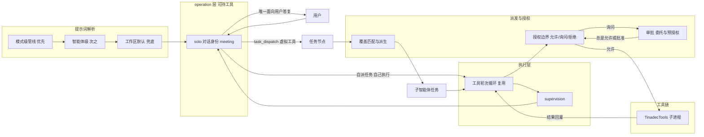

## 产品概述
在既有三种模式（`fixed_pipeline` / `vibe_graph` / `free_director`）之外，新增第四种模式**主从单智能体模式（solo）**：与用户对话的那个智能体自己持工具动手改文件，形态接近传统单智能体 CLI，同时保留并更积极地派出子智能体。四种模式各自拥有**一套不同的提示词**，分别描述自己这一种协作语义。

## 核心功能
- **对话身份自己动手**：solo 模式下，与用户对话的智能体可直接读写文件、执行命令，自己完成单文件小改并如实汇报，不再强制「先交规划、再派执行体」。
- **更积极地派子智能体**：由模型自主判断——可并行拆分或需要专项能力时派子智能体，其余自己做；自己做的与派出去的工作在同一份运行记录里都可追溯，最终答复同时覆盖两者。
- **四种模式四套提示词**：每个模式绑定自己的一套提示词，主从双方都随模式差异化——solo 强调「自己动手 + 积极派」；vibe 强调按声明拓扑协作；fixed_pipeline 强调严格按阶段推进；free_director 强调自由导演。同一模式内主人与子智能体的措辞差异由各智能体自身的系统提示承担。
- **第四种模式可被选择**：模式列表中出现 solo，能像其他模式一样被选中、冻结、运行；运行记录里明确公布这是 solo，回放与编排视图能看出来。
- **治理不变量撤下但留痕**：治理层不再被禁止使用工具；其工具面仍必须由包显式声明，写操作仍必须显式声明写授权并逐次走人工审批。这一变更在文档与测试里显式写明，不留静默缺口。
- **可见性继承既有基线**：对话身份发起的写操作在聊天内弹出审批卡片，可批准、拒绝或选择「本会话总是允许」；它调用的每个工具在时间线与对话流里实时可见；运行答复逐字流式渲染。

## 技术栈选择

沿用仓库既有技术栈，不引入任何新框架：

- 内核：.NET 10 / C#（模块化单体，MAF 1.18.0 为智能体基线），EF Core（SQLite / PostgreSQL 双提供器），纯函数策略层用 F#
- 工具子进程：.NET 10 控制台进程（`TinadecTools`）+ 源生成器
- 网关：Bun + Hono（SSE 原样透传）
- 桌面：Electron + Vue 3 + TypeScript
- 测试：xUnit（内核四套 + 架构规则测试）、vitest、`npm run check:drift` 契约漂移校验

## 实施方案

本批是本项目**产品定义级**改动（对应上一批「两步走」登记的第二批次）。五项已拍板决策的落地策略是：**档位推导扩一个分支、三道门真正撤下、对话身份的工作复用既有循环、派子智能体做成一个虚拟工具、提示词绑定下沉到模式级**。核心原则是不新增任何一条不受治理的执行路径。

### 1. 模式级提示词绑定（本批唯一横跨发布/冻结/装配三处的改动）

现状：管线挂在**智能体**上（`AgentDefinition.BasePromptPipelineRef`，形如 `prompt:seed-base`），模式完全不引用管线，`activation.workspace_defaults.prompt_pipeline_ref` 只是工作区默认值。三个模式因此共用一套提示词。

改法：给 mode 资源加**可空** `prompt_pipeline_ref`，解析优先级 **模式级 > 智能体级 > 工作区默认**。已核实的三处落点：

- **发布快照**：`AgentPackService.cs:1042-1070` 构建 mode 节点快照时只取被引用 agent 的 `BasePromptPipelineRef`；需在同一处解析并写入模式级引用。模式级管线以独立可空列存放（对齐 `WorkspaceDefaultsRecord.DefaultPromptPipelineId/DefaultPromptVersionId` 的既有形状），并评估它对 `ModeVersionRecord.TopologyHash` 的影响——若进入哈希，须在同一提交里写明这是有意的摘要位移（沿用仓库既有的 digest 纪律），不得静默改变既有版本的可复用判定。
- **发布期校验**：在 `AgentPackService.cs:1531-1535` 旁边加同构校验——模式级引用必须带 `prompt:` 类型化前缀且指向已声明管线，否则 `invalid_agent_pack_manifest`（既有的 `AgentPackEndpointTests.AgentPackLifecycle_RejectsUntypedInternalReferences` 已固化同类约束），且缺省为 null 时合法。
- **冻结与装配**：冻结点唯一，在 `FrozenRunConfiguration.cs:~253-286`（`AgentRuntimeConfigurationResolver` 内），与档位推导同一处、同一个 `relational` 视图——两者的权威性注释都写着「derived ONLY here from frozen inputs; recovery never re-derives it」。装配侧**不需要新机制**：`FrozenPromptAssemblyRequest` 已带 `PromptVersionId` / `PromptVersionContentHash` / `PromptGraphJson`，`PromptAssembler.AssembleAsync` 的模板内容由请求带入而非按 agentId 查库，因此只需把「该模式该用哪条管线版本」在冻结期解析好、在 `AssemblePromptAsync` 里填入请求。

**必须写进方案与 AGENTS.md 的语义边界**：一条模式级管线对该模式的**全体**智能体生效（同一 run 的每个 agent 拿到同一套模板）。因此「主人 vs 子智能体」在**同一模式内**的措辞差异由每个智能体已有的 `system_prompt`（per-agent、模式无关）承担；模式级管线负责的是「这个模式的协作语义」。四套提示词 = 四条模式管线，每套同时描述主人与子智能体在本模式下的行为。若将来需要「同一模式内主人与子智能体各用一条管线」，那属于**节点级管线引用**方案，作为独立后续批次登记，本批不实现。

### 2. 新增 `solo_dispatch` 档与四分支推导

档位推导点已定位：`FrozenRunConfiguration.cs:262-263` 的 `DeriveGraphTier(operation, relational.HasDeclaredEdges, relational.ConversationTemplateSlug)`（同一文件内私有静态方法），注释明确「derived ONLY here from frozen inputs; recovery never re-derives it」。

新增**第一优先级**分支：对话身份（按 `ConversationTemplateSlug` 在 operation 名册中定位）声明了非空工具面 → `solo_dispatch`。判据放最前的理由是「对话身份有工具」在语义上蕴含「主人亲自下场」，无论是否声明边。既有三分支顺序与语义完全不动，保证三个既有模式行为零变化（它们的 meeting 工具面为空）。

`solo_dispatch` 的行为契约（写进代码注释与 AGENTS.md）：

- 携带 spawn 权（可派子智能体）；边解析与 `self_dispatch` 同级（声明边 + 派生模板白名单都放行），无声明边时天然走白名单分支——一套代码同时覆盖「主人按图派」与「主人自由派」。
- 允许零执行层（主人可完全靠派生模板工作），与 `free_form` 的既有豁免同级。
- 对话身份的工具面必须来自包显式声明的 `tool_scope`；写操作必须由 envelope 显式声明写授权，且逐次走审批——层间隔离撤下后，这两条是唯一还站着的防线。

需同步的档位枚举点（全部已定位）：`GraphSpawnAuthority.cs:87-89` `CarriesSpawnAuthority`；`GraphEdgeAuthority.cs:19-43` `IsDispatchAllowed` 及其逐档列举的类文档 `:7-11`；`FullDuplexRunEngine.cs:1342-1344` 派发点内联 spawn 判定；`FullDuplexRunEngine.cs:1712-1725` 规划名册装配；`RunFreezeGate.cs:64-75` 无执行层豁免；`OrchestrationGraphProjection.cs:16-21` 文档注释。

### 3. 撤下 operation 层零工具（三道门真正移除）

- **运行时授权门**：删除 `CoreAuthorizationContextResolver.cs:75-80` 的 `operation_layer_cannot_invoke_tools` 早返回，operation 实例改走与执行体同构的路径（frozen configuration → `ResourceRulesAsync` → run/task/instance 边界）。注意 `task` 边界里那条 `CapabilityRule("allow", "tool.invoke", ...)` 与 instance 定义收窄是执行体本来就有的，operation 实例将自动获得同一形状。
- **发布期门**：删除 `ModePublishGate.cs` 规则③ `operation_tool_floor_violation`（调用点 `AgentPackService.cs:1030`）。
- **适配器门（不能简单删）**：`Maf18RuntimeAdapter.cs:58-62` 的守卫收紧为「**允许声明式工具（`AIFunctionFactory.CreateDeclaration(..., implementation: null)`），仍拒绝任何带可调用实现的工具**」。理由是这条守卫真正的价值是「TinadecCore owns authorization and dispatch」——执行体本来就是用只声明不实现的工具，MAF 无法调用，模型产出的调用由引擎读出后交给 `IToolDispatcher`。正反两面各配一条测试，既满足「全局放开」的要求，又不让治理层绕过审批与审计。

同步更新：`RunFreezeGate.cs:23-29` 明确写有「the hard deny floor is CoreAuthorizationContextResolver's operation_layer_cannot_invoke_tools ... and binding-level narrowing is ModePublishGate's operation_tool_floor_violation」的注释必须随实现改写。

按用户决策，这是**全局撤下**（任何模式都可声明），不是加条件分支绕过。

### 4. 对话身份的工作 = 一个它自己执行的任务（复用既有循环）

solo 档不调规划器产出任务数组，而是为对话身份合成一个自派任务（`WorkerAgentSlug` = 对话身份 slug、`RequiredTools` = 它的工具面），交给既有的 `RunWorkerToolLoopAsync`。收益是零新增机制：`WorkerToolTurn` 累积与持久化、每轮 checkpoint、`Awaiting*` 挂起续跑、失败回灌（`FeedToolFailureBackAsync` + `worker.tool_failed`）、`ILoopGuard` 收敛、`tool.execution.*` 事件、桌面按任务聚合的工具时间线全部原样复用。

需要放开的只有一处：worker 定义解析目前只查执行层，solo 档要允许解析到 operation 层的对话身份实例（`GetAssignedWorkerDefinition` 与实例创建路径）。`ExecutionAgent.cs` 的指令措辞需区分「主人」与「执行体」，其余（`ToolMode = Auto`、`AllowMultipleToolCalls`、`MaxOutputTokens = DefaultMaxOutputTokens`）沿用。收尾仍由 meeting 依据全部证据产出唯一面向用户的答复，与现有架构一致。

**不采用**「另写一条治理层工具循环」：那意味着要把审批挂起、失败回灌、checkpoint、事件与投影重做一遍，必然分裂出两套语义。

### 5. 派子智能体 = 一个 Core 虚拟工具

新增与 `CoreWorkspaceTool` 同族的虚拟工具（`task_dispatch`）：把「派一个子任务」持久化为待执行任务节点，交给既有派发链路（选人/派生模板/审批/收敛都不变），并在 `CoreVirtualToolPolicy` 登记 id 使清单快照与授权链识别它。

**v1 边界必须诚实并写入文档**：该工具持久化后立即返回，不回等子智能体结果；子智能体产出在收尾证据里被 meeting 看到。真正的「主对话原地等待并读回子任务结果」需要复用 park/resume 边界，作为独立后续批次登记，不假装已实现。solo 提示词据此写明：自己做单文件小改，可并行或需专项能力时派子智能体。

用户选的是「模型自主判断」，因此引擎不强制派发——但必须给模型一个**能表达「我要派」的手段**，否则「更积极地派子智能体」只是提示词空话。

### 性能与可靠性

- 对话身份的工具轮次进入既有循环，收敛由 `ILoopGuard`（重复调用/连续错误/连续空响应）与 token 预算承担，**不引入新的轮次硬闸门**；`ToolTurns` 增长沿用既有尾部指纹截断与压缩策略，避免 checkpoint 体积 O(n²)。
- `task_dispatch` 为纯记录写入（一次 checkpoint 保存 + 事件），无额外遍历；派生模板选择沿既有 `FindCoverage` 排序，复杂度不变。
- 移除授权早返回后，operation 实例多走一次冻结配置读取与资源规则计算——与执行体同量级，无新增量级开销。
- 模式级管线解析在冻结期完成一次，装配期零额外查询。

## 实施要点

- **不得回退的既有基线**：工具失败回灌模型而非判死任务；资源授权三档（写走询问）；只读工具 ask 家族默认免审；审批 `scope=run` 会话级总是允许 + 追溯放行；工具证据入库（role `tool_evidence`）；`DefaultMaxOutputTokens = 4096`；空计划合法（`LastPlanWasParsed` + `task_graph.empty`）；事件名单一来源；清单哈希两侧规范化。solo 档要天然继承，且 `Awaiting*` 必须继续走挂起（durable wake-up boundary，不得破坏）。
- **审批与包络**：`WorkspaceGrantDefaults.Resolve` 永不隐式给写权，因此 solo 的 meeting 必须在包 envelope 里显式声明 `write: [""]`，否则写操作在授权决策点被拒（而非询问）。
- **不要新增恒写字段**：包与冻结配置的序列化对新增字段敏感（既有教训：会改变摘要导致 409 不可变冲突）。本批两处新增字段——mode 的 `prompt_pipeline_ref` 与虚拟工具 `task_dispatch` 相关声明——一律可空且「为 null 时不写出」。
- **契约同提交再生**：`TinadecCore/tests/__snapshots__/openapi.core.json`、`TinadecGateway/tests/__snapshots__/openapi.external.json`、`apps/desktop/src/generated/schema.d.ts`，并保持 `npm run check:drift` 干净。
- **架构规则测试**：允许改，但必须显式改规则本身并写明理由，禁止静默删除或跳过。
- **注释与文档同步**：`RunFreezeGate.cs:23-29`、`GraphEdgeAuthority` 类文档（逐档列举）、`OrchestrationGraphProjection.cs:16-21`、`GraphSpawnAuthority`、`PromptAssembler` 的解析注释都枚举了档位或不变量，必须随实现更新，否则留下与代码矛盾的权威说明。
- **日志**：沿用既有结构化事件通道；工具调用保留工具标识与错误类别，不打印完整参数或结果正文；新增档位/管线/派发事件按既有事件机制处理（不引入恒写字段）。
- **爆炸半径**：核心改动集中在档位推导分支、授权早返回、发布闸规则、适配器守卫、worker 定义解析、提示词解析链与提示词内容；不重构引擎主循环，不改任务图语义，不动既有三档的判据。
- **环境**：用户的开发环境可能在运行，Core 进程会锁 `TinadecCore/Api/bin` 下的 DLL 导致完整构建报 `MSB3021/MSB3027`——构建前确认或提示用户停掉。开发库 chat 路由当前指向 Qwen 3.8:27B（`DeepSeek-V4-Flash` 已被 provider 拒绝），`model_probe` 可能为 unavailable。
- **验收必须真实**：单元/集成之外，必须真实模型冒烟三个剧本：①solo 下「对话身份自己用 write_file 改文件」全链路（审批走询问、写入成功、工具结果回灌、答复如实）；②「自己动手 + 派子智能体」混合场景；③四个模式各自绑定到不同管线版本的**可观测证据**（同一 workspace 切换模式，冻结体/装配结果里的 prompt 版本不同）。

## 架构设计

改动落在既有三层拓扑上，不新增模块边界；两条新通路都汇入既有机制（复用循环 + 虚拟工具派发）：

沿一条 solo 消息的数据流：

1. 准入时冻结配置：解析模式级提示词管线（模式 > 智能体 > 工作区默认）并写入冻结体；按新判据推导出 `solo_dispatch` 并发 `orchestration.mode_tier_decided`。
2. 规划阶段不调规划器，而是合成对话身份的自派任务，并复用上一批次已落地的「计划合法」路径进入执行阶段。
3. 工具轮次循环启动：每轮把用户目标、上下文包（含模式管线内容）、自派任务状态与已累积的工具轮次交给对话身份模型；模型产出工具调用或答复文本。
4. 工具调用经既有 `IToolDispatcher`：授权三档 → 写操作走询问 → 审批（原地挂起、可续跑）→ 子进程执行 → 结果回灌下一轮；若调用 `task_dispatch`，则由 Core 持久化为任务节点。
5. 模型不再调工具即循环结束；既有派发链路执行全部子智能体任务，supervision 检查，meeting 依据全部证据给出唯一面向用户的答复，工具证据同时写入会话历史供下一条消息感知。

## 目录结构

TinadecCore/
├── DmaEA/
│   ├── FrozenRunConfiguration.cs            # [MODIFY] `FrozenGraphTiers` 新增 `SoloDispatch` 常量并补第四档文档；`DeriveGraphTier` 增加第一优先级分支（对话身份工具面非空 → solo_dispatch）并把三分支注释改为四分支；`AgentRuntimeConfigurationResolver.ResolveAsync`（约 253-286）在同一处解析模式级提示词管线并写入冻结体（可空、为 null 不写出）。
│   ├── GraphSpawnAuthority.cs               # [MODIFY] `CarriesSpawnAuthority` 接纳 `SoloDispatch`。
│   ├── GraphEdgeAuthority.cs                # [MODIFY] `IsDispatchAllowed` 把 `SoloDispatch` 与 `SelfDispatch` 同等对待，并更新逐档列举的类文档。
│   ├── RunFreezeGate.cs                     # [MODIFY] ② topology 的无执行层豁免扩展到 `SoloDispatch`；改写 23-29 行关于 operation 工具地板的过时注释。
│   ├── FullDuplexRunEngine.cs               # [MODIFY] solo 档跳过规划器、合成对话身份自派任务并进入既有工具轮次循环；派发点内联 spawn 判定与 `BuildFrozenPlannerRoster` 接纳 `SoloDispatch`；worker 定义解析允许解析到 operation 层对话身份实例；`AssemblePromptAsync` 改为传入本 run 解析好的管线版本（模式 > 智能体 > 工作区默认）；收尾答复纳入自派任务与子智能体证据。
│   ├── ExecutionAgent.cs                    # [MODIFY] 支持以 operation 层身份构造工具轮次（指令措辞区分主人与执行体），复用声明式工具与 `MaxOutputTokens`。
│   ├── PlanningAgent.cs                     # [MODIFY] 提示词补 solo 语义（自己做单文件小改、可并行或需专项能力时经 `task_dispatch` 派子智能体）。
│   └── OrchestrationGraphProjection.cs      # [MODIFY] 更新枚举档位的文档注释。
├── Runtime/
│   └── CoreAuthorizationContextResolver.cs  # [MODIFY] 移除 operation 层「不可调用工具」早返回及配套注释；operation 实例改走与执行体同构的冻结配置与资源规则路径。
├── AgentConfiguration/
│   ├── ModePublishGate.cs                   # [MODIFY] 删除规则③ `operation_tool_floor_violation` 并说明 operation 层工具面自此合法。
│   ├── AgentPackService.cs                  # [MODIFY] 发布 mode 节点快照时解析并写入模式级管线（可空）；`:1531-1535` 旁加类型化引用校验（缺省 null 合法、未知管线或未加 `prompt:` 前缀即 `invalid_agent_pack_manifest`）。
│   └── AgentConfigurationDbContext.cs       # [MODIFY] 模式版本记录新增可空管线列（对齐 WorkspaceDefaults 的既有形状），并评估对 `TopologyHash` 的影响。
├── Prompts/PromptsModuleRegistrar.cs        # [MODIFY] `PromptAssembler` 保持装配算法不变，仅明确「模板内容来自请求」的解析注释与来源优先级说明。
├── DmaEA/Maf18RuntimeAdapter.cs             # [MODIFY] 守卫收紧为「只允许声明式工具（无实现），仍拒绝任何带可调用实现的工具」，保留 Core 拥有派发权的原意。
├── Tools/
│   ├── TaskDispatchTool.cs                  # [NEW] 与 `CoreWorkspaceTool` 同族的虚拟工具：声明 `task_dispatch` 清单条目（schema/描述/风险/是否需审批），把一次派发请求转成待执行任务节点，由引擎侧落库并发事件。
│   └── CoreVirtualToolPolicy.cs             # [MODIFY] 登记新虚拟工具 id 与归属判定，使清单快照与授权链识别它。
├── AspNetCore/Endpoints/DmaeaEndpoints.cs   # [MODIFY] 工具时间线与编排投影适配 solo：对话身份自派任务的工具调用与派发出来的子任务都能看到（含派发来源标记）。
└── tests/
    ├── TinadecCore.AgentFramework.Tests/DmaeaGraphTierTests.cs      # [NEW] 四分支档位推导判定表（solo 优先于其余分支；既有三档行为不变）。
    ├── TinadecCore.AgentFramework.Tests/ModePublishGateTests.cs     # [MODIFY] 按新语义改写 operation 层工具面两条用例并写明撤下不变量的理由。
    ├── TinadecCore.AgentFramework.Tests/Maf18RuntimeAdapterTests.cs # [MODIFY] 断言翻转为：声明式工具通过、带实现的工具仍被拒。
    ├── TinadecCore.AgentFramework.Tests/PromptResolutionTests.cs    # [NEW] 模式级 > 智能体级 > 工作区默认 的优先级判定表（含模式未声明时回落到智能体级、缺省 null 不写出）。
    ├── TinadecCore.Api.Tests/FullDuplexEndpointTests.cs            # [MODIFY] solo 档端到端：脚本模型驱动对话身份自己调 write_file 并答复、审批走询问、`task_dispatch` 派子智能体后收尾覆盖两者；四模式各自解析到不同管线版本。
    └── TinadecCore.Api.Tests/ToolChainEndpointTests.cs             # [MODIFY] 原断言「operation 实例拿到 deny 边界」改为「拿到与执行体同构的可放行边界」。

apps/desktop/
├── src/agentPacks/GraphSeedPack/manifest.json  # [MODIFY] 新增第四个模式 solo（meeting 声明写能力工具面 + envelope 写授权 + 派生模板，不声明边）并新增四条模式级提示词管线（solo / vibe / fixed_pipeline / free_director 各一套，主从双方都差异化）；四个既有模式与新 solo 分别绑定各自管线；pack 版本与摘要同步升位。
└── src/agentPacks/GraphSeedPack/GraphSeedPack.test.ts # [MODIFY] 原「operation 层零工具面」断言改为「meeting 在 solo 模式声明工具面，其余模式仍为空」；新增四模式各自绑定不同管线与档位标记的断言。

TinadecGateway/
└── src/index.ts                                  # [MODIFY] 如需透传新增模式字段（保持字节级透传语义）。

契约产物
├── TinadecCore/tests/__snapshots__/openapi.core.json        # [MODIFY] 契约再生。
├── TinadecGateway/tests/__snapshots__/openapi.external.json # [MODIFY] 契约再生（如外部形状变化）。
└── apps/desktop/src/generated/schema.d.ts                   # [MODIFY] 契约再生。

AGENTS.md、TinadecCore/AGENTS.md   # [MODIFY] 按仓库 AI MAINTENANCE PROTOCOL 更新（含元数据头）：记录第四档与四模式、四套提示词与「模式级管线对全体智能体生效」的语义边界、operation 零工具不变量撤下及其理由与替代防线（声明式工具 + 包显式工具面 + 写授权 + 逐次审批）、`task_dispatch` 的 v1 边界与后续登记、以及「节点级管线引用」作为后续批次登记。

## 关键代码结构

档位推导是本次唯一的横向判据，必须先钉死（四分支，顺序即优先级）。判据输入保持现有三元组（operation 名册、是否声明边、对话身份 slug），保证既有三档可平移、可测：

- 第一优先：对话身份声明了非空工具面 → `solo_dispatch`（主人亲自下场，无论是否声明边）。
- 既有三分支顺序与语义完全不变，确保 `fixed_pipeline` / `vibe_graph` / `free_director` 行为零变化。

提示词来源优先级（唯一判据，写进代码注释与 AGENTS.md）：模式级管线（本 run 的模式版本声明）> 智能体级 `BasePromptPipelineRef` > 工作区默认管线的版本；三档都可缺省，全部缺省时退回架构基线与各智能体 `system_prompt` 的既有行为。

## Agent Extensions

### SubAgent
- **code-explorer**
  - Purpose: 普查「operation 层零工具」这一不变量在全仓的所有落点与消费方（授权解析、发布闸、适配器、清单快照、工具授权链、端点投影、桌面断言），并定位提示词解析链的全部调用点（发布快照、模式快照、冻结体、`AssemblePromptAsync`、`FrozenPromptAssemblyRequest` 的所有构造处）；在收尾阶段审计是否仍有残留位置按旧不变量工作（例如某处仍假定 operation 实例无工具面而直接返回拒绝或空清单），以及是否仍有按 agentId 解析管线而绕过模式级优先级的路径。
  - Expected outcome: 一份按文件与行号列出的完整清单，确保三道门被真正移除而非部分绕过、提示词优先级在三处落点一致，且无遗漏的旧语义消费方。

### Skill
- **lsp-code-analysis**
  - Purpose: 对档位判据、授权路径与提示词解析做语义导航——找出 `DeriveGraphTier` 与 `FrozenGraphTiers` 的所有引用、`CarriesSpawnAuthority` / `IsDispatchAllowed` 的全部调用点、`operation_layer_cannot_invoke_tools` / `operation_tool_floor_violation` 的所有出现位置，以及 `BasePromptPipelineRef` / `PromptVersionId` 的全部读写点，避免漏改同名分支或遗留断言。
  - Expected outcome: 精确的引用与实现清单，支撑最小化且无遗漏的修改，并确认新增档位与模式级管线在每一处分支都被覆盖。

- **playwright-cli**
  - Purpose: 在桌面端验证本批的可见性——solo 模式出现在模式列表并可选中；对话身份发起的写操作在聊天内弹出审批卡片且可批准、可「本会话总是允许」；它的工具调用在时间线上可见；运行答复逐字流式渲染。
  - Expected outcome: 可复现的界面行为证据（交互步骤与结果），确认 solo 档的工具调用与审批在 UI 侧真实生效，而非仅后端具备能力。
