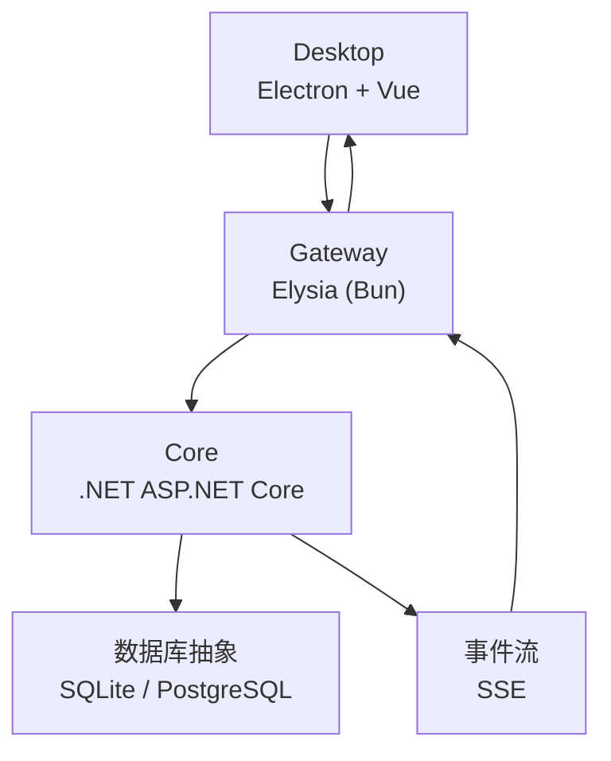
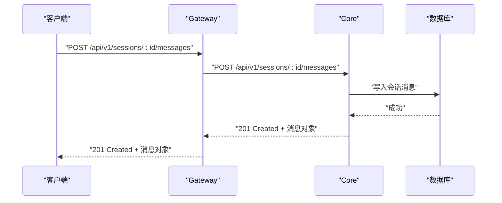
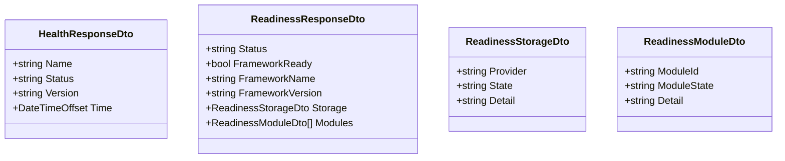
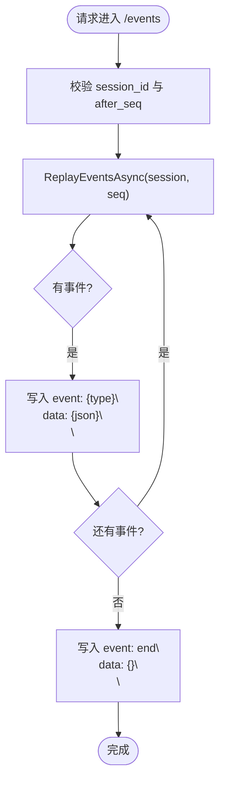
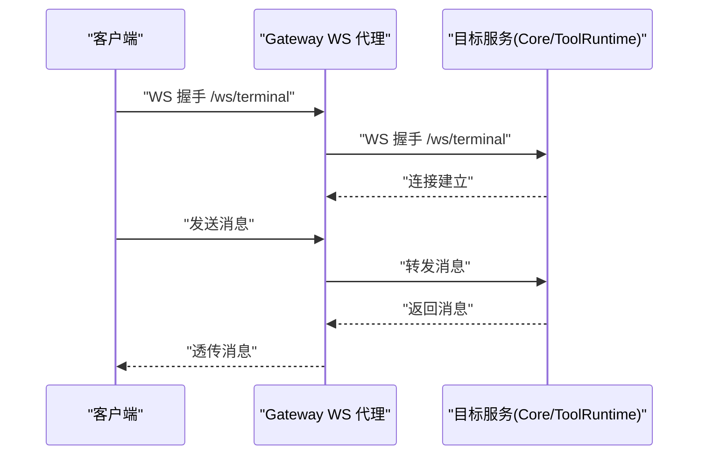
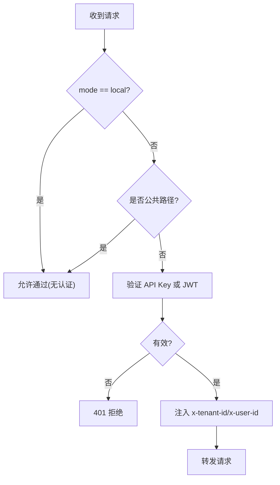
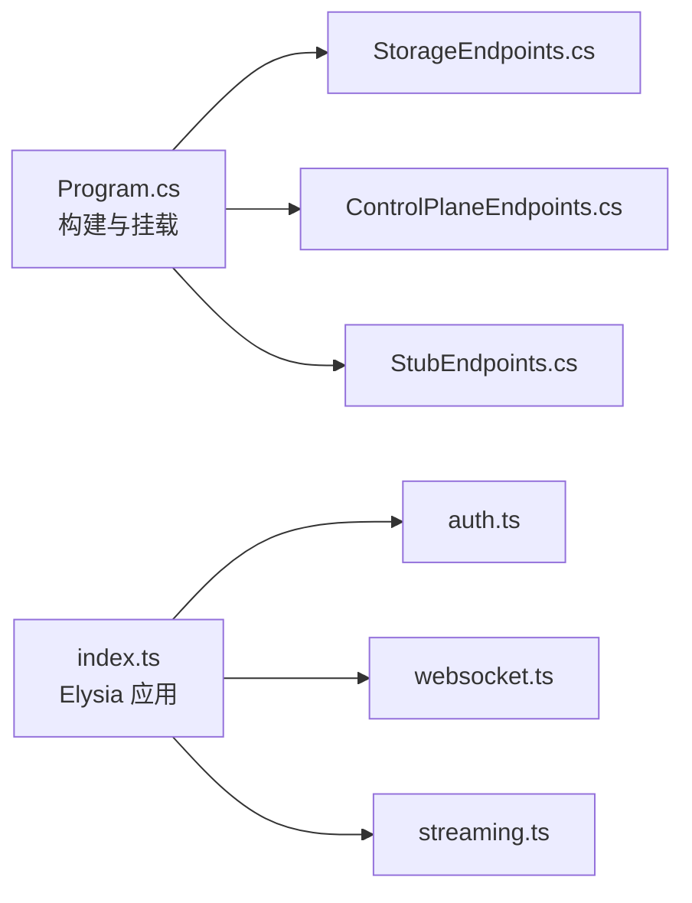

# API 参考文档

<cite>
**本文引用的文件**   
- [Program.cs](file://TinadecCore/Api/Program.cs)
- [ControlPlaneEndpoints.cs](file://TinadecCore/Api/Endpoints/ControlPlaneEndpoints.cs)
- [StorageEndpoints.cs](file://TinadecCore/Api/Endpoints/StorageEndpoints.cs)
- [StubEndpoints.cs](file://TinadecCore/Api/Endpoints/StubEndpoints.cs)
- [HealthResponseDto.cs](file://TinadecCore/Contracts/Dtos/HealthResponseDto.cs)
- [ReadinessResponseDto.cs](file://TinadecCore/Contracts/Dtos/ReadinessResponseDto.cs)
- [EventEnvelope.cs](file://TinadecCore/Contracts/Events/EventEnvelope.cs)
- [index.ts](file://TinadecGateway/src/index.ts)
- [auth.ts](file://TinadecGateway/src/auth.ts)
- [config.ts](file://TinadecGateway/src/config.ts)
- [websocket.ts](file://TinadecGateway/src/websocket.ts)
- [streaming.ts](file://TinadecGateway/src/streaming.ts)
- [README.md](file://README.md)
</cite>

## 目录
1. [简介](#简介)
2. [项目结构](#项目结构)
3. [核心组件](#核心组件)
4. [架构总览](#架构总览)
5. [详细组件分析](#详细组件分析)
6. [依赖关系分析](#依赖关系分析)
7. [性能考虑](#性能考虑)
8. [故障排查指南](#故障排查指南)
9. [结论](#结论)
10. [附录](#附录)

## 简介
本文件为 TinadecOffice 的完整 API 参考，覆盖 RESTful API、SSE 事件流、WebSocket 实时交互与认证策略。系统由三层组成：
- Core（.NET/ASP.NET Core）：唯一状态权威，提供健康检查、就绪性、存储与会话管理、控制面配置等能力。
- Gateway（Bun/Elysia）：薄 BFF/代理层，统一鉴权、CORS、协议转换（HTTP/SSE/WebSocket）、流式转发。
- Desktop（Electron/Vue）：前端界面，仅通过 Gateway 访问后端。

API 契约采用 snake_case JSON 序列化；写操作需经过审批门；Gateway 支持本地与云端两种部署模式。

**章节来源**
- [README.md:1-120](file://README.md#L1-L120)

## 项目结构
- TinadecCore.Api：Web 应用入口与端点注册（健康、就绪、存储、控制面、桩端点）。
- TinadecCore.Contracts：DTO 与事件信封定义。
- TinadecGateway：Elysia 应用，包含认证、路由、SSE/WebSocket/流式代理。
- apps/desktop：桌面客户端（不直接调用 Core，仅通过 Gateway）。

**图表来源**
- [Program.cs:10-40](file://TinadecCore/Api/Program.cs#L10-L40)
- [index.ts:107-155](file://TinadecGateway/src/index.ts#L107-L155)

**章节来源**
- [README.md:17-43](file://README.md#L17-L43)

## 核心组件
- Core 健康与就绪
  - GET /api/v1/health：返回 name、status、version、time。
  - GET /api/v1/readiness：返回框架就绪、存储就绪、模块状态。
- Core 存储与会话
  - 项目与会话 CRUD、消息追加、运行记录查询、事件回放（SSE）。
- Core 控制面
  - 模型提供者、路由、提示词片段、智能体、审批等管理接口（部分为桩实现）。
- Gateway 代理与协议
  - HTTP/JSON 透传、SSE 事件流转发、WebSocket 双向透传、流式 HTTP 代理。
- 认证与租户
  - 本地模式跳过认证；云端模式支持 API Key 与 JWT HS256，注入 x-tenant-id/x-user-id。

**章节来源**
- [Program.cs:44-175](file://TinadecCore/Api/Program.cs#L44-L175)
- [StorageEndpoints.cs:11-93](file://TinadecCore/Api/Endpoints/StorageEndpoints.cs#L11-L93)
- [ControlPlaneEndpoints.cs:8-44](file://TinadecCore/Api/Endpoints/ControlPlaneEndpoints.cs#L8-L44)
- [index.ts:140-155](file://TinadecGateway/src/index.ts#L140-L155)
- [auth.ts:46-112](file://TinadecGateway/src/auth.ts#L46-L112)

## 架构总览
Gateway 作为统一入口，负责：
- 鉴权与 CORS
- 将请求转发到 Core 或 Tool Runtime
- SSE/WebSocket/流式响应透传
- 聚合 Model/Agent Center 视图

**图表来源**
- [index.ts:223-230](file://TinadecGateway/src/index.ts#L223-L230)
- [StorageEndpoints.cs:63-69](file://TinadecCore/Api/Endpoints/StorageEndpoints.cs#L63-L69)

**章节来源**
- [index.ts:107-155](file://TinadecGateway/src/index.ts#L107-L155)
- [Program.cs:27-40](file://TinadecCore/Api/Program.cs#L27-L40)

## 详细组件分析

### RESTful API：健康与就绪
- GET /api/v1/health
  - 响应字段：name、status、version、time（snake_case）。
- GET /api/v1/readiness
  - 响应字段：status、framework_ready、framework_name、framework_version、storage{provider,state,detail}、modules[]。

**图表来源**
- [HealthResponseDto.cs:6-12](file://TinadecCore/Contracts/Dtos/HealthResponseDto.cs#L6-L12)
- [ReadinessResponseDto.cs:6-31](file://TinadecCore/Contracts/Dtos/ReadinessResponseDto.cs#L6-L31)

**章节来源**
- [Program.cs:44-53](file://TinadecCore/Api/Program.cs#L44-L53)
- [Program.cs:122-164](file://TinadecCore/Api/Program.cs#L122-L164)

### RESTful API：存储与会话（SSE 事件流）
- 项目与会话
  - GET /api/v1/projects
  - POST /api/v1/projects
  - GET /api/v1/sessions?project_id=...
  - POST /api/v1/sessions
  - PATCH /api/v1/sessions/{sessionId}
- 消息
  - GET /api/v1/sessions/{sessionId}/messages
  - POST /api/v1/sessions/{sessionId}/messages
- 运行与事件
  - GET /api/v1/sessions/{sessionId}/runs
  - GET /api/v1/events?session_id=...&after_seq=...
    - Content-Type: text/event-stream
    - 事件格式：event: {EventType}\ndata: {EventEnvelope}\n\n
    - 结束事件：event: end\ndata: {}\n\n

**图表来源**
- [StorageEndpoints.cs:77-90](file://TinadecCore/Api/Endpoints/StorageEndpoints.cs#L77-L90)
- [EventEnvelope.cs:9-32](file://TinadecCore/Contracts/Events/EventEnvelope.cs#L9-L32)

**章节来源**
- [StorageEndpoints.cs:11-93](file://TinadecCore/Api/Endpoints/StorageEndpoints.cs#L11-L93)

### RESTful API：控制面（模型/提示词/智能体/审批）
- 模型提供者与路由
  - GET/POST /api/v1/model-providers
  - PUT /api/v1/model-providers/{id}
  - DELETE /api/v1/model-providers/{id}
  - GET /api/v1/model-provider-templates
  - GET /api/v1/model-routes
  - PUT /api/v1/model-routes/{purpose}
  - GET/PUT /api/v1/model-settings（设置更新返回 501，建议使用 model-providers）
- 提示词片段
  - GET/POST /api/v1/prompt-fragments
  - PUT/DELETE /api/v1/prompt-fragments/{id}
  - 版本/回滚/信号/对比等（当前多为 501）
- 智能体
  - GET /api/v1/agents
  - PUT /api/v1/agents/{id}
  - GET /api/v1/agent-modes
- 审批
  - GET /api/v1/approvals?status=...
  - POST /api/v1/approvals
  - POST /api/v1/approvals/{id}/decision

说明：部分端点在骨架模式下返回 501 或空集合，用于联调与兼容。

**章节来源**
- [ControlPlaneEndpoints.cs:8-44](file://TinadecCore/Api/Endpoints/ControlPlaneEndpoints.cs#L8-L44)
- [StubEndpoints.cs:146-175](file://TinadecCore/Api/Endpoints/StubEndpoints.cs#L146-L175)

### RESTful API：调试与诊断（Gateway 透传）
- 追踪与指标
  - GET /api/v1/debug/traces、/spans、/metrics
  - GET /api/v1/debug/snapshot/{sessionId}
  - GET /api/v1/debug/diagnostics、/processes
- 模拟
  - POST /api/v1/debug/simulate/*（消息、模型响应、工具结果、审批决策等）

说明：Gateway 将这些路径原样转发至 Core，便于 Debug Studio 使用。

**章节来源**
- [index.ts:729-799](file://TinadecGateway/src/index.ts#L729-L799)

### WebSocket API：连接处理与消息透传
- 路由映射
  - /ws/terminal → Tool Runtime（PTY 终端）
  - /ws/debug → Core（调试器通信）
  - /ws/collaboration → Core（协作）
- 行为
  - Gateway 根据路径选择目标服务并建立 WebSocket 连接
  - 客户端与目标之间的消息双向透传
  - 关闭/错误时清理连接

**图表来源**
- [websocket.ts:51-67](file://TinadecGateway/src/websocket.ts#L51-L67)
- [websocket.ts:93-139](file://TinadecGateway/src/websocket.ts#L93-L139)

**章节来源**
- [websocket.ts:1-140](file://TinadecGateway/src/websocket.ts#L1-L140)

### 流式 HTTP：大文件与日志
- 用途：大文件上传/下载、实时日志流
- 机制：Gateway 透传请求与响应的 body 流，不缓冲
- 响应头：保留 content-type，设置 no-cache、keep-alive、x-accel-buffering=no

**章节来源**
- [streaming.ts:25-53](file://TinadecGateway/src/streaming.ts#L25-L53)

### 认证与授权（Gateway）
- 本地模式：跳过认证，无租户上下文
- 云端模式：
  - 支持 API Key（x-api-key）与 Bearer Token（HS256 JWT）
  - 从 JWT claims 或自定义头提取 tenant_id/user_id
  - 将 x-tenant-id、x-user-id 注入下游请求头
- 公共路径：/api/v1/health、/docs 等无需认证

**图表来源**
- [auth.ts:46-112](file://TinadecGateway/src/auth.ts#L46-L112)
- [auth.ts:227-254](file://TinadecGateway/src/auth.ts#L227-L254)

**章节来源**
- [auth.ts:1-273](file://TinadecGateway/src/auth.ts#L1-L273)
- [index.ts:140-155](file://TinadecGateway/src/index.ts#L140-L155)

### 配置与环境变量（Gateway）
- 关键环境变量
  - TINADEC_GATEWAY_MODE：local/cloud
  - TINADEC_GATEWAY_PORT：监听端口（默认 48730）
  - TINADEC_CORE_URL：Core 地址（默认 http://127.0.0.1:48731）
  - TINADEC_TOOL_RUNTIME_URL：Tool Runtime 地址（默认 http://127.0.0.1:48732）
  - TINADEC_GATEWAY_AUTH_REQUIRED：是否强制认证（cloud 下默认 true）
  - TINADEC_GATEWAY_JWT_SECRET：JWT 密钥
  - TINADEC_GATEWAY_API_KEY：API Key（静态校验）
  - TINADEC_GATEWAY_CORS_ORIGINS：额外允许的源
  - TINADEC_GATEWAY_TIMEOUT_MS：请求超时（毫秒）

**章节来源**
- [config.ts:65-106](file://TinadecGateway/src/config.ts#L65-L106)

## 依赖关系分析
- Core 启动流程
  - 构建 WebApplication
  - 配置 JSON 序列化（snake_case）
  - 注册持久化与 Core 模块
  - 执行迁移与生命周期协调
  - 挂载健康、就绪、存储、控制面、桩端点
- Gateway 启动流程
  - 加载配置
  - 注册中间件（CORS、认证）
  - 挂载路由（健康、项目/会话、SSE、调试、MCP/ACP、扩展等）
  - 注册 WebSocket 路由与流式代理

**图表来源**
- [Program.cs:10-40](file://TinadecCore/Api/Program.cs#L10-L40)
- [index.ts:107-155](file://TinadecGateway/src/index.ts#L107-L155)

**章节来源**
- [Program.cs:10-40](file://TinadecCore/Api/Program.cs#L10-L40)
- [index.ts:107-155](file://TinadecGateway/src/index.ts#L107-L155)

## 性能考虑
- 流式传输
  - SSE 与 WebSocket 避免全量缓冲，降低内存占用与延迟。
  - 流式 HTTP 透传 body，适合大文件与日志。
- 连接复用
  - keep-alive 与 no-cache 配合，减少握手开销。
- 并发与限流
  - 当前未内置速率限制；建议在反向代理层（如 Nginx/云网关）实施限流与熔断。
- 序列化
  - Core 全局启用 snake_case 与忽略 null，减小负载体积。

[本节为通用指导，不直接分析具体文件]

## 故障排查指南
- 健康检查
  - 调用 /api/v1/health 确认 Core 存活与版本信息。
- 就绪性
  - 调用 /api/v1/readiness 查看存储与模块状态，定位“not_configured”或“warning”。
- 事件流
  - 使用 /api/v1/events 观察事件回放，确认 after_seq 与 session_id 参数正确。
- 认证失败
  - 检查 Authorization 或 x-api-key 是否正确；云端模式需配置 JWT 密钥或 API Key。
- 桩端点
  - 骨架模式下写操作返回 501，属预期行为；待功能实现后移除。

**章节来源**
- [Program.cs:44-53](file://TinadecCore/Api/Program.cs#L44-L53)
- [Program.cs:122-164](file://TinadecCore/Api/Program.cs#L122-L164)
- [StorageEndpoints.cs:77-90](file://TinadecCore/Api/Endpoints/StorageEndpoints.cs#L77-L90)
- [auth.ts:46-112](file://TinadecGateway/src/auth.ts#L46-L112)
- [StubEndpoints.cs:124-133](file://TinadecCore/Api/Endpoints/StubEndpoints.cs#L124-L133)

## 结论
TinadecOffice 以 Core 为唯一状态权威，Gateway 提供统一的鉴权、协议转换与代理能力。RESTful API 遵循 snake_case 约定，SSE/WebSocket 提供实时交互，流式 HTTP 支撑大数据场景。当前骨架模式已具备基础健康、就绪与存储能力，控制面与调试能力逐步完善。建议在生产环境启用认证、在反向代理层实施限流与监控，并结合事件流进行可观测性与排障。

[本节为总结，不直接分析具体文件]

## 附录

### 常用用例与客户端实现要点
- 创建项目与会话
  - 先 POST /api/v1/projects，再 POST /api/v1/sessions，随后向 /api/v1/sessions/{id}/messages 追加用户消息。
- 订阅事件
  - GET /api/v1/events?session_id={id}&after_seq={seq}，解析 event/data 行，维护 last_seq。
- 调试与诊断
  - 使用 /api/v1/debug/* 获取追踪、指标与快照，结合 /api/v1/events 定位问题。
- 认证
  - 云端模式携带 Authorization: Bearer <token> 或 x-api-key，确保 x-tenant-id/x-user-id 被注入下游。

**章节来源**
- [StorageEndpoints.cs:11-93](file://TinadecCore/Api/Endpoints/StorageEndpoints.cs#L11-L93)
- [index.ts:223-230](file://TinadecGateway/src/index.ts#L223-L230)
- [auth.ts:227-254](file://TinadecGateway/src/auth.ts#L227-L254)

### 安全考虑
- 认证与授权
  - 云端模式强制认证；JWT HS256 签名校验；API Key 静态校验。
- CORS
  - 白名单 origin，预检请求缓存时间合理设置。
- 最小权限
  - 仅暴露必要端点；敏感操作（写）经审批门。
- 网络边界
  - 生产环境建议前置反向代理，启用 TLS、限流与审计。

**章节来源**
- [auth.ts:46-112](file://TinadecGateway/src/auth.ts#L46-L112)
- [index.ts:107-139](file://TinadecGateway/src/index.ts#L107-L139)

### 版本与兼容性
- Core 版本：健康接口返回 version 字段；就绪接口返回 framework_version。
- 事件信封：SchemaVersion 固定为 1.0，字段名 snake_case。
- 向后兼容：读接口保持空集合/默认值，写接口在骨架模式下返回 501。

**章节来源**
- [HealthResponseDto.cs:6-12](file://TinadecCore/Contracts/Dtos/HealthResponseDto.cs#L6-L12)
- [ReadinessResponseDto.cs:6-31](file://TinadecCore/Contracts/Dtos/ReadinessResponseDto.cs#L6-L31)
- [EventEnvelope.cs:9-32](file://TinadecCore/Contracts/Events/EventEnvelope.cs#L9-L32)
- [StubEndpoints.cs:124-133](file://TinadecCore/Api/Endpoints/StubEndpoints.cs#L124-L133)