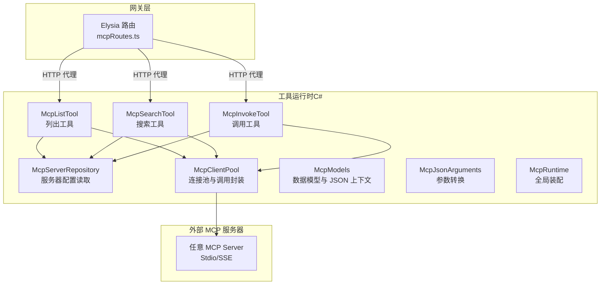
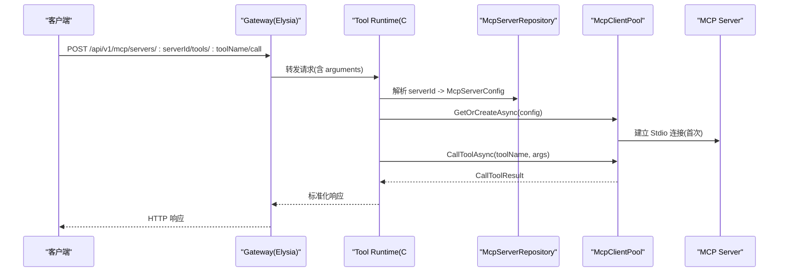
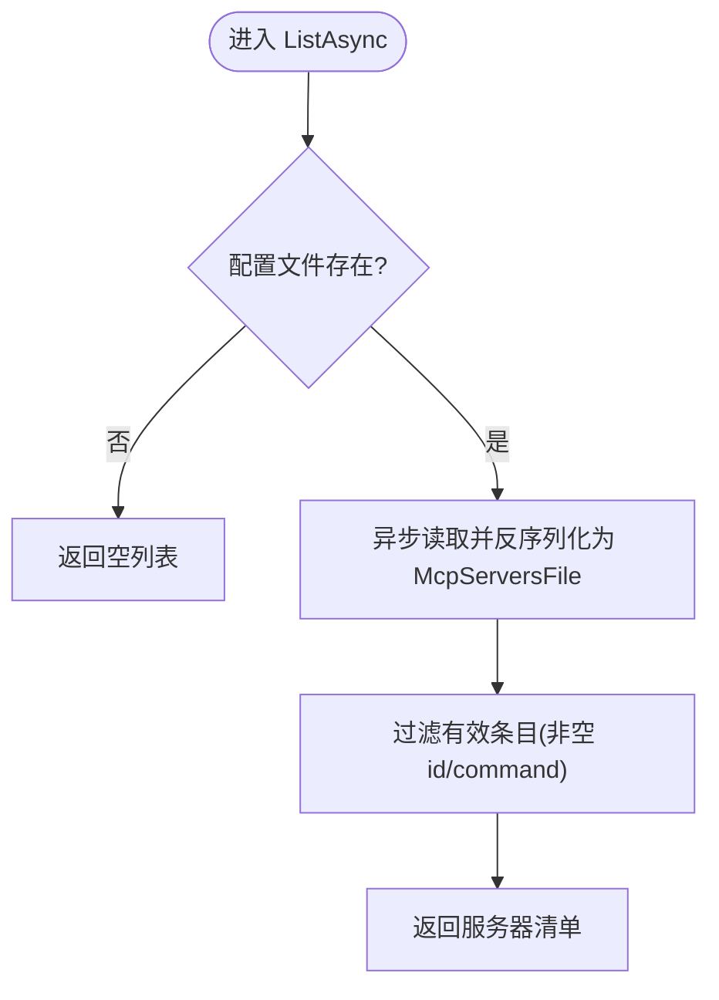
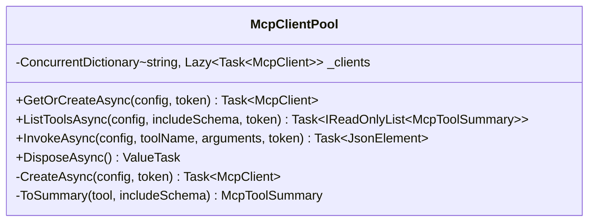
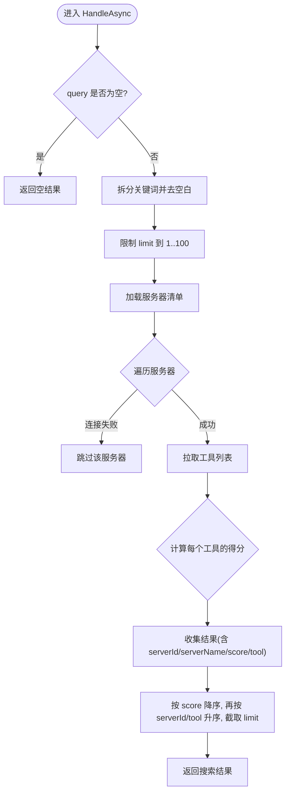
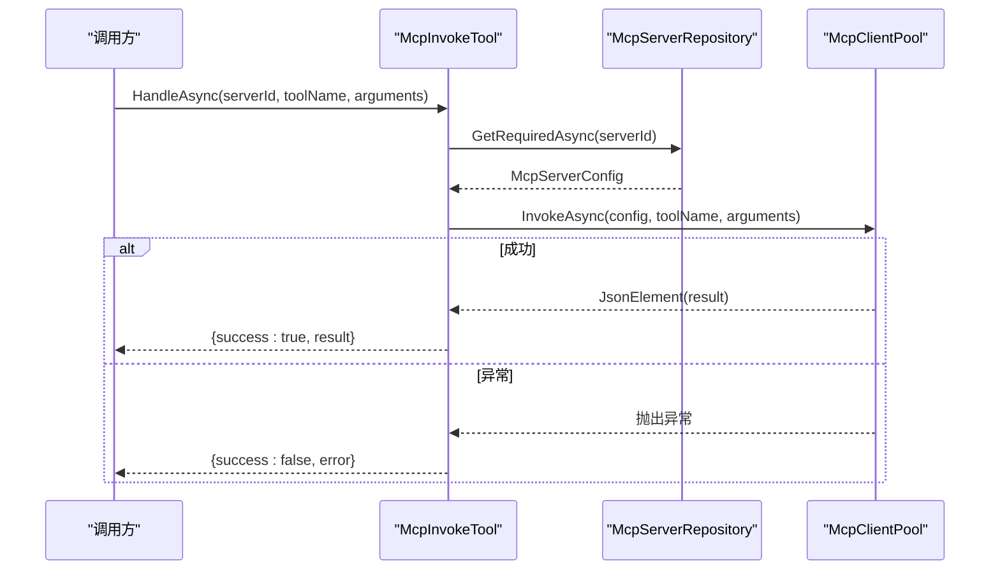
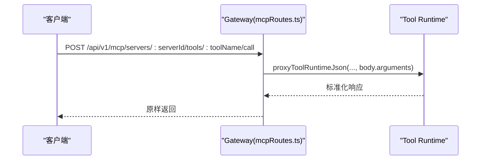
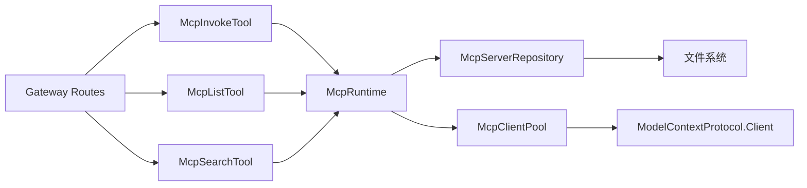

# MCP 协议 API

<cite>
**本文引用的文件**   
- [McpRuntime.cs](file://TinadecTools/Tools/Mcp/McpRuntime.cs)
- [McpClientPool.cs](file://TinadecTools/Tools/Mcp/McpClientPool.cs)
- [McpServerRepository.cs](file://TinadecTools/Tools/Mcp/McpServerRepository.cs)
- [McpInvokeTool.cs](file://TinadecTools/Tools/Mcp/McpInvokeTool.cs)
- [McpListTool.cs](file://TinadecTools/Tools/Mcp/McpListTool.cs)
- [McpSearchTool.cs](file://TinadecTools/Tools/Mcp/McpSearchTool.cs)
- [McpModels.cs](file://TinadecTools/Tools/Mcp/McpModels.cs)
- [McpJsonArguments.cs](file://TinadecTools/Tools/Mcp/McpJsonArguments.cs)
- [mcpRoutes.ts](file://TinadecGateway/src/mcp/mcpRoutes.ts)
- [.mcp.json](file://.mcp.json)
</cite>

## 目录
1. [简介](#简介)
2. [项目结构](#项目结构)
3. [核心组件](#核心组件)
4. [架构总览](#架构总览)
5. [详细组件分析](#详细组件分析)
6. [依赖关系分析](#依赖关系分析)
7. [性能考虑](#性能考虑)
8. [故障排查指南](#故障排查指南)
9. [结论](#结论)
10. [附录](#附录)

## 简介
本文件面向使用与集成 Model Context Protocol（MCP）的开发者，系统化说明本仓库中 MCP 工具链与 Gateway 代理的 RESTful 接口设计、消息格式转换、错误处理机制以及配置与调用方式。内容覆盖：
- MCP 服务器发现与连接管理
- 工具列表获取与搜索
- 工具调用执行流程
- Gateway 薄代理模式下的 REST 端点
- 客户端调用示例与最佳实践

## 项目结构
本项目将 MCP 能力拆分为两部分：
- TinadecTools（C#）：实现 MCP 服务器发现、工具列表与调用、搜索等核心逻辑，并通过工具函数对外暴露能力。
- TinadecGateway（TypeScript/Elysia）：提供薄代理 REST 端点，将请求转发到 Tool Runtime（即上述 C# 服务），不持有连接状态。



**图表来源** 
- [mcpRoutes.ts:1-66](file://TinadecGateway/src/mcp/mcpRoutes.ts#L1-L66)
- [McpServerRepository.cs:1-53](file://TinadecTools/Tools/Mcp/McpServerRepository.cs#L1-L53)
- [McpClientPool.cs:1-89](file://TinadecTools/Tools/Mcp/McpClientPool.cs#L1-L89)
- [McpListTool.cs:1-42](file://TinadecTools/Tools/Mcp/McpListTool.cs#L1-L42)
- [McpSearchTool.cs:1-87](file://TinadecTools/Tools/Mcp/McpSearchTool.cs#L1-L87)
- [McpInvokeTool.cs:1-39](file://TinadecTools/Tools/Mcp/McpInvokeTool.cs#L1-L39)
- [McpModels.cs:1-115](file://TinadecTools/Tools/Mcp/McpModels.cs#L1-L115)
- [McpJsonArguments.cs:1-37](file://TinadecTools/Tools/Mcp/McpJsonArguments.cs#L1-L37)
- [McpRuntime.cs:1-19](file://TinadecTools/Tools/Mcp/McpRuntime.cs#L1-L19)

**章节来源**
- [mcpRoutes.ts:1-66](file://TinadecGateway/src/mcp/mcpRoutes.ts#L1-L66)
- [McpRuntime.cs:1-19](file://TinadecTools/Tools/Mcp/McpRuntime.cs#L1-L19)

## 核心组件
- McpServerRepository：从配置文件或环境变量加载 MCP 服务器清单，支持按 ID 查询并校验必填字段。
- McpClientPool：基于 Stdio 传输创建与管理 McpClient 实例，提供工具列表与工具调用封装，具备连接池与异常清理。
- McpListTool：遍历已注册服务器，拉取工具列表，返回连接状态与可选 schema。
- McpSearchTool：对工具名与描述进行关键词打分排序，返回 Top-N 结果。
- McpInvokeTool：根据 serverId 与 toolName 调用远端 MCP 工具，统一捕获异常并返回结构化响应。
- McpModels：定义所有 DTO、JSON 序列化上下文与 MCP 协议相关类型映射。
- McpJsonArguments：将 JsonElement 转换为字典，适配底层 MCP 调用参数。
- McpRuntime：集中装配 Repository 与 ClientPool，便于测试注入与生命周期管理。

**章节来源**
- [McpServerRepository.cs:1-53](file://TinadecTools/Tools/Mcp/McpServerRepository.cs#L1-L53)
- [McpClientPool.cs:1-89](file://TinadecTools/Tools/Mcp/McpClientPool.cs#L1-L89)
- [McpListTool.cs:1-42](file://TinadecTools/Tools/Mcp/McpListTool.cs#L1-L42)
- [McpSearchTool.cs:1-87](file://TinadecTools/Tools/Mcp/McpSearchTool.cs#L1-L87)
- [McpInvokeTool.cs:1-39](file://TinadecTools/Tools/Mcp/McpInvokeTool.cs#L1-L39)
- [McpModels.cs:1-115](file://TinadecTools/Tools/Mcp/McpModels.cs#L1-L115)
- [McpJsonArguments.cs:1-37](file://TinadecTools/Tools/Mcp/McpJsonArguments.cs#L1-L37)
- [McpRuntime.cs:1-19](file://TinadecTools/Tools/Mcp/McpRuntime.cs#L1-L19)

## 架构总览
Gateway 采用“薄代理”模式，仅负责 HTTP 路由与参数透传；真正的 MCP 连接与工具执行在 Tool Runtime（C#）完成。



**图表来源** 
- [mcpRoutes.ts:45-65](file://TinadecGateway/src/mcp/mcpRoutes.ts#L45-L65)
- [McpInvokeTool.cs:10-37](file://TinadecTools/Tools/Mcp/McpInvokeTool.cs#L10-L37)
- [McpClientPool.cs:33-40](file://TinadecTools/Tools/Mcp/McpClientPool.cs#L33-L40)
- [McpServerRepository.cs:28-34](file://TinadecTools/Tools/Mcp/McpServerRepository.cs#L28-L34)

## 详细组件分析

### 组件一：McpServerRepository（服务器发现）
- 功能：从配置文件路径（环境变量优先）读取 mcp_servers.json，过滤无效条目，支持按 ID 精确查找。
- 关键点：
  - 配置路径解析优先级：显式传入 > 环境变量 > 默认 mcp_servers.json
  - 有效性校验：必须包含 id 与 command
  - 异步读取，避免阻塞



**图表来源** 
- [McpServerRepository.cs:16-26](file://TinadecTools/Tools/Mcp/McpServerRepository.cs#L16-L26)
- [McpServerRepository.cs:36-39](file://TinadecTools/Tools/Mcp/McpServerRepository.cs#L36-L39)
- [McpServerRepository.cs:41-51](file://TinadecTools/Tools/Mcp/McpServerRepository.cs#L41-L51)

**章节来源**
- [McpServerRepository.cs:1-53](file://TinadecTools/Tools/Mcp/McpServerRepository.cs#L1-L53)

### 组件二：McpClientPool（连接池与调用封装）
- 功能：懒加载创建 McpClient，缓存并按 Id 复用；封装 ListToolsAsync 与 InvokeAsync。
- 关键点：
  - 使用 ConcurrentDictionary + Lazy<Task<T>> 保证并发安全与延迟初始化
  - 失败时自动移除失效条目
  - 通过 StdioClientTransport 启动子进程并继承环境变量
  - DisposeAsync 确保资源释放



**图表来源** 
- [McpClientPool.cs:8-24](file://TinadecTools/Tools/Mcp/McpClientPool.cs#L8-L24)
- [McpClientPool.cs:26-40](file://TinadecTools/Tools/Mcp/McpClientPool.cs#L26-L40)
- [McpClientPool.cs:63-76](file://TinadecTools/Tools/Mcp/McpClientPool.cs#L63-L76)
- [McpClientPool.cs:78-87](file://TinadecTools/Tools/Mcp/McpClientPool.cs#L78-L87)

**章节来源**
- [McpClientPool.cs:1-89](file://TinadecTools/Tools/Mcp/McpClientPool.cs#L1-L89)

### 组件三：McpListTool（工具列表）
- 功能：遍历所有服务器，尝试连接并拉取工具列表，记录连接状态与错误信息。
- 关键点：
  - 可选项 includeSchema 控制是否返回输入 schema
  - 异常被捕获并标记为 error 状态，不影响其他服务器

```mermaid
sequenceDiagram
participant Caller as "调用方"
participant ListTool as "McpListTool"
participant Repo as "McpServerRepository"
participant Pool as "McpClientPool"
Caller->>ListTool : HandleAsync(includeSchema)
ListTool->>Repo : ListAsync()
loop 遍历服务器
ListTool->>Pool : ListToolsAsync(server, includeSchema)
alt 成功
Pool-->>ListTool : 工具列表
ListTool.Status = "connected"
else 异常
Pool-->>ListTool : 抛出异常
ListTool.Status = "error", Error = 异常信息
end
end
ListTool-->>Caller : McpListResponse
```

**图表来源** 
- [McpListTool.cs:11-40](file://TinadecTools/Tools/Mcp/McpListTool.cs#L11-L40)
- [McpClientPool.cs:26-31](file://TinadecTools/Tools/Mcp/McpClientPool.cs#L26-L31)

**章节来源**
- [McpListTool.cs:1-42](file://TinadecTools/Tools/Mcp/McpListTool.cs#L1-L42)

### 组件四：McpSearchTool（工具搜索）
- 功能：对工具名与描述进行多关键词打分，返回 Top-N 结果。
- 关键点：
  - 评分规则：完全匹配权重最高，前缀次之，包含最低
  - 限制 limit 范围 1..100
  - 异常被忽略，继续扫描其他服务器



**图表来源** 
- [McpSearchTool.cs:11-61](file://TinadecTools/Tools/Mcp/McpSearchTool.cs#L11-L61)
- [McpSearchTool.cs:63-85](file://TinadecTools/Tools/Mcp/McpSearchTool.cs#L63-L85)

**章节来源**
- [McpSearchTool.cs:1-87](file://TinadecTools/Tools/Mcp/McpSearchTool.cs#L1-L87)

### 组件五：McpInvokeTool（工具调用）
- 功能：根据 serverId 与 toolName 调用远端 MCP 工具，统一异常处理与响应结构。
- 关键点：
  - 需要审批（RequiresApproval=true）
  - 参数由 JsonElement 转为字典后调用
  - 异常时返回 success=false 与错误消息



**图表来源** 
- [McpInvokeTool.cs:10-37](file://TinadecTools/Tools/Mcp/McpInvokeTool.cs#L10-L37)
- [McpClientPool.cs:33-40](file://TinadecTools/Tools/Mcp/McpClientPool.cs#L33-L40)

**章节来源**
- [McpInvokeTool.cs:1-39](file://TinadecTools/Tools/Mcp/McpInvokeTool.cs#L1-L39)

### 组件六：Gateway 路由（REST 代理）
- 功能：提供标准 REST 端点，代理到 Tool Runtime，保持无状态。
- 端点：
  - POST /api/v1/mcp/servers/:serverId/connect
  - POST /api/v1/mcp/servers/:serverId/disconnect
  - GET /api/v1/mcp/servers/:serverId/status
  - POST /api/v1/mcp/servers/:serverId/tools/:toolName/call（body.arguments 可选）



**图表来源** 
- [mcpRoutes.ts:45-65](file://TinadecGateway/src/mcp/mcpRoutes.ts#L45-L65)

**章节来源**
- [mcpRoutes.ts:1-66](file://TinadecGateway/src/mcp/mcpRoutes.ts#L1-L66)

## 依赖关系分析
- 模块内依赖：
  - McpInvokeTool/McpListTool/McpSearchTool 均依赖 McpRuntime.Repository 与 McpRuntime.ClientPool
  - McpClientPool 依赖 ModelContextProtocol 客户端与 Stdio 传输
  - McpServerRepository 依赖 System.Text.Json 与文件系统
- 外部依赖：
  - Elysia（Gateway 路由框架）
  - NLog（日志）
  - ModelContextProtocol（MCP 协议客户端）



**图表来源** 
- [McpRuntime.cs:1-19](file://TinadecTools/Tools/Mcp/McpRuntime.cs#L1-L19)
- [McpClientPool.cs:1-10](file://TinadecTools/Tools/Mcp/McpClientPool.cs#L1-L10)
- [McpServerRepository.cs:1-10](file://TinadecTools/Tools/Mcp/McpServerRepository.cs#L1-L10)
- [mcpRoutes.ts:1-16](file://TinadecGateway/src/mcp/mcpRoutes.ts#L1-L16)

**章节来源**
- [McpRuntime.cs:1-19](file://TinadecTools/Tools/Mcp/McpRuntime.cs#L1-L19)
- [McpClientPool.cs:1-89](file://TinadecTools/Tools/Mcp/McpClientPool.cs#L1-L89)
- [McpServerRepository.cs:1-53](file://TinadecTools/Tools/Mcp/McpServerRepository.cs#L1-L53)
- [mcpRoutes.ts:1-66](file://TinadecGateway/src/mcp/mcpRoutes.ts#L1-L66)

## 性能考虑
- 连接池复用：McpClientPool 使用 Lazy<Task<McpClient>> 与并发字典，避免重复创建连接，降低握手开销。
- 异步 I/O：全部使用 async/await 与 ConfigureAwait(false)，减少线程切换成本。
- 参数转换优化：McpJsonArguments 直接枚举 JsonElement，避免中间对象频繁分配。
- 搜索限流：limit 上限 100，防止大规模结果集导致内存与网络压力。
- 异常快速失败：连接失败立即移除条目，避免后续重试放大负载。

[本节为通用指导，不直接分析具体文件]

## 故障排查指南
- 常见错误：
  - INVALID_PARAMETER：arguments 不是对象或类型不匹配（例如字符串与数组不匹配）。请检查调用方传入的 arguments 结构与目标工具期望一致。
  - 连接失败：服务器未启动、命令不可用或工作目录不存在。确认 McpServerConfig.command/args/cwd/env 正确。
  - 工具不存在：serverId 或 toolName 不正确。先通过 mcp_list 确认可用工具。
- 定位方法：
  - 查看 Tool Runtime 日志（NLog）中的警告与异常信息
  - 使用 mcp_list 检查各服务器状态与错误消息
  - 使用 mcp_search 验证工具名称与描述是否匹配预期
- 修复建议：
  - 修正 arguments 的数据类型与结构
  - 校验环境变量与权限（如继承环境变量 InheritEnvironmentVariables）
  - 确保 MCP 服务端可正常启动并响应

**章节来源**
- [McpInvokeTool.cs:26-36](file://TinadecTools/Tools/Mcp/McpInvokeTool.cs#L26-L36)
- [McpListTool.cs:24-34](file://TinadecTools/Tools/Mcp/McpListTool.cs#L24-L34)
- [McpSearchTool.cs:27-35](file://TinadecTools/Tools/Mcp/McpSearchTool.cs#L27-L35)
- [McpClientPool.cs:19-23](file://TinadecTools/Tools/Mcp/McpClientPool.cs#L19-L23)

## 结论
本方案以“薄代理 + 强运行时”的方式实现 MCP 集成：Gateway 仅提供稳定、易用的 REST 接口，而复杂的连接管理与协议交互由 C# 工具运行时承担。通过统一的配置发现、连接池与参数转换，系统具备良好的可扩展性与稳定性。建议在集成时严格校验参数结构，合理使用连接池与搜索限流，并结合日志与状态接口进行监控与排障。

[本节为总结性内容，不直接分析具体文件]

## 附录

### MCP 服务器配置方法
- 配置文件位置与格式：
  - 默认路径：当前目录下的 mcp_servers.json
  - 可通过环境变量 TINADEC_TOOLS_MCP_CONFIG 指定路径
  - 服务器条目需包含 id 与 command，可选 name、args、env、cwd
- 根级 .mcp.json 示例（用于开发环境）：
  - 支持 sse 与 stdio 两种类型，便于本地调试

**章节来源**
- [McpServerRepository.cs:7-14](file://TinadecTools/Tools/Mcp/McpServerRepository.cs#L7-L14)
- [McpServerRepository.cs:41-51](file://TinadecTools/Tools/Mcp/McpServerRepository.cs#L41-L51)
- [.mcp.json:1-14](file://.mcp.json#L1-L14)

### 工具注册流程
- 工具以静态类方法形式暴露，通过特性标注工具名与是否需要审批：
  - mcp_list：列出工具（无需审批）
  - mcp_invoke：调用工具（需要审批）
  - mcp_search：搜索工具（无需审批）
- 工具参数与响应类型在 McpModels 中统一定义，并使用 Source Generation 提升序列化性能。

**章节来源**
- [McpListTool.cs:10-12](file://TinadecTools/Tools/Mcp/McpListTool.cs#L10-L12)
- [McpInvokeTool.cs:10-12](file://TinadecTools/Tools/Mcp/McpInvokeTool.cs#L10-L12)
- [McpSearchTool.cs:10-12](file://TinadecTools/Tools/Mcp/McpSearchTool.cs#L10-L12)
- [McpModels.cs:39-84](file://TinadecTools/Tools/Mcp/McpModels.cs#L39-L84)

### 客户端调用示例（REST）
- 列出工具：
  - 请求：POST /api/v1/mcp/servers/{serverId}/tools?include_schema=true
  - 响应：包含 config_path 与 servers 列表，每项有 id、name、status、tools
- 搜索工具：
  - 请求：POST /api/v1/mcp/search（query、limit、include_schema）
  - 响应：results 列表，按分数排序
- 调用工具：
  - 请求：POST /api/v1/mcp/servers/{serverId}/tools/{toolName}/call
  - 请求体：{ arguments: { ... } }
  - 响应：{ success, error?, server_id, tool_name, result }

**章节来源**
- [mcpRoutes.ts:22-65](file://TinadecGateway/src/mcp/mcpRoutes.ts#L22-L65)
- [McpListTool.cs:11-40](file://TinadecTools/Tools/Mcp/McpListTool.cs#L11-L40)
- [McpSearchTool.cs:11-61](file://TinadecTools/Tools/Mcp/McpSearchTool.cs#L11-L61)
- [McpInvokeTool.cs:10-37](file://TinadecTools/Tools/Mcp/McpInvokeTool.cs#L10-L37)

### 错误处理机制
- 参数校验：
  - arguments 必须为 JSON 对象，否则抛出异常
  - toolName 不能为空
- 连接与调用异常：
  - 连接失败时从池中移除条目，避免污染后续请求
  - 调用异常统一包装为 success=false 与错误消息
- 日志记录：
  - 关键步骤与异常通过 NLog 输出，便于追踪

**章节来源**
- [McpJsonArguments.cs:7-20](file://TinadecTools/Tools/Mcp/McpJsonArguments.cs#L7-L20)
- [McpClientPool.cs:19-23](file://TinadecTools/Tools/Mcp/McpClientPool.cs#L19-L23)
- [McpInvokeTool.cs:26-36](file://TinadecTools/Tools/Mcp/McpInvokeTool.cs#L26-L36)

### MCP 生态集成最佳实践
- 配置管理：
  - 使用环境变量覆盖配置文件路径，便于多环境部署
  - 明确区分开发（sse）与生产（stdio）模式
- 连接与资源：
  - 合理设置超时与重试策略（在调用方实现）
  - 定期巡检服务器状态，及时告警
- 参数与协议：
  - 严格校验 arguments 结构，避免类型不匹配
  - 遵循 MCP 协议规范，确保工具名与描述清晰
- 安全与审计：
  - 对敏感操作启用 RequiresApproval
  - 记录调用日志与结果摘要，便于审计与回溯

[本节为通用指导，不直接分析具体文件]