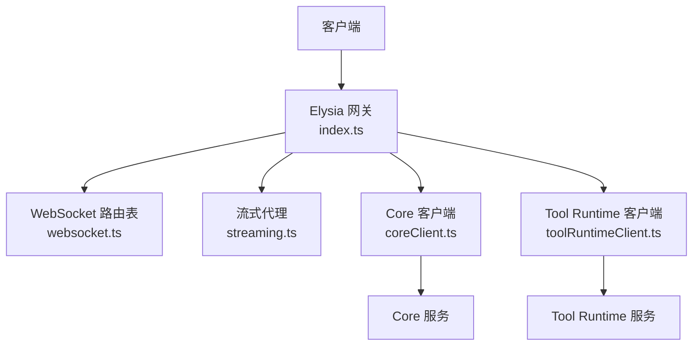
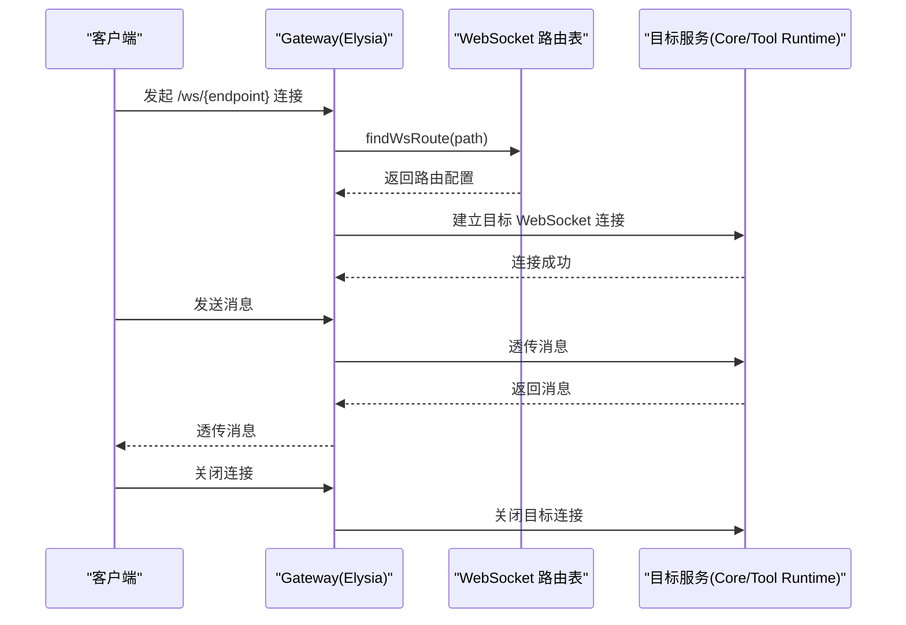
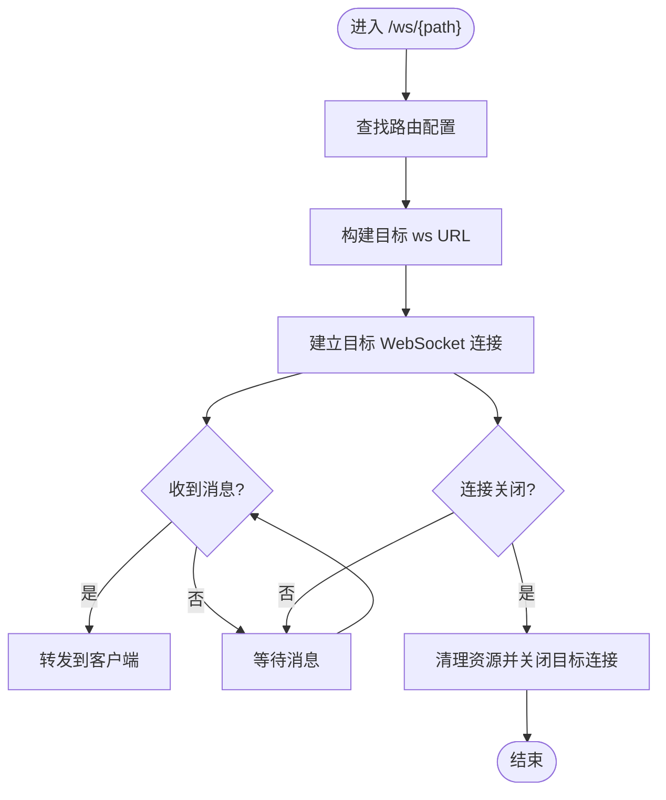
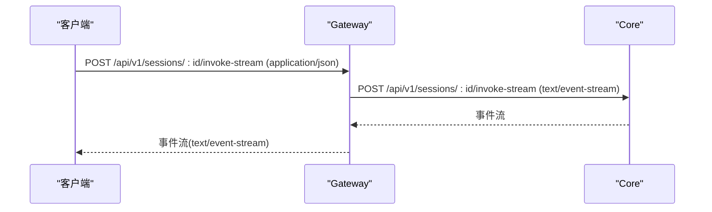
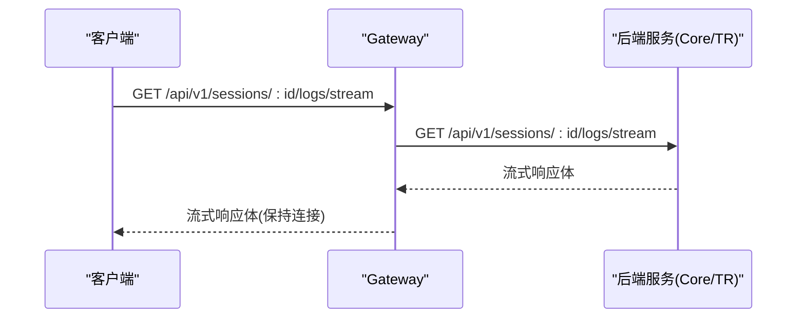
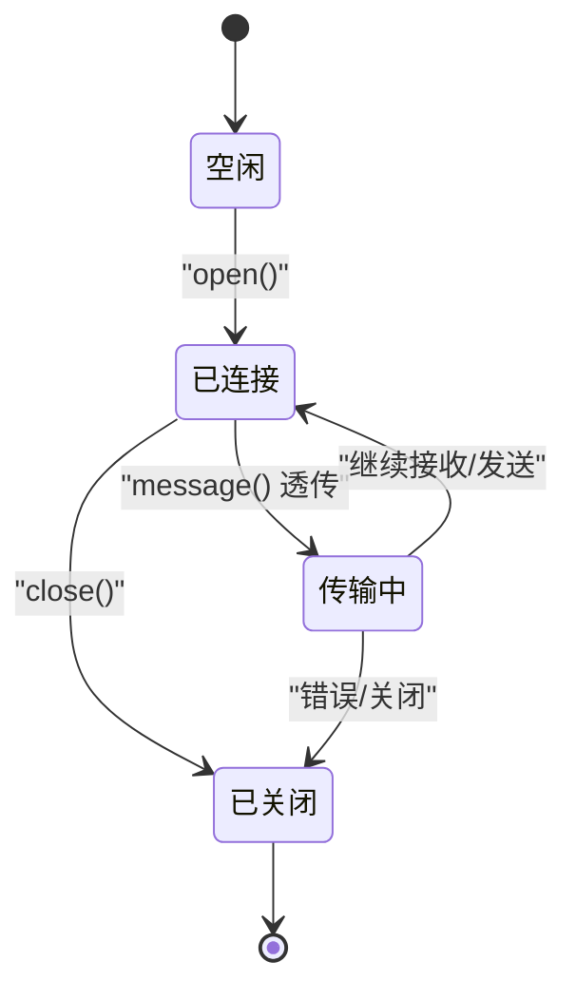
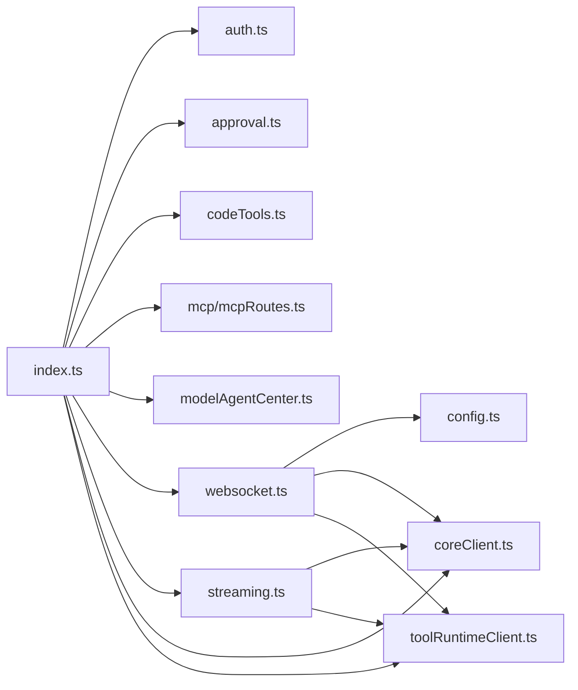

# WebSocket API

<cite>
**本文引用的文件**   
- [index.ts](file://TinadecGateway/src/index.ts)
- [websocket.ts](file://TinadecGateway/src/websocket.ts)
- [streaming.ts](file://TinadecGateway/src/streaming.ts)
- [coreClient.ts](file://TinadecGateway/src/coreClient.ts)
- [toolRuntimeClient.ts](file://TinadecGateway/src/toolRuntimeClient.ts)
- [config.ts](file://TinadecGateway/src/config.ts)
</cite>

## 目录
1. [简介](#简介)
2. [项目结构](#项目结构)
3. [核心组件](#核心组件)
4. [架构总览](#架构总览)
5. [详细组件分析](#详细组件分析)
6. [依赖关系分析](#依赖关系分析)
7. [性能考虑](#性能考虑)
8. [故障排查指南](#故障排查指南)
9. [结论](#结论)
10. [附录：客户端实现与调试工具](#附录客户端实现与调试工具)

## 简介
本文件为 TinadecGateway 的 WebSocket API 技术文档，覆盖以下要点：
- 实时通信连接建立、消息格式定义、事件类型规范与连接生命周期管理
- SSE 事件流、终端通信、调试信息与状态同步机制
- 连接协议、消息序列化、错误重连策略与性能优化
- 客户端实现示例与调试工具使用方法

Gateway 作为薄代理层，负责协议转换（HTTP/JSON、SSE、WebSocket、流式 HTTP）与请求转发到 Core 或 Tool Runtime。WebSocket 主要用于终端 PTY、调试器通信与协作场景。

## 项目结构
Gateway 使用 Elysia 框架提供路由与中间件，WebSocket 通过 Bun 原生能力进行升级与透传。关键文件职责如下：
- index.ts：统一入口，注册所有 HTTP/SSE/WebSocket 路由与中间件
- websocket.ts：WebSocket 路由表、目标 URL 构建与透传处理器
- streaming.ts：流式 HTTP 代理与响应头设置
- coreClient.ts / toolRuntimeClient.ts：Core 与 Tool Runtime 的 JSON/SSE/流式代理
- config.ts：运行配置（端口、主机、服务地址、认证等）

**图表来源** 
- [index.ts:107-948](file://TinadecGateway/src/index.ts#L107-L948)
- [websocket.ts:51-74](file://TinadecGateway/src/websocket.ts#L51-L74)
- [streaming.ts:25-53](file://TinadecGateway/src/streaming.ts#L25-L53)
- [coreClient.ts:22-30](file://TinadecGateway/src/coreClient.ts#L22-L30)
- [toolRuntimeClient.ts:28-36](file://TinadecGateway/src/toolRuntimeClient.ts#L28-L36)

**章节来源**
- [index.ts:1-21](file://TinadecGateway/src/index.ts#L1-L21)
- [config.ts:1-39](file://TinadecGateway/src/config.ts#L1-L39)

## 核心组件
- WebSocket 路由与代理
  - 路由表 WS_ROUTES 定义了三个端点：/ws/terminal、/ws/debug、/ws/collaboration
  - buildTargetWsUrl 将 Gateway 路径映射到 Core 或 Tool Runtime 的 ws/wss 地址
  - createWsProxyHandlers 创建双向透传处理器（Bun WebSocket 客户端）
- SSE 事件流
  - proxySse 用于将 SSE 请求转发到 Core 或 Tool Runtime
  - setStreamHeaders 设置必要的流式响应头
- 流式 HTTP
  - proxyStream 透传请求体与响应体流，适用于大文件与日志
- 配置与鉴权
  - getConfig 读取部署模式、监听地址、后端服务地址与认证参数

**章节来源**
- [websocket.ts:19-45](file://TinadecGateway/src/websocket.ts#L19-L45)
- [websocket.ts:51-74](file://TinadecGateway/src/websocket.ts#L51-L74)
- [websocket.ts:93-139](file://TinadecGateway/src/websocket.ts#L93-L139)
- [streaming.ts:25-53](file://TinadecGateway/src/streaming.ts#L25-L53)
- [coreClient.ts:93-101](file://TinadecGateway/src/coreClient.ts#L93-L101)
- [toolRuntimeClient.ts:103-114](file://TinadecGateway/src/toolRuntimeClient.ts#L103-L114)
- [config.ts:65-106](file://TinadecGateway/src/config.ts#L65-L106)

## 架构总览
Gateway 在入口处统一处理 CORS、鉴权与路由分发；WebSocket 通过 Elysia 的 .ws 方法注册，并在 open/message/close 生命周期中完成订阅与消息透传。SSE 与流式 HTTP 通过 fetch 直接透传 body 流，避免缓冲。

**图表来源** 
- [index.ts:821-872](file://TinadecGateway/src/index.ts#L821-L872)
- [websocket.ts:51-74](file://TinadecGateway/src/websocket.ts#L51-L74)
- [websocket.ts:93-139](file://TinadecGateway/src/websocket.ts#L93-L139)

## 详细组件分析

### WebSocket 路由与透传
- 路由定义
  - /ws/terminal → Tool Runtime 的 /ws/terminal
  - /ws/debug → Core 的 /api/v1/debug/ws
  - /ws/collaboration → Core 的 /ws/collaboration
- 目标 URL 构建
  - 将 http(s) 基础地址转换为 ws(s)，并拼接 path 与查询参数
- 透传处理器
  - 使用 Bun WebSocket 客户端连接到目标服务
  - onmessage 将目标消息回发到客户端
  - onclose/onerror 触发关闭与错误处理

**图表来源** 
- [websocket.ts:35-45](file://TinadecGateway/src/websocket.ts#L35-L45)
- [websocket.ts:93-139](file://TinadecGateway/src/websocket.ts#L93-L139)

**章节来源**
- [websocket.ts:51-74](file://TinadecGateway/src/websocket.ts#L51-L74)
- [websocket.ts:93-139](file://TinadecGateway/src/websocket.ts#L93-L139)
- [index.ts:821-872](file://TinadecGateway/src/index.ts#L821-L872)

### SSE 事件流
- 统一事件流
  - POST /api/v1/sessions/:sessionId/invoke-stream：将请求体以 application/json 发送到 Core 的 invoke-stream，并以 text/event-stream 返回
  - GET /api/v1/events：支持按 session_id 过滤的事件流
- 头部设置
  - content-type: text/event-stream
  - cache-control: no-cache
  - connection: keep-alive
  - x-accel-buffering: no

**图表来源** 
- [index.ts:232-243](file://TinadecGateway/src/index.ts#L232-L243)
- [index.ts:278-286](file://TinadecGateway/src/index.ts#L278-L286)
- [coreClient.ts:93-101](file://TinadecGateway/src/coreClient.ts#L93-L101)

**章节来源**
- [index.ts:232-243](file://TinadecGateway/src/index.ts#L232-L243)
- [index.ts:278-286](file://TinadecGateway/src/index.ts#L278-L286)
- [coreClient.ts:93-101](file://TinadecGateway/src/coreClient.ts#L93-L101)

### 流式 HTTP（大文件与日志）
- 代理函数
  - proxyStream：透传请求体与响应体流，支持 duplex half 模式
  - setStreamHeaders：复制 content-type 并设置缓存与缓冲控制头
- 典型端点
  - /api/v1/files/:sessionId/*：文件下载流
  - /api/v1/sessions/:sessionId/logs：日志流
  - /api/v1/sessions/:sessionId/logs/stream：持续日志流

**图表来源** 
- [streaming.ts:25-53](file://TinadecGateway/src/streaming.ts#L25-L53)
- [index.ts:885-904](file://TinadecGateway/src/index.ts#L885-L904)

**章节来源**
- [streaming.ts:25-53](file://TinadecGateway/src/streaming.ts#L25-L53)
- [index.ts:874-904](file://TinadecGateway/src/index.ts#L874-L904)

### 连接生命周期管理
- 生命周期钩子
  - open：根据路由构建目标 URL，并订阅对应通道（如 terminal-proxy、debug-proxy、collaboration-proxy）
  - message：将消息发布到对应通道，由下游代理转发至目标服务
  - close：取消订阅并关闭目标连接
- 错误处理
  - 目标连接失败时，记录错误并通知客户端（当前实现预留扩展点）

**图表来源** 
- [index.ts:821-872](file://TinadecGateway/src/index.ts#L821-L872)
- [websocket.ts:93-139](file://TinadecGateway/src/websocket.ts#L93-L139)

**章节来源**
- [index.ts:821-872](file://TinadecGateway/src/index.ts#L821-L872)
- [websocket.ts:93-139](file://TinadecGateway/src/websocket.ts#L93-L139)

### 消息格式与序列化
- 文本消息
  - 默认以字符串形式透传，适用于终端 PTY、调试命令与协作指令
- JSON 消息
  - 对于需要结构化数据的场景，建议在应用层约定 JSON 格式，Gateway 不做解析与修改
- 二进制消息
  - 支持 ArrayBuffer 透传，适用于二进制协议或帧数据

注意：Gateway 不改变消息内容，仅做转发。具体消息语义由 Core 与 Tool Runtime 定义。

**章节来源**
- [websocket.ts:93-139](file://TinadecGateway/src/websocket.ts#L93-L139)

### 错误与重连策略
- 常见错误
  - 目标不可达：Core 或 Tool Runtime 无法连接
  - 非 JSON 响应：JSON 代理返回非预期格式
- 建议的重连策略
  - 指数退避：初始延迟 1s，最大间隔 30s，抖动 ±20%
  - 心跳保活：每 15s 发送 ping，超时未响应则判定断开
  - 断线恢复：自动重建连接并重新订阅通道
  - 幂等性：对可重复操作添加 idempotency key，防止重复执行

**章节来源**
- [coreClient.ts:38-87](file://TinadecGateway/src/coreClient.ts#L38-L87)
- [toolRuntimeClient.ts:44-97](file://TinadecGateway/src/toolRuntimeClient.ts#L44-L97)

## 依赖关系分析
Gateway 内部模块之间的依赖关系如下：
- index.ts 依赖 auth、approval、codeTools、mcpRoutes、modelAgentCenter、websocket、streaming、coreClient、toolRuntimeClient
- websocket.ts 依赖 config、coreClient、toolRuntimeClient
- streaming.ts 依赖 coreClient、toolRuntimeClient
- coreClient.ts / toolRuntimeClient.ts 依赖 config

**图表来源** 
- [index.ts:23-57](file://TinadecGateway/src/index.ts#L23-L57)
- [websocket.ts:15-17](file://TinadecGateway/src/websocket.ts#L15-L17)
- [streaming.ts:8-9](file://TinadecGateway/src/streaming.ts#L8-L9)

**章节来源**
- [index.ts:23-57](file://TinadecGateway/src/index.ts#L23-L57)
- [websocket.ts:15-17](file://TinadecGateway/src/websocket.ts#L15-L17)
- [streaming.ts:8-9](file://TinadecGateway/src/streaming.ts#L8-L9)

## 性能考虑
- 零拷贝流式转发：使用 ReadableStream 与 duplex half 模式，避免内存峰值
- 最小化中间处理：Gateway 不进行消息解析与修改，降低 CPU 开销
- 连接复用：keep-alive 与适当的超时配置减少握手成本
- 背压处理：上游与下游速率不一致时，利用流式接口自然背压
- 并发限制：在高并发下限制同时打开的连接数与队列长度

[本节为通用指导，不直接分析具体文件]

## 故障排查指南
- 健康检查
  - GET /api/v1/health：确认 Gateway、Core、Tool Runtime 可达性与模式
  - GET /api/v1/tool-runtime/health：确认 Tool Runtime 健康状态
- 诊断信息
  - GET /api/v1/doctor、/api/v1/readiness、/api/v1/model-readiness、/api/v1/tool-layer-readiness
- 常见问题定位
  - 连接失败：检查环境变量 TINADEC_CORE_URL 与 TINADEC_TOOL_RUNTIME_URL
  - 非 JSON 响应：查看 Core/Tool Runtime 返回体前 200 字符
  - 鉴权失败：检查云端模式的 API Key/JWT 配置与请求头

**章节来源**
- [index.ts:157-188](file://TinadecGateway/src/index.ts#L157-L188)
- [index.ts:906-920](file://TinadecGateway/src/index.ts#L906-L920)
- [coreClient.ts:38-87](file://TinadecGateway/src/coreClient.ts#L38-L87)
- [toolRuntimeClient.ts:44-97](file://TinadecGateway/src/toolRuntimeClient.ts#L44-L97)

## 结论
Gateway 提供了统一的 WebSocket、SSE 与流式 HTTP 接入能力，将客户端请求透明地转发到 Core 与 Tool Runtime。通过清晰的路由表与透传处理器，实现了低耦合、高可扩展的实时通信基础设施。结合合理的重连与心跳策略，可在复杂网络环境下保持稳定连接。

[本节为总结，不直接分析具体文件]

## 附录：客户端实现与调试工具

### 客户端实现示例（概念性步骤）
- 建立 WebSocket 连接
  - 选择端点：/ws/terminal、/ws/debug、/ws/collaboration
  - 设置子协议（可选）与自定义头（鉴权、租户）
- 消息收发
  - 发送文本或 JSON 消息
  - 接收目标服务的响应或事件
- 重连与心跳
  - 实现指数退避与心跳检测
  - 断线后自动重建连接并恢复订阅

[本节为概念性说明，不直接分析具体文件]

### 调试工具使用方法
- 使用浏览器开发者工具或 curl 测试 SSE
  - 访问 /api/v1/events?session_id=... 观察事件流
- 使用 WebSocket 客户端（如 wscat）
  - 连接 /ws/terminal 或 /ws/debug，发送/接收消息
- 查看健康与诊断端点
  - /api/v1/health、/api/v1/doctor、/api/v1/readiness

[本节为概念性说明，不直接分析具体文件]