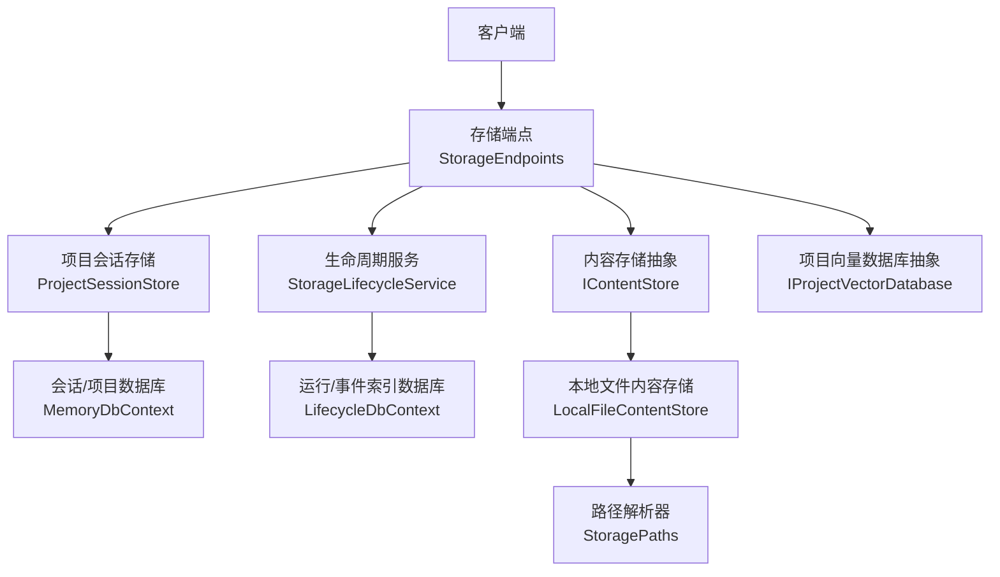
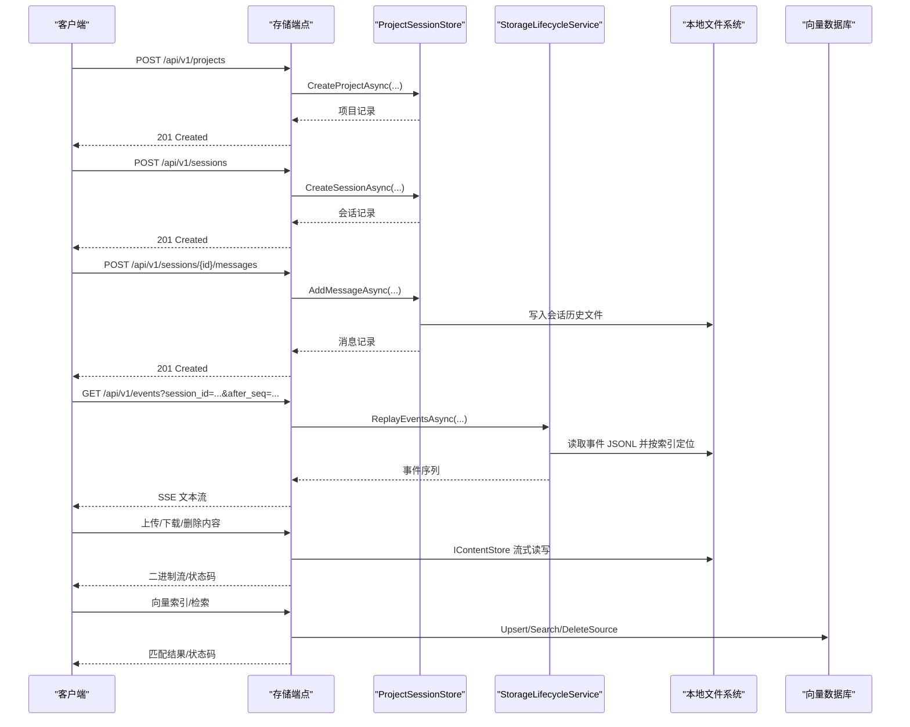
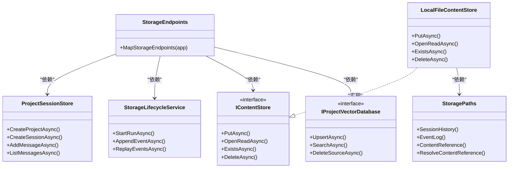

# 存储 API

<cite>
**本文引用的文件**   
- [StorageEndpoints.cs](file://TinadecCore/Api/Endpoints/StorageEndpoints.cs)
- [StorageRequestDtos.cs](file://TinadecCore/Contracts/Dtos/StorageRequestDtos.cs)
- [ProjectSessionStore.cs](file://TinadecCore/Memory/ProjectSessionStore.cs)
- [StorageLifecycleService.cs](file://TinadecCore/Lifecycle/StorageLifecycleService.cs)
- [IContentStore.cs](file://TinadecCore/Persistence/IContentStore.cs)
- [LocalFileContentStore.cs](file://TinadecCore/Persistence/LocalFileContentStore.cs)
- [IProjectVectorDatabase.cs](file://TinadecCore/Persistence/IProjectVectorDatabase.cs)
- [StoragePaths.cs](file://TinadecCore/Persistence/StoragePaths.cs)
- [ServiceCollectionExtensions.cs](file://TinadecCore/Persistence/ServiceCollectionExtensions.cs)
- [StorageMigration.cs](file://TinadecCore/Persistence/StorageMigration.cs)
- [StorageApiTests.cs](file://TinadecCore/tests/TinadecCore.Api.Tests/StorageApiTests.cs)
</cite>

## 目录
1. [简介](#简介)
2. [项目结构](#项目结构)
3. [核心组件](#核心组件)
4. [架构总览](#架构总览)
5. [详细组件分析](#详细组件分析)
6. [依赖分析](#依赖分析)
7. [性能考虑](#性能考虑)
8. [故障排查指南](#故障排查指南)
9. [结论](#结论)
10. [附录](#附录)

## 简介
本文件为“存储 API”的完整技术文档，覆盖以下能力：
- 项目与会话的数据持久化（RESTful 端点）
- 会话消息历史、运行事件回放（SSE）
- 二进制内容存储（上传/下载/删除/存在性检查）
- 向量数据库操作（索引写入、语义检索、按来源删除）
- 请求参数校验、响应格式定义、错误处理策略
- 性能优化建议与批量处理指南

该 API 基于 ASP.NET Minimal API 暴露 REST 接口，底层通过 EF Core 管理关系数据，使用本地文件系统作为大内容与事件日志的持久化载体，并提供可插拔的向量数据库抽象。

## 项目结构
存储相关代码主要分布在以下模块：
- Api/Endpoints：REST 端点定义与路由映射
- Contracts/Dtos：HTTP 输入契约（请求体 DTO）
- Memory：会话与项目存储实现（EF + 文件历史）
- Lifecycle：运行生命周期与事件回放（JSONL 事件日志 + 索引）
- Persistence：通用存储抽象（内容存储、路径解析、迁移、向量库）
- tests：端到端测试用例（验证 JSON 字段命名兼容性与文件落盘）

图表来源
- [StorageEndpoints.cs:11-93](file://TinadecCore/Api/Endpoints/StorageEndpoints.cs#L11-L93)
- [ProjectSessionStore.cs:17-22](file://TinadecCore/Memory/ProjectSessionStore.cs#L17-L22)
- [StorageLifecycleService.cs:21-31](file://TinadecCore/Lifecycle/StorageLifecycleService.cs#L21-L31)
- [IContentStore.cs:4-10](file://TinadecCore/Persistence/IContentStore.cs#L4-L10)
- [LocalFileContentStore.cs:5-9](file://TinadecCore/Persistence/LocalFileContentStore.cs#L5-L9)
- [IProjectVectorDatabase.cs:4-9](file://TinadecCore/Persistence/IProjectVectorDatabase.cs#L4-L9)
- [StoragePaths.cs:4-17](file://TinadecCore/Persistence/StoragePaths.cs#L4-L17)

章节来源
- [StorageEndpoints.cs:11-93](file://TinadecCore/Api/Endpoints/StorageEndpoints.cs#L11-L93)
- [ProjectSessionStore.cs:17-22](file://TinadecCore/Memory/ProjectSessionStore.cs#L17-L22)
- [StorageLifecycleService.cs:21-31](file://TinadecCore/Lifecycle/StorageLifecycleService.cs#L21-L31)
- [IContentStore.cs:4-10](file://TinadecCore/Persistence/IContentStore.cs#L4-L10)
- [LocalFileContentStore.cs:5-9](file://TinadecCore/Persistence/LocalFileContentStore.cs#L5-L9)
- [IProjectVectorDatabase.cs:4-9](file://TinadecCore/Persistence/IProjectVectorDatabase.cs#L4-L9)
- [StoragePaths.cs:4-17](file://TinadecCore/Persistence/StoragePaths.cs#L4-L17)

## 核心组件
- 存储端点（StorageEndpoints）：提供项目、会话、消息、运行列表与事件回放等 REST 接口，统一参数校验与错误码返回。
- 项目会话存储（ProjectSessionStore）：维护项目与会话元数据（EF），并以 JSON 文件维护会话消息历史，支持并发安全写入。
- 生命周期服务（StorageLifecycleService）：管理运行记录、追加事件到 JSONL 文件并建立索引，支持按会话回放事件（SSE）。
- 内容存储（IContentStore + LocalFileContentStore）：以 SHA-256 去重的大对象存储，支持流式写入、读取、存在性检查与删除。
- 向量数据库（IProjectVectorDatabase）：面向项目的语义索引抽象，支持 Upsert、搜索与按来源删除。
- 路径解析（StoragePaths）：统一生成与校验 DataRoot 下的相对路径，防止越权访问。

章节来源
- [StorageEndpoints.cs:11-93](file://TinadecCore/Api/Endpoints/StorageEndpoints.cs#L11-L93)
- [ProjectSessionStore.cs:24-139](file://TinadecCore/Memory/ProjectSessionStore.cs#L24-L139)
- [StorageLifecycleService.cs:33-179](file://TinadecCore/Lifecycle/StorageLifecycleService.cs#L33-L179)
- [IContentStore.cs:4-10](file://TinadecCore/Persistence/IContentStore.cs#L4-L10)
- [LocalFileContentStore.cs:11-49](file://TinadecCore/Persistence/LocalFileContentStore.cs#L11-L49)
- [IProjectVectorDatabase.cs:4-9](file://TinadecCore/Persistence/IProjectVectorDatabase.cs#L4-L9)
- [StoragePaths.cs:4-53](file://TinadecCore/Persistence/StoragePaths.cs#L4-L53)

## 架构总览
存储 API 的请求-响应流程如下：
- 客户端调用 /api/v1/projects、/api/v1/sessions、/api/v1/sessions/{id}/messages 等端点
- 端点层进行参数校验，调用 ProjectSessionStore 或 StorageLifecycleService
- 会话历史与运行事件采用“数据库元数据 + 文件内容”的组合存储
- 大内容通过 IContentStore 流式写入本地文件，SHA-256 去重
- 向量库通过 IProjectVectorDatabase 进行索引与检索

图表来源
- [StorageEndpoints.cs:11-93](file://TinadecCore/Api/Endpoints/StorageEndpoints.cs#L11-L93)
- [ProjectSessionStore.cs:117-139](file://TinadecCore/Memory/ProjectSessionStore.cs#L117-L139)
- [StorageLifecycleService.cs:146-179](file://TinadecCore/Lifecycle/StorageLifecycleService.cs#L146-L179)
- [LocalFileContentStore.cs:11-49](file://TinadecCore/Persistence/LocalFileContentStore.cs#L11-L49)
- [IProjectVectorDatabase.cs:4-9](file://TinadecCore/Persistence/IProjectVectorDatabase.cs#L4-L9)

## 详细组件分析

### REST 端点与请求/响应规范
- 项目
  - POST /api/v1/projects
    - 请求体：CreateProjectRequest（name, path）
    - 成功：201 Created，返回 { id, name, path, kind, created_at, updated_at, archived }
    - 失败：400 INVALID_PROJECT（参数非法），409 DUPLICATE_PROJECT_ROOT（重复根路径）
  - GET /api/v1/projects
    - 成功：200 OK，返回项目数组

- 会话
  - POST /api/v1/sessions
    - 请求体：CreateSessionRequest（project_id, title）
    - 成功：201 Created，返回 { id, project_id, title, status, mode, summary, history_revision, created_at, updated_at, archived }
    - 失败：400 INVALID_PROJECT_ID，404 PROJECT_NOT_FOUND
  - PATCH /api/v1/sessions/{sessionId}
    - 请求体：UpdateSessionRequest（title）
    - 成功：200 OK，返回会话更新后信息
    - 失败：400 INVALID_SESSION_ID/INVALID_SESSION，404 SESSION_NOT_FOUND
  - GET /api/v1/sessions?projectId|project_id
    - 成功：200 OK，返回会话列表（可按项目过滤）

- 消息
  - GET /api/v1/sessions/{sessionId}/messages
    - 成功：200 OK，返回消息数组 { id, session_id, run_id, role, content, created_at }
    - 失败：400 INVALID_SESSION_ID，404 SESSION_NOT_FOUND
  - POST /api/v1/sessions/{sessionId}/messages
    - 请求体：CreateMessageRequest（content）
    - 成功：201 Created，返回消息记录
    - 失败：400 INVALID_SESSION_ID/INVALID_MESSAGE，404 SESSION_NOT_FOUND

- 运行与事件
  - GET /api/v1/sessions/{sessionId}/runs
    - 成功：200 OK，返回运行列表
  - GET /api/v1/events?sessionId|session_id&afterSeq|after_seq
    - 成功：200 OK，SSE 文本流，逐条 event/data 输出，最后 end 事件

注意：
- 查询参数同时支持 snake_case 与 camelCase 兼容（如 projectId/project_id、afterSeq/after_seq）
- 所有 GUID 参数均做合法性校验，非法则返回 400 INVALID_*

章节来源
- [StorageEndpoints.cs:11-93](file://TinadecCore/Api/Endpoints/StorageEndpoints.cs#L11-L93)
- [StorageRequestDtos.cs:4-25](file://TinadecCore/Contracts/Dtos/StorageRequestDtos.cs#L4-L25)
- [StorageApiTests.cs:34-59](file://TinadecCore/tests/TinadecCore.Api.Tests/StorageApiTests.cs#L34-L59)

### 项目与会话存储（ProjectSessionStore）
- 功能要点
  - 创建项目：校验名称与绝对路径，防重复根路径，写入 EF 上下文
  - 创建会话：校验项目存在性，写入会话记录，初始化会话历史文件
  - 会话历史：并发安全写入（SemaphoreSlim），原子替换临时文件，保证一致性
  - 消息追加：校验会话存在，追加消息并递增 revision，同步更新会话更新时间戳
  - 迁移：将旧租户/工作区为空的数据迁移至当前上下文

- 数据结构
  - ProjectRecord、SessionRecord、StoredMessage、SessionHistoryFile

- 并发与一致性
  - 会话级锁避免竞态条件
  - 写历史使用 WriteThrough + FlushToDisk，确保崩溃恢复

章节来源
- [ProjectSessionStore.cs:24-139](file://TinadecCore/Memory/ProjectSessionStore.cs#L24-L139)
- [ProjectSessionStore.cs:166-196](file://TinadecCore/Memory/ProjectSessionStore.cs#L166-L196)

### 运行生命周期与事件回放（StorageLifecycleService）
- 功能要点
  - StartRunAsync：创建运行记录，初始化任务快照与制品目录
  - AppendEventAsync：线程安全追加事件到 JSONL 文件，计算偏移与长度，写入事件索引
  - ReplayEventsAsync：按会话与 afterSequence 回放事件，顺序排序后构造 EventEnvelope
  - ReconcileAsync：对缺失索引的事件进行回填修复

- 数据结构
  - RunRecord、EventFileRecord、EventIndexRecord、TaskSnapshotFile

- 事件回放协议
  - SSE 文本流，event 类型与 data JSON 行，末尾发送 end 事件

章节来源
- [StorageLifecycleService.cs:33-179](file://TinadecCore/Lifecycle/StorageLifecycleService.cs#L33-L179)
- [StorageLifecycleService.cs:181-217](file://TinadecCore/Lifecycle/StorageLifecycleService.cs#L181-L217)

### 二进制内容存储（IContentStore + LocalFileContentStore）
- 能力
  - PutAsync：流式写入临时文件，边读边算 SHA-256，完成后移动到目标路径（去重）
  - OpenReadAsync：异步打开只读流
  - ExistsAsync：判断是否存在
  - DeleteAsync：删除文件

- 安全性与健壮性
  - 校验 TenantId、Kind 合法性
  - 路径白名单校验，防止越权访问
  - 写入使用 WriteThrough 与强制刷新，保障幂等与一致性

章节来源
- [IContentStore.cs:4-10](file://TinadecCore/Persistence/IContentStore.cs#L4-L10)
- [LocalFileContentStore.cs:11-49](file://TinadecCore/Persistence/LocalFileContentStore.cs#L11-L49)
- [StoragePaths.cs:28-41](file://TinadecCore/Persistence/StoragePaths.cs#L28-L41)

### 向量数据库（IProjectVectorDatabase）
- 能力
  - UpsertAsync：写入分块向量与元数据
  - SearchAsync：按模型与嵌入向量检索 Top-K，支持最小分数与来源类型过滤
  - DeleteSourceAsync：按来源维度删除

- 数据结构
  - ProjectVectorRecord、ProjectVectorSearch、ProjectVectorMatch、ProjectVectorScope、ProjectVectorSource

章节来源
- [IProjectVectorDatabase.cs:4-57](file://TinadecCore/Persistence/IProjectVectorDatabase.cs#L4-L57)

### 路径解析与数据根（StoragePaths）
- 作用
  - 统一生成 sessions、tasks、events、artifacts、vectors、content 等子目录路径
  - 校验生成的路径位于 DataRoot 下，防止逃逸
  - 对 content kind 段进行字符清洗

章节来源
- [StoragePaths.cs:4-53](file://TinadecCore/Persistence/StoragePaths.cs#L4-L53)

### 服务注册与迁移（ServiceCollectionExtensions + StorageMigration）
- 服务注册
  - 绑定 TinadecPersistenceOptions，注册 IDatabaseConnectionInfo、ITinadecDatabaseConfigurer、IDatabaseReadiness、StoragePaths、IContentStore、IProjectVectorDatabase、ISecretStore、IStorageMigrationRunner
- 迁移执行
  - StorageMigrationRunner 根据配置决定是否在启动时执行各参与方的 MigrateAsync

章节来源
- [ServiceCollectionExtensions.cs:15-49](file://TinadecCore/Persistence/ServiceCollectionExtensions.cs#L15-L49)
- [StorageMigration.cs:14-40](file://TinadecCore/Persistence/StorageMigration.cs#L14-L40)

## 依赖分析
- 端点层依赖
  - StorageEndpoints 依赖 ProjectSessionStore、StorageLifecycleService
- 存储层依赖
  - ProjectSessionStore 依赖 EF DbContextFactory、StoragePaths、ITenantContextAccessor
  - StorageLifecycleService 依赖 EF DbContextFactory、ISessionLocator、StoragePaths、StorageDiagnostics
  - LocalFileContentStore 依赖 StoragePaths
  - IProjectVectorDatabase 由容器注入具体实现（默认 ProjectVectorDatabase）

图表来源
- [StorageEndpoints.cs:11-93](file://TinadecCore/Api/Endpoints/StorageEndpoints.cs#L11-L93)
- [ProjectSessionStore.cs:17-22](file://TinadecCore/Memory/ProjectSessionStore.cs#L17-L22)
- [StorageLifecycleService.cs:21-31](file://TinadecCore/Lifecycle/StorageLifecycleService.cs#L21-L31)
- [IContentStore.cs:4-10](file://TinadecCore/Persistence/IContentStore.cs#L4-L10)
- [LocalFileContentStore.cs:5-9](file://TinadecCore/Persistence/LocalFileContentStore.cs#L5-L9)
- [IProjectVectorDatabase.cs:4-9](file://TinadecCore/Persistence/IProjectVectorDatabase.cs#L4-L9)
- [StoragePaths.cs:4-17](file://TinadecCore/Persistence/StoragePaths.cs#L4-L17)

章节来源
- [StorageEndpoints.cs:11-93](file://TinadecCore/Api/Endpoints/StorageEndpoints.cs#L11-L93)
- [ProjectSessionStore.cs:17-22](file://TinadecCore/Memory/ProjectSessionStore.cs#L17-L22)
- [StorageLifecycleService.cs:21-31](file://TinadecCore/Lifecycle/StorageLifecycleService.cs#L21-L31)
- [IContentStore.cs:4-10](file://TinadecCore/Persistence/IContentStore.cs#L4-L10)
- [LocalFileContentStore.cs:5-9](file://TinadecCore/Persistence/LocalFileContentStore.cs#L5-L9)
- [IProjectVectorDatabase.cs:4-9](file://TinadecCore/Persistence/IProjectVectorDatabase.cs#L4-L9)
- [StoragePaths.cs:4-17](file://TinadecCore/Persistence/StoragePaths.cs#L4-L17)

## 性能考虑
- 流式 I/O
  - 内容上传/下载使用流式读写，避免一次性加载到大内存
  - 事件追加使用 WriteThrough 与强制刷新，兼顾可靠性与吞吐
- 并发控制
  - 会话消息与事件追加使用 SemaphoreSlim 限流，避免竞争写
- 去重与缓存
  - 内容存储基于 SHA-256 去重，减少重复写入
- 数据库访问
  - 列表查询使用 AsNoTracking 提升读取性能
- 网络传输
  - 事件回放使用 SSE 流式推送，降低延迟与内存占用

[本节为通用指导，不直接分析具体文件]

## 故障排查指南
- 常见错误码
  - 400 INVALID_PROJECT_ID/SESSION_ID：GUID 格式不正确
  - 400 INVALID_PROJECT/SESSION/MESSAGE：必填字段缺失或格式非法
  - 404 PROJECT_NOT_FOUND/SESSION_NOT_FOUND：资源不存在
  - 409 DUPLICATE_PROJECT_ROOT：项目根路径重复
- 数据一致性
  - 会话历史文件损坏：检查 SessionHistoryFile 版本与 JSON 结构
  - 事件索引不一致：运行 ReconcileAsync 重建索引
- 路径问题
  - DataRoot 未配置或路径逃逸：检查 StoragePaths 抛出的异常
- 参考测试
  - 验证 JSON 字段命名兼容性与文件落盘位置

章节来源
- [StorageEndpoints.cs:16-90](file://TinadecCore/Api/Endpoints/StorageEndpoints.cs#L16-L90)
- [ProjectSessionStore.cs:166-196](file://TinadecCore/Memory/ProjectSessionStore.cs#L166-L196)
- [StorageLifecycleService.cs:181-217](file://TinadecCore/Lifecycle/StorageLifecycleService.cs#L181-L217)
- [StorageApiTests.cs:34-78](file://TinadecCore/tests/TinadecCore.Api.Tests/StorageApiTests.cs#L34-L78)

## 结论
存储 API 围绕“项目-会话-消息-运行-事件-内容-向量”构建了一套高内聚、可扩展的存储体系。通过端点层统一校验与错误码、会话与事件的“数据库+文件”混合存储、流式内容存储与向量检索抽象，既保证了可靠性与一致性，也具备良好的扩展性与性能表现。

[本节为总结性内容，不直接分析具体文件]

## 附录

### API 端点速查表
- 项目
  - POST /api/v1/projects：创建项目
  - GET /api/v1/projects：列出项目
- 会话
  - POST /api/v1/sessions：创建会话
  - PATCH /api/v1/sessions/{sessionId}：更新标题
  - GET /api/v1/sessions：列出会话（可选 projectId）
- 消息
  - GET /api/v1/sessions/{sessionId}/messages：列出消息
  - POST /api/v1/sessions/{sessionId}/messages：新增消息
- 运行与事件
  - GET /api/v1/sessions/{sessionId}/runs：列出运行
  - GET /api/v1/events：SSE 事件回放（支持 sessionId/session_id、afterSeq/after_seq）

章节来源
- [StorageEndpoints.cs:11-93](file://TinadecCore/Api/Endpoints/StorageEndpoints.cs#L11-L93)

### 请求体与响应字段说明
- CreateProjectRequest：name、path
- CreateSessionRequest：project_id、title
- UpdateSessionRequest：title
- CreateMessageRequest：content
- 项目/会话/消息/运行响应字段见端点 ToXxx 映射

章节来源
- [StorageRequestDtos.cs:4-25](file://TinadecCore/Contracts/Dtos/StorageRequestDtos.cs#L4-L25)
- [StorageEndpoints.cs:95-98](file://TinadecCore/Api/Endpoints/StorageEndpoints.cs#L95-L98)

### 文件与目录约定
- sessions/{sessionId}.json：会话历史
- tasks/{runId}.tasks.json：任务快照
- events/{runId}.events.jsonl：事件日志
- artifacts/{runId}/：运行产物
- vectors/tenants/{tenantId}/{workspaceId?}/{projectId}.db：向量库文件
- content/tenants/{tenantId}/{workspaceId?}/{kind}/{sha256}：内容存储

章节来源
- [StoragePaths.cs:21-32](file://TinadecCore/Persistence/StoragePaths.cs#L21-L32)

### 批量处理指南
- 批量创建项目/会话：服务端无批量端点，客户端应串行调用以避免冲突；如需高吞吐，可在客户端侧并行但限制并发度
- 批量追加消息：建议使用批处理队列，合并写入以降低文件 I/O 次数
- 批量事件回放：合理设置 after_seq 分页拉取，避免单次过大负载
- 批量内容上传：优先使用流式上传，服务端自动去重；客户端可先计算哈希避免重复上传

[本节为通用指导，不直接分析具体文件]