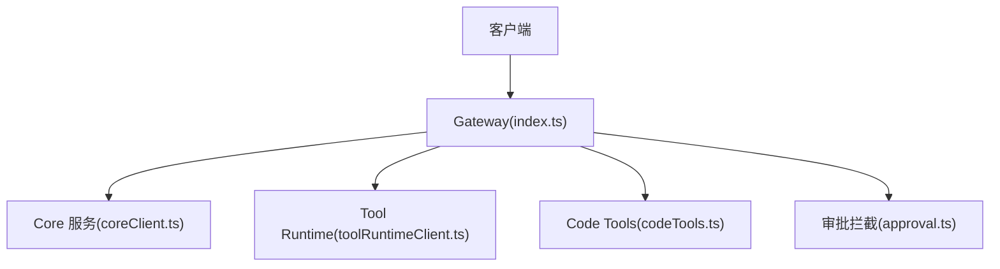
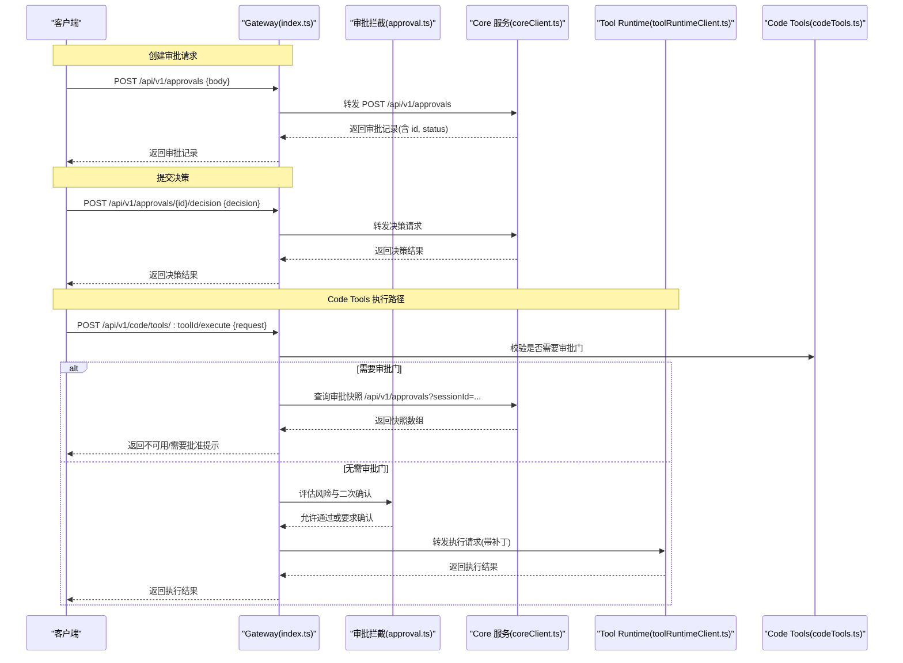
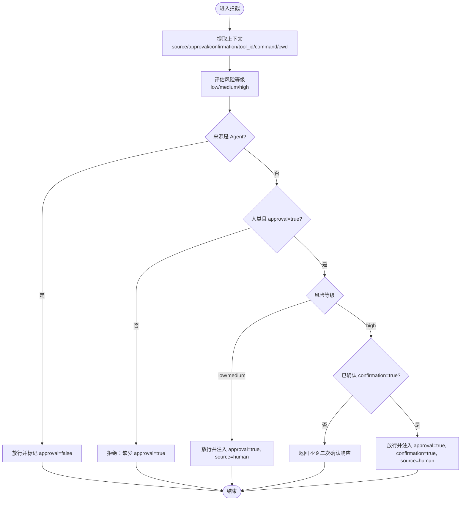
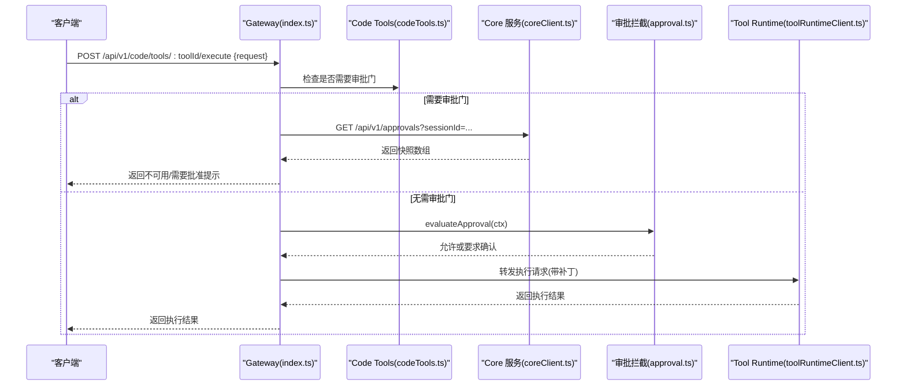
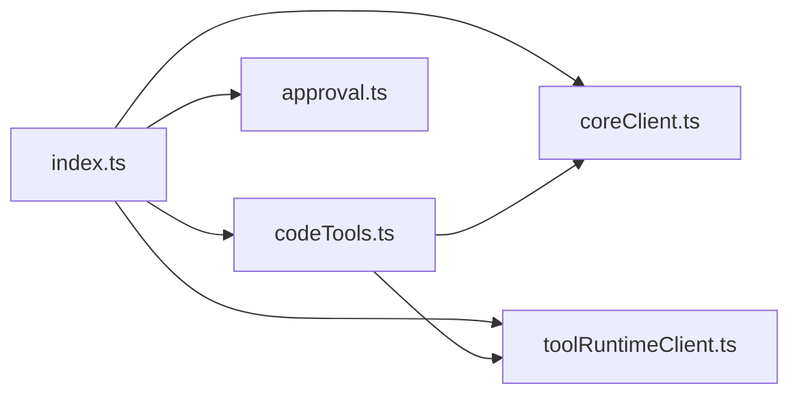

# 审批系统 API

<cite>
**本文引用的文件**   
- [index.ts](file://TinadecGateway/src/index.ts)
- [approval.ts](file://TinadecGateway/src/approval.ts)
- [coreClient.ts](file://TinadecGateway/src/coreClient.ts)
- [toolRuntimeClient.ts](file://TinadecGateway/src/toolRuntimeClient.ts)
- [codeTools.ts](file://TinadecGateway/src/codeTools.ts)
</cite>

## 目录
1. [简介](#简介)
2. [项目结构](#项目结构)
3. [核心组件](#核心组件)
4. [架构总览](#架构总览)
5. [详细组件分析](#详细组件分析)
6. [依赖关系分析](#依赖关系分析)
7. [性能考虑](#性能考虑)
8. [故障排查指南](#故障排查指南)
9. [结论](#结论)
10. [附录](#附录)

## 简介
本文件面向审批系统的 API 使用与集成，聚焦以下端点：
- 查询审批列表：GET /api/v1/approvals
- 创建审批请求：POST /api/v1/approvals
- 提交决策：POST /api/v1/approvals/{id}/decision

文档涵盖：
- 审批工作流、状态管理与权限控制机制
- 审批请求结构与决策响应格式
- 过滤参数（如状态、会话）的使用方式
- 错误处理策略与最佳实践
- 与 Code Tools 执行流程的集成要点

## 项目结构
审批相关能力由 Gateway 层提供 HTTP 路由，并代理到 Core 服务；同时结合本地拦截器对高风险操作进行二次确认。关键文件职责如下：
- index.ts：定义 /api/v1/approvals 系列路由，透传查询参数与请求体至 Core
- approval.ts：实现人类/Agent 来源识别、风险等级评估、二次确认响应构建与补丁合并
- coreClient.ts：封装对 Core 服务的 JSON 代理调用
- toolRuntimeClient.ts：封装对 Tool Runtime 的代理调用
- codeTools.ts：Code Tools 执行前的审批门校验与快照拼装

图表来源
- [index.ts:288-308](file://TinadecGateway/src/index.ts#L288-L308)
- [coreClient.ts](file://TinadecGateway/src/coreClient.ts)
- [toolRuntimeClient.ts](file://TinadecGateway/src/toolRuntimeClient.ts)
- [codeTools.ts](file://TinadecGateway/src/codeTools.ts)
- [approval.ts:91-197](file://TinadecGateway/src/approval.ts#L91-L197)

章节来源
- [index.ts:288-308](file://TinadecGateway/src/index.ts#L288-L308)

## 核心组件
- 审批路由与代理
  - GET /api/v1/approvals：支持 status、session_id 等查询参数，透传到 Core
  - POST /api/v1/approvals：透传请求体到 Core
  - POST /api/v1/approvals/:approvalId/decision：透传决策请求体到 Core
- 审批拦截与风险评估
  - 提取请求上下文（来源、是否已批准、是否已确认、工具ID、命令描述、工作目录）
  - 基于工具 ID 与命令文本评估风险等级（低/中/高）
  - 人类高风险操作需二次确认，返回特定状态码与结构化数据
- Code Tools 审批门
  - 在执行前校验 Core 审批状态，必要时返回不可用或需要批准的提示块

章节来源
- [index.ts:288-308](file://TinadecGateway/src/index.ts#L288-L308)
- [approval.ts:91-197](file://TinadecGateway/src/approval.ts#L91-L197)
- [codeTools.ts](file://TinadecGateway/src/codeTools.ts)

## 架构总览
下图展示一次“创建审批 + 决策”的典型端到端流程，以及 Code Tools 执行时的审批门校验。

图表来源
- [index.ts:288-308](file://TinadecGateway/src/index.ts#L288-L308)
- [index.ts:351-400](file://TinadecGateway/src/index.ts#L351-L400)
- [coreClient.ts](file://TinadecGateway/src/coreClient.ts)
- [toolRuntimeClient.ts](file://TinadecGateway/src/toolRuntimeClient.ts)
- [codeTools.ts](file://TinadecGateway/src/codeTools.ts)
- [approval.ts:91-197](file://TinadecGateway/src/approval.ts#L91-L197)

## 详细组件分析

### 查询审批列表：GET /api/v1/approvals
- 功能：获取审批记录列表，支持按状态与会话过滤
- 查询参数
  - status：按审批状态过滤（例如待处理、已通过、已拒绝等，具体枚举以 Core 为准）
  - session_id：按会话筛选相关审批
- 行为：Gateway 将参数映射为 sessionId 等后端字段后转发至 Core，并原样返回状态码与数据

章节来源
- [index.ts:288-295](file://TinadecGateway/src/index.ts#L288-L295)

### 创建审批请求：POST /api/v1/approvals
- 功能：发起一个新的审批请求
- 请求体：透传到 Core，建议包含以下字段（示例字段名，实际以 Core 契约为准）
  - source：请求来源 human/agent
  - tool_id：工具标识
  - command：命令描述（可选）
  - cwd：工作目录（可选）
  - session_id：关联会话（可选）
  - 其他业务字段（由 Core 定义）
- 响应：返回创建的审批记录，包含 id、status 等

章节来源
- [index.ts:296-300](file://TinadecGateway/src/index.ts#L296-L300)

### 提交决策：POST /api/v1/approvals/{id}/decision
- 功能：对指定审批记录提交决策（通过/拒绝等）
- 路径参数
  - id：审批记录标识
- 请求体：透传到 Core，建议包含决策类型、备注等
- 响应：返回决策结果与更新后的审批状态

章节来源
- [index.ts:301-308](file://TinadecGateway/src/index.ts#L301-L308)

### 审批拦截与风险评估（approval.ts）
- 上下文提取
  - 从请求体中提取 source、approval、confirmation、tool_id、command、cwd
- 风险评估
  - 根据工具 ID 集合与命令关键字判断风险等级（low/medium/high）
- 决策逻辑
  - Agent 请求不拦截，交由 Core 审批门处理
  - 人类请求若无 approval=true 则拒绝
  - 人类低/中风险直接通过
  - 人类高风险需 confirmation=true，否则返回二次确认提示
- 二次确认响应
  - 返回非标准状态码 449，包含 code、message、risk_level、tool_id、command、cwd、warning 等字段
- 补丁合并
  - 将 approval、confirmation、source 等字段合并到下游请求体

图表来源
- [approval.ts:91-197](file://TinadecGateway/src/approval.ts#L91-L197)

章节来源
- [approval.ts:91-197](file://TinadecGateway/src/approval.ts#L91-L197)

### Code Tools 执行与审批门集成
- 执行入口：POST /api/v1/code/tools/:toolId/execute
- 审批门校验
  - 若工具需要审批门，先调用 Core 的 /api/v1/approvals?sessionId=... 获取快照
  - 若快照不可用或不满足条件，返回不可用或需要批准的提示块
- 拦截器介入
  - 对请求体进行风险评估与二次确认处理
  - 将补丁合并后转发到 Tool Runtime 执行

图表来源
- [index.ts:351-400](file://TinadecGateway/src/index.ts#L351-L400)
- [codeTools.ts](file://TinadecGateway/src/codeTools.ts)
- [coreClient.ts](file://TinadecGateway/src/coreClient.ts)
- [approval.ts:91-197](file://TinadecGateway/src/approval.ts#L91-L197)

章节来源
- [index.ts:351-400](file://TinadecGateway/src/index.ts#L351-L400)

## 依赖关系分析
- Gateway 路由依赖
  - index.ts 通过 proxyJson 调用 Core 与 Tool Runtime
  - 审批路由与 Code Tools 路由均依赖 approval.ts 的风险评估与补丁合并
- 外部依赖
  - Core 服务：提供审批 CRUD 与审批门快照
  - Tool Runtime：执行具体工具逻辑
- 耦合与内聚
  - 路由层保持薄代理，业务逻辑集中在 approval.ts 与 codeTools.ts
  - 通过明确的接口契约降低模块间耦合

图表来源
- [index.ts:288-308](file://TinadecGateway/src/index.ts#L288-L308)
- [index.ts:351-400](file://TinadecGateway/src/index.ts#L351-L400)
- [coreClient.ts](file://TinadecGateway/src/coreClient.ts)
- [toolRuntimeClient.ts](file://TinadecGateway/src/toolRuntimeClient.ts)
- [codeTools.ts](file://TinadecGateway/src/codeTools.ts)
- [approval.ts:91-197](file://TinadecGateway/src/approval.ts#L91-L197)

章节来源
- [index.ts:288-308](file://TinadecGateway/src/index.ts#L288-L308)
- [index.ts:351-400](file://TinadecGateway/src/index.ts#L351-L400)

## 性能考虑
- 最小化中间层开销：Gateway 仅做路由与轻量代理，避免重复计算
- 缓存与幂等
  - 对频繁读取的审批快照可考虑短期缓存（在 Core 侧实现更佳）
  - 决策接口应保证幂等，防止重复提交导致状态不一致
- 超时与重试
  - 对 Core 与 Tool Runtime 的调用设置合理超时与退避策略
- 流式与批量
  - 大量审批查询建议使用分页与过滤参数减少负载

[本节为通用指导，不直接分析具体文件]

## 故障排查指南
- 常见错误与处理
  - 401 认证失败：云端模式下未携带有效鉴权头
  - 403 审批被拒：人类请求缺少 approval=true 或被拦截器拒绝
  - 449 二次确认：高风险操作未提供 confirmation=true，需在 UI 弹窗确认后重试
  - 404 资源不存在：审批 ID 无效或工具未找到
- 定位步骤
  - 检查请求体是否包含必要字段（source、tool_id、command、cwd、session_id）
  - 核对 risk 等级与工具 ID 配置是否符合预期
  - 查看 Core 返回的状态码与消息，确认审批状态流转是否正确
  - 对于 Code Tools 执行失败，检查审批门快照是否可用

章节来源
- [index.ts:141-154](file://TinadecGateway/src/index.ts#L141-L154)
- [index.ts:351-400](file://TinadecGateway/src/index.ts#L351-L400)
- [approval.ts:203-224](file://TinadecGateway/src/approval.ts#L203-L224)

## 结论
本审批系统 API 通过 Gateway 路由与 Core 服务协作，实现了灵活的审批查询、创建与决策能力，并结合本地拦截器对高风险操作进行二次确认。集成时建议遵循以下要点：
- 明确请求来源与审批标志，确保人类操作携带 approval=true
- 高风险操作务必实现二次确认流程，正确处理 449 响应
- 在 Code Tools 执行前完成审批门校验，避免无授权执行
- 关注错误码与消息，完善监控与告警

[本节为总结性内容，不直接分析具体文件]

## 附录

### API 参考摘要
- GET /api/v1/approvals
  - 查询参数：status、session_id
  - 响应：审批记录列表
- POST /api/v1/approvals
  - 请求体：包含 source、tool_id、command、cwd、session_id 等业务字段
  - 响应：新建的审批记录
- POST /api/v1/approvals/{id}/decision
  - 路径参数：id
  - 请求体：决策类型、备注等
  - 响应：决策结果与更新后的状态

章节来源
- [index.ts:288-308](file://TinadecGateway/src/index.ts#L288-L308)

### 审批状态与过滤
- 状态枚举：以 Core 定义为准（例如待处理、已通过、已拒绝等）
- 过滤建议：优先使用 session_id 缩小范围，再结合 status 精确筛选

章节来源
- [index.ts:288-295](file://TinadecGateway/src/index.ts#L288-L295)

### 权限控制机制
- 云端模式启用认证中间件，公共路径除外
- 人类与 Agent 来源区分，Agent 请求走 Core 审批门，人类请求经 Gateway 拦截器评估风险

章节来源
- [index.ts:141-154](file://TinadecGateway/src/index.ts#L141-L154)
- [approval.ts:145-197](file://TinadecGateway/src/approval.ts#L145-L197)

### 集成最佳实践
- 前端交互
  - 收到 449 时弹出确认框，用户确认后重新提交并携带 confirmation=true
- 后端集成
  - 对 Core 与 Tool Runtime 的调用增加超时与重试
  - 对决策接口实现幂等保护
- 监控与日志
  - 记录审批生命周期事件与关键错误码
  - 对高风险操作进行审计追踪

[本节为通用指导，不直接分析具体文件]