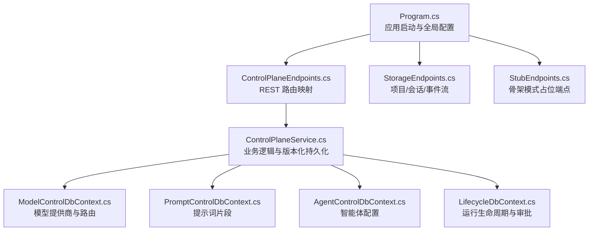
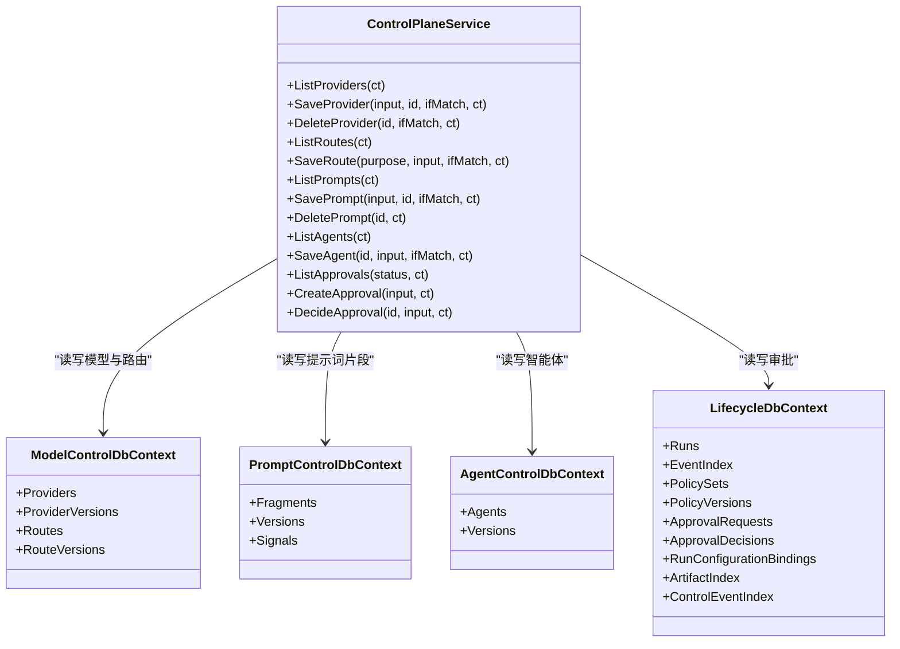
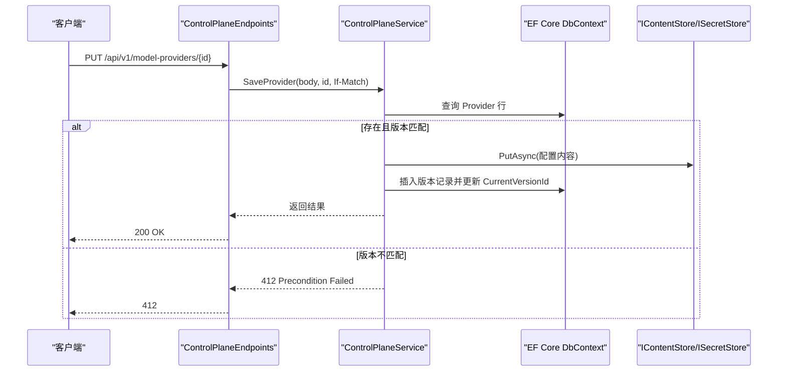

# 控制平面 API

<cite>
**本文引用的文件**
- [ControlPlaneEndpoints.cs](file://TinadecCore/Api/Endpoints/ControlPlaneEndpoints.cs)
- [ControlPlaneService.cs](file://TinadecCore/Runtime/ControlPlaneService.cs)
- [ModelControlDbContext.cs](file://TinadecCore/Models/ModelControlDbContext.cs)
- [PromptControlDbContext.cs](file://TinadecCore/Prompts/PromptControlDbContext.cs)
- [AgentControlDbContext.cs](file://TinadecCore/DmaEA/AgentControlDbContext.cs)
- [LifecycleDbContext.cs](file://TinadecCore/Lifecycle/LifecycleDbContext.cs)
- [Program.cs](file://TinadecCore/Api/Program.cs)
- [StorageEndpoints.cs](file://TinadecCore/Api/Endpoints/StorageEndpoints.cs)
- [StubEndpoints.cs](file://TinadecCore/Api/Endpoints/StubEndpoints.cs)
- [modelAgentCenter.ts](file://TinadecGateway/src/modelAgentCenter.ts)
- [approval.ts](file://TinadecGateway/src/approval.ts)
</cite>

## 目录
1. [简介](#简介)
2. [项目结构](#项目结构)
3. [核心组件](#核心组件)
4. [架构总览](#架构总览)
5. [详细端点说明](#详细端点说明)
6. [依赖关系分析](#依赖关系分析)
7. [性能与一致性](#性能与一致性)
8. [故障排查指南](#故障排查指南)
9. [结论](#结论)
10. [附录：客户端集成与最佳实践](#附录客户端集成与最佳实践)

## 简介
本文件为控制平面 RESTful API 的权威文档，覆盖以下能力域：
- 模型提供商管理（CRUD）
- 模型路由配置
- 提示词片段管理
- 智能体配置
- 审批系统

API 基于 ASP.NET Minimal APIs 实现，统一使用 snake_case JSON 序列化。所有写操作均支持乐观并发控制（If-Match），并返回标准化的错误响应。认证与授权由网关层或部署环境负责，控制平面本身不强制鉴权头。

## 项目结构
控制平面 API 位于 TinadecCore.Api，通过 Program 启动时注册健康、就绪、存储与控制平面等端点。控制平面端点集中在 ControlPlaneEndpoints，业务逻辑在 ControlPlaneService，数据访问通过多个 EF Core DbContext。

图表来源
- [Program.cs:10-40](file://TinadecCore/Api/Program.cs#L10-L40)
- [ControlPlaneEndpoints.cs:8-44](file://TinadecCore/Api/Endpoints/ControlPlaneEndpoints.cs#L8-L44)
- [ControlPlaneService.cs:14-27](file://TinadecCore/Runtime/ControlPlaneService.cs#L14-L27)
- [ModelControlDbContext.cs:5-12](file://TinadecCore/Models/ModelControlDbContext.cs#L5-L12)
- [PromptControlDbContext.cs:5-11](file://TinadecCore/Prompts/PromptControlDbContext.cs#L5-L11)
- [AgentControlDbContext.cs:5-10](file://TinadecCore/DmaEA/AgentControlDbContext.cs#L5-L10)
- [LifecycleDbContext.cs:5-17](file://TinadecCore/Lifecycle/LifecycleDbContext.cs#L5-L17)

章节来源
- [Program.cs:10-40](file://TinadecCore/Api/Program.cs#L10-L40)
- [ControlPlaneEndpoints.cs:8-44](file://TinadecCore/Api/Endpoints/ControlPlaneEndpoints.cs#L8-L44)

## 核心组件
- ControlPlaneService：封装模型提供商、路由、提示词片段、智能体与审批的核心逻辑，包含版本化存储、内容引用、密钥管理与乐观并发校验。
- 多个 DbContext：分别承载模型提供商与路由、提示词片段、智能体配置、运行生命周期与审批请求/决策。
- Endpoints：Minimal API 路由映射，统一解析 JSON 请求体与 If-Match 头。

章节来源
- [ControlPlaneService.cs:14-27](file://TinadecCore/Runtime/ControlPlaneService.cs#L14-L27)
- [ModelControlDbContext.cs:5-12](file://TinadecCore/Models/ModelControlDbContext.cs#L5-L12)
- [PromptControlDbContext.cs:5-11](file://TinadecCore/Prompts/PromptControlDbContext.cs#L5-L11)
- [AgentControlDbContext.cs:5-10](file://TinadecCore/DmaEA/AgentControlDbContext.cs#L5-L10)
- [LifecycleDbContext.cs:5-17](file://TinadecCore/Lifecycle/LifecycleDbContext.cs#L5-L17)

## 架构总览
控制平面采用“路由薄 + 服务厚”的分层设计：
- 路由层仅做参数绑定与反序列化
- 服务层处理领域逻辑、并发控制、版本化与内容存储
- 数据层通过 EF Core 多 DbContext 隔离不同聚合根

图表来源
- [ControlPlaneService.cs:14-27](file://TinadecCore/Runtime/ControlPlaneService.cs#L14-L27)
- [ModelControlDbContext.cs:5-12](file://TinadecCore/Models/ModelControlDbContext.cs#L5-L12)
- [PromptControlDbContext.cs:5-11](file://TinadecCore/Prompts/PromptControlDbContext.cs#L5-L11)
- [AgentControlDbContext.cs:5-10](file://TinadecCore/DmaEA/AgentControlDbContext.cs#L5-L10)
- [LifecycleDbContext.cs:5-17](file://TinadecCore/Lifecycle/LifecycleDbContext.cs#L5-L17)

## 详细端点说明

### 通用约定
- 基础路径：/api/v1
- 序列化：snake_case，忽略 null 字段
- 并发控制：写端点支持 If-Match 头，值为 revision；不匹配返回 412
- 租户/工作区：服务端从上下文注入，无需客户端传递
- 错误体：{ code, message, details? } 或具体字段错误

章节来源
- [Program.cs:12-18](file://TinadecCore/Api/Program.cs#L12-L18)
- [ControlPlaneService.cs:34-35](file://TinadecCore/Runtime/ControlPlaneService.cs#L34-L35)

### 模型提供商管理
- GET /api/v1/model-providers
  - 方法：GET
  - 描述：列出当前租户/工作区下的模型提供商实例
  - 成功响应：数组，每项包含 id、driver、display_name、connection_kind、base_url、model、has_api_key、binary_path、home_path、server_url、launch_args、capabilities、enabled、status、status_message、revision、scope、created_at、updated_at
  - 状态码：200
- POST /api/v1/model-providers
  - 方法：POST
  - 描述：创建新的模型提供商实例
  - 请求体：JSON 对象，关键字段包括 driver、display_name、connection_kind、scope、enabled、api_key（可选）、clear_api_key（可选）
  - 成功响应：同列表项结构
  - 状态码：200
  - 错误：412 若 If-Match 不匹配（更新场景）
- PUT /api/v1/model-providers/{id}
  - 方法：PUT
  - 描述：更新指定提供商实例（需 If-Match）
  - 请求体：同上
  - 成功响应：同列表项结构
  - 状态码：200/412
- DELETE /api/v1/model-providers/{id}
  - 方法：DELETE
  - 描述：软删除提供商实例（需 If-Match）
  - 成功响应：204 No Content
  - 状态码：404/412

章节来源
- [ControlPlaneEndpoints.cs:10-13](file://TinadecCore/Api/Endpoints/ControlPlaneEndpoints.cs#L10-L13)
- [ControlPlaneService.cs:36-50](file://TinadecCore/Runtime/ControlPlaneService.cs#L36-L50)
- [ModelControlDbContext.cs:15-27](file://TinadecCore/Models/ModelControlDbContext.cs#L15-L27)

### 模型路由配置
- GET /api/v1/model-routes
  - 方法：GET
  - 描述：列出路由（按 purpose 维度）
  - 成功响应：数组，每项包含 purpose、provider_instance_id、model、revision、updated_at
  - 状态码：200
- PUT /api/v1/model-routes/{purpose}
  - 方法：PUT
  - 描述：设置或更新某用途的路由（需 If-Match）
  - 请求体：{ provider_instance_id, model? }
  - 成功响应：{ purpose, provider_instance_id, model, revision, updated_at }
  - 状态码：200/400/412

章节来源
- [ControlPlaneEndpoints.cs:15-16](file://TinadecCore/Api/Endpoints/ControlPlaneEndpoints.cs#L15-L16)
- [ControlPlaneService.cs:51-54](file://TinadecCore/Runtime/ControlPlaneService.cs#L51-L54)
- [ModelControlDbContext.cs:28-37](file://TinadecCore/Models/ModelControlDbContext.cs#L28-L37)

### 提示词片段管理
- GET /api/v1/prompt-fragments
  - 方法：GET
  - 描述：列出片段（含当前版本内容）
  - 成功响应：数组，每项包含 id、key、title、scope、target_agent_id、category、content、priority、enabled、is_builtin、revision、created_at、updated_at
  - 状态码：200
- POST /api/v1/prompt-fragments
  - 方法：POST
  - 描述：创建新片段
  - 请求体：{ key?, title?, scope?, category?, priority?, enabled?, target_agent_id?, content? }
  - 成功响应：同列表项结构
  - 状态码：200/409（内置只读）
- PUT /api/v1/prompt-fragments/{id}
  - 方法：PUT
  - 描述：更新片段（需 If-Match）
  - 请求体：同上
  - 成功响应：同列表项结构
  - 状态码：200/409/412
- DELETE /api/v1/prompt-fragments/{id}
  - 方法：DELETE
  - 描述：软删除片段（内置只读）
  - 成功响应：204
  - 状态码：404/409
- 其他端点（占位/未启用）
  - POST /api/v1/prompt-fragments/{id}/clone → 501
  - GET /api/v1/prompt-fragments/{id}/versions → 200 空数组
  - POST /api/v1/prompt-fragments/{id}/versions → 501
  - POST /api/v1/prompt-fragments/{id}/rollback → 501
  - GET /api/v1/prompt-fragments/{id}/effectiveness → 200 默认值
  - GET /api/v1/prompt-fragments/effectiveness → 200 空数组
  - POST /api/v1/prompt-fragments/{id}/signals → 501
  - POST /api/v1/prompt-fragments/{id}/compare → 501
  - POST /api/v1/prompt-context/preview → 501

章节来源
- [ControlPlaneEndpoints.cs:20-32](file://TinadecCore/Api/Endpoints/ControlPlaneEndpoints.cs#L20-L32)
- [ControlPlaneService.cs:56-60](file://TinadecCore/Runtime/ControlPlaneService.cs#L56-L60)
- [PromptControlDbContext.cs:14-31](file://TinadecCore/Prompts/PromptControlDbContext.cs#L14-L31)

### 智能体配置
- GET /api/v1/agents
  - 方法：GET
  - 描述：列出智能体（含当前版本内容）
  - 成功响应：数组，每项包含 id、name、layer、agent_type、mode、description、model_route_purpose、allowed_tools、capabilities、system_prompt、enabled、is_built_in、revision、updated_at
  - 状态码：200
- PUT /api/v1/agents/{id}
  - 方法：PUT
  - 描述：保存智能体配置（需 If-Match）
  - 请求体：JSON 对象，至少包含 name、layer、agent_type；可选 mode、description、model_route_purpose、allowed_tools、capabilities、system_prompt、enabled
  - 成功响应：同列表项结构
  - 状态码：200/409（内置只读）/412
- 其他端点（占位/未启用）
  - PUT /api/v1/agents/{id}/mode → 501
  - GET /api/v1/agent-modes → 200 默认模式集合
  - GET /api/v1/agent-candidates → 200 空数组

章节来源
- [ControlPlaneEndpoints.cs:34-38](file://TinadecCore/Api/Endpoints/ControlPlaneEndpoints.cs#L34-L38)
- [ControlPlaneService.cs:62-65](file://TinadecCore/Runtime/ControlPlaneService.cs#L62-L65)
- [AgentControlDbContext.cs:10-22](file://TinadecCore/DmaEA/AgentControlDbContext.cs#L10-L22)

### 审批系统
- GET /api/v1/approvals?status=...
  - 方法：GET
  - 描述：列出审批请求（可按 status 过滤）
  - 成功响应：数组，每项包含 id、session_id、kind、tool_id、summary、status、request_hash、expires_at、created_at、updated_at
  - 状态码：200
- POST /api/v1/approvals
  - 方法：POST
  - 描述：创建审批请求
  - 请求体：{ session_id?, kind?, tool_id?, summary?, request_hash? }
  - 成功响应：{ id, session_id, kind, summary, status, created_at }
  - 状态码：200
- POST /api/v1/approvals/{id}/decision
  - 方法：POST
  - 描述：对审批请求做出决定（approved/rejected）
  - 请求体：{ decision, reason? }
  - 成功响应：{ id, status, decided_at }
  - 状态码：200/400/404/409（过期或不可操作）

章节来源
- [ControlPlaneEndpoints.cs:40-42](file://TinadecCore/Api/Endpoints/ControlPlaneEndpoints.cs#L40-L42)
- [ControlPlaneService.cs:67-69](file://TinadecCore/Runtime/ControlPlaneService.cs#L67-L69)
- [LifecycleDbContext.cs:79-86](file://TinadecCore/Lifecycle/LifecycleDbContext.cs#L79-L86)

### 模型模板与设置（只读/占位）
- GET /api/v1/model-provider-templates
  - 方法：GET
  - 描述：返回内置模板（如 OpenAI-compatible）
  - 成功响应：数组，包含 provider_family、driver、display_name、connection_kind、credential_kind、summary、contributor_description、default_base_url、default_model、default_timeout_seconds、capabilities
  - 状态码：200
- GET /api/v1/model-settings
  - 方法：GET
  - 描述：返回默认设置（占位）
  - 成功响应：{ base_url, model, has_api_key, revision, updated_at }
  - 状态码：200
- PUT /api/v1/model-settings
  - 方法：PUT
  - 描述：禁用直接写入设置，建议使用 model-providers
  - 成功响应：{ code: "capability_unavailable", message: "Use model-providers for persisted provider configuration." }
  - 状态码：501

章节来源
- [ControlPlaneEndpoints.cs:14-18](file://TinadecCore/Api/Endpoints/ControlPlaneEndpoints.cs#L14-L18)

## 依赖关系分析
- 路由到服务：ControlPlaneEndpoints 将 HTTP 请求映射到 ControlPlaneService 的方法
- 服务到数据：ControlPlaneService 通过 IDbContextFactory 获取各 DbContext，执行查询与变更
- 内容存储：服务内部通过 IContentStore 持久化大对象（配置、提示词、智能体配置），以引用形式关联版本记录
- 密钥存储：ISecretStore 用于安全存储 api_key 等敏感信息
- 租户上下文：ITenantContextAccessor 提供 TenantId/WorkspaceId 等上下文

图表来源
- [ControlPlaneEndpoints.cs:12](file://TinadecCore/Api/Endpoints/ControlPlaneEndpoints.cs#L12)
- [ControlPlaneService.cs:44-48](file://TinadecCore/Runtime/ControlPlaneService.cs#L44-L48)

章节来源
- [ControlPlaneService.cs:14-27](file://TinadecCore/Runtime/ControlPlaneService.cs#L14-L27)

## 性能与一致性
- 乐观并发：所有写端点通过 If-Match 校验 revision，避免覆盖冲突
- 版本化：配置与内容分离，每次更新生成新版本记录，便于审计与回滚
- 内容引用：大对象通过 IContentStore 存储，数据库仅保留引用与哈希
- 索引策略：DbContext 中为常用查询建立复合索引（租户/工作区/键/时间戳等）
- 批量读取：列表接口一次性加载并按租户/工作区过滤

章节来源
- [ModelControlDbContext.cs:15-37](file://TinadecCore/Models/ModelControlDbContext.cs#L15-L37)
- [PromptControlDbContext.cs:14-31](file://TinadecCore/Prompts/PromptControlDbContext.cs#L14-L31)
- [AgentControlDbContext.cs:10-22](file://TinadecCore/DmaEA/AgentControlDbContext.cs#L10-L22)
- [LifecycleDbContext.cs:79-86](file://TinadecCore/Lifecycle/LifecycleDbContext.cs#L79-L86)

## 故障排查指南
- 412 Precondition Failed：If-Match 不匹配，检查 revision 是否最新
- 404 Not Found：资源不存在或被软删除
- 409 Conflict：尝试修改内置资源（提示词片段/智能体）
- 400 Bad Request：必填字段缺失或格式错误（如 provider_instance_id）
- 501 Not Implemented：部分功能尚未启用（克隆、比较、信号、预览等）
- 健康与就绪：
  - GET /api/v1/health → 返回名称、状态、版本、时间
  - GET /api/v1/readiness → 框架就绪、模块状态、存储探针

章节来源
- [ControlPlaneService.cs:44-50](file://TinadecCore/Runtime/ControlPlaneService.cs#L44-L50)
- [ControlPlaneService.cs:56-60](file://TinadecCore/Runtime/ControlPlaneService.cs#L56-L60)
- [ControlPlaneService.cs:67-69](file://TinadecCore/Runtime/ControlPlaneService.cs#L67-L69)
- [Program.cs:44-53](file://TinadecCore/Api/Program.cs#L44-L53)
- [Program.cs:122-164](file://TinadecCore/Api/Program.cs#L122-L164)

## 结论
控制平面 API 提供了稳定、可审计、可扩展的配置管理能力，适用于模型提供商、路由、提示词片段与智能体的集中式治理。通过版本化与乐观并发，确保在多用户与自动化流程中的强一致性与可追溯性。

## 附录：客户端集成与最佳实践
- 认证与授权
  - 控制平面不强制鉴权头；建议在网关层或反向代理进行认证与权限控制
- 并发控制
  - 所有写端点必须携带 If-Match: <revision>，失败后重试前重新拉取最新 revision
- 错误处理
  - 统一解析 { code, message, details? } 结构，区分 4xx/5xx 语义
- 请求示例（概念性）
  - 创建提供商：POST /api/v1/model-providers，body 包含 driver、display_name、connection_kind、scope、enabled、api_key
  - 更新路由：PUT /api/v1/model-routes/{purpose}，body 包含 provider_instance_id、model
  - 创建片段：POST /api/v1/prompt-fragments，body 包含 key、title、scope、category、priority、enabled、target_agent_id、content
  - 保存智能体：PUT /api/v1/agents/{id}，body 包含 name、layer、agent_type、mode、description、model_route_purpose、allowed_tools、capabilities、system_prompt、enabled
  - 创建审批：POST /api/v1/approvals，body 包含 session_id、kind、tool_id、summary、request_hash
  - 审批决策：POST /api/v1/approvals/{id}/decision，body 包含 decision（approved/rejected）、reason
- 响应格式
  - 列表接口返回数组，单项结构与对应实体字段一致
  - 写接口返回实体对象，包含 revision、updated_at 等元数据
- 网关与前端集成
  - Gateway 侧 modelAgentCenter.ts 聚合模板、提供商、路由与智能体，形成概览视图
  - approval.ts 定义了人类操作的二次确认流程（高风险工具），与 Core 审批门协同

章节来源
- [modelAgentCenter.ts:368-459](file://TinadecGateway/src/modelAgentCenter.ts#L368-L459)
- [approval.ts:145-197](file://TinadecGateway/src/approval.ts#L145-L197)
- [ControlPlaneEndpoints.cs:10-42](file://TinadecCore/Api/Endpoints/ControlPlaneEndpoints.cs#L10-L42)
- [ControlPlaneService.cs:36-69](file://TinadecCore/Runtime/ControlPlaneService.cs#L36-L69)