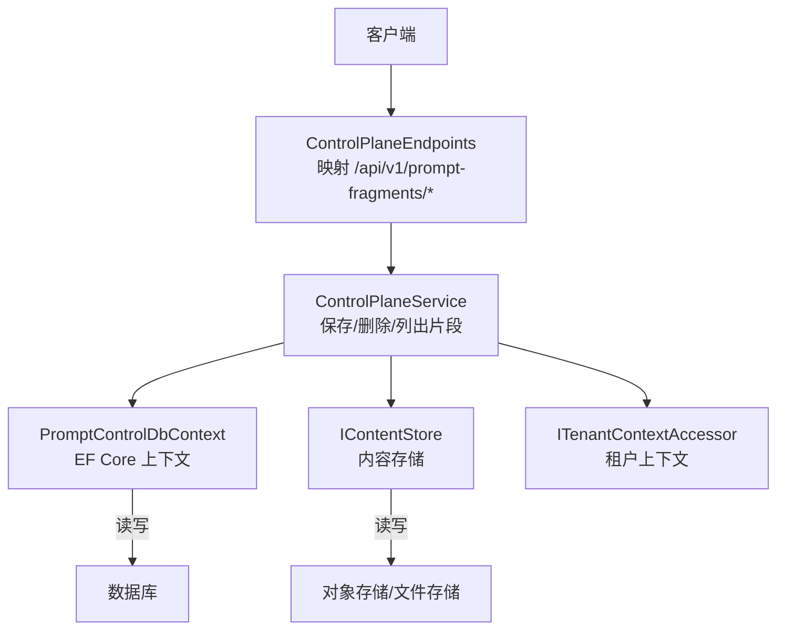
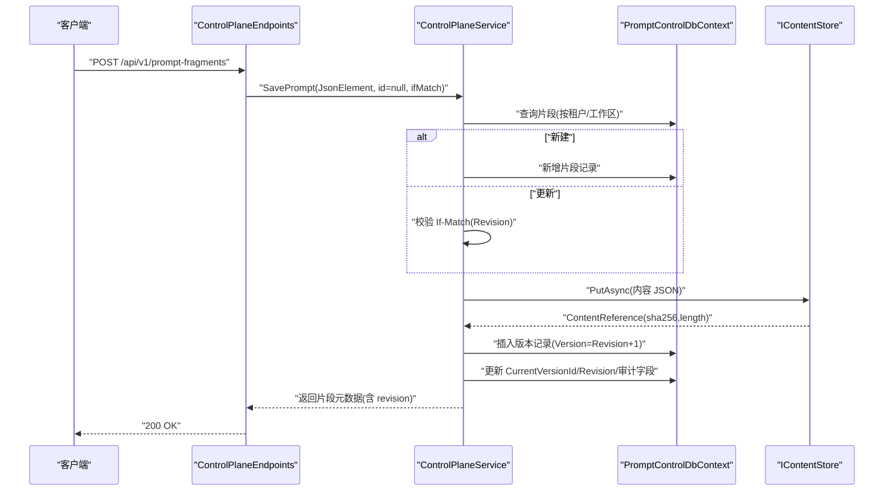
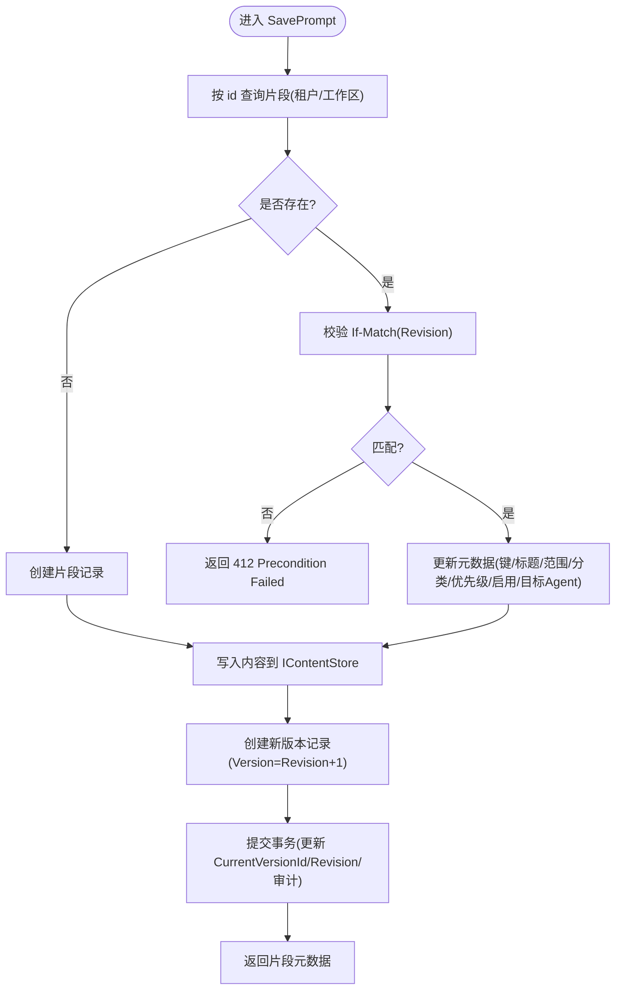
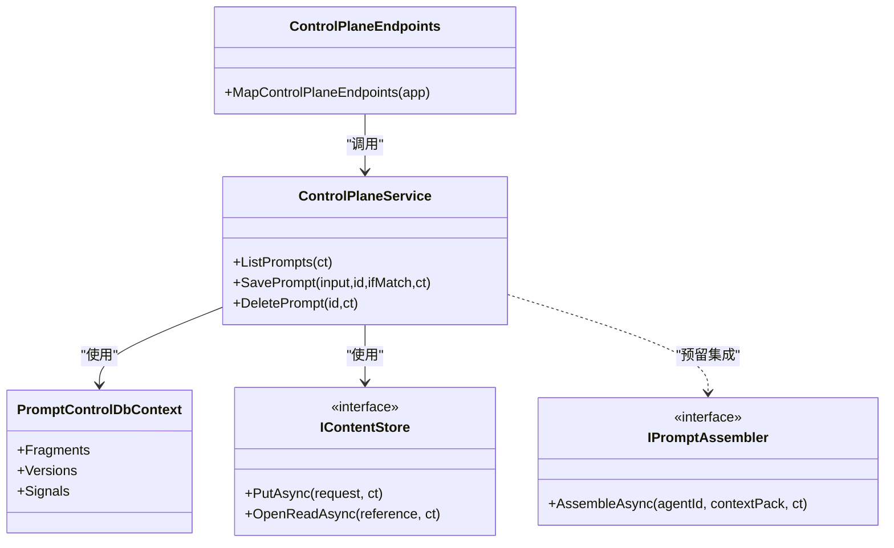

# 提示词片段管理 API

<cite>
**本文引用的文件**
- [ControlPlaneEndpoints.cs](file://TinadecCore/Api/Endpoints/ControlPlaneEndpoints.cs)
- [ControlPlaneService.cs](file://TinadecCore/Runtime/ControlPlaneService.cs)
- [PromptControlDbContext.cs](file://TinadecCore/Prompts/PromptControlDbContext.cs)
- [IPromptAssembler.cs](file://TinadecCore/Abstractions/Ports/IPromptAssembler.cs)
- [StorageEndpoints.cs](file://TinadecCore/Api/Endpoints/StorageEndpoints.cs)
- [StubEndpoints.cs](file://TinadecCore/Api/Endpoints/StubEndpoints.cs)
</cite>

## 目录
1. [简介](#简介)
2. [项目结构](#项目结构)
3. [核心组件](#核心组件)
4. [架构总览](#架构总览)
5. [详细组件分析](#详细组件分析)
6. [依赖关系分析](#依赖关系分析)
7. [性能考虑](#性能考虑)
8. [故障排查指南](#故障排查指南)
9. [结论](#结论)
10. [附录](#附录)

## 简介
本文件面向“提示词片段管理”API，覆盖完整生命周期（CRUD）、版本控制、克隆占位、回滚占位、效果评估与信号记录、比较能力以及上下文预览等。当前实现以控制面端点与领域服务为核心，数据模型与持久化由 EF Core 提供，内容存储通过 IContentStore 抽象。部分高级能力（克隆、版本创建、回滚、信号记录、比较、上下文预览）在骨架模式下返回“未启用/不可用”，但接口契约已定义，便于后续扩展。

## 项目结构
- 控制面端点：统一注册 /api/v1/prompt-fragments/* 路由，调用 ControlPlaneService 处理业务。
- 领域服务：ControlPlaneService 负责片段 CRUD、版本化、内容落盘、并发控制（If-Match）。
- 数据访问：PromptControlDbContext 定义片段、版本、信号三张表及索引。
- 内容存储：IContentStore 用于存放片段内容（JSON），版本记录包含引用与哈希。
- 上下文装配：IPromptAssembler 定义确定性的提示词组装接口（当前用于预览与内存调用）。

图表来源
- [ControlPlaneEndpoints.cs:20-32](file://TinadecCore/Api/Endpoints/ControlPlaneEndpoints.cs#L20-L32)
- [ControlPlaneService.cs:56-60](file://TinadecCore/Runtime/ControlPlaneService.cs#L56-L60)
- [PromptControlDbContext.cs:12-33](file://TinadecCore/Prompts/PromptControlDbContext.cs#L12-L33)

章节来源
- [ControlPlaneEndpoints.cs:20-32](file://TinadecCore/Api/Endpoints/ControlPlaneEndpoints.cs#L20-L32)
- [ControlPlaneService.cs:56-60](file://TinadecCore/Runtime/ControlPlaneService.cs#L56-L60)
- [PromptControlDbContext.cs:12-33](file://TinadecCore/Prompts/PromptControlDbContext.cs#L12-L33)

## 核心组件
- 控制面端点（ControlPlaneEndpoints）
  - GET /api/v1/prompt-fragments：列出片段（含当前版本内容）。
  - POST /api/v1/prompt-fragments：创建片段并生成首个版本。
  - PUT /api/v1/prompt-fragments/{id}：更新片段（若存在则按 If-Match 校验）。
  - DELETE /api/v1/prompt-fragments/{id}：软删除片段。
  - POST /api/v1/prompt-fragments/{id}/clone：占位（返回 501，需显式新身份）。
  - GET/POST /api/v1/prompt-fragments/{id}/versions：列表/创建版本（占位）。
  - POST /api/v1/prompt-fragments/{id}/rollback：占位（运行时未启用）。
  - GET /api/v1/prompt-fragments/{id}/effectiveness：单片段效果概览（默认值）。
  - GET /api/v1/prompt-fragments/effectiveness：批量效果概览（空数组）。
  - POST /api/v1/prompt-fragments/{id}/signals：信号记录（占位，需要活跃运行）。
  - POST /api/v1/prompt-fragments/{id}/compare：比较（占位，需要版本遥测）。
  - POST /api/v1/prompt-context/preview：上下文预览（占位，需要装配器运行时）。

- 领域服务（ControlPlaneService）
  - ListPrompts：按租户/工作区过滤，读取当前版本内容并返回。
  - SavePrompt：幂等写入（支持 If-Match 乐观锁），将内容写入 IContentStore，创建新版本记录。
  - DeletePrompt：软删除（内置片段只读保护）。

- 数据模型（PromptControlDbContext）
  - 片段表 prompt_fragments：键 Key、标题 Title、范围 Scope、分类 Category、目标 AgentId、优先级、启用状态、是否内置、修订号、当前版本 Id、审计字段、时间戳、软删除。
  - 版本表 prompt_fragment_versions：片段关联、版本号、内容引用、内容哈希、长度、变更摘要、审计字段。
  - 信号表 prompt_fragment_signals：片段关联、版本、运行/会话标识、信号类型、审计字段。
  - 唯一索引：(TenantId, WorkspaceId, ProjectId, Key, TargetAgentId, DeletedAt)；版本唯一索引 (FragmentId, Version)。

- 上下文装配（IPromptAssembler）
  - AssembleAsync：根据 AgentId 与 ContextPack 确定性组装指令与估计 Token 数，返回警告与片段 ID 列表。

章节来源
- [ControlPlaneEndpoints.cs:20-32](file://TinadecCore/Api/Endpoints/ControlPlaneEndpoints.cs#L20-L32)
- [ControlPlaneService.cs:56-60](file://TinadecCore/Runtime/ControlPlaneService.cs#L56-L60)
- [PromptControlDbContext.cs:12-33](file://TinadecCore/Prompts/PromptControlDbContext.cs#L12-L33)
- [IPromptAssembler.cs:1-23](file://TinadecCore/Abstractions/Ports/IPromptAssembler.cs#L1-L23)

## 架构总览
下图展示从 HTTP 请求到数据持久化的端到端流程，包括内容存储与版本化。

图表来源
- [ControlPlaneEndpoints.cs:20-22](file://TinadecCore/Api/Endpoints/ControlPlaneEndpoints.cs#L20-L22)
- [ControlPlaneService.cs:58-59](file://TinadecCore/Runtime/ControlPlaneService.cs#L58-L59)

## 详细组件分析

### 片段 CRUD 操作
- GET /api/v1/prompt-fragments
  - 行为：按租户/工作区过滤，加载每个片段的当前版本内容，返回列表。
  - 复杂度：O(N) 读取 N 个片段及其版本内容。
  - 错误：无特定错误码，正常返回空数组或集合。
- POST /api/v1/prompt-fragments
  - 行为：创建片段，首次写入内容并生成版本 1。
  - 输入：key/title/scope/category/target_agent_id/priority/enabled/content。
  - 输出：片段元数据（含 revision）。
- PUT /api/v1/prompt-fragments/{id}
  - 行为：更新片段元数据与内容，创建新版本。
  - 并发：If-Match 头必须匹配 Revision，否则返回 412。
- DELETE /api/v1/prompt-fragments/{id}
  - 行为：软删除（DeletedAt 赋值），内置片段只读冲突返回 409。

图表来源
- [ControlPlaneService.cs:58-60](file://TinadecCore/Runtime/ControlPlaneService.cs#L58-L60)

章节来源
- [ControlPlaneEndpoints.cs:20-23](file://TinadecCore/Api/Endpoints/ControlPlaneEndpoints.cs#L20-L23)
- [ControlPlaneService.cs:56-60](file://TinadecCore/Runtime/ControlPlaneService.cs#L56-L60)

### 版本管理与回滚
- 版本列表：GET /api/v1/prompt-fragments/{id}/versions（当前返回空数组，占位）。
- 版本创建：POST /api/v1/prompt-fragments/{id}/versions（返回 501，建议使用 PUT 创建不可变版本）。
- 回滚：POST /api/v1/prompt-fragments/{id}/rollback（返回 501，运行时未启用）。
- 说明：当前版本化由 SavePrompt 自动推进 Revision 并创建新版本；回滚可通过再次 PUT 指定历史版本内容实现（需上层逻辑配合）。

章节来源
- [ControlPlaneEndpoints.cs:25-27](file://TinadecCore/Api/Endpoints/ControlPlaneEndpoints.cs#L25-L27)
- [ControlPlaneService.cs:58-60](file://TinadecCore/Runtime/ControlPlaneService.cs#L58-L60)

### 片段克隆
- 端点：POST /api/v1/prompt-fragments/{id}/clone（返回 501，要求显式新片段身份）。
- 建议实践：调用方先获取源片段内容，再 POST 创建新片段，并将原 key/title 等元数据复制为新片段。

章节来源
- [ControlPlaneEndpoints.cs:24](file://TinadecCore/Api/Endpoints/ControlPlaneEndpoints.cs#L24)

### 效果评估与信号记录
- 单片段效果：GET /api/v1/prompt-fragments/{id}/effectiveness（返回默认统计与 last_evaluated_at）。
- 批量效果：GET /api/v1/prompt-fragments/effectiveness（返回空数组）。
- 信号记录：POST /api/v1/prompt-fragments/{id}/signals（返回 501，需要活跃运行上下文）。
- 数据模型：prompt_fragment_signals 表已就绪，可记录 FragmentId、Version、RunId、SessionId、Signal 等。

章节来源
- [ControlPlaneEndpoints.cs:28-30](file://TinadecCore/Api/Endpoints/ControlPlaneEndpoints.cs#L28-L30)
- [PromptControlDbContext.cs:27-31](file://TinadecCore/Prompts/PromptControlDbContext.cs#L27-L31)

### 比较功能
- 端点：POST /api/v1/prompt-fragments/{id}/compare（返回 501，需要版本遥测）。
- 建议实践：基于 Versions 表与 IContentStore 的内容差异计算，结合 Signals 进行 A/B 对比。

章节来源
- [ControlPlaneEndpoints.cs:31](file://TinadecCore/Api/Endpoints/ControlPlaneEndpoints.cs#L31)

### 上下文预览
- 端点：POST /api/v1/prompt-context/preview（返回 501，需要活跃的上下文装配器运行时）。
- 接口：IPromptAssembler.AssembleAsync 提供确定性组装能力，适合在 UI 中预览最终指令与 Token 估算。

章节来源
- [ControlPlaneEndpoints.cs:32](file://TinadecCore/Api/Endpoints/ControlPlaneEndpoints.cs#L32)
- [IPromptAssembler.cs:1-23](file://TinadecCore/Abstractions/Ports/IPromptAssembler.cs#L1-L23)

## 依赖关系分析
- 端点层依赖领域服务（ControlPlaneService），服务依赖 EF Core 上下文与 IContentStore。
- 数据模型与索引确保片段唯一性与版本唯一性。
- 租户隔离通过 ITenantContextAccessor 注入，所有查询均限定 TenantId/WorkspaceId。

图表来源
- [ControlPlaneEndpoints.cs:20-32](file://TinadecCore/Api/Endpoints/ControlPlaneEndpoints.cs#L20-L32)
- [ControlPlaneService.cs:56-60](file://TinadecCore/Runtime/ControlPlaneService.cs#L56-L60)
- [PromptControlDbContext.cs:12-33](file://TinadecCore/Prompts/PromptControlDbContext.cs#L12-L33)
- [IPromptAssembler.cs:1-23](file://TinadecCore/Abstractions/Ports/IPromptAssembler.cs#L1-L23)

章节来源
- [ControlPlaneEndpoints.cs:20-32](file://TinadecCore/Api/Endpoints/ControlPlaneEndpoints.cs#L20-L32)
- [ControlPlaneService.cs:56-60](file://TinadecCore/Runtime/ControlPlaneService.cs#L56-L60)
- [PromptControlDbContext.cs:12-33](file://TinadecCore/Prompts/PromptControlDbContext.cs#L12-L33)

## 性能考虑
- 列表性能：ListPrompts 对每个片段额外读取一次版本内容，N 片段即 N 次 I/O。建议在高频场景下缓存片段元数据与最近版本内容，或在服务端聚合读取。
- 版本化开销：每次 SavePrompt 都会写入内容存储并插入版本记录，注意内容大小与写入频率。
- 并发控制：使用 If-Match 避免覆盖更新，减少冲突重试成本。
- 信号与评估：Signals 写入应批量化，避免频繁小写；评估端点可引入异步计算与结果缓存。

[本节为通用指导，不直接分析具体文件]

## 故障排查指南
- 412 Precondition Failed：PUT/POST 的 If-Match 与服务器 Revision 不一致，需重新拉取最新数据后重试。
- 409 Conflict：尝试修改内置片段（IsBuiltIn=true）或被克隆保护的实体。
- 501 Not Implemented：克隆、版本创建、回滚、信号记录、比较、上下文预览在当前骨架模式未启用，需后续实现。
- 404 Not Found：删除或查询时片段不存在。
- 事件回放与调试：可使用 StorageEndpoints 的事件流端点辅助定位问题（适用于会话/运行相关事件）。

章节来源
- [ControlPlaneService.cs:58-60](file://TinadecCore/Runtime/ControlPlaneService.cs#L58-L60)
- [ControlPlaneEndpoints.cs:24-32](file://TinadecCore/Api/Endpoints/ControlPlaneEndpoints.cs#L24-L32)
- [StorageEndpoints.cs:77-90](file://TinadecCore/Api/Endpoints/StorageEndpoints.cs#L77-L90)

## 结论
当前提示词片段管理 API 已具备完整的 CRUD 与版本化基础能力，并通过 IContentStore 与 EF Core 实现了内容与元数据的分离与一致性。高级特性（克隆、回滚、信号、比较、上下文预览）以占位形式暴露，便于后续逐步实现。建议在生产环境优先完善信号采集与效果评估，结合 IPromptAssembler 提供稳定的上下文预览能力，形成闭环优化。

[本节为总结，不直接分析具体文件]

## 附录

### API 参考（片段）
- GET /api/v1/prompt-fragments
  - 描述：列出片段（含当前版本内容）
  - 响应：片段数组（id/key/title/scope/target_agent_id/category/content/priority/enabled/is_builtin/revision/created_at/updated_at）
- POST /api/v1/prompt-fragments
  - 描述：创建片段并生成版本 1
  - 请求体：key/title/scope/category/target_agent_id/priority/enabled/content
  - 响应：片段元数据（含 revision）
- PUT /api/v1/prompt-fragments/{id}
  - 描述：更新片段与内容，创建新版本
  - 请求头：If-Match: <revision>
  - 响应：片段元数据（含 revision）
- DELETE /api/v1/prompt-fragments/{id}
  - 描述：软删除片段
  - 响应：204 No Content
- POST /api/v1/prompt-fragments/{id}/clone
  - 描述：克隆（占位，返回 501）
- GET /api/v1/prompt-fragments/{id}/versions
  - 描述：版本列表（占位，返回空数组）
- POST /api/v1/prompt-fragments/{id}/versions
  - 描述：创建版本（占位，返回 501）
- POST /api/v1/prompt-fragments/{id}/rollback
  - 描述：回滚（占位，返回 501）
- GET /api/v1/prompt-fragments/{id}/effectiveness
  - 描述：单片段效果概览（默认值）
- GET /api/v1/prompt-fragments/effectiveness
  - 描述：批量效果概览（空数组）
- POST /api/v1/prompt-fragments/{id}/signals
  - 描述：信号记录（占位，返回 501）
- POST /api/v1/prompt-context/preview
  - 描述：上下文预览（占位，返回 501）

章节来源
- [ControlPlaneEndpoints.cs:20-32](file://TinadecCore/Api/Endpoints/ControlPlaneEndpoints.cs#L20-L32)

### 数据模型（片段/版本/信号）
- 片段（prompt_fragments）
  - 主键：Id
  - 唯一索引：(TenantId, WorkspaceId, ProjectId, Key, TargetAgentId, DeletedAt)
  - 关键字段：Key/Title/Scope/Category/TargetAgentId/Priority/Enabled/IsBuiltIn/Revision/CurrentVersionId/CreatedByPrincipalId/UpdatedByPrincipalId/CreatedAt/UpdatedAt/DeletedAt
- 版本（prompt_fragment_versions）
  - 主键：Id
  - 唯一索引：(FragmentId, Version)
  - 关键字段：FragmentId/Version/ContentReference/ContentHash/ContentLength/ChangeSummary/CreatedByPrincipalId/CreatedAt
- 信号（prompt_fragment_signals）
  - 主键：Id
  - 索引：(FragmentId, Version, CreatedAt)
  - 关键字段：FragmentId/Version/RunId/SessionId/Signal/CreatedByPrincipalId/CreatedAt

章节来源
- [PromptControlDbContext.cs:14-31](file://TinadecCore/Prompts/PromptControlDbContext.cs#L14-L31)

### 最佳实践示例
- 版本控制
  - 每次更新都通过 PUT 创建不可变版本，保留 Revision 与 ContentHash，便于审计与回滚。
- 效果追踪
  - 在运行过程中记录 Signals（如 positive/negative），定期汇总至 effectiveness 端点。
- 性能监控
  - 监控 SavePrompt 的 I/O 耗时与版本增长速率；对 ListPrompts 增加缓存策略。
- 上下文预览
  - 集成 IPromptAssembler 在 UI 中预览最终指令与 Token 估算，辅助提示词工程迭代。

[本节为通用指导，不直接分析具体文件]