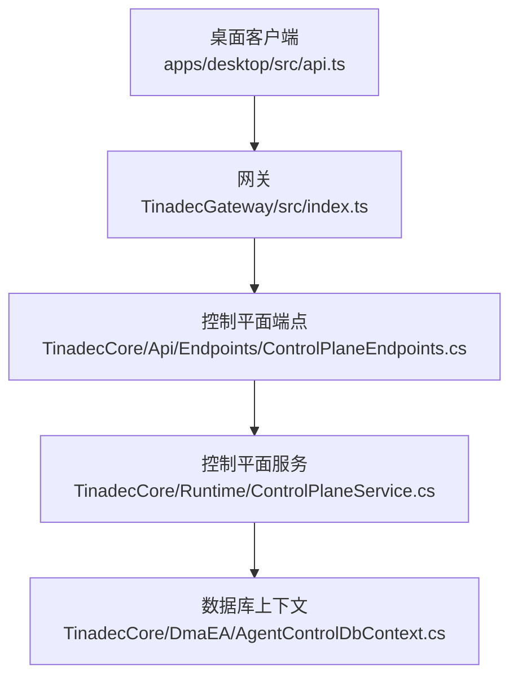
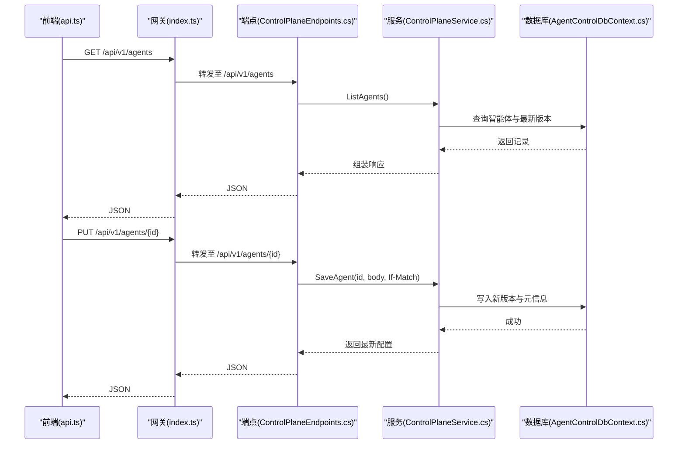
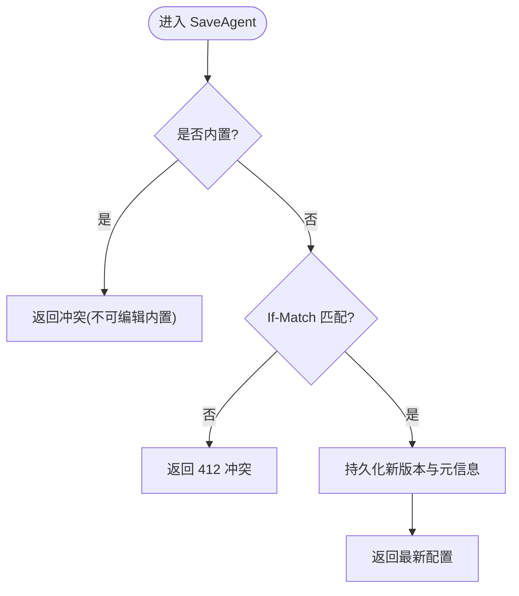
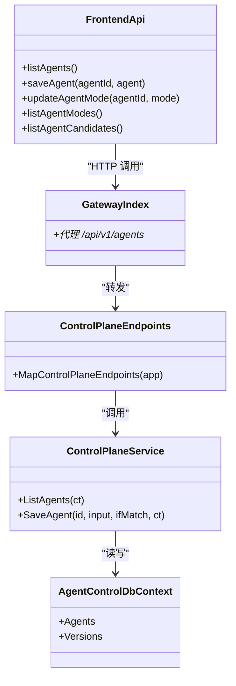

# 智能体管理 API

<cite>
**本文引用的文件**   
- [ControlPlaneEndpoints.cs](file://TinadecCore\Api\Endpoints\ControlPlaneEndpoints.cs)
- [ControlPlaneService.cs](file://TinadecCore\Runtime\ControlPlaneService.cs)
- [AgentControlDbContext.cs](file://TinadecCore\DmaEA\AgentControlDbContext.cs)
- [index.ts](file://TinadecGateway\src\index.ts)
- [modelAgentCenter.ts](file://TinadecGateway\src\modelAgentCenter.ts)
- [api.ts](file://apps\desktop\src\api.ts)
- [mode.ts](file://apps\desktop\src\types\mode.ts)
</cite>

## 目录
1. [简介](#简介)
2. [项目结构](#项目结构)
3. [核心组件](#核心组件)
4. [架构总览](#架构总览)
5. [详细组件分析](#详细组件分析)
6. [依赖关系分析](#依赖关系分析)
7. [性能考虑](#性能考虑)
8. [故障排查指南](#故障排查指南)
9. [结论](#结论)
10. [附录](#附录)

## 简介
本文件面向“智能体管理”相关 API，覆盖以下能力：
- 查询智能体列表：GET /api/v1/agents
- 更新智能体配置：PUT /api/v1/agents/{id}
- 模式切换（当前为预留能力）：PUT /api/v1/agents/{id}/mode
- 可用模式列表：GET /api/v1/agent-modes
- 候选智能体查询：GET /api/v1/agent-candidates

同时说明智能体配置结构、模式参数与工作树隔离选项，并提供配置示例、模式选择策略与性能调优建议。

## 项目结构
- Core 层提供控制平面端点与服务实现，负责智能体的持久化与版本化管理。
- Gateway 层对 Core 的 API 进行转发与聚合，并对外暴露统一入口。
- Desktop 前端通过 api.ts 调用 Gateway/Core 接口，完成智能体配置与模式管理。

**图表来源** 
- [ControlPlaneEndpoints.cs:34-38](file://TinadecCore\Api\Endpoints\ControlPlaneEndpoints.cs#L34-L38)
- [ControlPlaneService.cs:62-66](file://TinadecCore\Runtime\ControlPlaneService.cs#L62-L66)
- [AgentControlDbContext.cs:5-27](file://TinadecCore\DmaEA\AgentControlDbContext.cs#L5-L27)
- [index.ts:618-637](file://TinadecGateway\src\index.ts#L618-L637)

**章节来源**
- [ControlPlaneEndpoints.cs:34-38](file://TinadecCore\Api\Endpoints\ControlPlaneEndpoints.cs#L34-L38)
- [index.ts:618-637](file://TinadecGateway\src\index.ts#L618-L637)

## 核心组件
- 控制平面端点：定义 /api/v1/agents、/api/v1/agents/{id}、/api/v1/agents/{id}/mode、/api/v1/agent-modes、/api/v1/agent-candidates 等路由。
- 控制平面服务：实现 ListAgents、SaveAgent 等逻辑，读取/写入 AgentProfile 及其版本内容，返回标准化 JSON。
- 数据模型：AgentProfileRecord 与 AgentProfileVersionRecord 用于存储智能体元信息与版本化的配置内容。
- 网关转发：将前端请求代理到 Core 对应端点。
- 前端封装：在 api.ts 中提供 listAgents、saveAgent、updateAgentMode、listAgentModes、listAgentCandidates 等方法。

**章节来源**
- [ControlPlaneEndpoints.cs:34-38](file://TinadecCore\Api\Endpoints\ControlPlaneEndpoints.cs#L34-L38)
- [ControlPlaneService.cs:62-66](file://TinadecCore\Runtime\ControlPlaneService.cs#L62-L66)
- [AgentControlDbContext.cs:12-27](file://TinadecCore\DmaEA\AgentControlDbContext.cs#L12-L27)
- [index.ts:618-637](file://TinadecGateway\src\index.ts#L618-L637)
- [api.ts:1124-1216](file://apps\desktop\src\api.ts#L1124-L1216)

## 架构总览
下图展示了从前端到后端的数据流与职责划分。

**图表来源** 
- [ControlPlaneEndpoints.cs:34-36](file://TinadecCore\Api\Endpoints\ControlPlaneEndpoints.cs#L34-L36)
- [ControlPlaneService.cs:62-66](file://TinadecCore\Runtime\ControlPlaneService.cs#L62-L66)
- [AgentControlDbContext.cs:12-27](file://TinadecCore\DmaEA\AgentControlDbContext.cs#L12-L27)
- [index.ts:618-637](file://TinadecGateway\src\index.ts#L618-L637)

## 详细组件分析

### 智能体查询 GET /api/v1/agents
- 功能：列出当前租户与工作区下的智能体，包含 mode、description、model_route_purpose、allowed_tools、capabilities、system_prompt、enabled、is_built_in、revision、updated_at 等字段。
- 数据来源：AgentProfiles 表 + Versions 表中的 ContentReference，实际配置内容存储在内容存储中。
- 响应结构要点：
  - id、name、layer、agent_type：智能体标识与分类
  - mode：当前模式（字符串）
  - description：描述
  - model_route_purpose：模型路由用途键
  - allowed_tools：允许的工具集合
  - capabilities：能力集合
  - system_prompt：系统提示词
  - enabled：是否启用
  - is_built_in：是否内置
  - revision、updated_at：版本与更新时间

**章节来源**
- [ControlPlaneEndpoints.cs:34](file://TinadecCore\Api\Endpoints\ControlPlaneEndpoints.cs#L34)
- [ControlPlaneService.cs:62-63](file://TinadecCore\Runtime\ControlPlaneService.cs#L62-L63)

### 智能体更新 PUT /api/v1/agents/{id}
- 功能：保存或更新指定智能体的配置，支持乐观锁（If-Match）。
- 输入字段：
  - name、layer、agent_type、mode、description、model_route_purpose、allowed_tools、capabilities、system_prompt、enabled
- 行为：
  - 若 IsBuiltIn 为 true，则拒绝修改（需先克隆）
  - 若 revision 不匹配，返回 412
  - 成功后创建新版本记录，并返回最新配置快照

**图表来源** 
- [ControlPlaneService.cs:64-65](file://TinadecCore\Runtime\ControlPlaneService.cs#L64-L65)

**章节来源**
- [ControlPlaneEndpoints.cs:35](file://TinadecCore\Api\Endpoints\ControlPlaneEndpoints.cs#L35)
- [ControlPlaneService.cs:64-66](file://TinadecCore\Runtime\ControlPlaneService.cs#L64-L66)

### 模式切换 PUT /api/v1/agents/{id}/mode
- 当前状态：预留能力，返回 501，提示需要通过“版本化配置更新”来变更模式。
- 建议做法：使用 PUT /api/v1/agents/{id} 更新 mode 字段。

**章节来源**
- [ControlPlaneEndpoints.cs:36](file://TinadecCore\Api\Endpoints\ControlPlaneEndpoints.cs#L36)

### 可用模式列表 GET /api/v1/agent-modes
- 功能：返回可用的智能体模式定义，包括：
  - id：模式标识
  - display_name：显示名称
  - summary：摘要
  - max_parallel_executors：最大并行执行器数
  - worktree_isolation：工作树隔离开关
  - approval_required：是否需要审批
  - budget_policy：预算策略（如 bounded）

**章节来源**
- [ControlPlaneEndpoints.cs:37](file://TinadecCore\Api\Endpoints\ControlPlaneEndpoints.cs#L37)

### 候选智能体查询 GET /api/v1/agent-candidates
- 功能：返回候选智能体列表（当前为空数组），可用于演进/推荐场景。

**章节来源**
- [ControlPlaneEndpoints.cs:38](file://TinadecCore\Api\Endpoints\ControlPlaneEndpoints.cs#L38)

### 前端与网关集成
- 前端 api.ts 提供：
  - listAgents：获取智能体列表
  - saveAgent：更新智能体配置
  - updateAgentMode：尝试模式切换（受限于服务端能力）
  - listAgentModes：获取可用模式
  - listAgentCandidates：获取候选智能体
- 网关 index.ts 将上述路径代理到 Core 对应端点。

**章节来源**
- [api.ts:1124-1216](file://apps\desktop\src\api.ts#L1124-L1216)
- [index.ts:618-637](file://TinadecGateway\src\index.ts#L618-L637)

## 依赖关系分析
- 端点依赖服务：ControlPlaneEndpoints 调用 ControlPlaneService 的方法。
- 服务依赖数据访问：ControlPlaneService 通过 AgentControlDbContext 访问数据库，并通过内容存储读写版本化的配置内容。
- 网关依赖端点：Gateway 将请求转发到 Core 的控制平面端点。
- 前端依赖网关：Desktop 前端通过 api.ts 调用 Gateway，再由 Gateway 转发到 Core。

**图表来源** 
- [ControlPlaneEndpoints.cs:34-38](file://TinadecCore\Api\Endpoints\ControlPlaneEndpoints.cs#L34-L38)
- [ControlPlaneService.cs:62-66](file://TinadecCore\Runtime\ControlPlaneService.cs#L62-L66)
- [AgentControlDbContext.cs:5-27](file://TinadecCore\DmaEA\AgentControlDbContext.cs#L5-L27)
- [index.ts:618-637](file://TinadecGateway\src\index.ts#L618-L637)
- [api.ts:1124-1216](file://apps\desktop\src\api.ts#L1124-L1216)

**章节来源**
- [ControlPlaneEndpoints.cs:34-38](file://TinadecCore\Api\Endpoints\ControlPlaneEndpoints.cs#L34-L38)
- [ControlPlaneService.cs:62-66](file://TinadecCore\Runtime\ControlPlaneService.cs#L62-L66)
- [AgentControlDbContext.cs:5-27](file://TinadecCore\DmaEA\AgentControlDbContext.cs#L5-L27)
- [index.ts:618-637](file://TinadecGateway\src\index.ts#L618-L637)
- [api.ts:1124-1216](file://apps\desktop\src\api.ts#L1124-L1216)

## 性能考虑
- 版本化与内容存储：每次更新都会创建新版本记录与内容引用，避免大对象频繁写入主表，提升查询性能。
- 乐观锁：通过 revision 与 If-Match 头减少并发冲突导致的回滚与重试。
- 只读内置智能体：防止误改内置配置，降低维护成本。
- 模式与候选接口轻量：当前返回空或固定数据，适合快速渲染与缓存。
- 建议：
  - 批量操作时合并多次更新以减少网络往返
  - 对 agent-modes 与 agent-candidates 做前端缓存
  - 合理设置超时与重试策略，避免阻塞

[本节为通用指导，不涉及具体文件分析]

## 故障排查指南
- 412 冲突：更新智能体时 If-Match 不匹配，检查本地 revision 与服务端是否一致。
- 内置智能体不可编辑：IsBuiltIn 为 true 时无法直接修改，应先克隆再编辑。
- 模式切换 501：当前模式切换需通过版本化配置更新（PUT /api/v1/agents/{id}）实现。
- 网关 404：确认 Gateway 已启动且能正确代理到 Core。

**章节来源**
- [ControlPlaneService.cs:64-65](file://TinadecCore\Runtime\ControlPlaneService.cs#L64-L65)
- [ControlPlaneEndpoints.cs:36](file://TinadecCore\Api\Endpoints\ControlPlaneEndpoints.cs#L36)
- [index.ts:618-637](file://TinadecGateway\src\index.ts#L618-L637)

## 结论
智能体管理 API 以版本化与内容存储为核心，提供稳定的查询与更新能力。模式切换当前通过版本化配置更新实现，候选智能体接口预留扩展空间。结合网关与前端封装，形成清晰的端到端调用链路。建议在大规模使用时关注并发控制、缓存与错误处理，以获得更好的性能与稳定性。

[本节为总结性内容，不涉及具体文件分析]

## 附录

### 智能体配置结构（字段说明）
- id：智能体唯一标识
- name：名称
- layer：层级（如 plan/execution）
- agent_type：类型
- mode：模式（字符串，如 plan/spec/ask/vibe/auto/agent）
- description：描述
- model_route_purpose：模型路由用途键
- allowed_tools：允许工具列表
- capabilities：能力列表
- system_prompt：系统提示词
- enabled：是否启用
- is_built_in：是否内置
- revision：版本号
- updated_at：更新时间

**章节来源**
- [ControlPlaneService.cs:62-66](file://TinadecCore\Runtime\ControlPlaneService.cs#L62-L66)
- [api.ts:1197-1211](file://apps\desktop\src\api.ts#L1197-L1211)

### 模式参数与工作树隔离
- id：模式标识
- display_name：显示名
- summary：摘要
- max_parallel_executors：最大并行执行器数
- worktree_isolation：工作树隔离开关（true/false）
- approval_required：是否需要审批
- budget_policy：预算策略（如 bounded）

**章节来源**
- [ControlPlaneEndpoints.cs:37](file://TinadecCore\Api\Endpoints\ControlPlaneEndpoints.cs#L37)

### 模式选择策略
- 默认模式：根据业务需求选择 plan/spec/ask/vibe/auto/agent 等模式
- 权限级别：default/auto-approve/full-access
- 工作树隔离：开启后可隔离不同会话的工作树，避免冲突

**章节来源**
- [mode.ts:1-4](file://apps\desktop\src\types\mode.ts#L1-L4)

### 智能体配置示例（JSON 结构示意）
- 更新智能体配置时，提交如下字段（示例仅展示结构，非代码片段）：
  - name、layer、agent_type、mode、description、model_route_purpose、allowed_tools、capabilities、system_prompt、enabled

**章节来源**
- [api.ts:1197-1211](file://apps\desktop\src\api.ts#L1197-L1211)

### 前端调用方法（路径与方法）
- GET /api/v1/agents：listAgents
- PUT /api/v1/agents/{id}：saveAgent
- PUT /api/v1/agents/{id}/mode：updateAgentMode（当前 501）
- GET /api/v1/agent-modes：listAgentModes
- GET /api/v1/agent-candidates：listAgentCandidates

**章节来源**
- [api.ts:1124-1216](file://apps\desktop\src\api.ts#L1124-L1216)
- [index.ts:618-637](file://TinadecGateway\src\index.ts#L618-L637)