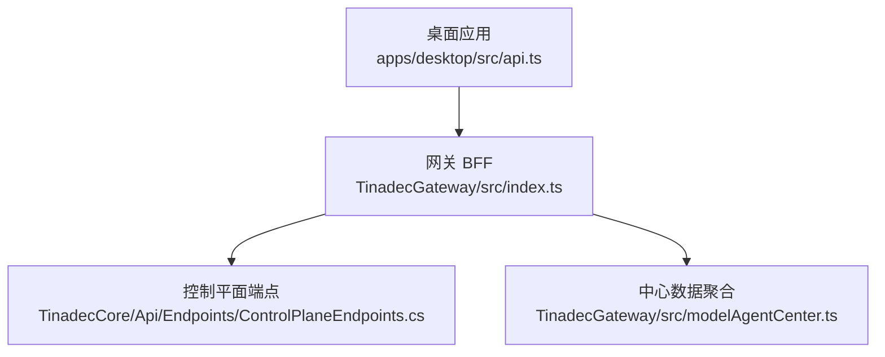
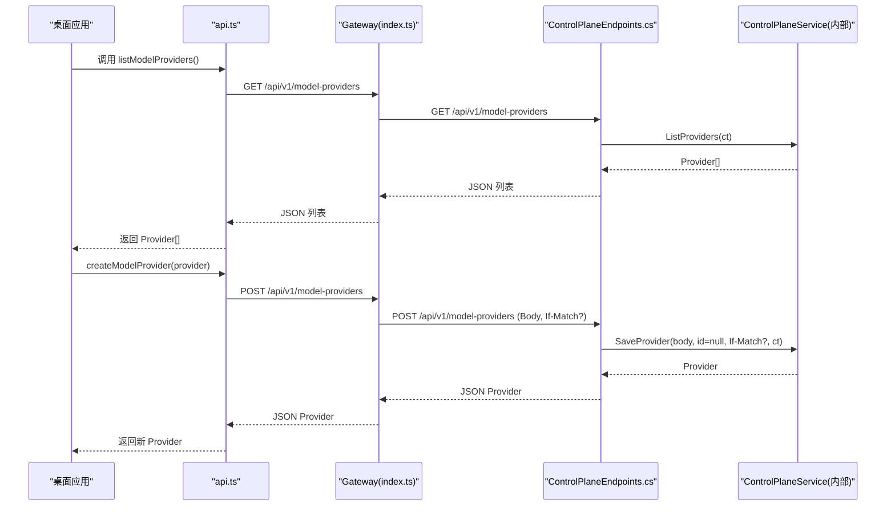
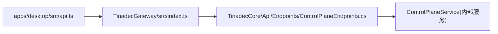

# 模型提供商管理 API

<cite>
**本文引用的文件**   
- [ControlPlaneEndpoints.cs](file://TinadecCore\Api\Endpoints\ControlPlaneEndpoints.cs)
- [index.ts](file://TinadecGateway\src\index.ts)
- [api.ts](file://apps\desktop\src\api.ts)
- [modelAgentCenter.ts](file://TinadecGateway\src\modelAgentCenter.ts)
</cite>

## 目录
1. [简介](#简介)
2. [项目结构](#项目结构)
3. [核心组件](#核心组件)
4. [架构总览](#架构总览)
5. [详细端点说明](#详细端点说明)
6. [依赖关系分析](#依赖关系分析)
7. [性能与可用性考虑](#性能与可用性考虑)
8. [故障排查指南](#故障排查指南)
9. [结论](#结论)
10. [附录：请求/响应模式与示例](#附录请求响应模式与示例)

## 简介
本文件面向开发者与集成方，系统化说明“模型提供商管理”相关 API 的设计与用法，包括：
- 模型提供商的 CRUD 端点（GET、POST、PUT、DELETE）
- 模型模板端点（GET /api/v1/model-provider-templates）
- 模型设置端点（GET/PUT /api/v1/model-settings）
并给出认证方式、错误处理、状态码、请求/响应模式、客户端集成要点与常见问题排查建议。

## 项目结构
- Core（后端）通过控制平面端点暴露模型相关的 REST API。
- Gateway（BFF）对前端提供统一代理，转发到 Core 或本地聚合逻辑。
- Desktop 前端通过 api.ts 中的方法调用 Gateway，再由 Gateway 转发至 Core。

**图示来源** 
- [index.ts:460-514](file://TinadecGateway\src\index.ts#L460-L514)
- [ControlPlaneEndpoints.cs:10-18](file://TinadecCore\Api\Endpoints\ControlPlaneEndpoints.cs#L10-L18)
- [modelAgentCenter.ts:517-535](file://TinadecGateway\src\modelAgentCenter.ts#L517-L535)

**章节来源**
- [ControlPlaneEndpoints.cs:10-18](file://TinadecCore\Api\Endpoints\ControlPlaneEndpoints.cs#L10-L18)
- [index.ts:460-514](file://TinadecGateway\src\index.ts#L460-L514)
- [api.ts:1059-1087](file://apps\desktop\src\api.ts#L1059-L1087)

## 核心组件
- 控制平面端点（Core）
  - 定义模型提供商、模板、路由、设置的 HTTP 映射。
  - 支持 If-Match 头用于乐观并发控制（保存/删除）。
- 网关 BFF（Gateway）
  - 将前端请求代理到 Core，并对部分能力进行聚合与封装。
- 前端 API 封装（Desktop）
  - 提供类型化的方法调用，如 listModelProviders、createModelProvider、saveModelProvider、deleteModelProvider 等。

**章节来源**
- [ControlPlaneEndpoints.cs:10-18](file://TinadecCore\Api\Endpoints\ControlPlaneEndpoints.cs#L10-L18)
- [index.ts:460-514](file://TinadecGateway\src\index.ts#L460-L514)
- [api.ts:1059-1087](file://apps\desktop\src\api.ts#L1059-L1087)

## 架构总览
下图展示了从前端到后端的完整调用链，以及关键的数据流向。

**图示来源** 
- [index.ts:467-476](file://TinadecGateway\src\index.ts#L467-L476)
- [ControlPlaneEndpoints.cs:10-12](file://TinadecCore\Api\Endpoints\ControlPlaneEndpoints.cs#L10-L12)
- [api.ts:1067-1070](file://apps\desktop\src\api.ts#L1067-L1070)

## 详细端点说明

### 通用约定
- 内容类型：application/json
- 认证：当前实现未强制鉴权；如需安全接入，请在网关层增加认证与授权策略。
- 乐观并发控制：保存与删除操作可携带 If-Match 请求头（值为资源版本标识），服务端据此进行冲突检测。
- 错误响应：当能力不可用或未实现时，可能返回 501 及结构化错误体（包含 code、message 等字段）。

**章节来源**
- [ControlPlaneEndpoints.cs:11-13](file://TinadecCore\Api\Endpoints\ControlPlaneEndpoints.cs#L11-L13)
- [ControlPlaneEndpoints.cs:17-18](file://TinadecCore\Api\Endpoints\ControlPlaneEndpoints.cs#L17-L18)

### 模型提供商 CRUD

#### GET /api/v1/model-providers
- 功能：列出所有已配置的模型提供商实例。
- 请求：无 Body，可选查询参数由服务端定义（当前未见）。
- 响应：数组，元素为 ModelProviderInstanceDto。
- 状态码：200 成功；其他错误码按网关/核心返回。

**章节来源**
- [ControlPlaneEndpoints.cs:10](file://TinadecCore\Api\Endpoints\ControlPlaneEndpoints.cs#L10)
- [index.ts:467-471](file://TinadecGateway\src\index.ts#L467-L471)
- [api.ts:1060](file://apps\desktop\src\api.ts#L1060)

#### POST /api/v1/model-providers
- 功能：创建新的模型提供商实例。
- 请求体：SaveModelProviderInstanceInput（包含 driver、display_name、connection_kind、base_url、model、api_key、clear_api_key、binary_path、home_path、server_url、launch_args、capabilities、enabled 等）。
- 请求头：If-Match（可选，用于乐观并发）。
- 响应：创建的 ModelProviderInstanceDto。
- 状态码：200/201（取决于实现）；失败返回相应错误码。

**章节来源**
- [ControlPlaneEndpoints.cs:11](file://TinadecCore\Api\Endpoints\ControlPlaneEndpoints.cs#L11)
- [index.ts:472-476](file://TinadecGateway\src\index.ts#L472-L476)
- [api.ts:1067-1070](file://apps\desktop\src\api.ts#L1067-L1070)

#### PUT /api/v1/model-providers/{id}
- 功能：更新指定 ID 的模型提供商实例。
- 路径参数：id（GUID）。
- 请求体：SaveModelProviderInstanceInput。
- 请求头：If-Match（可选）。
- 响应：更新后的 ModelProviderInstanceDto。
- 状态码：200/204（取决于实现）；失败返回相应错误码。

**章节来源**
- [ControlPlaneEndpoints.cs:12](file://TinadecCore\Api\Endpoints\ControlPlaneEndpoints.cs#L12)
- [index.ts:477-484](file://TinadecGateway\src\index.ts#L477-L484)
- [api.ts:1071-1074](file://apps\desktop\src\api.ts#L1071-L1074)

#### DELETE /api/v1/model-providers/{id}
- 功能：删除指定 ID 的模型提供商实例。
- 路径参数：id（GUID）。
- 请求头：If-Match（可选）。
- 响应：无 Body（204 No Content 或空对象）。
- 状态码：204/200；失败返回相应错误码。

**章节来源**
- [ControlPlaneEndpoints.cs:13](file://TinadecCore\Api\Endpoints\ControlPlaneEndpoints.cs#L13)
- [index.ts:485-491](file://TinadecGateway\src\index.ts#L485-L491)
- [api.ts:1075-1077](file://apps\desktop\src\api.ts#L1075-L1077)

### 模型模板端点

#### GET /api/v1/model-provider-templates
- 功能：获取可用的模型提供商模板集合，用于快速创建或展示支持的驱动族与能力。
- 响应：数组，元素为 ModelProviderTemplateDto（包含 provider_family、driver、display_name、connection_kind、credential_kind、summary、contributor_description、default_base_url、default_model、default_timeout_seconds、capabilities 等）。
- 状态码：200 成功。

**章节来源**
- [ControlPlaneEndpoints.cs:14](file://TinadecCore\Api\Endpoints\ControlPlaneEndpoints.cs#L14)
- [index.ts:462-466](file://TinadecGateway\src\index.ts#L462-L466)
- [api.ts:1059](file://apps\desktop\src\api.ts#L1059)

### 模型设置端点

#### GET /api/v1/model-settings
- 功能：读取全局模型设置（当前为占位实现，返回默认值）。
- 响应：包含 base_url、model、has_api_key、revision、updated_at 等字段。
- 状态码：200 成功。

**章节来源**
- [ControlPlaneEndpoints.cs:17](file://TinadecCore\Api\Endpoints\ControlPlaneEndpoints.cs#L17)
- [index.ts:505-509](file://TinadecGateway\src\index.ts#L505-L509)
- [api.ts:1083](file://apps\desktop\src\api.ts#L1083)

#### PUT /api/v1/model-settings
- 功能：更新全局模型设置（当前返回能力不可用，建议使用 model-providers 进行持久化配置）。
- 请求体：包含 base_url、model、api_key、clear_api_key 等字段。
- 响应：结构化错误体（code=capability_unavailable，message 提示使用 model-providers）。
- 状态码：501 未实现/能力不可用。

**章节来源**
- [ControlPlaneEndpoints.cs:18](file://TinadecCore\Api\Endpoints\ControlPlaneEndpoints.cs#L18)
- [index.ts:510-514](file://TinadecGateway\src\index.ts#L510-L514)
- [api.ts:1084-1087](file://apps\desktop\src\api.ts#L1084-L1087)

## 依赖关系分析
- 前端 api.ts 定义了各端点的调用方法与 DTO 类型。
- Gateway index.ts 将前端请求代理到 Core 对应端点，并在必要时进行状态映射。
- Core ControlPlaneEndpoints.cs 直接映射 HTTP 到服务方法（如 ListProviders、SaveProvider、DeleteProvider）。

**图示来源** 
- [api.ts:1059-1087](file://apps\desktop\src\api.ts#L1059-L1087)
- [index.ts:462-514](file://TinadecGateway\src\index.ts#L462-L514)
- [ControlPlaneEndpoints.cs:10-18](file://TinadecCore\Api\Endpoints\ControlPlaneEndpoints.cs#L10-L18)

**章节来源**
- [api.ts:1059-1087](file://apps\desktop\src\api.ts#L1059-L1087)
- [index.ts:462-514](file://TinadecGateway\src\index.ts#L462-L514)
- [ControlPlaneEndpoints.cs:10-18](file://TinadecCore\Api\Endpoints\ControlPlaneEndpoints.cs#L10-L18)

## 性能与可用性考虑
- 列表接口（GET /model-providers、GET /model-provider-templates）适合缓存，减少频繁刷新。
- 保存/删除接口支持 If-Match 乐观锁，避免覆盖并发修改。
- 模型设置 PUT 当前返回 501，应迁移至 model-providers 进行持久化配置。
- 网关层对错误状态进行透传，便于前端统一处理。

[本节为通用指导，不直接分析具体文件]

## 故障排查指南
- 若 PUT /model-settings 返回 501 且 message 提示使用 model-providers，请按提示改用模型提供商端点进行配置。
- 若保存/删除出现并发冲突，检查 If-Match 是否正确传递。
- 若列表为空，确认是否已成功创建至少一个提供商实例。
- 若前端无法访问后端，检查 Gateway 代理配置与网络连通性。

**章节来源**
- [ControlPlaneEndpoints.cs:18](file://TinadecCore\Api\Endpoints\ControlPlaneEndpoints.cs#L18)
- [index.ts:462-514](file://TinadecGateway\src\index.ts#L462-L514)

## 结论
模型提供商管理 API 提供了完整的 CRUD 能力与模板查询，并通过网关层统一对外暴露。模型设置端点当前仅作为占位，推荐以 model-providers 进行持久化配置。建议在网关层补充认证与限流，提升安全性与稳定性。

[本节为总结性内容，不直接分析具体文件]

## 附录：请求/响应模式与示例

### 数据模型概览
- ModelProviderTemplateDto：模板信息，包含驱动族、驱动名、显示名、连接方式、凭据类型、摘要、默认基础 URL、默认模型、超时秒数、能力集等。
- ModelProviderInstanceDto：实例信息，包含 id、driver、display_name、connection_kind、base_url、model、has_api_key、二进制路径、服务器地址、启动参数、能力、启用状态、运行状态、冷却时间、创建/更新时间等。
- SaveModelProviderInstanceInput：创建/更新输入，包含 id（可选）、driver、display_name、connection_kind、base_url、model、api_key、clear_api_key、二进制路径、服务器地址、启动参数、能力、启用状态等。

**章节来源**
- [api.ts:52-96](file://apps\desktop\src\api.ts#L52-L96)
- [api.ts:177-192](file://apps\desktop\src\api.ts#L177-L192)

### 典型请求示例（描述性）
- 获取模板列表
  - 方法：GET
  - 路径：/api/v1/model-provider-templates
  - 响应：模板数组
- 创建提供商
  - 方法：POST
  - 路径：/api/v1/model-providers
  - 请求体：SaveModelProviderInstanceInput
  - 响应：ModelProviderInstanceDto
- 更新提供商
  - 方法：PUT
  - 路径：/api/v1/model-providers/{id}
  - 请求体：SaveModelProviderInstanceInput
  - 响应：ModelProviderInstanceDto
- 删除提供商
  - 方法：DELETE
  - 路径：/api/v1/model-providers/{id}
  - 响应：空
- 获取模型设置
  - 方法：GET
  - 路径：/api/v1/model-settings
  - 响应：基础 URL、模型、是否有密钥、修订号、更新时间
- 更新模型设置
  - 方法：PUT
  - 路径：/api/v1/model-settings
  - 请求体：包含 base_url、model、api_key、clear_api_key
  - 响应：501 能力不可用（建议使用 model-providers）

### 客户端集成要点
- 使用 api.ts 中提供的函数进行调用，确保传入正确的 DTO 类型。
- 在需要并发控制的场景下，正确设置 If-Match 请求头。
- 对 501 错误做降级处理，引导用户切换到 model-providers 进行配置。
- 对列表接口实施合理缓存策略，减少不必要的请求。

**章节来源**
- [api.ts:1059-1087](file://apps\desktop\src\api.ts#L1059-L1087)
- [index.ts:462-514](file://TinadecGateway\src\index.ts#L462-L514)
- [ControlPlaneEndpoints.cs:10-18](file://TinadecCore\Api\Endpoints\ControlPlaneEndpoints.cs#L10-L18)