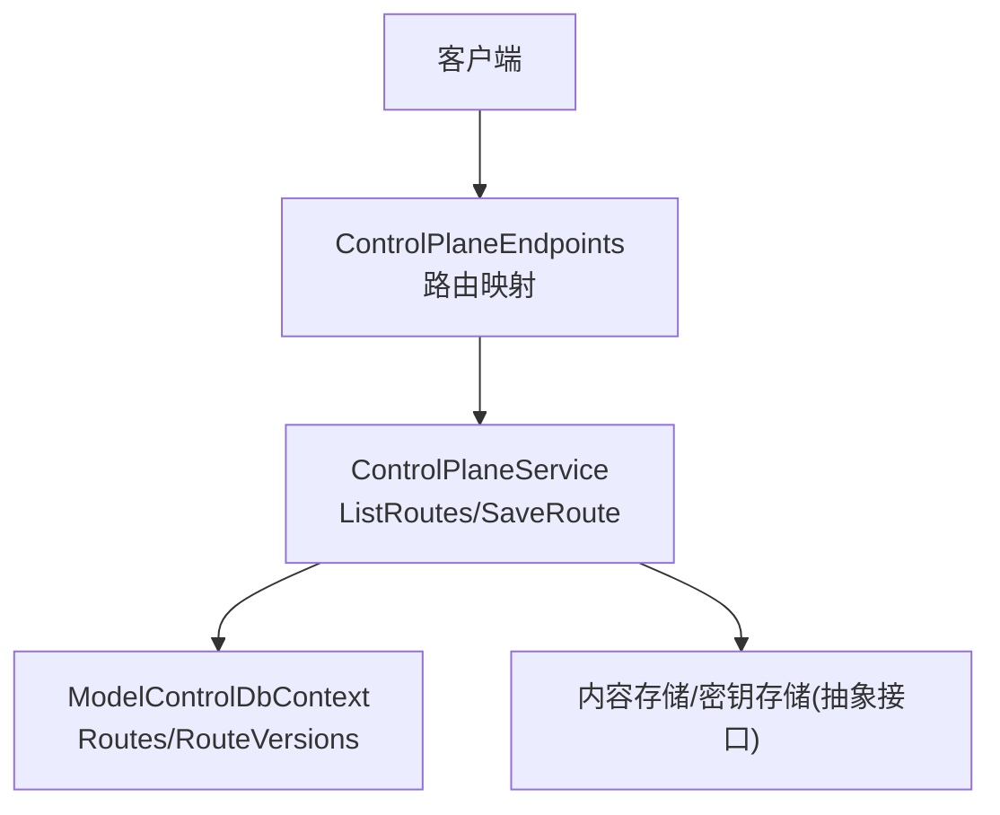
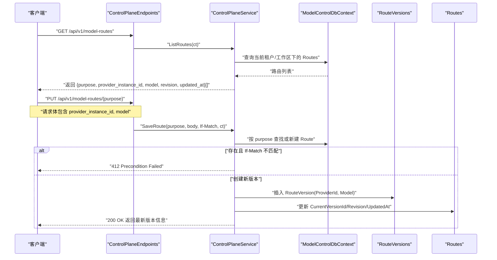
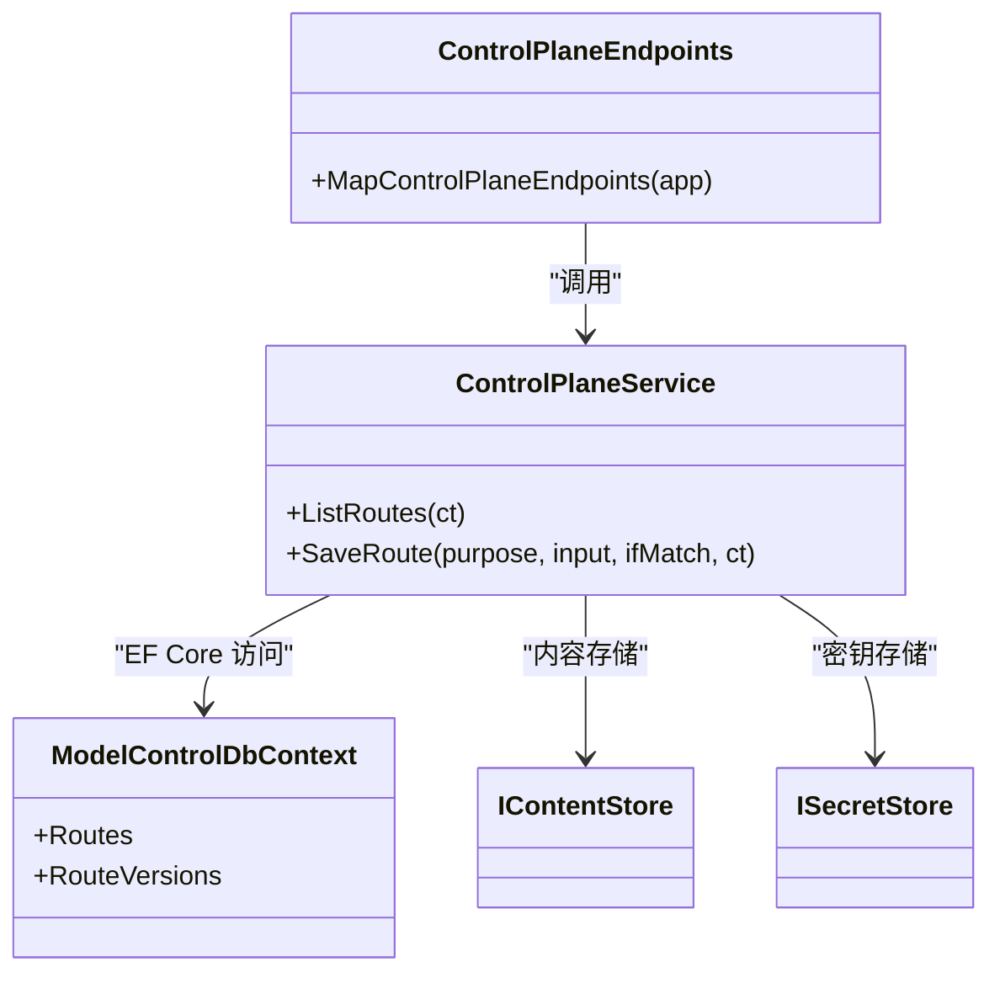

# 模型路由配置 API

<cite>
**本文引用的文件**   
- [ControlPlaneEndpoints.cs](file://TinadecCore\Api\Endpoints\ControlPlaneEndpoints.cs)
- [ControlPlaneService.cs](file://TinadecCore\Runtime\ControlPlaneService.cs)
- [ModelControlDbContext.cs](file://TinadecCore\Models\ModelControlDbContext.cs)
- [ModelRouteResolverTests.cs](file://tests\TinadecCore.Tests\ModelRouteResolverTests.cs)
</cite>

## 目录
1. [简介](#简介)
2. [项目结构](#项目结构)
3. [核心组件](#核心组件)
4. [架构总览](#架构总览)
5. [详细组件分析](#详细组件分析)
6. [依赖关系分析](#依赖关系分析)
7. [性能考虑](#性能考虑)
8. [故障排查指南](#故障排查指南)
9. [结论](#结论)
10. [附录](#附录)

## 简介
本文件面向“模型路由配置”API，覆盖以下能力：
- 查询模型路由：GET /api/v1/model-routes
- 更新模型路由：PUT /api/v1/model-routes/{purpose}

重点说明：
- purpose 参数的含义与使用场景（按“目的/用途”维度将请求路由到不同模型实例）
- 请求/响应数据模式、字段说明与示例
- 路由规则定义与版本控制机制
- 错误处理与并发安全（If-Match 条件更新）
- 最佳实践与常见问题解决方案

## 项目结构
与模型路由相关的代码主要位于：
- API 端点注册：ControlPlaneEndpoints.cs
- 业务逻辑与服务实现：ControlPlaneService.cs
- 数据模型与 EF Core 映射：ModelControlDbContext.cs
- 路由解析与策略行为（测试用例体现）：ModelRouteResolverTests.cs

图表来源 
- [ControlPlaneEndpoints.cs:8-17](file://TinadecCore\Api\Endpoints\ControlPlaneEndpoints.cs#L8-L17)
- [ControlPlaneService.cs:51-54](file://TinadecCore\Runtime\ControlPlaneService.cs#L51-L54)
- [ModelControlDbContext.cs:28-37](file://TinadecCore\Models\ModelControlDbContext.cs#L28-L37)

章节来源
- [ControlPlaneEndpoints.cs:8-17](file://TinadecCore\Api\Endpoints\ControlPlaneEndpoints.cs#L8-L17)
- [ControlPlaneService.cs:51-54](file://TinadecCore\Runtime\ControlPlaneService.cs#L51-L54)
- [ModelControlDbContext.cs:28-37](file://TinadecCore\Models\ModelControlDbContext.cs#L28-L37)

## 核心组件
- ControlPlaneEndpoints：负责 HTTP 路由映射，将 GET/PUT 请求分发到 ControlPlaneService。
- ControlPlaneService：实现 ListRoutes 与 SaveRoute，完成路由配置的读取、写入与版本管理。
- ModelControlDbContext：定义 Routes 与 RouteVersions 实体及索引约束，支撑多租户隔离与唯一性约束。
- 路由解析（参考测试）：根据 purpose 选择健康且优先级合适的 Provider 实例，支持降级与冷却期策略。

章节来源
- [ControlPlaneEndpoints.cs:15-16](file://TinadecCore\Api\Endpoints\ControlPlaneEndpoints.cs#L15-L16)
- [ControlPlaneService.cs:51-54](file://TinadecCore\Runtime\ControlPlaneService.cs#L51-L54)
- [ModelControlDbContext.cs:28-37](file://TinadecCore\Models\ModelControlDbContext.cs#L28-L37)
- [ModelRouteResolverTests.cs:18-31](file://tests\TinadecCore.Tests\ModelRouteResolverTests.cs#L18-L31)

## 架构总览
下图展示了从客户端请求到持久化的完整流程，以及路由版本化与并发控制的关键点。

图表来源 
- [ControlPlaneEndpoints.cs:15-16](file://TinadecCore\Api\Endpoints\ControlPlaneEndpoints.cs#L15-L16)
- [ControlPlaneService.cs:51-54](file://TinadecCore\Runtime\ControlPlaneService.cs#L51-L54)
- [ModelControlDbContext.cs:28-37](file://TinadecCore\Models\ModelControlDbContext.cs#L28-L37)

## 详细组件分析

### API 端点与路由映射
- GET /api/v1/model-routes
  - 作用：列出当前租户与工作区下所有已删除标记为空的模型路由。
  - 参数：无路径参数；通过租户上下文过滤。
  - 响应：数组，每项包含 purpose、provider_instance_id、model、revision、updated_at。
- PUT /api/v1/model-routes/{purpose}
  - 作用：按 purpose 设置或更新模型路由的目标 Provider 实例与模型。
  - 路径参数：purpose（字符串），用于区分不同用途的路由（如 chat、code、search 等）。
  - 请求头：If-Match（可选），用于乐观锁，值为期望的 revision。
  - 请求体：JSON，必须包含 provider_instance_id（字符串形式的 GUID），可选包含 model（字符串）。
  - 响应：成功时返回最新版本的 purpose、provider_instance_id、model、revision、updated_at。

章节来源
- [ControlPlaneEndpoints.cs:15-16](file://TinadecCore\Api\Endpoints\ControlPlaneEndpoints.cs#L15-L16)

### 服务层实现（ControlPlaneService）
- ListRoutes
  - 查询 Routes 表，关联 RouteVersions 获取当前版本的 ProviderId 与 Model。
  - 输出字段：purpose、provider_instance_id、model、revision、updated_at。
- SaveRoute
  - 校验请求体中 provider_instance_id 是否为有效 GUID，否则返回 400。
  - 若路由不存在则新建；若存在则进行 If-Match 检查，不匹配返回 412。
  - 每次更新都会新增一条 RouteVersion 记录，并更新 Routes.CurrentVersionId、Revision、UpdatedAt。
  - 返回最新版本的 purpose、provider_instance_id、model、revision、updated_at。

章节来源
- [ControlPlaneService.cs:51-54](file://TinadecCore\Runtime\ControlPlaneService.cs#L51-L54)

### 数据模型与约束（ModelControlDbContext）
- Routes（model_routes）
  - 关键字段：Purpose（唯一约束于租户/工作区/项目/DeletedAt 组合）、Scope、Revision、CurrentVersionId、时间戳等。
- RouteVersions（model_route_versions）
  - 关键字段：RouteId、Version（唯一）、ProviderId、Model、时间戳等。
- 索引与唯一性
  - Routes 在租户/工作区/项目/目的/软删标志上具有唯一索引，确保同一目的仅有一条活跃路由。
  - RouteVersions 在 RouteId+Version 上唯一，保证版本序列不可重复。

章节来源
- [ModelControlDbContext.cs:28-37](file://TinadecCore\Models\ModelControlDbContext.cs#L28-L37)

### 目的参数（purpose）的含义与使用场景
- 含义：purpose 是路由的“用途标识”，用于将不同类型的调用分流到不同的模型实例或模型。
- 常见值示例（来自测试与契约）：chat、code、search 等。
- 使用建议：
  - 为每个 Agent/功能域分配独立的 purpose，便于差异化配置与治理。
  - 结合 Provider 的 capabilities 与 route 能力声明，实现更细粒度的路由策略。
  - 在多租户/多工作区环境下，purpose 在同一范围内保持语义一致。

章节来源
- [ModelRouteResolverTests.cs:12-16](file://tests\TinadecCore.Tests\ModelRouteResolverTests.cs#L12-L16)
- [ModelRouteResolverTests.cs:45-51](file://tests\TinadecCore.Tests\ModelRouteResolverTests.cs#L45-L51)

### 请求/响应模式与示例

- GET /api/v1/model-routes
  - 响应示例（字段说明见后文表格）：
    - [
      { "purpose": "chat", "provider_instance_id": "guid...", "model": "gpt-5.4", "revision": 3, "updated_at": "2026-01-15T12:00:00Z" },
      { "purpose": "code", "provider_instance_id": "guid...", "model": "claude-4", "revision": 1, "updated_at": "2026-01-15T12:00:00Z" }
    ]

- PUT /api/v1/model-routes/{purpose}
  - 请求体示例：
    - { "provider_instance_id": "guid...", "model": "gpt-5.4" }
  - 成功响应示例：
    - { "purpose": "chat", "provider_instance_id": "guid...", "model": "gpt-5.4", "revision": 4, "updated_at": "2026-01-15T12:00:00Z" }

- 字段说明
  - purpose：路由目的标识（字符串）
  - provider_instance_id：目标 Provider 实例 ID（GUID 字符串）
  - model：具体模型名称（字符串，可为空）
  - revision：路由版本号（整数）
  - updated_at：更新时间（UTC 时间戳）

章节来源
- [ControlPlaneService.cs:51-54](file://TinadecCore\Runtime\ControlPlaneService.cs#L51-L54)

### 路由规则与版本控制
- 版本化：每次更新都会生成新的 RouteVersion，保留历史轨迹。
- 乐观锁：通过 If-Match 头部携带期望 revision，避免覆盖冲突。
- 软删除：Routes 支持 DeletedAt 软删除，查询时排除已删除项。
- 唯一性：同一租户/工作区/项目下，同一 purpose 只能有一条活跃路由。

章节来源
- [ModelControlDbContext.cs:28-37](file://TinadecCore\Models\ModelControlDbContext.cs#L28-L37)
- [ControlPlaneService.cs:51-54](file://TinadecCore\Runtime\ControlPlaneService.cs#L51-L54)

### 错误处理机制
- 400 Bad Request：请求体缺少必填字段 provider_instance_id 或格式不正确。
- 412 Precondition Failed：If-Match 不匹配，表示并发冲突。
- 404 Not Found：当操作涉及的对象不存在时（例如某些其他端点），但路由更新本身在未命中时会创建新记录。
- 501 Not Implemented：部分能力未启用时返回（与本 API 无关，但端点中存在类似模式）。

章节来源
- [ControlPlaneService.cs:51-54](file://TinadecCore\Runtime\ControlPlaneService.cs#L51-L54)

### 路由策略与解析（参考测试）
- 健康优先：优先选择健康的 Provider，忽略处于冷却期的实例。
- 优先级与回退：相同优先级时按 ProviderId 排序；主用不可用时自动回退到备用。
- 禁用处理：即使优先级最高，禁用的 Provider 也会被排除。
- 失败恢复：成功调用后可清除冷却状态，恢复健康。

章节来源
- [ModelRouteResolverTests.cs:18-31](file://tests\TinadecCore.Tests\ModelRouteResolverTests.cs#L18-L31)
- [ModelRouteResolverTests.cs:34-51](file://tests\TinadecCore.Tests\ModelRouteResolverTests.cs#L34-L51)
- [ModelRouteResolverTests.cs:54-65](file://tests\TinadecCore.Tests\ModelRouteResolverTests.cs#L54-L65)
- [ModelRouteResolverTests.cs:68-88](file://tests\TinadecCore.Tests\ModelRouteResolverTests.cs#L68-L88)
- [ModelRouteResolverTests.cs:220-237](file://tests\TinadecCore.Tests\ModelRouteResolverTests.cs#L220-L237)

## 依赖关系分析
- 端点依赖服务：ControlPlaneEndpoints 依赖 ControlPlaneService。
- 服务依赖数据访问：ControlPlaneService 通过 ModelControlDbContext 访问 Routes/RouteVersions。
- 服务依赖外部存储：IContentStore/ISecretStore（抽象接口）用于内容/密钥存取（路由配置本身走数据库版本表）。
- 路由解析依赖 Provider 健康与能力元数据（测试体现）。

图表来源 
- [ControlPlaneEndpoints.cs:8-17](file://TinadecCore\Api\Endpoints\ControlPlaneEndpoints.cs#L8-L17)
- [ControlPlaneService.cs:14-27](file://TinadecCore\Runtime\ControlPlaneService.cs#L14-L27)
- [ModelControlDbContext.cs:5-11](file://TinadecCore\Models\ModelControlDbContext.cs#L5-L11)

章节来源
- [ControlPlaneEndpoints.cs:8-17](file://TinadecCore\Api\Endpoints\ControlPlaneEndpoints.cs#L8-L17)
- [ControlPlaneService.cs:14-27](file://TinadecCore\Runtime\ControlPlaneService.cs#L14-L27)
- [ModelControlDbContext.cs:5-11](file://TinadecCore\Models\ModelControlDbContext.cs#L5-L11)

## 性能考虑
- 查询优化：ListRoutes 基于租户/工作区过滤，建议在应用层缓存热点 purpose 列表（注意失效策略）。
- 写入性能：SaveRoute 每次更新会插入新版本记录，需关注版本表增长与清理策略。
- 并发控制：使用 If-Match 减少锁竞争，提高吞吐。
- 连接复用：EF Core DbContextFactory 提供按需上下文，避免长连接占用。

[本节为通用指导，无需引用具体文件]

## 故障排查指南
- 问题：更新路由返回 412
  - 原因：If-Match 不匹配，本地 revision 落后于服务端。
  - 解决：先 GET 获取最新 revision，再携带正确的 If-Match 重试。
- 问题：更新路由返回 400
  - 原因：请求体缺少 provider_instance_id 或格式非 GUID。
  - 解决：补全必填字段并确保 GUID 格式正确。
- 问题：路由未生效
  - 原因：可能选择了被禁用或处于冷却期的 Provider。
  - 解决：检查 Provider 状态与能力声明，必要时调整优先级与健康状态。

章节来源
- [ControlPlaneService.cs:51-54](file://TinadecCore\Runtime\ControlPlaneService.cs#L51-L54)
- [ModelRouteResolverTests.cs:68-88](file://tests\TinadecCore.Tests\ModelRouteResolverTests.cs#L68-L88)

## 结论
模型路由配置 API 提供了以 purpose 为核心的灵活路由管理能力，结合版本化与乐观锁保障一致性。通过合理划分 purpose、维护 Provider 健康与优先级，可实现高可用、可观测、可扩展的模型调用策略。

[本节为总结，无需引用具体文件]

## 附录

### API 规范速查

- GET /api/v1/model-routes
  - 响应字段：purpose、provider_instance_id、model、revision、updated_at
- PUT /api/v1/model-routes/{purpose}
  - 路径参数：purpose（字符串）
  - 请求头：If-Match（可选，revision）
  - 请求体：{ provider_instance_id: "GUID", model?: "string" }
  - 响应字段：purpose、provider_instance_id、model、revision、updated_at

章节来源
- [ControlPlaneEndpoints.cs:15-16](file://TinadecCore\Api\Endpoints\ControlPlaneEndpoints.cs#L15-L16)
- [ControlPlaneService.cs:51-54](file://TinadecCore\Runtime\ControlPlaneService.cs#L51-L54)

### 最佳实践
- 为每个 Agent/功能域设定独立 purpose，避免相互干扰。
- 始终携带 If-Match 进行更新，避免覆盖冲突。
- 对热点 purpose 做短期缓存，配合失效事件刷新。
- 定期清理过期版本记录，控制版本表规模。
- 结合 Provider 健康与能力元数据，设计合理的优先级与回退策略。

[本节为通用指导，无需引用具体文件]