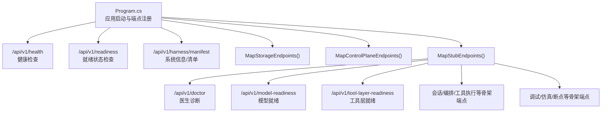
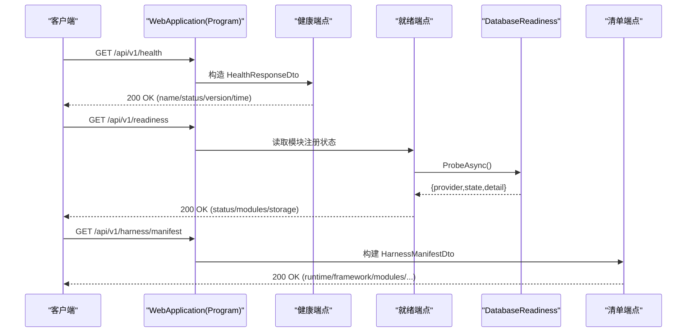
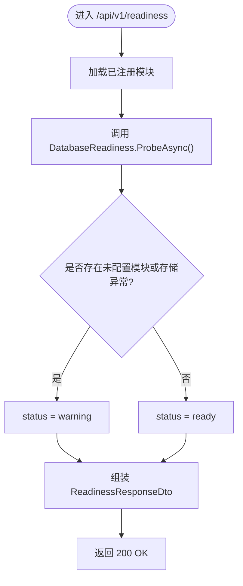
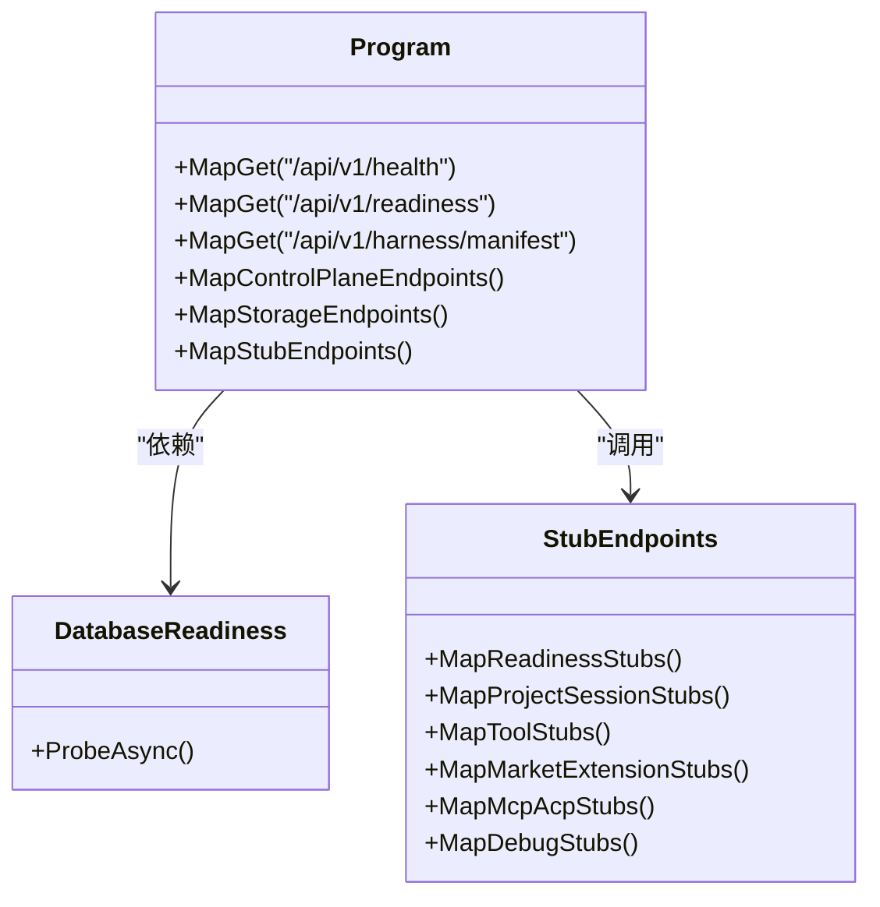

# 模拟 API

<cite>
**本文引用的文件**   
- [Program.cs](file://TinadecCore/Api/Program.cs)
- [StubEndpoints.cs](file://TinadecCore/Api/Endpoints/StubEndpoints.cs)
- [ControlPlaneEndpoints.cs](file://TinadecCore/Api/Endpoints/ControlPlaneEndpoints.cs)
- [HealthResponseDto.cs](file://TinadecCore/Contracts/Dtos/HealthResponseDto.cs)
- [ReadinessResponseDto.cs](file://TinadecCore/Contracts/Dtos/ReadinessResponseDto.cs)
- [DatabaseReadiness.cs](file://TinadecCore/Persistence/DatabaseReadiness.cs)
- [HarnessManifestDto.cs](file://TinadecCore/Contracts/Dtos/HarnessManifestDto.cs)
- [ToolManifestDtos.cs](file://TinadecCore/Contracts/Dtos/ToolManifestDtos.cs)
- [ApiEndpointTests.cs](file://TinadecCore/tests/TinadecCore.Api.Tests/ApiEndpointTests.cs)
</cite>

## 目录
1. [简介](#简介)
2. [项目结构](#项目结构)
3. [核心组件](#核心组件)
4. [架构总览](#架构总览)
5. [详细组件分析](#详细组件分析)
6. [依赖关系分析](#依赖关系分析)
7. [性能考量](#性能考量)
8. [故障排除指南](#故障排除指南)
9. [结论](#结论)
10. [附录：端点清单与响应字段说明](#附录端点清单与响应字段说明)

## 简介
本文件面向测试与开发环境，系统化记录用于“骨架模式”的模拟 API。这些端点主要用于：
- 健康检查：验证服务是否存活（/api/v1/health）
- 就绪状态检查：评估框架、存储与各模块是否就绪（/api/v1/readiness）
- 系统信息获取：返回运行时与模块清单（/api/v1/harness/manifest）
- 其他骨架端点：为网关代理与桌面前端提供空数据或占位响应，便于联调与集成测试

所有 GET 类端点在骨架模式下返回 200 与空集合；写操作通常返回 501 Not Implemented，以明确能力未实现的状态。

## 项目结构
模拟 API 由以下关键部分构成：
- 应用入口与全局配置：JSON 序列化策略、持久化初始化、迁移执行、端点注册
- 健康与就绪端点：直接映射到 DTO 与数据库探针
- 骨架端点扩展：按功能域划分（医生诊断、会话、工具、模型中心、提示词、Agent、市场/扩展、MCP/ACP、调试/仿真）
- 控制面端点：模型提供者、路由、设置、提示词片段、Agent、审批等

图表来源 
- [Program.cs:42-175](file://TinadecCore/Api/Program.cs#L42-L175)
- [StubEndpoints.cs:15-241](file://TinadecCore/Api/Endpoints/StubEndpoints.cs#L15-L241)

章节来源
- [Program.cs:10-175](file://TinadecCore/Api/Program.cs#L10-L175)
- [StubEndpoints.cs:15-241](file://TinadecCore/Api/Endpoints/StubEndpoints.cs#L15-L241)

## 核心组件
- 健康检查端点：返回兼容旧版结构的 JSON，包含名称、状态、版本与时间戳
- 就绪状态端点：聚合框架就绪信息、数据库探针结果与模块注册状态，给出整体 status
- 系统清单端点：输出运行时元数据、工具注册摘要、Agent 分层、框架信息与已注册模块
- 骨架端点扩展：按领域提供空数据或 501 占位，确保前端与网关在开发环境下可稳定消费

章节来源
- [Program.cs:42-117](file://TinadecCore/Api/Program.cs#L42-L117)
- [Program.cs:122-164](file://TinadecCore/Api/Program.cs#L122-L164)
- [StubEndpoints.cs:15-241](file://TinadecCore/Api/Endpoints/StubEndpoints.cs#L15-L241)

## 架构总览
下图展示从请求到响应的关键路径，包括健康、就绪与清单端点的处理流程。

图表来源 
- [Program.cs:42-117](file://TinadecCore/Api/Program.cs#L42-L117)
- [Program.cs:122-164](file://TinadecCore/Api/Program.cs#L122-L164)
- [DatabaseReadiness.cs:24-73](file://TinadecCore/Persistence/DatabaseReadiness.cs#L24-L73)

## 详细组件分析

### 健康检查端点（/api/v1/health）
- 用途：快速判断服务是否存活，常用于负载均衡与健康探针
- 行为：返回固定结构与当前时间戳，兼容旧版字段命名
- 响应关键字段：name、status、version、time（snake_case）
- 使用场景：Kubernetes liveness probe、CI 健康校验、自动化巡检

章节来源
- [Program.cs:42-53](file://TinadecCore/Api/Program.cs#L42-L53)
- [HealthResponseDto.cs:1-13](file://TinadecCore/Contracts/Dtos/HealthResponseDto.cs#L1-L13)
- [ApiEndpointTests.cs:22-45](file://TinadecCore/tests/TinadecCore.Api.Tests/ApiEndpointTests.cs#L22-L45)

### 就绪状态端点（/api/v1/readiness）
- 用途：评估系统是否具备服务能力（框架、存储、模块）
- 行为：
  - 收集已注册模块及其状态
  - 调用数据库探针（SQLite/PostgreSQL），返回 provider/state/detail
  - 若存在未配置模块或存储不可用，则 status=warning，否则 ready
- 响应关键字段：status、framework_ready、framework_name、framework_version、storage、modules[]
- 使用场景：Kubernetes readiness probe、部署后自检、运维仪表盘

图表来源 
- [Program.cs:122-164](file://TinadecCore/Api/Program.cs#L122-L164)
- [DatabaseReadiness.cs:24-73](file://TinadecCore/Persistence/DatabaseReadiness.cs#L24-L73)
- [ReadinessResponseDto.cs:1-32](file://TinadecCore/Contracts/Dtos/ReadinessResponseDto.cs#L1-L32)

章节来源
- [Program.cs:122-164](file://TinadecCore/Api/Program.cs#L122-L164)
- [DatabaseReadiness.cs:24-73](file://TinadecCore/Persistence/DatabaseReadiness.cs#L24-L73)
- [ReadinessResponseDto.cs:1-32](file://TinadecCore/Contracts/Dtos/ReadinessResponseDto.cs#L1-L32)
- [ApiEndpointTests.cs:115-182](file://TinadecCore/tests/TinadecCore.Api.Tests/ApiEndpointTests.cs#L115-L182)

### 系统清单端点（/api/v1/harness/manifest）
- 用途：暴露运行时元数据、工具注册摘要、Agent 分层、框架信息与模块清单
- 行为：基于 ITinadecCoreBuilder 获取已注册模块，填充 FrameworkInfo 与 ModuleDescriptor
- 响应关键字段：runtime、ownership_model、tool_registry、agent_layers、framework、modules、design_notes
- 使用场景：前端初始化、能力探测、版本与依赖核对

章节来源
- [Program.cs:58-117](file://TinadecCore/Api/Program.cs#L58-L117)
- [HarnessManifestDto.cs:1-53](file://TinadecCore/Contracts/Dtos/HarnessManifestDto.cs#L1-L53)
- [ToolManifestDtos.cs:1-60](file://TinadecCore/Contracts/Dtos/ToolManifestDtos.cs#L1-L60)
- [ApiEndpointTests.cs:48-112](file://TinadecCore/tests/TinadecCore.Api.Tests/ApiEndpointTests.cs#L48-L112)

### 骨架端点扩展（/api/v1/*）
- 医生诊断：/api/v1/doctor — 平台与版本信息
- 模型就绪：/api/v1/model-readiness、/api/v1/model-catalog-readiness — 模板与提供者就绪情况
- 工具层就绪：/api/v1/tool-layer-readiness — 工具与 Agent 就绪统计
- 会话与编排：/api/v1/sessions/{sessionId}/orchestration 等 — 空数据
- 工具：/api/v1/tools、/api/v1/tools/search — 空数据；执行类接口返回 501
- 模型中心：/api/v1/model-provider-templates、/api/v1/model-providers — 空数据
- 提示词片段：由 ControlPlaneEndpoints 映射
- Agent：进化提案与候选等骨架端点
- 市场与扩展：源、目录、安装/启用/禁用等骨架端点
- MCP/ACP：服务器与适配器查询骨架端点
- 调试与仿真：traces、spans、metrics、snapshot、diagnostics、breakpoints 以及 simulate 系列（均返回空或 501）

章节来源
- [StubEndpoints.cs:15-241](file://TinadecCore/Api/Endpoints/StubEndpoints.cs#L15-L241)
- [ControlPlaneEndpoints.cs:1-46](file://TinadecCore/Api/Endpoints/ControlPlaneEndpoints.cs#L1-L46)

## 依赖关系分析
- Program 负责：
  - 配置 JSON 序列化策略（snake_case）
  - 注册持久化与 Core 模块
  - 运行迁移与生命周期协调
  - 映射健康、就绪、清单与控制面/存储/骨架端点
- 就绪端点依赖：
  - ITinadecCoreBuilder：获取模块注册状态
  - IDatabaseReadiness：探测存储可用性（SQLite/PostgreSQL）
- 骨架端点独立于业务逻辑，仅返回空数据或 501

图表来源 
- [Program.cs:10-175](file://TinadecCore/Api/Program.cs#L10-L175)
- [DatabaseReadiness.cs:24-73](file://TinadecCore/Persistence/DatabaseReadiness.cs#L24-L73)
- [StubEndpoints.cs:15-241](file://TinadecCore/Api/Endpoints/StubEndpoints.cs#L15-L241)

章节来源
- [Program.cs:10-175](file://TinadecCore/Api/Program.cs#L10-L175)
- [DatabaseReadiness.cs:24-73](file://TinadecCore/Persistence/DatabaseReadiness.cs#L24-L73)
- [StubEndpoints.cs:15-241](file://TinadecCore/Api/Endpoints/StubEndpoints.cs#L15-L241)

## 性能考量
- 健康与清单端点均为轻量级内存计算，无外部 IO，延迟极低
- 就绪端点会进行数据库探针，默认超时受配置限制（1–30 秒），避免阻塞请求
- 骨架端点不访问外部资源，适合高并发探针与频繁轮询
- 建议：
  - 将健康探针间隔设置为 5–10 秒
  - 就绪探针间隔 10–30 秒，并合理设置超时
  - 在生产环境关闭不必要的调试/仿真端点

[本节为通用指导，无需引用具体文件]

## 故障排除指南
- 健康检查失败
  - 现象：/api/v1/health 非 200 或字段缺失
  - 排查：确认应用已启动、JSON 序列化策略生效、DTO 字段未被忽略
  - 参考：健康端点实现与测试用例

- 就绪状态为 warning
  - 现象：/api/v1/readiness 返回 status=warning
  - 可能原因：
    - 存在未配置的模块（module_state=not_configured）
    - 数据库探针失败（state=unavailable）或未配置（state=not_configured）
  - 排查：
    - 检查模块注册与配置
    - 检查数据库连接字符串与权限
    - 查看 DatabaseReadiness 日志中的警告信息

- 清单端点缺少模块信息
  - 现象：/api/v1/harness/manifest 中 modules 为空或数量不符
  - 排查：确认 Core 模块已正确注册，ITinadecCoreBuilder.GetRegisteredModules() 能返回预期列表

- 骨架端点返回 501
  - 现象：写操作或仿真端点返回 501 Not Implemented
  - 说明：骨架模式下能力未实现属正常行为，需切换到真实实现或启用相应能力

章节来源
- [Program.cs:42-164](file://TinadecCore/Api/Program.cs#L42-L164)
- [DatabaseReadiness.cs:24-73](file://TinadecCore/Persistence/DatabaseReadiness.cs#L24-L73)
- [ApiEndpointTests.cs:22-182](file://TinadecCore/tests/TinadecCore.Api.Tests/ApiEndpointTests.cs#L22-L182)

## 结论
本项目的模拟 API 为开发与测试提供了稳定的“骨架模式”接口集，覆盖健康、就绪与系统清单三大核心需求，并通过丰富的骨架端点支撑前端与网关联调。通过合理的探针策略与故障排查方法，可在本地与 CI 环境中高效定位问题并推进集成。

[本节为总结性内容，无需引用具体文件]

## 附录：端点清单与响应字段说明

- 健康检查
  - GET /api/v1/health
  - 响应关键字段：name、status、version、time

- 就绪状态
  - GET /api/v1/readiness
  - 响应关键字段：status、framework_ready、framework_name、framework_version、storage{provider,state,detail}、modules[{module_id,module_state,detail}]

- 系统清单
  - GET /api/v1/harness/manifest
  - 响应关键字段：runtime、ownership_model、tool_registry、agent_layers、framework{name,version,primitives}、modules[{module_id,version,dependencies,capabilities,language,maf_primitives,registration_status}]、design_notes

- 骨架端点（示例）
  - GET /api/v1/doctor
  - GET /api/v1/model-readiness、/api/v1/model-catalog-readiness、/api/v1/tool-layer-readiness
  - GET /api/v1/sessions/{sessionId}/orchestration、/tool-executions、/task-nodes、/context-packs、/supervision-findings
  - GET /api/v1/tools、/tools/search；POST 执行类返回 501
  - GET /api/v1/model-provider-templates、/model-providers
  - 提示词片段、Agent、市场/扩展、MCP/ACP、调试/仿真/断点等骨架端点

章节来源
- [Program.cs:42-117](file://TinadecCore/Api/Program.cs#L42-L117)
- [Program.cs:122-164](file://TinadecCore/Api/Program.cs#L122-L164)
- [StubEndpoints.cs:15-241](file://TinadecCore/Api/Endpoints/StubEndpoints.cs#L15-L241)
- [ApiEndpointTests.cs:22-182](file://TinadecCore/tests/TinadecCore.Api.Tests/ApiEndpointTests.cs#L22-L182)