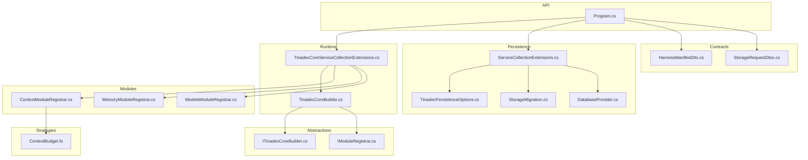
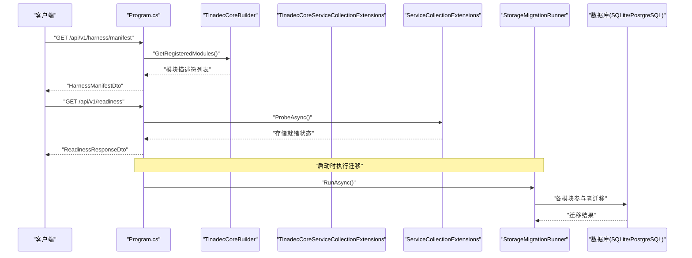
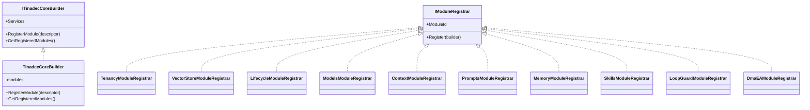
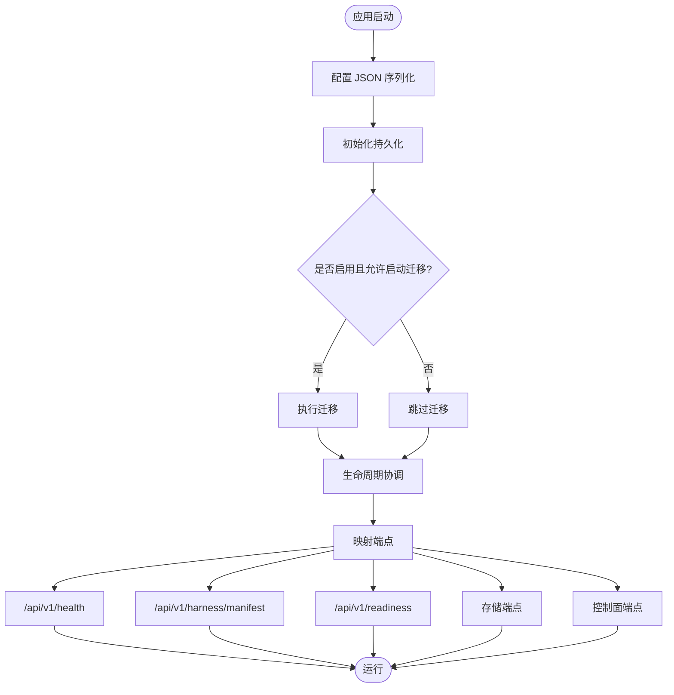
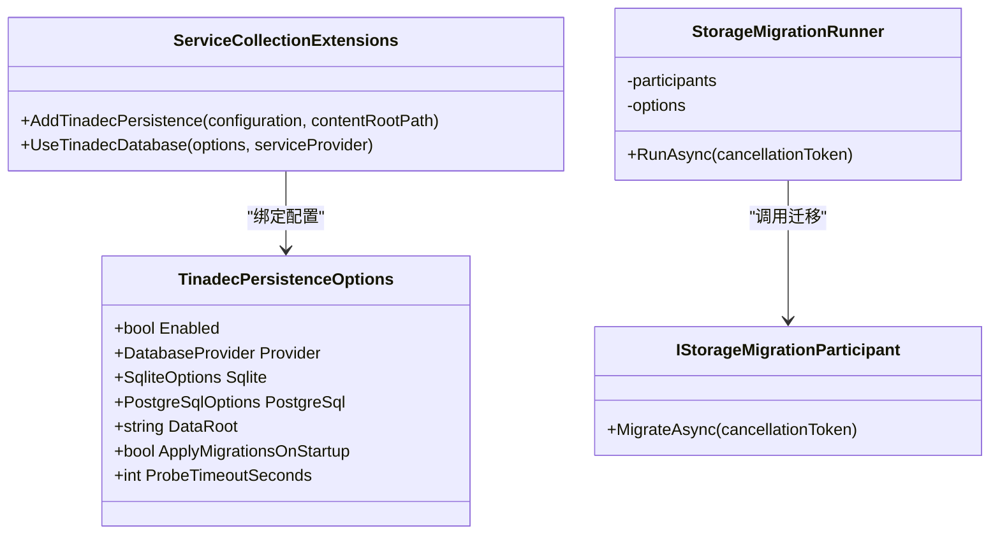
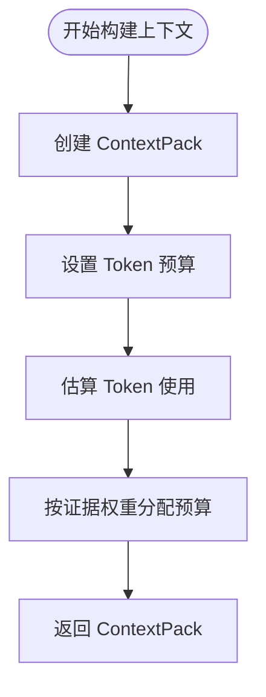
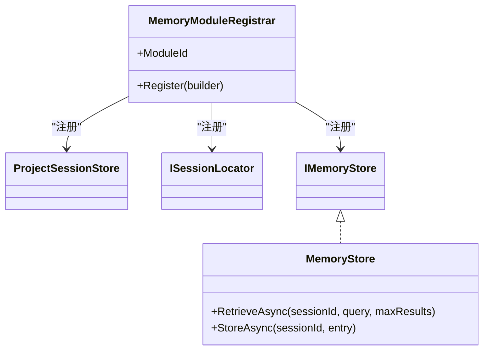
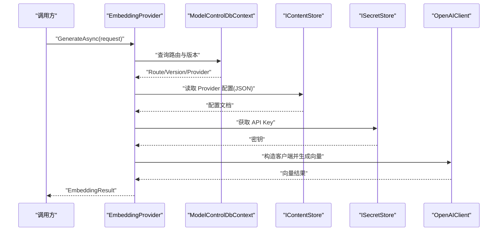

# Core 框架

<cite>
**本文引用的文件**   
- [ITinadecCoreBuilder.cs](file://TinadecCore/Abstractions/ITinadecCoreBuilder.cs)
- [IModuleRegistrar.cs](file://TinadecCore/Abstractions/IModuleRegistrar.cs)
- [Program.cs](file://TinadecCore/Api/Program.cs)
- [ServiceCollectionExtensions.cs](file://TinadecCore/Persistence/ServiceCollectionExtensions.cs)
- [TinadecPersistenceOptions.cs](file://TinadecCore/Persistence/TinadecPersistenceOptions.cs)
- [DatabaseProvider.cs](file://TinadecCore/Persistence/DatabaseProvider.cs)
- [StorageMigration.cs](file://TinadecCore/Persistence/StorageMigration.cs)
- [TinadecCoreServiceCollectionExtensions.cs](file://TinadecCore/Runtime/TinadecCoreServiceCollectionExtensions.cs)
- [TinadecCoreBuilder.cs](file://TinadecCore/Runtime/TinadecCoreBuilder.cs)
- [ContextModuleRegistrar.cs](file://TinadecCore/Context/ContextModuleRegistrar.cs)
- [MemoryModuleRegistrar.cs](file://TinadecCore/Memory/MemoryModuleRegistrar.cs)
- [ModelsModuleRegistrar.cs](file://TinadecCore/Models/ModelsModuleRegistrar.cs)
- [HarnessManifestDto.cs](file://TinadecCore/Contracts/Dtos/HarnessManifestDto.cs)
- [StorageRequestDtos.cs](file://TinadecCore/Contracts/Dtos/StorageRequestDtos.cs)
- [ContextBudget.fs](file://TinadecCore/Strategies/ContextBudget.fs)
</cite>

## 目录
1. [简介](#简介)
2. [项目结构](#项目结构)
3. [核心组件](#核心组件)
4. [架构总览](#架构总览)
5. [详细组件分析](#详细组件分析)
6. [依赖关系分析](#依赖关系分析)
7. [性能考量](#性能考量)
8. [故障排查指南](#故障排查指南)
9. [结论](#结论)
10. [附录](#附录)

## 简介
本文件为 TinadecCore 框架的全面技术文档，聚焦于核心抽象层、运行时管理、持久化层与策略层的实现细节。文档围绕 MAF（Microsoft Agent Framework）模块化单体设计模式展开，解释接口定义与扩展机制，涵盖工具注册表、模型路由、会话管理等关键组件的技术要点，并提供与其他组件的集成方式、常见问题解决方案与性能优化建议。读者无需深入底层即可理解整体架构与使用模式。

## 项目结构
TinadecCore 采用按功能域划分的模块化结构，通过统一的构建器与模块注册器进行装配。核心目录包括：
- Abstractions：核心抽象与端口定义，如构建器、模块注册器、上下文、内存、模型等接口
- Runtime：运行时装配与 DI 扩展，提供 AddTinadecCore 系列方法
- Persistence：数据库抽象、连接信息、迁移协调、存储路径与内容存储
- Context/Memory/Models/Lifecycle/Skills/Prompts/Tenancy/VectorStore：各业务模块的注册器与实现
- Api：Web API 入口、健康检查、就绪性检查、清单端点与存储控制面端点
- Contracts：DTO 与事件契约
- Strategies：F# 实现的纯函数策略（上下文预算、循环检测、记忆评分、提示选择、状态转换）

图表来源
- [Program.cs:1-181](file://TinadecCore/Api/Program.cs#L1-L181)
- [TinadecCoreServiceCollectionExtensions.cs:1-61](file://TinadecCore/Runtime/TinadecCoreServiceCollectionExtensions.cs#L1-L61)
- [TinadecCoreBuilder.cs:1-31](file://TinadecCore/Runtime/TinadecCoreBuilder.cs#L1-L31)
- [ITinadecCoreBuilder.cs:1-52](file://TinadecCore/Abstractions/ITinadecCoreBuilder.cs#L1-L52)
- [IModuleRegistrar.cs:1-17](file://TinadecCore/Abstractions/IModuleRegistrar.cs#L1-L17)
- [ServiceCollectionExtensions.cs:1-122](file://TinadecCore/Persistence/ServiceCollectionExtensions.cs#L1-L122)
- [TinadecPersistenceOptions.cs:1-48](file://TinadecCore/Persistence/TinadecPersistenceOptions.cs#L1-L48)
- [StorageMigration.cs:1-41](file://TinadecCore/Persistence/StorageMigration.cs#L1-L41)
- [DatabaseProvider.cs:1-11](file://TinadecCore/Persistence/DatabaseProvider.cs#L1-L11)
- [ContextModuleRegistrar.cs:1-52](file://TinadecCore/Context/ContextModuleRegistrar.cs#L1-L52)
- [MemoryModuleRegistrar.cs:1-58](file://TinadecCore/Memory/MemoryModuleRegistrar.cs#L1-L58)
- [ModelsModuleRegistrar.cs:1-168](file://TinadecCore/Models/ModelsModuleRegistrar.cs#L1-L168)
- [HarnessManifestDto.cs:1-53](file://TinadecCore/Contracts/Dtos/HarnessManifestDto.cs#L1-L53)
- [StorageRequestDtos.cs:1-25](file://TinadecCore/Contracts/Dtos/StorageRequestDtos.cs#L1-L25)
- [ContextBudget.fs:1-36](file://TinadecCore/Strategies/ContextBudget.fs#L1-L36)

章节来源
- [Program.cs:1-181](file://TinadecCore/Api/Program.cs#L1-L181)
- [TinadecCoreServiceCollectionExtensions.cs:1-61](file://TinadecCore/Runtime/TinadecCoreServiceCollectionExtensions.cs#L1-L61)
- [ITinadecCoreBuilder.cs:1-52](file://TinadecCore/Abstractions/ITinadecCoreBuilder.cs#L1-L52)
- [IModuleRegistrar.cs:1-17](file://TinadecCore/Abstractions/IModuleRegistrar.cs#L1-L17)
- [ServiceCollectionExtensions.cs:1-122](file://TinadecCore/Persistence/ServiceCollectionExtensions.cs#L1-L122)
- [TinadecPersistenceOptions.cs:1-48](file://TinadecCore/Persistence/TinadecPersistenceOptions.cs#L1-L48)
- [StorageMigration.cs:1-41](file://TinadecCore/Persistence/StorageMigration.cs#L1-L41)
- [DatabaseProvider.cs:1-11](file://TinadecCore/Persistence/DatabaseProvider.cs#L1-L11)
- [ContextModuleRegistrar.cs:1-52](file://TinadecCore/Context/ContextModuleRegistrar.cs#L1-L52)
- [MemoryModuleRegistrar.cs:1-58](file://TinadecCore/Memory/MemoryModuleRegistrar.cs#L1-L58)
- [ModelsModuleRegistrar.cs:1-168](file://TinadecCore/Models/ModelsModuleRegistrar.cs#L1-L168)
- [HarnessManifestDto.cs:1-53](file://TinadecCore/Contracts/Dtos/HarnessManifestDto.cs#L1-L53)
- [StorageRequestDtos.cs:1-25](file://TinadecCore/Contracts/Dtos/StorageRequestDtos.cs#L1-L25)
- [ContextBudget.fs:1-36](file://TinadecCore/Strategies/ContextBudget.fs#L1-L36)

## 核心组件
- 构建器与模块注册器
  - ITinadecCoreBuilder：统一的服务集合与模块描述符收集，支持 RegisterModule 与 GetRegisteredModules
  - IModuleRegistrar：每个业务模块实现该接口以显式注册服务与模块描述符，避免反射扫描
  - TinadecCoreBuilder：默认实现，维护 ModuleDescriptor 列表并注入自身到 DI
- 运行时装配
  - TinadecCoreServiceCollectionExtensions：AddTinadecCore/AddTinadecCoreMinimal，按依赖顺序注册所有模块
- 持久化抽象
  - ServiceCollectionExtensions.AddTinadecPersistence：注册配置、连接信息、数据库可读性检查、存储路径、内容存储、向量数据库、密钥存储、迁移运行器
  - TinadecPersistenceOptions：启用开关、后端选择、SQLite/PostgreSQL 配置、数据根目录、启动迁移开关、探测超时
  - StorageMigration：IStorageMigrationParticipant 协调各模块执行迁移
- 模块示例
  - Context 模块：上下文提供者与 token 预算策略声明
  - Memory 模块：会话存储、保留策略、溯源能力
  - Models 模块：模型路由、嵌入生成、就绪性检查

章节来源
- [ITinadecCoreBuilder.cs:1-52](file://TinadecCore/Abstractions/ITinadecCoreBuilder.cs#L1-L52)
- [IModuleRegistrar.cs:1-17](file://TinadecCore/Abstractions/IModuleRegistrar.cs#L1-L17)
- [TinadecCoreBuilder.cs:1-31](file://TinadecCore/Runtime/TinadecCoreBuilder.cs#L1-L31)
- [TinadecCoreServiceCollectionExtensions.cs:1-61](file://TinadecCore/Runtime/TinadecCoreServiceCollectionExtensions.cs#L1-L61)
- [ServiceCollectionExtensions.cs:1-122](file://TinadecCore/Persistence/ServiceCollectionExtensions.cs#L1-L122)
- [TinadecPersistenceOptions.cs:1-48](file://TinadecCore/Persistence/TinadecPersistenceOptions.cs#L1-L48)
- [StorageMigration.cs:1-41](file://TinadecCore/Persistence/StorageMigration.cs#L1-L41)
- [ContextModuleRegistrar.cs:1-52](file://TinadecCore/Context/ContextModuleRegistrar.cs#L1-L52)
- [MemoryModuleRegistrar.cs:1-58](file://TinadecCore/Memory/MemoryModuleRegistrar.cs#L1-L58)
- [ModelsModuleRegistrar.cs:1-168](file://TinadecCore/Models/ModelsModuleRegistrar.cs#L1-L168)

## 架构总览
TinadecCore 以 MAF 模块化单体为核心，通过 DI 容器组合各模块。API 层暴露健康检查、就绪性检查与清单端点；持久化层提供跨模块共享的数据库抽象与迁移协调；策略层以 F# 纯函数实现无副作用的核心算法。

图表来源
- [Program.cs:1-181](file://TinadecCore/Api/Program.cs#L1-L181)
- [TinadecCoreBuilder.cs:1-31](file://TinadecCore/Runtime/TinadecCoreBuilder.cs#L1-L31)
- [TinadecCoreServiceCollectionExtensions.cs:1-61](file://TinadecCore/Runtime/TinadecCoreServiceCollectionExtensions.cs#L1-L61)
- [ServiceCollectionExtensions.cs:1-122](file://TinadecCore/Persistence/ServiceCollectionExtensions.cs#L1-L122)
- [StorageMigration.cs:1-41](file://TinadecCore/Persistence/StorageMigration.cs#L1-L41)

## 详细组件分析

### 构建器与模块注册（MAF 模块化单体）
- 设计模式
  - 显式模块注册：通过 IModuleRegistrar 在编译期确定依赖，避免反射扫描带来的不确定性
  - 构建器模式：ITinadecCoreBuilder 聚合 IServiceCollection 与 ModuleDescriptor，便于扩展与测试
- 扩展机制
  - AddTinadecCore/AddTinadecCoreMinimal：按需装配完整或最小模块集
  - 模块描述符包含 ID、版本、依赖、能力、语言、MAF 原语与注册状态，用于清单与就绪性检查

图表来源
- [ITinadecCoreBuilder.cs:1-52](file://TinadecCore/Abstractions/ITinadecCoreBuilder.cs#L1-L52)
- [TinadecCoreBuilder.cs:1-31](file://TinadecCore/Runtime/TinadecCoreBuilder.cs#L1-L31)
- [IModuleRegistrar.cs:1-17](file://TinadecCore/Abstractions/IModuleRegistrar.cs#L1-L17)
- [TinadecCoreServiceCollectionExtensions.cs:1-61](file://TinadecCore/Runtime/TinadecCoreServiceCollectionExtensions.cs#L1-L61)

章节来源
- [ITinadecCoreBuilder.cs:1-52](file://TinadecCore/Abstractions/ITinadecCoreBuilder.cs#L1-L52)
- [TinadecCoreBuilder.cs:1-31](file://TinadecCore/Runtime/TinadecCoreBuilder.cs#L1-L31)
- [IModuleRegistrar.cs:1-17](file://TinadecCore/Abstractions/IModuleRegistrar.cs#L1-L17)
- [TinadecCoreServiceCollectionExtensions.cs:1-61](file://TinadecCore/Runtime/TinadecCoreServiceCollectionExtensions.cs#L1-L61)

### 运行时管理与 API 端点
- Program.cs 负责：
  - JSON 序列化选项（snake_case、忽略 null）
  - 持久化初始化与迁移执行
  - 健康检查、就绪性检查、清单端点
  - 存储与控制面端点映射
- 清单端点返回 HarnessManifestDto，包含框架元数据与已注册模块描述符
- 就绪性检查综合模块状态与存储探针结果，输出 ready/warning

图表来源
- [Program.cs:1-181](file://TinadecCore/Api/Program.cs#L1-L181)
- [ServiceCollectionExtensions.cs:1-122](file://TinadecCore/Persistence/ServiceCollectionExtensions.cs#L1-L122)
- [StorageMigration.cs:1-41](file://TinadecCore/Persistence/StorageMigration.cs#L1-L41)

章节来源
- [Program.cs:1-181](file://TinadecCore/Api/Program.cs#L1-L181)
- [HarnessManifestDto.cs:1-53](file://TinadecCore/Contracts/Dtos/HarnessManifestDto.cs#L1-L53)

### 持久化层与迁移协调
- 配置与连接解析
  - TinadecPersistenceOptions：Enabled、Provider、Sqlite/PostgreSql 配置、DataRoot、ApplyMigrationsOnStartup、ProbeTimeoutSeconds
  - ResolveConnectionInfo：根据 Provider 与配置解析连接字符串或空值（表示未配置）
- 服务注册
  - AddTinadecPersistence：注册 Options、IDatabaseConnectionInfo、ITinadecDatabaseConfigurer、IDatabaseReadiness、StoragePaths、IContentStore、IProjectVectorDatabase、ISecretStore、IStorageMigrationRunner
- 迁移协调
  - IStorageMigrationParticipant：由业务模块实现，参与迁移流程
  - StorageMigrationRunner：根据配置决定是否执行迁移，依次调用参与者

图表来源
- [TinadecPersistenceOptions.cs:1-48](file://TinadecCore/Persistence/TinadecPersistenceOptions.cs#L1-L48)
- [ServiceCollectionExtensions.cs:1-122](file://TinadecCore/Persistence/ServiceCollectionExtensions.cs#L1-L122)
- [StorageMigration.cs:1-41](file://TinadecCore/Persistence/StorageMigration.cs#L1-L41)

章节来源
- [ServiceCollectionExtensions.cs:1-122](file://TinadecCore/Persistence/ServiceCollectionExtensions.cs#L1-L122)
- [TinadecPersistenceOptions.cs:1-48](file://TinadecCore/Persistence/TinadecPersistenceOptions.cs#L1-L48)
- [StorageMigration.cs:1-41](file://TinadecCore/Persistence/StorageMigration.cs#L1-L41)
- [DatabaseProvider.cs:1-11](file://TinadecCore/Persistence/DatabaseProvider.cs#L1-L11)

### 上下文与 Token 预算策略
- Context 模块
  - ContextModuleRegistrar 注册 IContextProvider，声明能力与 MAF 原语
  - ContextProvider 骨架实现，生成 ContextPack（会话 ID、运行 ID、Token 预算、估计 Token、证据）
- 策略层（F#）
  - ContextBudget.allocateBudget：按比例分配 Token 预算
  - isOverBudget/utilizationRatio：预算检查与利用率计算

图表来源
- [ContextModuleRegistrar.cs:1-52](file://TinadecCore/Context/ContextModuleRegistrar.cs#L1-L52)
- [ContextBudget.fs:1-36](file://TinadecCore/Strategies/ContextBudget.fs#L1-L36)

章节来源
- [ContextModuleRegistrar.cs:1-52](file://TinadecCore/Context/ContextModuleRegistrar.cs#L1-L52)
- [ContextBudget.fs:1-36](file://TinadecCore/Strategies/ContextBudget.fs#L1-L36)

### 记忆与会话管理
- Memory 模块
  - MemoryModuleRegistrar 注册 EF DbContextFactory、ProjectSessionStore、ISessionLocator、IMemoryStore
  - 声明能力：会话序列化、聊天历史、保留策略、溯源
- MemoryStore 骨架实现：提供 RetrieveAsync/StoreAsync 占位，后续可接入向量数据库

图表来源
- [MemoryModuleRegistrar.cs:1-58](file://TinadecCore/Memory/MemoryModuleRegistrar.cs#L1-L58)

章节来源
- [MemoryModuleRegistrar.cs:1-58](file://TinadecCore/Memory/MemoryModuleRegistrar.cs#L1-L58)

### 模型路由与嵌入生成
- Models 模块
  - ModelsModuleRegistrar 注册 ModelControlDbContext、IModelProvider、IEmbeddingProvider
  - ModelProvider 骨架：返回 null 与就绪性警告
  - EmbeddingProvider：基于 OpenAI 兼容客户端，从路由与内容存储读取配置，从密钥存储获取 API Key，生成向量
- 路由解析流程：租户与工作区维度查找路由与版本，校验 Provider 与模型配置，读取内容与密钥，构造客户端并调用

图表来源
- [ModelsModuleRegistrar.cs:1-168](file://TinadecCore/Models/ModelsModuleRegistrar.cs#L1-L168)

章节来源
- [ModelsModuleRegistrar.cs:1-168](file://TinadecCore/Models/ModelsModuleRegistrar.cs#L1-L168)

### 工具注册表与清单
- 清单端点返回 ToolRegistrySummaryDto 与 Modules，当前为骨架（计数为 0），预留扩展点
- 设计说明强调 Core 为唯一状态权威，Gateway 为薄代理，Desktop 仅展示

章节来源
- [Program.cs:1-181](file://TinadecCore/Api/Program.cs#L1-L181)
- [HarnessManifestDto.cs:1-53](file://TinadecCore/Contracts/Dtos/HarnessManifestDto.cs#L1-L53)

### 存储请求契约
- StorageRequestDtos 定义项目与会话创建的输入契约，供 API 层消费

章节来源
- [StorageRequestDtos.cs:1-25](file://TinadecCore/Contracts/Dtos/StorageRequestDtos.cs#L1-L25)

## 依赖关系分析
- 模块装配顺序体现依赖关系：Tenancy → VectorStore → Lifecycle → Models → Context → Prompts → Memory → Skills → LoopGuard → DmaEA
- 持久化层被多个模块共享（DbContext、迁移参与者、内容存储、密钥存储）
- 策略层（F#）被 Context 模块引用，提供无副作用算法

图表来源
- [TinadecCoreServiceCollectionExtensions.cs:1-61](file://TinadecCore/Runtime/TinadecCoreServiceCollectionExtensions.cs#L1-L61)

章节来源
- [TinadecCoreServiceCollectionExtensions.cs:1-61](file://TinadecCore/Runtime/TinadecCoreServiceCollectionExtensions.cs#L1-L61)

## 性能考量
- 启动迁移控制：PostgreSQL 需显式启用 ApplyMigrationsOnStartup，避免多实例竞争
- 探测超时：ProbeTimeoutSeconds 限制就绪性检查耗时，防止阻塞
- 连接解析：SQLite 相对路径解析基于 content root，减少路径错误开销
- 策略函数：F# 纯函数无状态，适合高频计算（预算分配、利用率）
- 最小化装配：AddTinadecCoreMinimal 裁剪非必需模块，降低内存与启动时间

[本节为通用指导，不直接分析具体文件]

## 故障排查指南
- 就绪性检查返回 warning
  - 检查是否有模块处于 NotConfigured 状态
  - 检查存储探针状态是否为 Ready
- 迁移未执行
  - 确认 TinadecPersistenceOptions.Enabled 与 ApplyMigrationsOnStartup
  - PostgreSQL 需显式启用启动迁移
- 嵌入生成失败
  - 检查路由是否存在、Provider 是否启用、模型名称与 base_url 是否配置
  - 检查密钥存储中是否包含 API Key
- 清单端点为空
  - 确认模块已通过 AddTinadecCore 正确注册
  - 检查 ModuleDescriptor 的 RegistrationStatus

章节来源
- [Program.cs:1-181](file://TinadecCore/Api/Program.cs#L1-L181)
- [ServiceCollectionExtensions.cs:1-122](file://TinadecCore/Persistence/ServiceCollectionExtensions.cs#L1-L122)
- [StorageMigration.cs:1-41](file://TinadecCore/Persistence/StorageMigration.cs#L1-L41)
- [ModelsModuleRegistrar.cs:1-168](file://TinadecCore/Models/ModelsModuleRegistrar.cs#L1-L168)

## 结论
TinadecCore 通过 MAF 模块化单体与 DI 装配实现了高内聚、低耦合的架构。持久化层提供跨模块共享的数据访问与迁移协调，策略层以纯函数保障核心算法的可预测性与可测试性。API 层暴露清晰的端点用于健康检查、就绪性检查与清单导出。遵循显式模块注册与最小化装配原则，可在保证稳定性的同时提升性能与可维护性。

[本节为总结，不直接分析具体文件]

## 附录
- 使用模式建议
  - 在宿主应用中调用 AddTinadecCore 或 AddTinadecCoreMinimal 完成装配
  - 通过 ITinadecCoreBuilder 获取已注册模块描述符，用于诊断与监控
  - 自定义模块实现 IModuleRegistrar，并在 AddTinadecCore 中添加
- 集成方式
  - 与 Gateway 与 Desktop 分离：Core 作为状态权威，Gateway 为薄代理，Desktop 仅展示
  - 工具层能力由 Core 治理，所有变更通过审批门控

[本节为概念性内容，不直接分析具体文件]