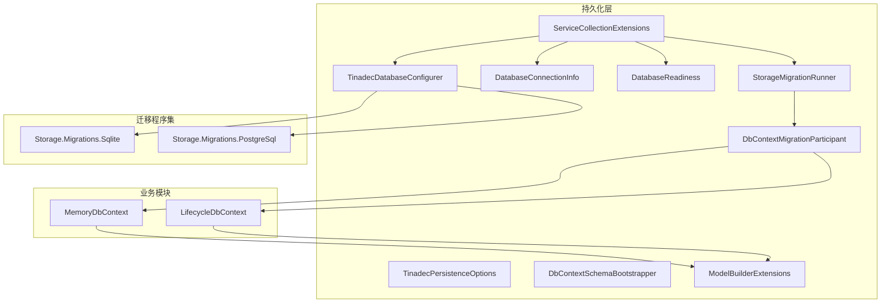
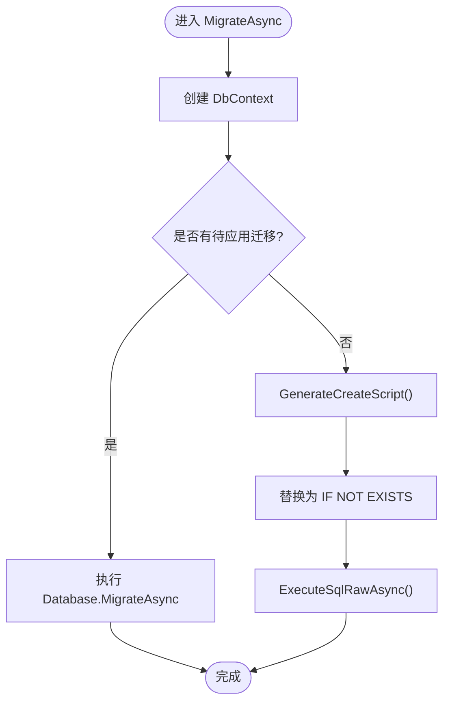
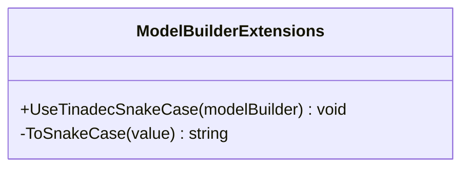
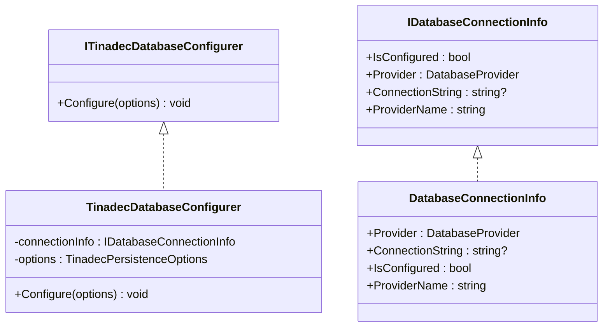
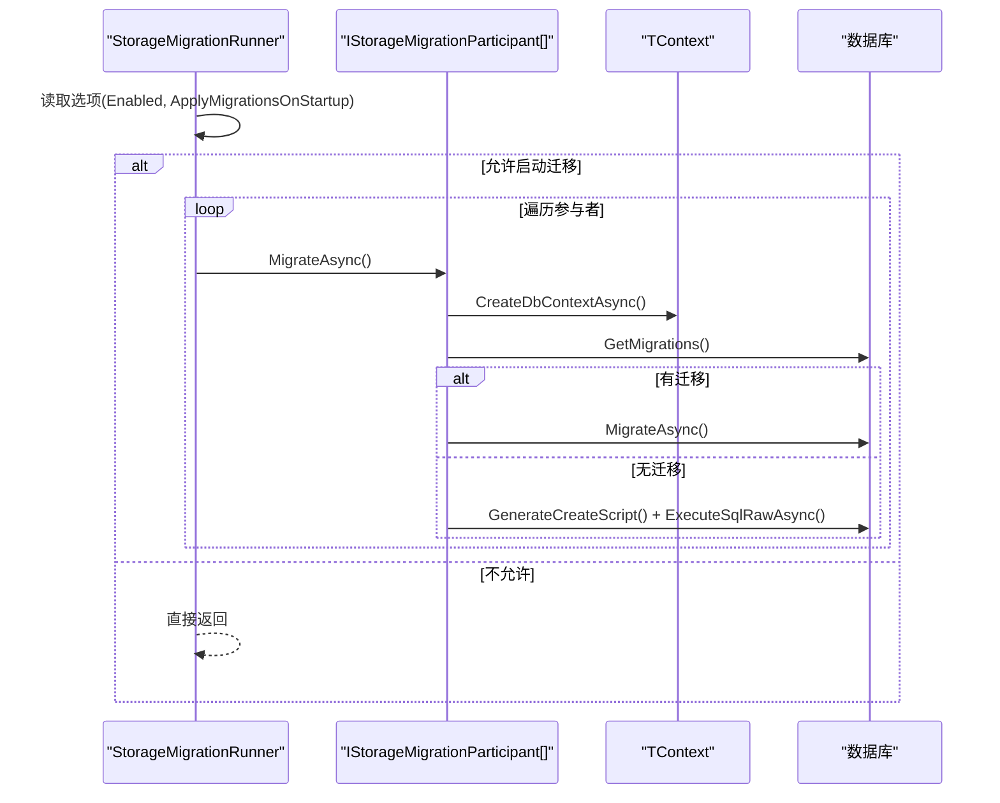
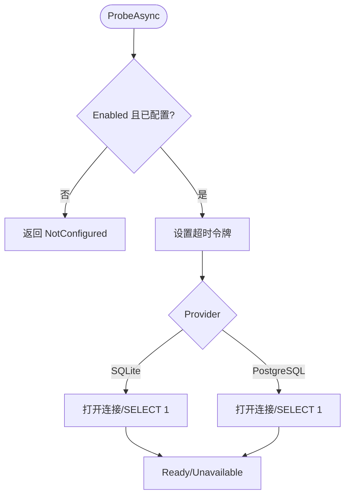
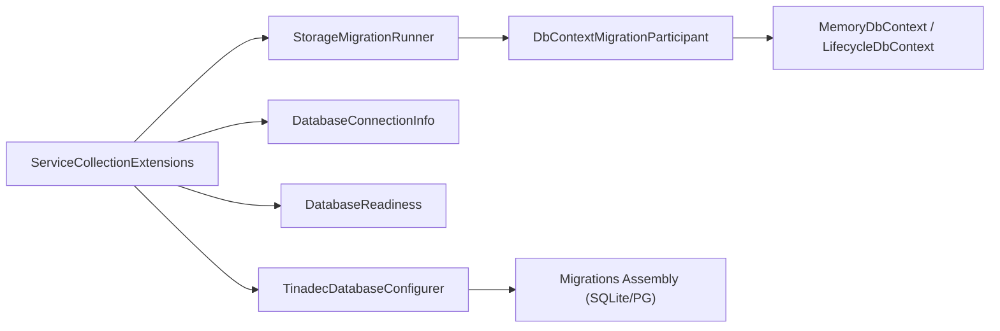

# Entity Framework 集成

<cite>
**本文引用的文件**   
- [DbContextMigrationParticipant.cs](file://TinadecCore\Persistence\DbContextMigrationParticipant.cs)
- [ModelBuilderExtensions.cs](file://TinadecCore\Persistence\ModelBuilderExtensions.cs)
- [ServiceCollectionExtensions.cs](file://TinadecCore\Persistence\ServiceCollectionExtensions.cs)
- [TinadecDatabaseConfigurer.cs](file://TinadecCore\Persistence\TinadecDatabaseConfigurer.cs)
- [ITinadecDatabaseConfigurer.cs](file://TinadecCore\Persistence\ITinadecDatabaseConfigurer.cs)
- [IDatabaseConnectionInfo.cs](file://TinadecCore\Persistence\IDatabaseConnectionInfo.cs)
- [DatabaseConnectionInfo.cs](file://TinadecCore\Persistence\DatabaseConnectionInfo.cs)
- [StorageMigration.cs](file://TinadecCore\Persistence\StorageMigration.cs)
- [DatabaseProvider.cs](file://TinadecCore\Persistence\DatabaseProvider.cs)
- [DatabaseReadiness.cs](file://TinadecCore\Persistence\DatabaseReadiness.cs)
- [MemoryDbContext.cs](file://TinadecCore\Memory\MemoryDbContext.cs)
- [LifecycleDbContext.cs](file://TinadecCore\Lifecycle\LifecycleDbContext.cs)
- [InitialStorageMigrations.cs（SQLite）](file://TinadecCore\Storage.Migrations.Sqlite\InitialStorageMigrations.cs)
- [InitialStorageMigrations.cs（PostgreSQL）](file://TinadecCore\Storage.Migrations.PostgreSql\InitialStorageMigrations.cs)
</cite>

## 目录
1. [简介](#简介)
2. [项目结构](#项目结构)
3. [核心组件](#核心组件)
4. [架构总览](#架构总览)
5. [详细组件分析](#详细组件分析)
6. [依赖关系分析](#依赖关系分析)
7. [性能考虑](#性能考虑)
8. [故障排查指南](#故障排查指南)
9. [结论](#结论)
10. [附录：EF Core 配置示例与最佳实践](#附录ef-core-配置示例与最佳实践)

## 简介
本文件面向 TinadecCore 的 Entity Framework 集成，系统性阐述以下主题：
- DbContextMigrationParticipant 的迁移参与机制与自动迁移流程
- ModelBuilderExtensions 模型构建扩展方法与命名约定
- ServiceCollectionExtensions 服务注册与依赖注入配置
- EF Core 连接字符串、模型映射与关系定义的配置要点
- 迁移脚本管理、版本控制与部署策略
- 性能优化技巧（查询优化、批量操作、连接池）
- 事务处理、并发控制与数据一致性保证
- 自定义 DbContext 与迁移开发的最佳实践与常见问题

## 项目结构
TinadecCore 将持久化能力集中在 Persistence 模块中，并通过多个业务模块（Memory、Lifecycle 等）提供各自的 DbContext。迁移脚本按数据库提供者拆分到独立程序集，实现提供者无关的业务模型与提供者相关的迁移解耦。



图表来源
- [ServiceCollectionExtensions.cs:15-49](file://TinadecCore\Persistence\ServiceCollectionExtensions.cs#L15-L49)
- [TinadecDatabaseConfigurer.cs:19-46](file://TinadecCore\Persistence\TinadecDatabaseConfigurer.cs#L19-L46)
- [DatabaseConnectionInfo.cs:3-22](file://TinadecCore\Persistence\DatabaseConnectionInfo.cs#L3-L22)
- [StorageMigration.cs:14-40](file://TinadecCore\Persistence\StorageMigration.cs#L14-L40)
- [DbContextMigrationParticipant.cs:6-24](file://TinadecCore\Persistence\DbContextMigrationParticipant.cs#L6-L24)
- [ModelBuilderExtensions.cs:8-17](file://TinadecCore\Persistence\ModelBuilderExtensions.cs#L8-L17)
- [MemoryDbContext.cs:13-60](file://TinadecCore\Memory\MemoryDbContext.cs#L13-L60)
- [LifecycleDbContext.cs:19-86](file://TinadecCore\Lifecycle\LifecycleDbContext.cs#L19-L86)
- [InitialStorageMigrations.cs（SQLite）:1-64](file://TinadecCore\Storage.Migrations.Sqlite\InitialStorageMigrations.cs#L1-L64)
- [InitialStorageMigrations.cs（PostgreSQL）:1-42](file://TinadecCore\Storage.Migrations.PostgreSql\InitialStorageMigrations.cs#L1-L42)

章节来源
- [ServiceCollectionExtensions.cs:15-49](file://TinadecCore\Persistence\ServiceCollectionExtensions.cs#L15-L49)
- [TinadecDatabaseConfigurer.cs:19-46](file://TinadecCore\Persistence\TinadecDatabaseConfigurer.cs#L19-L46)
- [DatabaseProvider.cs:6-10](file://TinadecCore\Persistence\DatabaseProvider.cs#L6-L10)

## 核心组件
- 服务注册与选项绑定：AddTinadecPersistence 统一注册选项、连接信息解析器、数据库配置器、就绪探针、存储路径与内容/向量/密钥存储等。
- 数据库配置器：根据启用状态与连接信息选择 SQLite 或 PostgreSQL，并设置对应的迁移程序集。
- 连接信息：封装 Provider、连接字符串与是否已配置的状态。
- 迁移参与者：为每个业务 DbContext 提供统一的迁移执行入口，支持“有迁移则运行迁移，否则生成脚本建表”的兜底逻辑。
- 模型构建扩展：为所有实体属性应用 snake_case 列名约定。
- 就绪探针：对 SQLite/PostgreSQL 进行连通性探测，带超时与日志。

章节来源
- [ServiceCollectionExtensions.cs:15-49](file://TinadecCore\Persistence\ServiceCollectionExtensions.cs#L15-L49)
- [TinadecDatabaseConfigurer.cs:19-46](file://TinadecCore\Persistence\TinadecDatabaseConfigurer.cs#L19-L46)
- [IDatabaseConnectionInfo.cs:6-17](file://TinadecCore\Persistence\IDatabaseConnectionInfo.cs#L6-L17)
- [DatabaseConnectionInfo.cs:3-22](file://TinadecCore\Persistence\DatabaseConnectionInfo.cs#L3-L22)
- [DbContextMigrationParticipant.cs:6-24](file://TinadecCore\Persistence\DbContextMigrationParticipant.cs#L6-L24)
- [ModelBuilderExtensions.cs:8-17](file://TinadecCore\Persistence\ModelBuilderExtensions.cs#L8-L17)
- [DatabaseReadiness.cs:24-73](file://TinadecCore\Persistence\DatabaseReadiness.cs#L24-L73)

## 架构总览
下图展示了从应用启动到数据库就绪与迁移执行的端到端流程。

```mermaid
sequenceDiagram
participant App as "应用启动"
participant DI as "IServiceCollection"
participant Cfg as "TinadecDatabaseConfigurer"
participant Opt as "TinadecPersistenceOptions"
participant Run as "StorageMigrationRunner"
participant Part as "DbContextMigrationParticipant<T>"
participant DB as "数据库"
App->>DI : AddTinadecPersistence(配置)
DI-->>App : 注册选项/连接信息/配置器/就绪探针/迁移运行器
App->>Cfg : UseTinadecDatabase(serviceProvider)
Cfg->>Opt : 读取启用状态与Provider
Cfg-->>App : 配置UseNpgsql/UseSqlite及迁移程序集
App->>Run : RunAsync()
alt 启用且允许启动迁移
loop 遍历参与者
Run->>Part : MigrateAsync()
Part->>DB : GetMigrations()/MigrateAsync()
alt 无可用迁移
Part->>DB : GenerateCreateScript() + ExecuteSqlRawAsync()
end
end
else 禁用或禁止启动迁移
Run-->>App : 跳过
end
App->>DB : 就绪探针 ProbeAsync()
DB-->>App : Ready/Unavailable/NotConfigured
```

图表来源
- [ServiceCollectionExtensions.cs:15-49](file://TinadecCore\Persistence\ServiceCollectionExtensions.cs#L15-L49)
- [TinadecDatabaseConfigurer.cs:19-46](file://TinadecCore\Persistence\TinadecDatabaseConfigurer.cs#L19-L46)
- [StorageMigration.cs:27-39](file://TinadecCore\Persistence\StorageMigration.cs#L27-L39)
- [DbContextMigrationParticipant.cs:12-23](file://TinadecCore\Persistence\DbContextMigrationParticipant.cs#L12-L23)
- [DatabaseReadiness.cs:24-73](file://TinadecCore\Persistence\DatabaseReadiness.cs#L24-L73)

## 详细组件分析

### DbContextMigrationParticipant 迁移参与机制
- 职责：为每个业务 DbContext 提供一致的迁移参与方式。优先使用 EF 迁移；若无迁移，则通过生成 SQL 脚本创建表与索引。
- 关键点：
  - 使用 IDbContextFactory 创建上下文，避免生命周期问题。
  - 先检查是否存在待应用迁移，存在则调用 MigrateAsync。
  - 若不存在迁移，则生成建库脚本并对 CREATE TABLE/INDEX 语句做 IF NOT EXISTS 替换后执行。
- 适用场景：本地开发快速初始化、无迁移时的兜底建表。



图表来源
- [DbContextMigrationParticipant.cs:12-23](file://TinadecCore\Persistence\DbContextMigrationParticipant.cs#L12-L23)

章节来源
- [DbContextMigrationParticipant.cs:6-24](file://TinadecCore\Persistence\DbContextMigrationParticipant.cs#L6-L24)

### ModelBuilderExtensions 模型构建扩展
- 作用：在 OnModelCreating 中调用 UseTinadecSnakeCase，将所有实体属性名转换为 snake_case 列名，保持跨提供者一致。
- 算法：遍历实体与属性，遇到大写字母且在非首位置时插入下划线并转小写。
- 建议：在业务 DbContext 的 OnModelCreating 末尾调用该扩展，确保覆盖全部实体。



图表来源
- [ModelBuilderExtensions.cs:8-17](file://TinadecCore\Persistence\ModelBuilderExtensions.cs#L8-L17)

章节来源
- [ModelBuilderExtensions.cs:8-17](file://TinadecCore\Persistence\ModelBuilderExtensions.cs#L8-L17)

### ServiceCollectionExtensions 服务注册与依赖注入
- 功能：
  - 绑定 TinadecPersistenceOptions，校验 ProbeTimeoutSeconds 范围。
  - 解析 IDatabaseConnectionInfo（SQLite/PostgreSQL），支持相对路径与绝对路径。
  - 注册 ITinadecDatabaseConfigurer、IDatabaseReadiness、StoragePaths、IContentStore、IProjectVectorDatabase、ISecretStore、IStorageMigrationRunner。
  - 提供 UseTinadecDatabase 扩展用于 DbContextOptionsBuilder 的统一配置。
- 连接字符串解析：
  - SQLite：若未配置路径则返回空连接字符串；否则构造 SqliteConnectionStringBuilder。
  - PostgreSQL：从 IConfiguration 的连接字符串集合中按名称获取。

```mermaid
sequenceDiagram
participant App as "应用"
participant Svc as "ServiceCollectionExtensions"
participant Opt as "TinadecPersistenceOptions"
participant Cfg as "TinadecDatabaseConfigurer"
participant DI as "ServiceProvider"
App->>Svc : AddTinadecPersistence(configuration, contentRootPath)
Svc->>Opt : Bind("TinadecPersistence")
Svc->>DI : TryAddSingleton(IDatabaseConnectionInfo)
Svc->>DI : TryAddSingleton(ITinadecDatabaseConfigurer)
Svc->>DI : TryAddSingleton(IDatabaseReadiness)
App->>DI : UseTinadecDatabase(serviceProvider)
DI->>Cfg : Configure(options)
Cfg-->>App : UseNpgsql/UseSqlite + MigrationsAssembly
```

图表来源
- [ServiceCollectionExtensions.cs:15-49](file://TinadecCore\Persistence\ServiceCollectionExtensions.cs#L15-L49)
- [TinadecDatabaseConfigurer.cs:19-46](file://TinadecCore\Persistence\TinadecDatabaseConfigurer.cs#L19-L46)

章节来源
- [ServiceCollectionExtensions.cs:15-49](file://TinadecCore\Persistence\ServiceCollectionExtensions.cs#L15-L49)

### 数据库配置器与连接信息
- ITinadecDatabaseConfigurer：对外暴露 Configure(DbContextOptionsBuilder)，内部根据启用状态与连接信息抛出明确异常或配置具体 Provider。
- DatabaseConnectionInfo：封装 Provider、连接字符串与 IsConfigured 判断，并提供 ProviderName 用于就绪报告。



图表来源
- [ITinadecDatabaseConfigurer.cs:9-16](file://TinadecCore\Persistence\ITinadecDatabaseConfigurer.cs#L9-L16)
- [TinadecDatabaseConfigurer.cs:6-46](file://TinadecCore\Persistence\TinadecDatabaseConfigurer.cs#L6-L46)
- [IDatabaseConnectionInfo.cs:6-17](file://TinadecCore\Persistence\IDatabaseConnectionInfo.cs#L6-L17)
- [DatabaseConnectionInfo.cs:3-22](file://TinadecCore\Persistence\DatabaseConnectionInfo.cs#L3-L22)

章节来源
- [TinadecDatabaseConfigurer.cs:19-46](file://TinadecCore\Persistence\TinadecDatabaseConfigurer.cs#L19-L46)
- [DatabaseConnectionInfo.cs:3-22](file://TinadecCore\Persistence\DatabaseConnectionInfo.cs#L3-L22)

### 迁移运行器与参与者编排
- StorageMigrationRunner：根据选项决定是否在启动时执行迁移。PostgreSQL 默认不自动迁移，需显式开启 ApplyMigrationsOnStartup。
- IStorageMigrationParticipant：由业务模块实现，DbContextMigrationParticipant<TContext> 是通用实现。



图表来源
- [StorageMigration.cs:27-39](file://TinadecCore\Persistence\StorageMigration.cs#L27-L39)
- [DbContextMigrationParticipant.cs:12-23](file://TinadecCore\Persistence\DbContextMigrationParticipant.cs#L12-L23)

章节来源
- [StorageMigration.cs:14-40](file://TinadecCore\Persistence\StorageMigration.cs#L14-L40)

### 数据库就绪探针
- 行为：根据 Provider 选择 SQLite 或 Npgsql 连接，执行 SELECT 1 验证连通性。
- 特性：支持超时控制、目录创建（SQLite）、异常捕获与日志记录。



图表来源
- [DatabaseReadiness.cs:24-73](file://TinadecCore\Persistence\DatabaseReadiness.cs#L24-L73)

章节来源
- [DatabaseReadiness.cs:24-73](file://TinadecCore\Persistence\DatabaseReadiness.cs#L24-L73)

### 模型映射与关系定义（示例 DbContext）
- MemoryDbContext：定义 ProjectRecord、SessionRecord 的表名、主键、列名、长度约束与索引。
- LifecycleDbContext：定义 Runs、EventIndex 等多张表的字段、约束与复合索引。
- 建议：在 OnModelCreating 末尾调用 UseTinadecSnakeCase，以统一列名风格。

章节来源
- [MemoryDbContext.cs:13-60](file://TinadecCore\Memory\MemoryDbContext.cs#L13-L60)
- [LifecycleDbContext.cs:19-86](file://TinadecCore\Lifecycle\LifecycleDbContext.cs#L19-L86)

### 迁移脚本与版本控制
- 按提供者拆分迁移程序集：SQLite 与 PostgreSQL 各自维护 InitialStorageMigrations。
- 迁移标注：使用 [DbContext] 和 [Migration] 指定目标 DbContext 与迁移标识。
- 部署策略：
  - SQLite：本地开发可自动运行迁移或脚本建表。
  - PostgreSQL：多实例部署建议关闭启动自动迁移，改为 CI/CD 阶段执行迁移。

章节来源
- [InitialStorageMigrations.cs（SQLite）:1-64](file://TinadecCore\Storage.Migrations.Sqlite\InitialStorageMigrations.cs#L1-L64)
- [InitialStorageMigrations.cs（PostgreSQL）:1-42](file://TinadecCore\Storage.Migrations.PostgreSql\InitialStorageMigrations.cs#L1-L42)
- [TinadecDatabaseConfigurer.cs:37-45](file://TinadecCore\Persistence\TinadecDatabaseConfigurer.cs#L37-L45)

## 依赖关系分析
- 松耦合：业务 DbContext 仅依赖抽象接口与扩展方法，Provider 细节由配置器集中处理。
- 可扩展：新增 Provider 只需实现连接信息解析与配置器分支。
- 风险点：迁移程序集名称硬编码在配置器中，切换 Provider 时需保持一致。



图表来源
- [ServiceCollectionExtensions.cs:15-49](file://TinadecCore\Persistence\ServiceCollectionExtensions.cs#L15-L49)
- [TinadecDatabaseConfigurer.cs:19-46](file://TinadecCore\Persistence\TinadecDatabaseConfigurer.cs#L19-L46)
- [StorageMigration.cs:27-39](file://TinadecCore\Persistence\StorageMigration.cs#L27-L39)
- [DbContextMigrationParticipant.cs:12-23](file://TinadecCore\Persistence\DbContextMigrationParticipant.cs#L12-L23)

章节来源
- [ServiceCollectionExtensions.cs:15-49](file://TinadecCore\Persistence\ServiceCollectionExtensions.cs#L15-L49)

## 性能考虑
- 查询优化
  - 合理设计复合索引（如事件索引按 run_id+sequence 唯一、按 session_id+timestamp 排序）。
  - 避免 N+1 查询，使用 Include 或投影减少往返。
- 批量操作
  - 大量写入时使用批量插入（例如第三方库或分批次 SaveChanges）。
  - 更新时尽量合并变更，减少 SaveChanges 调用次数。
- 连接池
  - PostgreSQL：通过连接字符串参数调整最大连接数、超时等。
  - SQLite：注意并发写入限制，必要时采用只读副本或 WAL 模式。
- 启动与就绪
  - 就绪探针设置合理的超时时间，避免阻塞启动。
  - 启动迁移仅在受控环境启用，生产环境建议使用外部迁移工具。

[本节为通用指导，不直接分析具体文件]

## 故障排查指南
- 常见错误与定位
  - 未启用或连接未配置：配置器会抛出明确异常，检查 TinadecPersistence:Enabled 与连接字符串/路径。
  - PostgreSQL 未配置连接字符串：确认 ConnectionStrings 中的名称与 PostgreSqlOptions.ConnectionStringName 一致。
  - SQLite 文件路径无效：确保路径存在或可创建，注意相对路径相对于 content root。
  - 启动迁移被跳过：PostgreSQL 默认关闭启动迁移，需设置 ApplyMigrationsOnStartup=true 或在 CI 执行迁移。
- 诊断手段
  - 使用就绪探针输出 Provider、State、Detail 定位问题。
  - 查看日志中关于探针失败的警告信息。
  - 检查迁移程序集是否正确引用。

章节来源
- [TinadecDatabaseConfigurer.cs:23-35](file://TinadecCore\Persistence\TinadecDatabaseConfigurer.cs#L23-L35)
- [DatabaseReadiness.cs:24-73](file://TinadecCore\Persistence\DatabaseReadiness.cs#L24-L73)
- [ServiceCollectionExtensions.cs:64-120](file://TinadecCore\Persistence\ServiceCollectionExtensions.cs#L64-L120)

## 结论
TinadecCore 的 EF 集成通过清晰的层次划分与抽象，实现了：
- 统一的依赖注入与配置管理
- 灵活的提供者支持与迁移策略
- 健壮的启动就绪检测
- 可扩展的模型约定与迁移编排

建议在多实例生产环境中严格管控迁移执行时机，结合 CI/CD 保障数据库版本一致性。

[本节为总结，不直接分析具体文件]

## 附录：EF Core 配置示例与最佳实践

- 连接字符串配置
  - SQLite：设置 TinadecPersistence:Sqlite:DatabasePath 为相对或绝对路径。
  - PostgreSQL：在 ConnectionStrings 中配置对应名称的连接串，并在 PostgreSqlOptions.ConnectionStringName 中指定名称。
- 模型映射与关系
  - 在 DbContext.OnModelCreating 中定义表名、列名、主键、长度与索引。
  - 在 OnModelCreating 末尾调用 UseTinadecSnakeCase 统一列名风格。
- 迁移管理与部署
  - 本地开发：启用 ApplyMigrationsOnStartup=true，或使用无迁移时的脚本建表兜底。
  - 生产环境：关闭启动迁移，通过 CI/CD 执行迁移并确保幂等与回滚策略。
- 事务与一致性
  - 使用数据库事务包裹关键写入，确保原子性。
  - 在高并发场景下，利用唯一索引与序列号字段避免重复写入。
- 自定义 DbContext 最佳实践
  - 仅声明 DbSet 与 OnModelCreating，避免在构造函数中执行 IO。
  - 使用 IDbContextFactory 创建上下文，避免单例生命周期导致的线程安全问题。
- 常见问题解决
  - 迁移找不到：确认 UseTinadecDatabase 已调用且迁移程序集名称正确。
  - 列名不一致：确保统一使用 UseTinadecSnakeCase 或手动指定 HasColumnName。
  - 启动卡顿：调优就绪探针超时与迁移策略，避免不必要的等待。

章节来源
- [ServiceCollectionExtensions.cs:64-120](file://TinadecCore\Persistence\ServiceCollectionExtensions.cs#L64-L120)
- [ModelBuilderExtensions.cs:8-17](file://TinadecCore\Persistence\ModelBuilderExtensions.cs#L8-L17)
- [MemoryDbContext.cs:13-60](file://TinadecCore\Memory\MemoryDbContext.cs#L13-L60)
- [LifecycleDbContext.cs:19-86](file://TinadecCore\Lifecycle\LifecycleDbContext.cs#L19-L86)
- [TinadecDatabaseConfigurer.cs:37-45](file://TinadecCore\Persistence\TinadecDatabaseConfigurer.cs#L37-L45)
- [StorageMigration.cs:27-39](file://TinadecCore\Persistence\StorageMigration.cs#L27-L39)