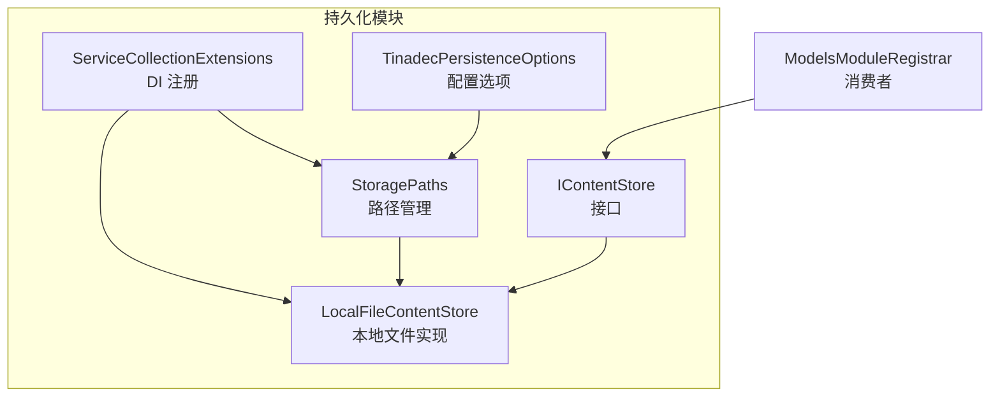
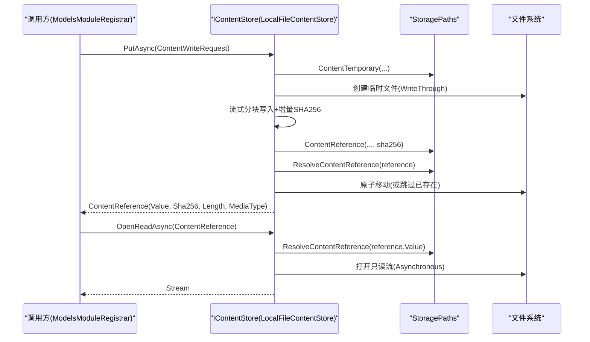
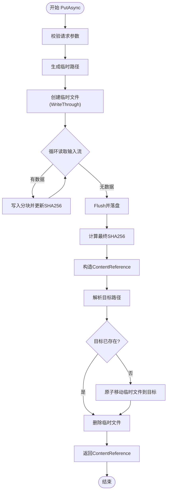
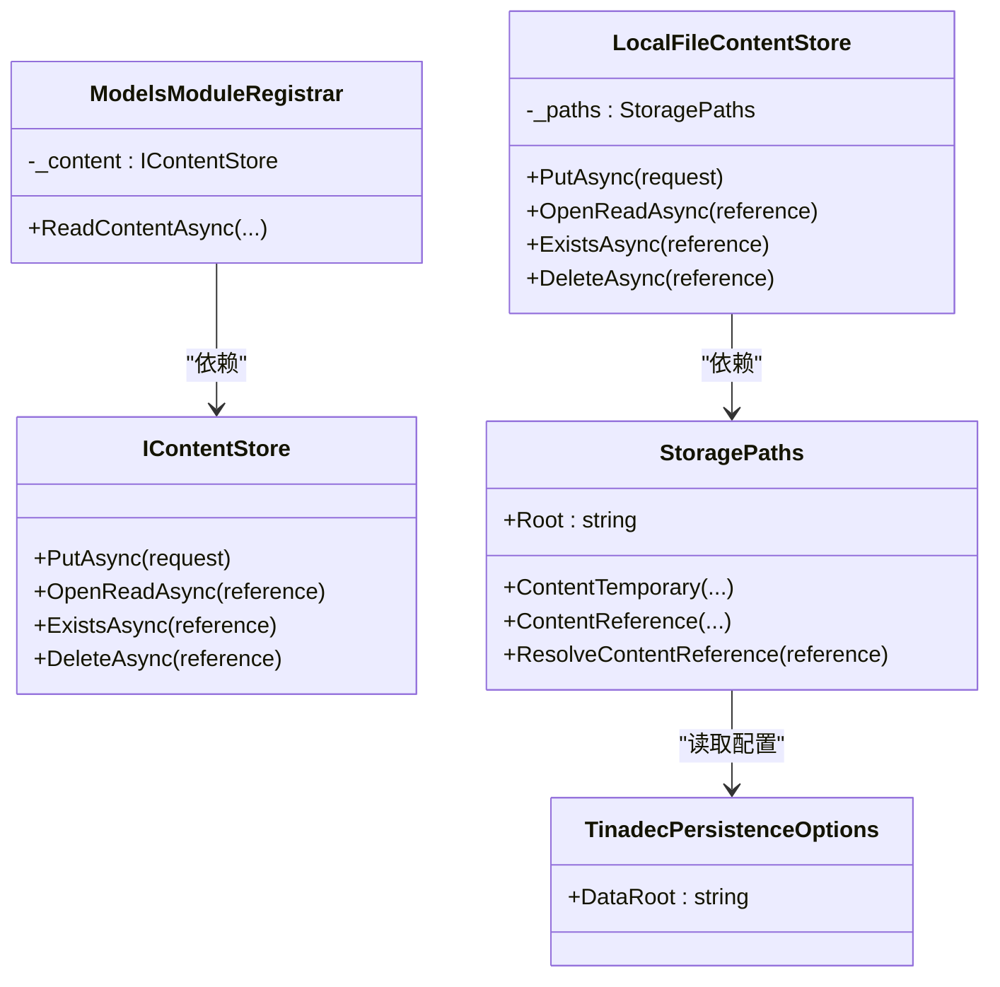
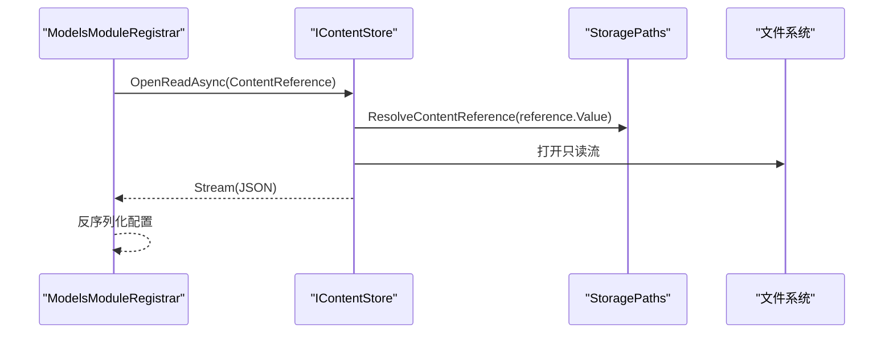

# 内容存储系统

<cite>
**本文引用的文件**   
- [IContentStore.cs](file://TinadecCore\Persistence\IContentStore.cs)
- [LocalFileContentStore.cs](file://TinadecCore\Persistence\LocalFileContentStore.cs)
- [StoragePaths.cs](file://TinadecCore\Persistence\StoragePaths.cs)
- [ServiceCollectionExtensions.cs](file://TinadecCore\Persistence\ServiceCollectionExtensions.cs)
- [TinadecPersistenceOptions.cs](file://TinadecCore\Persistence\TinadecPersistenceOptions.cs)
- [ModelsModuleRegistrar.cs](file://TinadecCore\Models\ModelsModuleRegistrar.cs)
</cite>

## 目录
1. [简介](#简介)
2. [项目结构](#项目结构)
3. [核心组件](#核心组件)
4. [架构总览](#架构总览)
5. [详细组件分析](#详细组件分析)
6. [依赖关系分析](#依赖关系分析)
7. [性能考虑](#性能考虑)
8. [故障排查指南](#故障排查指南)
9. [结论](#结论)
10. [附录：使用示例与扩展指南](#附录使用示例与扩展指南)

## 简介
本文件为 TinadecCore 内容存储系统的权威文档，聚焦于 IContentStore 接口设计与 LocalFileContentStore 本地文件实现。内容涵盖：
- 抽象层设计：IContentStore 的 PutAsync、OpenReadAsync、ExistsAsync、DeleteAsync 等核心方法
- 本地文件存储实现：流式写入、增量 SHA-256 校验、原子化重命名、路径安全校验
- 路径管理策略：StoragePaths 的目录结构与相对引用解析
- 并发与锁：基于文件系统共享模式与临时文件原子替换
- 错误处理：参数校验、路径逃逸防护、IO 异常传播
- 性能优化：异步流式读写、大对象分块、避免内存拷贝
- 扩展点：如何自定义后端并接入 DI 容器

## 项目结构
内容存储相关代码位于 Persistence 模块，核心由三个文件组成：
- IContentStore.cs：定义不可变的大内容存储接口与数据记录
- LocalFileContentStore.cs：基于本地文件系统的实现
- StoragePaths.cs：统一的路径生成与安全校验
- ServiceCollectionExtensions.cs：将 IContentStore 与 StoragePaths 注册到 DI 容器
- TinadecPersistenceOptions.cs：DataRoot 等配置项

图表来源 
- [IContentStore.cs:1-20](file://TinadecCore\Persistence\IContentStore.cs#L1-L20)
- [LocalFileContentStore.cs:1-68](file://TinadecCore\Persistence\LocalFileContentStore.cs#L1-L68)
- [StoragePaths.cs:1-64](file://TinadecCore\Persistence\StoragePaths.cs#L1-L64)
- [ServiceCollectionExtensions.cs:1-122](file://TinadecCore\Persistence\ServiceCollectionExtensions.cs#L1-L122)
- [TinadecPersistenceOptions.cs:1-48](file://TinadecCore\Persistence\TinadecPersistenceOptions.cs#L1-L48)
- [ModelsModuleRegistrar.cs:75-149](file://TinadecCore\Models\ModelsModuleRegistrar.cs#L75-L149)

章节来源
- [IContentStore.cs:1-20](file://TinadecCore\Persistence\IContentStore.cs#L1-L20)
- [LocalFileContentStore.cs:1-68](file://TinadecCore\Persistence\LocalFileContentStore.cs#L1-L68)
- [StoragePaths.cs:1-64](file://TinadecCore\Persistence\StoragePaths.cs#L1-L64)
- [ServiceCollectionExtensions.cs:1-122](file://TinadecCore\Persistence\ServiceCollectionExtensions.cs#L1-L122)
- [TinadecPersistenceOptions.cs:1-48](file://TinadecCore\Persistence\TinadecPersistenceOptions.cs#L1-L48)

## 核心组件
- IContentStore：提供不可变大内容的写入、读取、存在性检查与删除能力
- ContentWriteRequest：写入请求，包含租户/工作区标识、内容类型、媒体类型与流式内容
- ContentReference：只读引用，包含 Value（相对路径）、SHA-256、长度与媒体类型
- LocalFileContentStore：以本地文件系统为后端的实现，保证幂等与一致性
- StoragePaths：负责生成和解析受控路径，防止路径逃逸，统一目录布局

章节来源
- [IContentStore.cs:1-20](file://TinadecCore\Persistence\IContentStore.cs#L1-L20)
- [LocalFileContentStore.cs:1-68](file://TinadecCore\Persistence\LocalFileContentStore.cs#L1-L68)
- [StoragePaths.cs:1-64](file://TinadecCore\Persistence\StoragePaths.cs#L1-L64)

## 架构总览
内容存储采用“接口 + 具体实现”的分层设计，通过 DI 注入到上层模块（如 ModelsModuleRegistrar）。写入流程先写临时文件，计算哈希后原子移动到目标路径；读取通过相对引用解析到绝对路径并返回只读流。

图表来源 
- [LocalFileContentStore.cs:11-49](file://TinadecCore\Persistence\LocalFileContentStore.cs#L11-L49)
- [LocalFileContentStore.cs:51-56](file://TinadecCore\Persistence\LocalFileContentStore.cs#L51-L56)
- [StoragePaths.cs:28-41](file://TinadecCore\Persistence\StoragePaths.cs#L28-L41)
- [ModelsModuleRegistrar.cs:126-149](file://TinadecCore\Models\ModelsModuleRegistrar.cs#L126-L149)

## 详细组件分析

### IContentStore 接口与数据模型
- PutAsync：接收流式内容，返回不可变的 ContentReference
- OpenReadAsync：根据引用返回只读流，适合大对象零拷贝读取
- ExistsAsync：判断引用是否存在
- DeleteAsync：按引用删除底层文件
- ContentWriteRequest：包含 TenantId、WorkspaceId、Kind、MediaType、Content(Stream)
- ContentReference：Value（相对路径）、Sha256、Length、MediaType

设计要点
- 不可变性：ContentReference 为 record，确保引用稳定
- 流式输入：避免一次性加载到大内存
- 元数据内聚：引用中携带长度与媒体类型，便于上层快速决策

章节来源
- [IContentStore.cs:1-20](file://TinadecCore\Persistence\IContentStore.cs#L1-L20)

### LocalFileContentStore 实现原理
- 写入流程
  - 生成临时路径（含租户/工作区/Kind/.tmp/唯一ID）
  - 使用 WriteThrough 模式与异步流分块写入，边写边计算 SHA-256
  - 刷新并落盘，得到最终哈希
  - 构造 ContentReference，解析目标路径，若不存在则原子移动临时文件
  - 清理临时文件，返回引用
- 读取流程
  - 解析相对引用为绝对路径，打开只读异步流
- 存在性与删除
  - ExistsAsync 直接检测文件存在
  - DeleteAsync 删除对应文件

并发与锁
- 写入时临时文件独占 FileShare.None，避免并发覆盖
- 原子 Move 替代“写新+删除旧”，减少竞态
- 读取使用 FileShare.Read，允许多读不互斥

错误处理
- 参数校验：TenantId、Kind 非空
- 路径安全：ResolveContentReference 拒绝根路径与越界路径
- IO 异常：由 .NET 运行时抛出，调用方可捕获

章节来源
- [LocalFileContentStore.cs:11-49](file://TinadecCore\Persistence\LocalFileContentStore.cs#L11-L49)
- [LocalFileContentStore.cs:51-66](file://TinadecCore\Persistence\LocalFileContentStore.cs#L51-L66)

#### 写入算法流程图

图表来源 
- [LocalFileContentStore.cs:11-49](file://TinadecCore\Persistence\LocalFileContentStore.cs#L11-L49)

### StoragePaths 路径管理策略
- Root 初始化：从配置 DataRoot 解析绝对路径，要求非空
- 目录布局
  - content/tenants/{tenantId}/{workspaceId或tenant}/{kind}/...
  - 其他资源：sessions、tasks、events、artifacts、vectors 等
- 安全校验
  - Under() 强制路径在 Root 之下，防止路径逃逸
  - SanitizeSegment() 限制 Kind 仅允许字母数字、短横线、下划线
- 引用解析
  - ResolveContentReference() 将相对引用转换为绝对路径，并规范化分隔符

章节来源
- [StoragePaths.cs:1-64](file://TinadecCore\Persistence\StoragePaths.cs#L1-L64)

### 服务注册与配置
- ServiceCollectionExtensions.AddTinadecPersistence
  - 绑定 TinadecPersistenceOptions
  - 注册 StoragePaths、IContentStore(LocalFileContentStore)、向量数据库、密钥存储等
- TinadecPersistenceOptions.DataRoot
  - 控制 Core 自有文件的根目录，默认 "data"

章节来源
- [ServiceCollectionExtensions.cs:15-48](file://TinadecCore\Persistence\ServiceCollectionExtensions.cs#L15-L48)
- [TinadecPersistenceOptions.cs:21-23](file://TinadecCore\Persistence\TinadecPersistenceOptions.cs#L21-L23)

## 依赖关系分析
- LocalFileContentStore 依赖 StoragePaths 进行路径生成与解析
- StoragePaths 依赖 TinadecPersistenceOptions 获取 DataRoot
- 上层模块（如 ModelsModuleRegistrar）通过 IContentStore 消费内容存储能力

图表来源 
- [IContentStore.cs:1-20](file://TinadecCore\Persistence\IContentStore.cs#L1-L20)
- [LocalFileContentStore.cs:1-68](file://TinadecCore\Persistence\LocalFileContentStore.cs#L1-L68)
- [StoragePaths.cs:1-64](file://TinadecCore\Persistence\StoragePaths.cs#L1-L64)
- [TinadecPersistenceOptions.cs:1-48](file://TinadecCore\Persistence\TinadecPersistenceOptions.cs#L1-L48)
- [ModelsModuleRegistrar.cs:75-149](file://TinadecCore\Models\ModelsModuleRegistrar.cs#L75-L149)

章节来源
- [ServiceCollectionExtensions.cs:40-48](file://TinadecCore\Persistence\ServiceCollectionExtensions.cs#L40-L48)
- [ModelsModuleRegistrar.cs:75-149](file://TinadecCore\Models\ModelsModuleRegistrar.cs#L75-L149)

## 性能考虑
- 流式分块写入：固定缓冲区大小，避免整文件入内存
- 异步 I/O：WriteThrough 与 Asynchronous 标志提升吞吐
- 增量哈希：边读边算，无需二次遍历
- 原子移动：减少竞争窗口，降低重试成本
- 只读流：读取端可并行，不阻塞写入完成后的后续访问

建议优化方向（按需实现）
- 缓存热点引用：对频繁读取的小对象引入内存缓存（注意失效策略）
- 批量操作：封装批量 Put/Delete，减少重复路径解析与目录创建
- 预分配与合并：对连续小写入合并为批次，降低元数据开销
- 磁盘选择：SSD/NVMe 显著提升随机写性能

[本节为通用指导，不直接分析具体文件]

## 故障排查指南
常见问题与定位
- 路径逃逸异常：ResolveContentReference 抛出非法路径
  - 检查传入的 reference 是否为相对路径且未越界
- 参数校验失败：TenantId 为空或 Kind 包含非法字符
  - 确认调用方正确设置租户与工作区标识，Kind 仅含字母数字、短横线、下划线
- 文件被占用：写入时临时文件被其他进程锁定
  - 确保单写者模型，避免外部程序持有句柄
- 读取失败：OpenReadAsync 找不到文件
  - 核对 ContentReference.Value 是否与实际存储一致

定位步骤
- 启用日志输出，记录临时路径与目标路径
- 验证 DataRoot 配置是否正确指向期望目录
- 检查文件系统权限与磁盘空间

章节来源
- [StoragePaths.cs:34-53](file://TinadecCore\Persistence\StoragePaths.cs#L34-L53)
- [LocalFileContentStore.cs:11-49](file://TinadecCore\Persistence\LocalFileContentStore.cs#L11-L49)

## 结论
IContentStore 提供了简洁而强大的不可变内容存储抽象，LocalFileContentStore 以本地文件系统实现了高可靠、高性能的写入与读取路径。StoragePaths 确保了路径安全与一致的目录结构。结合 DI 注册，上层模块可以透明地存取二进制、JSON 与大型对象，并通过引用进行幂等操作。

[本节为总结，不直接分析具体文件]

## 附录：使用示例与扩展指南

### 使用示例
- 存储二进制数据
  - 构造 ContentWriteRequest，设置 TenantId、WorkspaceId、Kind、MediaType 与 Stream
  - 调用 PutAsync 获取 ContentReference
  - 使用 OpenReadAsync 读取流进行处理
- 存储 JSON 文件
  - MediaType 设置为 application/json
  - 读取后可反序列化为对象
- 存储大型对象
  - 保持流式传输，避免一次性加载
  - 利用 ExistsAsync 做去重判断，避免重复写入相同内容

参考实现位置
- [LocalFileContentStore.cs:11-49](file://TinadecCore\Persistence\LocalFileContentStore.cs#L11-L49)
- [LocalFileContentStore.cs:51-56](file://TinadecCore\Persistence\LocalFileContentStore.cs#L51-L56)

### 并发访问控制与文件锁机制
- 写入阶段：临时文件使用独占写入，避免并发覆盖
- 原子替换：Move 操作保证要么成功要么失败，不会出现部分写入
- 读取阶段：多读共享，不阻塞写入完成后的后续访问

章节来源
- [LocalFileContentStore.cs:11-49](file://TinadecCore\Persistence\LocalFileContentStore.cs#L11-L49)

### 自定义内容存储后端开发指南
- 实现 IContentStore
  - PutAsync：支持流式写入与哈希计算，返回稳定的 ContentReference
  - OpenReadAsync：返回只读流，支持异步读取
  - ExistsAsync 与 DeleteAsync：与底层存储语义一致
- 路径与隔离
  - 若使用本地文件，建议复用 StoragePaths 或实现类似的安全解析
- 注册到 DI
  - 在 AddTinadecPersistence 或自定义扩展中替换 IContentStore 的实现
  - 如需新的路径策略，同时注册 StoragePaths 的新实现

参考位置
- [IContentStore.cs:1-20](file://TinadecCore\Persistence\IContentStore.cs#L1-L20)
- [ServiceCollectionExtensions.cs:40-48](file://TinadecCore\Persistence\ServiceCollectionExtensions.cs#L40-L48)

### 典型调用链（读取配置内容）

图表来源 
- [ModelsModuleRegistrar.cs:126-149](file://TinadecCore\Models\ModelsModuleRegistrar.cs#L126-L149)
- [LocalFileContentStore.cs:51-56](file://TinadecCore\Persistence\LocalFileContentStore.cs#L51-L56)
- [StoragePaths.cs:34-41](file://TinadecCore\Persistence\StoragePaths.cs#L34-L41)