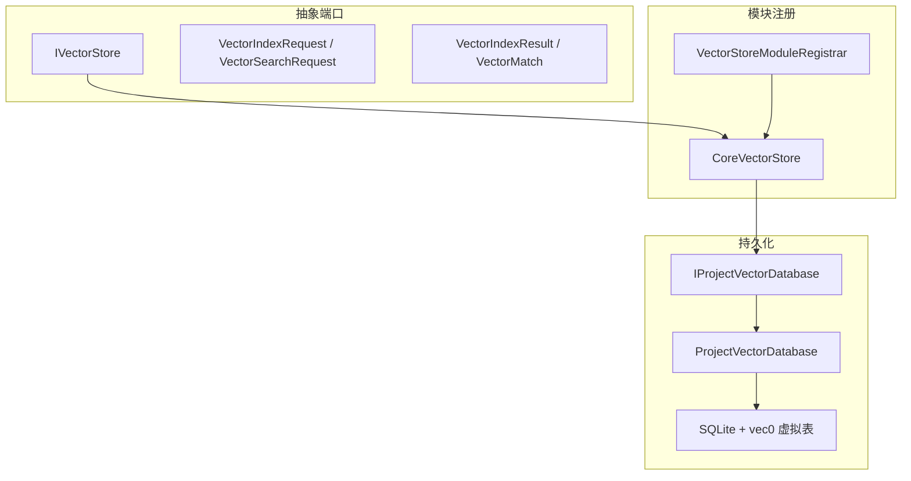
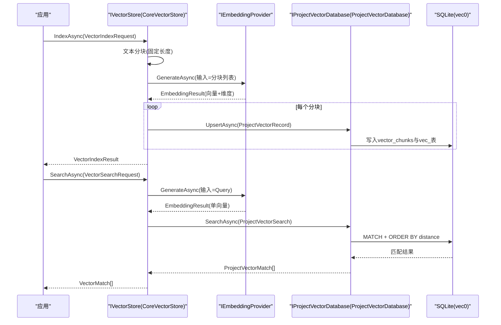
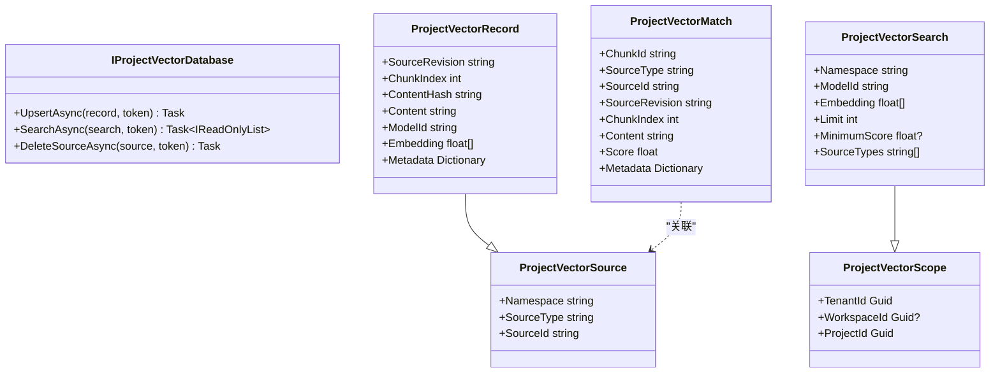
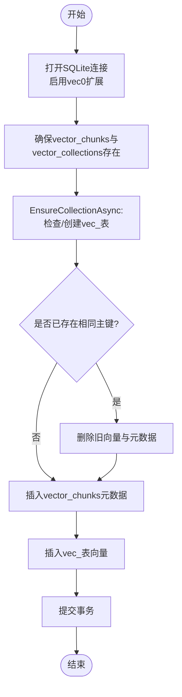
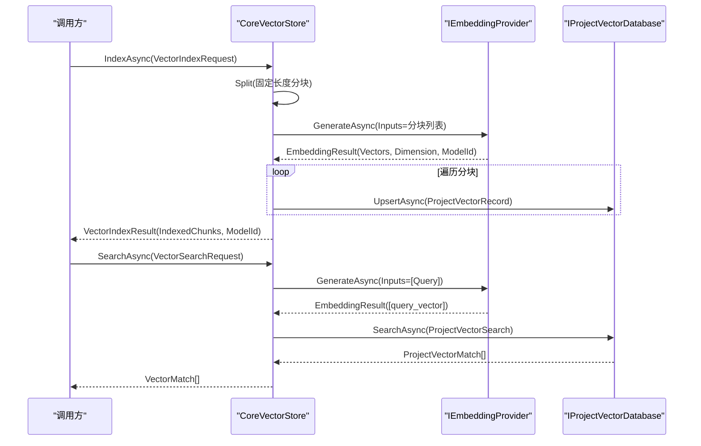
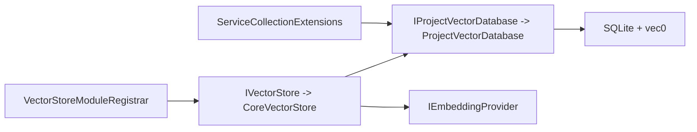

# 向量数据库

<cite>
**本文引用的文件**   
- [IProjectVectorDatabase.cs](file://TinadecCore\Persistence\IProjectVectorDatabase.cs)
- [ProjectVectorDatabase.cs](file://TinadecCore\Persistence\ProjectVectorDatabase.cs)
- [IVectorStore.cs](file://TinadecCore\Abstractions\Ports\IVectorStore.cs)
- [VectorStoreModuleRegistrar.cs](file://TinadecCore\VectorStore\VectorStoreModuleRegistrar.cs)
- [ServiceCollectionExtensions.cs](file://TinadecCore\Persistence\ServiceCollectionExtensions.cs)
- [VectorStoreEndToEndTests.cs](file://TinadecCore\tests\TinadecCore.Api.Tests\VectorStoreEndToEndTests.cs)
</cite>

## 目录
1. [简介](#简介)
2. [项目结构](#项目结构)
3. [核心组件](#核心组件)
4. [架构总览](#架构总览)
5. [详细组件分析](#详细组件分析)
6. [依赖关系分析](#依赖关系分析)
7. [性能考量](#性能考量)
8. [故障排除指南](#故障排除指南)
9. [结论](#结论)
10. [附录](#附录)

## 简介
本文件为 TinadecCore 的向量数据库模块提供系统化文档，重点围绕 ProjectVectorDatabase 的设计与实现，涵盖向量嵌入的存储、检索与相似度搜索。文档解释 IProjectVectorDatabase 接口的核心方法（UpsertAsync、SearchAsync、DeleteSourceAsync），并说明向量数据的索引策略、查询优化与内存管理。同时给出使用示例（文本分块、生成嵌入、存储与语义搜索）、维度配置、距离度量与排序方式，以及性能调优建议（批量插入、分页查询、缓存策略）和外部向量数据库集成与迁移方案。最后提供故障排除指南与监控指标说明。

## 项目结构
向量能力由“抽象端口 + 模块注册 + 持久化实现”三层组成：
- 抽象端口层：定义 IVectorStore 接口及请求/响应模型，屏蔽底层实现细节。
- 模块注册层：将 CoreVectorStore 注册为 IVectorStore 的实现，并声明模块能力。
- 持久化层：IProjectVectorDatabase 接口与 ProjectVectorDatabase 实现，基于 SQLite 与 vec0 虚拟表进行向量存储与检索。

**图表来源** 
- [IVectorStore.cs:1-59](file://TinadecCore\Abstractions\Ports\IVectorStore.cs#L1-L59)
- [VectorStoreModuleRegistrar.cs:1-105](file://TinadecCore\VectorStore\VectorStoreModuleRegistrar.cs#L1-L105)
- [IProjectVectorDatabase.cs:1-57](file://TinadecCore\Persistence\IProjectVectorDatabase.cs#L1-L57)
- [ProjectVectorDatabase.cs:1-174](file://TinadecCore\Persistence\ProjectVectorDatabase.cs#L1-L174)

**章节来源**
- [IVectorStore.cs:1-59](file://TinadecCore\Abstractions\Ports\IVectorStore.cs#L1-L59)
- [VectorStoreModuleRegistrar.cs:1-105](file://TinadecCore\VectorStore\VectorStoreModuleRegistrar.cs#L1-L105)
- [IProjectVectorDatabase.cs:1-57](file://TinadecCore\Persistence\IProjectVectorDatabase.cs#L1-L57)
- [ProjectVectorDatabase.cs:1-174](file://TinadecCore\Persistence\ProjectVectorDatabase.cs#L1-L174)

## 核心组件
- IVectorStore：对外暴露语义索引与检索能力，包含 IndexAsync、SearchAsync、DeleteSourceAsync。
- CoreVectorStore：实现 IVectorStore，负责文本分块、调用嵌入服务生成向量、写入 ProjectVectorDatabase，并将结果映射为 VectorMatch。
- IProjectVectorDatabase：面向项目的向量持久化接口，包含 UpsertAsync、SearchAsync、DeleteSourceAsync。
- ProjectVectorDatabase：基于 SQLite 与 vec0 扩展的向量存储实现，维护 vector_chunks 元数据表与按模型维度隔离的向量虚拟表。

关键数据模型：
- VectorIndexRequest / VectorSearchRequest：封装租户/工作区/项目范围、命名空间、源类型/ID、查询或内容等。
- ProjectVectorRecord / ProjectVectorSearch / ProjectVectorMatch：持久化层的记录、查询与匹配结果。

**章节来源**
- [IVectorStore.cs:1-59](file://TinadecCore\Abstractions\Ports\IVectorStore.cs#L1-L59)
- [VectorStoreModuleRegistrar.cs:29-105](file://TinadecCore\VectorStore\VectorStoreModuleRegistrar.cs#L29-L105)
- [IProjectVectorDatabase.cs:1-57](file://TinadecCore\Persistence\IProjectVectorDatabase.cs#L1-L57)
- [ProjectVectorDatabase.cs:1-174](file://TinadecCore\Persistence\ProjectVectorDatabase.cs#L1-L174)

## 架构总览
整体流程：上层通过 IVectorStore 调用 IndexAsync/SearchAsync；CoreVectorStore 负责文本切分与嵌入生成；随后调用 IProjectVectorDatabase 完成持久化与检索；底层 ProjectVectorDatabase 使用 SQLite 的 vec0 扩展执行向量近似最近邻搜索。

**图表来源** 
- [VectorStoreModuleRegistrar.cs:29-105](file://TinadecCore\VectorStore\VectorStoreModuleRegistrar.cs#L29-L105)
- [ProjectVectorDatabase.cs:20-89](file://TinadecCore\Persistence\ProjectVectorDatabase.cs#L20-L89)

## 详细组件分析

### IProjectVectorDatabase 接口与数据模型
- 接口方法
  - UpsertAsync：幂等写入分块与向量，若存在相同主键则先删后插。
  - SearchAsync：基于向量相似性检索，支持 Limit、MinimumScore、SourceTypes 过滤。
  - DeleteSourceAsync：按 SourceType/SourceId 删除对应源的所有分块与向量。
- 数据模型
  - ProjectVectorScope：租户/工作区/项目作用域。
  - ProjectVectorSource：命名空间、源类型、源标识。
  - ProjectVectorRecord：分块索引、内容哈希、内容、模型ID、向量、元数据。
  - ProjectVectorSearch：查询向量、限制数量、最低分数、源类型过滤。
  - ProjectVectorMatch：匹配结果，含 ChunkId、Content、Score、Metadata。

**图表来源** 
- [IProjectVectorDatabase.cs:1-57](file://TinadecCore\Persistence\IProjectVectorDatabase.cs#L1-L57)

**章节来源**
- [IProjectVectorDatabase.cs:1-57](file://TinadecCore\Persistence\IProjectVectorDatabase.cs#L1-L57)

### ProjectVectorDatabase 实现要点
- 连接与扩展
  - 打开 SQLite 连接，启用扩展并加载 vec0 向量扩展。
  - 自动创建 vector_chunks 元数据表与 vector_collections 维度登记表。
- 集合表策略
  - 按 ModelId 与维度动态创建 vec_前缀虚拟表，确保不同模型/维度隔离。
  - EnsureCollectionAsync 校验维度一致性，防止模型维度变更导致错误。
- Upsert 流程
  - 事务内先查是否存在相同主键（namespace/source_type/source_id/source_revision/chunk_index/model_id）。
  - 若存在则删除旧行，再插入新行并写入向量到 vec_表。
- 搜索流程
  - 使用 vec0 的 MATCH 操作，ORDER BY distance 排序。
  - 对返回结果按 Limit 截断，并按 MinimumScore 与 SourceTypes 过滤。
  - 将 distance 转换为 Score = 1 - distance。
- 删除流程
  - 根据 SourceType/SourceId 查找所有相关 id 与 model_id，逐条删除向量与元数据。

**图表来源** 
- [ProjectVectorDatabase.cs:20-60](file://TinadecCore\Persistence\ProjectVectorDatabase.cs#L20-L60)
- [ProjectVectorDatabase.cs:124-141](file://TinadecCore\Persistence\ProjectVectorDatabase.cs#L124-L141)

**章节来源**
- [ProjectVectorDatabase.cs:1-174](file://TinadecCore\Persistence\ProjectVectorDatabase.cs#L1-L174)

### IVectorStore 与 CoreVectorStore
- IndexAsync
  - 将输入文本按固定长度（例如 1600 字符）切分为多个分块。
  - 调用 IEmbeddingProvider 生成向量，校验维度一致性与数量。
  - 循环调用 _database.UpsertAsync 写入每个分块与向量。
  - 返回 VectorIndexResult（IndexedChunks、ModelId）。
- SearchAsync
  - 将 Query 转为向量，调用 _database.SearchAsync 获取匹配结果。
  - 将 ProjectVectorMatch 映射为 VectorMatch 返回。
- DeleteSourceAsync
  - 直接委托给 _database.DeleteSourceAsync。

**图表来源** 
- [VectorStoreModuleRegistrar.cs:29-105](file://TinadecCore\VectorStore\VectorStoreModuleRegistrar.cs#L29-L105)

**章节来源**
- [VectorStoreModuleRegistrar.cs:29-105](file://TinadecCore\VectorStore\VectorStoreModuleRegistrar.cs#L29-L105)

### 端到端测试用例
- 验证 IndexAsync 与 SearchAsync 完整链路，包括嵌入提供者与项目级数据库。
- 验证跨项目隔离：其他项目无法检索到当前项目数据。
- 验证 DeleteSourceAsync 后搜索结果为空。

**章节来源**
- [VectorStoreEndToEndTests.cs:31-97](file://TinadecCore\tests\TinadecCore.Api.Tests\VectorStoreEndToEndTests.cs#L31-L97)

## 依赖关系分析
- 服务注册
  - ServiceCollectionExtensions.AddTinadecPersistence 注册 IDatabaseConnectionInfo、StoragePaths、IProjectVectorDatabase 等。
  - VectorStoreModuleRegistrar 注册 IVectorStore -> CoreVectorStore。
- 运行时依赖
  - CoreVectorStore 依赖 IEmbeddingProvider 与 IProjectVectorDatabase。
  - ProjectVectorDatabase 依赖 IDatabaseConnectionInfo 与 StoragePaths，并使用 SQLite 与 vec0 扩展。

**图表来源** 
- [ServiceCollectionExtensions.cs:1-122](file://TinadecCore\Persistence\ServiceCollectionExtensions.cs#L1-L122)
- [VectorStoreModuleRegistrar.cs:1-28](file://TinadecCore\VectorStore\VectorStoreModuleRegistrar.cs#L1-L28)

**章节来源**
- [ServiceCollectionExtensions.cs:1-122](file://TinadecCore\Persistence\ServiceCollectionExtensions.cs#L1-L122)
- [VectorStoreModuleRegistrar.cs:1-28](file://TinadecCore\VectorStore\VectorStoreModuleRegistrar.cs#L1-L28)

## 性能考量
- 索引策略
  - 文本分块采用固定长度（如 1600 字符），简单高效，适合快速切分与均匀分布。
  - 向量表按模型维度隔离，避免跨模型干扰，提升查询效率。
- 查询优化
  - 使用 vec0 的 MATCH 操作与 ORDER BY distance，利用数据库内置向量检索。
  - 内部 Limit 放大（例如乘以 4）后再在应用层过滤，提高召回率与可控性。
- 内存管理
  - 流式读取匹配结果，按需构建 ProjectVectorMatch，减少一次性内存占用。
  - 事务包裹写操作，保证一致性并降低锁竞争。
- 批量插入
  - 当前实现为逐条 Upsert，建议在高频写入场景考虑批处理（如批量 INSERT 或事务合并）以降低开销。
- 分页查询
  - 可在 SearchAsync 基础上增加 offset/limit 或游标分页，结合 MinimumScore 控制结果集大小。
- 缓存策略
  - 对频繁查询的 Query 向量可短期缓存（注意失效策略与内存上限）。
  - 对热门分块内容可加 LRU 缓存，但需权衡一致性。

[本节为通用指导，不直接分析具体文件]

## 故障排除指南
- 常见异常
  - 维度不一致：EnsureCollectionAsync 检测到模型维度变化会抛出异常。需确认嵌入模型未变更或重建索引。
  - 参数校验失败：Validate 方法对必填字段进行检查，缺失 TenantId/ProjectId/ModelId/Embedding/Namespace 等会抛异常。
  - 非 SQLite 提供者：ProjectVectorDatabase 目前仅支持 SQLite，PostgreSQL 尚未实现。
- 排查步骤
  - 检查配置是否正确（Sqlite 路径、DataRoot）。
  - 确认嵌入提供者可用且返回一致的维度与向量数量。
  - 查看 SQLite 文件是否存在与权限是否正常。
  - 使用最小查询（Limit=1，MinimumScore=0）定位问题。
- 监控指标
  - 索引耗时与分块数（VectorIndexResult.IndexedChunks）。
  - 查询延迟与命中数（SearchAsync 返回数量）。
  - 错误率（维度不一致、参数校验失败、提供者不可用）。
  - 磁盘增长（vector_chunks 与 vec_表大小）。

**章节来源**
- [ProjectVectorDatabase.cs:124-141](file://TinadecCore\Persistence\ProjectVectorDatabase.cs#L124-L141)
- [ProjectVectorDatabase.cs:169-172](file://TinadecCore\Persistence\ProjectVectorDatabase.cs#L169-L172)
- [ProjectVectorDatabase.cs:109-122](file://TinadecCore\Persistence\ProjectVectorDatabase.cs#L109-L122)

## 结论
TinadecCore 的向量数据库以清晰的抽象与模块化设计实现了项目级的语义索引与检索。通过 IVectorStore 暴露统一接口，CoreVectorStore 协调嵌入生成与持久化，ProjectVectorDatabase 基于 SQLite 与 vec0 提供高效的向量存储与相似度搜索。该方案具备良好的可扩展性，便于未来接入更多后端（如 PostgreSQL）并进行性能调优。

[本节为总结，不直接分析具体文件]

## 附录
- 使用示例（概念性步骤）
  - 文本嵌入生成：将长文本按固定长度切分，调用嵌入服务得到向量。
  - 向量存储：将每个分块及其向量写入 ProjectVectorDatabase。
  - 语义搜索：将查询转为向量，执行相似度检索并过滤结果。
- 向量维度配置
  - 维度由嵌入模型决定，EnsureCollectionAsync 强制一致性。
- 距离度量算法
  - 使用 vec0 的 MATCH 与 distance 排序，Score = 1 - distance。
- 搜索结果排序
  - 默认按 distance 升序，应用层可按 Score 降序展示。
- 外部向量数据库集成与迁移
  - 通过 IProjectVectorDatabase 抽象替换实现，保持上层不变。
  - 迁移时先双写，再切换读，最后下线旧库。

[本节为概念性内容，不直接分析具体文件]