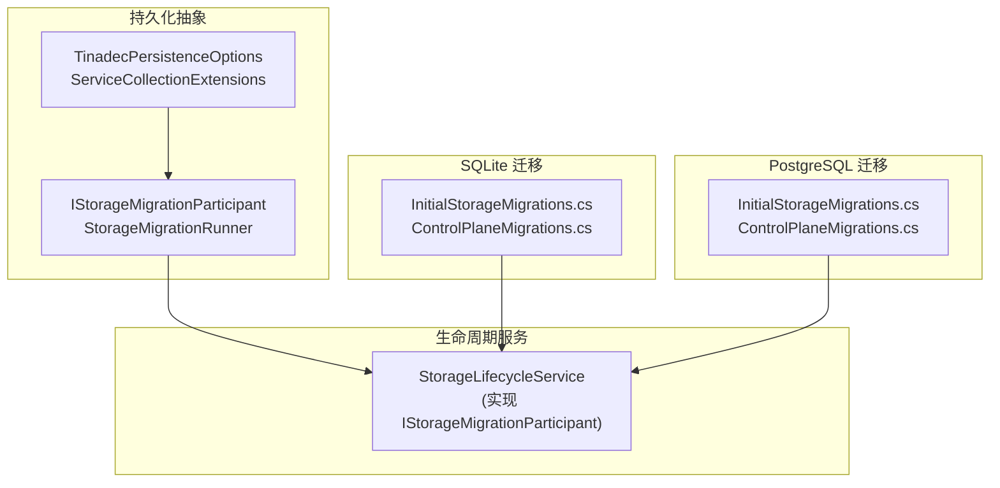
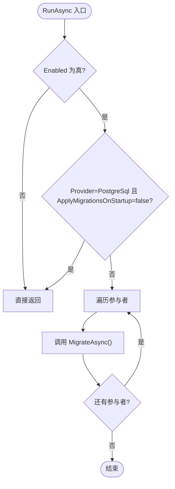
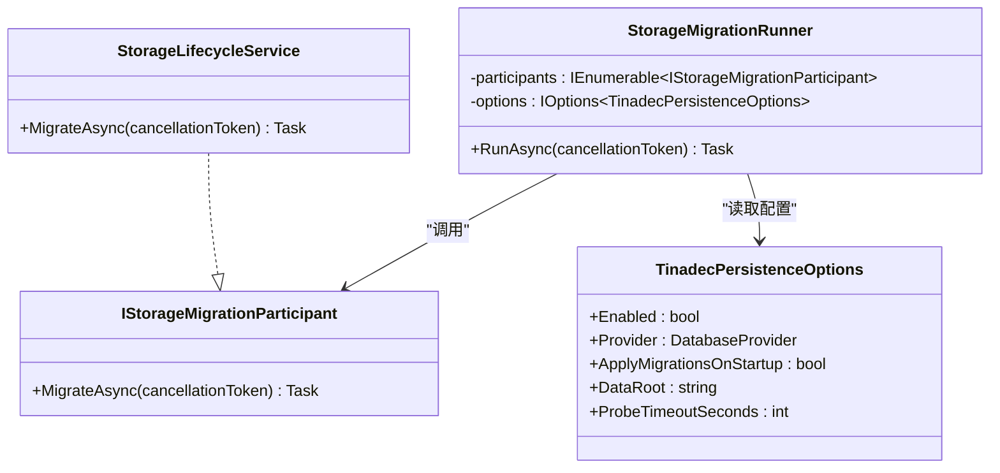

# 存储迁移管理

<cite>
**本文引用的文件**
- [StorageMigration.cs](file://TinadecCore\Persistence\StorageMigration.cs)
- [ServiceCollectionExtensions.cs](file://TinadecCore\Persistence\ServiceCollectionExtensions.cs)
- [TinadecPersistenceOptions.cs](file://TinadecCore\Persistence\TinadecPersistenceOptions.cs)
- [InitialStorageMigrations.cs (SQLite)](file://TinadecCore\Storage.Migrations.Sqlite\InitialStorageMigrations.cs)
- [ControlPlaneMigrations.cs (SQLite)](file://TinadecCore\Storage.Migrations.Sqlite\ControlPlaneMigrations.cs)
- [InitialStorageMigrations.cs (PostgreSQL)](file://TinadecCore\Storage.Migrations.PostgreSql\InitialStorageMigrations.cs)
- [ControlPlaneMigrations.cs (PostgreSQL)](file://TinadecCore\Storage.Migrations.PostgreSql\ControlPlaneMigrations.cs)
- [appsettings.json](file://TinadecCore\Api\appsettings.json)
- [core-storage-postgres.yml](file://.github\workflows\core-storage-postgres.yml)
- [StorageLifecycleService.cs](file://TinadecCore\Lifecycle\StorageLifecycleService.cs)
- [MigrationTests.cs](file://tests\TinadecCore.Tests\MigrationTests.cs)
</cite>

## 目录
1. [简介](#简介)
2. [项目结构](#项目结构)
3. [核心组件](#核心组件)
4. [架构总览](#架构总览)
5. [详细组件分析](#详细组件分析)
6. [依赖关系分析](#依赖关系分析)
7. [性能考量](#性能考量)
8. [故障排除指南](#故障排除指南)
9. [结论](#结论)
10. [附录](#附录)

## 简介
本文件面向 TinadecCore 的存储迁移管理，系统性阐述 StorageMigration 相关执行机制、版本控制策略，以及 SQLite 与 PostgreSQL 两套迁移脚本的结构与命名约定。文档同时覆盖 InitialStorageMigrations 初始迁移与 ControlPlaneMigrations 控制平面迁移的职责与作用，提供新增表/字段与数据迁移脚本的开发规范，并给出回滚、备份与灾难恢复策略、测试方法与验证工具使用、多环境部署与 CI/CD 集成建议，以及常见问题的排查方案。

## 项目结构
存储迁移能力由“持久化抽象 + 迁移参与者 + 数据库提供者特定迁移”三部分构成：
- 持久化抽象层：定义迁移参与者接口与运行器，统一配置与连接解析。
- 迁移参与者：业务模块实现 IStorageMigrationParticipant，在启动时按顺序执行 MigrateAsync。
- 提供者特定迁移：SQLite 与 PostgreSQL 各自维护独立的迁移程序集，包含 EF Core Migration 类，分别描述各 DbContext 的 Up/Down 变更。



图表来源
- [StorageMigration.cs](file://TinadecCore\Persistence\StorageMigration.cs)
- [ServiceCollectionExtensions.cs](file://TinadecCore\Persistence\ServiceCollectionExtensions.cs)
- [InitialStorageMigrations.cs (SQLite)](file://TinadecCore\Storage.Migrations.Sqlite\InitialStorageMigrations.cs)
- [ControlPlaneMigrations.cs (SQLite)](file://TinadecCore\Storage.Migrations.Sqlite\ControlPlaneMigrations.cs)
- [InitialStorageMigrations.cs (PostgreSQL)](file://TinadecCore\Storage.Migrations.PostgreSql\InitialStorageMigrations.cs)
- [ControlPlaneMigrations.cs (PostgreSQL)](file://TinadecCore\Storage.Migrations.PostgreSql\ControlPlaneMigrations.cs)
- [StorageLifecycleService.cs](file://TinadecCore\Lifecycle\StorageLifecycleService.cs)

章节来源
- [StorageMigration.cs](file://TinadecCore\Persistence\StorageMigration.cs)
- [ServiceCollectionExtensions.cs](file://TinadecCore\Persistence\ServiceCollectionExtensions.cs)
- [TinadecPersistenceOptions.cs](file://TinadecCore\Persistence\TinadecPersistenceOptions.cs)

## 核心组件
- IStorageMigrationParticipant：业务模块暴露的迁移入口，定义 MigrateAsync。
- StorageMigrationRunner：迁移编排器，读取配置决定是否启用迁移，并按参与者顺序调用 MigrateAsync。
- TinadecPersistenceOptions：统一的持久化配置（Provider、ApplyMigrationsOnStartup、DataRoot、探针超时等）。
- ServiceCollectionExtensions：注册选项、连接信息、数据库就绪检查、迁移运行器等；提供 UseTinadecDatabase 扩展以将当前 Provider 应用到 DbContext。
- StorageLifecycleService：实现 IStorageMigrationParticipant，负责 LifecycleDbContext 的迁移与必要表初始化。

章节来源
- [StorageMigration.cs](file://TinadecCore\Persistence\StorageMigration.cs)
- [ServiceCollectionExtensions.cs](file://TinadecCore\Persistence\ServiceCollectionExtensions.cs)
- [TinadecPersistenceOptions.cs](file://TinadecCore\Persistence\TinadecPersistenceOptions.cs)
- [StorageLifecycleService.cs](file://TinadecCore\Lifecycle\StorageLifecycleService.cs)

## 架构总览
迁移执行流程如下：应用启动时，StorageMigrationRunner 根据配置决定是否执行迁移；若启用，则依次调用各参与者的 MigrateAsync。StorageLifecycleService 内部通过 EF Core 的 Database.MigrateAsync 触发对应 Provider 的迁移程序集执行，确保 schema 一致。

```mermaid
sequenceDiagram
participant App as "应用启动"
participant Runner as "StorageMigrationRunner"
participant Participant as "StorageLifecycleService"
participant DB as "EF Core 数据库"
participant Mig as "Provider 迁移程序集"
App->>Runner : RunAsync()
alt 已禁用或 PostgreSql 未开启 ApplyMigrationsOnStartup
Runner-->>App : 直接返回
else 允许迁移
Runner->>Participant : MigrateAsync()
Participant->>DB : Database.MigrateAsync()
DB->>Mig : 执行 Up() 迁移
Mig-->>DB : 完成
DB-->>Participant : 成功
Participant-->>Runner : 完成
Runner-->>App : 完成
end
```

图表来源
- [StorageMigration.cs](file://TinadecCore\Persistence\StorageMigration.cs)
- [StorageLifecycleService.cs](file://TinadecCore\Lifecycle\StorageLifecycleService.cs)

## 详细组件分析

### StorageMigrationRunner 与参与者机制
- 行为要点：
  - 当 TinadecPersistenceOptions.Enabled 为 false，或 Provider 为 PostgreSql 且 ApplyMigrationsOnStartup 为 false 时，跳过迁移。
  - 遍历所有 IStorageMigrationParticipant，串行执行 MigrateAsync。
- 设计意图：
  - 将“是否迁移”和“何时迁移”从业务模块解耦，集中由 Runner 决策。
  - 对 PostgreSql 采用显式开关，避免多实例并发竞争导致 schema 冲突。



图表来源
- [StorageMigration.cs](file://TinadecCore\Persistence\StorageMigration.cs)

章节来源
- [StorageMigration.cs](file://TinadecCore\Persistence\StorageMigration.cs)

### StorageLifecycleService 的迁移职责
- 作为 IStorageMigrationParticipant 的实现，负责 LifecycleDbContext 的迁移与必要的表初始化。
- 内部还实现了事件追加、回放、对齐等能力，但迁移仅聚焦于 Database.MigrateAsync 与表结构保障。

章节来源
- [StorageLifecycleService.cs](file://TinadecCore\Lifecycle\StorageLifecycleService.cs)

### 配置与连接解析
- TinadecPersistenceOptions：
  - Enabled：是否启用持久化。
  - Provider：默认 Sqlite，可切换 PostgreSql。
  - ApplyMigrationsOnStartup：PostgreSql 需显式开启才会在启动时执行迁移。
  - DataRoot：数据根路径。
  - ProbeTimeoutSeconds：健康探测超时。
- ServiceCollectionExtensions：
  - 绑定配置、校验 ProbeTimeoutSeconds 范围。
  - 解析 IDatabaseConnectionInfo（SQLite 文件路径或 PostgreSQL 连接字符串名称）。
  - 注册 StorageMigrationRunner 与数据库就绪检查。

章节来源
- [TinadecPersistenceOptions.cs](file://TinadecCore\Persistence\TinadecPersistenceOptions.cs)
- [ServiceCollectionExtensions.cs](file://TinadecCore\Persistence\ServiceCollectionExtensions.cs)
- [appsettings.json](file://TinadecCore\Api\appsettings.json)

### SQLite 迁移脚本结构与命名约定
- 文件组织：
  - InitialStorageMigrations.cs：Memory 与 Lifecycle 的初始建表与索引。
  - ControlPlaneMigrations.cs：Tenancy 域及 Memory/Lifecycle 的多租户字段扩展。
- 命名约定：
  - 每个 Migration 类标注 [DbContext(typeof(...))] 与 [Migration("时间戳_标识")]。
  - 时间戳前缀保证顺序性，标识具有可读性（如 MemoryInitial、LifecycleInitial、TenancyInitial、MemoryTenantScope、LifecycleTenantScope）。
- 内容要点：
  - 初始迁移创建 projects、sessions、runs、event_index 等表与关键索引。
  - 控制平面迁移创建 tenants、principals、tenant_memberships、workspaces、workspace_memberships 等表，并为 projects/sessions/runs/event_index 增加 tenant_id、workspace_id 列与复合索引。

章节来源
- [InitialStorageMigrations.cs (SQLite)](file://TinadecCore\Storage.Migrations.Sqlite\InitialStorageMigrations.cs)
- [ControlPlaneMigrations.cs (SQLite)](file://TinadecCore\Storage.Migrations.Sqlite\ControlPlaneMigrations.cs)

### PostgreSQL 迁移脚本结构与命名约定
- 文件组织与命名与 SQLite 保持一致，便于跨提供者同步演进。
- 差异点：
  - 类型映射遵循 PostgreSQL 语义（如 uuid、varchar、timestamptz）。
  - 使用 if not exists 等幂等语句增强重入安全性。
- 内容要点：
  - 与 SQLite 一致的表结构与索引策略，确保模型一致性。

章节来源
- [InitialStorageMigrations.cs (PostgreSQL)](file://TinadecCore\Storage.Migrations.PostgreSql\InitialStorageMigrations.cs)
- [ControlPlaneMigrations.cs (PostgreSQL)](file://TinadecCore\Storage.Migrations.PostgreSql\ControlPlaneMigrations.cs)

### 初始迁移与控制平面迁移的作用
- InitialStorageMigrations：
  - 建立核心领域表（项目、会话、运行记录、事件索引）与查询所需索引。
  - 为后续功能演进奠定稳定基线。
- ControlPlaneMigrations：
  - 引入多租户与工作区概念，完善权限与隔离。
  - 为现有表注入 tenant_id/workspace_id 维度，并提供相应复合索引优化查询。

章节来源
- [InitialStorageMigrations.cs (SQLite)](file://TinadecCore\Storage.Migrations.Sqlite\InitialStorageMigrations.cs)
- [ControlPlaneMigrations.cs (SQLite)](file://TinadecCore\Storage.Migrations.Sqlite\ControlPlaneMigrations.cs)
- [InitialStorageMigrations.cs (PostgreSQL)](file://TinadecCore\Storage.Migrations.PostgreSql\InitialStorageMigrations.cs)
- [ControlPlaneMigrations.cs (PostgreSQL)](file://TinadecCore\Storage.Migrations.PostgreSql\ControlPlaneMigrations.cs)

### 迁移开发指南（新增表/字段/数据处理）
- 新增表：
  - 在对应 Provider 的迁移文件中新增 Migration 类，标注 DbContext 与唯一迁移名。
  - 在 Up 中创建表与索引，在 Down 中删除表。
- 修改字段：
  - 使用 AddColumn/AlterColumn 等 API 进行增量变更。
  - 对于需要兼容旧数据的场景，优先采用“新增列 + 双写 + 回填 + 切换读路径 + 清理旧列”的分阶段策略。
- 数据处理脚本：
  - 在 Migration.Up 中编写 SQL 或 LINQ 进行数据迁移，注意幂等性与事务边界。
  - 对大表更新应分批处理，避免长事务锁表。
- 版本控制：
  - 迁移名必须唯一且递增，保持跨 Provider 一致。
  - 禁止修改已发布的迁移，如需修复请新增迁移。

章节来源
- [InitialStorageMigrations.cs (SQLite)](file://TinadecCore\Storage.Migrations.Sqlite\InitialStorageMigrations.cs)
- [ControlPlaneMigrations.cs (SQLite)](file://TinadecCore\Storage.Migrations.Sqlite\ControlPlaneMigrations.cs)
- [InitialStorageMigrations.cs (PostgreSQL)](file://TinadecCore\Storage.Migrations.PostgreSql\InitialStorageMigrations.cs)
- [ControlPlaneMigrations.cs (PostgreSQL)](file://TinadecCore\Storage.Migrations.PostgreSql\ControlPlaneMigrations.cs)

### 迁移回滚、数据备份与灾难恢复
- 回滚：
  - 每个 Migration 需提供 Down 方法，用于撤销 Up 变更。
  - 建议在发布前本地/测试环境验证 Down 的可行性。
- 备份：
  - SQLite：备份 .db 文件；迁移前后均建议快照。
  - PostgreSQL：使用 pg_dump/pg_restore 或云厂商备份方案。
- 灾难恢复：
  - 先恢复数据，再执行迁移；或在容器镜像内预置目标 schema 并配合只读副本验证。
  - 对 PostgreSql 多实例部署，务必确保 ApplyMigrationsOnStartup 仅在单实例或受控节点启用，避免并发竞争。

章节来源
- [ControlPlaneMigrations.cs (SQLite)](file://TinadecCore\Storage.Migrations.Sqlite\ControlPlaneMigrations.cs)
- [ControlPlaneMigrations.cs (PostgreSQL)](file://TinadecCore\Storage.Migrations.PostgreSql\ControlPlaneMigrations.cs)
- [TinadecPersistenceOptions.cs](file://TinadecCore\Persistence\TinadecPersistenceOptions.cs)

### 迁移测试方法与验证工具
- 单元测试：
  - 使用内存 SQLite 或临时文件数据库构造历史 schema，验证 Initialize/迁移逻辑。
  - 参考 MigrationTests 的模式：构造遗留数据 -> 执行迁移 -> 断言结果。
- 端到端测试：
  - 在 CI 中拉起真实 PostgreSQL 服务，执行针对 PostgreSql 的测试用例。
- 验证工具：
  - 使用 EF Core 迁移命令（dotnet ef migrations）查看计划与生成脚本。
  - 在本地与测试环境分别执行 Up/Down 验证幂等性与兼容性。

章节来源
- [MigrationTests.cs](file://tests\TinadecCore.Tests\MigrationTests.cs)
- [core-storage-postgres.yml](file://.github\workflows\core-storage-postgres.yml)

### 多环境迁移部署与自动化流水线集成
- 开发环境：
  - 默认 Provider 为 SQLite，ApplyMigrationsOnStartup=true，自动迁移。
- 测试/预发：
  - 使用 PostgreSQL，Enable 迁移并在 CI 中执行测试。
- 生产环境：
  - 推荐外部化迁移执行（独立任务或受控 Pod），避免多实例并发竞争。
  - 结合蓝绿/金丝雀发布，先在单实例执行迁移并验证，再全量滚动。

章节来源
- [appsettings.json](file://TinadecCore\Api\appsettings.json)
- [core-storage-postgres.yml](file://.github\workflows\core-storage-postgres.yml)
- [TinadecPersistenceOptions.cs](file://TinadecCore\Persistence\TinadecPersistenceOptions.cs)

## 依赖关系分析
- 组件耦合：
  - StorageMigrationRunner 依赖 IStorageMigrationParticipant 集合与配置选项。
  - StorageLifecycleService 依赖 DbContextFactory 与文件系统路径。
  - 迁移程序集通过 EF Core 发现并执行，与业务代码解耦。
- 外部依赖：
  - EF Core 迁移框架。
  - SQLite/PostgreSQL 驱动与连接字符串解析。



图表来源
- [StorageMigration.cs](file://TinadecCore\Persistence\StorageMigration.cs)
- [StorageLifecycleService.cs](file://TinadecCore\Lifecycle\StorageLifecycleService.cs)
- [TinadecPersistenceOptions.cs](file://TinadecCore\Persistence\TinadecPersistenceOptions.cs)

章节来源
- [StorageMigration.cs](file://TinadecCore\Persistence\StorageMigration.cs)
- [ServiceCollectionExtensions.cs](file://TinadecCore\Persistence\ServiceCollectionExtensions.cs)

## 性能考量
- 迁移执行时机：
  - PostgreSql 多实例下关闭 ApplyMigrationsOnStartup，避免并发竞争。
- 索引设计：
  - 初始与控制平面迁移已为常用查询路径建立复合索引，关注写入放大与空间占用。
- 事件日志：
  - 事件追加采用追加写 JSONL 文件，索引记录偏移与长度，适合高吞吐写入与回放。

[本节为通用指导，不直接分析具体文件]

## 故障排除指南
- 迁移未执行：
  - 检查 TinadecPersistenceOptions.Enabled 与 Provider 设置。
  - PostgreSql 需确认 ApplyMigrationsOnStartup 是否为 true（或在外部任务执行）。
- 迁移失败：
  - 查看 EF Core 输出日志，定位具体迁移与 SQL。
  - 在本地复现，必要时手动执行 Down 后重试。
- 数据不一致：
  - 对事件回放与对齐逻辑，检查 EventIndex 与 JSONL 文件的一致性。
- 连接问题：
  - 校验 SQLite 文件路径或 PostgreSQL 连接字符串名称是否存在。

章节来源
- [StorageMigration.cs](file://TinadecCore\Persistence\StorageMigration.cs)
- [ServiceCollectionExtensions.cs](file://TinadecCore\Persistence\ServiceCollectionExtensions.cs)
- [StorageLifecycleService.cs](file://TinadecCore\Lifecycle\StorageLifecycleService.cs)

## 结论
TinadecCore 的存储迁移体系通过“配置驱动的迁移编排 + 参与者模式 + 提供者特定迁移程序集”，实现了跨 SQLite/PostgreSQL 的一致性与可扩展性。InitialStorageMigrations 奠定核心 schema，ControlPlaneMigrations 引入多租户与工作区能力。结合严格的命名约定、幂等设计与完善的测试与 CI 支持，可在多环境中安全演进。生产部署建议谨慎控制迁移执行时机，确保数据一致性与系统可用性。

## 附录
- 最佳实践清单：
  - 迁移名唯一且递增，禁止修改已发布迁移。
  - 所有迁移提供 Down 方法，并在测试中验证。
  - 大表变更分阶段实施，避免长事务。
  - PostgreSql 多实例禁用启动时迁移，改用受控任务。
  - 每次发布前后进行备份与回滚演练。

[本节为通用指导，不直接分析具体文件]