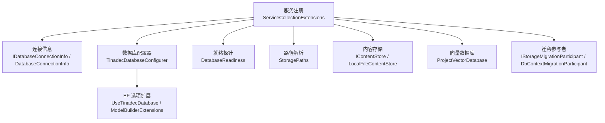
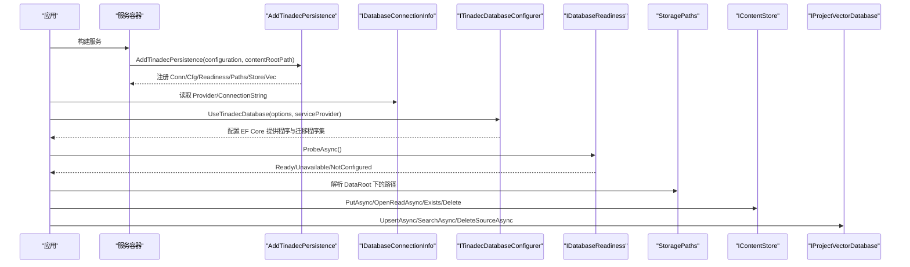
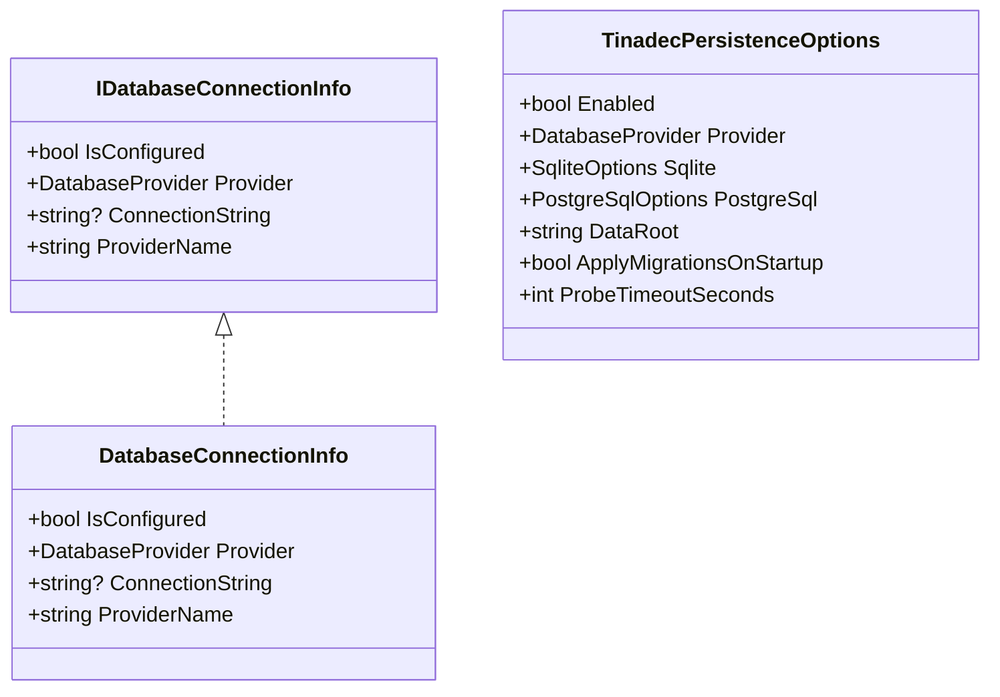
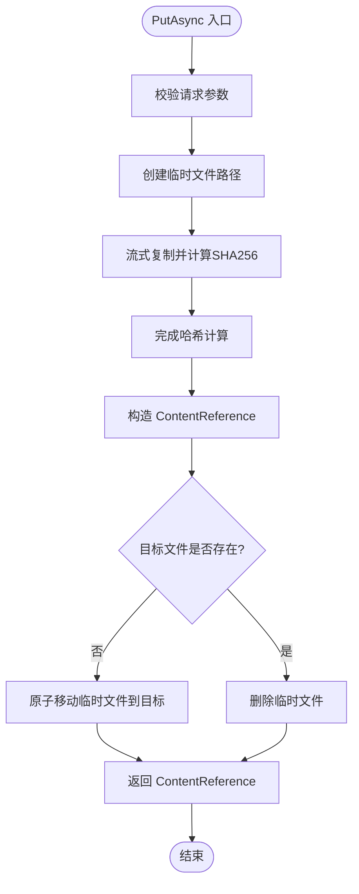
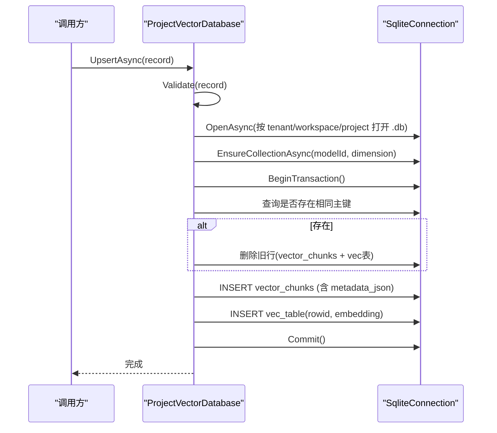
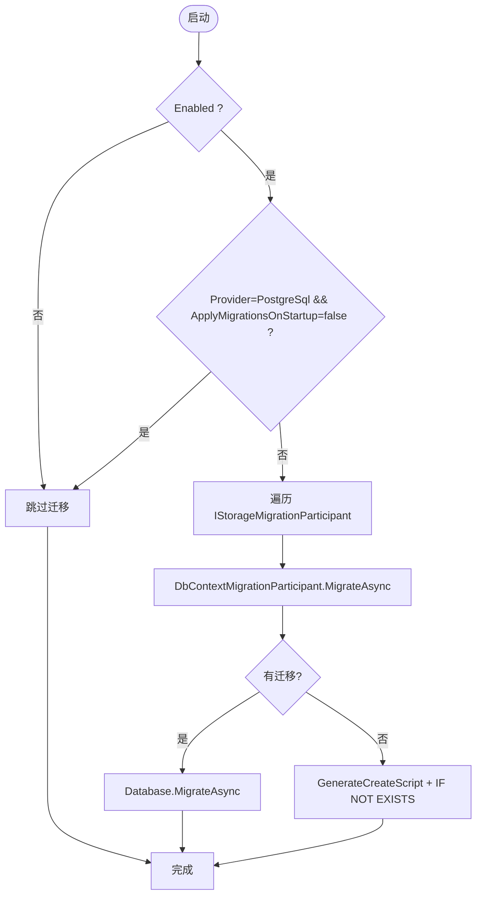
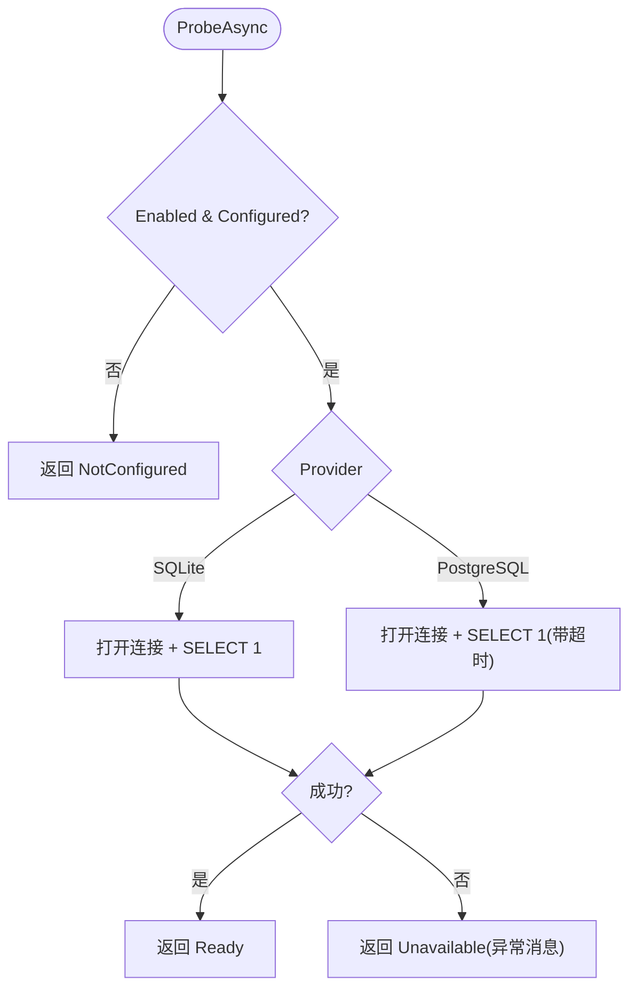
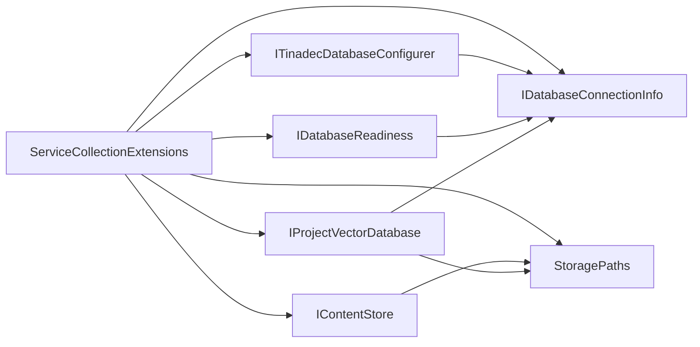

# 持久化层

<cite>
**本文引用的文件**   
- [IDatabaseConnectionInfo.cs](file://TinadecCore\Persistence\IDatabaseConnectionInfo.cs)
- [DatabaseProvider.cs](file://TinadecCore\Persistence\DatabaseProvider.cs)
- [DatabaseConnectionInfo.cs](file://TinadecCore\Persistence\DatabaseConnectionInfo.cs)
- [IContentStore.cs](file://TinadecCore\Persistence\IContentStore.cs)
- [LocalFileContentStore.cs](file://TinadecCore\Persistence\LocalFileContentStore.cs)
- [ProjectVectorDatabase.cs](file://TinadecCore\Persistence\ProjectVectorDatabase.cs)
- [ServiceCollectionExtensions.cs](file://TinadecCore\Persistence\ServiceCollectionExtensions.cs)
- [StoragePaths.cs](file://TinadecCore\Persistence\StoragePaths.cs)
- [ModelBuilderExtensions.cs](file://TinadecCore\Persistence\ModelBuilderExtensions.cs)
- [TinadecDatabaseConfigurer.cs](file://TinadecCore\Persistence\TinadecDatabaseConfigurer.cs)
- [StorageMigration.cs](file://TinadecCore\Persistence\StorageMigration.cs)
- [DbContextMigrationParticipant.cs](file://TinadecCore\Persistence\DbContextMigrationParticipant.cs)
- [DatabaseReadiness.cs](file://TinadecCore\Persistence\DatabaseReadiness.cs)
- [TinadecPersistenceOptions.cs](file://TinadecCore\Persistence\TinadecPersistenceOptions.cs)
</cite>

## 目录
1. [简介](#简介)
2. [项目结构](#项目结构)
3. [核心组件](#核心组件)
4. [架构总览](#架构总览)
5. [详细组件分析](#详细组件分析)
6. [依赖关系分析](#依赖关系分析)
7. [性能考虑](#性能考虑)
8. [故障排查指南](#故障排查指南)
9. [结论](#结论)
10. [附录](#附录)

## 简介
本文件面向 TinadecCore 的持久化层，系统性阐述数据库连接抽象、存储提供程序模式与内容存储接口。重点覆盖：
- IDatabaseConnectionInfo 连接信息接口与实现
- DatabaseProvider 枚举与配置解析
- IContentStore 内容存储抽象与 LocalFileContentStore 本地文件实现
- ProjectVectorDatabase 向量数据库（SQLite + vec0）实现
- Entity Framework Core 集成、迁移管理与数据访问模式
- 配置示例与自定义存储后端开发指南
- 数据一致性、事务处理与性能优化策略
- 备份恢复与数据迁移最佳实践

## 项目结构
持久化层位于 TinadecCore\Persistence 命名空间下，围绕“提供者无关的配置与注册”、“EF Core 配置器”、“就绪探针”、“路径与内容存储”、“向量数据库”等职责划分组织代码。

图表来源
- [ServiceCollectionExtensions.cs:15-48](file://TinadecCore\Persistence\ServiceCollectionExtensions.cs#L15-L48)
- [IDatabaseConnectionInfo.cs:6-17](file://TinadecCore\Persistence\IDatabaseConnectionInfo.cs#L6-L17)
- [DatabaseConnectionInfo.cs:3-22](file://TinadecCore\Persistence\DatabaseConnectionInfo.cs#L3-L22)
- [TinadecDatabaseConfigurer.cs:19-46](file://TinadecCore\Persistence\TinadecDatabaseConfigurer.cs#L19-L46)
- [DatabaseReadiness.cs:24-73](file://TinadecCore\Persistence\DatabaseReadiness.cs#L24-L73)
- [StoragePaths.cs:4-41](file://TinadecCore\Persistence\StoragePaths.cs#L4-L41)
- [IContentStore.cs:4-19](file://TinadecCore\Persistence\IContentStore.cs#L4-L19)
- [LocalFileContentStore.cs:5-49](file://TinadecCore\Persistence\LocalFileContentStore.cs#L5-L49)
- [ProjectVectorDatabase.cs:9-24](file://TinadecCore\Persistence\ProjectVectorDatabase.cs#L9-L24)
- [DbContextMigrationParticipant.cs:6-24](file://TinadecCore\Persistence\DbContextMigrationParticipant.cs#L6-L24)

章节来源
- [ServiceCollectionExtensions.cs:15-48](file://TinadecCore\Persistence\ServiceCollectionExtensions.cs#L15-L48)
- [TinadecPersistenceOptions.cs:7-32](file://TinadecCore\Persistence\TinadecPersistenceOptions.cs#L7-L32)

## 核心组件
- 连接信息与提供程序
  - IDatabaseConnectionInfo：暴露 IsConfigured、Provider、ConnectionString、ProviderName 等能力，用于统一描述当前启用的数据库提供程序及其连接字符串。
  - DatabaseProvider：支持 Sqlite 与 PostgreSql。
  - DatabaseConnectionInfo：具体实现 ProviderName 映射为 "sqlite"|"postgresql"，并封装 IsConfigured。
- 配置与注册
  - TinadecPersistenceOptions：集中管理 Enabled、Provider、Sqlite/PostgreSql 子配置、DataRoot、ApplyMigrationsOnStartup、ProbeTimeoutSeconds 等。
  - ServiceCollectionExtensions.AddTinadecPersistence：绑定配置、注册 IDatabaseConnectionInfo、ITinadecDatabaseConfigurer、IDatabaseReadiness、StoragePaths、IContentStore、IProjectVectorDatabase、ISecretStore、IStorageMigrationRunner。
  - UseTinadecDatabase：将活动提供程序应用到各模块 DbContextOptions。
- EF Core 集成
  - TinadecDatabaseConfigurer：根据 Provider 选择 Npgsql/Sqlite 并提供 MigrationsAssembly。
  - ModelBuilderExtensions.UseTinadecSnakeCase：统一列名为 snake_case。
- 迁移管理
  - IStorageMigrationParticipant：业务模块参与迁移的契约。
  - DbContextMigrationParticipant<TContext>：基于 IDbContextFactory 执行 Migrate 或生成脚本建表。
  - StorageMigrationRunner：按策略协调运行迁移。
- 就绪探针
  - DatabaseReadiness.ProbeAsync：对 SQLite/PostgreSQL 执行 SELECT 1 探测，返回状态与详情。
- 路径与内容存储
  - StoragePaths：安全解析 Core 拥有的文件路径，包含 content、vectors、sessions、tasks、events、artifacts 等。
  - IContentStore：不可变大对象存储接口；LocalFileContentStore：以临时文件+原子移动方式写入，计算 SHA256，提供 OpenRead/Exists/Delete。
- 向量数据库
  - ProjectVectorDatabase：基于 SQLite 的 vec0 虚拟表实现向量集合，Upsert/Search/DeleteSource 均使用事务保证一致性。

章节来源
- [IDatabaseConnectionInfo.cs:6-17](file://TinadecCore\Persistence\IDatabaseConnectionInfo.cs#L6-L17)
- [DatabaseProvider.cs:6-10](file://TinadecCore\Persistence\DatabaseProvider.cs#L6-L10)
- [DatabaseConnectionInfo.cs:3-22](file://TinadecCore\Persistence\DatabaseConnectionInfo.cs#L3-L22)
- [TinadecPersistenceOptions.cs:7-32](file://TinadecCore\Persistence\TinadecPersistenceOptions.cs#L7-L32)
- [ServiceCollectionExtensions.cs:15-48](file://TinadecCore\Persistence\ServiceCollectionExtensions.cs#L15-L48)
- [TinadecDatabaseConfigurer.cs:19-46](file://TinadecCore\Persistence\TinadecDatabaseConfigurer.cs#L19-L46)
- [ModelBuilderExtensions.cs:8-17](file://TinadecCore\Persistence\ModelBuilderExtensions.cs#L8-L17)
- [DbContextMigrationParticipant.cs:12-23](file://TinadecCore\Persistence\DbContextMigrationParticipant.cs#L12-L23)
- [StorageMigration.cs:14-40](file://TinadecCore\Persistence\StorageMigration.cs#L14-L40)
- [DatabaseReadiness.cs:24-73](file://TinadecCore\Persistence\DatabaseReadiness.cs#L24-L73)
- [StoragePaths.cs:4-41](file://TinadecCore\Persistence\StoragePaths.cs#L4-L41)
- [IContentStore.cs:4-19](file://TinadecCore\Persistence\IContentStore.cs#L4-L19)
- [LocalFileContentStore.cs:11-49](file://TinadecCore\Persistence\LocalFileContentStore.cs#L11-L49)
- [ProjectVectorDatabase.cs:20-89](file://TinadecCore\Persistence\ProjectVectorDatabase.cs#L20-L89)

## 架构总览
下图展示从应用启动到数据库与内容存储的装配与调用关系。

图表来源
- [ServiceCollectionExtensions.cs:15-48](file://TinadecCore\Persistence\ServiceCollectionExtensions.cs#L15-L48)
- [TinadecDatabaseConfigurer.cs:19-46](file://TinadecCore\Persistence\TinadecDatabaseConfigurer.cs#L19-L46)
- [DatabaseReadiness.cs:24-73](file://TinadecCore\Persistence\DatabaseReadiness.cs#L24-L73)
- [StoragePaths.cs:4-41](file://TinadecCore\Persistence\StoragePaths.cs#L4-L41)
- [IContentStore.cs:4-19](file://TinadecCore\Persistence\IContentStore.cs#L4-L19)
- [ProjectVectorDatabase.cs:20-89](file://TinadecCore\Persistence\ProjectVectorDatabase.cs#L20-L89)

## 详细组件分析

### 连接信息与提供程序模式
- IDatabaseConnectionInfo 抽象了“是否已配置”“提供程序类型”“连接字符串”“可读的提供程序名”，屏蔽底层差异。
- DatabaseConnectionInfo 实现 ProviderName 映射，IsConfigured 基于 ConnectionString 是否为空。
- ServiceCollectionExtensions.ResolveConnectionInfo 根据 TinadecPersistenceOptions 与 IConfiguration 解析出具体连接字符串（SQLite 通过 DataPath，PostgreSQL 通过 ConnectionStrings）。

图表来源
- [IDatabaseConnectionInfo.cs:6-17](file://TinadecCore\Persistence\IDatabaseConnectionInfo.cs#L6-L17)
- [DatabaseConnectionInfo.cs:3-22](file://TinadecCore\Persistence\DatabaseConnectionInfo.cs#L3-L22)
- [TinadecPersistenceOptions.cs:7-32](file://TinadecCore\Persistence\TinadecPersistenceOptions.cs#L7-L32)

章节来源
- [IDatabaseConnectionInfo.cs:6-17](file://TinadecCore\Persistence\IDatabaseConnectionInfo.cs#L6-L17)
- [DatabaseConnectionInfo.cs:3-22](file://TinadecCore\Persistence\DatabaseConnectionInfo.cs#L3-L22)
- [ServiceCollectionExtensions.cs:64-79](file://TinadecCore\Persistence\ServiceCollectionExtensions.cs#L64-L79)

### 内容存储接口与本地文件实现
- IContentStore 定义 PutAsync/OpenReadAsync/Exists/Delete 四个方法，配合 ContentWriteRequest 与 ContentReference 记录租户、工作区、类型、媒体类型与完整性校验信息。
- LocalFileContentStore 采用“临时文件 + 增量 SHA256 计算 + 原子移动”的策略，确保写入一致性与幂等性；OpenRead 返回只读流；Exists/Delete 直接操作文件系统。

图表来源
- [LocalFileContentStore.cs:11-49](file://TinadecCore\Persistence\LocalFileContentStore.cs#L11-L49)
- [IContentStore.cs:4-19](file://TinadecCore\Persistence\IContentStore.cs#L4-L19)

章节来源
- [IContentStore.cs:4-19](file://TinadecCore\Persistence\IContentStore.cs#L4-L19)
- [LocalFileContentStore.cs:11-49](file://TinadecCore\Persistence\LocalFileContentStore.cs#L11-L49)
- [StoragePaths.cs:28-41](file://TinadecCore\Persistence\StoragePaths.cs#L28-L41)

### 向量数据库（SQLite + vec0）
- ProjectVectorDatabase 使用 SQLite 原生连接与 vec0 扩展，按 model_id 维度隔离集合表，vector_chunks 表保存分片元数据与内容，vec_* 虚拟表保存 embedding。
- UpsertAsync：先检查重复键（namespace/source_type/source_id/source_revision/chunk_index/model_id），若存在则删除旧行再插入新行，随后在对应 vec 表中插入 embedding，全部在一个事务中提交。
- SearchAsync：使用 MATCH 查询，限制 k 值，过滤 SourceTypes 与 MinimumScore，返回匹配结果。
- DeleteSourceAsync：按 namespace/source_type/source_id 查找所有分片，逐一删除 vector_chunks 与对应 vec 表中的行。

图表来源
- [ProjectVectorDatabase.cs:20-89](file://TinadecCore\Persistence\ProjectVectorDatabase.cs#L20-L89)
- [ProjectVectorDatabase.cs:109-122](file://TinadecCore\Persistence\ProjectVectorDatabase.cs#L109-L122)

章节来源
- [ProjectVectorDatabase.cs:20-89](file://TinadecCore\Persistence\ProjectVectorDatabase.cs#L20-L89)
- [ProjectVectorDatabase.cs:109-122](file://TinadecCore\Persistence\ProjectVectorDatabase.cs#L109-L122)

### EF Core 集成与迁移管理
- TinadecDatabaseConfigurer.Configure：根据 Provider 选择 UseNpgsql/UseSqlite，并指定对应的 MigrationsAssembly。
- UseTinadecDatabase：将活动提供程序注入到 DbContextOptionsBuilder。
- ModelBuilderExtensions.UseTinadecSnakeCase：统一列名为 snake_case。
- 迁移参与者：
  - DbContextMigrationParticipant<TContext>：优先执行 MigrateAsync；若无迁移，则生成脚本并确保表存在。
  - StorageMigrationRunner：根据 Options.Enabled 与 PostgreSQL 的 ApplyMigrationsOnStartup 决定是否运行迁移。

图表来源
- [TinadecDatabaseConfigurer.cs:19-46](file://TinadecCore\Persistence\TinadecDatabaseConfigurer.cs#L19-L46)
- [DbContextMigrationParticipant.cs:12-23](file://TinadecCore\Persistence\DbContextMigrationParticipant.cs#L12-L23)
- [StorageMigration.cs:27-39](file://TinadecCore\Persistence\StorageMigration.cs#L27-L39)

章节来源
- [TinadecDatabaseConfigurer.cs:19-46](file://TinadecCore\Persistence\TinadecDatabaseConfigurer.cs#L19-L46)
- [ModelBuilderExtensions.cs:8-17](file://TinadecCore\Persistence\ModelBuilderExtensions.cs#L8-L17)
- [DbContextMigrationParticipant.cs:12-23](file://TinadecCore\Persistence\DbContextMigrationParticipant.cs#L12-L23)
- [StorageMigration.cs:27-39](file://TinadecCore\Persistence\StorageMigration.cs#L27-L39)

### 就绪探针
- DatabaseReadiness.ProbeAsync：根据 Provider 分别探测 SQLite/PostgreSQL，设置超时，捕获异常后返回 NotConfigured/Ready/Unavailable 三种状态。

图表来源
- [DatabaseReadiness.cs:24-73](file://TinadecCore\Persistence\DatabaseReadiness.cs#L24-L73)

章节来源
- [DatabaseReadiness.cs:24-73](file://TinadecCore\Persistence\DatabaseReadiness.cs#L24-L73)

## 依赖关系分析
- 服务注册与依赖注入
  - ServiceCollectionExtensions 负责绑定配置、解析连接信息、注册所有持久化相关服务。
- 模块耦合
  - TinadecDatabaseConfigurer 依赖 IDatabaseConnectionInfo 与 TinadecPersistenceOptions。
  - DatabaseReadiness 依赖 IDatabaseConnectionInfo、TinadecPersistenceOptions、ILogger。
  - LocalFileContentStore 依赖 StoragePaths。
  - ProjectVectorDatabase 依赖 IDatabaseConnectionInfo、StoragePaths。
  - DbContextMigrationParticipant 依赖 IDbContextFactory<TContext>。

图表来源
- [ServiceCollectionExtensions.cs:15-48](file://TinadecCore\Persistence\ServiceCollectionExtensions.cs#L15-L48)
- [TinadecDatabaseConfigurer.cs:11-16](file://TinadecCore\Persistence\TinadecDatabaseConfigurer.cs#L11-L16)
- [DatabaseReadiness.cs:14-22](file://TinadecCore\Persistence\DatabaseReadiness.cs#L14-L22)
- [LocalFileContentStore.cs:7-9](file://TinadecCore\Persistence\LocalFileContentStore.cs#L7-L9)
- [ProjectVectorDatabase.cs:11-18](file://TinadecCore\Persistence\ProjectVectorDatabase.cs#L11-L18)

章节来源
- [ServiceCollectionExtensions.cs:15-48](file://TinadecCore\Persistence\ServiceCollectionExtensions.cs#L15-L48)

## 性能考虑
- 内容存储
  - 流式读写与固定缓冲区减少内存占用；写入时即时计算 SHA256 避免二次扫描。
  - 原子移动避免部分写入导致的损坏；异步 IO 提升吞吐。
- 向量数据库
  - 按 model_id 隔离集合表，避免跨模型冲突；embedding 序列化一次写入。
  - 搜索时限制 k 值上限，结合最小分数过滤降低结果集大小。
- EF Core
  - 使用独立的 MigrationsAssembly，避免运行时反射开销；按需启用迁移。
  - 列名统一 snake_case，减少不同数据库间的适配成本。
- 就绪探针
  - 可配置的超时时间，避免阻塞启动流程。

[本节为通用指导，不直接分析具体文件]

## 故障排查指南
- 数据库未配置或未启用
  - 现象：Configure/Probe 抛出“未配置”或返回 NotConfigured。
  - 排查：确认 TinadecPersistence:Enabled=true，且 Provider 对应的连接字符串或 DataPath 已正确设置。
- PostgreSQL 迁移未自动执行
  - 现象：多实例部署时未自动迁移。
  - 排查：确认 TinadecPersistence:ApplyMigrationsOnStartup=true（默认仅 SQLite 自动迁移，PostgreSQL 需显式开启）。
- 向量维度不一致
  - 现象：Upsert 时报错提示维度变化。
  - 排查：确保同一 model_id 的 embedding 维度不变；必要时重建集合。
- 内容路径越界
  - 现象：StoragePaths 抛出“路径逃逸 data root”。
  - 排查：确保 ContentReference 为相对路径且不包含非法字符。

章节来源
- [TinadecDatabaseConfigurer.cs:23-35](file://TinadecCore\Persistence\TinadecDatabaseConfigurer.cs#L23-L35)
- [StorageMigration.cs:27-33](file://TinadecCore\Persistence\StorageMigration.cs#L27-L33)
- [ProjectVectorDatabase.cs:124-141](file://TinadecCore\Persistence\ProjectVectorDatabase.cs#L124-L141)
- [StoragePaths.cs:43-53](file://TinadecCore\Persistence\StoragePaths.cs#L43-L53)

## 结论
持久化层通过统一的连接信息抽象、提供者无关的配置与注册、健壮的内容存储与向量数据库实现，以及完善的迁移与就绪探针机制，提供了可扩展、高性能且易于运维的数据访问基础。建议在生产环境严格遵循迁移与备份策略，并结合就绪探针进行健康检查与自愈。

[本节为总结，不直接分析具体文件]

## 附录

### 配置示例
- appsettings.json（节选）
  - TinadecPersistence:Enabled=true
  - TinadecPersistence:Provider=Sqlite 或 PostgreSql
  - TinadecPersistence:Sqlite:DatabasePath=data/tinadec.db
  - TinadecPersistence:PostgreSql:ConnectionStringName=TinadecCore
  - ConnectionStrings:TinadecCore=...
  - TinadecPersistence:DataRoot=data
  - TinadecPersistence:ApplyMigrationsOnStartup=true
  - TinadecPersistence:ProbeTimeoutSeconds=3

章节来源
- [TinadecPersistenceOptions.cs:7-32](file://TinadecCore\Persistence\TinadecPersistenceOptions.cs#L7-L32)

### 自定义存储后端开发指南
- 自定义内容存储
  - 实现 IContentStore 接口，保持幂等写入与完整性校验（如 SHA256），确保 OpenRead 返回只读流。
  - 使用 StoragePaths 生成安全路径，避免路径逃逸。
- 自定义向量存储
  - 实现 IProjectVectorDatabase（若需要），遵循 Upsert/Search/DeleteSource 语义，保证事务一致性与索引维护。
- 自定义迁移参与者
  - 实现 IStorageMigrationParticipant，并在启动时由 StorageMigrationRunner 协调执行。

章节来源
- [IContentStore.cs:4-19](file://TinadecCore\Persistence\IContentStore.cs#L4-L19)
- [StoragePaths.cs:4-41](file://TinadecCore\Persistence\StoragePaths.cs#L4-L41)
- [StorageMigration.cs:4-12](file://TinadecCore\Persistence\StorageMigration.cs#L4-L12)

### 数据一致性、事务处理与性能优化策略
- 内容存储
  - 临时文件 + 原子移动确保写入一致性；流式处理降低内存峰值。
- 向量数据库
  - 单事务内完成元数据与向量写入；删除旧行后再插入新行保证幂等。
- EF Core
  - 使用独立迁移程序集，避免运行时反射；按需启用迁移减少启动开销。
- 就绪探针
  - 可配置超时，避免长尾等待影响启动。

章节来源
- [LocalFileContentStore.cs:11-49](file://TinadecCore\Persistence\LocalFileContentStore.cs#L11-L49)
- [ProjectVectorDatabase.cs:20-89](file://TinadecCore\Persistence\ProjectVectorDatabase.cs#L20-L89)
- [TinadecDatabaseConfigurer.cs:19-46](file://TinadecCore\Persistence\TinadecDatabaseConfigurer.cs#L19-L46)
- [DatabaseReadiness.cs:24-73](file://TinadecCore\Persistence\DatabaseReadiness.cs#L24-L73)

### 备份恢复与数据迁移最佳实践
- 备份
  - SQLite：直接拷贝 .db 文件（建议在无写入或只读模式下进行）；向量数据库按 tenant/workspace/project 粒度拆分，便于选择性备份。
  - 内容存储：按 DataRoot 目录整体备份，注意权限与锁。
- 恢复
  - 停止写入进程后恢复文件；验证 SHA256 与引用完整性。
- 迁移
  - 使用 IStorageMigrationParticipant 编排迁移；PostgreSQL 在多实例场景下需显式启用 ApplyMigrationsOnStartup。
  - 迁移前备份，回滚策略先行。

[本节为通用指导，不直接分析具体文件]