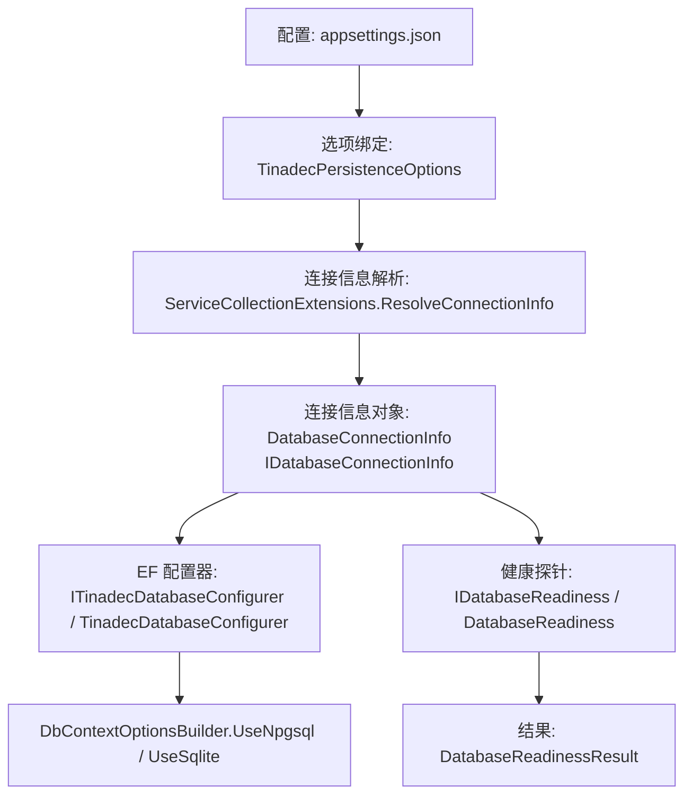
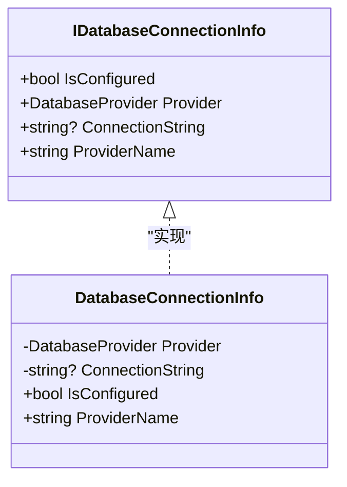
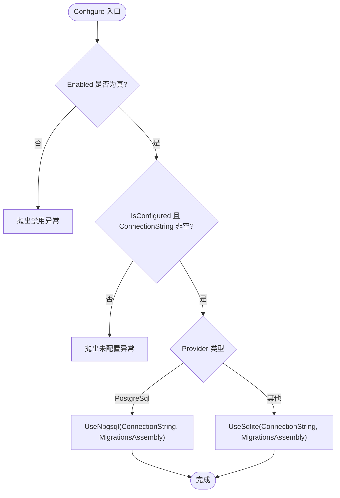
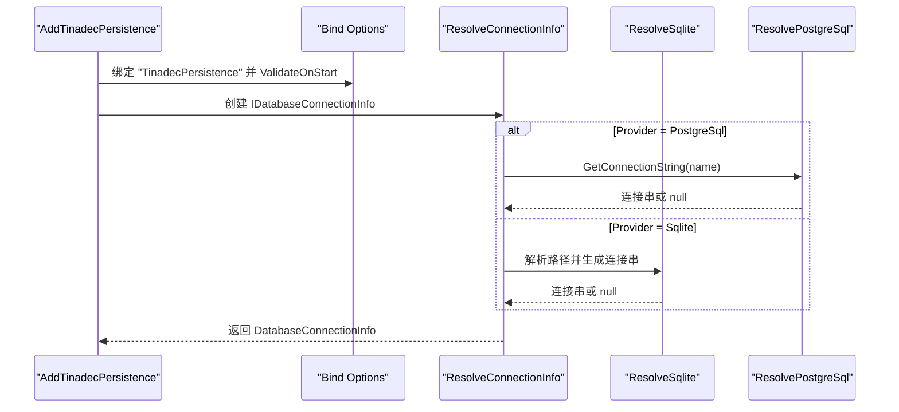
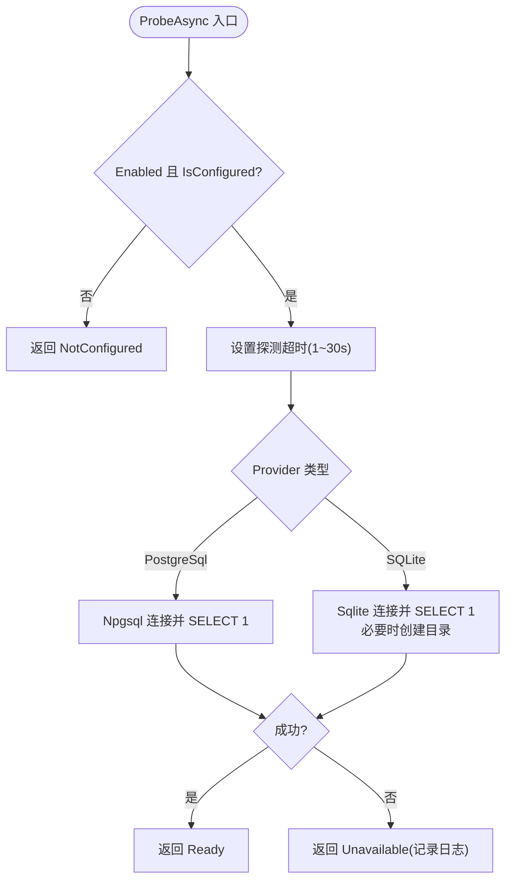
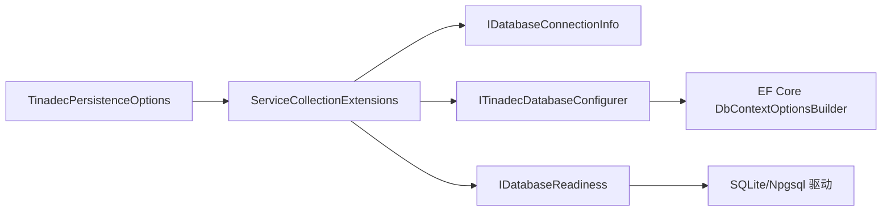

# 数据库连接抽象

<cite>
**本文引用的文件**   
- [IDatabaseConnectionInfo.cs](file://TinadecCore\Persistence\IDatabaseConnectionInfo.cs)
- [DatabaseProvider.cs](file://TinadecCore\Persistence\DatabaseProvider.cs)
- [DatabaseConnectionInfo.cs](file://TinadecCore\Persistence\DatabaseConnectionInfo.cs)
- [TinadecPersistenceOptions.cs](file://TinadecCore\Persistence\TinadecPersistenceOptions.cs)
- [ITinadecDatabaseConfigurer.cs](file://TinadecCore\Persistence\ITinadecDatabaseConfigurer.cs)
- [TinadecDatabaseConfigurer.cs](file://TinadecCore\Persistence\TinadecDatabaseConfigurer.cs)
- [ServiceCollectionExtensions.cs](file://TinadecCore\Persistence\ServiceCollectionExtensions.cs)
- [IDatabaseReadiness.cs](file://TinadecCore\Persistence\IDatabaseReadiness.cs)
- [DatabaseReadiness.cs](file://TinadecCore\Persistence\DatabaseReadiness.cs)
- [DatabaseReadinessState.cs](file://TinadecCore\Persistence\DatabaseReadinessState.cs)
- [appsettings.json](file://TinadecCore\Api\appsettings.json)
</cite>

## 目录
1. [简介](#简介)
2. [项目结构](#项目结构)
3. [核心组件](#核心组件)
4. [架构总览](#架构总览)
5. [详细组件分析](#详细组件分析)
6. [依赖关系分析](#依赖关系分析)
7. [性能考虑](#性能考虑)
8. [故障排查指南](#故障排查指南)
9. [结论](#结论)
10. [附录](#附录)

## 简介
本文件面向 TinadecCore 的“数据库连接抽象”层，系统性阐述 IDatabaseConnectionInfo 接口的设计理念与实现细节，包括 IsConfigured 状态检查、Provider 类型识别与 ConnectionString 配置管理；说明 DatabaseProvider 枚举支持的 SQLite 与 PostgreSQL 特性；解释 TinadecPersistenceOptions 配置项的作用与设置方法；提供开发/生产环境的连接配置示例与最佳实践；涵盖连接字符串安全存储、连接池配置建议与健康检查机制；并给出自定义数据库提供程序的扩展指南与集成模式。

## 项目结构
数据库连接抽象位于 Persistence 模块中，围绕“配置绑定 -> 连接信息解析 -> EF Core 配置器 -> 健康探针”形成完整链路。关键文件职责如下：
- 配置模型：TinadecPersistenceOptions（含 SqliteOptions、PostgreSqlOptions）
- 连接信息抽象与实现：IDatabaseConnectionInfo、DatabaseConnectionInfo
- 提供者枚举：DatabaseProvider
- EF Core 配置器：ITinadecDatabaseConfigurer、TinadecDatabaseConfigurer
- 服务注册与连接信息解析：ServiceCollectionExtensions
- 健康检查：IDatabaseReadiness、DatabaseReadiness、DatabaseReadinessState



图表来源
- [ServiceCollectionExtensions.cs:64-79](file://TinadecCore\Persistence\ServiceCollectionExtensions.cs#L64-L79)
- [DatabaseConnectionInfo.cs:1-23](file://TinadecCore\Persistence\DatabaseConnectionInfo.cs#L1-L23)
- [TinadecDatabaseConfigurer.cs:19-46](file://TinadecCore\Persistence\TinadecDatabaseConfigurer.cs#L19-L46)
- [DatabaseReadiness.cs:24-73](file://TinadecCore\Persistence\DatabaseReadiness.cs#L24-L73)

章节来源
- [TinadecPersistenceOptions.cs:1-48](file://TinadecCore\Persistence\TinadecPersistenceOptions.cs#L1-L48)
- [ServiceCollectionExtensions.cs:1-122](file://TinadecCore\Persistence\ServiceCollectionExtensions.cs#L1-L122)

## 核心组件
- IDatabaseConnectionInfo：对外暴露 IsConfigured、Provider、ConnectionString、ProviderName，用于统一判断是否已配置、当前提供者类型以及生成 EF 兼容的连接串。
- DatabaseConnectionInfo：实现 IDatabaseConnectionInfo，IsConfigured 基于 ConnectionString 非空且非空白判定；ProviderName 将枚举映射为 sqlite/postgresql 字符串。
- DatabaseProvider：枚举支持 Sqlite 与 PostgreSql，默认本地桌面使用 Sqlite。
- TinadecPersistenceOptions：集中管理 Enabled、Provider、Sqlite.DatabasePath、PostgreSql.ConnectionStringName、DataRoot、ApplyMigrationsOnStartup、ProbeTimeoutSeconds 等选项。
- ITinadecDatabaseConfigurer/TinadecDatabaseConfigurer：根据 Provider 选择 UseNpgsql 或 UseSqlite，并注入对应迁移程序集。
- ServiceCollectionExtensions：绑定配置、注册单例、解析连接信息（SQLite 路径处理、PostgreSQL 从 ConnectionStrings 读取）。
- IDatabaseReadiness/DatabaseReadiness：对 SQLite/PostgreSQL 执行 SELECT 1 健康检查，返回 NotConfigured/Ready/Unavailable 状态。

章节来源
- [IDatabaseConnectionInfo.cs:1-18](file://TinadecCore\Persistence\IDatabaseConnectionInfo.cs#L1-L18)
- [DatabaseConnectionInfo.cs:1-23](file://TinadecCore\Persistence\DatabaseConnectionInfo.cs#L1-L23)
- [DatabaseProvider.cs:1-11](file://TinadecCore\Persistence\DatabaseProvider.cs#L1-L11)
- [TinadecPersistenceOptions.cs:1-48](file://TinadecCore\Persistence\TinadecPersistenceOptions.cs#L1-L48)
- [ITinadecDatabaseConfigurer.cs:1-17](file://TinadecCore\Persistence\ITinadecDatabaseConfigurer.cs#L1-L17)
- [TinadecDatabaseConfigurer.cs:1-48](file://TinadecCore\Persistence\TinadecDatabaseConfigurer.cs#L1-L48)
- [ServiceCollectionExtensions.cs:1-122](file://TinadecCore\Persistence\ServiceCollectionExtensions.cs#L1-L122)
- [IDatabaseReadiness.cs:1-10](file://TinadecCore\Persistence\IDatabaseReadiness.cs#L1-L10)
- [DatabaseReadiness.cs:1-123](file://TinadecCore\Persistence\DatabaseReadiness.cs#L1-L123)
- [DatabaseReadinessState.cs:1-23](file://TinadecCore\Persistence\DatabaseReadinessState.cs#L1-L23)

## 架构总览
下图展示从配置到 EF Core 配置与健康检查的端到端流程。

```mermaid
sequenceDiagram
participant App as "应用"
participant DI as "服务容器"
participant Opt as "TinadecPersistenceOptions"
participant Conn as "IDatabaseConnectionInfo"
participant Cfg as "ITinadecDatabaseConfigurer"
participant DB as "EF Core DbContextOptionsBuilder"
participant Health as "IDatabaseReadiness"
App->>DI : 调用 AddTinadecPersistence(configuration, contentRootPath)
DI->>Opt : 绑定配置节 "TinadecPersistence"
DI->>Conn : 解析 ResolveConnectionInfo(options, configuration, root)
Conn-->>DI : 返回 DatabaseConnectionInfo
App->>DB : 注册 DbContext 时调用 UseTinadecDatabase(serviceProvider)
DB->>Cfg : Configure(options)
Cfg->>DB : UseNpgsql/UseSqlite(ConnectionString, MigrationsAssembly)
App->>Health : ProbeAsync()
Health-->>App : DatabaseReadinessResult(NotConfigured/Ready/Unavailable)
```

图表来源
- [ServiceCollectionExtensions.cs:15-49](file://TinadecCore\Persistence\ServiceCollectionExtensions.cs#L15-L49)
- [ServiceCollectionExtensions.cs:64-79](file://TinadecCore\Persistence\ServiceCollectionExtensions.cs#L64-L79)
- [TinadecDatabaseConfigurer.cs:19-46](file://TinadecCore\Persistence\TinadecDatabaseConfigurer.cs#L19-L46)
- [DatabaseReadiness.cs:24-73](file://TinadecCore\Persistence\DatabaseReadiness.cs#L24-L73)

## 详细组件分析

### IDatabaseConnectionInfo 与 DatabaseConnectionInfo
- 设计理念：以最小接口暴露“是否已配置”“提供者类型”“连接串”“可读提供者名”，屏蔽底层差异，便于上层按 Provider 分支处理。
- IsConfigured：当 ConnectionString 非空且非空白时为 true，避免未配置导致后续异常。
- ProviderName：将枚举映射为 sqlite/postgresql，供健康检查与诊断输出。
- 实现要点：构造函数接收 Provider 与 ConnectionString；ProviderName 通过 switch 映射。



图表来源
- [IDatabaseConnectionInfo.cs:6-17](file://TinadecCore\Persistence\IDatabaseConnectionInfo.cs#L6-L17)
- [DatabaseConnectionInfo.cs:3-22](file://TinadecCore\Persistence\DatabaseConnectionInfo.cs#L3-L22)

章节来源
- [IDatabaseConnectionInfo.cs:1-18](file://TinadecCore\Persistence\IDatabaseConnectionInfo.cs#L1-L18)
- [DatabaseConnectionInfo.cs:1-23](file://TinadecCore\Persistence\DatabaseConnectionInfo.cs#L1-L23)

### DatabaseProvider 枚举
- 支持 Sqlite 与 PostgreSql，默认本地桌面使用 Sqlite。
- 在连接信息解析与 EF 配置器中作为分支依据。

章节来源
- [DatabaseProvider.cs:1-11](file://TinadecCore\Persistence\DatabaseProvider.cs#L1-L11)

### TinadecPersistenceOptions 配置模型
- Enabled：关闭时不配置任何数据库提供者。
- Provider：选择 Sqlite 或 PostgreSql。
- Sqlite.DatabasePath：相对或绝对路径，相对路径会结合 contentRootPath 解析为绝对路径后生成连接串。
- PostgreSql.ConnectionStringName：从 IConfiguration.GetConnectionString(name) 获取连接串。
- DataRoot：Core 拥有的会话、事件、任务、工件等文件的根目录。
- ApplyMigrationsOnStartup：SQLite 启动时自动迁移；PostgreSQL 需显式开启以避免多实例并发迁移竞争。
- ProbeTimeoutSeconds：健康检查探测超时秒数，限制在 1~30 之间。

章节来源
- [TinadecPersistenceOptions.cs:1-48](file://TinadecCore\Persistence\TinadecPersistenceOptions.cs#L1-L48)

### ITinadecDatabaseConfigurer 与 TinadecDatabaseConfigurer
- 作用：将当前 Provider 的配置应用到 DbContextOptionsBuilder，选择 UseNpgsql 或 UseSqlite，并注入对应迁移程序集。
- 校验逻辑：若禁用或未配置连接串则抛出异常，提示具体缺失项（SQLite 路径或 PostgreSQL 连接串名称）。
- 迁移程序集：SQLite 使用 TinadecCore.Storage.Migrations.Sqlite，PostgreSQL 使用 TinadecCore.Storage.Migrations.PostgreSql。



图表来源
- [TinadecDatabaseConfigurer.cs:19-46](file://TinadecCore\Persistence\TinadecDatabaseConfigurer.cs#L19-L46)

章节来源
- [ITinadecDatabaseConfigurer.cs:1-17](file://TinadecCore\Persistence\ITinadecDatabaseConfigurer.cs#L1-L17)
- [TinadecDatabaseConfigurer.cs:1-48](file://TinadecCore\Persistence\TinadecDatabaseConfigurer.cs#L1-L48)

### ServiceCollectionExtensions 服务注册与连接信息解析
- 绑定配置节并验证 ProbeTimeoutSeconds 范围。
- 注册 IDatabaseConnectionInfo、ITinadecDatabaseConfigurer、IDatabaseReadiness、StoragePaths、IContentStore、IProjectVectorDatabase、ISecretStore、IStorageMigrationRunner。
- ResolveConnectionInfo：
  - 若 Enabled=false，返回未配置的连接信息。
  - 若 Provider=PostgreSql，从 Configuration.GetConnectionString(name) 读取连接串。
  - 若 Provider=Sqlite，拼接 DataSource 生成 EF 兼容连接串，相对路径会结合 contentRootPath 解析。



图表来源
- [ServiceCollectionExtensions.cs:15-49](file://TinadecCore\Persistence\ServiceCollectionExtensions.cs#L15-L49)
- [ServiceCollectionExtensions.cs:64-79](file://TinadecCore\Persistence\ServiceCollectionExtensions.cs#L64-L79)
- [ServiceCollectionExtensions.cs:81-101](file://TinadecCore\Persistence\ServiceCollectionExtensions.cs#L81-L101)
- [ServiceCollectionExtensions.cs:103-120](file://TinadecCore\Persistence\ServiceCollectionExtensions.cs#L103-L120)

章节来源
- [ServiceCollectionExtensions.cs:1-122](file://TinadecCore\Persistence\ServiceCollectionExtensions.cs#L1-L122)

### 健康检查：IDatabaseReadiness 与 DatabaseReadiness
- 行为：根据 Provider 选择 SQLite 或 PostgreSQL 探测，执行 SELECT 1 验证连通性。
- 超时控制：使用 ProbeTimeoutSeconds（限制 1~30），并通过 CancellationTokenSource 组合外部取消令牌。
- 结果：返回 NotConfigured/Ready/Unavailable，并提供 Detail 描述。
- SQLite 特殊处理：若 DataSource 指向文件且非内存库，确保目录存在后再打开连接。



图表来源
- [DatabaseReadiness.cs:24-73](file://TinadecCore\Persistence\DatabaseReadiness.cs#L24-L73)
- [DatabaseReadiness.cs:75-98](file://TinadecCore\Persistence\DatabaseReadiness.cs#L75-L98)
- [DatabaseReadiness.cs:100-116](file://TinadecCore\Persistence\DatabaseReadiness.cs#L100-L116)

章节来源
- [IDatabaseReadiness.cs:1-10](file://TinadecCore\Persistence\IDatabaseReadiness.cs#L1-L10)
- [DatabaseReadiness.cs:1-123](file://TinadecCore\Persistence\DatabaseReadiness.cs#L1-L123)
- [DatabaseReadinessState.cs:1-23](file://TinadecCore\Persistence\DatabaseReadinessState.cs#L1-L23)

### 配置示例与最佳实践
- 配置文件位置：appsettings.json 中的 ConnectionStrings 与 TinadecPersistence 节。
- 开发环境（SQLite）：
  - Provider 设置为 Sqlite，Sqlite.DatabasePath 指定相对路径（如 data/tinadec.db），由运行时解析为绝对路径。
  - ApplyMigrationsOnStartup 可保持默认启用，便于快速迭代。
- 生产环境（PostgreSQL）：
  - Provider 设置为 PostgreSql，PostgreSql.ConnectionStringName 指向 ConnectionStrings 中的键（如 TinadecCore）。
  - ApplyMigrationsOnStartup 需谨慎开启，避免多实例并发迁移冲突；建议在部署阶段单独执行迁移。
  - 连接字符串应通过环境变量或密钥管理服务注入，避免明文落盘。
- 连接字符串安全存储：
  - 优先使用操作系统凭据存储（Windows DPAPI）或环境变量；SecretStore 已根据平台自动选择 ProtectedFileSecretStore 或 EnvironmentSecretStore。
- 连接池配置：
  - PostgreSQL：通过 Npgsql 连接串参数（如 Max Pool Size、Min Pool Size、Connection Idle Lifetime 等）进行调优。
  - SQLite：通常无需连接池；注意并发写入限制与 WAL 模式配置（如需高并发读）。
- 健康检查：
  - 使用 IDatabaseReadiness.ProbeAsync 在启动或就绪探针中执行，超时时间受 ProbeTimeoutSeconds 控制。

章节来源
- [appsettings.json:9-22](file://TinadecCore\Api\appsettings.json#L9-L22)
- [ServiceCollectionExtensions.cs:44-47](file://TinadecCore\Persistence\ServiceCollectionExtensions.cs#L44-L47)

## 依赖关系分析
- 组件耦合：
  - ServiceCollectionExtensions 依赖 TinadecPersistenceOptions 与 IConfiguration，负责解析连接信息与注册服务。
  - TinadecDatabaseConfigurer 依赖 IDatabaseConnectionInfo 与 IOptions<TinadecPersistenceOptions>，决定 EF Core 后端。
  - DatabaseReadiness 依赖 IDatabaseConnectionInfo、IOptions<TinadecPersistenceOptions> 与 ILogger，执行健康检查。
- 外部依赖：
  - EF Core：UseNpgsql/UseSqlite。
  - 驱动：Microsoft.Data.Sqlite、Npgsql。
- 潜在循环依赖：无直接循环；各组件通过接口解耦。



图表来源
- [ServiceCollectionExtensions.cs:15-49](file://TinadecCore\Persistence\ServiceCollectionExtensions.cs#L15-L49)
- [TinadecDatabaseConfigurer.cs:19-46](file://TinadecCore\Persistence\TinadecDatabaseConfigurer.cs#L19-L46)
- [DatabaseReadiness.cs:24-73](file://TinadecCore\Persistence\DatabaseReadiness.cs#L24-L73)

章节来源
- [ServiceCollectionExtensions.cs:1-122](file://TinadecCore\Persistence\ServiceCollectionExtensions.cs#L1-L122)
- [TinadecDatabaseConfigurer.cs:1-48](file://TinadecCore\Persistence\TinadecDatabaseConfigurer.cs#L1-L48)
- [DatabaseReadiness.cs:1-123](file://TinadecCore\Persistence\DatabaseReadiness.cs#L1-L123)

## 性能考虑
- 健康检查超时：ProbeTimeoutSeconds 限制在 1~30 秒，避免长时间阻塞启动流程。
- SQLite：
  - 文件路径解析与目录创建仅在首次探测时发生。
  - 并发写受限，建议只读场景或降低写频率；必要时启用 WAL 模式。
- PostgreSQL：
  - 合理设置连接池大小与空闲超时，避免连接耗尽或频繁创建销毁。
  - 迁移操作应避免多实例并行执行，建议使用独立迁移工具或滚动更新策略。

[本节为通用指导，不直接分析具体文件]

## 故障排查指南
- 常见错误与定位：
  - 未启用数据库：TinadecPersistence:Enabled=false 时，Configure 会抛出禁用异常。
  - 连接串缺失：
    - SQLite：未设置 Sqlite.DatabasePath 或为空，IsConfigured 为 false。
    - PostgreSQL：未设置 PostgreSql.ConnectionStringName 或 ConnectionStrings 中不存在该键。
  - 健康检查失败：
    - SQLite：文件路径无效或权限不足；内存库无法访问磁盘。
    - PostgreSQL：网络不可达、认证失败或查询超时。
- 调试建议：
  - 查看 DatabaseReadiness 的警告日志，确认 Provider 与 Detail 信息。
  - 检查 appsettings.json 或环境变量中的连接串是否正确。
  - 对于 PostgreSQL，确认端口、主机、用户名、密码及防火墙规则。

章节来源
- [TinadecDatabaseConfigurer.cs:23-35](file://TinadecCore\Persistence\TinadecDatabaseConfigurer.cs#L23-L35)
- [DatabaseReadiness.cs:24-73](file://TinadecCore\Persistence\DatabaseReadiness.cs#L24-L73)

## 结论
TinadecCore 的数据库连接抽象通过 IDatabaseConnectionInfo 与 TinadecPersistenceOptions 实现了 Provider 无关的配置与解析，配合 ITinadecDatabaseConfigurer 与 IDatabaseReadiness 完成 EF Core 配置与健康检查。SQLite 适合本地开发与单机部署，PostgreSQL 适合生产环境与多实例部署。通过合理的配置与安全存储策略，可实现稳定可靠的数据库接入。

[本节为总结性内容，不直接分析具体文件]

## 附录

### 自定义数据库提供程序的开发指南与集成模式
- 目标：在不修改现有核心代码的前提下，新增一个数据库提供程序（例如 MySQL、SQL Server）。
- 步骤：
  1. 扩展 DatabaseProvider 枚举，添加新提供者值。
  2. 在 ServiceCollectionExtensions.ResolveConnectionInfo 中为新提供者增加分支，解析并返回 ConnectionString。
  3. 在 TinadecDatabaseConfigurer.Configure 中为新提供者添加 UseXxx 分支，并指定对应的迁移程序集。
  4. 在 DatabaseReadiness.ProbeAsync 中为新提供者添加探测逻辑（如 ExecuteScalar("SELECT 1")）。
  5. 在 TinadecPersistenceOptions 中添加必要的子选项（如连接串名称、路径等）。
  6. 在 appsettings.json 或环境变量中补充新提供者的配置项。
- 集成模式：
  - 保持 IDatabaseConnectionInfo 不变，仅扩展 Provider 分支。
  - 通过 IServiceCollection 扩展点注册新的迁移程序集与健康探测实现（可选）。
  - 遵循现有命名约定与错误提示风格，确保一致性。

[本节为概念性指导，不直接分析具体文件]