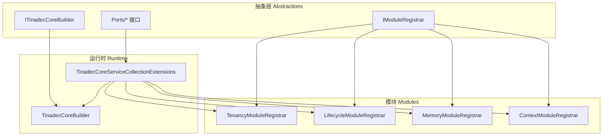
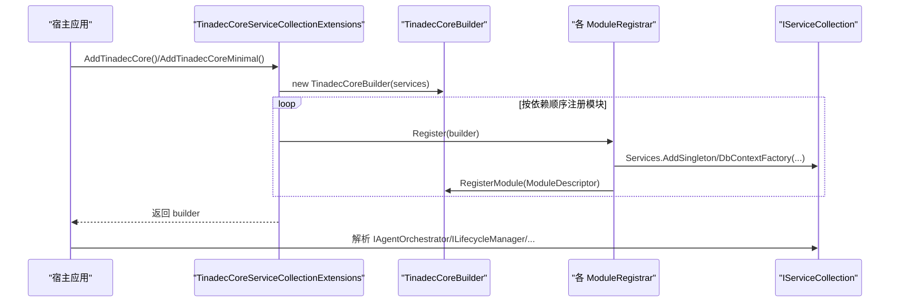
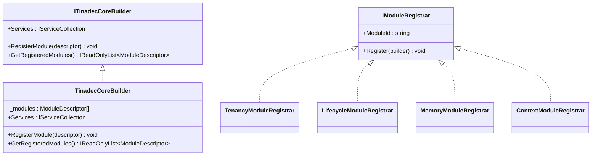
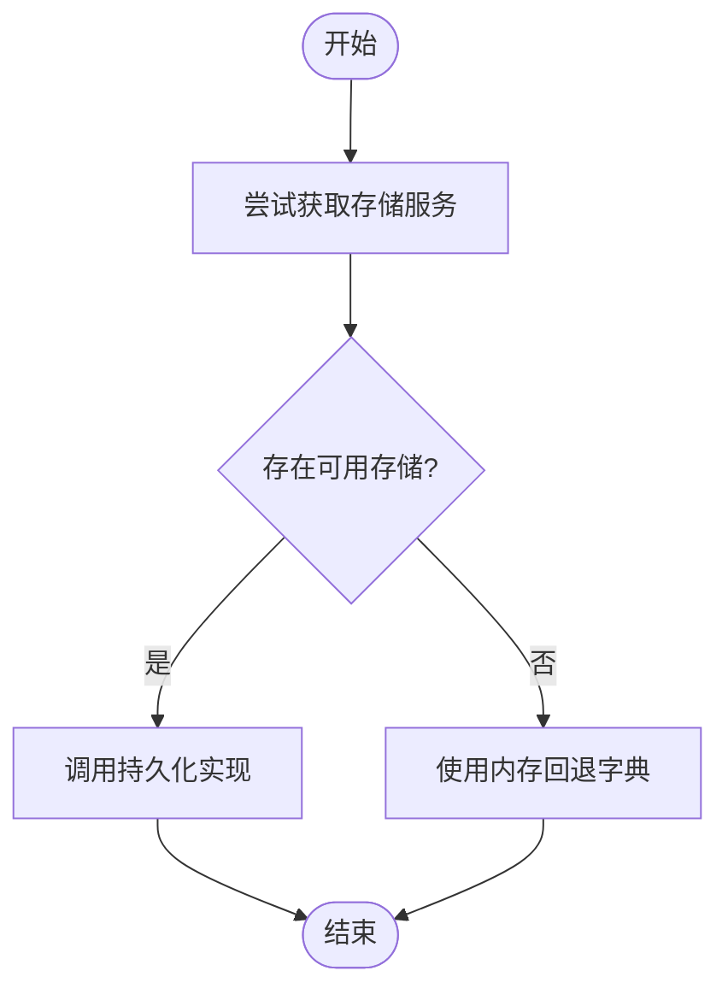
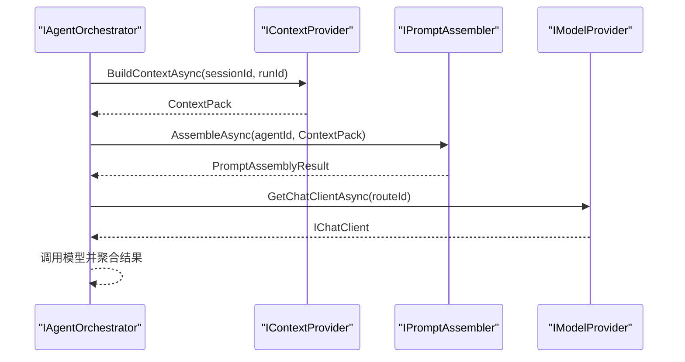
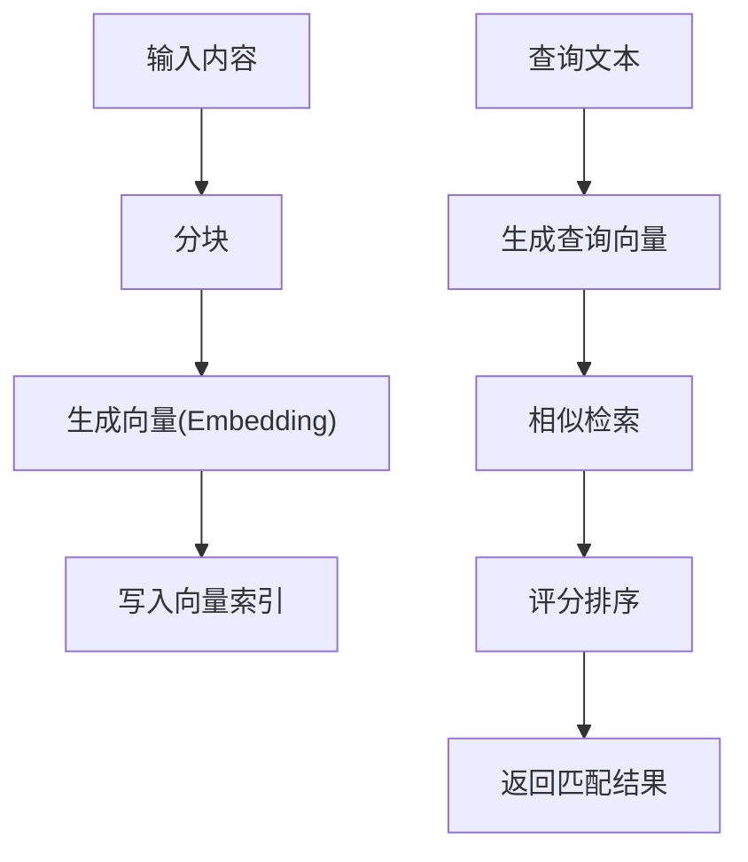
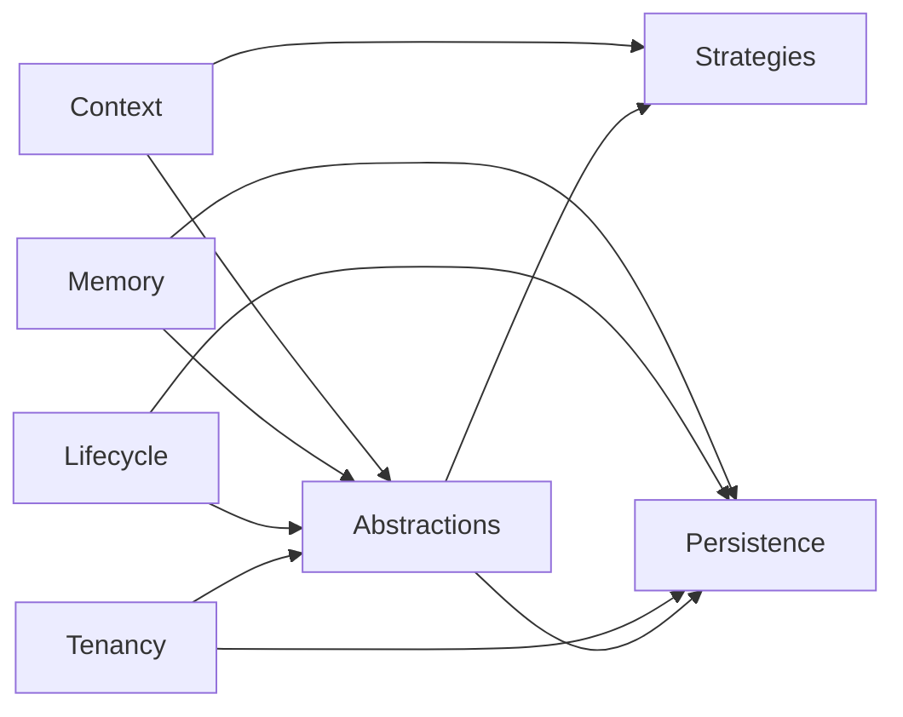

# 核心抽象层

<cite>
**本文引用的文件**   
- [IAgentOrchestrator.cs](file://TinadecCore/Abstractions/Ports/IAgentOrchestrator.cs)
- [IContextProvider.cs](file://TinadecCore/Abstractions/Ports/IContextProvider.cs)
- [ILifecycleManager.cs](file://TinadecCore/Abstractions/Ports/ILifecycleManager.cs)
- [IMemoryStore.cs](file://TinadecCore/Abstractions/Ports/IMemoryStore.cs)
- [IModelProvider.cs](file://TinadecCore/Abstractions/Ports/IModelProvider.cs)
- [IPromptAssembler.cs](file://TinadecCore/Abstractions/Ports/IPromptAssembler.cs)
- [ISessionLocator.cs](file://TinadecCore/Abstractions/Ports/ISessionLocator.cs)
- [ISkillProvider.cs](file://TinadecCore/Abstractions/Ports/ISkillProvider.cs)
- [ITenantContextAccessor.cs](file://TinadecCore/Abstractions/Ports/ITenantContextAccessor.cs)
- [IVectorStore.cs](file://TinadecCore/Abstractions/Ports/IVectorStore.cs)
- [ITinadecCoreBuilder.cs](file://TinadecCore/Abstractions/ITinadecCoreBuilder.cs)
- [IModuleRegistrar.cs](file://TinadecCore/Abstractions/IModuleRegistrar.cs)
- [TinadecCoreBuilder.cs](file://TinadecCore/Runtime/TinadecCoreBuilder.cs)
- [TinadecCoreServiceCollectionExtensions.cs](file://TinadecCore/Runtime/TinadecCoreServiceCollectionExtensions.cs)
- [ContextModuleRegistrar.cs](file://TinadecCore/Context/ContextModuleRegistrar.cs)
- [LifecycleModuleRegistrar.cs](file://TinadecCore/Lifecycle/LifecycleModuleRegistrar.cs)
- [MemoryModuleRegistrar.cs](file://TinadecCore/Memory/MemoryModuleRegistrar.cs)
- [TenancyModuleRegistrar.cs](file://TinadecCore/Tenancy/TenancyModuleRegistrar.cs)
</cite>

## 目录
1. [简介](#简介)
2. [项目结构](#项目结构)
3. [核心组件](#核心组件)
4. [架构总览](#架构总览)
5. [详细组件分析](#详细组件分析)
6. [依赖关系分析](#依赖关系分析)
7. [性能考量](#性能考量)
8. [故障排查指南](#故障排查指南)
9. [结论](#结论)
10. [附录](#附录)

## 简介
本文件面向 TinadecCore 抽象层，系统性阐述接口定义、端口设计模式与模块注册机制。重点覆盖以下核心接口：IAgentOrchestrator、IContextProvider、ILifecycleManager、IMemoryStore、IModelProvider、IPromptAssembler、ISessionLocator、ISkillProvider、ITenantContextAccessor、IVectorStore；以及构建器 ITinadecCoreBuilder 与模块注册器 IModuleRegistrar 的实现细节。文档同时给出扩展与自定义示例路径、依赖注入配置与服务发现方式，并说明接口版本管理与向后兼容性策略。

## 项目结构
TinadecCore.Abstractions 定义了跨模块的“端口”（接口）与构建/注册契约；Runtime 提供默认构建器与 DI 扩展；各业务模块（如 Context、Lifecycle、Memory、Tenancy 等）通过实现 IModuleRegistrar 完成服务注册与模块描述声明。整体采用显式注册、无反射扫描的模块化装配方式，便于裁剪与编译期优化。

图表来源
- [ITinadecCoreBuilder.cs:1-52](file://TinadecCore/Abstractions/ITinadecCoreBuilder.cs#L1-L52)
- [IModuleRegistrar.cs:1-17](file://TinadecCore/Abstractions/IModuleRegistrar.cs#L1-L17)
- [TinadecCoreBuilder.cs:1-31](file://TinadecCore/Runtime/TinadecCoreBuilder.cs#L1-L31)
- [TinadecCoreServiceCollectionExtensions.cs:1-61](file://TinadecCore/Runtime/TinadecCoreServiceCollectionExtensions.cs#L1-L61)
- [TenancyModuleRegistrar.cs:1-38](file://TinadecCore/Tenancy/TenancyModuleRegistrar.cs#L1-L38)
- [LifecycleModuleRegistrar.cs:1-100](file://TinadecCore/Lifecycle/LifecycleModuleRegistrar.cs#L1-L100)
- [MemoryModuleRegistrar.cs:1-58](file://TinadecCore/Memory/MemoryModuleRegistrar.cs#L1-L58)
- [ContextModuleRegistrar.cs:1-52](file://TinadecCore/Context/ContextModuleRegistrar.cs#L1-L52)

章节来源
- [ITinadecCoreBuilder.cs:1-52](file://TinadecCore/Abstractions/ITinadecCoreBuilder.cs#L1-L52)
- [IModuleRegistrar.cs:1-17](file://TinadecCore/Abstractions/IModuleRegistrar.cs#L1-L17)
- [TinadecCoreBuilder.cs:1-31](file://TinadecCore/Runtime/TinadecCoreBuilder.cs#L1-L31)
- [TinadecCoreServiceCollectionExtensions.cs:1-61](file://TinadecCore/Runtime/TinadecCoreServiceCollectionExtensions.cs#L1-L61)

## 核心组件
本节对每个核心接口的职责、关键方法与数据模型进行说明，并给出使用要点与扩展建议。

- IAgentOrchestrator
  - 职责：双层编排（规划层与执行层），负责会话级目标驱动的编排调用、任务分发、协作与结果聚合。
  - 关键方法：OrchestrateAsync(sessionId, userGoal, cancellationToken)。
  - 返回：OrchestrationResult（RunId、Success、Summary、Warnings）。
  - 使用要点：上层仅依赖此接口进行编排入口，具体编排策略由实现决定。
  - 扩展点：可替换为不同编排策略（例如基于工作流或状态机）。

- IContextProvider
  - 职责：为给定会话与运行生成上下文包（证据、来源、Token 预算），不组装最终系统提示。
  - 关键方法：BuildContextAsync(sessionId, runId, cancellationToken)。
  - 数据模型：ContextPack（SessionId、RunId、TokenBudget、EstimatedTokens、Evidence[]）、ContextEvidence（Source、Content、EstimatedTokens、Metadata）。
  - 使用要点：结合 Token 预算策略控制上下文大小与质量。
  - 扩展点：接入外部知识库、检索增强、证据评分等。

- ILifecycleManager
  - 职责：管理 Run/Task/Agent/Tool/Approval 状态与审计事件，接收 MAF 中间件、工作流事件、会话/检查点与取消信号。
  - 关键方法：StartRunAsync、CompleteRunAsync、GetRunStateAsync。
  - 数据模型：RunState（RunId、SessionId、Status、StartedAt、CompletedAt）、RunStatus（Pending/Running/Completed/Failed/Cancelled）。
  - 使用要点：Core 拥有唯一状态权威，MAF 的 session/checkpoint 仅为执行态。
  - 扩展点：持久化存储、审计日志、幂等性保障。

- IMemoryStore
  - 职责：管理 Agent 记忆作用域、保留策略与溯源信息，封装 MAF AgentSession 序列化与 ChatHistoryProvider。
  - 关键方法：RetrieveAsync(sessionId, query, maxResults)、StoreAsync(sessionId, entry)。
  - 数据模型：MemoryEntry（Id、SessionId、Content、Source、Score、CreatedAt、Provenance）。
  - 使用要点：查询需支持语义/关键词混合检索；写入需记录溯源元数据。
  - 扩展点：向量索引、分片存储、冷热分层。

- IModelProvider / IEmbeddingProvider
  - 职责：管理模型提供者实例、凭据、路由、能力、错误归一化与就绪性；嵌入提供者用于生成向量。
  - 关键方法：IModelProvider.GetChatClientAsync(routeId?)、CheckReadinessAsync()；IEmbeddingProvider.GenerateAsync(request)。
  - 数据模型：EmbeddingRequest（TenantId、WorkspaceId?、ProjectId、Inputs[]）、EmbeddingResult（IsAvailable、ModelId、Dimension、Vectors[]、Detail）、ModelReadiness（IsReady、StatusMessage、Warnings[]）。
  - 使用要点：对外隐藏凭据，统一错误与就绪检测。
  - 扩展点：多模型路由、降级与熔断、遥测与追踪。

- IPromptAssembler
  - 职责：确定性组装提示片段、Agent 指令、技能贡献与 ContextPack，输出到 MAF ChatOptions.Instructions/AIContext。
  - 关键方法：AssembleAsync(agentId, contextPack?, cancellationToken)。
  - 数据模型：PromptAssemblyResult（Instructions、EstimatedTokens、FragmentIds[]、Warnings[]）。
  - 使用要点：确保可重复性与可观测性（片段ID、估算Token）。
  - 扩展点：模板引擎、动态片段选择、安全过滤。

- ISessionLocator
  - 职责：最小化的跨模块查找，用于校验生命周期所有权边界。
  - 关键方法：FindAsync(sessionId)。
  - 数据模型：SessionReference（SessionId、ProjectId、TenantId、WorkspaceId）。
  - 使用要点：轻量、只读、快速失败。
  - 扩展点：缓存、分布式查找。

- ISkillProvider
  - 职责：通过 MAF AgentSkillsProvider 暴露技能，支持文件/类/内联与 SKILL.md 格式；脚本执行委托给工具层，写操作经 Core 审批。
  - 关键方法：ListSkillsAsync(agentId?)、GetSkillAsync(skillId)。
  - 数据模型：SkillDescriptor（Id、Name、Description、Format、AgentId?、RequiresApproval）。
  - 使用要点：区分需要审批的技能与只读技能。
  - 扩展点：技能市场、版本化、沙箱执行。

- ITenantContextAccessor
  - 职责：解析当前请求的租户上下文与隔离边界。
  - 关键属性：Current（TenantContext）。
  - 数据模型：TenantContext（TenantId、WorkspaceId、PrincipalId、Role、IsDevelopment）。
  - 使用要点：贯穿所有服务的访问上下文，保证多租户隔离。
  - 扩展点：身份源集成、权限策略。

- IVectorStore
  - 职责：核心拥有的语义索引与检索能力。
  - 关键方法：IndexAsync(request)、SearchAsync(request)、DeleteSourceAsync(source)。
  - 数据模型：VectorProjectScope（TenantId、WorkspaceId?、ProjectId）、VectorSourceReference（Namespace、SourceType、SourceId）、VectorIndexRequest（SourceRevision、Content、Metadata）、VectorSearchRequest（Namespace、Query、Limit、MinimumScore、SourceTypes[]）、VectorIndexResult（IndexedChunks、SkippedChunks、ModelId?）、VectorMatch（ChunkId、SourceType、SourceId、SourceRevision、ChunkIndex、Content、Score、Metadata）。
  - 使用要点：按项目/命名空间隔离；支持增量索引与删除。
  - 扩展点：多种后端（向量数据库/内存）、相似度度量、批处理。

章节来源
- [IAgentOrchestrator.cs:1-24](file://TinadecCore/Abstractions/Ports/IAgentOrchestrator.cs#L1-L24)
- [IContextProvider.cs:1-37](file://TinadecCore/Abstractions/Ports/IContextProvider.cs#L1-L37)
- [ILifecycleManager.cs:1-41](file://TinadecCore/Abstractions/Ports/ILifecycleManager.cs#L1-L41)
- [IMemoryStore.cs:1-31](file://TinadecCore/Abstractions/Ports/IMemoryStore.cs#L1-L31)
- [IModelProvider.cs:1-51](file://TinadecCore/Abstractions/Ports/IModelProvider.cs#L1-L51)
- [IPromptAssembler.cs:1-23](file://TinadecCore/Abstractions/Ports/IPromptAssembler.cs#L1-L23)
- [ISessionLocator.cs:1-10](file://TinadecCore/Abstractions/Ports/ISessionLocator.cs#L1-L10)
- [ISkillProvider.cs:1-28](file://TinadecCore/Abstractions/Ports/ISkillProvider.cs#L1-L28)
- [ITenantContextAccessor.cs:1-15](file://TinadecCore/Abstractions/Ports/ITenantContextAccessor.cs#L1-L15)
- [IVectorStore.cs:1-59](file://TinadecCore/Abstractions/Ports/IVectorStore.cs#L1-L59)

## 架构总览
下图展示构建器与模块注册器的装配流程，以及核心接口在运行时如何被 DI 容器解析与使用。

图表来源
- [TinadecCoreServiceCollectionExtensions.cs:1-61](file://TinadecCore/Runtime/TinadecCoreServiceCollectionExtensions.cs#L1-L61)
- [TinadecCoreBuilder.cs:1-31](file://TinadecCore/Runtime/TinadecCoreBuilder.cs#L1-L31)
- [TenancyModuleRegistrar.cs:1-38](file://TinadecCore/Tenancy/TenancyModuleRegistrar.cs#L1-L38)
- [LifecycleModuleRegistrar.cs:1-100](file://TinadecCore/Lifecycle/LifecycleModuleRegistrar.cs#L1-L100)
- [MemoryModuleRegistrar.cs:1-58](file://TinadecCore/Memory/MemoryModuleRegistrar.cs#L1-L58)
- [ContextModuleRegistrar.cs:1-52](file://TinadecCore/Context/ContextModuleRegistrar.cs#L1-L52)

## 详细组件分析

### 构建器与模块注册机制
- ITinadecCoreBuilder
  - 提供 IServiceCollection 访问与模块描述注册 API。
  - 典型用法：在宿主中调用 AddTinadecCore() 获取 builder，随后按需解析服务。
- TinadecCoreBuilder
  - 默认实现，维护已注册模块列表，并将自身以单例注入 DI。
- IModuleRegistrar
  - 每个模块实现该接口，声明 ModuleId 并在 Register 中完成服务注册与模块描述登记。
- 模块装配顺序
  - 全量装配：AddTinadecCore() 按依赖顺序依次注册 Tenancy、VectorStore、Lifecycle、Models、Context、Prompts、Memory、Skills、LoopGuard、DmaEA。
  - 最小装配：AddTinadecCoreMinimal() 仅注册必要模块，利于裁剪与 AOT。

图表来源
- [ITinadecCoreBuilder.cs:1-52](file://TinadecCore/Abstractions/ITinadecCoreBuilder.cs#L1-L52)
- [TinadecCoreBuilder.cs:1-31](file://TinadecCore/Runtime/TinadecCoreBuilder.cs#L1-L31)
- [IModuleRegistrar.cs:1-17](file://TinadecCore/Abstractions/IModuleRegistrar.cs#L1-L17)
- [TenancyModuleRegistrar.cs:1-38](file://TinadecCore/Tenancy/TenancyModuleRegistrar.cs#L1-L38)
- [LifecycleModuleRegistrar.cs:1-100](file://TinadecCore/Lifecycle/LifecycleModuleRegistrar.cs#L1-L100)
- [MemoryModuleRegistrar.cs:1-58](file://TinadecCore/Memory/MemoryModuleRegistrar.cs#L1-L58)
- [ContextModuleRegistrar.cs:1-52](file://TinadecCore/Context/ContextModuleRegistrar.cs#L1-L52)

章节来源
- [ITinadecCoreBuilder.cs:1-52](file://TinadecCore/Abstractions/ITinadecCoreBuilder.cs#L1-L52)
- [TinadecCoreBuilder.cs:1-31](file://TinadecCore/Runtime/TinadecCoreBuilder.cs#L1-L31)
- [IModuleRegistrar.cs:1-17](file://TinadecCore/Abstractions/IModuleRegistrar.cs#L1-L17)
- [TinadecCoreServiceCollectionExtensions.cs:1-61](file://TinadecCore/Runtime/TinadecCoreServiceCollectionExtensions.cs#L1-L61)

### 生命周期管理（ILifecycleManager）
- 行为概览
  - StartRunAsync：创建运行记录，优先持久化，回退内存字典。
  - CompleteRunAsync：标记完成，持久化或更新内存状态。
  - GetRunStateAsync：读取运行状态，兼容字符串/GUID 两种标识。
- 容错与回退
  - 当存储服务不可用时，使用并发字典作为临时回退，保证可用性。
- 审计与一致性
  - 状态变更应伴随审计事件（由 StorageLifecycleService 参与迁移与诊断）。

图表来源
- [LifecycleModuleRegistrar.cs:1-100](file://TinadecCore/Lifecycle/LifecycleModuleRegistrar.cs#L1-L100)

章节来源
- [ILifecycleManager.cs:1-41](file://TinadecCore/Abstractions/Ports/ILifecycleManager.cs#L1-L41)
- [LifecycleModuleRegistrar.cs:1-100](file://TinadecCore/Lifecycle/LifecycleModuleRegistrar.cs#L1-L100)

### 上下文与提示组装（IContextProvider + IPromptAssembler）
- 上下文生产
  - IContextProvider 产出 ContextPack（含证据与 Token 预算），不包含最终系统提示。
- 提示组装
  - IPromptAssembler 将上下文包、Agent 指令、技能贡献等组合为 PromptAssemblyResult。
- 最佳实践
  - 预算控制：根据 EstimatedTokens 与 TokenBudget 动态裁剪证据。
  - 可观测性：记录 FragmentIds 与 Warnings，便于调试与回溯。

图表来源
- [IContextProvider.cs:1-37](file://TinadecCore/Abstractions/Ports/IContextProvider.cs#L1-L37)
- [IPromptAssembler.cs:1-23](file://TinadecCore/Abstractions/Ports/IPromptAssembler.cs#L1-L23)
- [IModelProvider.cs:1-51](file://TinadecCore/Abstractions/Ports/IModelProvider.cs#L1-L51)
- [IAgentOrchestrator.cs:1-24](file://TinadecCore/Abstractions/Ports/IAgentOrchestrator.cs#L1-L24)

章节来源
- [IContextProvider.cs:1-37](file://TinadecCore/Abstractions/Ports/IContextProvider.cs#L1-L37)
- [IPromptAssembler.cs:1-23](file://TinadecCore/Abstractions/Ports/IPromptAssembler.cs#L1-L23)

### 记忆与向量存储（IMemoryStore + IVectorStore）
- 记忆存取
  - IMemoryStore 提供 RetrieveAsync/StoreAsync，支持溯源与评分。
- 向量索引与检索
  - IVectorStore 提供 IndexAsync/SearchAsync/DeleteSourceAsync，按项目/命名空间隔离。
- 数据流
  - 写入：内容分块 -> 向量化 -> 索引入库。
  - 检索：查询 -> 向量匹配 -> 结果排序与过滤。

图表来源
- [IMemoryStore.cs:1-31](file://TinadecCore/Abstractions/Ports/IMemoryStore.cs#L1-L31)
- [IVectorStore.cs:1-59](file://TinadecCore/Abstractions/Ports/IVectorStore.cs#L1-L59)
- [IModelProvider.cs:1-51](file://TinadecCore/Abstractions/Ports/IModelProvider.cs#L1-L51)

章节来源
- [IMemoryStore.cs:1-31](file://TinadecCore/Abstractions/Ports/IMemoryStore.cs#L1-L31)
- [IVectorStore.cs:1-59](file://TinadecCore/Abstractions/Ports/IVectorStore.cs#L1-L59)

### 技能与租户上下文（ISkillProvider + ITenantContextAccessor）
- 技能管理
  - ISkillProvider 列出与获取技能，支持 SKILL.md 与审批策略。
- 租户上下文
  - ITenantContextAccessor 提供当前请求的租户、工作区、主体与角色信息。
- 使用建议
  - 技能执行前校验 RequiresApproval；所有写操作经审批通道。
  - 租户上下文贯穿所有服务，确保数据隔离与权限控制。

章节来源
- [ISkillProvider.cs:1-28](file://TinadecCore/Abstractions/Ports/ISkillProvider.cs#L1-L28)
- [ITenantContextAccessor.cs:1-15](file://TinadecCore/Abstractions/Ports/ITenantContextAccessor.cs#L1-L15)

## 依赖关系分析
- 模块间依赖
  - 各 ModuleRegistrar 通过 Register 明确声明依赖（如 abstractions、strategies、persistence）。
  - 全量装配顺序遵循依赖拓扑，避免循环依赖。
- 服务发现
  - 通过 IServiceCollection 静态扩展方法集中注册，宿主可按需选择全量或最小集合。
- 潜在风险
  - 若新增模块未正确声明依赖或顺序不当，可能导致启动时解析失败。
  - 存储回退逻辑仅在特定条件下启用，需确保测试覆盖。

图表来源
- [TinadecCoreServiceCollectionExtensions.cs:1-61](file://TinadecCore/Runtime/TinadecCoreServiceCollectionExtensions.cs#L1-L61)
- [TenancyModuleRegistrar.cs:1-38](file://TinadecCore/Tenancy/TenancyModuleRegistrar.cs#L1-L38)
- [LifecycleModuleRegistrar.cs:1-100](file://TinadecCore/Lifecycle/LifecycleModuleRegistrar.cs#L1-L100)
- [MemoryModuleRegistrar.cs:1-58](file://TinadecCore/Memory/MemoryModuleRegistrar.cs#L1-L58)
- [ContextModuleRegistrar.cs:1-52](file://TinadecCore/Context/ContextModuleRegistrar.cs#L1-L52)

章节来源
- [TinadecCoreServiceCollectionExtensions.cs:1-61](file://TinadecCore/Runtime/TinadecCoreServiceCollectionExtensions.cs#L1-L61)

## 性能考量
- 上下文与提示
  - 严格控制 TokenBudget，避免过大上下文导致延迟与成本上升。
  - 缓存高频片段与证据，减少重复计算。
- 记忆与向量
  - 批量索引与异步写入，降低主链路阻塞。
  - 合理设置 Limit/MinimumScore，平衡召回率与响应时间。
- 生命周期
  - 持久化操作尽量批量化与幂等化，避免频繁 IO。
- 模型调用
  - 连接池与重试策略，配合 CheckReadiness 做健康检查与快速失败。

[本节为通用指导，不直接分析具体文件]

## 故障排查指南
- 启动阶段
  - 确认 AddTinadecCore/AddTinadecCoreMinimal 是否按预期调用。
  - 检查各 ModuleRegistrar.Register 是否成功执行且依赖满足。
- 运行时异常
  - 生命周期回退：若存储服务不可用，检查 TryStorage 分支与内存回退字典。
  - 上下文为空：验证 IContextProvider 是否正确产出 ContextPack。
  - 提示组装失败：查看 PromptAssemblyResult.Warnings 与 FragmentIds。
  - 向量检索无结果：检查 Namespace、SourceTypes、MinimumScore 与索引是否存在。
- 常见定位手段
  - 通过 ITinadecCoreBuilder.GetRegisteredModules() 检查已注册模块与状态。
  - 利用 StorageLifecycleService 与迁移参与者诊断存储问题。

章节来源
- [TinadecCoreBuilder.cs:1-31](file://TinadecCore/Runtime/TinadecCoreBuilder.cs#L1-L31)
- [LifecycleModuleRegistrar.cs:1-100](file://TinadecCore/Lifecycle/LifecycleModuleRegistrar.cs#L1-L100)

## 结论
TinadecCore 抽象层以清晰的端口设计与显式模块注册为核心，实现了高内聚、低耦合的可插拔架构。通过构建器与 DI 扩展，宿主可以灵活选择功能集，并按需扩展与定制。接口层面强调职责单一、数据模型清晰、可观测性强，为后续演进与兼容性管理奠定基础。

[本节为总结性内容，不直接分析具体文件]

## 附录

### 扩展与自定义示例（路径指引）
- 自定义上下文提供者
  - 参考：[ContextModuleRegistrar.cs:1-52](file://TinadecCore/Context/ContextModuleRegistrar.cs#L1-L52)
  - 步骤：实现 IContextProvider，在模块注册器中注册为单例，并声明能力与依赖。
- 自定义记忆存储
  - 参考：[MemoryModuleRegistrar.cs:1-58](file://TinadecCore/Memory/MemoryModuleRegistrar.cs#L1-L58)
  - 步骤：实现 IMemoryStore，注册 DbContext 与迁移参与者，声明能力。
- 自定义模型路由
  - 参考：[IModelProvider.cs:1-51](file://TinadecCore/Abstractions/Ports/IModelProvider.cs#L1-L51)
  - 步骤：实现 IModelProvider，提供 GetChatClientAsync 与 CheckReadinessAsync。
- 自定义技能提供者
  - 参考：[ISkillProvider.cs:1-28](file://TinadecCore/Abstractions/Ports/ISkillProvider.cs#L1-L28)
  - 步骤：实现 ISkillProvider，支持 SKILL.md 与审批策略。
- 自定义向量存储
  - 参考：[IVectorStore.cs:1-59](file://TinadecCore/Abstractions/Ports/IVectorStore.cs#L1-L59)
  - 步骤：实现 IVectorStore，支持 IndexAsync/SearchAsync/DeleteSourceAsync。

章节来源
- [ContextModuleRegistrar.cs:1-52](file://TinadecCore/Context/ContextModuleRegistrar.cs#L1-L52)
- [MemoryModuleRegistrar.cs:1-58](file://TinadecCore/Memory/MemoryModuleRegistrar.cs#L1-L58)
- [IModelProvider.cs:1-51](file://TinadecCore/Abstractions/Ports/IModelProvider.cs#L1-L51)
- [ISkillProvider.cs:1-28](file://TinadecCore/Abstractions/Ports/ISkillProvider.cs#L1-L28)
- [IVectorStore.cs:1-59](file://TinadecCore/Abstractions/Ports/IVectorStore.cs#L1-L59)

### 依赖注入配置与服务发现
- 全量装配
  - 调用 AddTinadecCore() 一次性注册所有模块，适合完整功能场景。
- 最小装配
  - 调用 AddTinadecCoreMinimal() 仅注册必要模块，适合精简部署与 AOT。
- 服务解析
  - 通过 IServiceProvider 解析任意端口接口（如 IAgentOrchestrator、ILifecycleManager）。

章节来源
- [TinadecCoreServiceCollectionExtensions.cs:1-61](file://TinadecCore/Runtime/TinadecCoreServiceCollectionExtensions.cs#L1-L61)

### 接口版本管理与向后兼容性策略
- 版本声明
  - 模块描述包含 Version 字段，便于运行时报告与升级策略。
- 向后兼容
  - 新增可选参数与方法，保持旧实现可运行；废弃成员通过警告提示。
  - 数据模型扩展采用可选字段与默认值，避免破坏反序列化。
- 迁移与诊断
  - 通过 IStorageMigrationParticipant 参与数据库迁移与诊断，确保平滑升级。

章节来源
- [ITinadecCoreBuilder.cs:1-52](file://TinadecCore/Abstractions/ITinadecCoreBuilder.cs#L1-L52)
- [LifecycleModuleRegistrar.cs:1-100](file://TinadecCore/Lifecycle/LifecycleModuleRegistrar.cs#L1-L100)