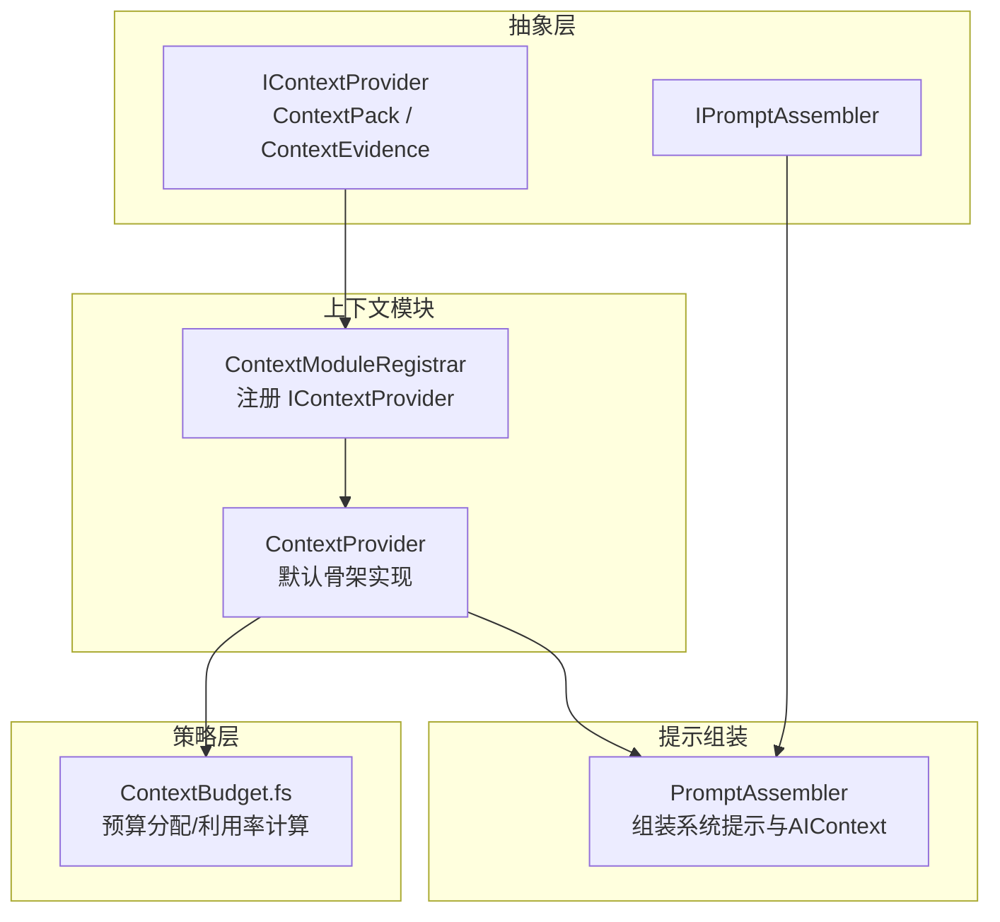
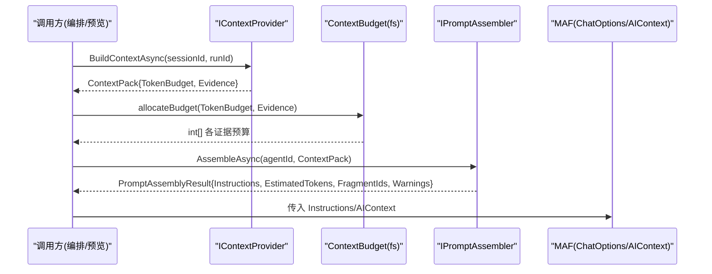
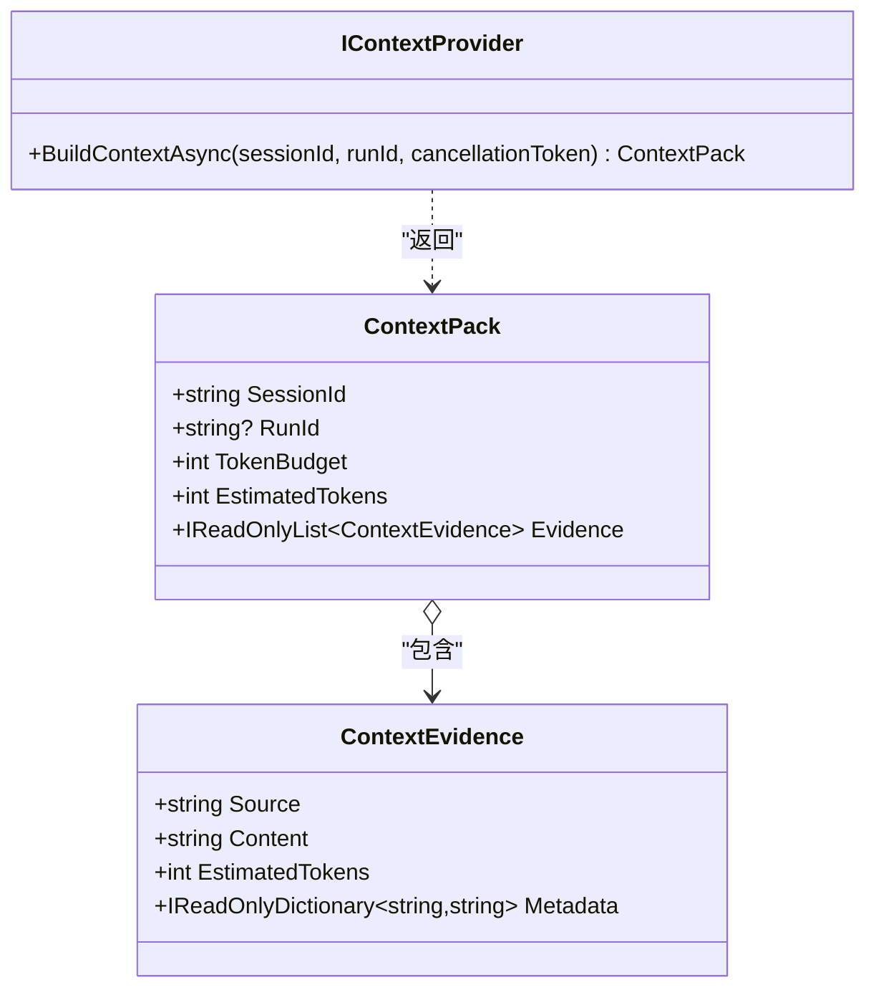
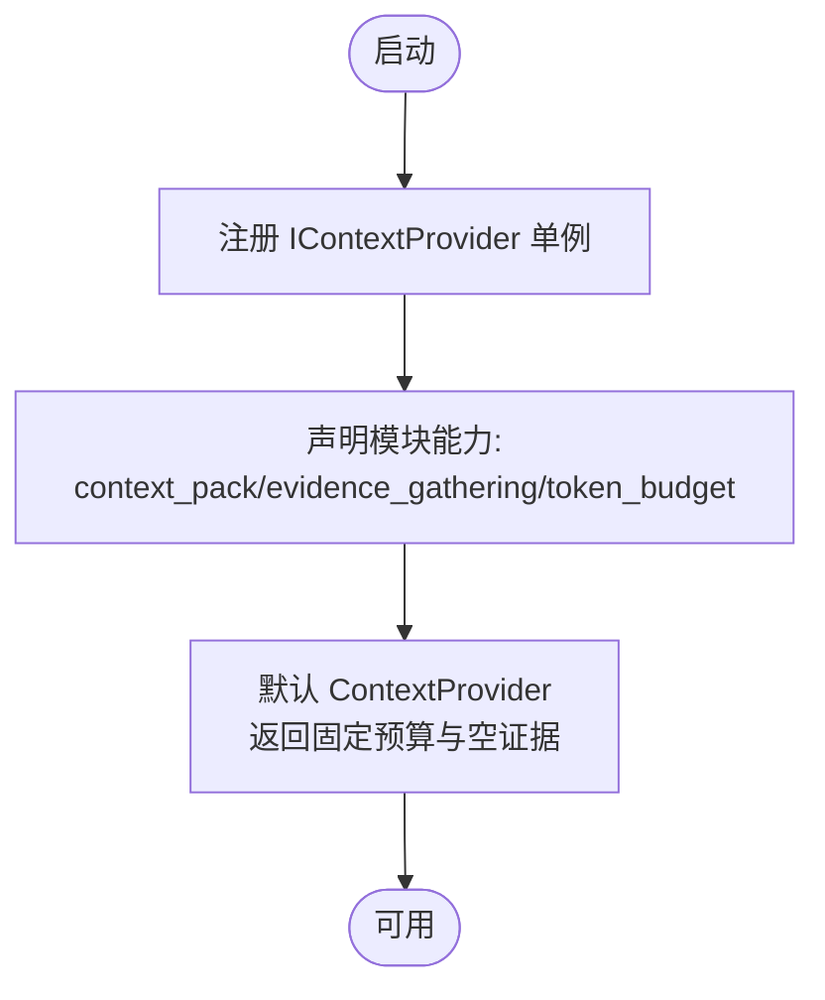
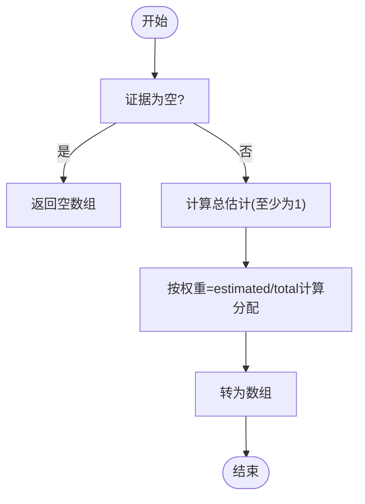
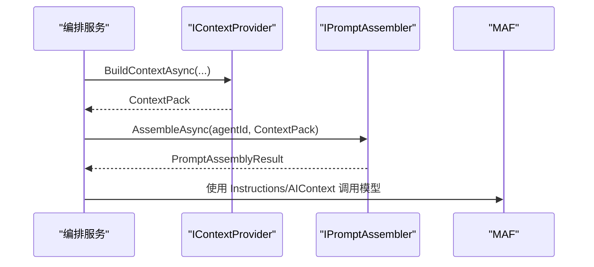
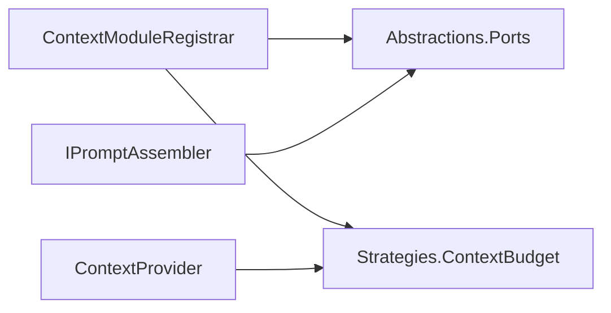

# 上下文管理模块

<cite>
**本文引用的文件**   
- [IContextProvider.cs](file://TinadecCore/Abstractions/Ports/IContextProvider.cs)
- [ContextModuleRegistrar.cs](file://TinadecCore/Context/ContextModuleRegistrar.cs)
- [ContextBudget.fs](file://TinadecCore/Strategies/ContextBudget.fs)
- [IPromptAssembler.cs](file://TinadecCore/Abstractions/Ports/IPromptAssembler.cs)
- [PromptContextServiceTests.cs](file://tests/TinadecCore.Tests/PromptContextServiceTests.cs)
</cite>

## 目录
1. [简介](#简介)
2. [项目结构](#项目结构)
3. [核心组件](#核心组件)
4. [架构总览](#架构总览)
5. [详细组件分析](#详细组件分析)
6. [依赖关系分析](#依赖关系分析)
7. [性能考量](#性能考量)
8. [故障排查指南](#故障排查指南)
9. [结论](#结论)
10. [附录：使用示例与扩展指南](#附录使用示例与扩展指南)

## 简介
本模块聚焦于“上下文管理”，围绕 IContextProvider 接口及其实现，提供 ContextPack（上下文包）的构建、Token 预算策略与证据收集机制。该设计扩展了 MAF（Microsoft Agent Framework）中的 AIContextProvider 概念，但不负责组装最终的系统提示词；系统提示词的组装由 Prompt Assembler 完成。模块通过服务注册器将上下文提供者注入到依赖注入容器，并在会话中维护上下文状态，以便在编排运行期间为模型调用提供可追溯、可预算的上下文内容。

## 项目结构
上下文管理相关代码主要分布在以下位置：
- Abstractions/Ports：定义 IContextProvider 接口与数据模型（ContextPack、ContextEvidence）。
- Context：模块注册器与默认上下文提供者骨架实现。
- Strategies：F# 实现的 Token 预算分配策略。
- Abstractions/Ports：Prompt Assembler 接口，用于将上下文包与提示片段组合成 MAF 可用的指令。
- Tests：对上下文与提示组装流程的集成测试样例。

图表来源 
- [IContextProvider.cs:1-37](file://TinadecCore/Abstractions/Ports/IContextProvider.cs#L1-L37)
- [ContextModuleRegistrar.cs:1-52](file://TinadecCore/Context/ContextModuleRegistrar.cs#L1-L52)
- [ContextBudget.fs:1-36](file://TinadecCore/Strategies/ContextBudget.fs#L1-L36)
- [IPromptAssembler.cs:1-23](file://TinadecCore/Abstractions/Ports/IPromptAssembler.cs#L1-L23)

章节来源
- [IContextProvider.cs:1-37](file://TinadecCore/Abstractions/Ports/IContextProvider.cs#L1-L37)
- [ContextModuleRegistrar.cs:1-52](file://TinadecCore/Context/ContextModuleRegistrar.cs#L1-L52)
- [ContextBudget.fs:1-36](file://TinadecCore/Strategies/ContextBudget.fs#L1-L36)
- [IPromptAssembler.cs:1-23](file://TinadecCore/Abstractions/Ports/IPromptAssembler.cs#L1-L23)

## 核心组件
- IContextProvider：定义 BuildContextAsync(sessionId, runId, cancellationToken)，返回 ContextPack。职责是生产带证据、来源与 Token 预算的上下文包，不组装最终系统提示。
- ContextPack：包含 SessionId、RunId、TokenBudget、EstimatedTokens、Evidence（证据列表）。
- ContextEvidence：包含 Source、Content、EstimatedTokens、Metadata，用于溯源与估算。
- ContextModuleRegistrar：将 IContextProvider 以单例方式注册到 DI 容器，并声明模块能力（context_pack、evidence_gathering、token_budget），以及 MAF 原语 context。
- ContextProvider：默认骨架实现，返回固定 Token 预算与空证据的 ContextPack，便于扩展与替换。
- IPromptAssembler：将 ContextPack 与提示片段、Agent 指令等组合为 MAF ChatOptions.Instructions/AIContext。

章节来源
- [IContextProvider.cs:1-37](file://TinadecCore/Abstractions/Ports/IContextProvider.cs#L1-L37)
- [ContextModuleRegistrar.cs:1-52](file://TinadecCore/Context/ContextModuleRegistrar.cs#L1-L52)
- [IPromptAssembler.cs:1-23](file://TinadecCore/Abstractions/Ports/IPromptAssembler.cs#L1-L23)

## 架构总览
上下文管理模块与提示组装、MAF 集成的整体交互如下：

图表来源 
- [IContextProvider.cs:1-37](file://TinadecCore/Abstractions/Ports/IContextProvider.cs#L1-L37)
- [ContextBudget.fs:1-36](file://TinadecCore/Strategies/ContextBudget.fs#L1-L36)
- [IPromptAssembler.cs:1-23](file://TinadecCore/Abstractions/Ports/IPromptAssembler.cs#L1-L23)

## 详细组件分析

### IContextProvider 接口与数据模型
- 接口方法：BuildContextAsync 接收会话与运行标识，返回上下文包。
- ContextPack：承载 Token 预算、估计用量与证据集合，供上层进行预算校验与提示组装。
- ContextEvidence：每条证据包含来源、内容与估计 Token，支持元数据扩展。

图表来源 
- [IContextProvider.cs:1-37](file://TinadecCore/Abstractions/Ports/IContextProvider.cs#L1-L37)

章节来源
- [IContextProvider.cs:1-37](file://TinadecCore/Abstractions/Ports/IContextProvider.cs#L1-L37)

### ContextModuleRegistrar 与默认实现
- 模块注册：将 IContextProvider 注册为单例，声明模块能力与依赖（abstractions、strategies），并暴露 MAF 原语 context。
- 默认实现：返回固定 Token 预算（如 8192）与空证据的 ContextPack，作为可扩展基线。

图表来源 
- [ContextModuleRegistrar.cs:1-52](file://TinadecCore/Context/ContextModuleRegistrar.cs#L1-L52)

章节来源
- [ContextModuleRegistrar.cs:1-52](file://TinadecCore/Context/ContextModuleRegistrar.cs#L1-L52)

### Token 预算策略（F#）
- allocateBudget：按证据 EstimatedTokens 比例分配总预算，避免零除（最小权重为 1）。
- isOverBudget：判断总估计是否超预算。
- utilizationRatio：计算预算利用率（0.0 到 1.0+）。

图表来源 
- [ContextBudget.fs:1-36](file://TinadecCore/Strategies/ContextBudget.fs#L1-L36)

章节来源
- [ContextBudget.fs:1-36](file://TinadecCore/Strategies/ContextBudget.fs#L1-L36)

### 与提示组装和 MAF 的集成
- IPromptAssembler.AssembleAsync 接收 agentId 与可选 ContextPack，输出 PromptAssemblyResult（Instructions、EstimatedTokens、FragmentIds、Warnings）。
- 典型流程：先获取 ContextPack，再结合提示片段与 Agent 指令，生成最终 Instructions 与 AIContext，供 MAF 调用。

图表来源 
- [IPromptAssembler.cs:1-23](file://TinadecCore/Abstractions/Ports/IPromptAssembler.cs#L1-L23)
- [IContextProvider.cs:1-37](file://TinadecCore/Abstractions/Ports/IContextProvider.cs#L1-L37)

章节来源
- [IPromptAssembler.cs:1-23](file://TinadecCore/Abstractions/Ports/IPromptAssembler.cs#L1-L23)

### 证据收集机制
- ContextEvidence 提供 Source、Content、EstimatedTokens、Metadata，便于追踪数据来源与估算 Token 用量。
- 上层可在 BuildContextAsync 中聚合多源证据（如会话历史、工具结果、外部检索），并按策略分配预算。

章节来源
- [IContextProvider.cs:1-37](file://TinadecCore/Abstractions/Ports/IContextProvider.cs#L1-L37)

## 依赖关系分析
- ContextModuleRegistrar 依赖 Abstractions（端口定义）与 Strategies（预算策略），并通过 TinadecCoreBuilder 注册服务。
- 默认 ContextProvider 依赖 F# 预算策略进行后续处理（由上层调用）。
- IPromptAssembler 独立于 IContextProvider，但消费其产物 ContextPack。

图表来源 
- [ContextModuleRegistrar.cs:1-52](file://TinadecCore/Context/ContextModuleRegistrar.cs#L1-L52)
- [ContextBudget.fs:1-36](file://TinadecCore/Strategies/ContextBudget.fs#L1-L36)
- [IPromptAssembler.cs:1-23](file://TinadecCore/Abstractions/Ports/IPromptAssembler.cs#L1-L23)

章节来源
- [ContextModuleRegistrar.cs:1-52](file://TinadecCore/Context/ContextModuleRegistrar.cs#L1-L52)
- [ContextBudget.fs:1-36](file://TinadecCore/Strategies/ContextBudget.fs#L1-L36)
- [IPromptAssembler.cs:1-23](file://TinadecCore/Abstractions/Ports/IPromptAssembler.cs#L1-L23)

## 性能考量
- 预算分配复杂度：allocateBudget 对证据列表线性扫描求和与映射，时间复杂度 O(n)。
- 预估 Token：建议在上层准确估算每条证据的 EstimatedTokens，避免过度占用或不足。
- 缓存与复用：若证据来源稳定，可对证据集合做短期缓存以减少重复计算。
- 异步取消：BuildContextAsync 应响应 CancellationToken，避免长时间阻塞。

[本节为通用指导，无需特定文件引用]

## 故障排查指南
- 预算超限：使用 isOverBudget 检查 EstimatedTokens 是否超过 TokenBudget，必要时裁剪证据或提高预算。
- 利用率异常：利用 utilizationRatio 评估实际使用率，定位证据过大或预算设置不合理。
- 证据缺失：检查 BuildContextAsync 是否正确填充 Evidence，确保 Source 与 Metadata 完整。
- 提示未生效：确认 IPromptAssembler 已正确接收 ContextPack，且 Fragment 未被禁用。

章节来源
- [ContextBudget.fs:1-36](file://TinadecCore/Strategies/ContextBudget.fs#L1-L36)
- [PromptContextServiceTests.cs:1-136](file://tests/TinadecCore.Tests/PromptContextServiceTests.cs#L1-L136)

## 结论
上下文管理模块通过 IContextProvider 与 ContextPack 定义了清晰的上下文契约，结合 F# 预算策略实现了可预测的 Token 控制与证据溯源。模块以最小职责原则与 MAF 集成，将上下文生产与提示组装解耦，便于扩展自定义上下文提供者与策略。通过服务注册器与能力声明，模块可无缝融入整体架构。

[本节为总结性内容，无需特定文件引用]

## 附录：使用示例与扩展指南

### 如何扩展自定义上下文提供者
- 实现 IContextProvider：在 BuildContextAsync 中根据 sessionId/runId 聚合证据，设置 TokenBudget 与 EstimatedTokens。
- 注册服务：通过 ITinadecCoreBuilder.Services.AddSingleton<IContextProvider, YourProvider>() 替换默认实现。
- 预算策略：在调用处使用 allocateBudget 对证据进行预算分配，并使用 isOverBudget/utilizationRatio 监控。

章节来源
- [IContextProvider.cs:1-37](file://TinadecCore/Abstractions/Ports/IContextProvider.cs#L1-L37)
- [ContextModuleRegistrar.cs:1-52](file://TinadecCore/Context/ContextModuleRegistrar.cs#L1-L52)
- [ContextBudget.fs:1-36](file://TinadecCore/Strategies/ContextBudget.fs#L1-L36)

### 如何配置 Token 预算与上下文打包策略
- 设置 TokenBudget：在 ContextPack 中指定总预算，依据模型上下文窗口与成本约束调整。
- 证据打包：在 Evidence 中按重要性排序，优先保留高价值证据；必要时裁剪低优先级证据。
- 预算分配：调用 allocateBudget 得到每个证据的预算，结合 isOverBudget 决定是否裁剪。

章节来源
- [IContextProvider.cs:1-37](file://TinadecCore/Abstractions/Ports/IContextProvider.cs#L1-L37)
- [ContextBudget.fs:1-36](file://TinadecCore/Strategies/ContextBudget.fs#L1-L36)

### 如何在会话中维护上下文状态
- 使用 sessionId 与 runId 区分不同会话与运行，确保证据与预算的隔离。
- 在 BuildContextAsync 中读取会话存储（如记忆/向量库）以动态生成证据。
- 将生成的 ContextPack 与 PromptAssemblyResult 关联，便于追踪与审计。

章节来源
- [IContextProvider.cs:1-37](file://TinadecCore/Abstractions/Ports/IContextProvider.cs#L1-L37)
- [IPromptAssembler.cs:1-23](file://TinadecCore/Abstractions/Ports/IPromptAssembler.cs#L1-L23)

### 与其他模块的依赖关系与服务注册机制
- 依赖 Abstractions 与 Strategies：通过 ContextModuleRegistrar 声明模块能力与依赖。
- 服务注册：以单例方式注册 IContextProvider，确保全局一致性与性能。
- 与提示组装协作：IPromptAssembler 消费 ContextPack，生成 MAF 可用的 Instructions/AIContext。

章节来源
- [ContextModuleRegistrar.cs:1-52](file://TinadecCore/Context/ContextModuleRegistrar.cs#L1-L52)
- [IPromptAssembler.cs:1-23](file://TinadecCore/Abstractions/Ports/IPromptAssembler.cs#L1-L23)