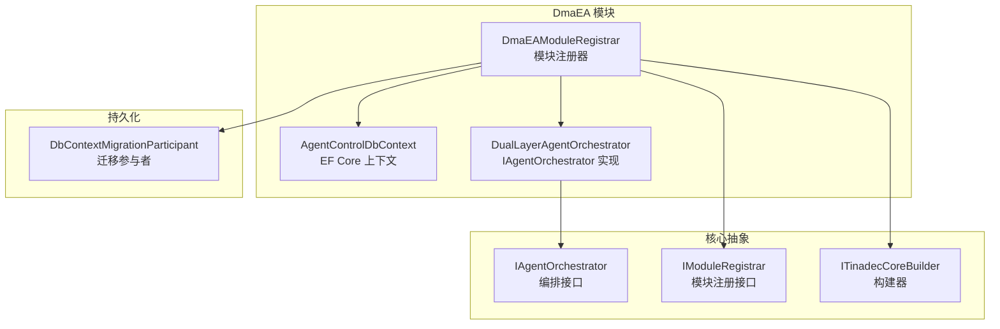
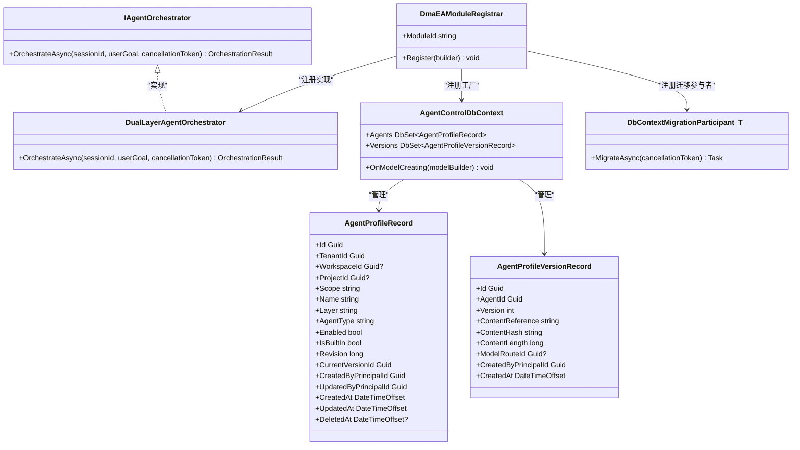
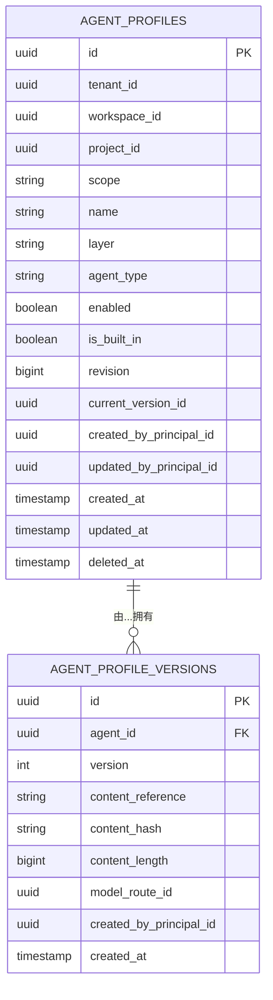
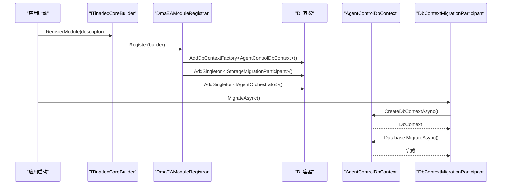
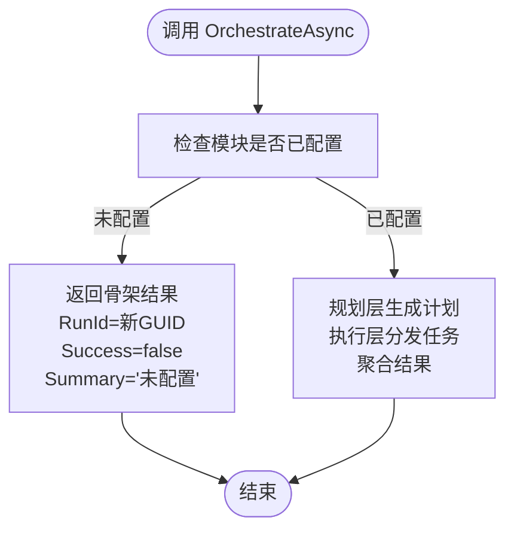
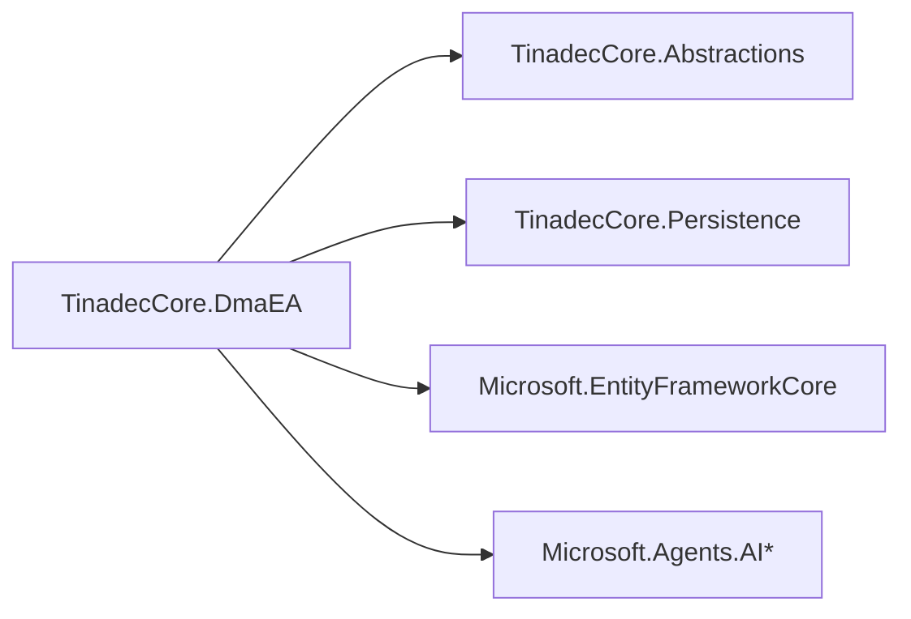

# 代理编排模块

<cite>
**本文引用的文件**   
- [AgentControlDbContext.cs](file://TinadecCore/DmaEA/AgentControlDbContext.cs)
- [DmaEAModuleRegistrar.cs](file://TinadecCore/DmaEA/DmaEAModuleRegistrar.cs)
- [IAgentOrchestrator.cs](file://TinadecCore/Abstractions/Ports/IAgentOrchestrator.cs)
- [IModuleRegistrar.cs](file://TinadecCore/Abstractions/IModuleRegistrar.cs)
- [ITinadecCoreBuilder.cs](file://TinadecCore/Abstractions/ITinadecCoreBuilder.cs)
- [TinadecCoreBuilder.cs](file://TinadecCore/Runtime/TinadecCoreBuilder.cs)
- [DbContextMigrationParticipant.cs](file://TinadecCore/Persistence/DbContextMigrationParticipant.cs)
- [TinadecCore.DmaEA.csproj](file://TinadecCore/DmaEA/TinadecCore.DmaEA.csproj)
</cite>

## 目录
1. [引言](#引言)
2. [项目结构](#项目结构)
3. [核心组件](#核心组件)
4. [架构总览](#架构总览)
5. [详细组件分析](#详细组件分析)
6. [依赖关系分析](#依赖关系分析)
7. [性能考虑](#性能考虑)
8. [故障排查指南](#故障排查指南)
9. [结论](#结论)
10. [附录](#附录)

## 引言
本章节面向 DmaEA（双层多智能体协作）代理编排模块，系统性阐述其数据库上下文设计、代理生命周期状态管理、执行计划存储与任务调度机制，并说明 DmaEAModuleRegistrar 如何注册编排服务以及与核心框架的集成方式。文档同时给出配置选项、状态转换规则、错误处理机制以及使用示例，帮助读者快速理解并落地复杂代理工作流。

## 项目结构
DmaEA 模块位于 TinadecCore/DmaEA 目录下，包含：
- AgentControlDbContext：定义代理档案与版本记录的 EF Core 上下文及实体映射
- DmaEAModuleRegistrar：模块注册器，负责 DI 容器注册、迁移参与、能力声明与模块描述
- IAgentOrchestrator：编排接口与结果模型
- ITinadecCoreBuilder / TinadecCoreBuilder：核心构建器与模块描述符
- DbContextMigrationParticipant：统一的数据库迁移参与者

图表来源
- [AgentControlDbContext.cs:5-24](file://TinadecCore/DmaEA/AgentControlDbContext.cs#L5-L24)
- [DmaEAModuleRegistrar.cs:12-31](file://TinadecCore/DmaEA/DmaEAModuleRegistrar.cs#L12-L31)
- [IAgentOrchestrator.cs:9-15](file://TinadecCore/Abstractions/Ports/IAgentOrchestrator.cs#L9-L15)
- [IModuleRegistrar.cs:9-16](file://TinadecCore/Abstractions/IModuleRegistrar.cs#L9-L16)
- [ITinadecCoreBuilder.cs:10-19](file://TinadecCore/Abstractions/ITinadecCoreBuilder.cs#L10-L19)
- [DbContextMigrationParticipant.cs:6-24](file://TinadecCore/Persistence/DbContextMigrationParticipant.cs#L6-L24)

章节来源
- [AgentControlDbContext.cs:1-28](file://TinadecCore/DmaEA/AgentControlDbContext.cs#L1-L28)
- [DmaEAModuleRegistrar.cs:1-57](file://TinadecCore/DmaEA/DmaEAModuleRegistrar.cs#L1-L57)
- [IAgentOrchestrator.cs:1-24](file://TinadecCore/Abstractions/Ports/IAgentOrchestrator.cs#L1-L24)
- [IModuleRegistrar.cs:1-17](file://TinadecCore/Abstractions/IModuleRegistrar.cs#L1-L17)
- [ITinadecCoreBuilder.cs:1-52](file://TinadecCore/Abstractions/ITinadecCoreBuilder.cs#L1-L52)
- [DbContextMigrationParticipant.cs:1-37](file://TinadecCore/Persistence/DbContextMigrationParticipant.cs#L1-L37)

## 核心组件
- 代理控制数据库上下文（AgentControlDbContext）
  - 提供 agent_profiles 与 agent_profile_versions 两张表的数据访问
  - 对代理档案进行租户/工作区/项目维度索引，支持软删除字段 DeletedAt
  - 版本记录唯一约束于 (AgentId, Version)，便于版本演进与回滚
- 模块注册器（DmaEAModuleRegistrar）
  - 通过 IDbContextFactory 注入 AgentControlDbContext
  - 注册 IAgentOrchestrator 的实现（骨架 DualLayerAgentOrchestrator）
  - 声明模块能力：dual_layer_orchestration、task_dispatch、collaboration、scheduling、result_aggregation
  - 将自身作为 IStorageMigrationParticipant 参与统一迁移流程
- 编排接口（IAgentOrchestrator）
  - 暴露 OrchestrateAsync(sessionId, userGoal, cancellationToken)
  - 返回 OrchestrationResult（RunId、Success、Summary、Warnings）
- 构建器与模块描述（ITinadecCoreBuilder / ModuleDescriptor）
  - 收集模块描述符，供外部查询与展示
  - 支持语言、依赖、能力、MAF 原语等元数据

章节来源
- [AgentControlDbContext.cs:5-24](file://TinadecCore/DmaEA/AgentControlDbContext.cs#L5-L24)
- [DmaEAModuleRegistrar.cs:16-31](file://TinadecCore/DmaEA/DmaEAModuleRegistrar.cs#L16-L31)
- [IAgentOrchestrator.cs:9-23](file://TinadecCore/Abstractions/Ports/IAgentOrchestrator.cs#L9-L23)
- [ITinadecCoreBuilder.cs:24-44](file://TinadecCore/Abstractions/ITinadecCoreBuilder.cs#L24-L44)

## 架构总览
DmaEA 采用“规划层 + 执行层”的双层编排思想：
- 规划层：主动制定计划、监督执行、动态创建与协调多个代理
- 执行层：被动接收任务、执行具体动作、聚合结果并上报

当前阶段为骨架实现，OrchestrateAsync 返回未配置的占位结果；后续可基于 AgentControlDbContext 读取/写入代理档案与版本，结合任务调度与协作机制逐步完善。

图表来源
- [IAgentOrchestrator.cs:9-15](file://TinadecCore/Abstractions/Ports/IAgentOrchestrator.cs#L9-L15)
- [DmaEAModuleRegistrar.cs:39-56](file://TinadecCore/DmaEA/DmaEAModuleRegistrar.cs#L39-L56)
- [AgentControlDbContext.cs:5-24](file://TinadecCore/DmaEA/AgentControlDbContext.cs#L5-L24)
- [DbContextMigrationParticipant.cs:6-24](file://TinadecCore/Persistence/DbContextMigrationParticipant.cs#L6-L24)

## 详细组件分析

### 代理控制数据库上下文（AgentControlDbContext）
- 表结构与索引
  - agent_profiles：主键 Id，名称、层级、类型、作用域等字段，按 (TenantId, WorkspaceId, ProjectId, Name, DeletedAt) 建立复合索引，支撑多租户隔离与软删除查询
  - agent_profile_versions：主键 Id，(AgentId, Version) 唯一索引，确保版本不可重复
- 命名约定
  - 使用 UseTinadecSnakeCase() 将实体属性映射为蛇形表名与列名
- 扩展点
  - OnModelCreating 中集中配置实体映射与索引，便于后续扩展审计字段或业务索引

图表来源
- [AgentControlDbContext.cs:12-21](file://TinadecCore/DmaEA/AgentControlDbContext.cs#L12-L21)

章节来源
- [AgentControlDbContext.cs:5-24](file://TinadecCore/DmaEA/AgentControlDbContext.cs#L5-L24)

### 模块注册器（DmaEAModuleRegistrar）
- 服务注册
  - 通过 AddDbContextFactory<AgentControlDbContext> 提供上下文工厂
  - 注册 IStorageMigrationParticipant<AgentControlDbContext> 参与统一迁移
  - 注册 IAgentOrchestrator 的实现（当前为骨架）
- 模块描述
  - 模块 ID：dma_ea
  - 版本：0.1.0
  - 依赖：abstractions、persistence
  - 能力：dual_layer_orchestration、task_dispatch、collaboration、scheduling、result_aggregation
  - 语言：C#
  - MAF 原语：agent、workflow
  - 注册状态：NotConfigured（骨架阶段）

图表来源
- [DmaEAModuleRegistrar.cs:16-31](file://TinadecCore/DmaEA/DmaEAModuleRegistrar.cs#L16-L31)
- [DbContextMigrationParticipant.cs:12-23](file://TinadecCore/Persistence/DbContextMigrationParticipant.cs#L12-L23)

章节来源
- [DmaEAModuleRegistrar.cs:12-31](file://TinadecCore/DmaEA/DmaEAModuleRegistrar.cs#L12-L31)

### 编排接口与结果（IAgentOrchestrator）
- 入口方法 OrchestrateAsync 接受会话标识与用户目标，返回运行标识、成功标志、摘要与警告列表
- 当前骨架实现直接返回未配置提示，便于后续接入真实编排逻辑

图表来源
- [IAgentOrchestrator.cs:11-15](file://TinadecCore/Abstractions/Ports/IAgentOrchestrator.cs#L11-L15)
- [DmaEAModuleRegistrar.cs:41-55](file://TinadecCore/DmaEA/DmaEAModuleRegistrar.cs#L41-L55)

章节来源
- [IAgentOrchestrator.cs:9-23](file://TinadecCore/Abstractions/Ports/IAgentOrchestrator.cs#L9-L23)
- [DmaEAModuleRegistrar.cs:39-56](file://TinadecCore/DmaEA/DmaEAModuleRegistrar.cs#L39-L56)

### 构建器与模块描述（ITinadecCoreBuilder / TinadecCoreBuilder）
- ITinadecCoreBuilder 提供 Services 集合与 RegisterModule/GetRegisteredModules 方法
- TinadecCoreBuilder 内部维护 ModuleDescriptor 列表，供外部查询模块能力与依赖

章节来源
- [ITinadecCoreBuilder.cs:10-19](file://TinadecCore/Abstractions/ITinadecCoreBuilder.cs#L10-L19)
- [TinadecCoreBuilder.cs:15-29](file://TinadecCore/Runtime/TinadecCoreBuilder.cs#L15-L29)

## 依赖关系分析
- 项目引用
  - TinadecCore.DmaEA 依赖 Abstractions 与 Persistence
  - 引入 Microsoft.EntityFrameworkCore 与 Microsoft.Agents.AI 相关包
- 运行时依赖
  - DmaEAModuleRegistrar 依赖 IDbContextFactory、IStorageMigrationParticipant、IAgentOrchestrator
  - AgentControlDbContext 依赖 EF Core ModelBuilder 与蛇形命名约定扩展

图表来源
- [TinadecCore.DmaEA.csproj:9-18](file://TinadecCore/DmaEA/TinadecCore.DmaEA.csproj#L9-L18)

章节来源
- [TinadecCore.DmaEA.csproj:1-21](file://TinadecCore/DmaEA/TinadecCore.DmaEA.csproj#L1-L21)

## 性能考虑
- 数据库访问
  - 使用 IDbContextFactory 避免跨线程共享 DbContext，提升并发安全性
  - 合理索引（如 agent_profiles 的多租户复合索引）减少扫描开销
- 迁移策略
  - 优先尝试 EF Migrate，若无可迁移脚本则回退到 SchemaBootstrapper 生成建表脚本，降低部署复杂度
- 编排性能
  - 骨架阶段无实际计算，后续应关注任务队列、异步并行与结果聚合的性能瓶颈

[本节为通用指导，不直接分析具体文件]

## 故障排查指南
- 模块未配置
  - 现象：OrchestrateAsync 返回 Success=false 且 Summary 提示未配置
  - 排查：确认 DmaEAModuleRegistrar.Register 是否被调用；检查 ModuleRegistrationStatus 是否为 NotConfigured
- 数据库迁移失败
  - 现象：启动时报错无法连接或迁移失败
  - 排查：检查 UseTinadecDatabase 配置是否正确；查看 DbContextMigrationParticipant 的 MigrateAsync 日志；必要时启用 EnsureTablesAsync 的脚本输出
- 版本冲突
  - 现象：插入新版本时出现唯一约束冲突
  - 排查：确认 (AgentId, Version) 唯一性；检查版本号递增逻辑

章节来源
- [DmaEAModuleRegistrar.cs:41-55](file://TinadecCore/DmaEA/DmaEAModuleRegistrar.cs#L41-L55)
- [DbContextMigrationParticipant.cs:12-23](file://TinadecCore/Persistence/DbContextMigrationParticipant.cs#L12-L23)

## 结论
DmaEA 模块以清晰的数据库上下文与模块注册机制为基础，提供了双层编排的骨架实现。当前阶段重点在于基础设施搭建（上下文、迁移、模块描述），后续可在 IAgentOrchestrator 中逐步实现计划生成、任务调度、协作与结果聚合，形成完整的代理工作流编排能力。

[本节为总结，不直接分析具体文件]

## 附录

### 配置选项与能力清单
- 模块 ID：dma_ea
- 版本：0.1.0
- 依赖：abstractions、persistence
- 能力：dual_layer_orchestration、task_dispatch、collaboration、scheduling、result_aggregation
- 语言：C#
- MAF 原语：agent、workflow
- 注册状态：NotConfigured（骨架阶段）

章节来源
- [DmaEAModuleRegistrar.cs:21-30](file://TinadecCore/DmaEA/DmaEAModuleRegistrar.cs#L21-L30)

### 状态转换规则（建议）
- 代理档案状态
  - 新建 -> 启用/禁用 -> 归档（软删除）
- 版本状态
  - 草稿 -> 已发布 -> 回滚至历史版本
- 编排运行状态
  - 待执行 -> 规划中 -> 执行中 -> 已完成/失败

[本节为概念性说明，不直接分析具体文件]

### 使用示例（端到端流程）
- 步骤
  1) 在应用启动时调用 DmaEAModuleRegistrar.Register(builder) 完成服务注册
  2) 通过 IAgentOrchestrator.OrchestrateAsync(sessionId, userGoal) 触发编排
  3) 读取 OrchestrationResult 中的 RunId、Success、Summary、Warnings 判断执行结果
- 预期行为（骨架阶段）
  - 返回未配置提示，便于后续替换为真实编排实现

章节来源
- [DmaEAModuleRegistrar.cs:16-31](file://TinadecCore/DmaEA/DmaEAModuleRegistrar.cs#L16-L31)
- [IAgentOrchestrator.cs:11-15](file://TinadecCore/Abstractions/Ports/IAgentOrchestrator.cs#L11-L15)
- [DmaEAModuleRegistrar.cs:41-55](file://TinadecCore/DmaEA/DmaEAModuleRegistrar.cs#L41-L55)