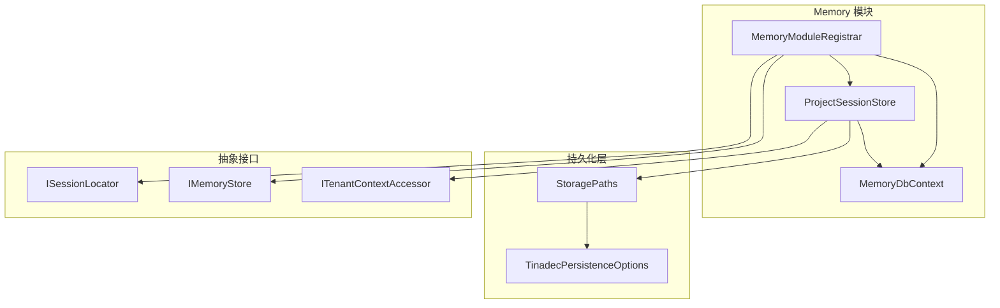
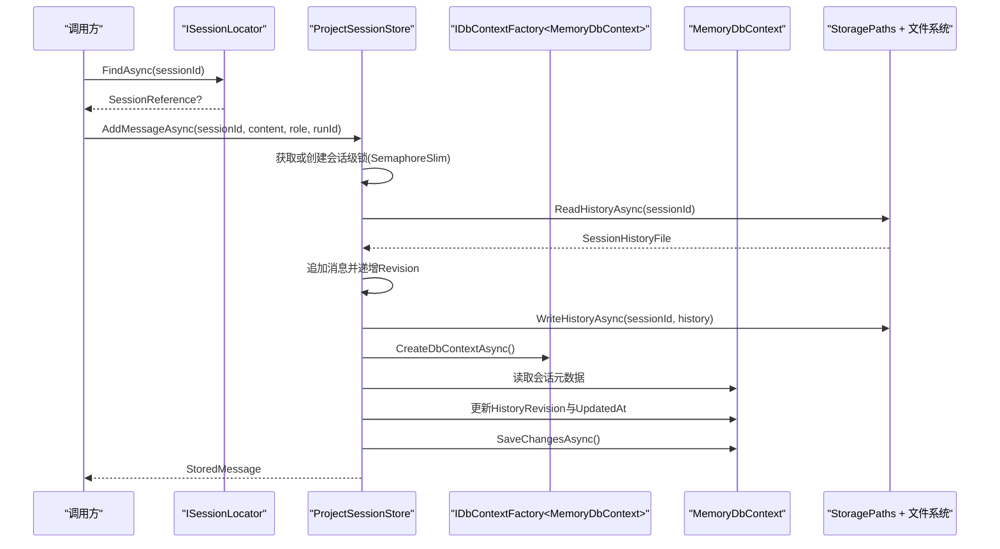
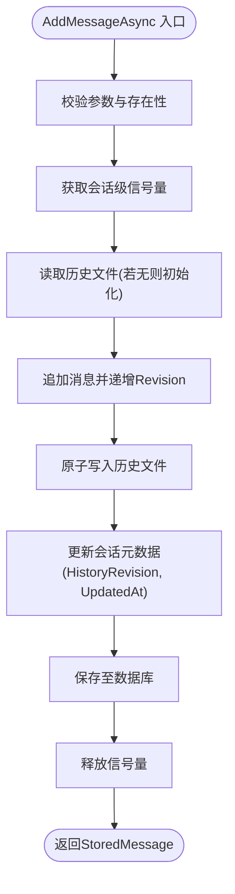
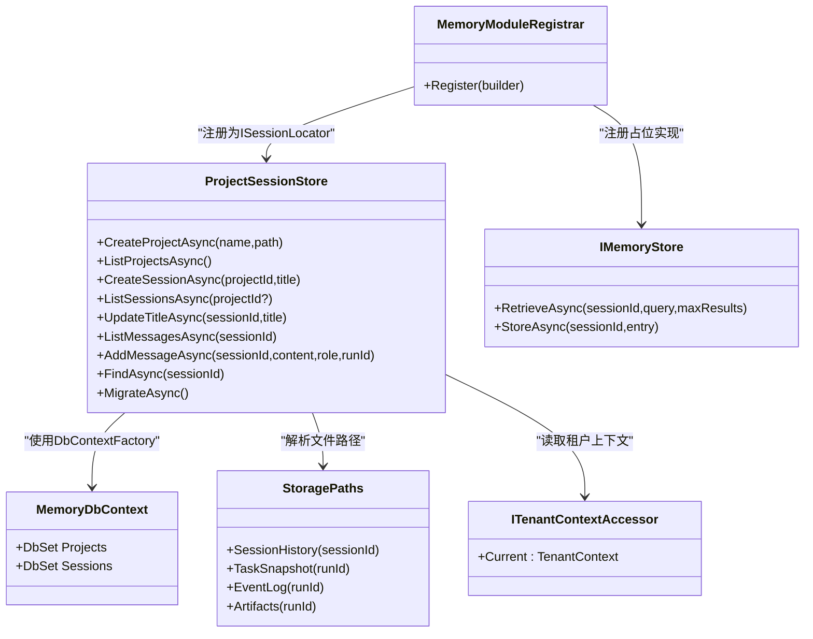

# 会话记忆模块

<cite>
**本文引用的文件**   
- [ProjectSessionStore.cs](file://TinadecCore/Memory/ProjectSessionStore.cs)
- [MemoryDbContext.cs](file://TinadecCore/Memory/MemoryDbContext.cs)
- [MemoryModuleRegistrar.cs](file://TinadecCore/Memory/MemoryModuleRegistrar.cs)
- [IMemoryStore.cs](file://TinadecCore/Abstractions/Ports/IMemoryStore.cs)
- [ISessionLocator.cs](file://TinadecCore/Abstractions/Ports/ISessionLocator.cs)
- [ITenantContextAccessor.cs](file://TinadecCore/Abstractions/Ports/ITenantContextAccessor.cs)
- [StoragePaths.cs](file://TinadecCore/Persistence/StoragePaths.cs)
- [TinadecPersistenceOptions.cs](file://TinadecCore/Persistence/TinadecPersistenceOptions.cs)
</cite>

## 目录
1. [简介](#简介)
2. [项目结构](#项目结构)
3. [核心组件](#核心组件)
4. [架构总览](#架构总览)
5. [详细组件分析](#详细组件分析)
6. [依赖关系分析](#依赖关系分析)
7. [性能考量](#性能考量)
8. [故障排查指南](#故障排查指南)
9. [结论](#结论)
10. [附录：API 与使用示例](#附录api-与使用示例)

## 简介
本模块为 Memory 会话记忆子系统，提供“项目-会话-消息”的持久化能力。其核心职责包括：
- 通过 ProjectSessionStore 实现项目的创建、列表与会话的增删改查；
- 将会话历史（消息）以 JSON 文件形式持久化到磁盘，并通过数据库记录元数据与版本信息；
- 通过 MemoryDbContext 定义 EF Core 模型与索引，保证查询性能与一致性；
- 借助 MemoryModuleRegistrar 将服务注册到核心框架 DI 容器，并暴露 ISessionLocator 供其他模块校验会话归属；
- 提供 IMemoryStore 抽象用于未来扩展（如向量检索、保留策略等）。

该设计兼顾了高并发写入时的线程安全、跨租户隔离、以及可迁移的数据模型。

## 项目结构
Memory 模块位于 TinadecCore/Memory 下，包含三个关键文件：
- ProjectSessionStore.cs：会话与项目的存储实现，负责文件与数据库的双写与一致性维护；
- MemoryDbContext.cs：EF Core 上下文与实体映射，定义 projects/sessions 表结构与索引；
- MemoryModuleRegistrar.cs：模块注册器，注入 DbContextFactory、ProjectSessionStore、ISessionLocator、IMemoryStore 等。

图表来源
- [ProjectSessionStore.cs:1-219](file://TinadecCore/Memory/ProjectSessionStore.cs#L1-L219)
- [MemoryDbContext.cs:1-92](file://TinadecCore/Memory/MemoryDbContext.cs#L1-L92)
- [MemoryModuleRegistrar.cs:1-58](file://TinadecCore/Memory/MemoryModuleRegistrar.cs#L1-L58)
- [StoragePaths.cs:1-64](file://TinadecCore/Persistence/StoragePaths.cs#L1-L64)
- [TinadecPersistenceOptions.cs:1-48](file://TinadecCore/Persistence/TinadecPersistenceOptions.cs#L1-L48)

章节来源
- [ProjectSessionStore.cs:1-219](file://TinadecCore/Memory/ProjectSessionStore.cs#L1-L219)
- [MemoryDbContext.cs:1-92](file://TinadecCore/Memory/MemoryDbContext.cs#L1-L92)
- [MemoryModuleRegistrar.cs:1-58](file://TinadecCore/Memory/MemoryModuleRegistrar.cs#L1-L58)

## 核心组件
- ProjectSessionStore：实现 ISessionLocator 与 IStorageMigrationParticipant，封装项目与会话的 CRUD、消息追加、历史文件读写、并发控制与迁移逻辑。
- MemoryDbContext：定义 Projects/Sessions 两张表及索引，承载元数据与版本号。
- MemoryModuleRegistrar：将上述服务注册到 DI，并声明模块能力与依赖。
- StoragePaths：解析 DataRoot 下的会话历史文件路径，确保路径安全。
- IMemoryStore：抽象内存/向量存储接口，当前为占位实现。

章节来源
- [ProjectSessionStore.cs:1-219](file://TinadecCore/Memory/ProjectSessionStore.cs#L1-L219)
- [MemoryDbContext.cs:1-92](file://TinadecCore/Memory/MemoryDbContext.cs#L1-L92)
- [MemoryModuleRegistrar.cs:1-58](file://TinadecCore/Memory/MemoryModuleRegistrar.cs#L1-L58)
- [StoragePaths.cs:1-64](file://TinadecCore/Persistence/StoragePaths.cs#L1-L64)
- [IMemoryStore.cs:1-31](file://TinadecCore/Abstractions/Ports/IMemoryStore.cs#L1-L31)

## 架构总览
下图展示了从调用方到存储层的完整链路：调用方通过 ISessionLocator 查找会话归属，ProjectSessionStore 在写入消息时同时更新 JSON 历史文件与数据库中的会话元数据，并使用按会话粒度的信号量保障并发安全。

图表来源
- [ProjectSessionStore.cs:117-139](file://TinadecCore/Memory/ProjectSessionStore.cs#L117-L139)
- [ProjectSessionStore.cs:166-196](file://TinadecCore/Memory/ProjectSessionStore.cs#L166-L196)
- [StoragePaths.cs:21](file://TinadecCore/Persistence/StoragePaths.cs#L21)

## 详细组件分析

### ProjectSessionStore：会话持久化、检索与更新
- 并发控制：使用 ConcurrentDictionary<Guid, SemaphoreSlim> 为每个 sessionId 提供细粒度锁，避免多写冲突。
- 文件持久化：ReadHistoryAsync/WriteHistoryAsync 基于 JSON 序列化，采用临时文件+原子替换策略，确保写入原子性与幂等性。
- 元数据同步：每次追加消息后，更新 Sessions.HistoryRevision 与 UpdatedAt，保持数据库与文件的一致性。
- 租户隔离：所有查询均按 TenantId/WorkspaceId 过滤，确保多租户隔离。
- 迁移支持：实现 IStorageMigrationParticipant.MigrateAsync，对旧数据进行租户字段回填。

图表来源
- [ProjectSessionStore.cs:117-139](file://TinadecCore/Memory/ProjectSessionStore.cs#L117-L139)
- [ProjectSessionStore.cs:166-196](file://TinadecCore/Memory/ProjectSessionStore.cs#L166-L196)

章节来源
- [ProjectSessionStore.cs:1-219](file://TinadecCore/Memory/ProjectSessionStore.cs#L1-L219)

### MemoryDbContext：数据库设计与索引优化
- 表结构
  - projects：id, tenant_id, workspace_id, name, root_path, normalized_root_path, kind, created_at, updated_at, archived
  - sessions：id, tenant_id, workspace_id, project_id, title, status, mode, summary, history_revision, created_at, updated_at, archived
- 索引设计
  - projects: (tenant_id, workspace_id, normalized_root_path) 唯一索引，防止重复项目；
  - projects: (tenant_id, workspace_id, archived, updated_at) 复合索引，加速按租户/工作区分页与归档筛选；
  - projects: (archived, updated_at) 辅助索引；
  - sessions: (tenant_id, workspace_id, project_id, archived, updated_at) 复合索引，支撑按项目/租户/工作区快速列出会话并按更新时间排序。
- 查询模式
  - 列表查询均使用 AsNoTracking 提升只读性能；
  - 按租户与工作区维度过滤，避免跨租户数据泄漏。

章节来源
- [MemoryDbContext.cs:13-60](file://TinadecCore/Memory/MemoryDbContext.cs#L13-L60)

### MemoryModuleRegistrar：模块注册与集成
- 注册 IDbContextFactory<MemoryDbContext>，通过 UseTinadecDatabase 统一配置数据库提供者；
- 单例注入 ProjectSessionStore，并映射为 ISessionLocator；
- 注册 IStorageMigrationParticipant，使迁移流程可发现；
- 注册 IMemoryStore 占位实现，预留向量检索与保留策略扩展点；
- 声明模块能力：session_serialization、chat_history、retention_policy、provenance。

章节来源
- [MemoryModuleRegistrar.cs:15-32](file://TinadecCore/Memory/MemoryModuleRegistrar.cs#L15-L32)

### StoragePaths：文件路径解析与安全
- 根据 DataRoot 计算根目录，并提供 SessionHistory(sessionId) 等方法生成绝对路径；
- 内部校验路径未逃逸 DataRoot，防止越权访问；
- 为不同资源类型提供统一的路径命名规范。

章节来源
- [StoragePaths.cs:1-64](file://TinadecCore/Persistence/StoragePaths.cs#L1-L64)

### IMemoryStore：内存/向量存储抽象
- 定义 RetrieveAsync/StoreAsync 两个方法，用于未来扩展（例如向量检索、摘要缓存等）；
- 当前为骨架实现，返回空结果或完成操作，便于后续接入向量库或外部存储。

章节来源
- [IMemoryStore.cs:1-31](file://TinadecCore/Abstractions/Ports/IMemoryStore.cs#L1-L31)

## 依赖关系分析
- ProjectSessionStore 依赖：
  - IDbContextFactory<MemoryDbContext>：用于按需创建 DbContext；
  - StoragePaths：解析会话历史文件路径；
  - ITenantContextAccessor：获取当前租户与工作区上下文；
  - 文件系统：JSON 序列化/反序列化与原子写入。
- MemoryDbContext 依赖：
  - EF Core DbContextOptions，由 UseTinadecDatabase 注入；
  - 实体映射与索引定义。
- MemoryModuleRegistrar 依赖：
  - ITinadecCoreBuilder：注册服务与模块描述符；
  - Persistence 层选项：TinadecPersistenceOptions。

图表来源
- [ProjectSessionStore.cs:1-219](file://TinadecCore/Memory/ProjectSessionStore.cs#L1-L219)
- [MemoryDbContext.cs:1-92](file://TinadecCore/Memory/MemoryDbContext.cs#L1-L92)
- [StoragePaths.cs:1-64](file://TinadecCore/Persistence/StoragePaths.cs#L1-L64)
- [MemoryModuleRegistrar.cs:1-58](file://TinadecCore/Memory/MemoryModuleRegistrar.cs#L1-L58)
- [IMemoryStore.cs:1-31](file://TinadecCore/Abstractions/Ports/IMemoryStore.cs#L1-L31)

章节来源
- [ProjectSessionStore.cs:1-219](file://TinadecCore/Memory/ProjectSessionStore.cs#L1-L219)
- [MemoryDbContext.cs:1-92](file://TinadecCore/Memory/MemoryDbContext.cs#L1-L92)
- [MemoryModuleRegistrar.cs:1-58](file://TinadecCore/Memory/MemoryModuleRegistrar.cs#L1-L58)
- [StoragePaths.cs:1-64](file://TinadecCore/Persistence/StoragePaths.cs#L1-L64)
- [IMemoryStore.cs:1-31](file://TinadecCore/Abstractions/Ports/IMemoryStore.cs#L1-L31)

## 性能考量
- 并发写入：按会话维度的 SemaphoreSlim 避免同一会话的多写竞争，减少锁粒度与死锁风险。
- 只读查询：AsNoTracking 提升 EF Core 读取性能，适用于列表与查找场景。
- 文件写入：临时文件+原子替换，避免部分写入导致的历史损坏；FlushToDisk=true 增强落盘可靠性。
- 索引优化：projects/sessions 的复合索引覆盖常见查询条件（租户、工作区、归档状态、更新时间），降低扫描成本。
- 序列化：使用 JsonSerializerDefaults.Web 与紧凑输出，减小文件大小与 IO 开销。

[本节为通用性能建议，不直接分析具体文件]

## 故障排查指南
- 会话不存在：EnsureSessionExistsAsync 会抛出 KeyNotFoundException，检查 FindAsync 是否返回 null。
- 历史文件无效：反序列化失败将抛出 InvalidDataException，需检查文件完整性与版本兼容性。
- 路径越界：StoragePaths 会拒绝超出 DataRoot 的路径，确认 DataRoot 配置是否正确。
- 并发异常：若出现写入冲突，检查是否存在绕过 AddMessageAsync 的直接文件写入。
- 迁移问题：MigrateAsync 仅回填租户字段，若仍异常，检查数据库连接与权限。

章节来源
- [ProjectSessionStore.cs:161-164](file://TinadecCore/Memory/ProjectSessionStore.cs#L161-L164)
- [ProjectSessionStore.cs:166-173](file://TinadecCore/Memory/ProjectSessionStore.cs#L166-L173)
- [StoragePaths.cs:43-53](file://TinadecCore/Persistence/StoragePaths.cs#L43-L53)
- [ProjectSessionStore.cs:149-159](file://TinadecCore/Memory/ProjectSessionStore.cs#L149-L159)

## 结论
Memory 会话记忆模块以 ProjectSessionStore 为核心，结合 EF Core 与文件系统实现了高可靠、可扩展的会话与消息持久化方案。通过细粒度并发控制、原子写入与完善的索引设计，在保证一致性的同时提升了查询与写入性能。模块注册器将其无缝集成到核心框架，并为未来的向量检索与保留策略预留扩展点。

[本节为总结性内容，不直接分析具体文件]

## 附录：API 与使用示例

### API 概览（ISessionLocator 与 ProjectSessionStore）
- 会话定位
  - FindAsync(sessionId)：返回 SessionReference（含 SessionId、ProjectId、TenantId、WorkspaceId）
- 项目管理
  - CreateProjectAsync(name, path)：创建项目，校验路径与重复性
  - ListProjectsAsync()：按租户/工作区列出非归档项目，按更新时间倒序
- 会话管理
  - CreateSessionAsync(projectId, title)：创建会话并初始化历史文件
  - ListSessionsAsync(projectId?)：按可选 projectId 过滤会话
  - UpdateTitleAsync(sessionId, title)：更新标题并刷新时间戳
- 消息管理
  - ListMessagesAsync(sessionId)：读取会话历史消息列表
  - AddMessageAsync(sessionId, content, role, runId)：追加消息并原子更新历史文件与元数据

章节来源
- [ISessionLocator.cs:1-10](file://TinadecCore/Abstractions/Ports/ISessionLocator.cs#L1-L10)
- [ProjectSessionStore.cs:24-139](file://TinadecCore/Memory/ProjectSessionStore.cs#L24-L139)

### 数据模型（EF Core 实体）
- ProjectRecord：项目元数据（名称、根路径、归一化路径、类型、时间戳、归档标志）
- SessionRecord：会话元数据（标题、状态、模式、摘要、历史版本、时间戳、归档标志）

章节来源
- [MemoryDbContext.cs:63-91](file://TinadecCore/Memory/MemoryDbContext.cs#L63-L91)

### 缓存策略
- 当前实现未引入内存缓存，所有读取均直连数据库与文件系统；
- 如需热点会话缓存，可在 ProjectSessionStore 外层增加 LRU 缓存，注意失效策略与一致性。

[本节为概念性说明，不直接分析具体文件]

### 使用示例（保存与恢复会话状态）
- 保存会话状态（追加消息）
  - 调用 AddMessageAsync(sessionId, content, role, runId)；
  - 系统自动读取历史文件、追加消息、原子写入并更新数据库元数据；
  - 返回新消息对象（StoredMessage）。
- 恢复会话状态（读取消息）
  - 调用 ListMessagesAsync(sessionId)；
  - 系统读取历史文件并返回消息列表；
  - 可通过 FindAsync(sessionId) 校验会话归属。

章节来源
- [ProjectSessionStore.cs:117-139](file://TinadecCore/Memory/ProjectSessionStore.cs#L117-L139)
- [ProjectSessionStore.cs:110-115](file://TinadecCore/Memory/ProjectSessionStore.cs#L110-L115)
- [ProjectSessionStore.cs:141-147](file://TinadecCore/Memory/ProjectSessionStore.cs#L141-L147)