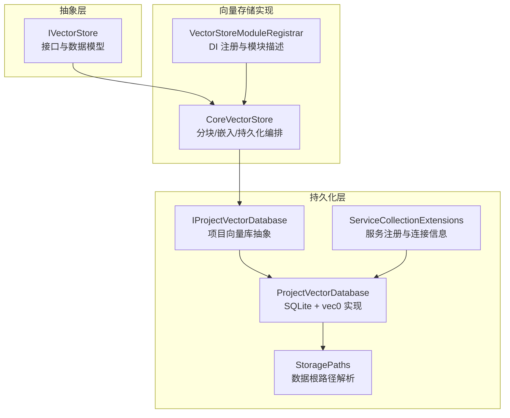
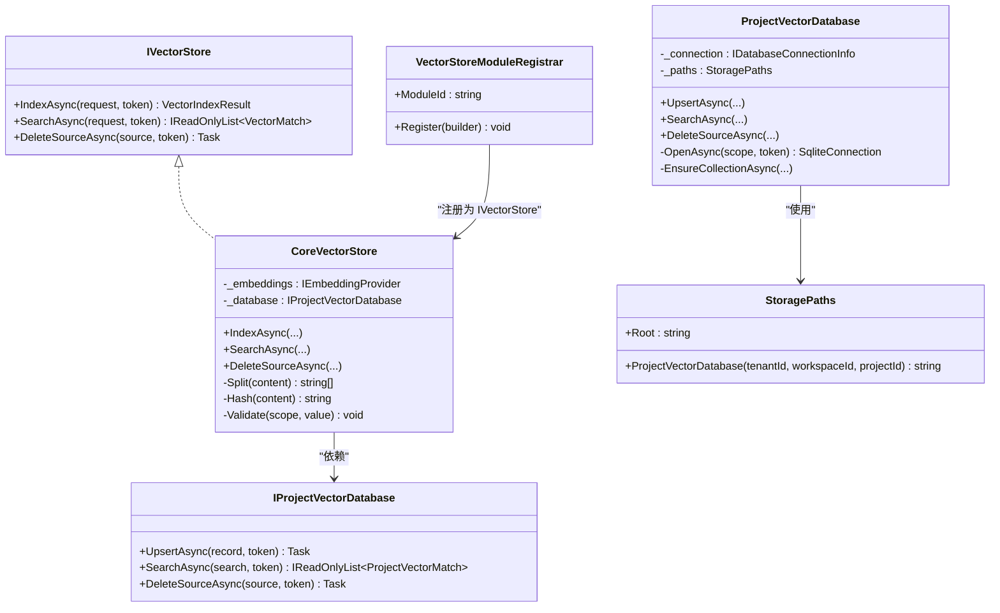
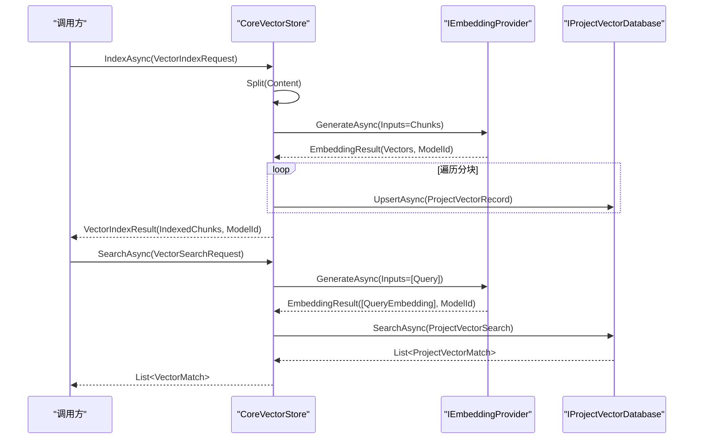
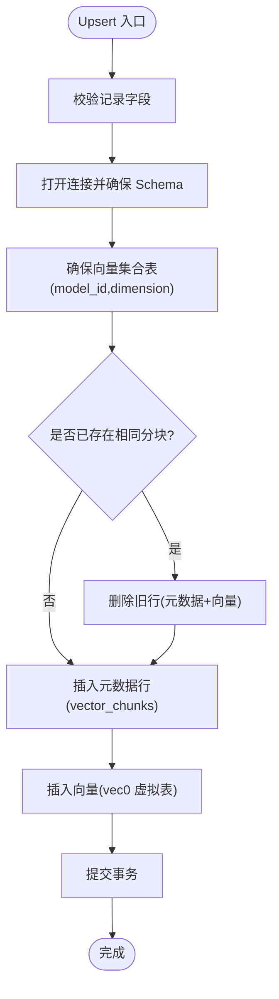
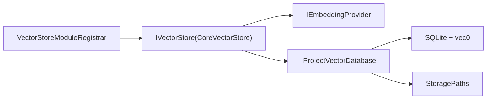

# 向量存储模块

<cite>
**本文引用的文件**
- [IVectorStore.cs](file://TinadecCore/Abstractions/Ports/IVectorStore.cs)
- [VectorStoreModuleRegistrar.cs](file://TinadecCore/VectorStore/VectorStoreModuleRegistrar.cs)
- [IProjectVectorDatabase.cs](file://TinadecCore/Persistence/IProjectVectorDatabase.cs)
- [ProjectVectorDatabase.cs](file://TinadecCore/Persistence/ProjectVectorDatabase.cs)
- [ServiceCollectionExtensions.cs](file://TinadecCore/Persistence/ServiceCollectionExtensions.cs)
- [StoragePaths.cs](file://TinadecCore/Persistence/StoragePaths.cs)
- [IModuleRegistrar.cs](file://TinadecCore/Abstractions/IModuleRegistrar.cs)
- [VectorStoreEndToEndTests.cs](file://TinadecCore/tests/TinadecCore.Api.Tests/VectorStoreEndToEndTests.cs)
- [VectorPersistenceTests.cs](file://TinadecCore/tests/TinadecCore.Api.Tests/VectorPersistenceTests.cs)
</cite>

## 目录
1. [简介](#简介)
2. [项目结构](#项目结构)
3. [核心组件](#核心组件)
4. [架构总览](#架构总览)
5. [详细组件分析](#详细组件分析)
6. [依赖关系分析](#依赖关系分析)
7. [性能与索引策略](#性能与索引策略)
8. [使用示例：语义搜索与知识检索](#使用示例语义搜索与知识检索)
9. [故障排查指南](#故障排查指南)
10. [结论](#结论)

## 简介
本模块提供面向项目的语义索引与检索能力，通过统一的 IVectorStore 抽象对外暴露“分块嵌入、相似度检索、按来源删除”等能力；内部由 CoreVectorStore 协调嵌入提供者与项目级向量数据库实现持久化。持久层基于 SQLite + vec0 扩展，按模型维度动态创建虚拟表，保证不同模型/维度的向量集合隔离与高效近似最近邻（ANN）查询。模块通过 VectorStoreModuleRegistrar 注册到 DI 容器，并声明依赖与能力，便于系统装配与自检。

## 项目结构
- 抽象接口与数据模型位于 Abstractions/Ports，定义 IVectorStore 及请求/响应对象。
- 向量存储实现位于 VectorStore 命名空间，包含模块注册器与核心实现 CoreVectorStore。
- 持久化抽象与 SQLite 实现位于 Persistence，包括 IProjectVectorDatabase、ProjectVectorDatabase、路径解析 StoragePaths 与服务注册扩展 ServiceCollectionExtensions。
- 测试覆盖端到端流程与持久化行为。

**图表来源**
- [IVectorStore.cs:1-59](file://TinadecCore/Abstractions/Ports/IVectorStore.cs#L1-L59)
- [VectorStoreModuleRegistrar.cs:1-105](file://TinadecCore/VectorStore/VectorStoreModuleRegistrar.cs#L1-L105)
- [IProjectVectorDatabase.cs:1-57](file://TinadecCore/Persistence/IProjectVectorDatabase.cs#L1-L57)
- [ProjectVectorDatabase.cs:1-174](file://TinadecCore/Persistence/ProjectVectorDatabase.cs#L1-L174)
- [StoragePaths.cs:1-64](file://TinadecCore/Persistence/StoragePaths.cs#L1-L64)
- [ServiceCollectionExtensions.cs:1-122](file://TinadecCore/Persistence/ServiceCollectionExtensions.cs#L1-L122)

**章节来源**
- [IVectorStore.cs:1-59](file://TinadecCore/Abstractions/Ports/IVectorStore.cs#L1-L59)
- [VectorStoreModuleRegistrar.cs:1-105](file://TinadecCore/VectorStore/VectorStoreModuleRegistrar.cs#L1-L105)
- [IProjectVectorDatabase.cs:1-57](file://TinadecCore/Persistence/IProjectVectorDatabase.cs#L1-L57)
- [ProjectVectorDatabase.cs:1-174](file://TinadecCore/Persistence/ProjectVectorDatabase.cs#L1-L174)
- [StoragePaths.cs:1-64](file://TinadecCore/Persistence/StoragePaths.cs#L1-L64)
- [ServiceCollectionExtensions.cs:1-122](file://TinadecCore/Persistence/ServiceCollectionExtensions.cs#L1-L122)

## 核心组件
- IVectorStore：定义 IndexAsync、SearchAsync、DeleteSourceAsync 三个核心方法，以及跨租户/工作区/项目的作用域对象与请求/结果模型。
- CoreVectorStore：实现 IVectorStore，负责文本分块、调用嵌入生成、校验返回向量一致性、写入 ProjectVectorDatabase，并将持久化匹配映射为上层 VectorMatch。
- IProjectVectorDatabase / ProjectVectorDatabase：项目级向量库抽象与 SQLite 实现，维护 vector_chunks 元数据表与按模型维度创建的 vec0 虚拟表，支持 Upsert、ANN 搜索、按来源删除。
- VectorStoreModuleRegistrar：将 IVectorStore 实现注册为单例，并声明模块 ID、版本、依赖与能力。
- StoragePaths：统一解析向量数据库文件路径，确保在 DataRoot 下安全定位。
- ServiceCollectionExtensions：集中注册持久化相关服务，包括 IProjectVectorDatabase、StoragePaths、IDatabaseConnectionInfo 等。

**章节来源**
- [IVectorStore.cs:1-59](file://TinadecCore/Abstractions/Ports/IVectorStore.cs#L1-L59)
- [VectorStoreModuleRegistrar.cs:1-105](file://TinadecCore/VectorStore/VectorStoreModuleRegistrar.cs#L1-L105)
- [IProjectVectorDatabase.cs:1-57](file://TinadecCore/Persistence/IProjectVectorDatabase.cs#L1-L57)
- [ProjectVectorDatabase.cs:1-174](file://TinadecCore/Persistence/ProjectVectorDatabase.cs#L1-L174)
- [StoragePaths.cs:1-64](file://TinadecCore/Persistence/StoragePaths.cs#L1-L64)
- [ServiceCollectionExtensions.cs:1-122](file://TinadecCore/Persistence/ServiceCollectionExtensions.cs#L1-L122)

## 架构总览
向量存储模块采用“接口抽象 + 具体实现 + 持久化抽象”的分层设计。上层仅依赖 IVectorStore，不感知底层嵌入与数据库细节；CoreVectorStore 作为编排者，串联嵌入提供者与项目向量库；持久化层以 IProjectVectorDatabase 屏蔽具体数据库差异（当前实现为 SQLite + vec0）。

**图表来源**
- [IVectorStore.cs:1-59](file://TinadecCore/Abstractions/Ports/IVectorStore.cs#L1-L59)
- [VectorStoreModuleRegistrar.cs:1-105](file://TinadecCore/VectorStore/VectorStoreModuleRegistrar.cs#L1-L105)
- [IProjectVectorDatabase.cs:1-57](file://TinadecCore/Persistence/IProjectVectorDatabase.cs#L1-L57)
- [ProjectVectorDatabase.cs:1-174](file://TinadecCore/Persistence/ProjectVectorDatabase.cs#L1-L174)
- [StoragePaths.cs:1-64](file://TinadecCore/Persistence/StoragePaths.cs#L1-L64)

## 详细组件分析

### IVectorStore 接口与数据模型
- 作用域模型：VectorProjectScope 提供 TenantId、WorkspaceId、ProjectId 的通用作用域。
- 源引用：VectorSourceReference 扩展 Namespace、SourceType、SourceId，用于标识数据来源。
- 索引请求：VectorIndexRequest 包含 SourceRevision、Content、Metadata。
- 搜索请求：VectorSearchRequest 包含 Query、Limit、MinimumScore、SourceTypes。
- 结果模型：VectorIndexResult 报告已索引分块数与使用的模型 ID；VectorMatch 返回匹配的片段内容与相似度分数。

**章节来源**
- [IVectorStore.cs:1-59](file://TinadecCore/Abstractions/Ports/IVectorStore.cs#L1-L59)

### CoreVectorStore：分块、嵌入与持久化编排
- 分块策略：固定长度切分（ChunkLength=1600），简单稳定，适合长文本快速入库。
- 嵌入生成：调用 IEmbeddingProvider.GenerateAsync，传入租户/工作区/项目作用域与输入文本，要求返回一致维度与数量。
- 持久化：对每个分块计算内容哈希，构造 ProjectVectorRecord 并通过 IProjectVectorDatabase.UpsertAsync 写入。
- 搜索流程：对查询文本生成嵌入，调用 IProjectVectorDatabase.SearchAsync，过滤后映射为 VectorMatch。
- 删除来源：根据 Namespace/SourceType/SourceId 删除对应来源的所有分块。

**图表来源**
- [VectorStoreModuleRegistrar.cs:29-104](file://TinadecCore/VectorStore/VectorStoreModuleRegistrar.cs#L29-L104)

**章节来源**
- [VectorStoreModuleRegistrar.cs:29-104](file://TinadecCore/VectorStore/VectorStoreModuleRegistrar.cs#L29-L104)

### IProjectVectorDatabase 与 ProjectVectorDatabase：SQLite + vec0 实现
- 数据结构：
  - vector_chunks：存储分块的元数据（名称空间、来源类型/ID、修订号、分块索引、内容哈希、内容、模型 ID、元数据 JSON、创建时间）。
  - vector_collections：记录模型 ID 与维度，用于约束与隔离。
  - 按模型维度动态创建 vec0 虚拟表（如 vec_<hash>_<dim>），存储 embedding 向量。
- Upsert 流程：先检查是否存在相同主键（namespace+source_type+source_id+source_revision+chunk_index+model_id），若存在则删除旧行再插入新行，随后写入向量表。
- 搜索流程：使用 vec0 MATCH 进行 ANN 查询，限制 k = Limit*4 并做二次过滤（SourceTypes、MinimumScore），最终返回 Top Limit 结果。
- 删除来源：查找该来源所有分块，按模型维度删除对应的向量表行与元数据行。
- 连接与初始化：打开 SQLite 连接，启用 vec0 扩展，确保 schema 存在。

**图表来源**
- [ProjectVectorDatabase.cs:20-60](file://TinadecCore/Persistence/ProjectVectorDatabase.cs#L20-L60)
- [ProjectVectorDatabase.cs:124-141](file://TinadecCore/Persistence/ProjectVectorDatabase.cs#L124-L141)

**章节来源**
- [IProjectVectorDatabase.cs:1-57](file://TinadecCore/Persistence/IProjectVectorDatabase.cs#L1-L57)
- [ProjectVectorDatabase.cs:1-174](file://TinadecCore/Persistence/ProjectVectorDatabase.cs#L1-L174)

### VectorStoreModuleRegistrar：模块注册与能力声明
- 将 IVectorStore 实现 CoreVectorStore 注册为单例。
- 声明模块 ID、版本、依赖（abstractions、persistence）、能力（semantic_indexing、embedding_generation、project_scoped_retrieval）。
- 遵循 IModuleRegistrar 约定，显式注册，无反射扫描。

**章节来源**
- [VectorStoreModuleRegistrar.cs:1-27](file://TinadecCore/VectorStore/VectorStoreModuleRegistrar.cs#L1-L27)
- [IModuleRegistrar.cs:1-17](file://TinadecCore/Abstractions/IModuleRegistrar.cs#L1-L17)

### 持久化服务装配与路径管理
- ServiceCollectionExtensions.AddTinadecPersistence：注册 IDatabaseConnectionInfo、ITinadecDatabaseConfigurer、IDatabaseReadiness、StoragePaths、IProjectVectorDatabase、ISecretStore、IStorageMigrationRunner 等。
- StoragePaths.ProjectVectorDatabase：按 tenants/{tenantId}/{workspaceId或tenant}/{projectId}.db 组织向量数据库文件，确保在 DataRoot 下安全访问。

**章节来源**
- [ServiceCollectionExtensions.cs:1-122](file://TinadecCore/Persistence/ServiceCollectionExtensions.cs#L1-L122)
- [StoragePaths.cs:1-64](file://TinadecCore/Persistence/StoragePaths.cs#L1-L64)

## 依赖关系分析
- CoreVectorStore 依赖 IEmbeddingProvider（外部嵌入服务）与 IProjectVectorDatabase（持久化抽象）。
- ProjectVectorDatabase 依赖 IDatabaseConnectionInfo 与 StoragePaths，当前仅支持 SQLite Provider。
- 模块注册器依赖 Abstractions 与 Persistence 模块，声明能力以便上层发现。

**图表来源**
- [VectorStoreModuleRegistrar.cs:1-105](file://TinadecCore/VectorStore/VectorStoreModuleRegistrar.cs#L1-L105)
- [ProjectVectorDatabase.cs:1-174](file://TinadecCore/Persistence/ProjectVectorDatabase.cs#L1-L174)

**章节来源**
- [VectorStoreModuleRegistrar.cs:1-105](file://TinadecCore/VectorStore/VectorStoreModuleRegistrar.cs#L1-L105)
- [ProjectVectorDatabase.cs:1-174](file://TinadecCore/Persistence/ProjectVectorDatabase.cs#L1-L174)

## 性能与索引策略
- 分块策略：固定长度 1600 字符，简单高效，避免复杂边界处理；可根据业务调整 ChunkLength 以平衡召回与延迟。
- 嵌入维度与模型隔离：vector_collections 记录 model_id 与 dimension，不同模型/维度使用独立 vec0 虚拟表，避免维度冲突与误查。
- 搜索优化：
  - 使用 vec0 MATCH 进行 ANN 查询，k 设置为 Limit*4 以提升召回后再二次过滤。
  - 支持 MinimumScore 与 SourceTypes 过滤，减少不必要的数据回传。
- 写入优化：Upsert 前检测重复分块，避免冗余写入；事务包裹元数据与向量写入，保证一致性。
- 存储布局：按租户/工作区/项目组织数据库文件，利于隔离与备份恢复。

[本节为通用指导，不直接分析具体文件]

## 使用示例：语义搜索与知识检索
以下示例展示如何从注入的 IVectorStore 进行索引、搜索与删除，覆盖端到端流程与跨项目隔离。

- 索引与搜索
  - 调用 IndexAsync 传入租户/工作区/项目作用域、名称空间、来源类型/ID、修订号与内容。
  - 调用 SearchAsync 传入查询文本、限制条数与可选的最小分数/来源类型过滤。
- 删除来源
  - 调用 DeleteSourceAsync 指定名称空间、来源类型/ID，删除该来源全部分块。
- 跨项目隔离
  - 在不同 ProjectId 下索引与搜索互不可见，确保多项目数据隔离。

参考测试用例中的用法与断言，可快速搭建语义记忆、文档片段检索等场景。

**章节来源**
- [VectorStoreEndToEndTests.cs:31-97](file://TinadecCore/tests/TinadecCore.Api.Tests/VectorStoreEndToEndTests.cs#L31-L97)
- [VectorPersistenceTests.cs:29-65](file://TinadecCore/tests/TinadecCore.Api.Tests/VectorPersistenceTests.cs#L29-L65)

## 故障排查指南
- 未配置嵌入模型或维度不一致
  - 现象：抛出“未配置嵌入模型”或“嵌入返回不一致向量”异常。
  - 排查：确认 IEmbeddingProvider 可用且返回的 Vectors 数量与 Dimension 一致。
- 参数校验失败
  - 现象：缺少租户/项目 ID、名称空间、来源类型/ID、内容或嵌入为空时抛出参数异常。
  - 排查：检查请求对象必填字段与值有效性。
- 不支持的数据库提供者
  - 现象：非 SQLite 提供者会抛出“不支持”异常。
  - 排查：确认当前 Provider 为 SQLite；PostgreSQL 尚未实现。
- 路径越界
  - 现象：StoragePaths 检测到路径逃逸 DataRoot 时报错。
  - 排查：确保 DataRoot 配置正确，且不拼接非法路径段。

**章节来源**
- [VectorStoreModuleRegistrar.cs:49-51](file://TinadecCore/VectorStore/VectorStoreModuleRegistrar.cs#L49-L51)
- [ProjectVectorDatabase.cs:111-111](file://TinadecCore/Persistence/ProjectVectorDatabase.cs#L111-L111)
- [ProjectVectorDatabase.cs:169-172](file://TinadecCore/Persistence/ProjectVectorDatabase.cs#L169-L172)
- [StoragePaths.cs:43-53](file://TinadecCore/Persistence/StoragePaths.cs#L43-L53)

## 结论
VectorStore 模块通过清晰的抽象与分层设计，实现了项目级语义索引与检索能力。CoreVectorStore 将分块、嵌入与持久化解耦，IProjectVectorDatabase 屏蔽了底层存储差异，SQLite + vec0 提供了轻量高效的 ANN 支持。配合模块注册器与路径管理，整体具备良好可扩展性与可观测性。建议在生产环境中结合业务需求调优分块大小、搜索 k 值与最小分数阈值，以获得更佳的召回与延迟平衡。