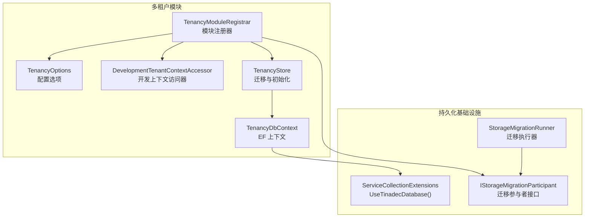
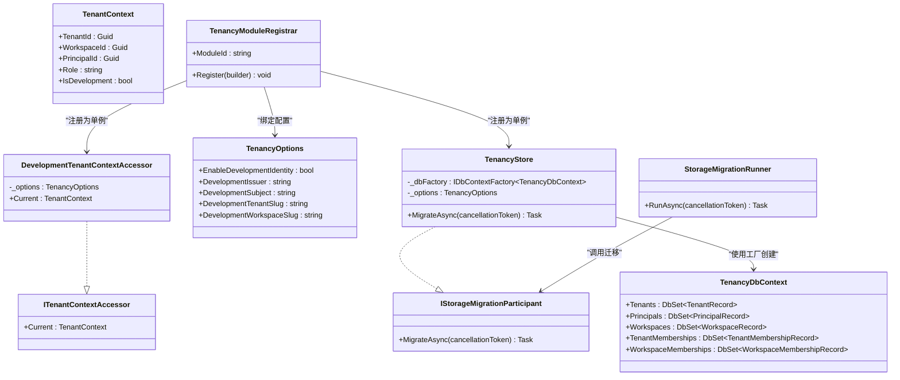
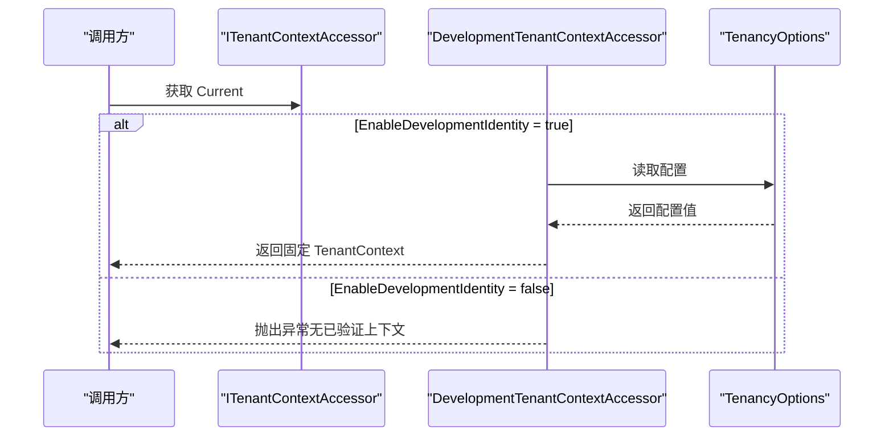
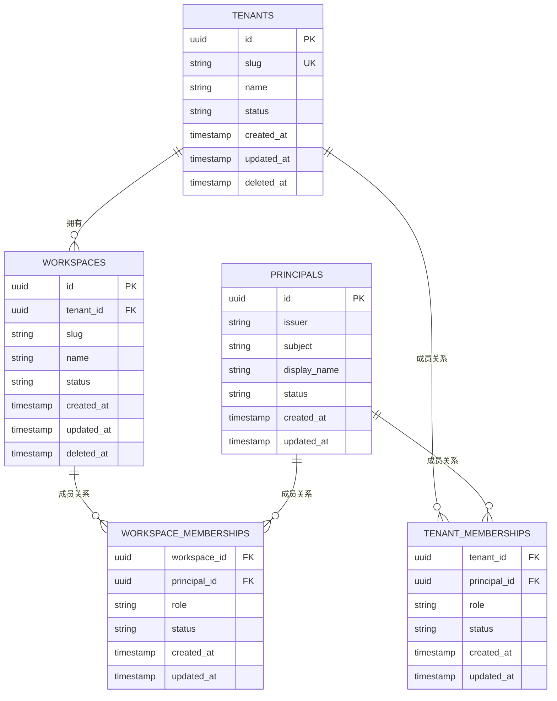
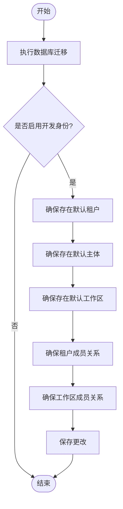
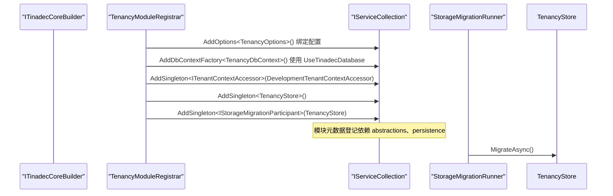
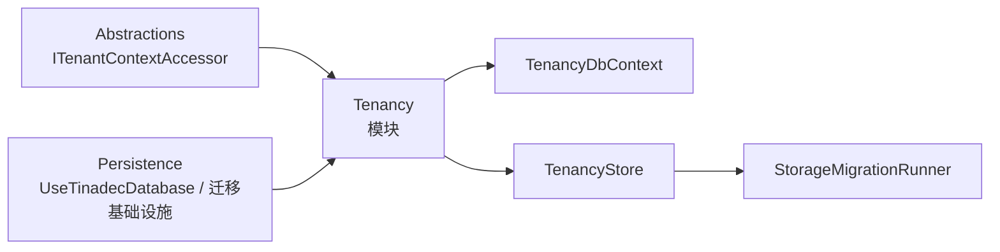

# 多租户支持模块

<cite>
**本文引用的文件**   
- [TenancyStore.cs](file://TinadecCore/Tenancy/TenancyStore.cs)
- [TenancyOptions.cs](file://TinadecCore/Tenancy/TenancyOptions.cs)
- [DevelopmentTenantContextAccessor.cs](file://TinadecCore/Tenancy/DevelopmentTenantContextAccessor.cs)
- [TenancyModuleRegistrar.cs](file://TinadecCore/Tenancy/TenancyModuleRegistrar.cs)
- [TenancyDbContext.cs](file://TinadecCore/Tenancy/TenancyDbContext.cs)
- [ITenantContextAccessor.cs](file://TinadecCore/Abstractions/Ports/ITenantContextAccessor.cs)
- [IModuleRegistrar.cs](file://TinadecCore/Abstractions/IModuleRegistrar.cs)
- [ServiceCollectionExtensions.cs](file://TinadecCore/Persistence/ServiceCollectionExtensions.cs)
- [StorageMigration.cs](file://TinadecCore/Persistence/StorageMigration.cs)
</cite>

## 目录
1. [简介](#简介)
2. [项目结构](#项目结构)
3. [核心组件](#核心组件)
4. [架构总览](#架构总览)
5. [详细组件分析](#详细组件分析)
6. [依赖关系分析](#依赖关系分析)
7. [性能考量](#性能考量)
8. [故障排查指南](#故障排查指南)
9. [结论](#结论)
10. [附录：使用示例与最佳实践](#附录使用示例与最佳实践)

## 简介
本模块为系统提供多租户能力，包括租户、工作区、主体（用户/服务）及其成员关系的持久化存储，开发环境下的默认上下文注入，以及通过模块注册器与核心框架的集成。其设计目标是在不侵入业务代码的前提下，为各模块提供统一的“当前租户上下文”获取方式，并在启动时完成必要的数据库迁移与初始化数据准备。

## 项目结构
多租户相关代码集中在 TinadecCore/Tenancy 目录下，并通过 TenancyModuleRegistrar 将服务注册到 DI 容器；数据模型与 EF Core 上下文定义在 TenancyDbContext 中；开发环境上下文由 DevelopmentTenantContextAccessor 提供；配置项由 TenancyOptions 管理；迁移参与方由 TenancyStore 实现 IStorageMigrationParticipant。

图表来源
- [TenancyModuleRegistrar.cs:10-36](file://TinadecCore/Tenancy/TenancyModuleRegistrar.cs#L10-L36)
- [TenancyOptions.cs:1-12](file://TinadecCore/Tenancy/TenancyOptions.cs#L1-L12)
- [DevelopmentTenantContextAccessor.cs:1-19](file://TinadecCore/Tenancy/DevelopmentTenantContextAccessor.cs#L1-L19)
- [TenancyStore.cs:1-48](file://TinadecCore/Tenancy/TenancyStore.cs#L1-L48)
- [TenancyDbContext.cs:1-59](file://TinadecCore/Tenancy/TenancyDbContext.cs#L1-L59)
- [ServiceCollectionExtensions.cs:54-62](file://TinadecCore/Persistence/ServiceCollectionExtensions.cs#L54-L62)
- [StorageMigration.cs:1-41](file://TinadecCore/Persistence/StorageMigration.cs#L1-L41)

章节来源
- [TenancyModuleRegistrar.cs:10-36](file://TinadecCore/Tenancy/TenancyModuleRegistrar.cs#L10-L36)
- [TenancyOptions.cs:1-12](file://TinadecCore/Tenancy/TenancyOptions.cs#L1-L12)
- [DevelopmentTenantContextAccessor.cs:1-19](file://TinadecCore/Tenancy/DevelopmentTenantContextAccessor.cs#L1-L19)
- [TenancyStore.cs:1-48](file://TinadecCore/Tenancy/TenancyStore.cs#L1-L48)
- [TenancyDbContext.cs:1-59](file://TinadecCore/Tenancy/TenancyDbContext.cs#L1-L59)
- [ServiceCollectionExtensions.cs:54-62](file://TinadecCore/Persistence/ServiceCollectionExtensions.cs#L54-L62)
- [StorageMigration.cs:1-41](file://TinadecCore/Persistence/StorageMigration.cs#L1-L41)

## 核心组件
- ITenantContextAccessor 与 TenantContext：定义“当前租户上下文”的抽象与数据结构，包含租户、工作区、主体标识、角色及是否开发环境的标记。
- DevelopmentTenantContextAccessor：在开发环境下返回固定的租户/工作区/主体上下文，便于本地调试；当禁用开发身份时会抛出异常，提示需配置已认证的上下文访问器。
- TenancyOptions：承载多租户相关配置，如是否启用开发身份、开发环境的发行者、主题、租户与工作区的 slug 等。
- TenancyDbContext：EF Core 上下文，映射 tenants、principals、tenant_memberships、workspaces、workspace_memberships 五张表，并定义唯一索引与字段约束。
- TenancyStore：实现 IStorageMigrationParticipant，负责运行数据库迁移以及在开发模式下插入初始记录（租户、主体、工作区、成员关系）。
- TenancyModuleRegistrar：模块注册器，绑定配置、注册 DbContextFactory、上下文访问器、存储迁移参与者，并声明模块元数据与依赖。

章节来源
- [ITenantContextAccessor.cs:1-15](file://TinadecCore/Abstractions/Ports/ITenantContextAccessor.cs#L1-L15)
- [DevelopmentTenantContextAccessor.cs:1-19](file://TinadecCore/Tenancy/DevelopmentTenantContextAccessor.cs#L1-L19)
- [TenancyOptions.cs:1-12](file://TinadecCore/Tenancy/TenancyOptions.cs#L1-L12)
- [TenancyDbContext.cs:1-59](file://TinadecCore/Tenancy/TenancyDbContext.cs#L1-L59)
- [TenancyStore.cs:1-48](file://TinadecCore/Tenancy/TenancyStore.cs#L1-L48)
- [TenancyModuleRegistrar.cs:10-36](file://TinadecCore/Tenancy/TenancyModuleRegistrar.cs#L10-L36)

## 架构总览
多租户模块通过模块注册器接入核心框架，使用统一的数据库提供者抽象进行连接与迁移，同时暴露租户上下文访问器供其他模块消费。

图表来源
- [ITenantContextAccessor.cs:1-15](file://TinadecCore/Abstractions/Ports/ITenantContextAccessor.cs#L1-L15)
- [DevelopmentTenantContextAccessor.cs:1-19](file://TinadecCore/Tenancy/DevelopmentTenantContextAccessor.cs#L1-L19)
- [TenancyOptions.cs:1-12](file://TinadecCore/Tenancy/TenancyOptions.cs#L1-L12)
- [TenancyDbContext.cs:1-59](file://TinadecCore/Tenancy/TenancyDbContext.cs#L1-L59)
- [TenancyStore.cs:1-48](file://TinadecCore/Tenancy/TenancyStore.cs#L1-L48)
- [TenancyModuleRegistrar.cs:10-36](file://TinadecCore/Tenancy/TenancyModuleRegistrar.cs#L10-L36)
- [StorageMigration.cs:1-41](file://TinadecCore/Persistence/StorageMigration.cs#L1-L41)

## 详细组件分析

### 租户上下文切换机制（ITenantContextAccessor）
- 设计要点：通过单一 Current 属性暴露当前请求的租户、工作区、主体与角色，所有需要租户感知的服务仅依赖该接口，避免硬编码或全局状态。
- 开发模式：DevelopmentTenantContextAccessor 根据 TenancyOptions.EnableDevelopmentIdentity 决定返回固定上下文或抛出异常，确保开发环境与生产环境行为一致且可配置。
- 扩展点：在生产环境中替换为基于认证上下文的实现（例如从 HTTP 请求头或令牌解析），即可无缝切换上下文来源。

图表来源
- [ITenantContextAccessor.cs:1-15](file://TinadecCore/Abstractions/Ports/ITenantContextAccessor.cs#L1-L15)
- [DevelopmentTenantContextAccessor.cs:1-19](file://TinadecCore/Tenancy/DevelopmentTenantContextAccessor.cs#L1-L19)
- [TenancyOptions.cs:1-12](file://TinadecCore/Tenancy/TenancyOptions.cs#L1-L12)

章节来源
- [ITenantContextAccessor.cs:1-15](file://TinadecCore/Abstractions/Ports/ITenantContextAccessor.cs#L1-L15)
- [DevelopmentTenantContextAccessor.cs:1-19](file://TinadecCore/Tenancy/DevelopmentTenantContextAccessor.cs#L1-L19)
- [TenancyOptions.cs:1-12](file://TinadecCore/Tenancy/TenancyOptions.cs#L1-L12)

### 数据存储与模型（TenancyDbContext）
- 实体与表：
  - tenants：租户（id, slug, name, status, created_at, updated_at, deleted_at），slug 唯一索引。
  - principals：主体（issuer, subject 组合唯一索引）。
  - tenant_memberships：租户-主体成员关系（复合主键 tenant_id, principal_id）。
  - workspaces：工作区（tenant_id, slug 组合唯一索引）。
  - workspace_memberships：工作区-主体成员关系（复合主键 workspace_id, principal_id）。
- 设计意图：通过明确的关联表实现灵活的权限与范围控制，支持租户内多个工作区及主体在多范围内的角色分配。

图表来源
- [TenancyDbContext.cs:15-51](file://TinadecCore/Tenancy/TenancyDbContext.cs#L15-L51)

章节来源
- [TenancyDbContext.cs:1-59](file://TinadecCore/Tenancy/TenancyDbContext.cs#L1-L59)

### 迁移与初始化（TenancyStore）
- 职责：
  - 执行数据库迁移（Ensure schema up-to-date）。
  - 在开发模式下检查并插入默认租户、主体、工作区及成员关系，保证本地开发无需手动初始化。
- 关键流程：
  - 使用 IDbContextFactory<TenancyDbContext> 创建上下文。
  - 调用 Database.MigrateAsync。
  - 根据 TenancyOptions.EnableDevelopmentIdentity 决定是否写入初始数据。
  - 使用 DevelopmentTenantContextAccessor 提供的固定 ID 作为默认记录标识。

图表来源
- [TenancyStore.cs:18-46](file://TinadecCore/Tenancy/TenancyStore.cs#L18-L46)
- [DevelopmentTenantContextAccessor.cs:8-10](file://TinadecCore/Tenancy/DevelopmentTenantContextAccessor.cs#L8-L10)
- [TenancyOptions.cs:6-11](file://TinadecCore/Tenancy/TenancyOptions.cs#L6-L11)

章节来源
- [TenancyStore.cs:1-48](file://TinadecCore/Tenancy/TenancyStore.cs#L1-L48)

### 模块注册与集成（TenancyModuleRegistrar）
- 功能：
  - 绑定 TenancyOptions 到配置节。
  - 注册 TenancyDbContext 的工厂，并使用 UseTinadecDatabase 统一数据库提供者。
  - 注册 DevelopmentTenantContextAccessor 为 ITenantContextAccessor 的单例。
  - 注册 TenancyStore 为 IStorageMigrationParticipant，以便迁移执行器调用。
  - 声明模块元数据（ID、版本、依赖、能力）。
- 依赖：abstractions、persistence。

图表来源
- [TenancyModuleRegistrar.cs:14-36](file://TinadecCore/Tenancy/TenancyModuleRegistrar.cs#L14-L36)
- [ServiceCollectionExtensions.cs:54-62](file://TinadecCore/Persistence/ServiceCollectionExtensions.cs#L54-L62)
- [StorageMigration.cs:27-39](file://TinadecCore/Persistence/StorageMigration.cs#L27-L39)

章节来源
- [TenancyModuleRegistrar.cs:10-36](file://TinadecCore/Tenancy/TenancyModuleRegistrar.cs#L10-L36)
- [IModuleRegistrar.cs:1-17](file://TinadecCore/Abstractions/IModuleRegistrar.cs#L1-L17)
- [ServiceCollectionExtensions.cs:54-62](file://TinadecCore/Persistence/ServiceCollectionExtensions.cs#L54-L62)
- [StorageMigration.cs:1-41](file://TinadecCore/Persistence/StorageMigration.cs#L1-L41)

## 依赖关系分析
- 模块间依赖：
  - tenancy 依赖 abstractions（接口定义）、persistence（数据库抽象与迁移基础设施）。
- 运行时依赖：
  - ITenantContextAccessor 被任何需要租户信息的组件依赖。
  - TenancyStore 依赖 IDbContextFactory<TenancyDbContext> 与 TenancyOptions。
  - TenancyDbContext 依赖 UseTinadecDatabase 以选择具体数据库驱动。
- 迁移编排：
  - StorageMigrationRunner 遍历所有 IStorageMigrationParticipant 并依次调用 MigrateAsync。

图表来源
- [TenancyModuleRegistrar.cs:27-35](file://TinadecCore/Tenancy/TenancyModuleRegistrar.cs#L27-L35)
- [ServiceCollectionExtensions.cs:54-62](file://TinadecCore/Persistence/ServiceCollectionExtensions.cs#L54-L62)
- [StorageMigration.cs:14-41](file://TinadecCore/Persistence/StorageMigration.cs#L14-L41)

章节来源
- [TenancyModuleRegistrar.cs:10-36](file://TinadecCore/Tenancy/TenancyModuleRegistrar.cs#L10-L36)
- [StorageMigration.cs:1-41](file://TinadecCore/Persistence/StorageMigration.cs#L1-L41)

## 性能考量
- 上下文访问：ITenantContextAccessor 为单例，访问开销极低，适合高频调用。
- 数据库访问：TenancyStore 仅在启动阶段执行迁移与初始化，正常请求路径不直接访问数据库。
- EF Core 配置：忽略部分警告以减少日志噪音；按需使用 IDbContextFactory 避免长生命周期上下文带来的线程安全问题。
- 建议：
  - 在生产环境替换 DevelopmentTenantContextAccessor 为基于认证上下文的实现，避免不必要的常量 GUID 查询。
  - 对高频查询增加合适的索引（如按 tenant_id、principal_id 的常用过滤条件）。

[本节为通用指导，不直接分析具体文件]

## 故障排查指南
- 启动后无法获取租户上下文：
  - 检查 TenancyOptions.EnableDevelopmentIdentity 是否为 false，若为 false 且未提供已认证的 ITenantContextAccessor 实现，DevelopmentTenantContextAccessor.Current 会抛出异常。
- 迁移未执行或失败：
  - 确认 StorageMigrationRunner.RunAsync 是否被调用（取决于 persistence 配置中的 Provider 与 ApplyMigrationsOnStartup）。
  - 查看 UseTinadecDatabase 是否正确配置了数据库提供者与连接字符串。
- 开发环境缺少默认数据：
  - 确认 TenancyStore.MigrateAsync 是否执行成功，并检查数据库中是否存在 tenants、principals、workspaces 及成员关系记录。

章节来源
- [DevelopmentTenantContextAccessor.cs:15-18](file://TinadecCore/Tenancy/DevelopmentTenantContextAccessor.cs#L15-L18)
- [StorageMigration.cs:27-39](file://TinadecCore/Persistence/StorageMigration.cs#L27-L39)
- [ServiceCollectionExtensions.cs:54-62](file://TinadecCore/Persistence/ServiceCollectionExtensions.cs#L54-L62)
- [TenancyStore.cs:18-46](file://TinadecCore/Tenancy/TenancyStore.cs#L18-L46)

## 结论
多租户模块通过清晰的接口与配置，实现了租户隔离、上下文切换与开发环境友好支持。借助模块注册器与持久化基础设施，模块能够以最小侵入的方式融入核心框架，并为上层业务提供一致的租户感知能力。

[本节为总结性内容，不直接分析具体文件]

## 附录：使用示例与最佳实践
- 在其他模块中获取当前租户上下文：
  - 通过依赖注入 ITenantContextAccessor，调用 Current 获取 TenantContext，从而限定数据访问范围。
- 实现生产环境的租户上下文：
  - 自定义实现 ITenantContextAccessor，从 HTTP 请求头或令牌解析出租户、工作区、主体与角色，并注册为单例覆盖 DevelopmentTenantContextAccessor。
- 配置多租户选项：
  - 在配置文件中设置 TinadecIdentity 节，控制 EnableDevelopmentIdentity、DevelopmentIssuer、DevelopmentSubject、DevelopmentTenantSlug、DevelopmentWorkspaceSlug。
- 数据隔离策略：
  - 所有涉及数据的查询都应带上 TenantId、WorkspaceId 过滤条件；必要时在数据库层建立相应索引以提升性能。
- 迁移与初始化：
  - 确保 StorageMigrationRunner 在应用启动时被调用；如需跳过自动迁移，调整 persistence 配置。

章节来源
- [ITenantContextAccessor.cs:1-15](file://TinadecCore/Abstractions/Ports/ITenantContextAccessor.cs#L1-L15)
- [TenancyOptions.cs:1-12](file://TinadecCore/Tenancy/TenancyOptions.cs#L1-L12)
- [TenancyModuleRegistrar.cs:14-36](file://TinadecCore/Tenancy/TenancyModuleRegistrar.cs#L14-L36)
- [StorageMigration.cs:27-39](file://TinadecCore/Persistence/StorageMigration.cs#L27-L39)