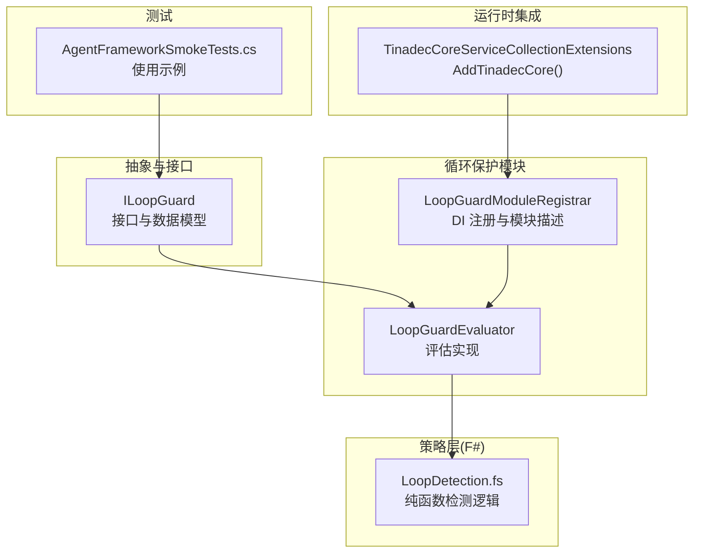
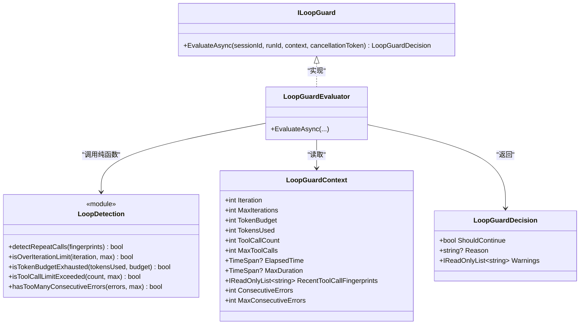
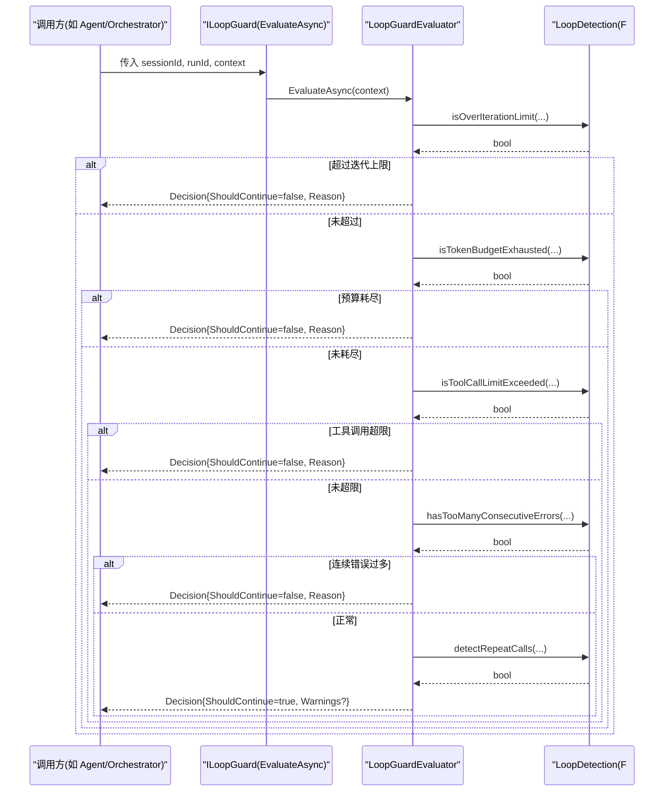
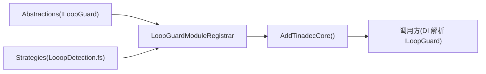
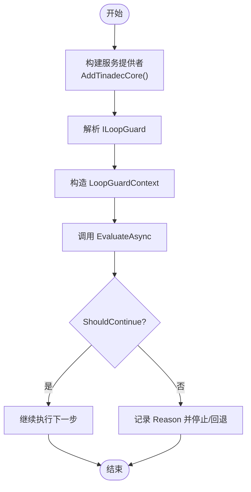

# 循环保护模块

<cite>
**本文引用的文件**
- [ILoopGuard.cs](file://TinadecCore/Abstractions/Ports/ILoopGuard.cs)
- [LoopGuardModuleRegistrar.cs](file://TinadecCore/LoopGuard/LoopGuardModuleRegistrar.cs)
- [LoopDetection.fs](file://TinadecCore/Strategies/LoopDetection.fs)
- [AgentFrameworkSmokeTests.cs](file://TinadecCore/tests/TinadecCore.AgentFramework.Tests/AgentFrameworkSmokeTests.cs)
- [TinadecCoreServiceCollectionExtensions.cs](file://TinadecCore/Runtime/TinadecCoreServiceCollectionExtensions.cs)
</cite>

## 目录
1. [简介](#简介)
2. [项目结构](#项目结构)
3. [核心组件](#核心组件)
4. [架构总览](#架构总览)
5. [详细组件分析](#详细组件分析)
6. [依赖关系分析](#依赖关系分析)
7. [性能考量](#性能考量)
8. [故障排查指南](#故障排查指南)
9. [结论](#结论)
10. [附录：配置与使用示例](#附录配置与使用示例)

## 简介
本文件为 LoopGuard 循环保护模块的详细技术文档。该模块在 Agent 执行过程中提供“循环检测 + 预算控制”能力，通过 ILoopGuard 接口对外暴露评估服务，结合 F# 纯函数策略实现无副作用的重复调用指纹检测、迭代上限、Token 预算、工具调用次数与连续错误等阈值判断，并在必要时给出警告或终止决策。模块以 DI 模块形式注册，便于在宿主应用启动时统一装配。

## 项目结构
围绕 LoopGuard 的核心代码分布在以下位置：
- 抽象端口定义：ILoopGuard 接口与上下文/决策模型
- 模块注册器：将 ILoopGuard 实现注入到 DI 容器，并声明模块元数据
- 策略层（F#）：纯函数实现循环检测与阈值判断
- 运行时集成：通过 TinadecCoreServiceCollectionExtensions 统一注册各模块
- 测试用例：展示如何构造上下文并调用评估接口

图表来源
- [ILoopGuard.cs:1-38](file://TinadecCore/Abstractions/Ports/ILoopGuard.cs#L1-L38)
- [LoopGuardModuleRegistrar.cs:1-83](file://TinadecCore/LoopGuard/LoopGuardModuleRegistrar.cs#L1-L83)
- [LoopDetection.fs:1-46](file://TinadecCore/Strategies/LoopDetection.fs#L1-L46)
- [TinadecCoreServiceCollectionExtensions.cs:1-61](file://TinadecCore/Runtime/TinadecCoreServiceCollectionExtensions.cs#L1-L61)
- [AgentFrameworkSmokeTests.cs:85-131](file://TinadecCore/tests/TinadecCore.AgentFramework.Tests/AgentFrameworkSmokeTests.cs#L85-L131)

章节来源
- [ILoopGuard.cs:1-38](file://TinadecCore/Abstractions/Ports/ILoopGuard.cs#L1-L38)
- [LoopGuardModuleRegistrar.cs:1-83](file://TinadecCore/LoopGuard/LoopGuardModuleRegistrar.cs#L1-L83)
- [LoopDetection.fs:1-46](file://TinadecCore/Strategies/LoopDetection.fs#L1-L46)
- [TinadecCoreServiceCollectionExtensions.cs:1-61](file://TinadecCore/Runtime/TinadecCoreServiceCollectionExtensions.cs#L1-L61)
- [AgentFrameworkSmokeTests.cs:85-131](file://TinadecCore/tests/TinadecCore.AgentFramework.Tests/AgentFrameworkSmokeTests.cs#L85-L131)

## 核心组件
- ILoopGuard 接口与数据模型
  - EvaluateAsync(sessionId, runId, context, cancellationToken)：基于当前会话与运行上下文进行循环与预算评估，返回是否继续及原因/警告。
  - LoopGuardContext：承载迭代计数、Token 预算与已用、工具调用计数、最大工具调用、耗时、最近工具调用指纹、连续错误数等。
  - LoopGuardDecision：包含 ShouldContinue、Reason、Warnings。
- LoopGuardModuleRegistrar
  - 将 ILoopGuard 实现（LoopGuardEvaluator）注册为单例；声明模块 ID、版本、依赖、能力集与 MAF 原语。
- LoopGuardEvaluator
  - 按优先级顺序调用 F# 策略函数进行硬限制检查（迭代上限、Token 预算、工具调用上限、连续错误），若未触发则收集重复调用指纹告警。
- LoopDetection（F#）
  - detectRepeatCalls：对最近指纹序列做尾部连续重复检测（≥3 次即认为重复）。
  - isOverIterationLimit / isTokenBudgetExhausted / isToolCallLimitExceeded / hasTooManyConsecutiveErrors：纯函数阈值判断。

章节来源
- [ILoopGuard.cs:1-38](file://TinadecCore/Abstractions/Ports/ILoopGuard.cs#L1-L38)
- [LoopGuardModuleRegistrar.cs:1-83](file://TinadecCore/LoopGuard/LoopGuardModuleRegistrar.cs#L1-L83)
- [LoopDetection.fs:1-46](file://TinadecCore/Strategies/LoopDetection.fs#L1-L46)

## 架构总览
LoopGuard 采用“接口 + 策略函数”的分层设计：C# 侧负责编排与边界条件处理，F# 侧提供无副作用的检测算法。模块通过 AddTinadecCore 统一注册，被上层 Orchestrator/Agent 在执行循环中按需调用。

图表来源
- [ILoopGuard.cs:1-38](file://TinadecCore/Abstractions/Ports/ILoopGuard.cs#L1-L38)
- [LoopGuardModuleRegistrar.cs:35-82](file://TinadecCore/LoopGuard/LoopGuardModuleRegistrar.cs#L35-L82)
- [LoopDetection.fs:1-46](file://TinadecCore/Strategies/LoopDetection.fs#L1-L46)

## 详细组件分析

### ILoopGuard 接口与数据模型
- 职责：定义循环保护评估的统一入口与输入输出契约。
- 关键要点：
  - EvaluateAsync 支持取消令牌，便于上层超时控制。
  - Context 提供多维度的资源与行为指标，便于组合策略。
  - Decision 明确“是否继续”、原因与可选警告，便于上层记录与告警。

章节来源
- [ILoopGuard.cs:1-38](file://TinadecCore/Abstractions/Ports/ILoopGuard.cs#L1-L38)

### LoopGuardModuleRegistrar 与 LoopGuardEvaluator
- 模块注册：
  - 将 ILoopGuard 实现为单例，声明模块能力包括 loop_detection、iteration_limits、budget_checks、repeat_detection。
- 评估流程：
  - 依次检查迭代上限、Token 预算、工具调用上限、连续错误上限；任一命中立即返回 ShouldContinue=false 并附带原因。
  - 未命中硬限制时，检测最近工具调用指纹是否存在连续重复，生成警告但不阻断执行。

图表来源
- [LoopGuardModuleRegistrar.cs:35-82](file://TinadecCore/LoopGuard/LoopGuardModuleRegistrar.cs#L35-L82)
- [LoopDetection.fs:1-46](file://TinadecCore/Strategies/LoopDetection.fs#L1-L46)

章节来源
- [LoopGuardModuleRegistrar.cs:1-83](file://TinadecCore/LoopGuard/LoopGuardModuleRegistrar.cs#L1-L83)

### F# 策略：LoopDetection
- 设计原则：纯函数、无副作用、可测试性强。
- 主要函数：
  - detectRepeatCalls：对最近指纹列表从尾部向前统计相同指纹连续出现次数，≥3 视为重复。
  - isOverIterationLimit：iteration >= max 即触发。
  - isTokenBudgetExhausted：当 tokenBudget > 0 且 tokensUsed >= tokenBudget 时触发。
  - isToolCallLimitExceeded：toolCallCount >= max 时触发。
  - hasTooManyConsecutiveErrors：consecutiveErrors >= max 时触发。

章节来源
- [LoopDetection.fs:1-46](file://TinadecCore/Strategies/LoopDetection.fs#L1-L46)

### 运行时集成与模块装配
- TinadecCoreServiceCollectionExtensions.AddTinadecCore：
  - 按依赖顺序注册各模块，其中包含 LoopGuardModuleRegistrar。
  - 使 ILoopGuard 可在任意需要的位置通过 DI 解析。

章节来源
- [TinadecCoreServiceCollectionExtensions.cs:1-61](file://TinadecCore/Runtime/TinadecCoreServiceCollectionExtensions.cs#L1-L61)

## 依赖关系分析
- 模块依赖：
  - LoopGuardModuleRegistrar 依赖 abstractions（ILoopGuard 定义）、strategies（LoopDetection 纯函数）。
  - 运行时通过 AddTinadecCore 统一装配，确保 ILoopGuard 可用。
- 耦合度：
  - C# 评估器仅依赖 F# 提供的纯函数，降低状态耦合，提升可测试性。
- 外部依赖：
  - 无外部 IO 操作，所有检测均为内存计算，适合高频调用。

图表来源
- [LoopGuardModuleRegistrar.cs:1-28](file://TinadecCore/LoopGuard/LoopGuardModuleRegistrar.cs#L1-L28)
- [TinadecCoreServiceCollectionExtensions.cs:25-43](file://TinadecCore/Runtime/TinadecCoreServiceCollectionExtensions.cs#L25-L43)

章节来源
- [LoopGuardModuleRegistrar.cs:1-28](file://TinadecCore/LoopGuard/LoopGuardModuleRegistrar.cs#L1-L28)
- [TinadecCoreServiceCollectionExtensions.cs:25-43](file://TinadecCore/Runtime/TinadecCoreServiceCollectionExtensions.cs#L25-L43)

## 性能考量
- 时间复杂度：
  - detectRepeatCalls：对最近指纹列表做一次逆序扫描并取前缀，最坏 O(k)，k 为最近指纹数量（通常很小）。
  - 其他阈值判断：O(1)。
- 空间复杂度：
  - 仅维护少量整型与字符串列表，内存占用极低。
- 可扩展性：
  - 新增检测规则建议以纯函数形式加入 LoopDetection，并在评估器中按优先级插入判断。

[本节为通用指导，不直接分析具体文件]

## 故障排查指南
- 常见现象与定位：
  - ShouldContinue=false 且 Reason 包含“迭代上限”：检查 MaxIterations 与当前 Iteration。
  - “Token 预算耗尽”：确认 TokenBudget 与 TokensUsed 设置是否正确。
  - “工具调用超限”：检查 MaxToolCalls 与实际 ToolCallCount。
  - “连续错误过多”：关注上游工具/模型调用的错误率与重试策略。
  - 仅收到 Warnings（重复调用指纹）：说明未触发硬限制，但存在潜在循环风险，需优化工具调用路径或参数。
- 调试建议：
  - 打印传入的 LoopGuardContext 关键字段，验证阈值是否符合预期。
  - 在调用方捕获 Decision.Warnings 并记录日志，便于回溯。

章节来源
- [LoopGuardModuleRegistrar.cs:45-80](file://TinadecCore/LoopGuard/LoopGuardModuleRegistrar.cs#L45-L80)

## 结论
LoopGuard 通过清晰的接口与纯函数策略实现了高效、可测试的循环保护与预算控制。其模块化设计与 DI 集成使得在 Agent 执行流中无缝接入成为可能。建议在复杂任务中合理设置迭代上限、Token 预算与工具调用上限，并结合指纹重复检测持续优化调用路径，避免陷入低效循环。

[本节为总结性内容，不直接分析具体文件]

## 附录：配置与使用示例
- 配置项与默认值（来自 LoopGuardContext）：
  - MaxIterations：默认 25
  - MaxToolCalls：默认 50
  - MaxConsecutiveErrors：默认 3
  - TokenBudget：由调用方设定，>0 时启用预算检查
  - ElapsedTime/MaxDuration：预留字段，可用于未来扩展
- 使用步骤（参考测试用例）：
  - 在宿主应用中调用 AddTinadecCore() 完成模块注册。
  - 通过 DI 解析 ILoopGuard。
  - 构造 LoopGuardContext，填充当前轮次的指标。
  - 调用 EvaluateAsync，根据 ShouldContinue 决定是否继续执行。
  - 若 ShouldContinue=false，读取 Reason 进行告警或中断；若存在 Warnings，记录并考虑调整策略。

图表来源
- [AgentFrameworkSmokeTests.cs:85-131](file://TinadecCore/tests/TinadecCore.AgentFramework.Tests/AgentFrameworkSmokeTests.cs#L85-L131)
- [TinadecCoreServiceCollectionExtensions.cs:25-43](file://TinadecCore/Runtime/TinadecCoreServiceCollectionExtensions.cs#L25-L43)

章节来源
- [AgentFrameworkSmokeTests.cs:85-131](file://TinadecCore/tests/TinadecCore.AgentFramework.Tests/AgentFrameworkSmokeTests.cs#L85-L131)
- [TinadecCoreServiceCollectionExtensions.cs:25-43](file://TinadecCore/Runtime/TinadecCoreServiceCollectionExtensions.cs#L25-L43)