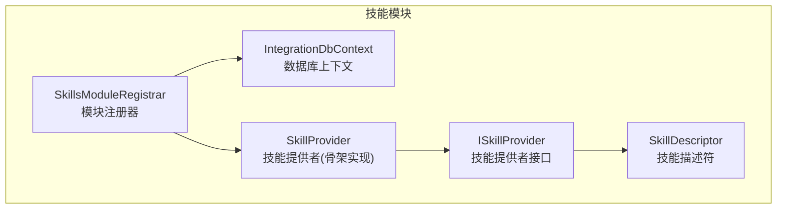
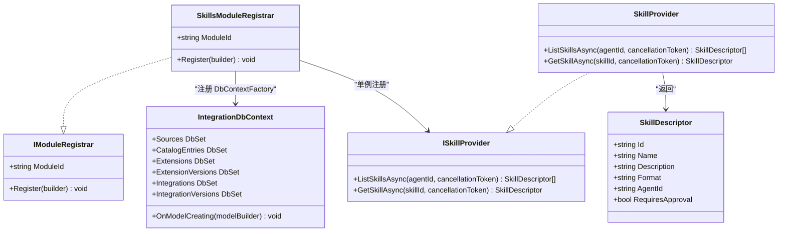
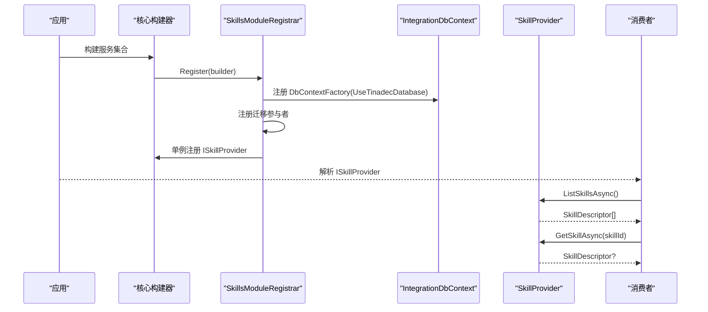
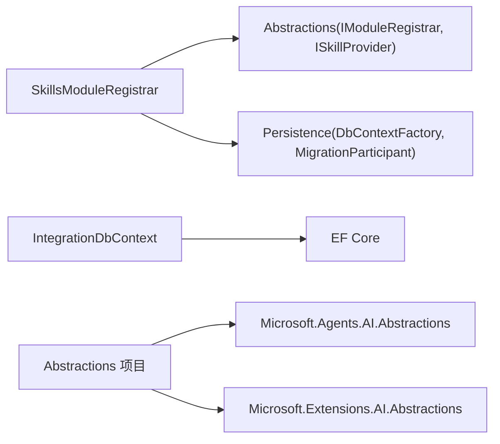

# 技能系统模块

<cite>
**本文引用的文件**   
- [SkillsModuleRegistrar.cs](file://TinadecCore/Skills/SkillsModuleRegistrar.cs)
- [IntegrationDbContext.cs](file://TinadecCore/Skills/IntegrationDbContext.cs)
- [ISkillProvider.cs](file://TinadecCore/Abstractions/Ports/ISkillProvider.cs)
- [IModuleRegistrar.cs](file://TinadecCore/Abstractions/IModuleRegistrar.cs)
- [TinadecCore.Abstractions.csproj](file://TinadecCore/Abstractions/TinadecCore.Abstractions.csproj)
</cite>

## 目录
1. [简介](#简介)
2. [项目结构](#项目结构)
3. [核心组件](#核心组件)
4. [架构总览](#架构总览)
5. [详细组件分析](#详细组件分析)
6. [依赖关系分析](#依赖关系分析)
7. [性能考量](#性能考量)
8. [故障排查指南](#故障排查指南)
9. [结论](#结论)
10. [附录：使用示例与最佳实践](#附录使用示例与最佳实践)

## 简介
本章节面向“技能（Skills）”模块，系统性阐述其设计目标、能力边界与集成方式。该模块通过统一的模块注册器将技能服务注入依赖注入容器，并提供基于 MAF AgentSkillsProvider 的技能发现与执行框架。数据层采用独立的数据库上下文，管理扩展来源、目录清单、工作区安装、版本以及集成实例及其配置版本，从而支撑技能的元数据管理、依赖关系与版本控制。

## 项目结构
技能模块位于 TinadecCore/Skills 命名空间下，包含：
- 模块注册器：负责 DI 注册、迁移参与者与模块描述符声明
- 数据库上下文：定义技能相关实体与表映射
- 抽象接口：对外暴露技能提供者接口与技能描述符

图表来源
- [SkillsModuleRegistrar.cs:12-31](file://TinadecCore/Skills/SkillsModuleRegistrar.cs#L12-L31)
- [IntegrationDbContext.cs:5-24](file://TinadecCore/Skills/IntegrationDbContext.cs#L5-L24)
- [ISkillProvider.cs:8-27](file://TinadecCore/Abstractions/Ports/ISkillProvider.cs#L8-L27)

章节来源
- [SkillsModuleRegistrar.cs:12-31](file://TinadecCore/Skills/SkillsModuleRegistrar.cs#L12-L31)
- [IntegrationDbContext.cs:5-24](file://TinadecCore/Skills/IntegrationDbContext.cs#L5-L24)
- [ISkillProvider.cs:8-27](file://TinadecCore/Abstractions/Ports/ISSkillProvider.cs#L8-L27)

## 核心组件
- 模块注册器 SkillsModuleRegistrar
  - 职责：注册 DbContextFactory、迁移参与者、ISkillProvider；声明模块描述符（ID、版本、依赖、能力集、语言、MAF 原语、注册状态）。
  - 关键点：使用 UseTinadecDatabase 统一数据库配置；以单例注册 ISkillProvider。
- 数据库上下文 IntegrationDbContext
  - 职责：维护技能相关的持久化模型与表映射，包括扩展来源、目录条目、工作区扩展、扩展版本、集成实例与集成版本。
  - 关键点：为各实体定义主键、唯一索引、字段长度限制与软删除字段；启用蛇形命名约定。
- 技能提供者接口 ISkillProvider 与 SkillDescriptor
  - 职责：提供 ListSkillsAsync 与 GetSkillAsync 两个方法，返回技能描述符数组或单个技能。
  - 关键点：SkillDescriptor 包含 Id、Name、Description、Format、AgentId、RequiresApproval 等元数据。

章节来源
- [SkillsModuleRegistrar.cs:16-31](file://TinadecCore/Skills/SkillsModuleRegistrar.cs#L16-L31)
- [IntegrationDbContext.cs:5-24](file://TinadecCore/Skills/IntegrationDbContext.cs#L5-L24)
- [ISkillProvider.cs:8-27](file://TinadecCore/Abstractions/Ports/ISkillProvider.cs#L8-L27)

## 架构总览
技能模块遵循“模块即插件”的架构模式：每个业务模块实现 IModuleRegistrar 并显式注册，避免反射扫描带来的不确定性。技能提供者通过 ISkillProvider 暴露能力，数据层由 IntegrationDbContext 统一管理。

图表来源
- [IModuleRegistrar.cs:9-16](file://TinadecCore/Abstractions/IModuleRegistrar.cs#L9-L16)
- [SkillsModuleRegistrar.cs:12-31](file://TinadecCore/Skills/SkillsModuleRegistrar.cs#L12-L31)
- [IntegrationDbContext.cs:5-24](file://TinadecCore/Skills/IntegrationDbContext.cs#L5-L24)
- [ISkillProvider.cs:8-27](file://TinadecCore/Abstractions/Ports/ISkillProvider.cs#L8-L27)

## 详细组件分析

### 模块注册器 SkillsModuleRegistrar
- 功能要点
  - 注册 IntegrationDbContext 的工厂，使用统一的数据库配置 UseTinadecDatabase。
  - 注册迁移参与者，使技能模块参与整体存储迁移流程。
  - 以单例方式注册 ISkillProvider，供上层消费。
  - 声明模块描述符：模块 ID、版本、依赖（abstractions、persistence）、能力集（如 file_skills、class_skills、inline_skills、skill_md、sep_2640、extension_installations、mcp_acp_integrations）、语言（C#）、MAF 原语（skills）、初始注册状态（NotConfigured）。
- 设计意图
  - 通过显式注册确保可观测性与可控性。
  - 能力集清晰表达模块支持的技能形态与集成特性。
  - 依赖声明保证加载顺序与装配正确性。

章节来源
- [SkillsModuleRegistrar.cs:16-31](file://TinadecCore/Skills/SkillsModuleRegistrar.cs#L16-L31)

### 数据库上下文 IntegrationDbContext
- 数据模型概览
  - 扩展来源 ExtensionSourceRecord：记录来源名称、类型、位置、租户、启用状态、修订、审计字段与软删除。
  - 目录条目 ExtensionCatalogRecord：关联来源、扩展 ID、版本、清单引用与哈希、刷新与过期时间。
  - 工作区扩展 WorkspaceExtensionRecord：工作区维度安装信息、状态、当前版本、审计与软删除。
  - 工作区扩展版本 WorkspaceExtensionVersionRecord：版本编号、清单与配置引用、哈希、审计。
  - 集成实例 IntegrationInstanceRecord：工作区维度的集成实例（Kind、Name、Status、Enabled、CurrentVersionId 等）。
  - 集成版本 IntegrationInstanceVersionRecord：配置版本、配置哈希、密钥所有者引用、审计。
- 建模策略
  - 所有实体均具备主键、审计字段（创建/更新人、时间）与软删除（DeletedAt）。
  - 关键组合字段建立唯一索引，防止重复与冲突。
  - 使用蛇形命名约定生成表名与列名。
- 版本控制与依赖
  - 通过 CatalogEntry 与 Version 记录实现扩展与配置的版本化。
  - 工作区维度保存 CurrentVersionId，便于快速定位活跃版本。
  - 集成实例与版本分离，支持多版本配置并存与切换。

章节来源
- [IntegrationDbContext.cs:5-32](file://TinadecCore/Skills/IntegrationDbContext.cs#L5-L32)

### 技能提供者接口与描述符
- 接口 ISkillProvider
  - ListSkillsAsync：列出可用技能，可按 agentId 过滤。
  - GetSkillAsync：按 skillId 获取单个技能描述符。
- 描述符 SkillDescriptor
  - 包含技能标识、名称、描述、格式、可选的 AgentId、是否需要审批等元数据。
- 骨架实现 SkillProvider
  - 当前返回空结果，预留扩展点以便后续接入真实技能发现逻辑。

章节来源
- [ISkillProvider.cs:8-27](file://TinadecCore/Abstractions/Ports/ISkillProvider.cs#L8-L27)
- [SkillsModuleRegistrar.cs:38-53](file://TinadecCore/Skills/SkillsModuleRegistrar.cs#L38-L53)

### 技能发现与加载机制（概念流程）
下图展示从模块启动到技能可用的典型流程，涵盖 DI 注册、上下文初始化、迁移参与、提供者调用与结果返回。

图表来源
- [SkillsModuleRegistrar.cs:16-31](file://TinadecCore/Skills/SkillsModuleRegistrar.cs#L16-L31)
- [IntegrationDbContext.cs:5-24](file://TinadecCore/Skills/IntegrationDbContext.cs#L5-L24)
- [ISkillProvider.cs:8-27](file://TinadecCore/Abstractions/Ports/ISkillProvider.cs#L8-L27)

## 依赖关系分析
- 模块内依赖
  - SkillsModuleRegistrar 依赖 Abstractions（IModuleRegistrar、ISkillProvider）、Persistence（DbContext 扩展与迁移参与者）。
  - IntegrationDbContext 依赖 EF Core 与自定义数据库配置扩展。
- 外部依赖
  - Microsoft.Extensions.DependencyInjection 用于服务注册。
  - Microsoft.EntityFrameworkCore 用于数据访问。
  - Microsoft.Agents.AI.Abstractions 与 Microsoft.Extensions.AI.Abstractions 在 Abstractions 项目中引入，为技能与 AI 能力提供基础抽象。

图表来源
- [SkillsModuleRegistrar.cs:1-6](file://TinadecCore/Skills/SkillsModuleRegistrar.cs#L1-L6)
- [IntegrationDbContext.cs:1-3](file://TinadecCore/Skills/IntegrationDbContext.cs#L1-L3)
- [TinadecCore.Abstractions.csproj:14-17](file://TinadecCore/Abstractions/TinadecCore.Abstractions.csproj#L14-L17)

章节来源
- [SkillsModuleRegistrar.cs:1-6](file://TinadecCore/Skills/SkillsModuleRegistrar.cs#L1-L6)
- [IntegrationDbContext.cs:1-3](file://TinadecCore/Skills/IntegrationDbContext.cs#L1-L3)
- [TinadecCore.Abstractions.csproj:14-17](file://TinadecCore/Abstractions/TinadecCore.Abstractions.csproj#L14-L17)

## 性能考量
- 数据库上下文工厂：按需创建 DbContext，避免全局连接占用，提升并发与资源利用率。
- 迁移参与者：集中管理迁移，减少启动时额外开销。
- 技能列表与查询：当前为骨架实现，建议后续对 ListSkillsAsync 与 GetSkillAsync 增加缓存与分页，降低频繁 IO 与序列化成本。
- 索引优化：已为关键字段设置唯一索引，建议在高频查询条件上补充覆盖索引以提升检索性能。

## 故障排查指南
- 模块未生效
  - 检查 SkillsModuleRegistrar.Register 是否被调用，确认模块 ID 与依赖声明是否正确。
- 数据库连接失败
  - 确认 UseTinadecDatabase 配置有效，检查连接字符串与数据库可用性。
- 迁移未执行
  - 确认 DbContextMigrationParticipant<IntegrationDbContext> 已注册，且迁移脚本存在。
- 技能列表为空
  - 当前 SkillProvider 返回空数组，需实现具体发现逻辑（文件/类/内联技能与 SKILL.md）。
- 权限与审批
  - 若技能需要审批，检查 SkillDescriptor.RequiresApproval 与上游审批流程是否对接。

章节来源
- [SkillsModuleRegistrar.cs:16-31](file://TinadecCore/Skills/SkillsModuleRegistrar.cs#L16-L31)
- [IntegrationDbContext.cs:5-24](file://TinadecCore/Skills/IntegrationDbContext.cs#L5-L24)
- [ISkillProvider.cs:8-27](file://TinadecCore/Abstractions/Ports/ISkillProvider.cs#L8-L27)

## 结论
技能系统模块以清晰的模块注册与数据建模为基础，提供了可扩展的技能发现与执行框架。通过 IntegrationDbContext 对扩展与集成进行版本化管理，结合 ISkillProvider 的统一接口，使得技能的生命周期、权限控制与执行环境具备良好的可维护性与演进空间。后续可在现有骨架基础上完善技能发现、权限校验与执行沙箱集成。

## 附录：使用示例与最佳实践

### 开发自定义技能（步骤指引）
- 定义技能描述符
  - 在实现 ISkillProvider 时，为每个技能构造 SkillDescriptor，填写 Id、Name、Description、Format、AgentId、RequiresApproval。
- 实现技能发现
  - 在 ListSkillsAsync 中扫描本地文件或读取目录清单，返回可用技能列表。
  - 在 GetSkillAsync 中根据 skillId 精确返回对应技能描述符。
- 集成审批与执行
  - 当 RequiresApproval 为真时，在上游审批流程通过后执行；脚本写入统一走 Core 审批通道。
- 数据持久化
  - 使用 IntegrationDbContext 记录扩展来源、目录条目与工作区安装信息；维护版本与配置引用。

章节来源
- [ISkillProvider.cs:8-27](file://TinadecCore/Abstractions/Ports/ISkillProvider.cs#L8-L27)
- [IntegrationDbContext.cs:5-32](file://TinadecCore/Skills/IntegrationDbContext.cs#L5-L32)

### 集成第三方技能（步骤指引）
- 添加扩展来源
  - 在 extension_sources 表中登记第三方来源（名称、类型、位置），并启用。
- 同步目录清单
  - 定期刷新 extension_catalog_entries，记录扩展 ID、版本、清单引用与哈希。
- 工作区安装与版本选择
  - 在工作区维度安装扩展，指定当前版本（workspace_extension_versions），并设置当前版本 ID。
- 配置与密钥管理
  - 通过 integration_instance_version_record 管理配置版本与密钥所有者引用，确保敏感信息隔离。

章节来源
- [IntegrationDbContext.cs:27-32](file://TinadecCore/Skills/IntegrationDbContext.cs#L27-L32)

### 权限控制与执行环境
- 权限控制
  - 基于 SkillDescriptor.RequiresApproval 决定是否触发审批；结合租户与工作区维度进行授权。
- 执行环境
  - 脚本执行委托给 TinadecTools；所有写操作必须经过 Core 审批，确保安全性与可追溯性。

章节来源
- [SkillsModuleRegistrar.cs:38-53](file://TinadecCore/Skills/SkillsModuleRegistrar.cs#L38-L53)