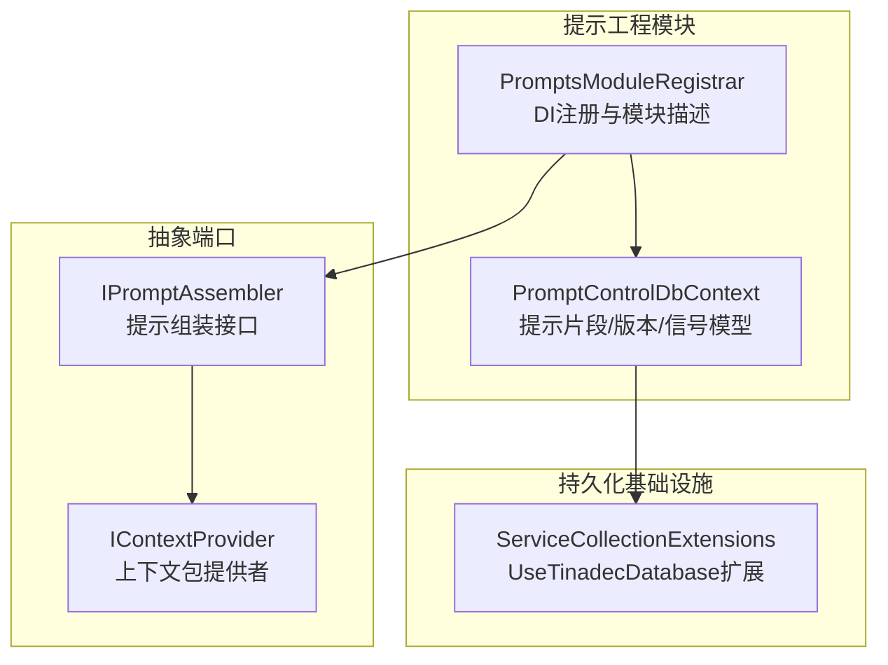
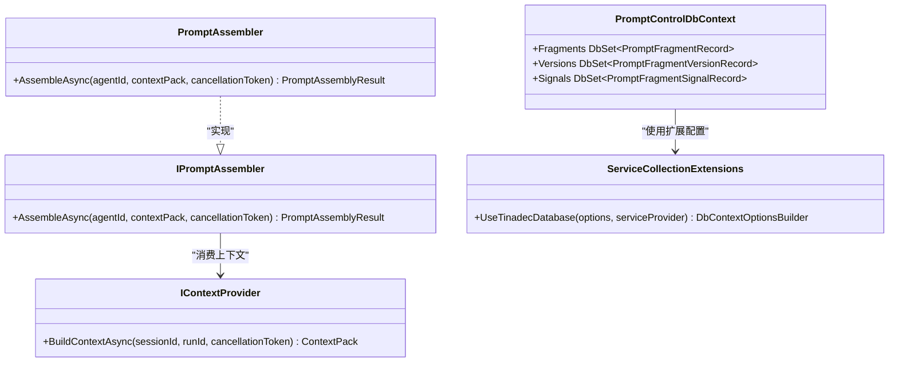
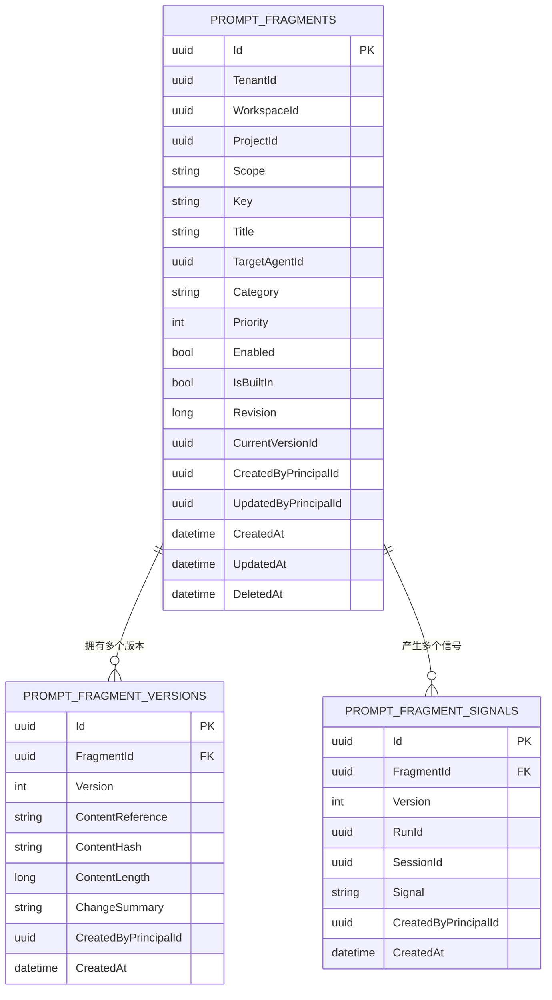
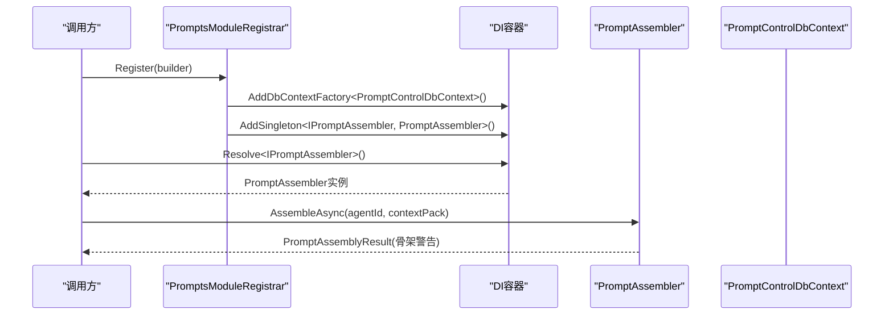
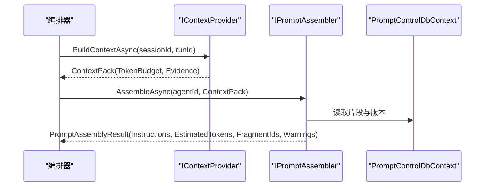
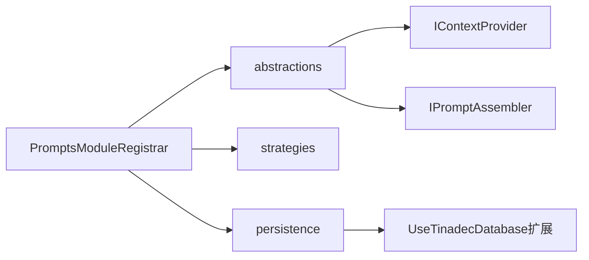

# 提示工程模块

<cite>
**本文引用的文件**   
- [PromptControlDbContext.cs](file://TinadecCore/Prompts/PromptControlDbContext.cs)
- [PromptsModuleRegistrar.cs](file://TinadecCore/Prompts/PromptsModuleRegistrar.cs)
- [IPromptAssembler.cs](file://TinadecCore/Abstractions/Ports/IPromptAssembler.cs)
- [IContextProvider.cs](file://TinadecCore/Abstractions/Ports/IContextProvider.cs)
- [IModuleRegistrar.cs](file://TinadecCore/Abstractions/IModuleRegistrar.cs)
- [ServiceCollectionExtensions.cs](file://TinadecCore/Persistence/ServiceCollectionExtensions.cs)
</cite>

## 目录
1. [简介](#简介)
2. [项目结构](#项目结构)
3. [核心组件](#核心组件)
4. [架构总览](#架构总览)
5. [详细组件分析](#详细组件分析)
6. [依赖关系分析](#依赖关系分析)
7. [性能考量](#性能考量)
8. [故障排查指南](#故障排查指南)
9. [结论](#结论)
10. [附录：使用示例与最佳实践](#附录使用示例与最佳实践)

## 简介
本章节面向“提示工程模块”，聚焦于提示控制数据库上下文、模板管理、变量替换、版本控制机制，以及 PromptsModuleRegistrar 如何注册提示管理服务并与 IPromptAssembler 接口集成。同时给出提示的创建、编辑、测试与部署流程说明，并提供高效设计提示模板与管理版本的实践建议。

## 项目结构
提示工程模块位于 TinadecCore/Prompts 下，包含数据访问层（EF Core DbContext 与实体）和模块注册器（服务装配与能力声明）。相关抽象定义在 Abstractions/Ports 中，持久化基础设施在 Persistence 中提供统一的数据库配置与连接解析。

图表来源 
- [PromptControlDbContext.cs:1-39](file://TinadecCore/Prompts/PromptControlDbContext.cs#L1-L39)
- [PromptsModuleRegistrar.cs:1-55](file://TinadecCore/Prompts/PromptsModuleRegistrar.cs#L1-L55)
- [IPromptAssembler.cs:1-23](file://TinadecCore/Abstractions/Ports/IPromptAssembler.cs#L1-L23)
- [IContextProvider.cs:1-37](file://TinadecCore/Abstractions/Ports/IContextProvider.cs#L1-L37)
- [ServiceCollectionExtensions.cs:54-62](file://TinadecCore/Persistence/ServiceCollectionExtensions.cs#L54-L62)

章节来源
- [PromptControlDbContext.cs:1-39](file://TinadecCore/Prompts/PromptControlDbContext.cs#L1-L39)
- [PromptsModuleRegistrar.cs:1-55](file://TinadecCore/Prompts/PromptsModuleRegistrar.cs#L1-L55)
- [IPromptAssembler.cs:1-23](file://TinadecCore/Abstractions/Ports/IPromptAssembler.cs#L1-L23)
- [IContextProvider.cs:1-37](file://TinadecCore/Abstractions/Ports/IContextProvider.cs#L1-L37)
- [ServiceCollectionExtensions.cs:15-49](file://TinadecCore/Persistence/ServiceCollectionExtensions.cs#L15-L49)

## 核心组件
- 提示控制数据库上下文与实体
  - PromptControlDbContext：定义 EF Core 上下文与三张表映射：提示片段、片段版本、运行信号；包含唯一索引与软删除字段等元数据。
  - PromptFragmentRecord：片段主记录，包含租户/工作区/项目范围、键、标题、分类、优先级、启用状态、内置标记、修订号、当前版本ID、审计字段与时间戳。
  - PromptFragmentVersionRecord：片段版本记录，包含内容引用、内容哈希、长度、变更摘要与审计信息。
  - PromptFragmentSignalRecord：运行时信号记录，关联片段与版本，支持 RunId/SessionId 追踪。
- 模块注册器与服务装配
  - PromptsModuleRegistrar：实现 IModuleRegistrar，注册 PromptControlDbContext 工厂、迁移参与者、IPromptAssembler 的具体实现（骨架），并声明模块能力。
- 提示组装接口与结果
  - IPromptAssembler：定义 AssembleAsync，将 agentId、ContextPack 与可选上下文打包为 ChatOptions.Instructions/AIContext。
  - PromptAssemblyResult：返回指令文本、预估 token、参与片段 ID 列表与警告信息。
- 上下文提供者
  - IContextProvider：构建 ContextPack，包含会话/运行标识、token 预算、预估 token 与证据集合。

章节来源
- [PromptControlDbContext.cs:1-39](file://TinadecCore/Prompts/PromptControlDbContext.cs#L1-L39)
- [PromptsModuleRegistrar.cs:1-55](file://TinadecCore/Prompts/PromptsModuleRegistrar.cs#L1-L55)
- [IPromptAssembler.cs:1-23](file://TinadecCore/Abstractions/Ports/IPromptAssembler.cs#L1-L23)
- [IContextProvider.cs:1-37](file://TinadecCore/Abstractions/Ports/IContextProvider.cs#L1-L37)

## 架构总览
提示工程模块通过模块注册器将数据库上下文与提示组装服务注入到 DI 容器，并在运行时由调用方通过 IPromptAssembler.AssembleAsync 获取最终指令。上下文由 IContextProvider 提供，用于限制 token 预算与携带证据。

图表来源 
- [PromptsModuleRegistrar.cs:38-54](file://TinadecCore/Prompts/PromptsModuleRegistrar.cs#L38-L54)
- [PromptControlDbContext.cs:5-33](file://TinadecCore/Prompts/PromptControlDbContext.cs#L5-L33)
- [IPromptAssembler.cs:8-14](file://TinadecCore/Abstractions/Ports/IPromptAssembler.cs#L8-L14)
- [IContextProvider.cs:9-16](file://TinadecCore/Abstractions/Ports/IContextProvider.cs#L9-L16)
- [ServiceCollectionExtensions.cs:54-62](file://TinadecCore/Persistence/ServiceCollectionExtensions.cs#L54-L62)

## 详细组件分析

### 提示控制数据库上下文与实体
- 表与索引
  - prompt_fragments：按 (TenantId, WorkspaceId, ProjectId, Key, TargetAgentId, DeletedAt) 建立唯一索引，确保同一作用域内键的唯一性。
  - prompt_fragment_versions：按 (FragmentId, Version) 建立唯一索引，保证版本不重复。
  - prompt_fragment_signals：按 (FragmentId, Version, CreatedAt) 建立索引，便于查询某版本在某次运行中的信号。
- 字段语义
  - 片段主记录包含范围（Scope）、目标代理（TargetAgentId）、分类（Category）、优先级（Priority）、启用标志（Enabled）、是否内置（IsBuiltIn）、修订号（Revision）、当前版本ID（CurrentVersionId）与审计字段。
  - 版本记录包含内容引用（ContentReference）、内容哈希（ContentHash）、内容长度（ContentLength）、变更摘要（ChangeSummary）与审计字段。
  - 信号记录包含信号名（Signal）、可选的 RunId/SessionId 与审计字段。
- 命名约定
  - 使用 UseTinadecSnakeCase() 统一蛇形命名。

图表来源 
- [PromptControlDbContext.cs:14-33](file://TinadecCore/Prompts/PromptControlDbContext.cs#L14-L33)

章节来源
- [PromptControlDbContext.cs:14-33](file://TinadecCore/Prompts/PromptControlDbContext.cs#L14-L33)

### 模块注册器与提示组装器
- PromptsModuleRegistrar
  - 注册 PromptControlDbContext 工厂，使用 UseTinadecDatabase 扩展以适配不同数据库提供者。
  - 注册迁移参与者，使该模块的 DbContext 参与统一迁移流程。
  - 注册 IPromptAssembler 的实现（当前为骨架），并声明模块能力：fragment_assembly、agent_instructions、skill_contributions、deterministic_assembly。
- PromptAssembler（骨架）
  - 当前返回空指令与警告，表明模块处于骨架阶段，尚未注册具体片段与变量替换逻辑。

图表来源 
- [PromptsModuleRegistrar.cs:16-31](file://TinadecCore/Prompts/PromptsModuleRegistrar.cs#L16-L31)
- [PromptsModuleRegistrar.cs:38-54](file://TinadecCore/Prompts/PromptsModuleRegistrar.cs#L38-L54)
- [ServiceCollectionExtensions.cs:54-62](file://TinadecCore/Persistence/ServiceCollectionExtensions.cs#L54-L62)

章节来源
- [PromptsModuleRegistrar.cs:16-31](file://TinadecCore/Prompts/PromptsModuleRegistrar.cs#L16-L31)
- [PromptsModuleRegistrar.cs:38-54](file://TinadecCore/Prompts/PromptsModuleRegistrar.cs#L38-L54)

### 上下文提供者与提示组装协作
- IContextProvider 负责生产 ContextPack，包含 TokenBudget、EstimatedTokens 与 Evidence。
- IPromptAssembler.AssembleAsync 接收 ContextPack，结合 agentId 与片段库，生成最终的 Instructions 与 EstimatedTokens，并返回参与的 FragmentIds 与 Warnings。

图表来源 
- [IContextProvider.cs:12-16](file://TinadecCore/Abstractions/Ports/IContextProvider.cs#L12-L16)
- [IPromptAssembler.cs:10-14](file://TinadecCore/Abstractions/Ports/IPromptAssembler.cs#L10-L14)
- [PromptControlDbContext.cs:8-11](file://TinadecCore/Prompts/PromptControlDbContext.cs#L8-L11)

章节来源
- [IContextProvider.cs:12-16](file://TinadecCore/Abstractions/Ports/IContextProvider.cs#L12-L16)
- [IPromptAssembler.cs:10-14](file://TinadecCore/Abstractions/Ports/IPromptAssembler.cs#L10-L14)

## 依赖关系分析
- 模块依赖
  - PromptsModuleRegistrar 依赖 abstractions、strategies、persistence 三个模块。
- 服务依赖
  - PromptControlDbContext 依赖持久化扩展 UseTinadecDatabase，从而接入统一的数据库配置与连接解析。
  - IPromptAssembler 依赖 IContextProvider 提供的上下文包。

图表来源 
- [PromptsModuleRegistrar.cs:21-30](file://TinadecCore/Prompts/PromptsModuleRegistrar.cs#L21-L30)
- [ServiceCollectionExtensions.cs:54-62](file://TinadecCore/Persistence/ServiceCollectionExtensions.cs#L54-L62)
- [IPromptAssembler.cs:8-14](file://TinadecCore/Abstractions/Ports/IPromptAssembler.cs#L8-L14)
- [IContextProvider.cs:9-16](file://TinadecCore/Abstractions/Ports/IContextProvider.cs#L9-L16)

章节来源
- [PromptsModuleRegistrar.cs:21-30](file://TinadecCore/Prompts/PromptsModuleRegistrar.cs#L21-L30)
- [ServiceCollectionExtensions.cs:54-62](file://TinadecCore/Persistence/ServiceCollectionExtensions.cs#L54-L62)

## 性能考量
- 数据库索引
  - 片段键与作用域组合的唯一索引避免重复写入与冲突检测开销。
  - 版本唯一索引保障版本一致性，减少并发写入时的校验成本。
  - 信号索引优化按片段与版本查询运行信号的效率。
- 内容存储策略
  - 版本记录仅保存内容引用与哈希，避免大文本直接落库，降低 IO 与存储压力。
- 上下文预算
  - ContextPack 的 TokenBudget 与 EstimatedTokens 可用于裁剪证据与片段，控制最终指令大小。
- 骨架实现
  - 当前 PromptAssembler 未实现片段加载与变量替换，实际性能瓶颈将在后续实现片段检索、缓存与拼接时出现，建议引入片段缓存与增量更新。

[本节为通用指导，不直接分析具体文件]

## 故障排查指南
- 模块未配置或能力缺失
  - 检查 PromptsModuleRegistrar 是否正确注册了 IPromptAssembler 与 DbContext 工厂。
  - 确认 ModuleDescriptor 的 Capabilities 已声明 fragment_assembly 等能力。
- 数据库连接问题
  - 确认 UseTinadecDatabase 扩展被正确调用，且底层数据库提供者配置有效。
  - 检查迁移参与者是否参与启动迁移，确保表结构存在。
- 提示组装结果为空或警告
  - 骨架实现会返回警告，需实现具体的片段加载与变量替换逻辑。
  - 检查 ContextPack 的 TokenBudget 与 Evidence 是否为空，影响最终指令生成。
- 版本与信号异常
  - 若版本不一致或信号缺失，检查版本唯一索引与信号记录的插入路径。

章节来源
- [PromptsModuleRegistrar.cs:16-31](file://TinadecCore/Prompts/PromptsModuleRegistrar.cs#L16-L31)
- [PromptsModuleRegistrar.cs:38-54](file://TinadecCore/Prompts/PromptsModuleRegistrar.cs#L38-L54)
- [ServiceCollectionExtensions.cs:54-62](file://TinadecCore/Persistence/ServiceCollectionExtensions.cs#L54-L62)

## 结论
提示工程模块通过清晰的数据库建模与模块注册机制，奠定了片段管理与版本控制的基石。当前骨架实现明确了接口契约与装配点，后续应重点完善片段加载、变量替换、缓存策略与运行信号采集，以实现确定性的提示组装与高效的上下文预算控制。

[本节为总结，不直接分析具体文件]

## 附录：使用示例与最佳实践
- 设计高效的提示模板
  - 将系统提示拆分为可复用的片段（如角色设定、工具使用说明、约束规则），通过 Key 与作用域（tenant/workspace/project）进行组织。
  - 使用 Category 与 Priority 对片段进行分类与排序，便于在不同 Agent 场景下选择合适片段。
  - 使用 IsBuiltIn 区分内置片段与用户自定义片段，避免覆盖关键系统行为。
- 变量替换策略
  - 在 PromptAssembler 中基于 ContextPack 的 Evidence 与 Metadata 进行变量填充，例如将工具输出、用户输入与环境信息注入模板。
  - 对敏感信息进行脱敏处理，确保 ContentReference 指向安全的内容存储位置。
- 版本控制机制
  - 每次修改片段后创建新版本，记录 ContentHash 与 ChangeSummary，便于回滚与审计。
  - 通过 CurrentVersionId 指向活跃版本，Revision 字段记录整体修订次数。
- 创建、编辑、测试与部署流程
  - 创建：在 UI 或 API 中新增片段，指定 Key、Title、Scope、Category、TargetAgentId 等元数据。
  - 编辑：生成新版本，更新 ContentReference 与 ContentHash，保留历史版本。
  - 测试：通过 AssembleAsync 传入 ContextPack，验证 Instructions 与 EstimatedTokens 是否符合预期，检查 Warnings。
  - 部署：将新版本的 CurrentVersionId 切换为目标版本，并通过 Signals 记录运行信号以便追踪。
- 最佳实践
  - 保持片段粒度适中，避免过大导致难以维护与调试。
  - 利用唯一索引与审计字段确保数据一致性与可追溯性。
  - 结合 TokenBudget 动态裁剪证据与片段，控制响应延迟与成本。

[本节为概念性指导，不直接分析具体文件]