# 核心模块

<cite>
**本文引用的文件**   
- [TinadecCore.Abstractions.csproj](file://TinadecCore/Abstractions/TinadecCore.Abstractions.csproj)
- [IModuleRegistrar.cs](file://TinadecCore/Abstractions/IModuleRegistrar.cs)
- [ITinadecCoreBuilder.cs](file://TinadecCore/Abstractions/ITinadecCoreBuilder.cs)
- [TinadecCoreBuilder.cs](file://TinadecCore/Runtime/TinadecCoreBuilder.cs)
- [TinadecCoreServiceCollectionExtensions.cs](file://TinadecCore/Runtime/TinadecCoreServiceCollectionExtensions.cs)
- [ContextModuleRegistrar.cs](file://TinadecCore/Context/ContextModuleRegistrar.cs)
- [DmaEAModuleRegistrar.cs](file://TinadecCore/DmaEA/DmaEAModuleRegistrar.cs)
- [LifecycleModuleRegistrar.cs](file://TinadecCore/Lifecycle/LifecycleModuleRegistrar.cs)
- [LoopGuardModuleRegistrar.cs](file://TinadecCore/LoopGuard/LoopGuardModuleRegistrar.cs)
- [MemoryModuleRegistrar.cs](file://TinadecCore/Memory/MemoryModuleRegistrar.cs)
- [ModelsModuleRegistrar.cs](file://TinadecCore/Models/ModelsModuleRegistrar.cs)
- [PromptsModuleRegistrar.cs](file://TinadecCore/Prompts/PromptsModuleRegistrar.cs)
- [SkillsModuleRegistrar.cs](file://TinadecCore/Skills/SkillsModuleRegistrar.cs)
- [TenancyModuleRegistrar.cs](file://TinadecCore/Tenancy/TenancyModuleRegistrar.cs)
- [VectorStoreModuleRegistrar.cs](file://TinadecCore/VectorStore/VectorStoreModuleRegistrar.cs)
</cite>

## 目录
1. [简介](#简介)
2. [项目结构](#项目结构)
3. [核心组件](#核心组件)
4. [架构总览](#架构总览)
5. [详细组件分析](#详细组件分析)
6. [依赖关系分析](#依赖关系分析)
7. [性能考量](#性能考量)
8. [故障排查指南](#故障排查指南)
9. [结论](#结论)
10. [附录：使用示例与扩展开发指南](#附录使用示例与扩展开发指南)

## 简介
本文件为 TinadecCore 核心模块的详细技术文档，覆盖以下能力域：上下文管理（Context）、代理编排（DmaEA）、生命周期（Lifecycle）、循环保护（LoopGuard）、会话记忆（Memory）、模型管理（Models）、提示工程（Prompts）、技能系统（Skills）、多租户（Tenancy）与向量存储（VectorStore）。文档从架构、接口契约、配置选项、模块间依赖与通信机制入手，提供可视化图示、使用示例与扩展开发指南，帮助读者快速理解并安全扩展各模块。

## 项目结构
TinadecCore 采用“按功能域分模块 + 显式注册”的插件化架构。每个模块通过实现 IModuleRegistrar 暴露 ModuleId 与 Register(builder) 方法，由运行时统一收集并注入 DI 容器。核心入口位于 Runtime 层，提供 AddTinadecCore() 与 AddTinadecCoreMinimal() 两种装配方式，分别用于全量与最小可用组合。

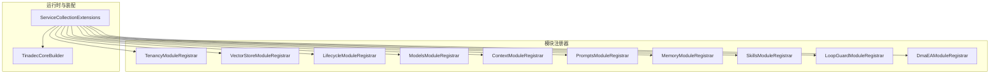

图表来源 
- [TinadecCoreServiceCollectionExtensions.cs:20-61](file://TinadecCore/Runtime/TinadecCoreServiceCollectionExtensions.cs#L20-L61)
- [TinadecCoreBuilder.cs:11-31](file://TinadecCore/Runtime/TinadecCoreBuilder.cs#L11-L31)

章节来源
- [TinadecCore.Abstractions.csproj:1-20](file://TinadecCore/Abstractions/TinadecCore.Abstractions.csproj#L1-L20)
- [IModuleRegistrar.cs:1-17](file://TinadecCore/Abstractions/IModuleRegistrar.cs#L1-L17)
- [ITinadecCoreBuilder.cs:1-52](file://TinadecCore/Abstractions/ITinadecCoreBuilder.cs#L1-L52)
- [TinadecCoreBuilder.cs:11-31](file://TinadecCore/Runtime/TinadecCoreBuilder.cs#L11-L31)
- [TinadecCoreServiceCollectionExtensions.cs:20-61](file://TinadecCore/Runtime/TinadecCoreServiceCollectionExtensions.cs#L20-L61)

## 核心组件
- 模块注册器（IModuleRegistrar）：每个业务模块必须实现该接口，声明 ModuleId 并在 Register(builder) 中完成服务注册与模块描述符登记。
- 构建器（ITinadecCoreBuilder / TinadecCoreBuilder）：收集模块描述符，持有 IServiceCollection，供端点或外部宿主查询已注册模块清单。
- 装配扩展（TinadecCoreServiceCollectionExtensions）：提供 AddTinadecCore() 与 AddTinadecCoreMinimal()，按依赖顺序调用各模块 Registrar。

关键职责边界
- Abstractions：定义端口接口与模块注册抽象，不依赖具体实现。
- Runtime：负责 DI 装配与模块发现编排。
- 各功能模块：各自实现端口接口，并通过各自的 Registrar 完成服务注册与迁移参与者登记。

章节来源
- [IModuleRegistrar.cs:1-17](file://TinadecCore/Abstractions/IModuleRegistrar.cs#L1-L17)
- [ITinadecCoreBuilder.cs:1-52](file://TinadecCore/Abstractions/ITinadecCoreBuilder.cs#L1-L52)
- [TinadecCoreBuilder.cs:11-31](file://TinadecCore/Runtime/TinadecCoreBuilder.cs#L11-L31)
- [TinadecCoreServiceCollectionExtensions.cs:20-61](file://TinadecCore/Runtime/TinadecCoreServiceCollectionExtensions.cs#L20-L61)

## 架构总览
下图展示核心模块之间的依赖与数据流向。所有模块均通过统一的端口接口进行解耦，持久化相关模块依赖 Persistence 抽象，策略逻辑由 F# 策略库提供。

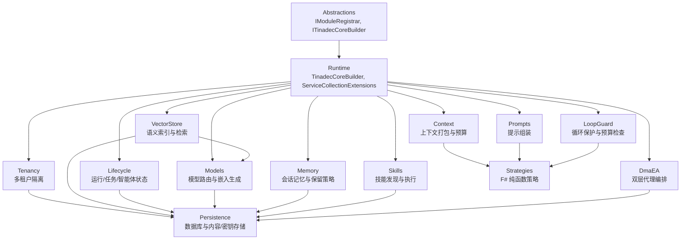

图表来源 
- [TinadecCoreServiceCollectionExtensions.cs:20-61](file://TinadecCore/Runtime/TinadecCoreServiceCollectionExtensions.cs#L20-L61)
- [TenancyModuleRegistrar.cs:10-38](file://TinadecCore/Tenancy/TenancyModuleRegistrar.cs#L10-L38)
- [VectorStoreModuleRegistrar.cs:10-27](file://TinadecCore/VectorStore/VectorStoreModuleRegistrar.cs#L10-L27)
- [LifecycleModuleRegistrar.cs:13-35](file://TinadecCore/Lifecycle/LifecycleModuleRegistrar.cs#L13-L35)
- [ModelsModuleRegistrar.cs:16-37](file://TinadecCore/Models/ModelsModuleRegistrar.cs#L16-L37)
- [ContextModuleRegistrar.cs:10-28](file://TinadecCore/Context/ContextModuleRegistrar.cs#L10-L28)
- [PromptsModuleRegistrar.cs:12-32](file://TinadecCore/Prompts/PromptsModuleRegistrar.cs#L12-L32)
- [MemoryModuleRegistrar.cs:11-33](file://TinadecCore/Memory/MemoryModuleRegistrar.cs#L11-L33)
- [SkillsModuleRegistrar.cs:12-32](file://TinadecCore/Skills/SkillsModuleRegistrar.cs#L12-L32)
- [LoopGuardModuleRegistrar.cs:11-29](file://TinadecCore/LoopGuard/LoopGuardModuleRegistrar.cs#L11-L29)
- [DmaEAModuleRegistrar.cs:12-32](file://TinadecCore/DmaEA/DmaEAModuleRegistrar.cs#L12-L32)

## 详细组件分析

### 上下文管理（Context）
- 职责：构建 ContextPack，包含 SessionId、RunId、TokenBudget、EstimatedTokens、Evidence 等；支持 token 预算策略。
- 接口：IContextProvider.BuildContextAsync(...)
- 配置：默认 TokenBudget 为固定值；可通过策略扩展调整。
- 依赖：Abstractions、Strategies（预算策略）。

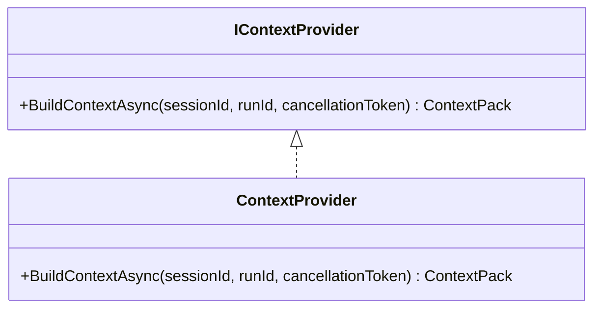

图表来源 
- [ContextModuleRegistrar.cs:34-52](file://TinadecCore/Context/ContextModuleRegistrar.cs#L34-L52)

章节来源
- [ContextModuleRegistrar.cs:10-52](file://TinadecCore/Context/ContextModuleRegistrar.cs#L10-L52)

### 代理编排（DmaEA）
- 职责：双层代理编排（规划层与执行层），负责任务分发、协作、调度与结果聚合。
- 接口：IAgentOrchestrator.OrchestrateAsync(...)
- 配置：当前为骨架实现，未注册具体 Agent；需后续接入。
- 依赖：Persistence（DbContext 工厂与迁移参与者）。

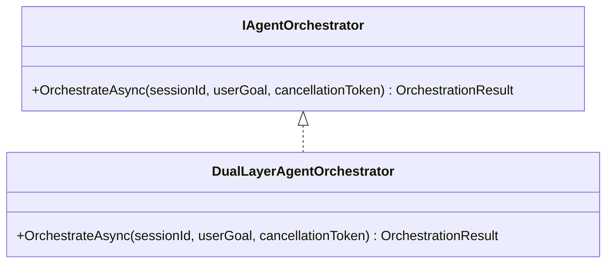

图表来源 
- [DmaEAModuleRegistrar.cs:39-57](file://TinadecCore/DmaEA/DmaEAModuleRegistrar.cs#L39-L57)

章节来源
- [DmaEAModuleRegistrar.cs:12-57](file://TinadecCore/DmaEA/DmaEAModuleRegistrar.cs#L12-L57)

### 生命周期管理（Lifecycle）
- 职责：管理 Run/Task/Agent/Tool/Approval 状态与审计事件；提供内存回退与持久化双路径。
- 接口：ILifecycleManager.StartRunAsync/CompleteRunAsync/GetRunStateAsync
- 配置：当存在 StorageLifecycleService 时走持久化，否则回退到内存字典。
- 依赖：Persistence（DbContext 工厂、迁移参与者）。

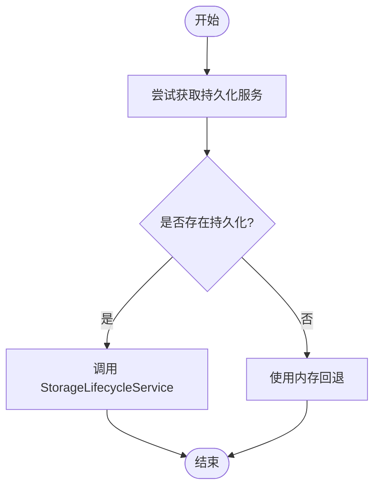

图表来源 
- [LifecycleModuleRegistrar.cs:42-99](file://TinadecCore/Lifecycle/LifecycleModuleRegistrar.cs#L42-L99)

章节来源
- [LifecycleModuleRegistrar.cs:13-100](file://TinadecCore/Lifecycle/LifecycleModuleRegistrar.cs#L13-L100)

### 循环保护（LoopGuard）
- 职责：在迭代过程中检测循环、预算耗尽、工具调用超限、连续错误与重复调用，返回是否继续及警告。
- 接口：ILoopGuard.EvaluateAsync(...)
- 策略：基于 F# 策略函数进行纯判断（迭代上限、token 预算、工具调用上限、连续错误、重复指纹）。
- 依赖：Strategies（LoopDetection 等）。

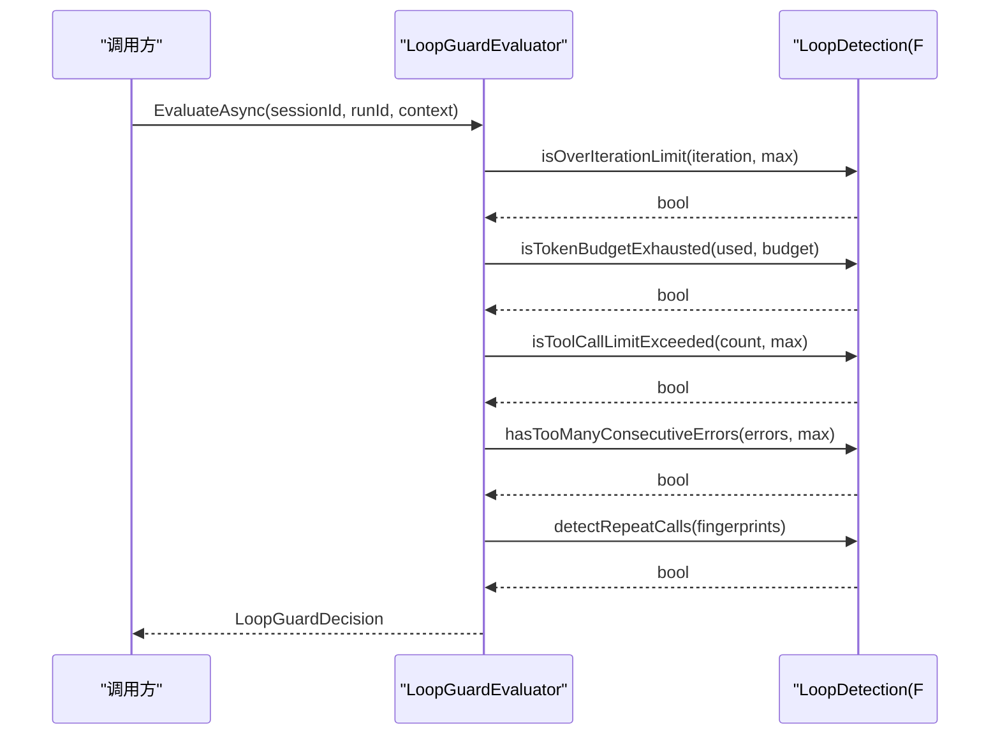

图表来源 
- [LoopGuardModuleRegistrar.cs:35-83](file://TinadecCore/LoopGuard/LoopGuardModuleRegistrar.cs#L35-L83)

章节来源
- [LoopGuardModuleRegistrar.cs:11-83](file://TinadecCore/LoopGuard/LoopGuardModuleRegistrar.cs#L11-L83)

### 会话记忆（Memory）
- 职责：封装 MAF AgentSession 序列化与 ChatHistoryProvider，管理作用域、保留策略与溯源；当前为骨架实现。
- 接口：IMemoryStore.RetrieveAsync/StoreAsync
- 配置：可结合 ISessionLocator 定位会话；未选择向量库。
- 依赖：Persistence（DbContext 工厂、迁移参与者）。

章节来源
- [MemoryModuleRegistrar.cs:11-58](file://TinadecCore/Memory/MemoryModuleRegistrar.cs#L11-L58)

### 模型管理（Models）
- 职责：模型提供者与路由、凭据引用、错误归一化、就绪性检查与嵌入生成。
- 接口：IModelProvider.GetChatClientAsync/CheckReadinessAsync；IEmbeddingProvider.GenerateAsync
- 配置：EmbeddingProvider 解析 Route/RouteVersion/Provider/ProviderVersion，读取 ContentStore 中的 JSON 配置与 SecretStore 中的 API Key，调用 OpenAI 兼容嵌入端点。
- 依赖：Persistence（DbContext 工厂、迁移参与者、ContentStore、SecretStore）。

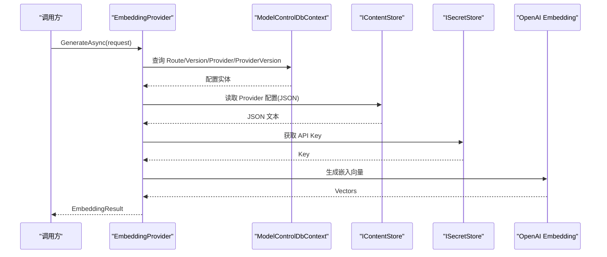

图表来源 
- [ModelsModuleRegistrar.cs:70-168](file://TinadecCore/Models/ModelsModuleRegistrar.cs#L70-L168)

章节来源
- [ModelsModuleRegistrar.cs:16-168](file://TinadecCore/Models/ModelsModuleRegistrar.cs#L16-L168)

### 提示工程（Prompts）
- 职责：确定性地将片段组装为 ChatOptions.Instructions；完整提示内容仅本地预览与内存调用。
- 接口：IPromptAssembler.AssembleAsync(agentId, contextPack, cancellationToken)
- 配置：当前为骨架实现，无片段注册。
- 依赖：Strategies、Persistence（DbContext 工厂、迁移参与者）。

章节来源
- [PromptsModuleRegistrar.cs:12-55](file://TinadecCore/Prompts/PromptsModuleRegistrar.cs#L12-L55)

### 技能系统（Skills）
- 职责：基于 MAF AgentSkillsProvider 的技能发现与执行；支持文件/类/内联技能与 SKILL.md；脚本执行委托给 TinadecTools，写操作经 Core 审批。
- 接口：ISkillProvider.ListSkillsAsync/GetSkillAsync
- 配置：当前为骨架实现，未注册具体技能。
- 依赖：Persistence（DbContext 工厂、迁移参与者）。

章节来源
- [SkillsModuleRegistrar.cs:12-54](file://TinadecCore/Skills/SkillsModuleRegistrar.cs#L12-L54)

### 多租户支持（Tenancy）
- 职责：租户隔离、工作区成员关系、外部身份；提供 DevelopmentTenantContextAccessor 作为默认实现。
- 配置：绑定 TenancyOptions；忽略部分 EF 警告；注册迁移参与者。
- 依赖：Persistence（DbContext 工厂、迁移参与者）。

章节来源
- [TenancyModuleRegistrar.cs:10-38](file://TinadecCore/Tenancy/TenancyModuleRegistrar.cs#L10-L38)

### 向量存储（VectorStore）
- 职责：将内容切块、调用嵌入生成、写入项目级向量数据库，并提供语义检索与删除源能力。
- 接口：IVectorStore.IndexAsync/SearchAsync/DeleteSourceAsync
- 流程要点：
  - 切块长度固定（例如 1600 字符）
  - 校验嵌入一致性（维度、数量）
  - 写入 ProjectVectorRecord（含哈希、元数据、模型标识）
  - 搜索时根据 Query 生成嵌入并检索匹配项
- 依赖：IEmbeddingProvider、IProjectVectorDatabase。

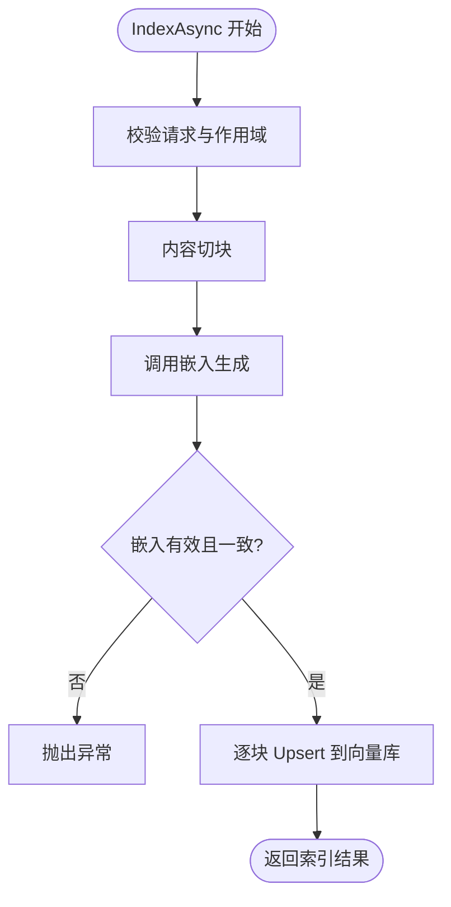

图表来源 
- [VectorStoreModuleRegistrar.cs:29-105](file://TinadecCore/VectorStore/VectorStoreModuleRegistrar.cs#L29-L105)

章节来源
- [VectorStoreModuleRegistrar.cs:10-105](file://TinadecCore/VectorStore/VectorStoreModuleRegistrar.cs#L10-L105)

## 依赖关系分析
- 模块注册顺序：Tenancy → VectorStore → Lifecycle → Models → Context → Prompts → Memory → Skills → LoopGuard → DmaEA。
- 依赖方向：
  - 所有模块依赖 Abstractions（接口与构建器）。
  - 多数模块依赖 Persistence（DbContext 工厂、迁移参与者、内容/密钥存储）。
  - 策略型模块（Context、LoopGuard、Prompts）依赖 Strategies（F# 纯函数）。
  - VectorStore 依赖 Models 的嵌入能力与 Persistence 的向量数据库抽象。
  - DmaEA 依赖 Persistence 以持久化编排状态。

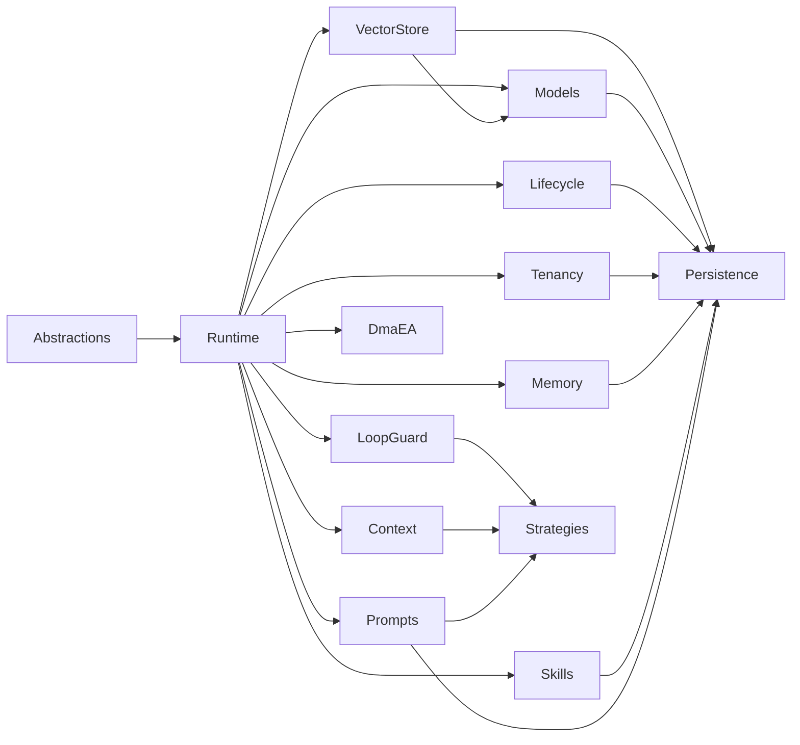

图表来源 
- [TinadecCoreServiceCollectionExtensions.cs:20-61](file://TinadecCore/Runtime/TinadecCoreServiceCollectionExtensions.cs#L20-L61)
- [VectorStoreModuleRegistrar.cs:10-27](file://TinadecCore/VectorStore/VectorStoreModuleRegistrar.cs#L10-L27)
- [ModelsModuleRegistrar.cs:16-37](file://TinadecCore/Models/ModelsModuleRegistrar.cs#L16-L37)
- [LifecycleModuleRegistrar.cs:13-35](file://TinadecCore/Lifecycle/LifecycleModuleRegistrar.cs#L13-L35)
- [TenancyModuleRegistrar.cs:10-38](file://TinadecCore/Tenancy/TenancyModuleRegistrar.cs#L10-L38)
- [MemoryModuleRegistrar.cs:11-33](file://TinadecCore/Memory/MemoryModuleRegistrar.cs#L11-L33)
- [SkillsModuleRegistrar.cs:12-32](file://TinadecCore/Skills/SkillsModuleRegistrar.cs#L12-L32)
- [PromptsModuleRegistrar.cs:12-32](file://TinadecCore/Prompts/PromptsModuleRegistrar.cs#L12-L32)
- [LoopGuardModuleRegistrar.cs:11-29](file://TinadecCore/LoopGuard/LoopGuardModuleRegistrar.cs#L11-L29)
- [ContextModuleRegistrar.cs:10-28](file://TinadecCore/Context/ContextModuleRegistrar.cs#L10-L28)

章节来源
- [TinadecCoreServiceCollectionExtensions.cs:20-61](file://TinadecCore/Runtime/TinadecCoreServiceCollectionExtensions.cs#L20-L61)

## 性能考量
- 向量索引：切块大小固定，避免过大导致嵌入失败；嵌入一致性校验防止无效写入。
- 循环保护：硬限制迭代次数、工具调用次数与连续错误阈值，降低无限循环风险。
- 生命周期：优先持久化，回退内存保证可用性；建议在高并发场景启用持久化。
- 模型嵌入：确保 Provider 配置正确、API Key 可用，避免频繁不可用导致的重试开销。
- 提示组装：保持确定性，减少动态拼接带来的不确定性成本。

[本节为通用指导，不直接分析具体文件]

## 故障排查指南
- 模型不可用：检查 EmbeddingProvider 的 Route/Version/Provider/ProviderVersion 配置与 SecretStore 中的 Key；确认 IsAvailable 与 Detail 信息。
- 向量索引失败：检查切块内容与嵌入维度一致性；确认 IProjectVectorDatabase 连接与权限。
- 循环保护触发：查看 LoopGuardDecision 的 Reason 与 Warnings，调整 MaxIterations、TokenBudget、MaxToolCalls 等参数。
- 生命周期状态不一致：确认 StorageLifecycleService 是否可用；若不可用，检查内存回退字典与持久化迁移状态。
- 技能/提示为空：确认对应模块是否为骨架实现，以及是否已注册相应资源。

章节来源
- [ModelsModuleRegistrar.cs:43-62](file://TinadecCore/Models/ModelsModuleRegistrar.cs#L43-L62)
- [VectorStoreModuleRegistrar.cs:41-83](file://TinadecCore/VectorStore/VectorStoreModuleRegistrar.cs#L41-L83)
- [LoopGuardModuleRegistrar.cs:35-83](file://TinadecCore/LoopGuard/LoopGuardModuleRegistrar.cs#L35-L83)
- [LifecycleModuleRegistrar.cs:42-99](file://TinadecCore/Lifecycle/LifecycleModuleRegistrar.cs#L42-L99)

## 结论
TinadecCore 通过清晰的模块边界与显式注册机制，实现了高内聚、低耦合的核心能力集合。各模块围绕 Abstractions 与 Persistence 展开，借助 Strategies 提供纯函数决策，形成可扩展、可替换的插件化架构。当前多数模块处于骨架阶段，便于后续逐步完善与集成真实实现。

[本节为总结，不直接分析具体文件]

## 附录：使用示例与扩展开发指南

### 模块注册与服务发现
- 全量装配：调用 AddTinadecCore() 自动注册全部模块。
- 最小装配：调用 AddTinadecCoreMinimal() 仅注册必要模块。
- 自定义装配：创建自己的 Registrar 并调用 builder.RegisterModule(descriptor)。

章节来源
- [TinadecCoreServiceCollectionExtensions.cs:20-61](file://TinadecCore/Runtime/TinadecCoreServiceCollectionExtensions.cs#L20-L61)
- [ITinadecCoreBuilder.cs:10-44](file://TinadecCore/Abstractions/ITinadecCoreBuilder.cs#L10-L44)

### 扩展新模块的步骤
1. 新建模块项目与命名空间。
2. 实现 IModuleRegistrar，提供 ModuleId 与 Register(builder)。
3. 在 Register 中：
   - 向 builder.Services 注册服务（单例/工厂/DbContextFactory）。
   - 如需迁移，实现 IStorageMigrationParticipant 并注册。
   - 调用 builder.RegisterModule(new ModuleDescriptor{...})。
4. 在宿主中按需调用 AddTinadecCore 或自定义装配。

章节来源
- [IModuleRegistrar.cs:1-17](file://TinadecCore/Abstractions/IModuleRegistrar.cs#L1-L17)
- [ITinadecCoreBuilder.cs:10-44](file://TinadecCore/Abstractions/ITinadecCoreBuilder.cs#L10-L44)

### 典型调用序列（向量索引）
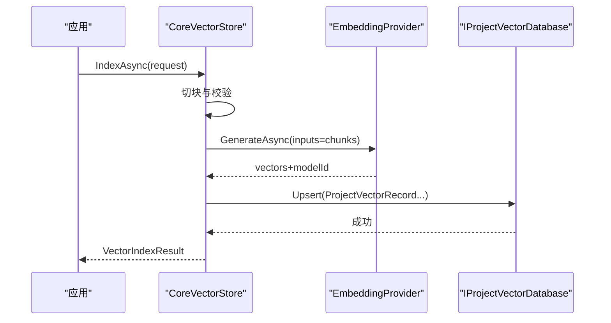

图表来源 
- [VectorStoreModuleRegistrar.cs:41-63](file://TinadecCore/VectorStore/VectorStoreModuleRegistrar.cs#L41-L63)
- [ModelsModuleRegistrar.cs:85-109](file://TinadecCore/Models/ModelsModuleRegistrar.cs#L85-L109)

### 典型调用序列（循环保护评估）
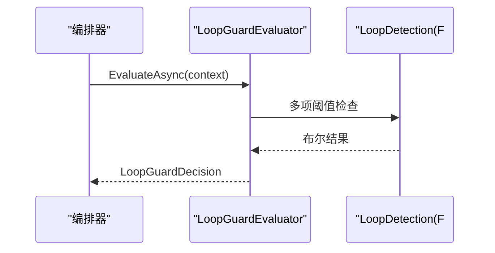

图表来源 
- [LoopGuardModuleRegistrar.cs:35-83](file://TinadecCore/LoopGuard/LoopGuardModuleRegistrar.cs#L35-L83)

### 配置选项参考
- TenancyOptions：绑定配置节，控制租户上下文行为。
- 模型配置：EmbeddingProvider 依赖 Provider 配置 JSON（base_url、model 等）与 SecretStore 中的 API Key。
- 向量存储：ChunkLength 固定，Dimension 由嵌入模型决定。

章节来源
- [TenancyModuleRegistrar.cs:14-26](file://TinadecCore/Tenancy/TenancyModuleRegistrar.cs#L14-L26)
- [ModelsModuleRegistrar.cs:111-152](file://TinadecCore/Models/ModelsModuleRegistrar.cs#L111-L152)
- [VectorStoreModuleRegistrar.cs:92-103](file://TinadecCore/VectorStore/VectorStoreModuleRegistrar.cs#L92-L103)