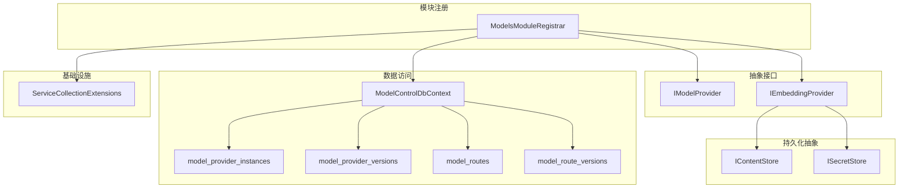
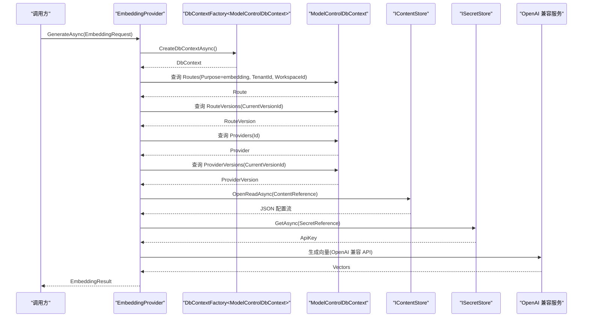
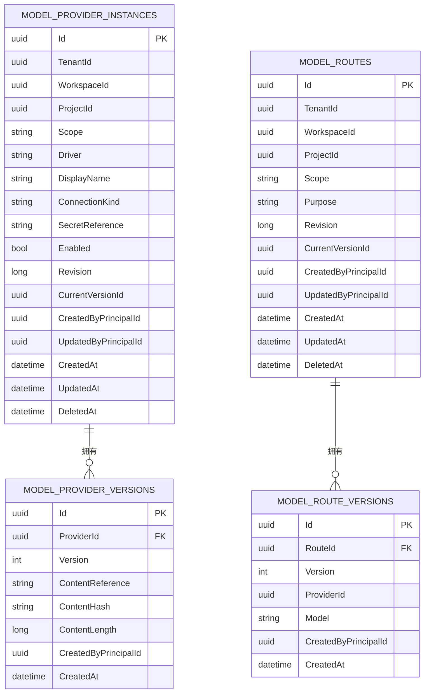
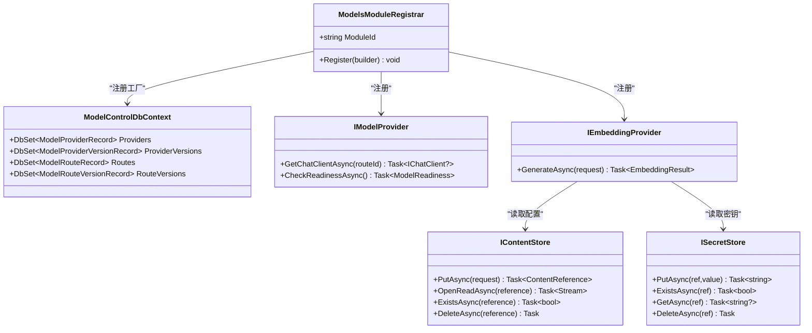
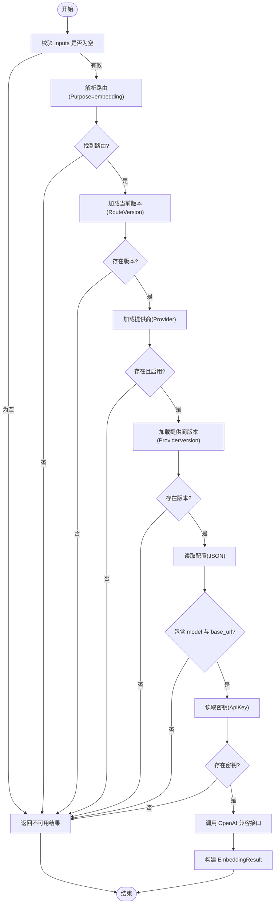
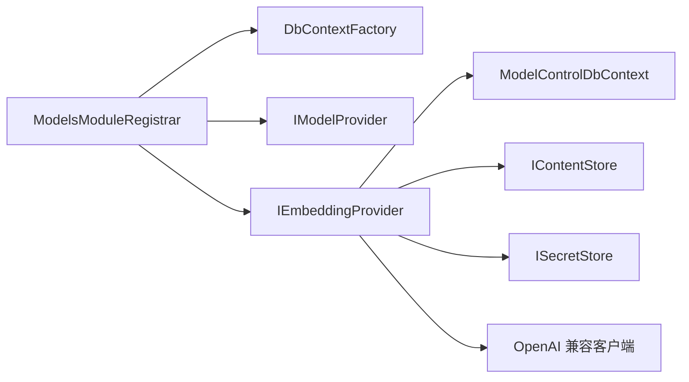

# 模型管理模块

<cite>
**本文引用的文件**   
- [ModelsModuleRegistrar.cs](file://TinadecCore/Models/ModelsModuleRegistrar.cs)
- [ModelControlDbContext.cs](file://TinadecCore/Models/ModelControlDbContext.cs)
- [IModelProvider.cs](file://TinadecCore/Abstractions/Ports/IModelProvider.cs)
- [IModuleRegistrar.cs](file://TinadecCore/Abstractions/IModuleRegistrar.cs)
- [IContentStore.cs](file://TinadecCore/Persistence/IContentStore.cs)
- [ISecretStore.cs](file://TinadecCore/Persistence/ISecretStore.cs)
- [ServiceCollectionExtensions.cs](file://TinadecCore/Persistence/ServiceCollectionExtensions.cs)
</cite>

## 目录
1. [简介](#简介)
2. [项目结构](#项目结构)
3. [核心组件](#核心组件)
4. [架构总览](#架构总览)
5. [详细组件分析](#详细组件分析)
6. [依赖关系分析](#依赖关系分析)
7. [性能考虑](#性能考虑)
8. [故障排查指南](#故障排查指南)
9. [结论](#结论)
10. [附录：配置与使用示例](#附录配置与使用示例)

## 简介
本章节面向“Models 模型管理模块”，聚焦于模型控制数据库上下文的设计、模型元数据与版本控制、配置存储、以及 ModelsModuleRegistrar 的注册机制。该模块通过统一的接口抽象（IModelProvider、IEmbeddingProvider）对外暴露能力，内部以 EF Core 的 ModelControlDbContext 维护 Provider、Route 及其版本的元数据，结合不可变内容存储（IContentStore）与密钥存储（ISecretStore）实现安全、可审计的配置与凭据管理。当前 EmbeddingProvider 实现了基于 OpenAI 兼容接口的向量嵌入生成流程；聊天客户端获取（GetChatClientAsync）为骨架实现，预留了后续扩展空间。

## 项目结构
- 模块入口与注册：ModelsModuleRegistrar 负责向 DI 容器注册 DbContextFactory、迁移参与者、IModelProvider、IEmbeddingProvider，并声明模块描述符（能力、依赖、语言等）。
- 数据访问层：ModelControlDbContext 定义四张核心表（Provider、ProviderVersion、Route、RouteVersion），并通过 OnModelCreating 建立索引与约束。
- 抽象接口：IModelProvider 提供聊天客户端获取与健康检查；IEmbeddingProvider 提供嵌入生成请求/响应契约。
- 持久化抽象：IContentStore 用于不可变大对象存储（JSON 配置等），ISecretStore 用于密钥存取（环境或受保护文件）。
- 持久化基础设施：ServiceCollectionExtensions 统一绑定配置、解析连接信息、选择 SQLite/PostgreSQL 并提供 UseTinadecDatabase 扩展方法。

图表来源
- [ModelsModuleRegistrar.cs:16-36](file://TinadecCore/Models/ModelsModuleRegistrar.cs#L16-L36)
- [ModelControlDbContext.cs:5-39](file://TinadecCore/Models/ModelControlDbContext.cs#L5-L39)
- [IModelProvider.cs:10-26](file://TinadecCore/Abstractions/Ports/IModelProvider.cs#L10-L26)
- [IContentStore.cs:4-10](file://TinadecCore/Persistence/IContentStore.cs#L4-L10)
- [ISecretStore.cs:4-10](file://TinadecCore/Persistence/ISecretStore.cs#L4-L10)
- [ServiceCollectionExtensions.cs:15-49](file://TinadecCore/Persistence/ServiceCollectionExtensions.cs#L15-L49)

章节来源
- [ModelsModuleRegistrar.cs:16-36](file://TinadecCore/Models/ModelsModuleRegistrar.cs#L16-L36)
- [ModelControlDbContext.cs:5-39](file://TinadecCore/Models/ModelControlDbContext.cs#L5-L39)
- [IModelProvider.cs:10-26](file://TinadecCore/Abstractions/Ports/IModelProvider.cs#L10-L26)
- [IContentStore.cs:4-10](file://TinadecCore/Persistence/IContentStore.cs#L4-L10)
- [ISecretStore.cs:4-10](file://TinadecCore/Persistence/ISecretStore.cs#L4-L10)
- [ServiceCollectionExtensions.cs:15-49](file://TinadecCore/Persistence/ServiceCollectionExtensions.cs#L15-L49)

## 核心组件
- ModelsModuleRegistrar
  - 职责：注册 DbContextFactory、迁移参与者、IModelProvider、IEmbeddingProvider，声明模块能力与依赖。
  - 关键点：UseTinadecDatabase 将 EF 选项与底层数据库提供者解耦；RegistrationStatus 初始为 NotConfigured，便于外部编排器感知配置状态。
- ModelControlDbContext
  - 职责：承载模型元数据与版本历史，包含 Provider、ProviderVersion、Route、RouteVersion 四实体。
  - 关键点：租户/工作区/项目维度隔离；软删除字段 DeletedAt；唯一索引保证路由与版本唯一性。
- IModelProvider / IEmbeddingProvider
  - 职责：对外暴露聊天客户端获取与健康检查；嵌入生成请求/响应契约。
  - 关键点：EmbeddingRequest/Result 明确输入输出与可用性信号；ModelReadiness 提供健康状态与警告。
- IContentStore / ISecretStore
  - 职责：不可变内容存储（JSON 配置）、密钥存取（环境变量或平台加密文件）。
  - 关键点：引用语义（ContentReference）与哈希校验（ContentHash）保障一致性。
- ServiceCollectionExtensions
  - 职责：统一绑定 TinadecPersistenceOptions、解析连接信息、选择 SQLite/PostgreSQL、注册默认 SecretStore 与 ContentStore。

章节来源
- [ModelsModuleRegistrar.cs:16-36](file://TinadecCore/Models/ModelsModuleRegistrar.cs#L16-L36)
- [ModelControlDbContext.cs:5-39](file://TinadecCore/Models/ModelControlDbContext.cs#L5-L39)
- [IModelProvider.cs:10-26](file://TinadecCore/Abstractions/Ports/IModelProvider.cs#L10-L26)
- [IContentStore.cs:4-10](file://TinadecCore/Persistence/IContentStore.cs#L4-L10)
- [ISecretStore.cs:4-10](file://TinadecCore/Persistence/ISecretStore.cs#L4-L10)
- [ServiceCollectionExtensions.cs:15-49](file://TinadecCore/Persistence/ServiceCollectionExtensions.cs#L15-L49)

## 架构总览
下图展示从调用方到数据库与外部服务的整体交互路径，重点体现“路由解析—版本回溯—配置读取—密钥获取—OpenAI 兼容调用”的链路。

图表来源
- [ModelsModuleRegistrar.cs:70-168](file://TinadecCore/Models/ModelsModuleRegistrar.cs#L70-L168)
- [ModelControlDbContext.cs:5-39](file://TinadecCore/Models/ModelControlDbContext.cs#L5-L39)
- [IContentStore.cs:4-10](file://TinadecCore/Persistence/IContentStore.cs#L4-L10)
- [ISecretStore.cs:4-10](file://TinadecCore/Persistence/ISecretStore.cs#L4-L10)

## 详细组件分析

### 模型控制数据库上下文（ModelControlDbContext）
- 设计要点
  - 四张核心表：model_provider_instances、model_provider_versions、model_routes、model_route_versions。
  - 多租户隔离：TenantId、WorkspaceId、ProjectId 组合限定作用域。
  - 版本控制：CurrentVersionId 指向最新可用版本；RouteVersion/ProviderVersion 记录具体版本。
  - 软删除：DeletedAt 支持逻辑删除。
  - 索引策略：按租户/工作区/驱动/删除标记建复合索引；路由与版本唯一性约束。
- 复杂度与影响
  - 查询路径短且命中索引，适合高频路由解析。
  - 版本表仅保留引用与哈希，避免大对象入库，提升写入与查询效率。

图表来源
- [ModelControlDbContext.cs:15-38](file://TinadecCore/Models/ModelControlDbContext.cs#L15-L38)

章节来源
- [ModelControlDbContext.cs:5-39](file://TinadecCore/Models/ModelControlDbContext.cs#L5-L39)

### 模块注册器（ModelsModuleRegistrar）
- 职责
  - 注册 DbContextFactory，使各作用域按需创建 DbContext。
  - 注册迁移参与者，确保数据库结构与代码同步。
  - 注册 IModelProvider、IEmbeddingProvider 单例。
  - 声明模块描述符（能力、依赖、语言、状态）。
- 集成点
  - UseTinadecDatabase 将 EF 选项与底层数据库提供者解耦。
  - 通过 RegisterModule 注入 ModuleDescriptor，供上层编排器发现与编排。

图表来源
- [ModelsModuleRegistrar.cs:16-36](file://TinadecCore/Models/ModelsModuleRegistrar.cs#L16-L36)
- [ModelControlDbContext.cs:5-12](file://TinadecCore/Models/ModelControlDbContext.cs#L5-L12)
- [IModelProvider.cs:10-18](file://TinadecCore/Abstractions/Ports/IModelProvider.cs#L10-L18)
- [IEmbeddingProvider.cs:21-26](file://TinadecCore/Abstractions/Ports/IModelProvider.cs#L21-L26)
- [IContentStore.cs:4-10](file://TinadecCore/Persistence/IContentStore.cs#L4-L10)
- [ISecretStore.cs:4-10](file://TinadecCore/Persistence/ISecretStore.cs#L4-L10)

章节来源
- [ModelsModuleRegistrar.cs:16-36](file://TinadecCore/Models/ModelsModuleRegistrar.cs#L16-L36)

### 嵌入提供商（EmbeddingProvider）
- 处理流程
  - 参数校验：Inputs 非空。
  - 路由解析：根据 TenantId、WorkspaceId、Purpose=embedding 查找 Route。
  - 版本回溯：取 Route.CurrentVersionId 对应 RouteVersion。
  - 提供商解析：取 Provider 与 ProviderVersion，校验 Enabled。
  - 配置读取：从 ProviderVersion.ContentReference 读取 JSON 配置（base_url、model 等）。
  - 密钥获取：从 ISecretStore 读取 ApiKey。
  - 调用外部：构造 OpenAIClient（Endpoint 可选），生成向量并返回 EmbeddingResult。
- 错误处理
  - 缺失路由/版本/提供商/禁用/缺少 model/base_url/api_key 时返回 IsAvailable=false 与 Detail 说明。

图表来源
- [ModelsModuleRegistrar.cs:85-158](file://TinadecCore/Models/ModelsModuleRegistrar.cs#L85-L158)

章节来源
- [ModelsModuleRegistrar.cs:70-168](file://TinadecCore/Models/ModelsModuleRegistrar.cs#L70-L168)

### 聊天客户端获取（ModelProvider 骨架）
- 现状
  - GetChatClientAsync 返回 null，表示尚未接入任何聊天提供商。
  - CheckReadinessAsync 返回未就绪状态与警告，提示模块处于骨架状态。
- 扩展建议
  - 在路由解析成功后，依据 ProviderVersion 的驱动类型动态构造 ChatClientAgent 或 IChatClient。
  - 增加重试、超时、熔断与指标上报。

章节来源
- [ModelsModuleRegistrar.cs:43-62](file://TinadecCore/Models/ModelsModuleRegistrar.cs#L43-L62)

## 依赖关系分析
- 模块内依赖
  - ModelsModuleRegistrar 依赖 Persistence 基础设施（UseTinadecDatabase、迁移参与者）。
  - EmbeddingProvider 依赖 ModelControlDbContext、IContentStore、ISecretStore。
- 外部依赖
  - OpenAI SDK（通过 ClientModel 与 IEmbeddingGenerator）。
- 耦合度
  - 通过接口抽象降低耦合，EmbeddingProvider 对 OpenAI 的依赖集中在调用层，易于替换为其他兼容实现。

图表来源
- [ModelsModuleRegistrar.cs:16-36](file://TinadecCore/Models/ModelsModuleRegistrar.cs#L16-L36)
- [ModelsModuleRegistrar.cs:70-168](file://TinadecCore/Models/ModelsModuleRegistrar.cs#L70-L168)

章节来源
- [ModelsModuleRegistrar.cs:16-36](file://TinadecCore/Models/ModelsModuleRegistrar.cs#L16-L36)
- [ModelsModuleRegistrar.cs:70-168](file://TinadecCore/Models/ModelsModuleRegistrar.cs#L70-L168)

## 性能考虑
- 数据库查询
  - 路由解析路径命中复合索引，避免全表扫描；AsNoTracking 减少变更跟踪开销。
- 配置与密钥
  - 配置以不可变内容存储，避免频繁读写大对象；密钥通过引用获取，减少敏感数据落库。
- 可扩展性
  - 当前 EmbeddingProvider 每次调用均解析路由与版本，若调用频率高，可在应用层引入缓存（如内存缓存 ProviderVersion 与配置片段），注意失效策略与一致性。

[本节为通用指导，不直接分析具体文件]

## 故障排查指南
- 常见问题定位
  - 路由缺失：确认 Purpose=embedding、TenantId、WorkspaceId 是否正确，且未被软删除。
  - 版本缺失：检查 Route.CurrentVersionId 是否存在对应的 RouteVersion。
  - 提供商禁用：Provider.Enabled 必须为 true。
  - 配置不完整：ProviderVersion 的 JSON 需包含 model 与 base_url。
  - 密钥缺失：SecretReference 对应的密钥不存在或未设置。
- 健康检查
  - 通过 CheckReadinessAsync 获取 IsReady 与 Warnings，快速判断模块是否已配置。

章节来源
- [ModelsModuleRegistrar.cs:85-158](file://TinadecCore/Models/ModelsModuleRegistrar.cs#L85-L158)
- [ModelsModuleRegistrar.cs:53-61](file://TinadecCore/Models/ModelsModuleRegistrar.cs#L53-L61)

## 结论
Models 模块通过清晰的抽象与分层设计，实现了模型元数据与版本控制、配置与密钥的安全管理，并以 EmbeddingProvider 展示了完整的“路由—版本—配置—密钥—外部调用”链路。当前聊天客户端获取仍为骨架，未来可按相同模式扩展多种提供商。建议在高频调用场景下引入合理的缓存与监控，以提升性能与可观测性。

[本节为总结性内容，不直接分析具体文件]

## 附录：配置与使用示例
- 添加新的模型提供商（步骤概述）
  - 在 model_provider_instances 中新增一条记录，指定 Driver、DisplayName、ConnectionKind、Scope、Enabled 等。
  - 在 model_provider_versions 中新增版本，写入 ContentReference（JSON 配置）与 ContentHash。
  - 在 model_routes 中新增路由（Purpose=embedding/chat），指定 Scope、TenantId、WorkspaceId、ProjectId。
  - 在 model_route_versions 中关联 ProviderId 与 Model，并设置为当前版本。
  - 在 ISecretStore 中保存 ApiKey（SecretReference）。
- 使用 IEmbeddingProvider
  - 构造 EmbeddingRequest（TenantId、WorkspaceId、ProjectId、Inputs）。
  - 调用 GenerateAsync，根据 EmbeddingResult.IsAvailable 与 Detail 判断成功与否。
- 使用 IModelProvider
  - 调用 GetChatClientAsync(routeId) 获取聊天客户端（当前骨架返回 null）。
  - 调用 CheckReadinessAsync 获取健康状态。

章节来源
- [ModelControlDbContext.cs:15-38](file://TinadecCore/Models/ModelControlDbContext.cs#L15-L38)
- [IModelProvider.cs:10-26](file://TinadecCore/Abstractions/Ports/IModelProvider.cs#L10-L26)
- [IContentStore.cs:4-10](file://TinadecCore/Persistence/IContentStore.cs#L4-L10)
- [ISecretStore.cs:4-10](file://TinadecCore/Persistence/ISecretStore.cs#L4-L10)
- [ServiceCollectionExtensions.cs:15-49](file://TinadecCore/Persistence/ServiceCollectionExtensions.cs#L15-L49)