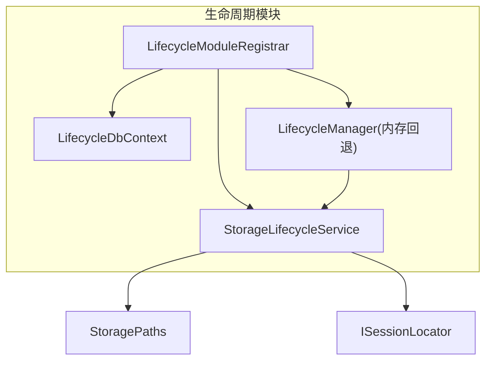
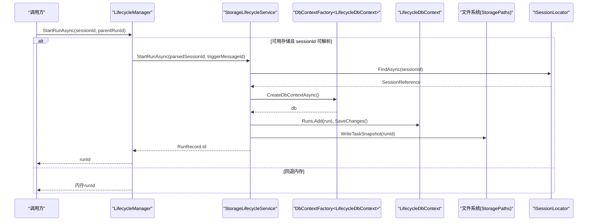
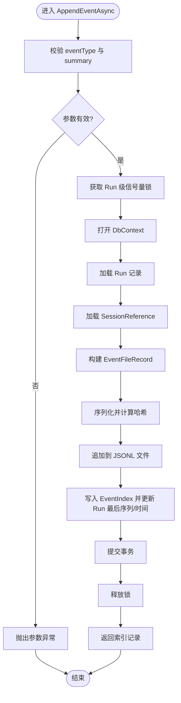
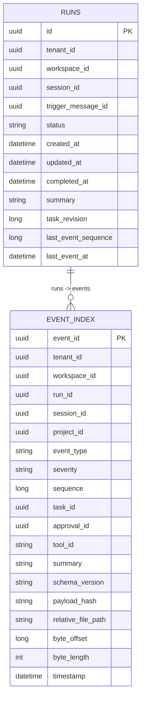
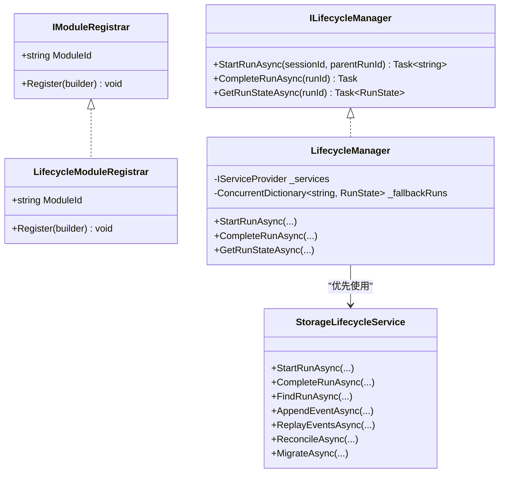
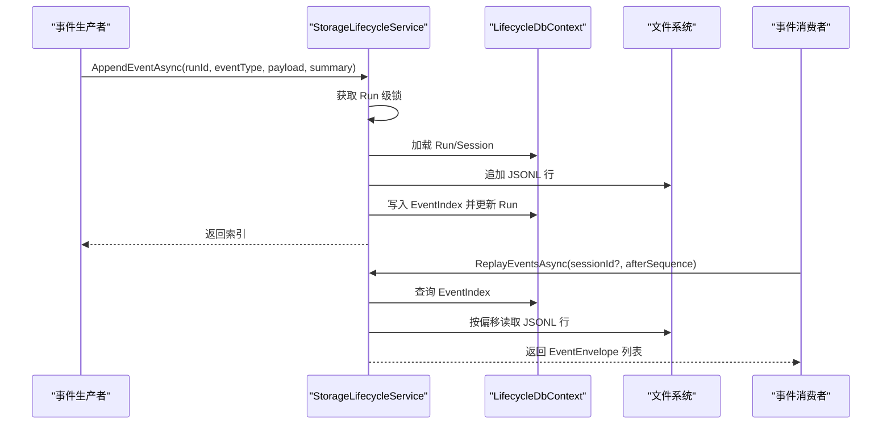
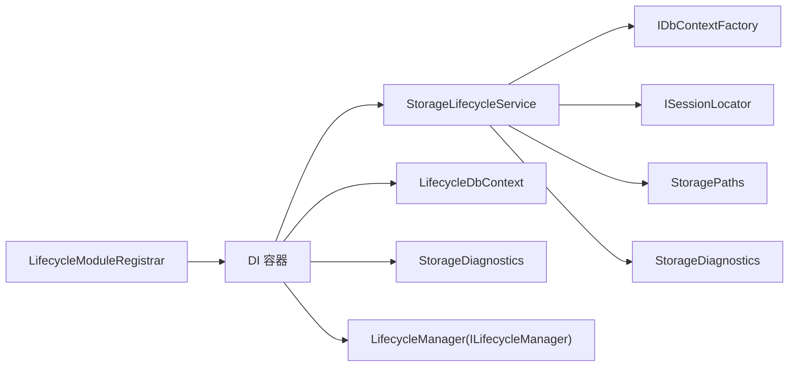

# 生命周期管理模块

<cite>
**本文引用的文件**   
- [StorageLifecycleService.cs](file://TinadecCore/Lifecycle/StorageLifecycleService.cs)
- [LifecycleDbContext.cs](file://TinadecCore/Lifecycle/LifecycleDbContext.cs)
- [LifecycleModuleRegistrar.cs](file://TinadecCore/Lifecycle/LifecycleModuleRegistrar.cs)
- [ILifecycleManager.cs](file://TinadecCore/Abstractions/Ports/ILifecycleManager.cs)
- [ISessionLocator.cs](file://TinadecCore/Abstractions/Ports/ISessionLocator.cs)
- [StoragePaths.cs](file://TinadecCore/Persistence/StoragePaths.cs)
- [IModuleRegistrar.cs](file://TinadecCore/Abstractions/IModuleRegistrar.cs)
</cite>

## 目录
1. [简介](#简介)
2. [项目结构](#项目结构)
3. [核心组件](#核心组件)
4. [架构总览](#架构总览)
5. [详细组件分析](#详细组件分析)
6. [依赖关系分析](#依赖关系分析)
7. [性能考量](#性能考量)
8. [故障排查指南](#故障排查指南)
9. [结论](#结论)
10. [附录：配置与扩展指南](#附录：配置与扩展指南)

## 简介
本模块负责“存储型”运行（Run）的全生命周期管理与审计事件持久化，提供启动、完成、事件追加、回放与一致性修复等能力。通过 DbContext 持久化状态，结合 JSONL 文件进行高吞吐事件写入，并以索引表支撑高效查询与回放。模块以 IModuleRegistrar 形式集成到核心框架，对外暴露 ILifecycleManager 接口供上层编排调用。

## 项目结构
- 生命周期服务：StorageLifecycleService 实现 IStorageMigrationParticipant，负责 Run 与事件的生命周期操作、JSONL 追加与回放、数据一致性修复与迁移。
- 数据上下文：LifecycleDbContext 定义 Runs、EventIndex 及策略、审批、工件、控制事件等实体映射与索引。
- 模块注册器：LifecycleModuleRegistrar 将 DbContextFactory、诊断、存储服务、生命周期管理器注册到 DI，并声明模块元信息。
- 外部依赖：StoragePaths 解析 Core 拥有的文件路径；ISessionLocator 用于会话边界校验；ILifecycleManager 为统一入口。

**图表来源** 
- [LifecycleModuleRegistrar.cs:1-35](file://TinadecCore/Lifecycle/LifecycleModuleRegistrar.cs#L1-L35)
- [StorageLifecycleService.cs:12-31](file://TinadecCore/Lifecycle/StorageLifecycleService.cs#L12-L31)
- [LifecycleDbContext.cs:5-17](file://TinadecCore/Lifecycle/LifecycleDbContext.cs#L5-L17)
- [StoragePaths.cs:4-17](file://TinadecCore/Persistence/StoragePaths.cs#L4-L17)
- [ISessionLocator.cs:4-9](file://TinadecCore/Abstractions/Ports/ISessionLocator.cs#L4-L9)

**章节来源**
- [LifecycleModuleRegistrar.cs:1-35](file://TinadecCore/Lifecycle/LifecycleModuleRegistrar.cs#L1-L35)
- [StorageLifecycleService.cs:12-31](file://TinadecCore/Lifecycle/StorageLifecycleService.cs#L12-L31)
- [LifecycleDbContext.cs:5-17](file://TinadecCore/Lifecycle/LifecycleDbContext.cs#L5-L17)
- [StoragePaths.cs:4-17](file://TinadecCore/Persistence/StoragePaths.cs#L4-L17)
- [ISessionLocator.cs:4-9](file://TinadecCore/Abstractions/Ports/ISessionLocator.cs#L4-L9)

## 核心组件
- StorageLifecycleService：Run 的创建、查询、完成；事件追加（JSONL + 索引）、回放、一致性修复；迁移参与。
- LifecycleDbContext：Runs、EventIndex 等实体的 EF Core 模型与索引定义。
- LifecycleManager：面向上层的 ILifecycleManager 实现，优先使用持久化存储，不可用时回退到内存字典。
- StoragePaths：安全解析 Core 拥有文件的根路径与相对路径，防止越权访问。
- ISessionLocator：跨模块会话定位，确保 Run/事件归属租户与工作区边界。

**章节来源**
- [StorageLifecycleService.cs:12-31](file://TinadecCore/Lifecycle/StorageLifecycleService.cs#L12-L31)
- [LifecycleDbContext.cs:5-86](file://TinadecCore/Lifecycle/LifecycleDbContext.cs#L5-L86)
- [LifecycleModuleRegistrar.cs:42-99](file://TinadecCore/Lifecycle/LifecycleModuleRegistrar.cs#L42-L99)
- [StoragePaths.cs:4-53](file://TinadecCore/Persistence/StoragePaths.cs#L4-L53)
- [ISessionLocator.cs:4-9](file://TinadecCore/Abstractions/Ports/ISessionLocator.cs#L4-L9)

## 架构总览
生命周期模块采用“数据库索引 + 文件日志”的混合持久化模式：
- 关键状态（Run、EventIndex）由 EF Core 持久化，保证事务一致性与查询能力。
- 事件正文以 JSONL 追加写入，避免频繁更新大对象，提升写入吞吐。
- 模块通过 IModuleRegistrar 显式注册，声明能力与依赖，便于核心框架装配。

**图表来源** 
- [LifecycleModuleRegistrar.cs:42-64](file://TinadecCore/Lifecycle/LifecycleModuleRegistrar.cs#L42-L64)
- [StorageLifecycleService.cs:33-50](file://TinadecCore/Lifecycle/StorageLifecycleService.cs#L33-L50)
- [ISessionLocator.cs:4-9](file://TinadecCore/Abstractions/Ports/ISessionLocator.cs#L4-L9)
- [StoragePaths.cs:21-24](file://TinadecCore/Persistence/StoragePaths.cs#L21-L24)

## 详细组件分析

### StorageLifecycleService：存储服务全生命周期
- 启动运行 StartRunAsync：校验会话存在，创建 Run 记录，初始化任务快照与制品目录。
- 列出/查找运行 ListRunsAsync / FindRunAsync：按会话与租户工作区过滤，返回排序后的运行列表。
- 完成运行 CompleteRunAsync：标记状态为 completed，更新时间戳。
- 追加事件 AppendEventAsync：线程安全（每 Run 一个信号量），序列化事件到 JSONL，计算哈希，写入 EventIndex 并更新 Run 的最后序列与时间。
- 回放事件 ReplayEventsAsync：基于 EventIndex 扫描，按偏移读取 JSONL 行，反序列化为 EventEnvelope。
- 一致性修复 ReconcileAsync：遍历现有 Run 的事件文件，补齐缺失的索引条目，忽略不完整或畸形行。
- 迁移 MigrateAsync：执行 EF 迁移与自定义 Schema 引导。

**图表来源** 
- [StorageLifecycleService.cs:78-144](file://TinadecCore/Lifecycle/StorageLifecycleService.cs#L78-L144)

**章节来源**
- [StorageLifecycleService.cs:33-50](file://TinadecCore/Lifecycle/StorageLifecycleService.cs#L33-L50)
- [StorageLifecycleService.cs:52-65](file://TinadecCore/Lifecycle/StorageLifecycleService.cs#L52-L65)
- [StorageLifecycleService.cs:67-76](file://TinadecCore/Lifecycle/StorageLifecycleService.cs#L67-L76)
- [StorageLifecycleService.cs:78-144](file://TinadecCore/Lifecycle/StorageLifecycleService.cs#L78-L144)
- [StorageLifecycleService.cs:146-179](file://TinadecCore/Lifecycle/StorageLifecycleService.cs#L146-L179)
- [StorageLifecycleService.cs:181-217](file://TinadecCore/Lifecycle/StorageLifecycleService.cs#L181-L217)
- [StorageLifecycleService.cs:219-224](file://TinadecCore/Lifecycle/StorageLifecycleService.cs#L219-L224)

### LifecycleDbContext：生命周期状态持久化
- 实体集合：Runs、EventIndex、PolicySets、PolicyVersions、ApprovalRequests、ApprovalDecisions、RunConfigurationBindings、ArtifactIndex、ControlEventIndex。
- 索引设计：Runs 按租户/工作区/会话/时间、会话/状态/更新时间索引；EventIndex 按 Run+Sequence 唯一、租户/工作区/会话/时间、ProjectId/时间、审批/类型/时间等多维索引，支撑高效查询与回放。
- 字段约束：长度限制与必填校验，保障数据质量。

**图表来源** 
- [LifecycleDbContext.cs:21-86](file://TinadecCore/Lifecycle/LifecycleDbContext.cs#L21-L86)

**章节来源**
- [LifecycleDbContext.cs:5-86](file://TinadecCore/Lifecycle/LifecycleDbContext.cs#L5-L86)

### LifecycleManager：模块注册器与运行时协调
- 依赖注入：注册 DbContextFactory、StorageDiagnostics、StorageLifecycleService、IStorageMigrationParticipant、ILifecycleManager。
- 内存回退：当存储不可用或 sessionId 无法解析时，使用 ConcurrentDictionary 维护 RunState，保证基本可用性。
- 能力声明：模块标识、版本、依赖、能力集、语言与 MAF 原语。

**图表来源** 
- [LifecycleModuleRegistrar.cs:13-34](file://TinadecCore/Lifecycle/LifecycleModuleRegistrar.cs#L13-L34)
- [LifecycleModuleRegistrar.cs:42-99](file://TinadecCore/Lifecycle/LifecycleModuleRegistrar.cs#L42-L99)
- [ILifecycleManager.cs:8-41](file://TinadecCore/Abstractions/Ports/ILifecycleManager.cs#L8-L41)
- [StorageLifecycleService.cs:12-31](file://TinadecCore/Lifecycle/StorageLifecycleService.cs#L12-L31)

**章节来源**
- [LifecycleModuleRegistrar.cs:13-34](file://TinadecCore/Lifecycle/LifecycleModuleRegistrar.cs#L13-L34)
- [LifecycleModuleRegistrar.cs:42-99](file://TinadecCore/Lifecycle/LifecycleModuleRegistrar.cs#L42-L99)
- [ILifecycleManager.cs:8-41](file://TinadecCore/Abstractions/Ports/ILifecycleManager.cs#L8-L41)

### 事件订阅与处理机制
- 事件写入：AppendEventAsync 将事件写入 JSONL 并建立索引，支持按会话、时间、类型等维度回放。
- 事件回放：ReplayEventsAsync 根据 EventIndex 的 ByteOffset/ByteLength 精准读取对应行，反序列化为 EventEnvelope。
- 一致性修复：ReconcileAsync 扫描所有 Run 的事件文件，补建缺失索引，忽略不完整或畸形行，确保索引与文件一致。
- 并发控制：每个 Run 使用独立 SemaphoreSlim 保证事件追加顺序与幂等性。

**图表来源** 
- [StorageLifecycleService.cs:78-144](file://TinadecCore/Lifecycle/StorageLifecycleService.cs#L78-L144)
- [StorageLifecycleService.cs:146-179](file://TinadecCore/Lifecycle/StorageLifecycleService.cs#L146-L179)
- [StorageLifecycleService.cs:181-217](file://TinadecCore/Lifecycle/StorageLifecycleService.cs#L181-L217)

**章节来源**
- [StorageLifecycleService.cs:78-144](file://TinadecCore/Lifecycle/StorageLifecycleService.cs#L78-L144)
- [StorageLifecycleService.cs:146-179](file://TinadecCore/Lifecycle/StorageLifecycleService.cs#L146-L179)
- [StorageLifecycleService.cs:181-217](file://TinadecCore/Lifecycle/StorageLifecycleService.cs#L181-L217)

### 健康检查机制
- 当前实现未内置专用健康检查端点或方法。可通过以下方式间接评估健康：
  - 数据库连通性：调用 MigrateAsync 或简单查询 Runs/EventIndex 判断连接与迁移状态。
  - 文件系统可用性：尝试写入临时任务快照或事件行，验证 StoragePaths 解析与磁盘权限。
  - 会话定位：调用 ISessionLocator.FindAsync 验证跨模块会话查询是否正常。
- 建议在应用层封装 HealthCheck 聚合上述检查项，返回就绪/健康状态。

[本节为通用指导，不直接分析具体文件]

## 依赖关系分析
- 模块内依赖：LifecycleModuleRegistrar 依赖 Abstractions、Persistence、Strategies，并注册 StorageLifecycleService、LifecycleDbContext、StorageDiagnostics、ILifecycleManager。
- 运行时依赖：StorageLifecycleService 依赖 IDbContextFactory<LifecycleDbContext>、ISessionLocator、StoragePaths、StorageDiagnostics。
- 外部契约：ILifecycleManager 作为统一入口，屏蔽底层存储细节，允许内存回退。

**图表来源** 
- [LifecycleModuleRegistrar.cs:17-34](file://TinadecCore/Lifecycle/LifecycleModuleRegistrar.cs#L17-L34)
- [StorageLifecycleService.cs:21-31](file://TinadecCore/Lifecycle/StorageLifecycleService.cs#L21-L31)

**章节来源**
- [LifecycleModuleRegistrar.cs:17-34](file://TinadecCore/Lifecycle/LifecycleModuleRegistrar.cs#L17-L34)
- [StorageLifecycleService.cs:21-31](file://TinadecCore/Lifecycle/StorageLifecycleService.cs#L21-L31)
- [IModuleRegistrar.cs:9-16](file://TinadecCore/Abstractions/IModuleRegistrar.cs#L9-L16)

## 性能考量
- 事件追加：JSONL 追加写具备高吞吐特性，配合字节偏移与长度索引，避免全文扫描。
- 并发控制：每 Run 一个信号量，保证顺序写入与幂等性，减少竞争开销。
- 事务边界：事件索引与 Run 最后序列更新在同一事务中，保证一致性。
- 文件 I/O：WriteThrough 与强制刷新确保落盘，但可能影响吞吐；在高频场景可考虑异步批处理与缓冲策略。
- 查询优化：EventIndex 多维索引覆盖常见查询路径，建议按需添加复合索引。

[本节为通用指导，不直接分析具体文件]

## 故障排查指南
- 会话不存在：StartRunAsync 会抛出 KeyNotFoundException，确认 ISessionLocator 是否可用与会话是否存在。
- 运行不存在：AppendEventAsync 找不到 Run 会抛 KeyNotFoundException，检查 Run 创建流程与 ID 传递。
- 事件重复或缺失：ReconcileAsync 会补建缺失索引，忽略不完整或畸形行；检查 JSONL 完整性与写入原子性。
- 路径越界：StoragePaths 对路径进行前缀校验，若抛出异常需检查 DataRoot 配置与引用格式。
- 迁移失败：MigrateAsync 失败时检查数据库连接与迁移脚本，必要时回滚并清理脏数据。

**章节来源**
- [StorageLifecycleService.cs:33-50](file://TinadecCore/Lifecycle/StorageLifecycleService.cs#L33-L50)
- [StorageLifecycleService.cs:78-144](file://TinadecCore/Lifecycle/StorageLifecycleService.cs#L78-L144)
- [StorageLifecycleService.cs:181-217](file://TinadecCore/Lifecycle/StorageLifecycleService.cs#L181-L217)
- [StoragePaths.cs:44-53](file://TinadecCore/Persistence/StoragePaths.cs#L44-L53)
- [StorageLifecycleService.cs:219-224](file://TinadecCore/Lifecycle/StorageLifecycleService.cs#L219-L224)

## 结论
生命周期模块以“数据库索引 + JSONL 文件”的混合持久化方案，提供了高可靠、高性能的运行与事件管理能力。通过模块注册器与统一接口，实现了与核心框架的松耦合集成，并在存储不可用时提供内存回退，增强系统韧性。建议在生产环境完善健康检查与监控指标，持续优化 I/O 与查询性能。

[本节为总结，不直接分析具体文件]

## 附录：配置与扩展指南
- 基础配置
  - 数据根目录：配置 TinadecPersistenceOptions.DataRoot，确保 StoragePaths 能正确解析绝对路径与安全子目录。
  - 数据库连接：通过 UseTinadecDatabase 配置 DbContextFactory，确保迁移与索引生效。
- 启用模块
  - 在应用启动时注册 LifecycleModuleRegistrar，确保 Services 与模块描述符被正确注入。
- 扩展开发
  - 新增事件类型：在 AppendEventAsync 中保持 EventType/Summary/Severity 规范，确保 EventIndex 字段长度与索引匹配。
  - 自定义健康检查：封装数据库连通性、文件写入、会话定位的检查逻辑，返回就绪/健康状态。
  - 性能调优：评估 WriteThrough 与 Flush 频率，必要时引入异步批处理与缓冲队列。
- 示例步骤（无代码片段）
  - 在应用初始化阶段调用 Register，传入 ITinadecCoreBuilder。
  - 通过 ILifecycleManager.StartRunAsync 创建运行，随后使用 AppendEventAsync 追加事件。
  - 使用 ReplayEventsAsync 回放事件，结合 ReconcileAsync 定期修复一致性。

**章节来源**
- [LifecycleModuleRegistrar.cs:17-34](file://TinadecCore/Lifecycle/LifecycleModuleRegistrar.cs#L17-L34)
- [StoragePaths.cs:6-17](file://TinadecCore/Persistence/StoragePaths.cs#L6-L17)
- [ILifecycleManager.cs:8-41](file://TinadecCore/Abstractions/Ports/ILifecycleManager.cs#L8-L41)
- [StorageLifecycleService.cs:219-224](file://TinadecCore/Lifecycle/StorageLifecycleService.cs#L219-L224)