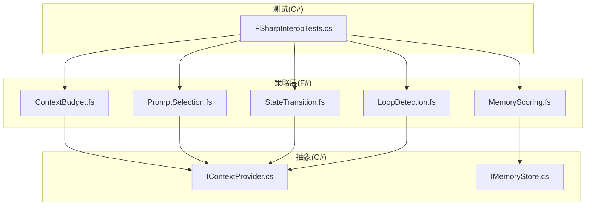
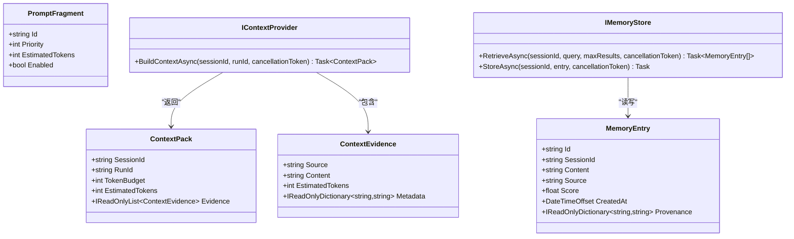
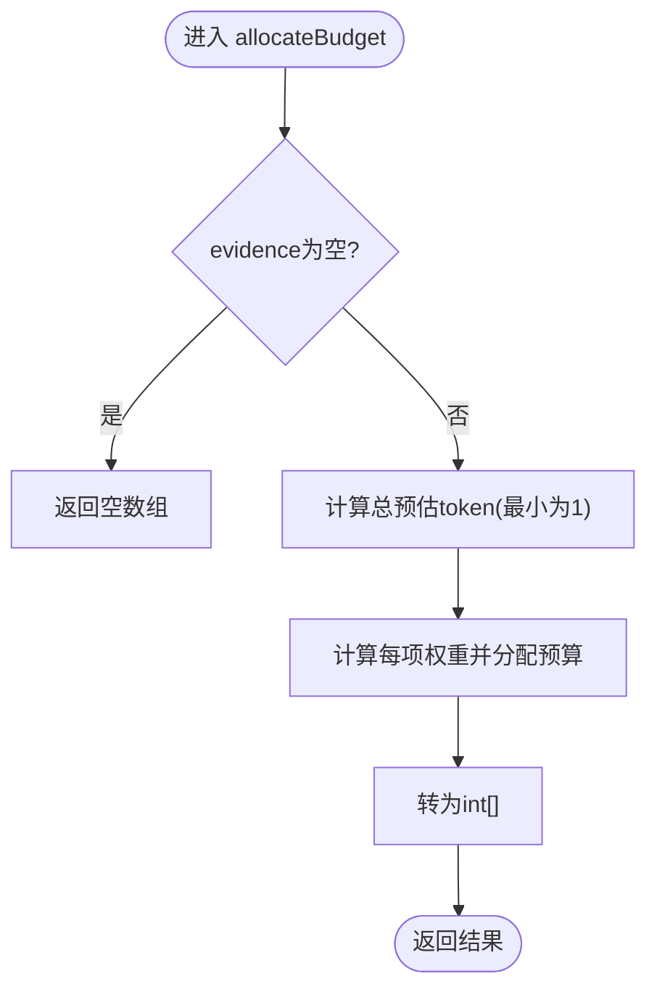
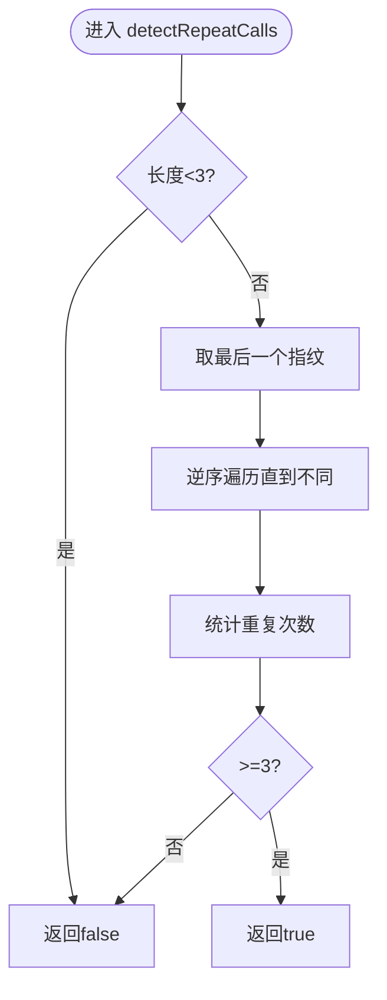
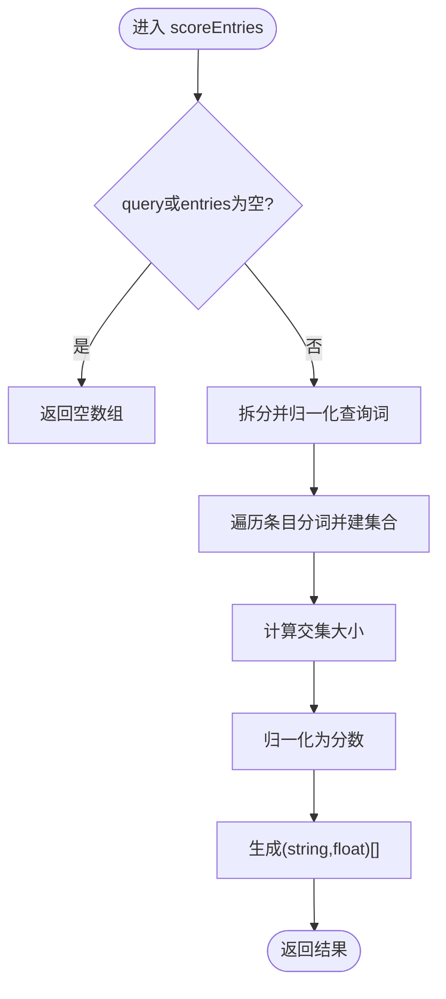
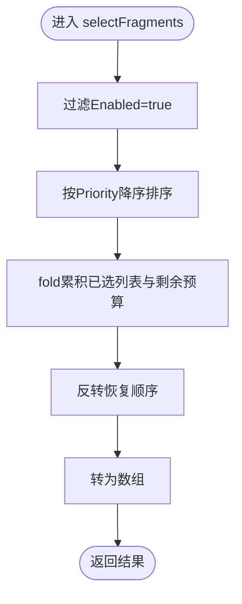
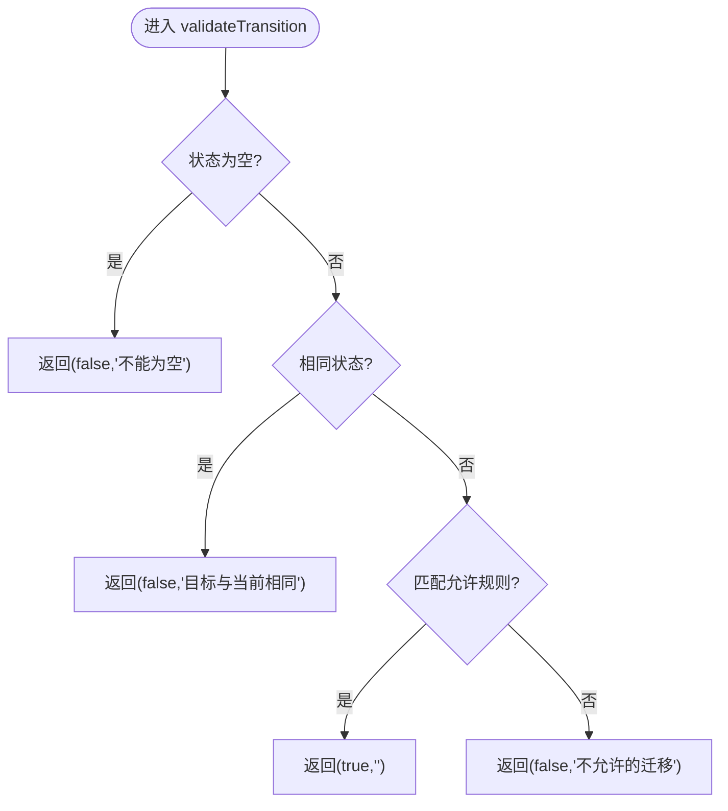
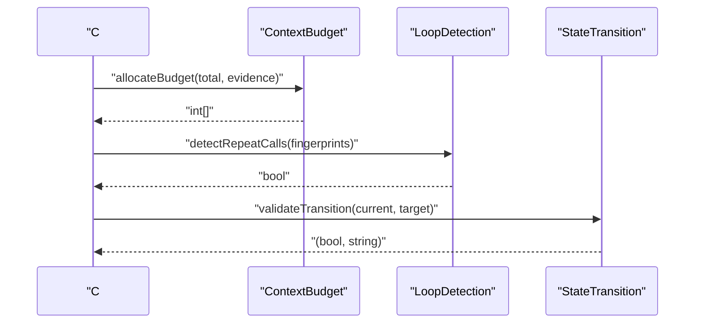
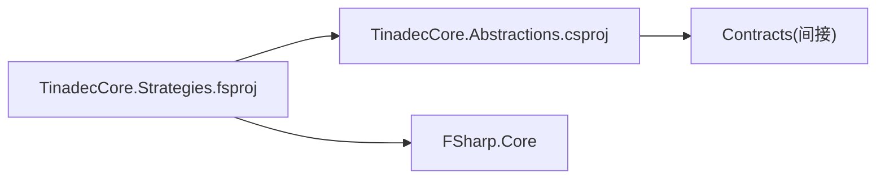

# F#与C#互操作

<cite>
**本文引用的文件**   
- [TinadecCore.Strategies.fsproj](file://TinadecCore/Strategies/TinadecCore.Strategies.fsproj)
- [ContextBudget.fs](file://TinadecCore/Strategies/ContextBudget.fs)
- [LoopDetection.fs](file://TinadecCore/Strategies/LoopDetection.fs)
- [MemoryScoring.fs](file://TinadecCore/Strategies/MemoryScoring.fs)
- [PromptSelection.fs](file://TinadecCore/Strategies/PromptSelection.fs)
- [StateTransition.fs](file://TinadecCore/Strategies/StateTransition.fs)
- [FSharpInteropTests.cs](file://TinadecCore/tests/TinadecCore.AgentFramework.Tests/FSharpInteropTests.cs)
- [IContextProvider.cs](file://TinadecCore/Abstractions/Ports/IContextProvider.cs)
- [IMemoryStore.cs](file://TinadecCore/Abstractions/Ports/IMemoryStore.cs)
- [Directory.Build.props](file://TinadecCore/Directory.Build.props)
- [Directory.Packages.props](file://TinadecCore/Directory.Packages.props)
- [TinadecCore.Abstractions.csproj](file://TinadecCore/Abstractions/TinadecCore.Abstractions.csproj)
</cite>

## 目录
1. [简介](#简介)
2. [项目结构](#项目结构)
3. [核心组件](#核心组件)
4. [架构总览](#架构总览)
5. [详细组件分析](#详细组件分析)
6. [依赖关系分析](#依赖关系分析)
7. [性能考虑](#性能考虑)
8. [故障排查指南](#故障排查指南)
9. [结论](#结论)
10. [附录](#附录)

## 简介
本文件面向“策略层（F#）与核心（C#）”的互操作机制，系统性说明：
- F# 模块如何以纯函数形式暴露给 C# 调用
- 类型映射与命名空间组织原则
- 在 .NET 环境中的函数式编程最佳实践
- 互操作示例、数据传递与异常处理要点
- 编译配置、依赖管理与调试技巧
- 性能、内存管理与异步模式建议
- 混合项目的构建流程与部署注意事项

## 项目结构
- 策略层位于 TinadecCore/Strategies，使用 F# 编写纯函数式算法，通过 C# 可访问的类型作为输入输出边界。
- 抽象端口定义于 Abstractions/Ports，提供 C# 接口与 DTO，供 F# 策略消费或返回。
- 测试覆盖互操作性，确保 F# 公开签名不泄露 F# 内部类型。

图表来源
- [ContextBudget.fs:1-36](file://TinadecCore/Strategies/ContextBudget.fs#L1-L36)
- [LoopDetection.fs:1-46](file://TinadecCore/Strategies/LoopDetection.fs#L1-L46)
- [MemoryScoring.fs:1-46](file://TinadecCore/Strategies/MemoryScoring.fs#L1-L46)
- [PromptSelection.fs:1-38](file://TinadecCore/Strategies/PromptSelection.fs#L1-L38)
- [StateTransition.fs:1-26](file://TinadecCore/Strategies/StateTransition.fs#L1-L26)
- [IContextProvider.cs:1-37](file://TinadecCore/Abstractions/Ports/IContextProvider.cs#L1-L37)
- [IMemoryStore.cs:1-31](file://TinadecCore/Abstractions/Ports/IMemoryStore.cs#L1-L31)
- [FSharpInteropTests.cs:1-118](file://TinadecCore/tests/TinadecCore.AgentFramework.Tests/FSharpInteropTests.cs#L1-L118)

章节来源
- [TinadecCore.Strategies.fsproj:1-27](file://TinadecCore/Strategies/TinadecCore.Strategies.fsproj#L1-L27)
- [Directory.Build.props:1-21](file://TinadecCore/Directory.Build.props#L1-L21)
- [Directory.Packages.props:1-53](file://TinadecCore/Directory.Packages.props#L1-L53)

## 核心组件
- ContextBudget：按权重分配 token 预算，返回 C# 兼容的 int[]。
- LoopDetection：检测连续重复指纹、迭代/工具调用/错误等限制。
- MemoryScoring：基于关键词重叠计算相关性得分，支持筛选排序。
- PromptSelection：按优先级和 token 预算选择提示片段，使用 CLIMutable record 与 C# 互通。
- StateTransition：状态机转换校验，返回 (bool, string) 元组。

章节来源
- [ContextBudget.fs:1-36](file://TinadecCore/Strategies/ContextBudget.fs#L1-L36)
- [LoopDetection.fs:1-46](file://TinadecCore/Strategies/LoopDetection.fs#L1-L46)
- [MemoryScoring.fs:1-46](file://TinadecCore/Strategies/MemoryScoring.fs#L1-L46)
- [PromptSelection.fs:1-38](file://TinadecCore/Strategies/PromptSelection.fs#L1-L38)
- [StateTransition.fs:1-26](file://TinadecCore/Strategies/StateTransition.fs#L1-L26)

## 架构总览
F# 策略层以纯函数为核心，输入输出均为 C# 可识别的类型（数组、基本类型、CLIMutable record）。C# 侧通过接口与 DTO 定义契约，F# 仅消费这些契约类型，保证边界清晰、无 F# 类型泄漏。

图表来源
- [IContextProvider.cs:1-37](file://TinadecCore/Abstractions/Ports/IContextProvider.cs#L1-L37)
- [IMemoryStore.cs:1-31](file://TinadecCore/Abstractions/Ports/IMemoryStore.cs#L1-L31)
- [PromptSelection.fs:1-38](file://TinadecCore/Strategies/PromptSelection.fs#L1-L38)

## 详细组件分析

### 上下文预算分配（ContextBudget）
- 功能：根据证据项的预估 token 比例分配总预算，返回 C# 兼容的 int[]。
- 复杂度：线性扫描求和与映射，时间 O(n)，空间 O(n)。
- 互操作要点：输入为 IReadOnlyList<ContextEvidence>，输出为 int[]；避免 F# List 泄漏。

图表来源
- [ContextBudget.fs:11-24](file://TinadecCore/Strategies/ContextBudget.fs#L11-L24)

章节来源
- [ContextBudget.fs:1-36](file://TinadecCore/Strategies/ContextBudget.fs#L1-L36)

### 循环检测（LoopDetection）
- 功能：检测连续重复指纹（≥3次）、迭代上限、token 预算耗尽、工具调用上限、连续错误上限。
- 复杂度：逆序扫描取前缀匹配，时间 O(k)（k为尾部重复长度），空间 O(1)。

图表来源
- [LoopDetection.fs:11-21](file://TinadecCore/Strategies/LoopDetection.fs#L11-L21)

章节来源
- [LoopDetection.fs:1-46](file://TinadecCore/Strategies/LoopDetection.fs#L1-L46)

### 记忆评分（MemoryScoring）
- 功能：将查询分词后与条目内容分词做集合交集，计算相关度分数；支持过滤与排序。
- 复杂度：分词与集合构建 O(m+n)，交集与计数 O(min(|Q|,|E|))；topEntries 排序 O(r log r)。

图表来源
- [MemoryScoring.fs:11-32](file://TinadecCore/Strategies/MemoryScoring.fs#L11-L32)

章节来源
- [MemoryScoring.fs:1-46](file://TinadecCore/Strategies/MemoryScoring.fs#L1-L46)

### 提示选择（PromptSelection）
- 功能：按优先级降序选择启用且不超过 token 预算的片段，返回 C# 兼容数组。
- 类型：使用 [<CLIMutable>] 记录，确保 C# 可构造与序列化。

图表来源
- [PromptSelection.fs:22-37](file://TinadecCore/Strategies/PromptSelection.fs#L22-L37)

章节来源
- [PromptSelection.fs:1-38](file://TinadecCore/Strategies/PromptSelection.fs#L1-L38)

### 状态转换（StateTransition）
- 功能：校验状态迁移是否允许，返回 (bool, reason) 元组。
- 设计：纯函数，无副作用，便于单元测试与推理。

图表来源
- [StateTransition.fs:10-25](file://TinadecCore/Strategies/StateTransition.fs#L10-L25)

章节来源
- [StateTransition.fs:1-26](file://TinadecCore/Strategies/StateTransition.fs#L1-L26)

### C# 调用 F# 的序列流程（示例）
- 测试用例展示了从 C# 调用 F# 函数的典型流程：准备输入、调用函数、断言返回类型为 C# 原生类型。

图表来源
- [FSharpInteropTests.cs:15-75](file://TinadecCore/tests/TinadecCore.AgentFramework.Tests/FSharpInteropTests.cs#L15-L75)
- [ContextBudget.fs:11-24](file://TinadecCore/Strategies/ContextBudget.fs#L11-L24)
- [LoopDetection.fs:11-21](file://TinadecCore/Strategies/LoopDetection.fs#L11-L21)
- [StateTransition.fs:10-25](file://TinadecCore/Strategies/StateTransition.fs#L10-L25)

章节来源
- [FSharpInteropTests.cs:1-118](file://TinadecCore/tests/TinadecCore.AgentFramework.Tests/FSharpInteropTests.cs#L1-L118)

## 依赖关系分析
- F# 策略库引用 C# 抽象端口，形成单向依赖：F# → C# 接口与 DTO。
- 包版本集中管理，FSharp.Core 锁定稳定版本，避免运行时不兼容。

图表来源
- [TinadecCore.Strategies.fsproj:10-16](file://TinadecCore/Strategies/TinadecCore.Strategies.fsproj#L10-L16)
- [TinadecCore.Abstractions.csproj:9-17](file://TinadecCore/Abstractions/TinadecCore.Abstractions.csproj#L9-L17)
- [Directory.Packages.props:40-42](file://TinadecCore/Directory.Packages.props#L40-L42)

章节来源
- [TinadecCore.Strategies.fsproj:1-27](file://TinadecCore/Strategies/TinadecCore.Strategies.fsproj#L1-L27)
- [TinadecCore.Abstractions.csproj:1-20](file://TinadecCore/Abstractions/TinadecCore.Abstractions.csproj#L1-L20)
- [Directory.Packages.props:1-53](file://TinadecCore/Directory.Packages.props#L1-L53)

## 性能考虑
- 数据结构选择：优先使用 IReadOnlyList<T> 与数组，避免不必要的装箱与拷贝。
- 流式处理：F# Seq 惰性求值适合大数据集，但注意最终 toArray 的开销。
- 字符串处理：分词与集合构建应复用常量分隔符，减少临时对象。
- 数值精度：ratio 计算使用 double，避免 float 精度问题导致的偏差。
- 内存管理：尽量原地转换与就地过滤，减少中间集合创建。

[本节为通用指导，无需特定文件来源]

## 故障排查指南
- 类型泄漏检查：确保 F# 公开函数返回 C# 原生类型（如 int[]、bool、double、tuple），而非 FSharpList 或 Option。
- 空值与边界：对 null 与空集合进行防御性检查，避免空引用异常。
- 异常处理：F# 纯函数不抛异常，C# 侧应在调用点捕获并转换为领域异常。
- 调试技巧：使用 xUnit 断言返回值类型与长度，快速定位互操作问题。

章节来源
- [FSharpInteropTests.cs:87-116](file://TinadecCore/tests/TinadecCore.AgentFramework.Tests/FSharpInteropTests.cs#L87-L116)
- [ContextBudget.fs:11-14](file://TinadecCore/Strategies/ContextBudget.fs#L11-L14)
- [LoopDetection.fs:11-14](file://TinadecCore/Strategies/LoopDetection.fs#L11-L14)
- [MemoryScoring.fs:11-14](file://TinadecCore/Strategies/MemoryScoring.fs#L11-L14)

## 结论
本项目通过清晰的契约边界与纯函数式设计，实现了 F# 策略层与 C# 核心的稳定互操作。类型映射严格遵循 C# 原生类型，测试覆盖确保无 F# 类型泄漏。建议在后续扩展中继续坚持函数式风格、保持单向依赖与集中包管理，以获得更好的可维护性与性能表现。

[本节为总结，无需特定文件来源]

## 附录

### 编译配置与依赖管理
- 目标框架与语言版本：统一在 Directory.Build.props 中设置 net10.0、Nullable、ImplicitUsings、LangVersion。
- 包版本集中管理：Directory.Packages.props 锁定 FSharp.Core 与 Microsoft.Extensions.* 等关键依赖。
- 项目引用：F# 策略库引用 C# 抽象端口，确保只依赖契约类型。

章节来源
- [Directory.Build.props:1-21](file://TinadecCore/Directory.Build.props#L1-L21)
- [Directory.Packages.props:1-53](file://TinadecCore/Directory.Packages.props#L1-L53)
- [TinadecCore.Strategies.fsproj:10-16](file://TinadecCore/Strategies/TinadecCore.Strategies.fsproj#L10-L16)

### 互操作最佳实践
- 类型映射：使用数组、基本类型、CLIMutable record 作为跨语言边界。
- 命名空间：F# 模块名与 C# 命名空间保持一致，便于 IDE 导航与引用。
- 函数式风格：纯函数、不可变数据、显式输入输出，提升可测试性与可推理性。
- 异步模式：C# 侧使用 Task/async-await，F# 侧保持同步纯函数，必要时在 C# 包装异步。

章节来源
- [PromptSelection.fs:9-16](file://TinadecCore/Strategies/PromptSelection.fs#L9-L16)
- [IContextProvider.cs:11-16](file://TinadecCore/Abstractions/Ports/IContextProvider.cs#L11-L16)
- [FSharpInteropTests.cs:15-75](file://TinadecCore/tests/TinadecCore.AgentFramework.Tests/FSharpInteropTests.cs#L15-L75)

### 构建与部署注意事项
- 构建：dotnet build 会同时编译 F# 与 C# 项目，确保 FSharp.Core 版本一致。
- 发布：打包时包含 F# 运行时依赖，避免运行时报找不到 FSharp.Core。
- 平台差异：若涉及原生库（如 SQLitePCLRaw），需确保目标平台正确。

[本节为通用指导，无需特定文件来源]