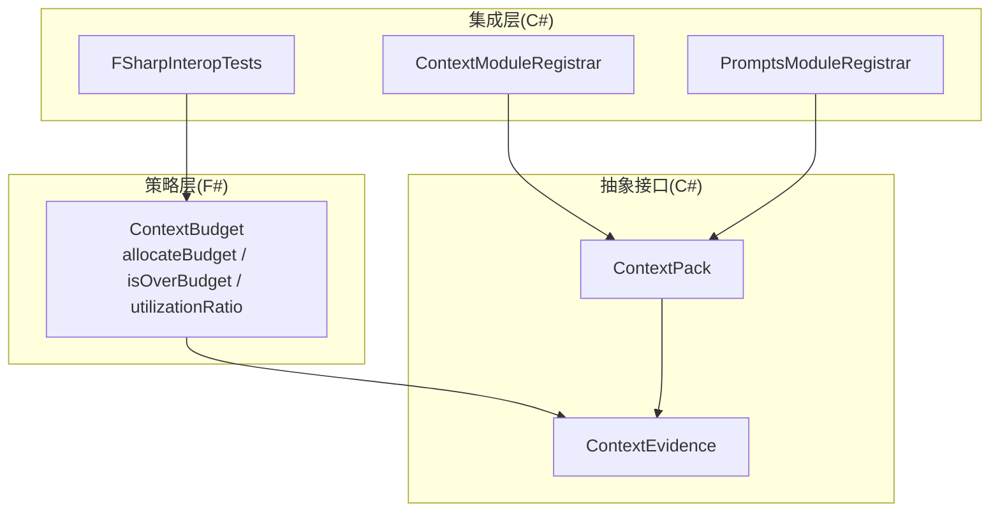
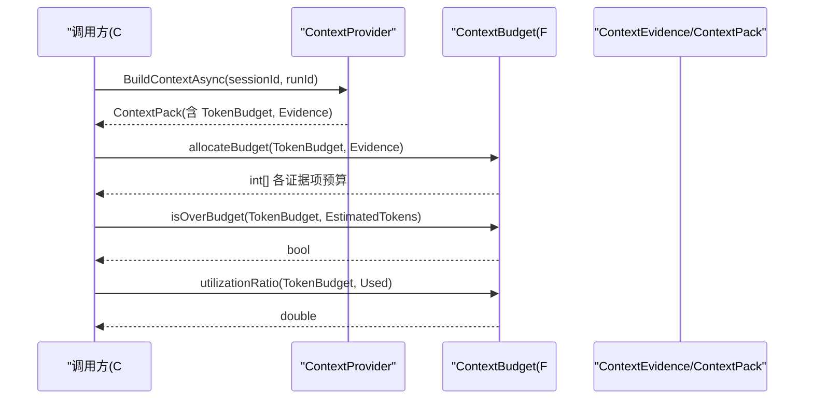
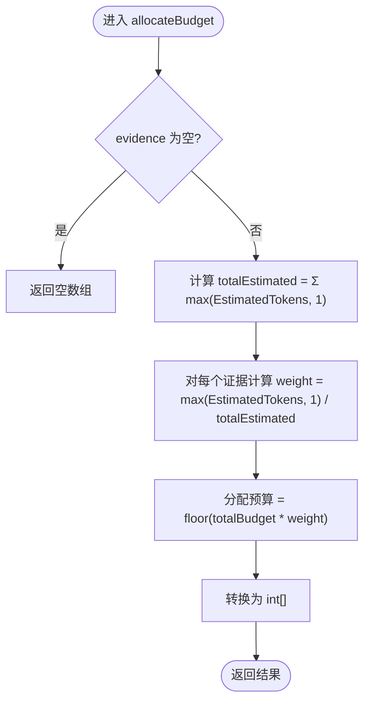
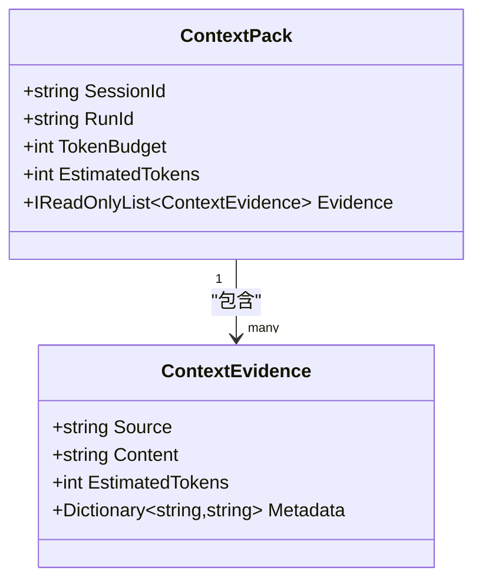
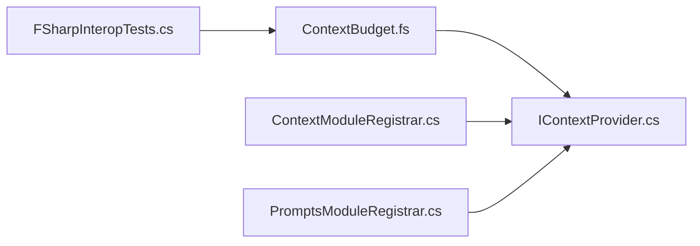

# 上下文预算策略

<cite>
**本文引用的文件**   
- [ContextBudget.fs](file://TinadecCore/Strategies/ContextBudget.fs)
- [IContextProvider.cs](file://TinadecCore/Abstractions/Ports/IContextProvider.cs)
- [FSharpInteropTests.cs](file://TinadecCore/tests/TinadecCore.AgentFramework.Tests/FSharpInteropTests.cs)
- [ContextModuleRegistrar.cs](file://TinadecCore/Context/ContextModuleRegistrar.cs)
- [PromptsModuleRegistrar.cs](file://TinadecCore/Prompts/PromptsModuleRegistrar.cs)
</cite>

## 目录
1. [简介](#简介)
2. [项目结构](#项目结构)
3. [核心组件](#核心组件)
4. [架构总览](#架构总览)
5. [详细组件分析](#详细组件分析)
6. [依赖关系分析](#依赖关系分析)
7. [性能考虑](#性能考虑)
8. [故障排查指南](#故障排查指南)
9. [结论](#结论)
10. [附录](#附录)

## 简介
本文件为 ContextBudget 上下文预算策略的权威文档，聚焦基于比例权重的令牌预算分配算法。内容涵盖：
- allocateBudget 函数的实现原理、参数与使用场景
- isOverBudget 预算检查函数的工作机制
- utilizationRatio 利用率计算函数的工作原理
- 证据项（ContextEvidence）的数据结构与令牌估算方法
- C# 中调用 F# 函数的示例与最佳实践
- 性能优化建议与常见问题解决方案

## 项目结构
ContextBudget 策略位于 F# 模块中，通过纯函数对外暴露能力；C# 侧通过测试与模块注册器进行集成与验证。关键位置如下：
- F# 策略实现：TinadecCore/Strategies/ContextBudget.fs
- 数据模型定义：TinadecCore/Abstractions/Ports/IContextProvider.cs
- C# 互操作测试：TinadecCore/tests/TinadecCore.AgentFramework.Tests/FSharpInteropTests.cs
- 上下文模块注册：TinadecCore/Context/ContextModuleRegistrar.cs
- 提示组装模块注册：TinadecCore/Prompts/PromptsModuleRegistrar.cs

图表来源
- [ContextBudget.fs:1-36](file://TinadecCore/Strategies/ContextBudget.fs#L1-L36)
- [IContextProvider.cs:1-37](file://TinadecCore/Abstractions/Ports/IContextProvider.cs#L1-L37)
- [FSharpInteropTests.cs:1-118](file://TinadecCore/tests/TinadecCore.AgentFramework.Tests/FSharpInteropTests.cs#L1-L118)
- [ContextModuleRegistrar.cs:1-52](file://TinadecCore/Context/ContextModuleRegistrar.cs#L1-L52)
- [PromptsModuleRegistrar.cs:1-55](file://TinadecCore/Prompts/PromptsModuleRegistrar.cs#L1-L55)

章节来源
- [ContextBudget.fs:1-36](file://TinadecCore/Strategies/ContextBudget.fs#L1-L36)
- [IContextProvider.cs:1-37](file://TinadecCore/Abstractions/Ports/IContextProvider.cs#L1-L37)
- [FSharpInteropTests.cs:1-118](file://TinadecCore/tests/TinadecCore.AgentFramework.Tests/FSharpInteropTests.cs#L1-L118)
- [ContextModuleRegistrar.cs:1-52](file://TinadecCore/Context/ContextModuleRegistrar.cs#L1-L52)
- [PromptsModuleRegistrar.cs:1-55](file://TinadecCore/Prompts/PromptsModuleRegistrar.cs#L1-L55)

## 核心组件
- ContextBudget（F# 模块）
  - allocateBudget(totalBudget, evidence): 按证据项预估令牌的比例权重分配预算，返回每个证据项的预算数组
  - isOverBudget(budget, estimatedTokens): 判断是否超出预算
  - utilizationRatio(budget, used): 计算利用率（0.0 到 1.0+），预算为 0 时返回 1.0
- 数据模型（C#）
  - ContextEvidence：包含 Source、Content、EstimatedTokens、Metadata
  - ContextPack：包含 SessionId、RunId、TokenBudget、EstimatedTokens、Evidence

章节来源
- [ContextBudget.fs:1-36](file://TinadecCore/Strategies/ContextBudget.fs#L1-L36)
- [IContextProvider.cs:1-16](file://TinadecCore/Abstractions/Ports/IContextProvider.cs#L1-L16)
- [IContextProvider.cs:18-37](file://TinadecCore/Abstractions/Ports/IContextProvider.cs#L18-L37)

## 架构总览
下图展示了从 C# 调用 F# 策略函数的整体流程，以及 ContextPack/Evidence 在上下文构建中的角色。

图表来源
- [ContextBudget.fs:1-36](file://TinadecCore/Strategies/ContextBudget.fs#L1-L36)
- [IContextProvider.cs:18-37](file://TinadecCore/Abstractions/Ports/IContextProvider.cs#L18-L37)
- [FSharpInteropTests.cs:15-36](file://TinadecCore/tests/TinadecCore.AgentFramework.Tests/FSharpInteropTests.cs#L15-L36)

## 详细组件分析

### allocateBudget 函数
- 输入
  - totalBudget: 总令牌预算（int）
  - evidence: 证据列表（IReadOnlyList<ContextEvidence>）
- 输出
  - 每个证据项分配的预算数组（int[]）
- 算法要点
  - 空输入直接返回空数组
  - 计算 totalEstimated = Σ max(e.EstimatedTokens, 1)，避免零权重
  - 对每个证据项计算权重 weight = max(e.EstimatedTokens, 1) / totalEstimated
  - 分配预算 = floor(totalBudget * weight)，得到 int[]
- 复杂度
  - 时间 O(n)，空间 O(n)（结果数组）
- 使用场景
  - 将总预算按比例分配到多个证据片段，确保重要片段获得更多令牌配额
  - 与 isOverBudget/utilizationRatio 配合进行预算监控与告警

图表来源
- [ContextBudget.fs:11-23](file://TinadecCore/Strategies/ContextBudget.fs#L11-L23)

章节来源
- [ContextBudget.fs:11-23](file://TinadecCore/Strategies/ContextBudget.fs#L11-L23)

### isOverBudget 函数
- 输入
  - budget: 预算上限（int）
  - estimatedTokens: 预估令牌数（int）
- 输出
  - bool：当 estimatedTokens > budget 时为 true，表示超预算
- 行为说明
  - 简单比较，无副作用，适合快速前置检查

章节来源
- [ContextBudget.fs:28-29](file://TinadecCore/Strategies/ContextBudget.fs#L28-L29)

### utilizationRatio 函数
- 输入
  - budget: 预算（int）
  - used: 已用令牌（int）
- 输出
  - float：used/budget；若 budget <= 0 则返回 1.0
- 行为说明
  - 用于监控预算使用情况，支持超过 1.0 的情况（超额使用）

章节来源
- [ContextBudget.fs:34-36](file://TinadecCore/Strategies/ContextBudget.fs#L34-L36)

### 数据模型：ContextEvidence 与 ContextPack
- ContextEvidence
  - Source: 数据来源标识
  - Content: 文本内容
  - EstimatedTokens: 预估令牌数（由上层估算或启发式规则给出）
  - Metadata: 元数据字典（可选）
- ContextPack
  - SessionId/RunId: 会话与运行标识
  - TokenBudget: 总令牌预算
  - EstimatedTokens: 总体预估令牌数
  - Evidence: 证据列表

图表来源
- [IContextProvider.cs:18-37](file://TinadecCore/Abstractions/Ports/IContextProvider.cs#L18-L37)

章节来源
- [IContextProvider.cs:18-37](file://TinadecCore/Abstractions/Ports/IContextProvider.cs#L18-L37)

### C# 调用 F# 函数的示例
- 通过 FSharpInteropTests 可看到 C# 如何调用 F# 函数并断言返回类型兼容
- 典型用法
  - 构造 List<ContextEvidence> 并设置 EstimatedTokens
  - 调用 ContextBudget.allocateBudget(totalBudget, evidence) 获取 int[]
  - 调用 ContextBudget.isOverBudget(budget, estimatedTokens) 判断是否超预算
  - 调用 ContextBudget.utilizationRatio(budget, used) 获取利用率

章节来源
- [FSharpInteropTests.cs:15-36](file://TinadecCore/tests/TinadecCore.AgentFramework.Tests/FSharpInteropTests.cs#L15-L36)
- [FSharpInteropTests.cs:78-116](file://TinadecCore/tests/TinadecCore.AgentFramework.Tests/FSharpInteropTests.cs#L78-L116)

## 依赖关系分析
- ContextBudget 依赖 IContextProvider 中的 ContextEvidence 类型
- C# 测试通过 Microsoft.Extensions.DependencyInjection 与模块注册器集成
- ContextModuleRegistrar 注册 IContextProvider 的实现，提供默认 TokenBudget=8192
- PromptsModuleRegistrar 负责提示组装，预留 EstimatedTokens 字段供后续扩展

图表来源
- [ContextBudget.fs:1-36](file://TinadecCore/Strategies/ContextBudget.fs#L1-L36)
- [IContextProvider.cs:1-37](file://TinadecCore/Abstractions/Ports/IContextProvider.cs#L1-L37)
- [FSharpInteropTests.cs:1-118](file://TinadecCore/tests/TinadecCore.AgentFramework.Tests/FSharpInteropTests.cs#L1-L118)
- [ContextModuleRegistrar.cs:1-52](file://TinadecCore/Context/ContextModuleRegistrar.cs#L1-L52)
- [PromptsModuleRegistrar.cs:1-55](file://TinadecCore/Prompts/PromptsModuleRegistrar.cs#L1-L55)

章节来源
- [ContextBudget.fs:1-36](file://TinadecCore/Strategies/ContextBudget.fs#L1-L36)
- [IContextProvider.cs:1-37](file://TinadecCore/Abstractions/Ports/IContextProvider.cs#L1-L37)
- [FSharpInteropTests.cs:1-118](file://TinadecCore/tests/TinadecCore.AgentFramework.Tests/FSharpInteropTests.cs#L1-L118)
- [ContextModuleRegistrar.cs:1-52](file://TinadecCore/Context/ContextModuleRegistrar.cs#L1-L52)
- [PromptsModuleRegistrar.cs:1-55](file://TinadecCore/Prompts/PromptsModuleRegistrar.cs#L1-L55)

## 性能考虑
- allocateBudget 的时间复杂度为 O(n)，适用于中等规模证据集合；对于大规模证据，建议：
  - 预先过滤低价值证据，减少 n
  - 批量处理与并行化（注意线程安全与内存占用）
- 避免重复计算 totalEstimated：可在上层缓存并按需更新
- 预算分配采用向下取整，可能产生少量舍入误差；如需严格对齐，可在最后一步对剩余预算进行补偿分配
- utilizationRatio 在预算为 0 时返回 1.0，避免除零异常；调用方应确保预算初始化合理

[本节为通用指导，不直接分析具体文件]

## 故障排查指南
- 症状：allocateBudget 返回空数组
  - 原因：传入的 evidence 为空或 null
  - 解决：确保证据列表非空，或在调用前进行校验
- 症状：isOverBudget 始终为 false
  - 原因：estimatedTokens 未正确设置或小于等于预算
  - 解决：检查证据项 EstimatedTokens 的计算逻辑与上下文打包过程
- 症状：utilizationRatio 返回 1.0 但实际未使用
  - 原因：budget 为 0 或负数
  - 解决：确保 TokenBudget 初始化为正数
- 症状：C# 调用 F# 函数类型不匹配
  - 原因：返回类型不是 C# 兼容类型（如 FSharpList）
  - 解决：参考测试用例，确保 allocateBudget 返回 int[]，utilizationRatio 返回 double

章节来源
- [FSharpInteropTests.cs:15-36](file://TinadecCore/tests/TinadecCore.AgentFramework.Tests/FSharpInteropTests.cs#L15-L36)
- [FSharpInteropTests.cs:78-116](file://TinadecCore/tests/TinadecCore.AgentFramework.Tests/FSharpInteropTests.cs#L78-L116)

## 结论
ContextBudget 提供了简洁高效的令牌预算分配与监控能力：
- allocateBudget 以比例权重公平分配预算，保证重要证据获得更高配额
- isOverBudget 与 utilizationRatio 提供快速预算检查与利用率监控
- 数据模型清晰，易于扩展与集成
- 通过 C# 互操作测试验证了类型兼容性与稳定性

[本节为总结性内容，不直接分析具体文件]

## 附录

### 令牌估算计算方法（建议）
- 字符计数法：按字符数近似换算（例如每 4 个字符约 1 token）
- 分词器法：使用目标模型的 tokenizer 精确估算
- 启发式加权：根据内容类型（代码、自然语言、JSON）调整换算系数
- 缓存与增量更新：对频繁使用的证据项缓存 EstimatedTokens，变更时增量更新

[本节为通用指导，不直接分析具体文件]

### 最佳实践
- 在构建 ContextPack 时尽早估算 EstimatedTokens，便于前置预算检查
- 对证据项排序后分配预算，优先保障高价值片段
- 结合 isOverBudget 做快速失败，避免不必要的后续处理
- 使用 utilizationRatio 作为监控指标，触发告警或自动裁剪策略

[本节为通用指导，不直接分析具体文件]