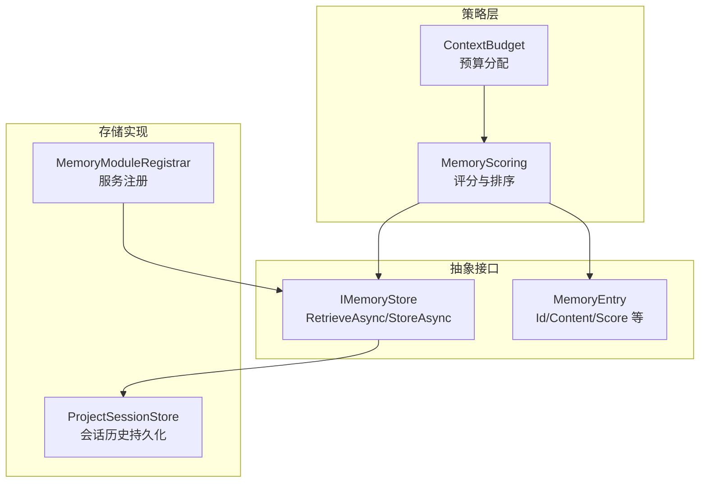
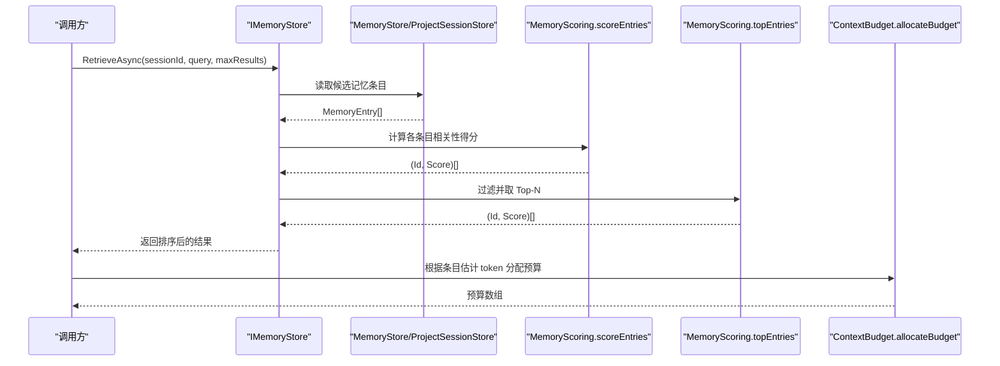
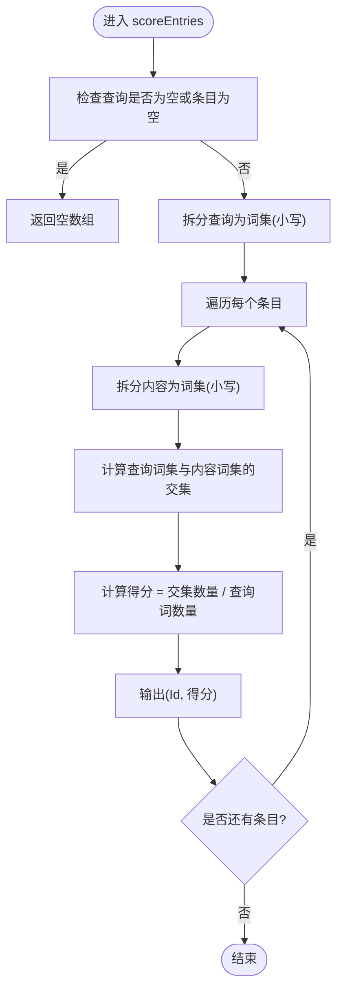
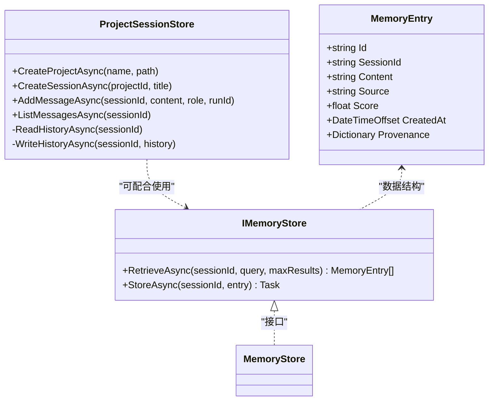
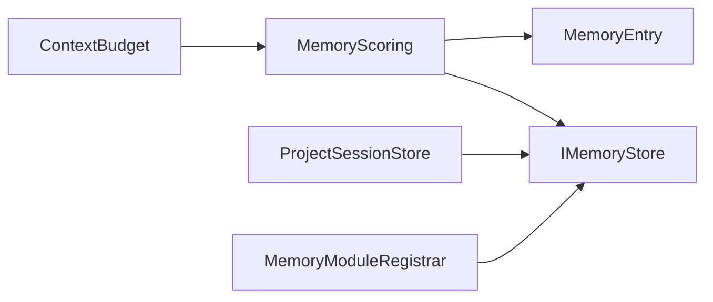

# 内存评分策略

<cite>
**本文引用的文件**   
- [MemoryScoring.fs](file://TinadecCore/Strategies/MemoryScoring.fs)
- [IMemoryStore.cs](file://TinadecCore/Abstractions/Ports/IMemoryStore.cs)
- [ContextBudget.fs](file://TinadecCore/Strategies/ContextBudget.fs)
- [ProjectSessionStore.cs](file://TinadecCore/Memory/ProjectSessionStore.cs)
- [MemoryModuleRegistrar.cs](file://TinadecCore/Memory/MemoryModuleRegistrar.cs)
</cite>

## 目录
1. [简介](#简介)
2. [项目结构](#项目结构)
3. [核心组件](#核心组件)
4. [架构总览](#架构总览)
5. [详细组件分析](#详细组件分析)
6. [依赖关系分析](#依赖关系分析)
7. [性能考量](#性能考量)
8. [故障排查指南](#故障排查指南)
9. [结论](#结论)
10. [附录](#附录)

## 简介
本文件围绕 MemoryScoring 内存评分策略，系统化阐述会话记忆内容的评分算法、相关性计算与优先级排序机制。文档涵盖评分维度、权重配置与评分标准，提供评分函数实现示例与自定义评分规则开发指南，并解释评分结果在上下文压缩、记忆检索和内容筛选中的应用。同时给出内存管理策略、垃圾回收机制与性能优化建议，帮助读者在实际工程中落地与扩展该策略。

## 项目结构
MemoryScoring 相关代码位于 TinadecCore.Strategies 模块中，采用 F# 纯函数实现；数据模型与存储接口定义于 Abstractions.Ports；具体存储实现位于 Memory 模块。上下文预算分配由 ContextBudget 模块提供，用于结合评分进行资源控制。

图表来源
- [MemoryScoring.fs:1-46](file://TinadecCore/Strategies/MemoryScoring.fs#L1-L46)
- [IMemoryStore.cs:1-31](file://TinadecCore/Abstractions/Ports/IMemoryStore.cs#L1-L31)
- [ContextBudget.fs:1-36](file://TinadecCore/Strategies/ContextBudget.fs#L1-L36)
- [ProjectSessionStore.cs:1-219](file://TinadecCore/Memory/ProjectSessionStore.cs#L1-L219)
- [MemoryModuleRegistrar.cs:1-60](file://TinadecCore/Memory/MemoryModuleRegistrar.cs#L1-L60)

章节来源
- [MemoryScoring.fs:1-46](file://TinadecCore/Strategies/MemoryScoring.fs#L1-L46)
- [IMemoryStore.cs:1-31](file://TinadecCore/Abstractions/Ports/IMemoryStore.cs#L1-L31)
- [ContextBudget.fs:1-36](file://TinadecCore/Strategies/ContextBudget.fs#L1-L36)
- [ProjectSessionStore.cs:1-219](file://TinadecCore/Memory/ProjectSessionStore.cs#L1-L219)
- [MemoryModuleRegistrar.cs:1-60](file://TinadecCore/Memory/MemoryModuleRegistrar.cs#L1-L60)

## 核心组件
- 评分与排序（F#）：scoreEntries 基于关键词重叠度计算相关性得分；topEntries 过滤低分项并按分数降序返回前 N 条。
- 数据模型（C#）：MemoryEntry 包含 Id、SessionId、Content、Source、Score、CreatedAt、Provenance 等字段，Score 用于承载评分结果。
- 存储接口（C#）：IMemoryStore 提供 RetrieveAsync 与 StoreAsync，支持按查询检索与写入记忆条目。
- 上下文预算（F#）：ContextBudget 提供按比例分配 token 预算的工具函数，便于将评分结果与上下文长度限制结合。
- 会话持久化（C#）：ProjectSessionStore 负责会话与消息的持久化，为记忆检索提供数据源。

章节来源
- [MemoryScoring.fs:1-46](file://TinadecCore/Strategies/MemoryScoring.fs#L1-L46)
- [IMemoryStore.cs:1-31](file://TinadecCore/Abstractions/Ports/IMemoryStore.cs#L1-L31)
- [ContextBudget.fs:1-36](file://TinadecCore/Strategies/ContextBudget.fs#L1-L36)
- [ProjectSessionStore.cs:1-219](file://TinadecCore/Memory/ProjectSessionStore.cs#L1-L219)

## 架构总览
MemoryScoring 作为纯函数策略，被上层编排器或检索管线调用，对候选记忆条目进行打分与排序；IMemoryStore 屏蔽底层存储差异，ProjectSessionStore 提供具体的会话历史读写能力；ContextBudget 在需要时根据估计 token 数进行预算分配，确保上下文压缩后的内容不超过模型输入限制。

图表来源
- [IMemoryStore.cs:1-31](file://TinadecCore/Abstractions/Ports/IMemoryStore.cs#L1-L31)
- [MemoryScoring.fs:1-46](file://TinadecCore/Strategies/MemoryScoring.fs#L1-L46)
- [ContextBudget.fs:1-36](file://TinadecCore/Strategies/ContextBudget.fs#L1-L36)
- [ProjectSessionStore.cs:1-219](file://TinadecCore/Memory/ProjectSessionStore.cs#L1-L219)

## 详细组件分析

### 评分与排序（MemoryScoring）
- 重要性评估：通过查询词集合与条目内容词集合的交集大小衡量重叠度，重叠越多说明越重要。
- 相关性计算：scoreEntries 将重叠数量除以查询词总数得到归一化得分，避免长查询导致的偏差。
- 优先级排序：topEntries 过滤得分大于 0 的条目，按分数降序排列，并截断到最大结果数。

图表来源
- [MemoryScoring.fs:11-32](file://TinadecCore/Strategies/MemoryScoring.fs#L11-L32)

章节来源
- [MemoryScoring.fs:11-32](file://TinadecCore/Strategies/MemoryScoring.fs#L11-L32)

### 数据模型（MemoryEntry）
- 关键字段：Id、SessionId、Content、Source、Score、CreatedAt、Provenance。
- 用途：Score 承载评分结果，供检索与排序使用；Provenance 记录来源元数据，便于溯源与审计。

章节来源
- [IMemoryStore.cs:21-30](file://TinadecCore/Abstractions/Ports/IMemoryStore.cs#L21-L30)

### 存储接口与实现（IMemoryStore 与 ProjectSessionStore）
- IMemoryStore：定义 RetrieveAsync 与 StoreAsync，统一记忆检索与写入契约。
- ProjectSessionStore：实现会话创建、消息追加、历史文件读写与版本控制，保证并发安全与原子写入。

图表来源
- [IMemoryStore.cs:1-31](file://TinadecCore/Abstractions/Ports/IMemoryStore.cs#L1-L31)
- [ProjectSessionStore.cs:1-219](file://TinadecCore/Memory/ProjectSessionStore.cs#L1-L219)

章节来源
- [IMemoryStore.cs:1-31](file://TinadecCore/Abstractions/Ports/IMemoryStore.cs#L1-L31)
- [ProjectSessionStore.cs:1-219](file://TinadecCore/Memory/ProjectSessionStore.cs#L1-L219)

### 上下文预算（ContextBudget）
- allocateBudget：按估计 token 比例分配总预算，确保各证据项获得与其规模匹配的配额。
- isOverBudget/utilizationRatio：判断是否超预算与计算利用率，辅助上下文压缩决策。

章节来源
- [ContextBudget.fs:11-23](file://TinadecCore/Strategies/ContextBudget.fs#L11-L23)
- [ContextBudget.fs:28-36](file://TinadecCore/Strategies/ContextBudget.fs#L28-L36)

## 依赖关系分析
- MemoryScoring 依赖 IMemoryStore 的数据结构与检索契约，但不直接耦合具体存储实现。
- ProjectSessionStore 提供会话与消息的持久化能力，可与 IMemoryStore 组合使用。
- ContextBudget 与 MemoryScoring 协同工作，前者负责预算分配，后者负责相关性排序。

图表来源
- [MemoryScoring.fs:1-46](file://TinadecCore/Strategies/MemoryScoring.fs#L1-L46)
- [IMemoryStore.cs:1-31](file://TinadecCore/Abstractions/Ports/IMemoryStore.cs#L1-L31)
- [ContextBudget.fs:1-36](file://TinadecCore/Strategies/ContextBudget.fs#L1-L36)
- [ProjectSessionStore.cs:1-219](file://TinadecCore/Memory/ProjectSessionStore.cs#L1-L219)
- [MemoryModuleRegistrar.cs:1-60](file://TinadecCore/Memory/MemoryModuleRegistrar.cs#L1-L60)

章节来源
- [MemoryScoring.fs:1-46](file://TinadecCore/Strategies/MemoryScoring.fs#L1-L46)
- [IMemoryStore.cs:1-31](file://TinadecCore/Abstractions/Ports/IMemoryStore.cs#L1-L31)
- [ContextBudget.fs:1-36](file://TinadecCore/Strategies/ContextBudget.fs#L1-L36)
- [ProjectSessionStore.cs:1-219](file://TinadecCore/Memory/ProjectSessionStore.cs#L1-L219)
- [MemoryModuleRegistrar.cs:1-60](file://TinadecCore/Memory/MemoryModuleRegistrar.cs#L1-L60)

## 性能考量
- 时间复杂度：scoreEntries 对每个条目进行分词与集合求交，整体复杂度近似 O(N·T)，N 为条目数，T 为平均词数；topEntries 排序复杂度 O(K log K)，K 为有效条目数。
- 空间复杂度：构建查询词集与内容词集占用 O(T) 空间；结果数组占用 O(N)。
- 优化建议：
  - 预索引：对高频查询场景，可对内容建立倒排索引，降低重复分词成本。
  - 批量处理：合并多次 RetrieveAsync 调用，减少 I/O 开销。
  - 缓存热点：对常见查询与热门条目进行本地缓存，提升命中率。
  - 预算裁剪：结合 ContextBudget 在检索阶段即限制候选集规模，避免后续处理压力。

[本节为通用指导，不直接分析具体文件]

## 故障排查指南
- 空查询或空条目：scoreEntries 会返回空数组，需检查上游传入参数是否正确。
- 得分全为零：可能因分词策略不匹配或内容不含查询词，建议调整分词与预处理逻辑。
- 结果过多或过少：调整 topEntries 的 maxResults 参数，并结合 ContextBudget 控制上下文长度。
- 存储异常：检查 ProjectSessionStore 的文件路径权限与序列化格式，确保历史文件可读且完整。

章节来源
- [MemoryScoring.fs:11-32](file://TinadecCore/Strategies/MemoryScoring.fs#L11-L32)
- [ProjectSessionStore.cs:166-196](file://TinadecCore/Memory/ProjectSessionStore.cs#L166-L196)

## 结论
MemoryScoring 以简洁高效的关键词重叠度为核心，结合 topEntries 的排序与过滤，形成稳定的记忆评分与优先级排序机制。通过与 IMemoryStore 和 ProjectSessionStore 的组合，以及 ContextBudget 的预算控制，可在实际系统中实现可靠的上下文压缩与记忆检索。建议在高频场景引入索引与缓存，进一步优化性能与可扩展性。

[本节为总结性内容，不直接分析具体文件]

## 附录

### 评分维度与权重配置
- 当前实现维度：关键词重叠度（queryTerms ∩ contentTerms）。
- 权重配置：默认等权，可通过扩展函数对不同维度加权求和（如语义相似度、时间衰减、来源可信度等）。
- 评分标准：归一化得分范围 [0, 1]，0 表示无相关，1 表示完全匹配。

章节来源
- [MemoryScoring.fs:15-31](file://TinadecCore/Strategies/MemoryScoring.fs#L15-L31)

### 自定义评分规则开发指南
- 步骤：
  1. 定义新的评分函数，接收查询与条目列表，输出 (Id, Score) 数组。
  2. 在检索管线中替换 scoreEntries 的实现，保持接口一致。
  3. 结合 topEntries 进行过滤与排序。
  4. 使用 ContextBudget 进行预算分配与上下文裁剪。
- 注意事项：
  - 保持纯函数特性，避免副作用。
  - 合理处理空输入与边界条件。
  - 对大规模数据考虑增量更新与缓存策略。

章节来源
- [MemoryScoring.fs:11-46](file://TinadecCore/Strategies/MemoryScoring.fs#L11-L46)
- [ContextBudget.fs:11-23](file://TinadecCore/Strategies/ContextBudget.fs#L11-L23)

### 内存管理与垃圾回收建议
- 对象生命周期：MemoryEntry 与中间词集应在单次检索完成后释放，避免长期持有。
- 大对象池：对频繁创建的分词结果可使用对象池复用，减少 GC 压力。
- 异步与取消：在 RetrieveAsync 中支持 CancellationToken，及时中断长时间任务。
- 文件写入原子性：ProjectSessionStore 使用临时文件与 Replace 操作，确保一致性。

章节来源
- [IMemoryStore.cs:9-18](file://TinadecCore/Abstractions/Ports/IMemoryStore.cs#L9-L18)
- [ProjectSessionStore.cs:175-196](file://TinadecCore/Memory/ProjectSessionStore.cs#L175-L196)

### 评分结果的应用场景
- 上下文压缩：依据得分与预算，选择高相关且节省 token 的内容片段。
- 记忆检索：按得分排序返回最相关的记忆条目，提升检索质量。
- 内容筛选：结合阈值过滤低分条目，减少噪声干扰。

章节来源
- [MemoryScoring.fs:37-46](file://TinadecCore/Strategies/MemoryScoring.fs#L37-L46)
- [ContextBudget.fs:11-23](file://TinadecCore/Strategies/ContextBudget.fs#L11-L23)