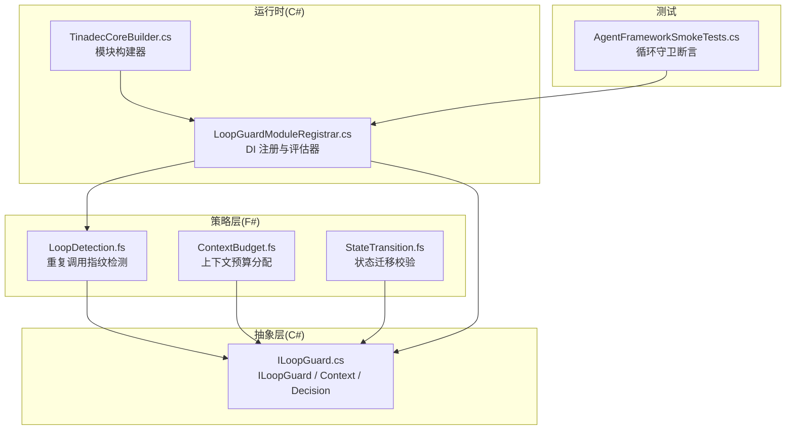
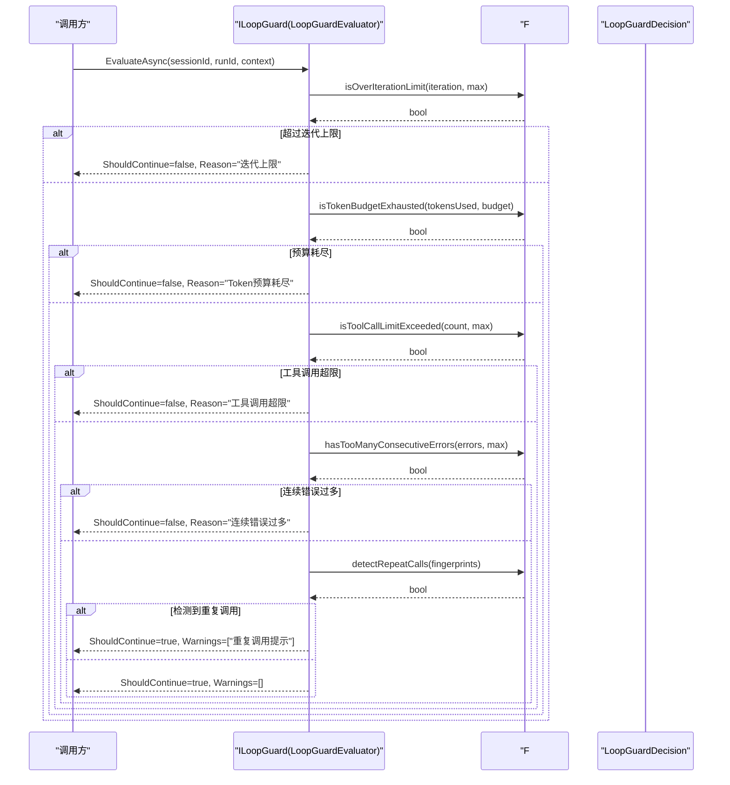
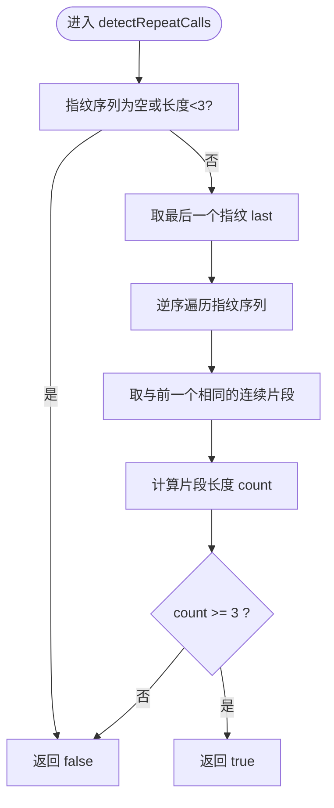
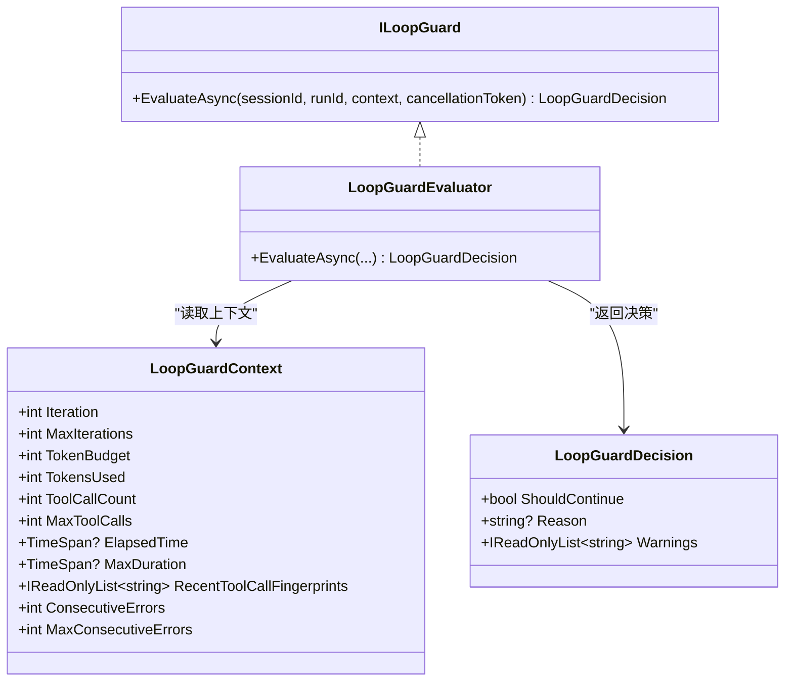
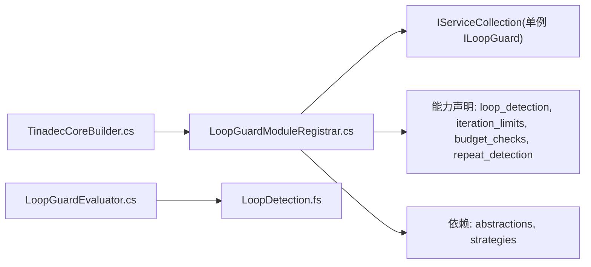

# 循环检测策略

<cite>
**本文引用的文件**   
- [LoopDetection.fs](file://TinadecCore/Strategies/LoopDetection.fs)
- [ILoopGuard.cs](file://TinadecCore/Abstractions/Ports/ILoopGuard.cs)
- [LoopGuardModuleRegistrar.cs](file://TinadecCore/LoopGuard/LoopGuardModuleRegistrar.cs)
- [AgentFrameworkSmokeTests.cs](file://TinadecCore/tests/TinadecCore.AgentFramework.Tests/AgentFrameworkSmokeTests.cs)
- [TinadecCore.Strategies.fsproj](file://TinadecCore/Strategies/TinadecCore.Strategies.fsproj)
- [ContextBudget.fs](file://TinadecCore/Strategies/ContextBudget.fs)
- [StateTransition.fs](file://TinadecCore/Strategies/StateTransition.fs)
- [TinadecCoreBuilder.cs](file://TinadecCore/Runtime/TinadecCoreBuilder.cs)
</cite>

## 目录
1. [简介](#简介)
2. [项目结构](#项目结构)
3. [核心组件](#核心组件)
4. [架构总览](#架构总览)
5. [详细组件分析](#详细组件分析)
6. [依赖关系分析](#依赖关系分析)
7. [性能考量](#性能考量)
8. [故障排查指南](#故障排查指南)
9. [结论](#结论)
10. [附录](#附录)

## 简介
本文件为 LoopDetection 循环检测策略的全面技术文档。内容覆盖 Agent 执行过程中的循环检测算法、重复状态识别与模式匹配、阈值与触发条件、配置参数说明、自定义检测规则开发指南，以及与其它策略的协作方式与在 Agent 编排中的应用场景。该策略以纯函数为核心（F#），通过 C# 接口与模块注册器集成到服务容器中，配合 MAF LoopAgent/LoopEvaluator 提供硬迭代上限与预算控制，确保 Agent 运行安全可控。

## 项目结构
围绕循环检测的相关代码主要分布在以下位置：
- F# 策略内核：纯函数实现检测逻辑
- C# 抽象端口：定义评估上下文与决策结果
- C# 模块注册器：将 ILoopGuard 注入 DI，并声明能力与依赖
- 测试用例：验证阈值与重复调用检测行为
- 相关策略：上下文预算与状态转换等辅助策略

图表来源 
- [LoopDetection.fs:1-46](file://TinadecCore/Strategies/LoopDetection.fs#L1-L46)
- [ILoopGuard.cs:1-38](file://TinadecCore/Abstractions/Ports/ILoopGuard.cs#L1-L38)
- [LoopGuardModuleRegistrar.cs:1-83](file://TinadecCore/LoopGuard/LoopGuardModuleRegistrar.cs#L1-L83)
- [AgentFrameworkSmokeTests.cs:85-188](file://TinadecCore/tests/TinadecCore.AgentFramework.Tests/AgentFrameworkSmokeTests.cs#L85-L188)
- [TinadecCoreBuilder.cs:1-31](file://TinadecCore/Runtime/TinadecCoreBuilder.cs#L1-L31)

章节来源
- [TinadecCore.Strategies.fsproj:1-27](file://TinadecCore/Strategies/TinadecCore.Strategies.fsproj#L1-L27)

## 核心组件
- ILoopGuard 接口与数据模型
  - EvaluateAsync：接收会话与运行标识、评估上下文与取消令牌，返回是否继续及原因、警告列表
  - LoopGuardContext：包含迭代次数与上限、Token 预算与已用量、工具调用次数与上限、耗时与最大时长、最近工具调用指纹序列、连续错误计数与上限
  - LoopGuardDecision：ShouldContinue、Reason、Warnings
- LoopGuardEvaluator：C# 评估器，按优先级检查硬限制（迭代、Token、工具调用、连续错误），并对重复调用指纹发出警告
- F# 策略模块：纯函数实现具体判定逻辑，无副作用，便于单元测试与组合

章节来源
- [ILoopGuard.cs:1-38](file://TinadecCore/Abstractions/Ports/ILoopGuard.cs#L1-L38)
- [LoopGuardModuleRegistrar.cs:35-83](file://TinadecCore/LoopGuard/LoopGuardModuleRegistrar.cs#L35-L83)
- [LoopDetection.fs:1-46](file://TinadecCore/Strategies/LoopDetection.fs#L1-L46)

## 架构总览
循环检测由“C# 评估器 + F# 纯策略”组成，遵循“先硬限制后软告警”的顺序：
- 迭代上限：超过或等于 MaxIterations 即停止
- Token 预算：TokensUsed >= TokenBudget 即停止
- 工具调用上限：ToolCallCount >= MaxToolCalls 即停止
- 连续错误：ConsecutiveErrors >= MaxConsecutiveErrors 即停止
- 重复调用指纹：最近若干次指纹完全相同且达到阈值时，给出警告但不直接终止

图表来源 
- [LoopGuardModuleRegistrar.cs:35-83](file://TinadecCore/LoopGuard/LoopGuardModuleRegistrar.cs#L35-L83)
- [LoopDetection.fs:1-46](file://TinadecCore/Strategies/LoopDetection.fs#L1-L46)

## 详细组件分析

### 循环检测算法（F# 纯策略）
- 重复调用指纹检测
  - 输入：最近工具调用指纹序列
  - 逻辑：从末尾向前统计与最后一个元素相同的连续片段长度；若长度≥3，则判定为重复调用
  - 复杂度：O(k)，k 为尾部相同片段的长度，最坏 O(n)
- 迭代上限检查
  - 当 iteration ≥ maxIterations 时返回 true
- Token 预算检查
  - 当 tokenBudget > 0 且 tokensUsed ≥ tokenBudget 时返回 true
- 工具调用上限检查
  - 当 toolCallCount ≥ maxToolCalls 时返回 true
- 连续错误检查
  - 当 consecutiveErrors ≥ maxConsecutiveErrors 时返回 true

图表来源 
- [LoopDetection.fs:11-21](file://TinadecCore/Strategies/LoopDetection.fs#L11-L21)

章节来源
- [LoopDetection.fs:1-46](file://TinadecCore/Strategies/LoopDetection.fs#L1-L46)

### 评估器与上下文（C#）
- 评估顺序与短路
  - 依次检查：迭代上限 → Token 预算 → 工具调用上限 → 连续错误 → 重复调用指纹
  - 任一硬限制命中立即返回 ShouldContinue=false 并附带 Reason
  - 仅当所有硬限制未命中时，才对重复调用指纹进行软告警
- 默认阈值
  - MaxIterations=25
  - MaxToolCalls=50
  - MaxConsecutiveErrors=3
- 决策输出
  - ShouldContinue：布尔值
  - Reason：停止原因（仅在硬限制命中时设置）
  - Warnings：警告列表（如重复调用提示）

图表来源 
- [ILoopGuard.cs:1-38](file://TinadecCore/Abstractions/Ports/ILoopGuard.cs#L1-L38)
- [LoopGuardModuleRegistrar.cs:35-83](file://TinadecCore/LoopGuard/LoopGuardModuleRegistrar.cs#L35-L83)

章节来源
- [ILoopGuard.cs:1-38](file://TinadecCore/Abstractions/Ports/ILoopGuard.cs#L1-L38)
- [LoopGuardModuleRegistrar.cs:35-83](file://TinadecCore/LoopGuard/LoopGuardModuleRegistrar.cs#L35-L83)

### 模块注册与能力声明
- 模块 ID：loop_guard
- 依赖：abstractions、strategies
- 能力：loop_detection、iteration_limits、budget_checks、repeat_detection
- 语言：C#
- MAF 原语：loop
- 服务注册：单例 ILoopGuard → LoopGuardEvaluator

章节来源
- [LoopGuardModuleRegistrar.cs:11-28](file://TinadecCore/LoopGuard/LoopGuardModuleRegistrar.cs#L11-L28)

### 测试与使用示例
- 正常路径：在各项阈值内应返回 ShouldContinue=true
- 迭代上限：当 Iteration=MaxIterations 时应返回 ShouldContinue=false，Reason 包含“迭代上限”
- 其他边界：可基于相同模式扩展 Token、工具调用、连续错误的断言

章节来源
- [AgentFrameworkSmokeTests.cs:85-131](file://TinadecCore/tests/TinadecCore.AgentFramework.Tests/AgentFrameworkSmokeTests.cs#L85-L131)

## 依赖关系分析
- 模块构建与注册
  - TinadecCoreBuilder 收集 ModuleDescriptor，最终由各模块 Registrar 完成 DI 注册
  - LoopGuardModuleRegistrar 将 ILoopGuard 注册为单例，并声明能力与依赖
- 策略依赖
  - F# 策略模块被 C# 评估器调用，形成“C# 编排 + F# 纯函数”的分层解耦

图表来源 
- [TinadecCoreBuilder.cs:1-31](file://TinadecCore/Runtime/TinadecCoreBuilder.cs#L1-L31)
- [LoopGuardModuleRegistrar.cs:11-28](file://TinadecCore/LoopGuard/LoopGuardModuleRegistrar.cs#L11-L28)
- [LoopGuardModuleRegistrar.cs:35-83](file://TinadecCore/LoopGuard/LoopGuardModuleRegistrar.cs#L35-L83)

章节来源
- [TinadecCore.Strategies.fsproj:1-27](file://TinadecCore/Strategies/TinadecCore.Strategies.fsproj#L1-L27)

## 性能考量
- 时间复杂度
  - 重复调用指纹检测：O(k)，k 为尾部相同片段长度，最坏 O(n)
  - 其余检查均为 O(1)
- 空间复杂度
  - 不引入额外数据结构，仅使用只读序列与局部变量
- 建议
  - 合理控制 RecentToolCallFingerprints 的长度，避免过长导致尾部扫描开销增大
  - 将频繁触发的阈值调优，减少不必要的告警与中断

[本节为通用指导，无需源码引用]

## 故障排查指南
- 常见现象与定位
  - 过早停止：检查 MaxIterations、TokenBudget、MaxToolCalls、MaxConsecutiveErrors 是否过小
  - 未检测到循环：确认 RecentToolCallFingerprints 是否正确填充且长度足够
  - 误报告警：指纹生成需具备区分度，避免不同操作产生相同指纹
- 调试建议
  - 打印 LoopGuardDecision 的 Reason 与 Warnings，快速定位触发点
  - 逐步放宽阈值，观察行为变化，定位敏感参数
- 恢复策略
  - 对于重复调用告警，可在上层编排中切换备选工具或调整提示词
  - 对于硬限制命中，记录日志并回滚部分状态，必要时重试或降级

章节来源
- [AgentFrameworkSmokeTests.cs:85-131](file://TinadecCore/tests/TinadecCore.AgentFramework.Tests/AgentFrameworkSmokeTests.cs#L85-L131)

## 结论
LoopDetection 循环检测策略通过“C# 评估器 + F# 纯策略”的组合，实现了高内聚、低耦合、可测试的循环防护机制。其以硬限制优先、软告警为辅的策略顺序，既保证了运行的安全性，又保留了灵活性。结合上下文预算与状态迁移等策略，可在 Agent 编排中形成稳健的执行闭环。

[本节为总结性内容，无需源码引用]

## 附录

### 配置参数与阈值说明
- Iteration / MaxIterations：当前迭代与上限，默认上限 25
- TokenBudget / TokensUsed：Token 预算与已用量，预算耗尽即停止
- ToolCallCount / MaxToolCalls：工具调用次数与上限，默认上限 50
- ConsecutiveErrors / MaxConsecutiveErrors：连续错误计数与上限，默认上限 3
- RecentToolCallFingerprints：最近工具调用指纹序列，用于重复调用检测
- ElapsedTime / MaxDuration：可选的耗时监控字段（当前评估器未强制使用）

章节来源
- [ILoopGuard.cs:17-30](file://TinadecCore/Abstractions/Ports/ILoopGuard.cs#L17-L30)

### 与其他策略的协作
- 上下文预算（ContextBudget）：按比例分配证据项的 Token 预算，避免超支
- 状态迁移（StateTransition）：校验状态机转移合法性，防止非法跳转
- 与循环检测的关系：预算与状态机为前置约束，循环检测作为运行期保护

章节来源
- [ContextBudget.fs:1-36](file://TinadecCore/Strategies/ContextBudget.fs#L1-L36)
- [StateTransition.fs:1-26](file://TinadecCore/Strategies/StateTransition.fs#L1-L26)

### 自定义检测规则开发指南
- 新增纯函数
  - 在 F# 策略模块中添加新的判定函数，保持无副作用与可测试性
- 接入评估器
  - 在评估器中增加检查步骤，遵循“硬限制优先”的顺序
- 更新上下文
  - 如需新指标，扩展 LoopGuardContext 字段并在调用处填充
- 测试覆盖
  - 为新规则添加单元测试，覆盖边界与典型场景

章节来源
- [LoopDetection.fs:1-46](file://TinadecCore/Strategies/LoopDetection.fs#L1-L46)
- [LoopGuardModuleRegistrar.cs:35-83](file://TinadecCore/LoopGuard/LoopGuardModuleRegistrar.cs#L35-L83)
- [ILoopGuard.cs:1-38](file://TinadecCore/Abstractions/Ports/ILoopGuard.cs#L1-L38)