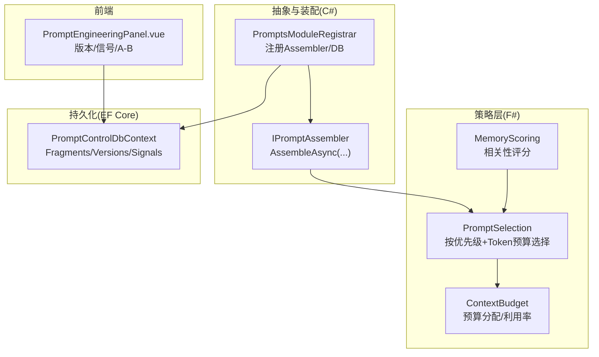
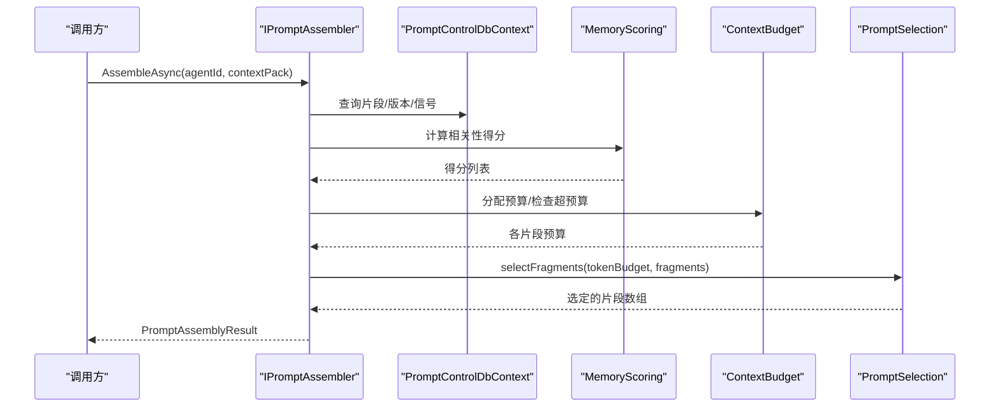
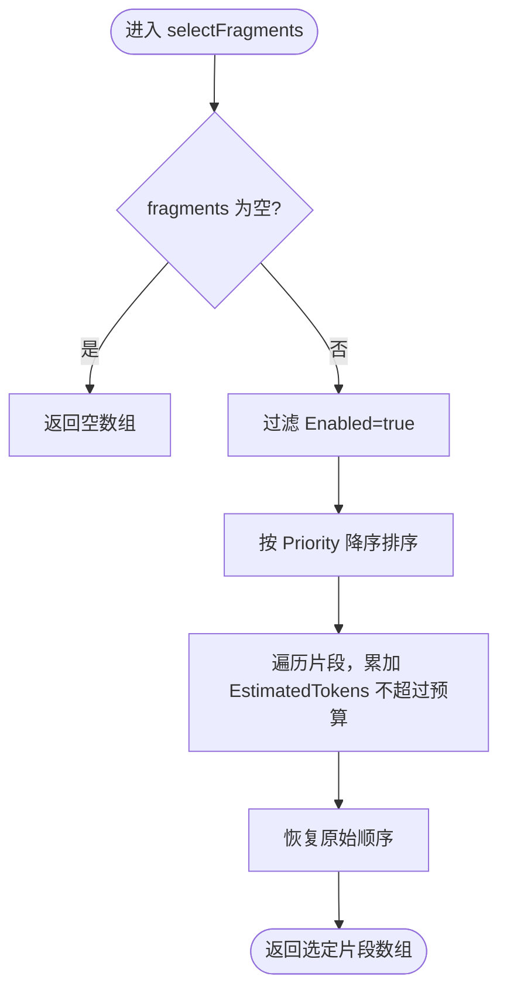
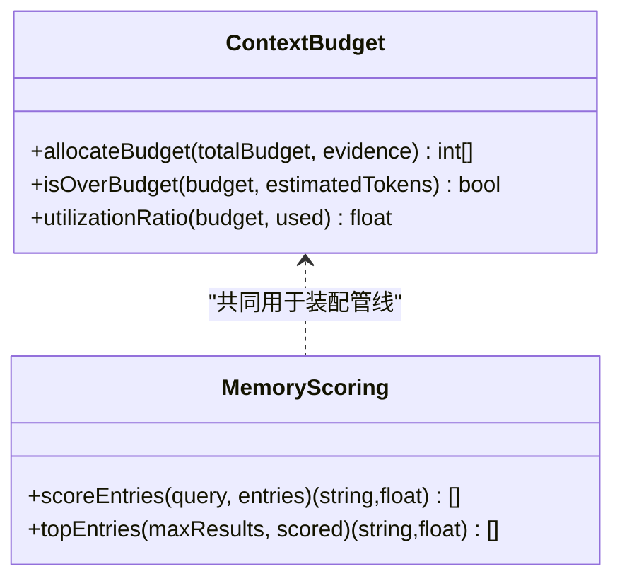
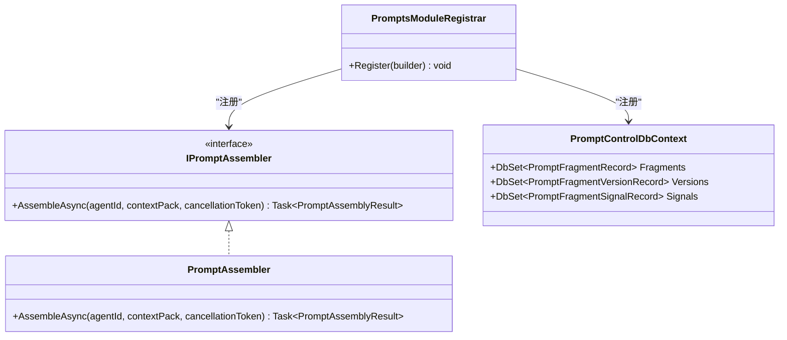
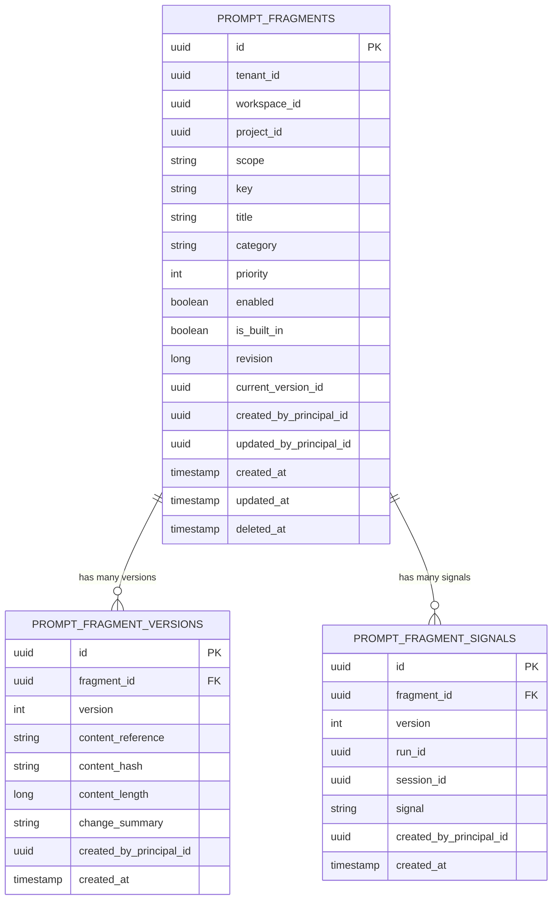
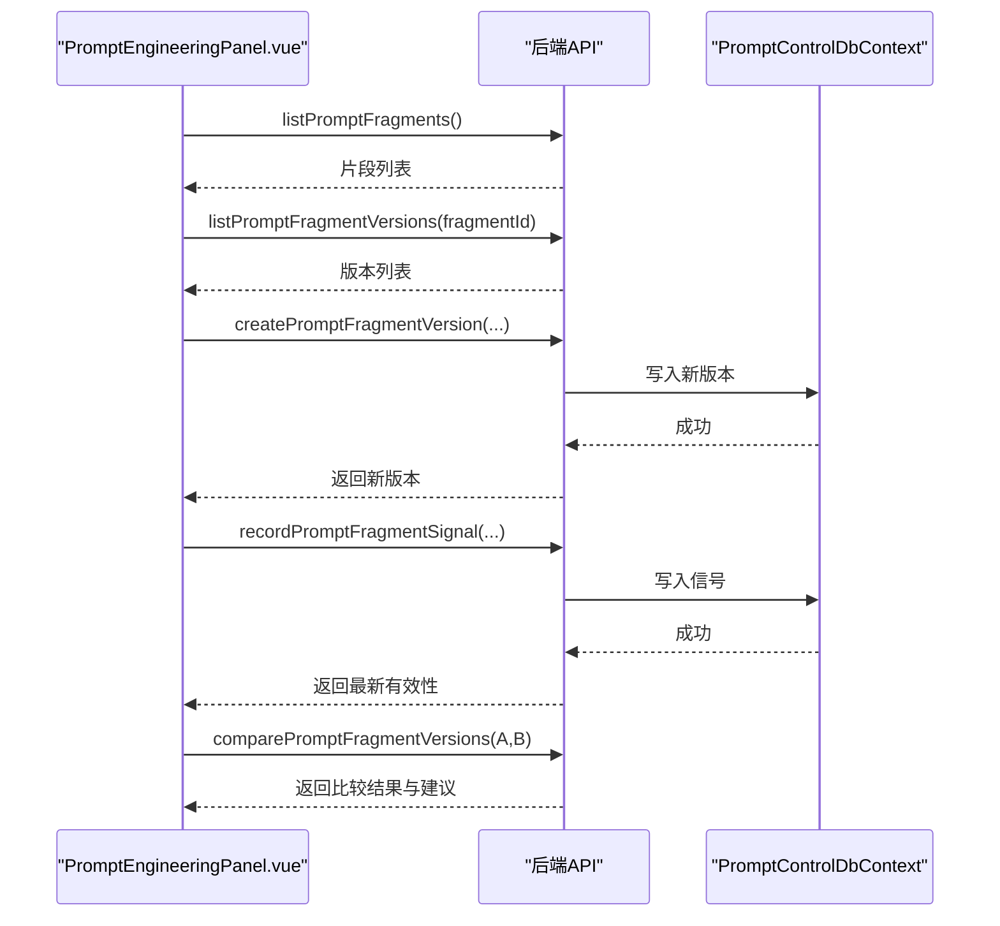
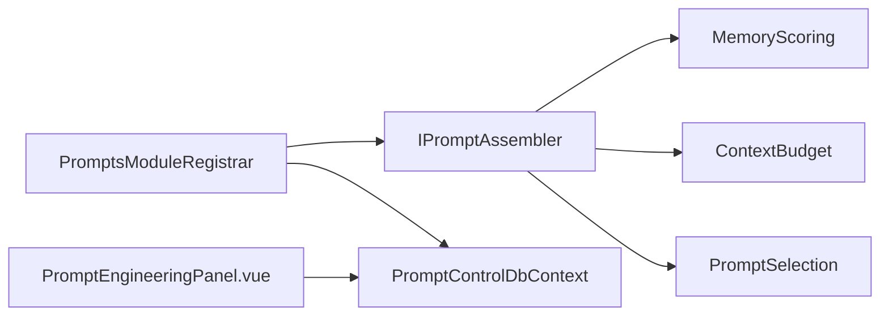

# 提示选择策略

<cite>
**本文引用的文件**   
- [PromptSelection.fs](file://TinadecCore/Strategies/PromptSelection.fs)
- [IPromptAssembler.cs](file://TinadecCore/Abstractions/Ports/IPromptAssembler.cs)
- [PromptsModuleRegistrar.cs](file://TinadecCore/Prompts/PromptsModuleRegistrar.cs)
- [PromptControlDbContext.cs](file://TinadecCore/Prompts/PromptControlDbContext.cs)
- [ContextBudget.fs](file://TinadecCore/Strategies/ContextBudget.fs)
- [MemoryScoring.fs](file://TinadecCore/Strategies/MemoryScoring.fs)
- [PromptEngineeringPanel.vue](file://apps/desktop/src/components/PromptEngineeringPanel.vue)
</cite>

## 目录
1. [简介](#简介)
2. [项目结构](#项目结构)
3. [核心组件](#核心组件)
4. [架构总览](#架构总览)
5. [详细组件分析](#详细组件分析)
6. [依赖关系分析](#依赖关系分析)
7. [性能考量](#性能考量)
8. [故障排查指南](#故障排查指南)
9. [结论](#结论)
10. [附录](#附录)

## 简介
本文件围绕 PromptSelection 提示选择策略，系统化阐述候选提示的评估、匹配度与适用性判断逻辑；说明提示模板（Fragment）的管理方式、动态选择与组合机制；给出可落地的选择算法实现示例与自定义策略开发指南；并覆盖提示优化策略、版本管理与 A/B 测试支持，以及与模型提供商适配和提示工程最佳实践。

## 项目结构
与提示选择相关的关键位置：
- 策略层（F#）：PromptSelection.fs 提供基于优先级与 Token 预算的片段选择纯函数；ContextBudget.fs 提供预算分配与利用率计算；MemoryScoring.fs 提供基于关键词重叠的相关性评分。
- 抽象接口（C#）：IPromptAssembler.cs 定义确定性组装入口与结果契约。
- 模块注册（C#）：PromptsModuleRegistrar.cs 注册 IPromptAssembler 及数据库上下文，当前为骨架实现。
- 数据模型（C# EF Core）：PromptControlDbContext.cs 定义 Fragment、Version、Signal 三张表及其索引与约束。
- 前端面板（Vue）：PromptEngineeringPanel.vue 提供版本快照、信号记录、A/B 对比等能力。

图表来源 
- [PromptSelection.fs:1-38](file://TinadecCore/Strategies/PromptSelection.fs#L1-L38)
- [ContextBudget.fs:1-36](file://TinadecCore/Strategies/ContextBudget.fs#L1-L36)
- [MemoryScoring.fs:1-46](file://TinadecCore/Strategies/MemoryScoring.fs#L1-L46)
- [IPromptAssembler.cs:1-23](file://TinadecCore/Abstractions/Ports/IPromptAssembler.cs#L1-L23)
- [PromptsModuleRegistrar.cs:1-55](file://TinadecCore/Prompts/PromptsModuleRegistrar.cs#L1-L55)
- [PromptControlDbContext.cs:1-39](file://TinadecCore/Prompts/PromptControlDbContext.cs#L1-L39)
- [PromptEngineeringPanel.vue:1-800](file://apps/desktop/src/components/PromptEngineeringPanel.vue#L1-L800)

章节来源
- [PromptSelection.fs:1-38](file://TinadecCore/Strategies/PromptSelection.fs#L1-L38)
- [IPromptAssembler.cs:1-23](file://TinadecCore/Abstractions/Ports/IPromptAssembler.cs#L1-L23)
- [PromptsModuleRegistrar.cs:1-55](file://TinadecCore/Prompts/PromptsModuleRegistrar.cs#L1-L55)
- [PromptControlDbContext.cs:1-39](file://TinadecCore/Prompts/PromptControlDbContext.cs#L1-L39)
- [ContextBudget.fs:1-36](file://TinadecCore/Strategies/ContextBudget.fs#L1-L36)
- [MemoryScoring.fs:1-46](file://TinadecCore/Strategies/MemoryScoring.fs#L1-L46)
- [PromptEngineeringPanel.vue:1-800](file://apps/desktop/src/components/PromptEngineeringPanel.vue#L1-L800)

## 核心组件
- 提示片段选择器（PromptSelection）
  - 输入：token 预算、片段集合（含 Id、Priority、EstimatedTokens、Enabled）。
  - 行为：过滤启用片段，按优先级降序排序，贪心累加不超过预算的片段。
  - 输出：选定片段数组（保持原顺序）。
- 预算与利用率（ContextBudget）
  - 功能：按比例分配证据项预算、超预算判定、利用率计算。
- 相关性评分（MemoryScoring）
  - 功能：基于关键词重叠计算相关性得分，筛选 Top-N。
- 提示装配接口（IPromptAssembler）
  - 职责：根据 agentId 与 ContextPack 确定性地组装 Instructions、估算 Token、返回已用片段 ID 与警告。
- 提示模块注册（PromptsModuleRegistrar）
  - 职责：注册 EF Core DbContext、迁移参与者、IPromptAssembler（当前为骨架实现，返回空结果与警告）。
- 提示数据模型（PromptControlDbContext）
  - 实体：prompt_fragments、prompt_fragment_versions、prompt_fragment_signals，包含租户/工作区/项目维度、Key、Scope、Category、Priority、Enabled、IsBuiltIn、Revision、CurrentVersionId 等字段，以及唯一索引与时间戳。
- 提示工程面板（PromptEngineeringPanel.vue）
  - 能力：列出片段、查看版本历史、创建新版本、回滚、记录正负信号、A/B 比较两个版本的分数差异与建议。

章节来源
- [PromptSelection.fs:1-38](file://TinadecCore/Strategies/PromptSelection.fs#L1-L38)
- [ContextBudget.fs:1-36](file://TinadecCore/Strategies/ContextBudget.fs#L1-L36)
- [MemoryScoring.fs:1-46](file://TinadecCore/Strategies/MemoryScoring.fs#L1-L46)
- [IPromptAssembler.cs:1-23](file://TinadecCore/Abstractions/Ports/IPromptAssembler.cs#L1-L23)
- [PromptsModuleRegistrar.cs:1-55](file://TinadecCore/Prompts/PromptsModuleRegistrar.cs#L1-L55)
- [PromptControlDbContext.cs:1-39](file://TinadecCore/Prompts/PromptControlDbContext.cs#L1-L39)
- [PromptEngineeringPanel.vue:1-800](file://apps/desktop/src/components/PromptEngineeringPanel.vue#L1-L800)

## 架构总览
提示选择与装配的整体流程如下：
- 调用方通过 IPromptAssembler.AssembleAsync 发起请求。
- 装配器读取上下文（ContextPack）、查询可用片段（按 Scope/Category/TargetAgentId 等维度），结合 MemoryScoring 进行相关性打分。
- 使用 ContextBudget 进行预算分配与超预算检查。
- 调用 PromptSelection.selectFragments 按优先级与 EstimatedTokens 做贪心选择。
- 生成 PromptAssemblyResult（Instructions、EstimatedTokens、FragmentIds、Warnings）。

图表来源 
- [IPromptAssembler.cs:1-23](file://TinadecCore/Abstractions/Ports/IPromptAssembler.cs#L1-L23)
- [PromptControlDbContext.cs:1-39](file://TinadecCore/Prompts/PromptControlDbContext.cs#L1-L39)
- [MemoryScoring.fs:1-46](file://TinadecCore/Strategies/MemoryScoring.fs#L1-L46)
- [ContextBudget.fs:1-36](file://TinadecCore/Strategies/ContextBudget.fs#L1-L36)
- [PromptSelection.fs:1-38](file://TinadecCore/Strategies/PromptSelection.fs#L1-L38)

## 详细组件分析

### 提示片段选择器（PromptSelection）
- 设计要点
  - 纯函数，无副作用，便于单元测试与可重复性。
  - 输入校验：空输入返回空数组。
  - 过滤：仅选择 Enabled=true 的片段。
  - 排序：按 Priority 降序，确保高优先级优先入选。
  - 贪心选择：累计 EstimatedTokens 不超过 tokenBudget。
  - 输出：保持原始顺序（先逆序累积再反转）。
- 复杂度
  - 时间：O(n log n) 排序 + O(n) 扫描。
  - 空间：O(n) 中间列表。
- 边界与健壮性
  - 空集合、全部禁用、预算为 0 均安全处理。
  - EstimatedTokens 非负假设（若可能为 0，需防止死循环；当前实现不会无限循环，但会重复选择 0 成本项，建议在上层保证去重或最小成本 > 0）。

图表来源 
- [PromptSelection.fs:1-38](file://TinadecCore/Strategies/PromptSelection.fs#L1-L38)

章节来源
- [PromptSelection.fs:1-38](file://TinadecCore/Strategies/PromptSelection.fs#L1-L38)

### 预算与相关性（ContextBudget 与 MemoryScoring）
- ContextBudget
  - allocateBudget：按 EstimatedTokens 比例分配总预算。
  - isOverBudget：判断是否超预算。
  - utilizationRatio：计算利用率（used/budget）。
- MemoryScoring
  - scoreEntries：将 query 分词，与条目内容分词求交集占比作为得分。
  - topEntries：过滤得分>0，按得分降序取 Top-N。

图表来源 
- [ContextBudget.fs:1-36](file://TinadecCore/Strategies/ContextBudget.fs#L1-L36)
- [MemoryScoring.fs:1-46](file://TinadecCore/Strategies/MemoryScoring.fs#L1-L46)

章节来源
- [ContextBudget.fs:1-36](file://TinadecCore/Strategies/ContextBudget.fs#L1-L36)
- [MemoryScoring.fs:1-46](file://TinadecCore/Strategies/MemoryScoring.fs#L1-L46)

### 提示装配接口与模块注册（IPromptAssembler 与 PromptsModuleRegistrar）
- IPromptAssembler
  - 方法：AssembleAsync(agentId, contextPack, cancellationToken)。
  - 结果：PromptAssemblyResult（Instructions、EstimatedTokens、FragmentIds、Warnings）。
- PromptsModuleRegistrar
  - 注册 EF Core DbContextFactory、迁移参与者、IPromptAssembler 单例。
  - 当前 PromptAssembler 为骨架实现，直接返回空 Instructions、0 Token、空 FragmentIds 与“骨架状态”警告。

图表来源 
- [IPromptAssembler.cs:1-23](file://TinadecCore/Abstractions/Ports/IPromptAssembler.cs#L1-L23)
- [PromptsModuleRegistrar.cs:1-55](file://TinadecCore/Prompts/PromptsModuleRegistrar.cs#L1-L55)
- [PromptControlDbContext.cs:1-39](file://TinadecCore/Prompts/PromptControlDbContext.cs#L1-L39)

章节来源
- [IPromptAssembler.cs:1-23](file://TinadecCore/Abstractions/Ports/IPromptAssembler.cs#L1-L23)
- [PromptsModuleRegistrar.cs:1-55](file://TinadecCore/Prompts/PromptsModuleRegistrar.cs#L1-L55)
- [PromptControlDbContext.cs:1-39](file://TinadecCore/Prompts/PromptControlDbContext.cs#L1-L39)

### 提示数据模型（EF Core 实体）
- prompt_fragments：标识符、租户/工作区/项目、Scope、Key、Title、Category、Priority、Enabled、IsBuiltIn、Revision、CurrentVersionId、审计字段、软删除。
- prompt_fragment_versions：关联 Fragment、版本号、内容引用与哈希、长度、变更摘要、审计字段。
- prompt_fragment_signals：关联 Fragment/Version、可选 RunId/SessionId、Signal 值、审计字段。
- 索引：唯一键保障 Key 在租户/工作区/项目/目标 Agent/未删除范围内唯一；版本唯一；信号按 Fragment/Version/时间索引。

图表来源 
- [PromptControlDbContext.cs:1-39](file://TinadecCore/Prompts/PromptControlDbContext.cs#L1-39)

章节来源
- [PromptControlDbContext.cs:1-39](file://TinadecCore/Prompts/PromptControlDbContext.cs#L1-39)

### 前端提示工程面板（版本管理、信号与 A/B 测试）
- 功能点
  - 列出所有片段与整体有效性概览。
  - 选择片段后加载版本历史与有效性指标。
  - 创建新版本（内容、变更字段、变更摘要）。
  - 回滚到指定版本。
  - 记录正/负信号（可选版本与备注），刷新有效性。
  - A/B 比较两个版本的分数差异与建议。
- 数据流
  - 前端通过 API 调用后端服务（由 PromptsModuleRegistrar 注册的模块暴露），更新本地状态并展示。

图表来源 
- [PromptEngineeringPanel.vue:1-800](file://apps/desktop/src/components/PromptEngineeringPanel.vue#L1-L800)
- [PromptControlDbContext.cs:1-39](file://TinadecCore/Prompts/PromptControlDbContext.cs#L1-39)

章节来源
- [PromptEngineeringPanel.vue:1-800](file://apps/desktop/src/components/PromptEngineeringPanel.vue#L1-L800)

## 依赖关系分析
- 模块内依赖
  - PromptsModuleRegistrar 依赖 Abstractions、Persistence、Strategies。
  - IPromptAssembler 被 PromptsModuleRegistrar 注册为单例。
  - PromptControlDbContext 由模块注册时注入 DbContextFactory。
- 策略间依赖
  - MemoryScoring 为上游相关性评分，供装配器筛选候选。
  - ContextBudget 为预算控制，供装配器决定最终纳入范围。
  - PromptSelection 为最终选择器，依据优先级与预算做贪心选择。
- 外部集成
  - 前端通过 API 与后端交互，读写 Fragment/Version/Signal 数据。

图表来源 
- [PromptsModuleRegistrar.cs:1-55](file://TinadecCore/Prompts/PromptsModuleRegistrar.cs#L1-L55)
- [IPromptAssembler.cs:1-23](file://TinadecCore/Abstractions/Ports/IPromptAssembler.cs#L1-L23)
- [PromptControlDbContext.cs:1-39](file://TinadecCore/Prompts/PromptControlDbContext.cs#L1-39)
- [MemoryScoring.fs:1-46](file://TinadecCore/Strategies/MemoryScoring.fs#L1-L46)
- [ContextBudget.fs:1-36](file://TinadecCore/Strategies/ContextBudget.fs#L1-L36)
- [PromptSelection.fs:1-38](file://TinadecCore/Strategies/PromptSelection.fs#L1-L38)
- [PromptEngineeringPanel.vue:1-800](file://apps/desktop/src/components/PromptEngineeringPanel.vue#L1-L800)

章节来源
- [PromptsModuleRegistrar.cs:1-55](file://TinadecCore/Prompts/PromptsModuleRegistrar.cs#L1-L55)
- [IPromptAssembler.cs:1-23](file://TinadecCore/Abstractions/Ports/IPromptAssembler.cs#L1-L23)
- [PromptControlDbContext.cs:1-39](file://TinadecCore/Prompts/PromptControlDbContext.cs#L1-39)
- [MemoryScoring.fs:1-46](file://TinadecCore/Strategies/MemoryScoring.fs#L1-L46)
- [ContextBudget.fs:1-36](file://TinadecCore/Strategies/ContextBudget.fs#L1-L36)
- [PromptSelection.fs:1-38](file://TinadecCore/Strategies/PromptSelection.fs#L1-L38)
- [PromptEngineeringPanel.vue:1-800](file://apps/desktop/src/components/PromptEngineeringPanel.vue#L1-L800)

## 性能考量
- 选择算法
  - 排序 O(n log n)，贪心扫描 O(n)，总体高效；适合中等规模片段集合。
- 预算分配
  - 线性扫描求和与映射，常数开销小。
- 相关性评分
  - 分词与集合交集操作，复杂度与词数线性相关；对长文本建议预处理缓存分词结果。
- 数据库访问
  - 合理索引（如 Key 唯一索引、版本唯一索引、信号索引）可减少查询延迟。
- 前端渲染
  - 列表与详情分离，按需加载版本与有效性，避免一次性渲染过多数据。

[本节为通用指导，不直接分析具体文件]

## 故障排查指南
- 常见问题
  - 装配结果为空：确认 PromptAssembler 已替换骨架实现；检查片段是否 Enabled=false；检查 tokenBudget 是否为 0。
  - 选择顺序不符合预期：核对 Priority 赋值与排序方向；确认 EstimatedTokens 估算准确。
  - 版本回滚失败：确认目标版本存在且未被删除；检查权限与事务一致性。
  - A/B 比较无结果：确保至少有两个版本；检查比较参数是否正确。
- 定位手段
  - 查看 Warnings 字段（骨架状态下会返回提示信息）。
  - 通过前端面板刷新与重试，观察错误通知。
  - 检查数据库索引与数据完整性（唯一键冲突、缺失外键等）。

章节来源
- [PromptsModuleRegistrar.cs:1-55](file://TinadecCore/Prompts/PromptsModuleRegistrar.cs#L1-L55)
- [PromptEngineeringPanel.vue:1-800](file://apps/desktop/src/components/PromptEngineeringPanel.vue#L1-L800)

## 结论
本项目提供了清晰的提示选择与装配框架：以 F# 纯函数实现稳定高效的片段选择策略，配合 C# 抽象接口与 EF Core 数据模型，形成从数据管理到选择装配的完整链路。前端面板完善了版本管理、信号采集与 A/B 测试体验。后续可通过完善 PromptAssembler 的具体实现，接入更多上下文与评分策略，进一步提升提示选择的准确性与可控性。

[本节为总结，不直接分析具体文件]

## 附录

### 提示选择算法实现示例（步骤级）
- 输入：tokenBudget、fragments（含 Id、Priority、EstimatedTokens、Enabled）。
- 步骤：
  1) 过滤 Enabled=true 的片段。
  2) 按 Priority 降序排序。
  3) 初始化剩余预算=tokenBudget，结果集为空。
  4) 遍历片段：若剩余预算>=EstimatedTokens，则加入结果集并扣减预算。
  5) 保持原始顺序返回结果集。
- 参考路径
  - [selectFragments 实现:22-38](file://TinadecCore/Strategies/PromptSelection.fs#L22-L38)

章节来源
- [PromptSelection.fs:1-38](file://TinadecCore/Strategies/PromptSelection.fs#L1-L38)

### 自定义提示策略开发指南
- 扩展相关性评分
  - 在 MemoryScoring 基础上增加语义相似度（向量检索）或规则权重。
- 扩展预算策略
  - 在 ContextBudget 中引入类别权重、动态阈值与自适应调整。
- 扩展选择策略
  - 在 PromptSelection 中增加多目标优化（如多样性惩罚、覆盖率约束）。
- 集成装配器
  - 实现 IPromptAssembler 的具体类，串联评分、预算与选择，返回 PromptAssemblyResult。
- 参考路径
  - [IPromptAssembler 接口:1-23](file://TinadecCore/Abstractions/Ports/IPromptAssembler.cs#L1-23)
  - [PromptsModuleRegistrar 注册:1-55](file://TinadecCore/Prompts/PromptsModuleRegistrar.cs#L1-55)

章节来源
- [IPromptAssembler.cs:1-23](file://TinadecCore/Abstractions/Ports/IPromptAssembler.cs#L1-L23)
- [PromptsModuleRegistrar.cs:1-55](file://TinadecCore/Prompts/PromptsModuleRegistrar.cs#L1-L55)
- [MemoryScoring.fs:1-46](file://TinadecCore/Strategies/MemoryScoring.fs#L1-L46)
- [ContextBudget.fs:1-36](file://TinadecCore/Strategies/ContextBudget.fs#L1-L36)
- [PromptSelection.fs:1-38](file://TinadecCore/Strategies/PromptSelection.fs#L1-L38)

### 提示优化策略与版本管理
- 优化策略
  - 基于信号反馈（正/负）迭代调整 Priority、Enabled、EstimatedTokens。
  - 通过 A/B 比较不同版本的 effectiveness_score 与推荐结论，择优上线。
- 版本管理
  - 每次变更创建新版本，记录变更字段与摘要；支持回滚至任意历史版本。
- 参考路径
  - [版本与信号模型:1-39](file://TinadecCore/Prompts/PromptControlDbContext.cs#L1-39)
  - [前端版本与信号操作:1-800](file://apps/desktop/src/components/PromptEngineeringPanel.vue#L1-800)

章节来源
- [PromptControlDbContext.cs:1-39](file://TinadecCore/Prompts/PromptControlDbContext.cs#L1-39)
- [PromptEngineeringPanel.vue:1-800](file://apps/desktop/src/components/PromptEngineeringPanel.vue#L1-L800)

### A/B 测试支持
- 能力
  - 选择两个版本进行对比，返回各自分数与差异百分比，并提供建议。
- 使用流程
  - 在前端面板中选择版本 A 与 B，触发比较，获取结果并据此决策。
- 参考路径
  - [A/B 比较 UI 与调用:1-800](file://apps/desktop/src/components/PromptEngineeringPanel.vue#L1-800)

章节来源
- [PromptEngineeringPanel.vue:1-800](file://apps/desktop/src/components/PromptEngineeringPanel.vue#L1-L800)

### 与模型提供商的适配方式
- 适配点
  - IPromptAssembler 负责将片段与上下文组装为 ChatOptions.Instructions / AIContext，屏蔽下游差异。
  - 可在装配器中针对不同提供商设置不同的指令格式、系统提示与工具描述。
- 最佳实践
  - 将指令内容与执行细节解耦；通过 Fragment 管理通用指令，通过 ContextPack 注入运行时信息。
- 参考路径
  - [IPromptAssembler 接口:1-23](file://TinadecCore/Abstractions/Ports/IPromptAssembler.cs#L1-L23)

章节来源
- [IPromptAssembler.cs:1-23](file://TinadecCore/Abstractions/Ports/IPromptAssembler.cs#L1-L23)

### 提示工程最佳实践
- 明确 Scope/Category/TargetAgentId 划分，减少无关片段参与选择。
- 合理设置 Priority 与 EstimatedTokens，避免低价值片段挤占预算。
- 持续记录信号与有效性，驱动迭代优化。
- 使用版本化管理，确保可追溯与可回滚。
- 参考路径
  - [数据模型与索引:1-39](file://TinadecCore/Prompts/PromptControlDbContext.cs#L1-39)
  - [前端面板操作:1-800](file://apps/desktop/src/components/PromptEngineeringPanel.vue#L1-800)

章节来源
- [PromptControlDbContext.cs:1-39](file://TinadecCore/Prompts/PromptControlDbContext.cs#L1-39)
- [PromptEngineeringPanel.vue:1-800](file://apps/desktop/src/components/PromptEngineeringPanel.vue#L1-L800)