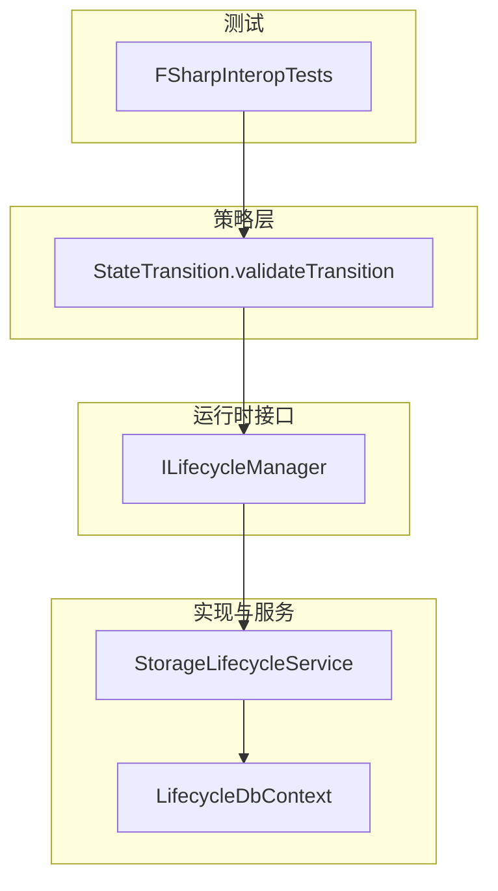
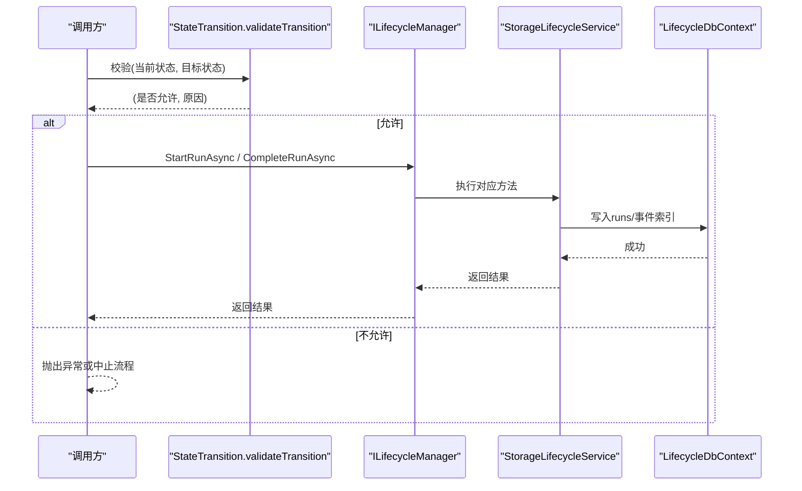
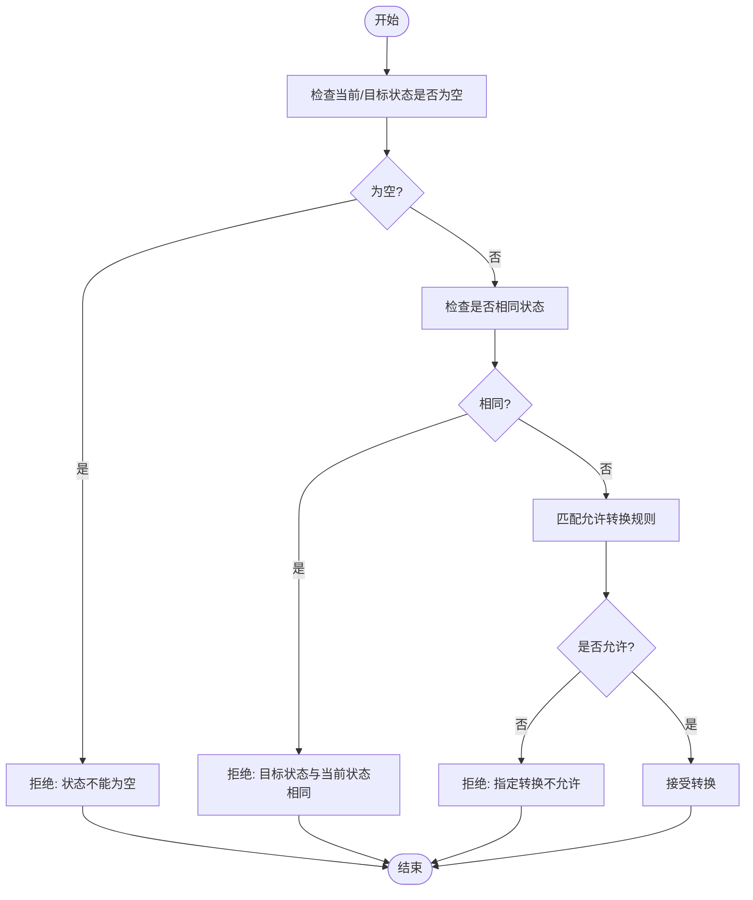
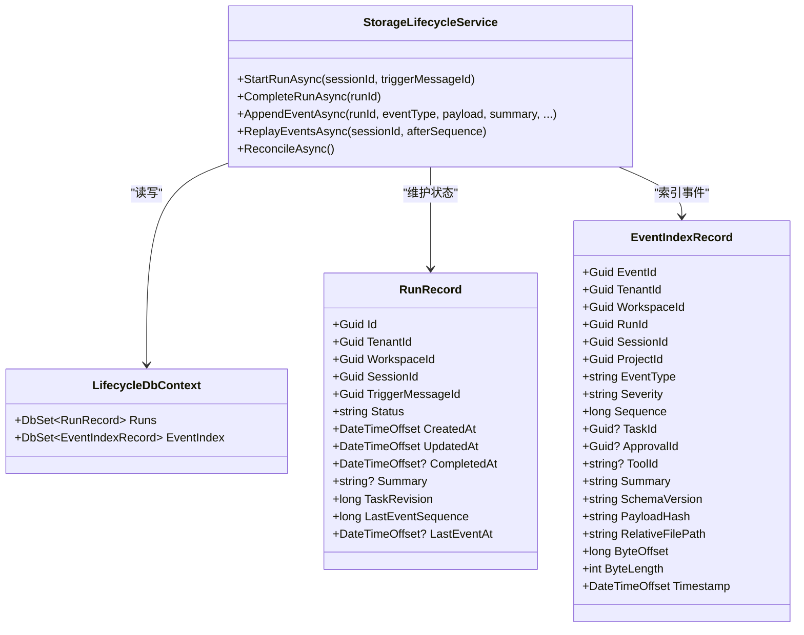

# 状态转换策略

<cite>
**本文引用的文件**   
- [StateTransition.fs](file://TinadecCore/Strategies/StateTransition.fs)
- [ILifecycleManager.cs](file://TinadecCore/Abstractions/Ports/ILifecycleManager.cs)
- [StorageLifecycleService.cs](file://TinadecCore/Lifecycle/StorageLifecycleService.cs)
- [LifecycleDbContext.cs](file://TinadecCore/Lifecycle/LifecycleDbContext.cs)
- [FSharpInteropTests.cs](file://TinadecCore/tests/TinadecCore.AgentFramework.Tests/FSharpInteropTests.cs)
</cite>

## 目录
1. [简介](#简介)
2. [项目结构](#项目结构)
3. [核心组件](#核心组件)
4. [架构总览](#架构总览)
5. [详细组件分析](#详细组件分析)
6. [依赖关系分析](#依赖关系分析)
7. [性能考虑](#性能考虑)
8. [故障排查指南](#故障排查指南)
9. [结论](#结论)
10. [附录](#附录)

## 简介
本文件围绕 StateTransition 状态转换策略，系统化阐述 Agent 状态机的定义、转换条件与规则、生命周期管理、验证与错误处理、持久化与回滚机制、并发控制，以及在 Agent 编排中的集成方式。通过纯函数式的状态校验与基于数据库的运行时状态管理相结合，确保状态变更的可预测性、可审计性与高可靠性。

## 项目结构
- 状态转换策略以 F# 模块实现，提供无副作用的纯函数 validateTransition，用于判定任意“当前状态→目标状态”是否合法。
- 运行时状态由 C# 接口 ILifecycleManager 暴露，并由 StorageLifecycleService 实现，负责运行实例（Run）的创建、完成、查询以及事件追加等。
- 数据模型与持久化由 LifecycleDbContext 定义，包含 runs、event_index 等表，支撑状态与事件的持久化与回放。
- 测试覆盖 F# 策略与 C# 互操作，确保 validateTransition 的行为稳定且类型安全。

图表来源
- [StateTransition.fs:1-26](file://TinadecCore/Strategies/StateTransition.fs#L1-L26)
- [ILifecycleManager.cs:1-41](file://TinadecCore/Abstractions/Ports/ILifecycleManager.cs#L1-L41)
- [StorageLifecycleService.cs:1-291](file://TinadecCore/Lifecycle/StorageLifecycleService.cs#L1-L291)
- [LifecycleDbContext.cs:1-136](file://TinadecCore/Lifecycle/LifecycleDbContext.cs#L1-L136)
- [FSharpInteropTests.cs:1-118](file://TinadecCore/tests/TinadecCore.AgentFramework.Tests/FSharpInteropTests.cs#L1-L118)

章节来源
- [StateTransition.fs:1-26](file://TinadecCore/Strategies/StateTransition.fs#L1-L26)
- [ILifecycleManager.cs:1-41](file://TinadecCore/Abstractions/Ports/ILifecycleManager.cs#L1-L41)
- [StorageLifecycleService.cs:1-291](file://TinadecCore/Lifecycle/StorageLifecycleService.cs#L1-L291)
- [LifecycleDbContext.cs:1-136](file://TinadecCore/Lifecycle/LifecycleDbContext.cs#L1-L136)
- [FSharpInteropTests.cs:1-118](file://TinadecCore/tests/TinadecCore.AgentFramework.Tests/FSharpInteropTests.cs#L1-L118)

## 核心组件
- 状态转换策略（F#）
  - 提供 validateTransition(currentState, targetState) → (bool, string)，对空值、相同状态、非法转移进行拒绝并返回原因。
- 生命周期接口（C#）
  - ILifecycleManager 定义 StartRunAsync、CompleteRunAsync、GetRunStateAsync，以及 RunState/RunStatus 枚举。
- 生命周期服务（C#）
  - StorageLifecycleService 实现运行实例的创建、完成、事件追加、回放、重放一致性检查等。
- 数据上下文（C#）
  - LifecycleDbContext 定义 runs、event_index 等实体与索引，支撑状态与事件持久化。
- 测试（C#）
  - FSharpInteropTests 验证 F# 策略函数的返回值类型与行为，保证跨语言互操作正确性。

章节来源
- [StateTransition.fs:1-26](file://TinadecCore/Strategies/StateTransition.fs#L1-L26)
- [ILifecycleManager.cs:1-41](file://TinadecCore/Abstractions/Ports/ILifecycleManager.cs#L1-L41)
- [StorageLifecycleService.cs:1-291](file://TinadecCore/Lifecycle/StorageLifecycleService.cs#L1-L291)
- [LifecycleDbContext.cs:1-136](file://TinadecCore/Lifecycle/LifecycleDbContext.cs#L1-L136)
- [FSharpInteropTests.cs:1-118](file://TinadecCore/tests/TinadecCore.AgentFramework.Tests/FSharpInteropTests.cs#L1-L118)

## 架构总览
下图展示了从调用方到状态校验、再到持久化的完整流程：调用方先通过策略层校验状态转换合法性，再由生命周期服务执行持久化与并发控制，并通过事件日志记录变更轨迹。

图表来源
- [StateTransition.fs:1-26](file://TinadecCore/Strategies/StateTransition.fs#L1-L26)
- [ILifecycleManager.cs:1-41](file://TinadecCore/Abstractions/Ports/ILifecycleManager.cs#L1-L41)
- [StorageLifecycleService.cs:1-291](file://TinadecCore/Lifecycle/StorageLifecycleService.cs#L1-L291)
- [LifecycleDbContext.cs:1-136](file://TinadecCore/Lifecycle/LifecycleDbContext.cs#L1-L136)

## 详细组件分析

### 状态机定义与转换规则
- 状态集合
  - pending、running、completed、failed、cancelled
- 允许的转换
  - pending → running
  - running → completed
  - running → failed
  - running → cancelled
  - pending → cancelled
  - failed → pending
  - cancelled → pending
- 禁止的转换
  - 任何非法组合均被拒绝，并返回具体原因字符串
- 边界条件
  - 空状态或相同状态直接拒绝

图表来源
- [StateTransition.fs:1-26](file://TinadecCore/Strategies/StateTransition.fs#L1-L26)

章节来源
- [StateTransition.fs:1-26](file://TinadecCore/Strategies/StateTransition.fs#L1-L26)

### 生命周期管理与状态持久化
- 运行实例（Run）
  - 字段包括 Id、TenantId、WorkspaceId、SessionId、TriggerMessageId、Status、时间戳、摘要、任务版本、最后事件序列与时间等
  - 初始状态在创建时设置为 running；完成时更新为 completed 并记录 CompletedAt
- 事件系统
  - AppendEventAsync 使用按 RunId 的 SemaphoreSlim 进行并发控制，确保顺序追加与一致性
  - 事件写入 JSONL 文件，并在 event_index 中建立索引（含哈希、偏移、长度），支持回放与一致性校验
- 一致性保障
  - ReconcileAsync 扫描事件文件，重建缺失索引，忽略损坏记录并记录诊断信息
- 事务与原子性
  - 事件追加与 run 元数据更新在同一事务内提交，保证状态与事件的一致性

图表来源
- [LifecycleDbContext.cs:1-136](file://TinadecCore/Lifecycle/LifecycleDbContext.cs#L1-L136)
- [StorageLifecycleService.cs:1-291](file://TinadecCore/Lifecycle/StorageLifecycleService.cs#L1-L291)

章节来源
- [LifecycleDbContext.cs:1-136](file://TinadecCore/Lifecycle/LifecycleDbContext.cs#L1-L136)
- [StorageLifecycleService.cs:1-291](file://TinadecCore/Lifecycle/StorageLifecycleService.cs#L1-L291)

### 转换验证与错误处理
- 验证入口
  - 调用方在每次状态变更前调用 validateTransition，若返回无效则中止后续操作
- 错误语义
  - 空状态：返回明确原因
  - 相同状态：防止无意义转换
  - 非法转换：返回具体“不允许”的原因
- 测试覆盖
  - FSharpInteropTests 验证有效与无效转换路径，确保返回类型为 bool*string，且不泄露 F# 类型

章节来源
- [StateTransition.fs:1-26](file://TinadecCore/Strategies/StateTransition.fs#L1-L26)
- [FSharpInteropTests.cs:1-118](file://TinadecCore/tests/TinadecCore.AgentFramework.Tests/FSharpInteropTests.cs#L1-L118)

### 并发控制与幂等性
- 并发控制
  - AppendEventAsync 使用 ConcurrentDictionary<Guid, SemaphoreSlim> 按 RunId 加锁，避免同一运行的事件写入竞争
- 幂等性建议
  - 事件索引唯一键（RunId, Sequence）保障重复写入时的冲突检测
  - 建议在调用方对关键状态变更做幂等设计（如重试时携带幂等键）

章节来源
- [StorageLifecycleService.cs:1-291](file://TinadecCore/Lifecycle/StorageLifecycleService.cs#L1-L291)
- [LifecycleDbContext.cs:1-136](file://TinadecCore/Lifecycle/LifecycleDbContext.cs#L1-L136)

### 状态持久化与回滚机制
- 持久化
  - runs 表存储运行状态；event_index 表索引事件；JSONL 文件存储事件正文
- 回滚策略
  - 事件追加与 run 元数据更新在同一事务内提交，失败自动回滚
  - ReconcileAsync 用于修复不一致，忽略损坏记录并补充索引
- 快照与工件
  - WriteTaskSnapshotAsync 使用临时文件+替换策略，确保原子更新

章节来源
- [StorageLifecycleService.cs:1-291](file://TinadecCore/Lifecycle/StorageLifecycleService.cs#L1-L291)
- [LifecycleDbContext.cs:1-136](file://TinadecCore/Lifecycle/LifecycleDbContext.cs#L1-L136)

### 在 Agent 编排中的作用与集成
- 作用
  - 作为编排引擎的状态门控，确保 Agent 生命周期各阶段（启动、运行、完成、失败、取消）严格遵循转换规则
- 集成点
  - 编排器在发起工具调用、审批、任务调度前调用 validateTransition
  - 编排器通过 ILifecycleManager 触发状态变更，并订阅事件流进行可视化与审计

章节来源
- [ILifecycleManager.cs:1-41](file://TinadecCore/Abstractions/Ports/ILifecycleManager.cs#L1-L41)
- [StorageLifecycleService.cs:1-291](file://TinadecCore/Lifecycle/StorageLifecycleService.cs#L1-L291)

## 依赖关系分析
- 策略层与运行时解耦
  - F# 策略仅负责纯函数校验，不依赖 I/O 或外部状态
- 运行时依赖 EF Core 与文件系统
  - LifecycleDbContext 映射数据库表与索引
  - StorageLifecycleService 同时写数据库与 JSONL 文件，并通过事务与索引保持一致性
- 测试依赖策略与接口契约
  - FSharpInteropTests 验证策略返回类型与行为，确保跨语言互操作

图表来源
- [StateTransition.fs:1-26](file://TinadecCore/Strategies/StateTransition.fs#L1-L26)
- [ILifecycleManager.cs:1-41](file://TinadecCore/Abstractions/Ports/ILifecycleManager.cs#L1-L41)
- [StorageLifecycleService.cs:1-291](file://TinadecCore/Lifecycle/StorageLifecycleService.cs#L1-L291)
- [LifecycleDbContext.cs:1-136](file://TinadecCore/Lifecycle/LifecycleDbContext.cs#L1-L136)
- [FSharpInteropTests.cs:1-118](file://TinadecCore/tests/TinadecCore.AgentFramework.Tests/FSharpInteropTests.cs#L1-L118)

章节来源
- [StateTransition.fs:1-26](file://TinadecCore/Strategies/StateTransition.fs#L1-L26)
- [ILifecycleManager.cs:1-41](file://TinadecCore/Abstractions/Ports/ILifecycleManager.cs#L1-L41)
- [StorageLifecycleService.cs:1-291](file://TinadecCore/Lifecycle/StorageLifecycleService.cs#L1-L291)
- [LifecycleDbContext.cs:1-136](file://TinadecCore/Lifecycle/LifecycleDbContext.cs#L1-L136)
- [FSharpInteropTests.cs:1-118](file://TinadecCore/tests/TinadecCore.AgentFramework.Tests/FSharpInteropTests.cs#L1-L118)

## 性能考虑
- 纯函数校验零开销
  - validateTransition 无 I/O，适合高频调用
- 事件追加优化
  - 使用 FileStream 追加模式与 WriteThrough，减少内存拷贝与提升落盘可靠性
- 索引与回放
  - event_index 提供高效检索与回放；PayloadHash 可用于去重与完整性校验
- 并发控制
  - 按 RunId 的细粒度信号量避免全局锁，提高吞吐

[本节为通用指导，无需引用具体文件]

## 故障排查指南
- 常见错误
  - 非法状态转换：检查 validateTransition 返回的原因字符串
  - 事件写入失败：检查 AppendEventAsync 的事务与文件权限
  - 回放不一致：运行 ReconcileAsync 修复索引
- 定位步骤
  - 查看 runs.Status 与 LastEventSequence
  - 根据 EventIndexRecord 的 RelativeFilePath、ByteOffset、ByteLength 定位事件文件片段
  - 核对 PayloadHash 与原始字节一致性
- 恢复策略
  - 对于损坏记录，忽略并继续；必要时清理并重建索引

章节来源
- [StorageLifecycleService.cs:1-291](file://TinadecCore/Lifecycle/StorageLifecycleService.cs#L1-L291)
- [LifecycleDbContext.cs:1-136](file://TinadecCore/Lifecycle/LifecycleDbContext.cs#L1-L136)

## 结论
StateTransition 策略以纯函数形式提供强一致的状态转换校验，结合 StorageLifecycleService 的并发控制、事务与事件索引，构建了可靠、可审计、可扩展的 Agent 状态机。通过清晰的职责分离与严格的转换规则，系统在复杂编排场景下仍能保持确定性与稳定性。

[本节为总结，无需引用具体文件]

## 附录

### 自定义转换规则开发指南
- 扩展策略
  - 在 StateTransition 中添加新的匹配分支，定义允许的“当前状态→目标状态”组合
  - 保持返回 (bool, string) 的语义，确保调用方可统一处理
- 集成验证
  - 在 FSharpInteropTests 中新增用例，覆盖新规则的有效与无效路径
- 运行时适配
  - 若需要持久化新状态，确保 LifecycleDbContext 与迁移脚本同步更新
  - 在 StorageLifecycleService 中补充相应状态变更逻辑（如 CompleteRunAsync 之外的新终结态）

章节来源
- [StateTransition.fs:1-26](file://TinadecCore/Strategies/StateTransition.fs#L1-L26)
- [FSharpInteropTests.cs:1-118](file://TinadecCore/tests/TinadecCore.AgentFramework.Tests/FSharpInteropTests.cs#L1-L118)
- [LifecycleDbContext.cs:1-136](file://TinadecCore/Lifecycle/LifecycleDbContext.cs#L1-L136)
- [StorageLifecycleService.cs:1-291](file://TinadecCore/Lifecycle/StorageLifecycleService.cs#L1-L291)