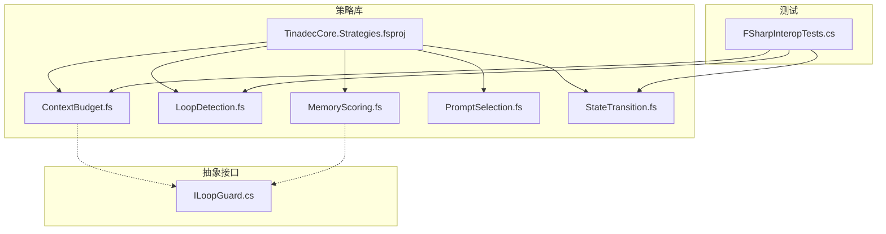
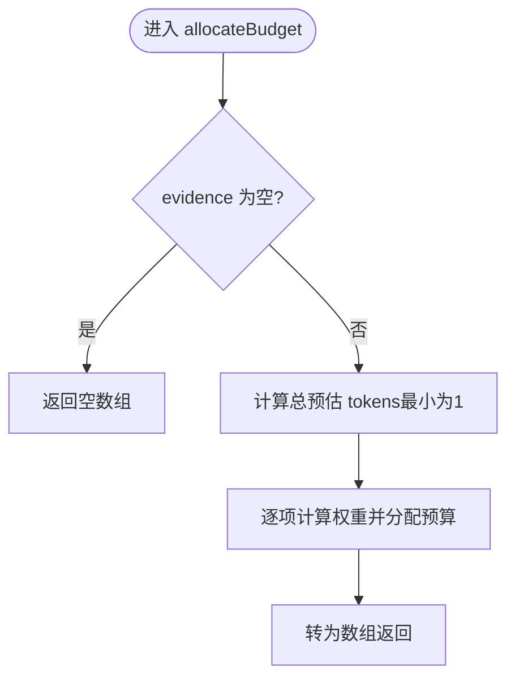
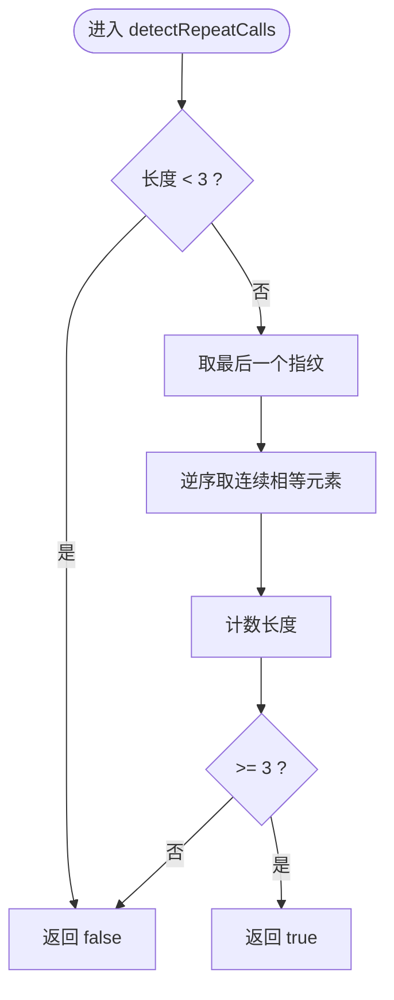
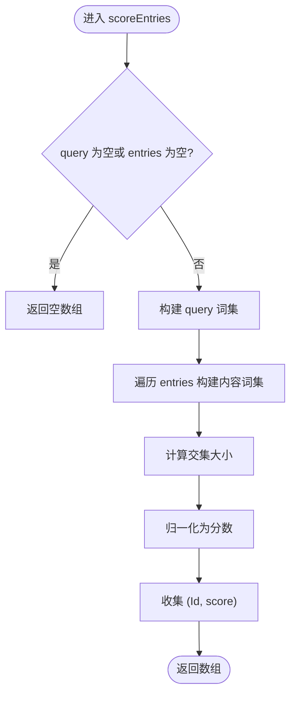
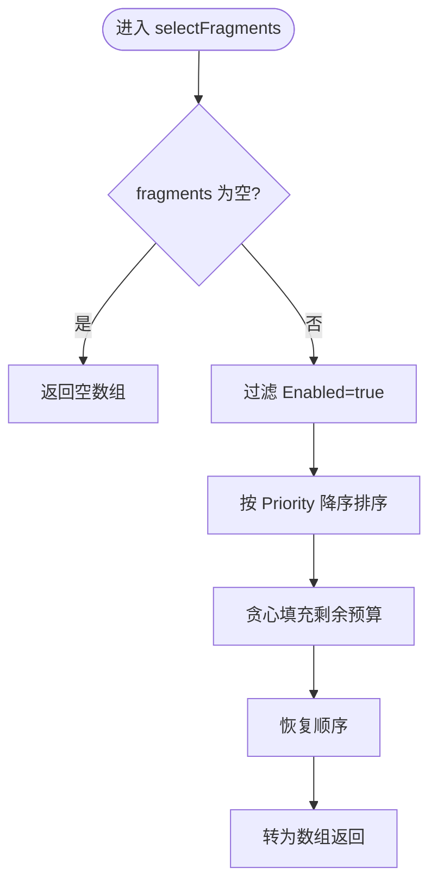
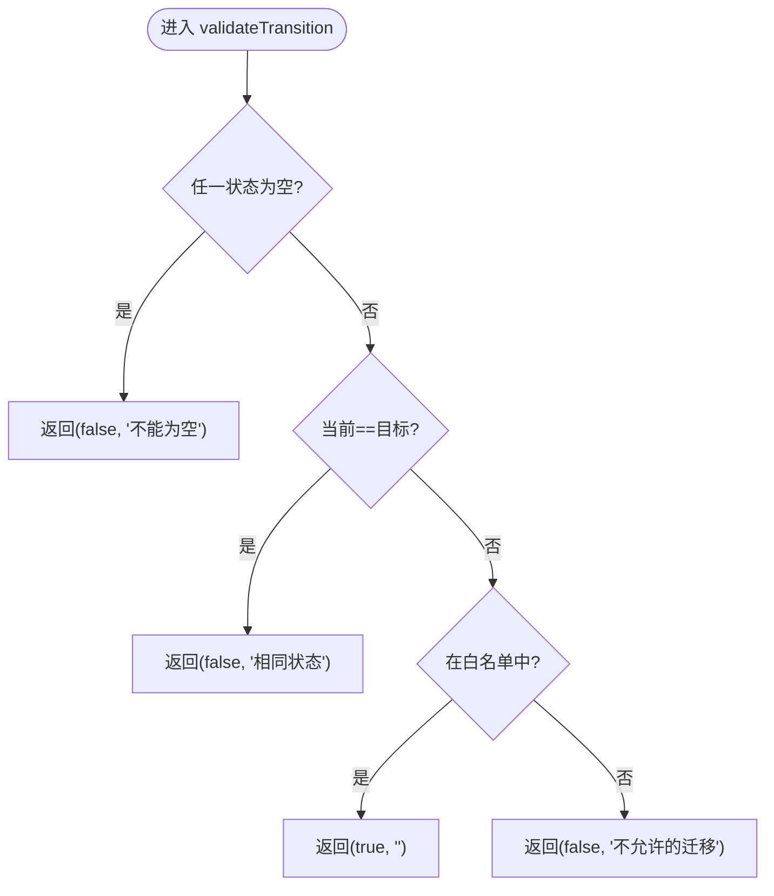
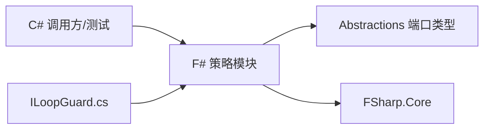

# 策略层

<cite>
**本文引用的文件**   
- [ContextBudget.fs](file://TinadecCore/Strategies/ContextBudget.fs)
- [LoopDetection.fs](file://TinadecCore/Strategies/LoopDetection.fs)
- [MemoryScoring.fs](file://TinadecCore/Strategies/MemoryScoring.fs)
- [PromptSelection.fs](file://TinadecCore/Strategies/PromptSelection.fs)
- [StateTransition.fs](file://TinadecCore/Strategies/StateTransition.fs)
- [TinadecCore.Strategies.fsproj](file://TinadecCore/Strategies/TinadecCore.Strategies.fsproj)
- [FSharpInteropTests.cs](file://TinadecCore/tests/TinadecCore.AgentFramework.Tests/FSharpInteropTests.cs)
- [ILoopGuard.cs](file://TinadecCore/Abstractions/Ports/ILoopGuard.cs)
</cite>

## 目录
1. [简介](#简介)
2. [项目结构](#项目结构)
3. [核心组件](#核心组件)
4. [架构总览](#架构总览)
5. [详细组件分析](#详细组件分析)
6. [依赖关系分析](#依赖关系分析)
7. [性能考量](#性能考量)
8. [故障排查指南](#故障排查指南)
9. [结论](#结论)
10. [附录](#附录)

## 简介
本文件为 TinadecCore 策略层的全面技术文档，聚焦 F# 实现的纯函数式算法策略，包括：
- ContextBudget 上下文预算分配与利用率计算
- LoopDetection 循环检测与多类限制判定
- MemoryScoring 内存条目相关性评分与排序
- PromptSelection 提示片段选择（按优先级与预算）
- StateTransition 状态转换合法性校验

同时说明 F# 与 C# 的互操作机制、函数式编程在策略中的应用、参数配置与使用场景，并提供自定义策略开发指南、组合与动态切换建议以及性能分析与优化建议。

## 项目结构
策略层位于 TinadecCore/Strategies，采用 F# 模块组织纯函数实现，并通过 .csproj 引用 Abstractions 以使用共享类型（如 ContextEvidence、MemoryEntry）。C# 测试通过命名空间直接调用 F# 模块函数，验证返回类型为 C# 兼容类型（int[]、bool、double、元组等），确保无 F# 类型泄漏。



图表来源
- [TinadecCore.Strategies.fsproj:1-27](file://TinadecCore/Strategies/TinadecCore.Strategies.fsproj#L1-L27)
- [ILoopGuard.cs:1-38](file://TinadecCore/Abstractions/Ports/ILoopGuard.cs#L1-L38)
- [FSharpInteropTests.cs:1-118](file://TinadecCore/tests/TinadecCore.AgentFramework.Tests/FSharpInteropTests.cs#L1-L118)

章节来源
- [TinadecCore.Strategies.fsproj:1-27](file://TinadecCore/Strategies/TinadecCore.Strategies.fsproj#L1-L27)

## 核心组件
- ContextBudget：基于证据项预估 token 数量的比例分配，提供超预算判断与利用率计算。
- LoopDetection：基于指纹连续重复、迭代上限、token 预算耗尽、工具调用上限、连续错误数等多维度检测。
- MemoryScoring：基于关键词集合交集的相关性评分，支持过滤与 Top-N 排序。
- PromptSelection：按优先级降序选择启用片段，保证不超过 token 预算。
- StateTransition：对状态迁移进行白名单校验，返回是否合法及原因。

章节来源
- [ContextBudget.fs:1-36](file://TinadecCore/Strategies/ContextBudget.fs#L1-L36)
- [LoopDetection.fs:1-46](file://TinadecCore/Strategies/LoopDetection.fs#L1-L46)
- [MemoryScoring.fs:1-46](file://TinadecCore/Strategies/MemoryScoring.fs#L1-L46)
- [PromptSelection.fs:1-38](file://TinadecCore/Strategies/PromptSelection.fs#L1-L38)
- [StateTransition.fs:1-26](file://TinadecCore/Strategies/StateTransition.fs#L1-L26)

## 架构总览
策略层作为纯函数内核，被上层编排器或守护器（如 ILoopGuard）消费。C# 侧通过命名空间直接调用 F# 模块函数，所有输入输出均为 C# 兼容类型，避免运行时桥接开销。

```mermaid
sequenceDiagram
participant Caller as "调用方(C#)"
participant Guard as "ILoopGuard"
participant Budget as "ContextBudget"
participant Loop as "LoopDetection"
participant Score as "MemoryScoring"
participant Select as "PromptSelection"
participant Trans as "StateTransition"
Caller->>Guard : EvaluateAsync(context)
Guard->>Loop : detectRepeatCalls(fingerprints)
Guard->>Loop : isOverIterationLimit(iteration, max)
Guard->>Loop : isTokenBudgetExhausted(tokensUsed, budget)
Guard->>Loop : isToolCallLimitExceeded(count, max)
Guard->>Loop : hasTooManyConsecutiveErrors(errors, max)
Guard->>Budget : allocateBudget(total, evidence)
Guard->>Score : scoreEntries(query, entries)
Guard->>Select : selectFragments(budget, fragments)
Guard->>Trans : validateTransition(current, target)
Guard-->>Caller : Decision(ShouldContinue, Reason, Warnings)
```

图表来源
- [ILoopGuard.cs:1-38](file://TinadecCore/Abstractions/Ports/ILoopGuard.cs#L1-L38)
- [ContextBudget.fs:1-36](file://TinadecCore/Strategies/ContextBudget.fs#L1-L36)
- [LoopDetection.fs:1-46](file://TinadecCore/Strategies/LoopDetection.fs#L1-L46)
- [MemoryScoring.fs:1-46](file://TinadecCore/Strategies/MemoryScoring.fs#L1-L46)
- [PromptSelection.fs:1-38](file://TinadecCore/Strategies/PromptSelection.fs#L1-L38)
- [StateTransition.fs:1-26](file://TinadecCore/Strategies/StateTransition.fs#L1-L26)

## 详细组件分析

### ContextBudget 上下文预算
- 算法原理
  - 按比例分配：根据各证据项 EstimatedTokens 的相对权重分配总预算；若某项估计值为 0，则按最小值 1 参与归一化，避免除零。
  - 超预算判断：比较 estimatedTokens 与 budget。
  - 利用率计算：used/budget，当 budget<=0 时返回 1.0。
- 复杂度
  - 分配：O(n)，求和与映射各一次线性扫描。
  - 判断/比率：O(1)。
- 参数与行为
  - totalBudget: int，总预算
  - evidence: IReadOnlyList<ContextEvidence>，包含 Source、Content、EstimatedTokens
  - 返回值：int[]，每项对应分配的预算
- 使用场景
  - 将上下文证据按“信息量”近似分配 token 配额，控制模型输入规模。
- 示例路径
  - 分配与空输入处理见测试用例路径：[FSharpInteropTests.cs:14-36](file://TinadecCore/tests/TinadecCore.AgentFramework.Tests/FSharpInteropTests.cs#L14-L36)



图表来源
- [ContextBudget.fs:11-23](file://TinadecCore/Strategies/ContextBudget.fs#L11-L23)

章节来源
- [ContextBudget.fs:1-36](file://TinadecCore/Strategies/ContextBudget.fs#L1-L36)
- [FSharpInteropTests.cs:14-36](file://TinadecCore/tests/TinadecCore.AgentFramework.Tests/FSharpInteropTests.cs#L14-L36)

### LoopDetection 循环检测
- 算法原理
  - 连续重复指纹：从末尾向前统计相同指纹的连续次数，≥3 即认为循环。
  - 迭代上限：iteration >= maxIterations。
  - Token 预算耗尽：tokensUsed >= tokenBudget（budget>0 时生效）。
  - 工具调用上限：toolCallCount >= maxToolCalls。
  - 连续错误过多：consecutiveErrors >= maxConsecutiveErrors。
- 复杂度
  - 指纹检测：O(k)，k 为尾部连续段长度。
  - 其他判定：O(1)。
- 参数与行为
  - fingerprints: IReadOnlyList<string>
  - iteration/maxIterations/tokensUsed/tokenBudget/toolCallCount/maxToolCalls/consecutiveErrors/maxConsecutiveErrors: int
- 使用场景
  - 在 Agent 执行循环中快速退出退化路径，防止无限重试或无效探索。
- 示例路径
  - 连续重复与唯一序列断言见测试用例路径：[FSharpInteropTests.cs:38-55](file://TinadecCore/tests/TinadecCore.AgentFramework.Tests/FSharpInteropTests.cs#L38-L55)



图表来源
- [LoopDetection.fs:11-21](file://TinadecCore/Strategies/LoopDetection.fs#L11-L21)

章节来源
- [LoopDetection.fs:1-46](file://TinadecCore/Strategies/LoopDetection.fs#L1-L46)
- [FSharpInteropTests.cs:38-55](file://TinadecCore/tests/TinadecCore.AgentFramework.Tests/FSharpInteropTests.cs#L38-L55)

### MemoryScoring 内存评分
- 算法原理
  - 分词与归一化：将 query 与 entry.Content 按空白字符分割并转小写，构建词集。
  - 相关性分数：交集大小 / query 词数（query 为空时为 0）。
  - 筛选与排序：仅保留分数 > 0 的条目，按分数降序，截断至 maxResults（至少 1）。
- 复杂度
  - 评分：O(n*(m + p))，n 为条目数，m/p 分别为 query 与内容分词后数量。
  - 排序：O(n log n)。
- 参数与行为
  - query: string
  - entries: IReadOnlyList<MemoryEntry>（含 Id、Content）
  - maxResults: int
  - 返回值：(string * float)[] 的 (Id, score) 列表
- 使用场景
  - 轻量级语义检索，适合无向量库时的快速召回。
- 示例路径
  - 评分与 Top-N 逻辑见实现路径：[MemoryScoring.fs:11-46](file://TinadecCore/Strategies/MemoryScoring.fs#L11-L46)



图表来源
- [MemoryScoring.fs:11-32](file://TinadecCore/Strategies/MemoryScoring.fs#L11-L32)

章节来源
- [MemoryScoring.fs:1-46](file://TinadecCore/Strategies/MemoryScoring.fs#L1-L46)

### PromptSelection 提示选择
- 算法原理
  - 过滤启用片段，按 Priority 降序排序。
  - 贪心填充：依次选取能放入剩余预算的片段，更新剩余预算。
- 复杂度
  - 过滤+排序：O(n log n)
  - 贪心选择：O(n)
- 参数与行为
  - tokenBudget: int
  - fragments: IReadOnlyList<PromptFragment>（含 Id、Priority、EstimatedTokens、Enabled）
  - 返回值：PromptFragment[]
- 使用场景
  - 在有限 token 预算下优先选择高优先级提示片段。
- 示例路径
  - 选择逻辑见实现路径：[PromptSelection.fs:22-37](file://TinadecCore/Strategies/PromptSelection.fs#L22-L37)



图表来源
- [PromptSelection.fs:22-37](file://TinadecCore/Strategies/PromptSelection.fs#L22-L37)

章节来源
- [PromptSelection.fs:1-38](file://TinadecCore/Strategies/PromptSelection.fs#L1-L38)

### StateTransition 状态转换
- 算法原理
  - 白名单匹配：仅允许若干特定状态迁移（如 pending→running、running→completed/failed/cancelled 等）。
  - 非法输入保护：空字符串或当前=目标状态视为非法。
  - 返回：(isValid, reason) 元组。
- 复杂度：O(1)
- 参数与行为
  - currentState/targetState: string
- 使用场景
  - 工作流状态机校验，防止非法跳转。
- 示例路径
  - 合法与非法迁移断言见测试用例路径：[FSharpInteropTests.cs:57-75](file://TinadecCore/tests/TinadecCore.AgentFramework.Tests/FSharpInteropTests.cs#L57-L75)



图表来源
- [StateTransition.fs:10-25](file://TinadecCore/Strategies/StateTransition.fs#L10-L25)

章节来源
- [StateTransition.fs:1-26](file://TinadecCore/Strategies/StateTransition.fs#L1-L26)
- [FSharpInteropTests.cs:57-75](file://TinadecCore/tests/TinadecCore.AgentFramework.Tests/FSharpInteropTests.cs#L57-L75)

## 依赖关系分析
- 策略库依赖 Abstractions 中的端口类型（如 ContextEvidence、MemoryEntry），用于跨语言数据交换。
- C# 测试直接引用 F# 模块命名空间，验证返回类型兼容性，确保无 F# 特有类型泄露。
- ILoopGuard 定义了循环守卫上下文与决策结构，策略函数可作为其内部评估组件。



图表来源
- [TinadecCore.Strategies.fsproj:10-24](file://TinadecCore/Strategies/TinadecCore.Strategies.fsproj#L10-L24)
- [ILoopGuard.cs:1-38](file://TinadecCore/Abstractions/Ports/ILoopGuard.cs#L1-L38)
- [FSharpInteropTests.cs:1-118](file://TinadecCore/tests/TinadecCore.AgentFramework.Tests/FSharpInteropTests.cs#L1-L118)

章节来源
- [TinadecCore.Strategies.fsproj:1-27](file://TinadecCore/Strategies/TinadecCore.Strategies.fsproj#L1-L27)
- [ILoopGuard.cs:1-38](file://TinadecCore/Abstractions/Ports/ILoopGuard.cs#L1-L38)
- [FSharpInteropTests.cs:1-118](file://TinadecCore/tests/TinadecCore.AgentFramework.Tests/FSharpInteropTests.cs#L1-L118)

## 性能考量
- 时间复杂度
  - ContextBudget.allocateBudget：O(n)
  - LoopDetection.detectRepeatCalls：O(k)
  - MemoryScoring.scoreEntries：O(n(m+p))，topEntries：O(n log n)
  - PromptSelection.selectFragments：O(n log n)
  - StateTransition.validateTransition：O(1)
- 空间复杂度
  - 主要额外空间来自分词后的词集与中间数组，整体 O(n + m + p) 级别。
- 优化建议
  - 对 MemoryScoring：可引入倒排索引或预计算词频以提升大规模查询性能。
  - 对 PromptSelection：若 fragments 静态且频繁查询，可缓存排序结果。
  - 对 ContextBudget：若 evidence 频繁变化，可增量维护总和与权重。
  - 对 LoopDetection：指纹滑动窗口可用环形缓冲区减少拷贝。
  - 对 StateTransition：白名单可改为查找表或位图加速匹配。

## 故障排查指南
- 常见问题
  - 空输入导致异常：ensure 检查 null/empty，参考 ContextBudget 与 MemoryScoring 的空值分支。
  - 预算为 0 或负数：utilizationRatio 在 budget<=0 时返回 1.0，需在上层做业务约束。
  - 状态迁移非法：validateTransition 会返回具体原因，便于日志定位。
  - 循环未触发：确认指纹连续重复阈值与最近指纹列表是否正确维护。
- 调试建议
  - 使用单元测试覆盖边界条件（空输入、单元素、全相同指纹、预算耗尽等）。
  - 在 ILoopGuard 评估链路中记录关键指标（tokensUsed、toolCallCount、consecutiveErrors）。
- 相关测试路径
  - 类型兼容性与基本行为断言见：[FSharpInteropTests.cs:14-116](file://TinadecCore/tests/TinadecCore.AgentFramework.Tests/FSharpInteropTests.cs#L14-L116)

章节来源
- [ContextBudget.fs:11-35](file://TinadecCore/Strategies/ContextBudget.fs#L11-L35)
- [MemoryScoring.fs:11-46](file://TinadecCore/Strategies/MemoryScoring.fs#L11-L46)
- [StateTransition.fs:10-25](file://TinadecCore/Strategies/StateTransition.fs#L10-L25)
- [LoopDetection.fs:11-45](file://TinadecCore/Strategies/LoopDetection.fs#L11-L45)
- [FSharpInteropTests.cs:14-116](file://TinadecCore/tests/TinadecCore.AgentFramework.Tests/FSharpInteropTests.cs#L14-L116)

## 结论
策略层以 F# 纯函数为核心，提供高效、可测试、易组合的算法能力。通过 C# 直调 F# 模块，既保持高性能，又避免跨语言序列化成本。配合 ILoopGuard 的上下文与决策结构，可在实际编排流程中灵活组合与动态切换策略，保障系统稳定性与可扩展性。

## 附录

### F# 与 C# 互操作要点
- 命名空间直调：C# 通过 using TinadecCore.Strategies; 直接调用 F# 模块函数。
- 类型契约：所有公开函数返回 C# 原生类型（int[]、bool、double、元组），不暴露 F# 特有类型。
- 记录类型：PromptFragment 使用 [<CLIMutable>] 以便 C# 构造与序列化。
- 测试验证：FSharpInteropTests 断言返回类型与行为，确保契约稳定。

章节来源
- [FSharpInteropTests.cs:1-118](file://TinadecCore/tests/TinadecCore.AgentFramework.Tests/FSharpInteropTests.cs#L1-L118)
- [PromptSelection.fs:9-16](file://TinadecCore/Strategies/PromptSelection.fs#L9-L16)

### 策略组合与动态切换
- 组合模式
  - 在 ILoopGuard.EvaluateAsync 中串联多个策略：先做循环检测与限制判定，再按需调用预算分配、评分与提示选择。
- 动态切换
  - 通过配置注入不同策略实现（例如替换 MemoryScoring 的分词规则或 PromptSelection 的排序键），无需修改核心流程。
- 扩展点
  - 新增策略只需遵循纯函数签名与 C# 兼容类型，即可被现有编排器无缝集成。

章节来源
- [ILoopGuard.cs:1-38](file://TinadecCore/Abstractions/Ports/ILoopGuard.cs#L1-L38)
- [TinadecCore.Strategies.fsproj:1-27](file://TinadecCore/Strategies/TinadecCore.Strategies.fsproj#L1-L27)

### 自定义策略开发指南
- 步骤
  - 新建 F# 模块文件，定义纯函数，输入输出使用 C# 兼容类型。
  - 在 .fsproj 中注册编译项。
  - 编写 C# 单元测试验证契约与边界条件。
- 建议
  - 保持无副作用与确定性，便于测试与并行。
  - 明确参数默认值与边界行为（如空输入、零预算）。
  - 提供清晰的错误/原因描述，便于上层诊断。

章节来源
- [TinadecCore.Strategies.fsproj:18-24](file://TinadecCore/Strategies/TinadecCore.Strategies.fsproj#L18-L24)
- [FSharpInteropTests.cs:1-118](file://TinadecCore/tests/TinadecCore.AgentFramework.Tests/FSharpInteropTests.cs#L1-L118)