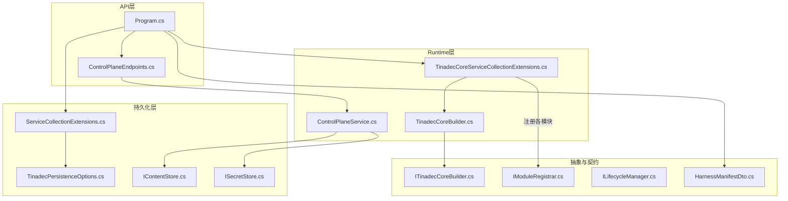
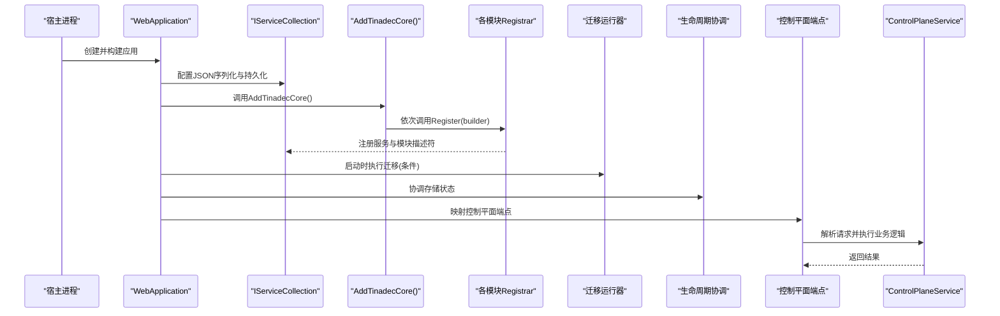
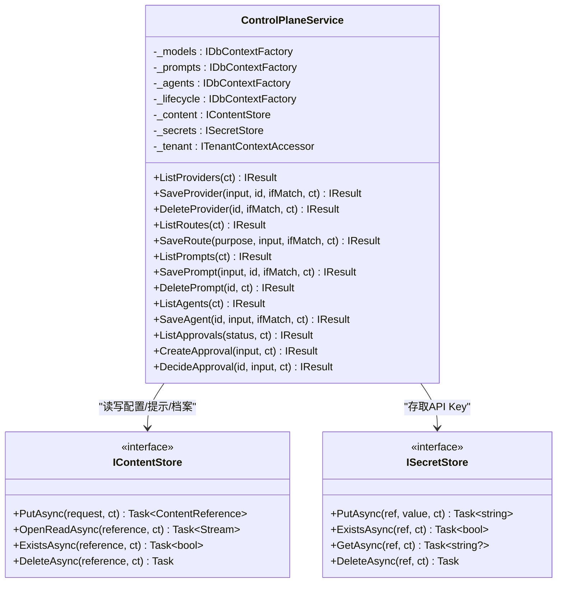
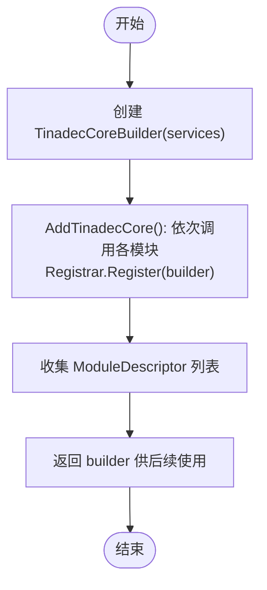
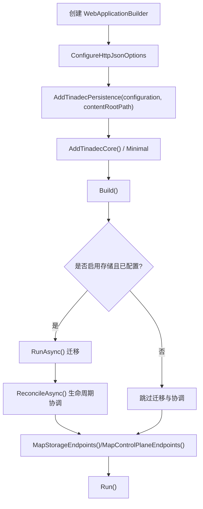
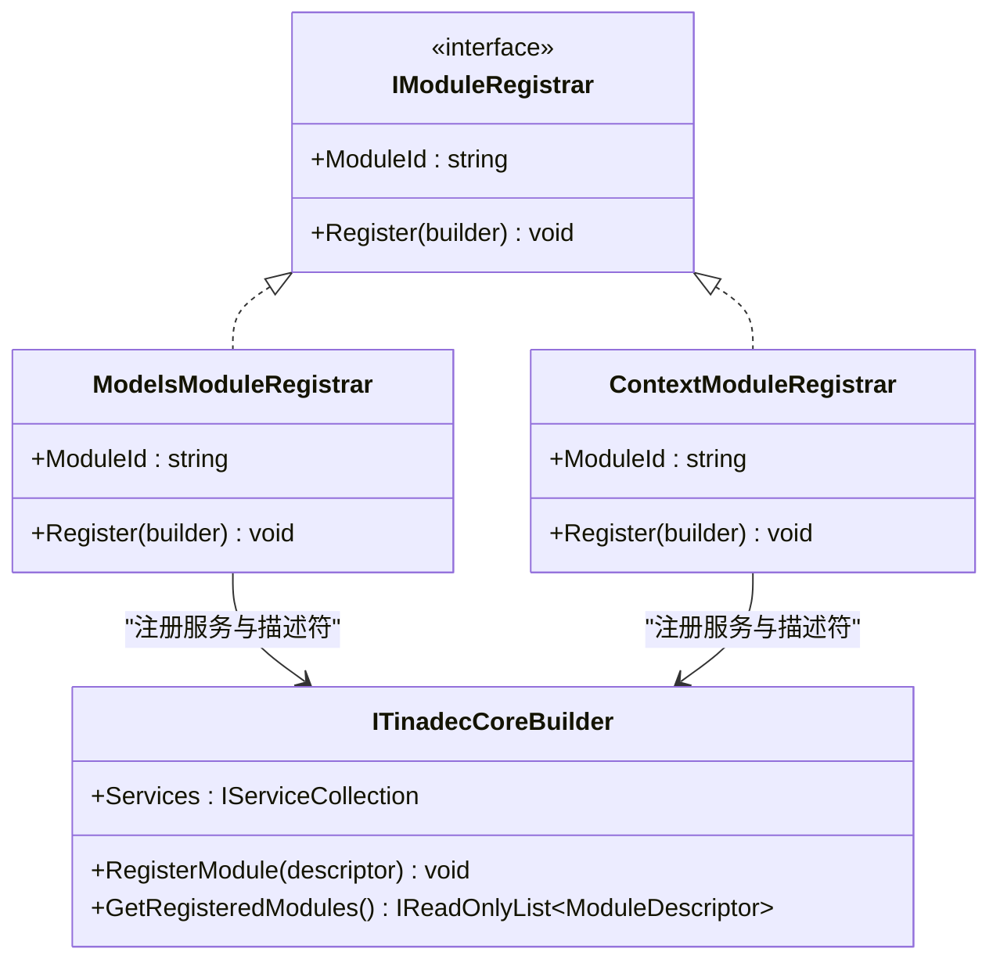
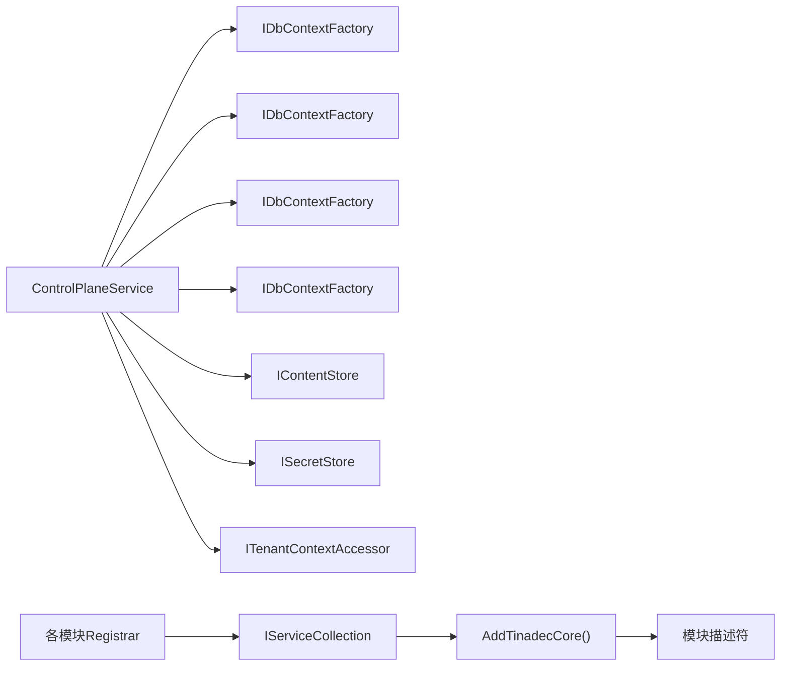

# 运行时管理

<cite>
**本文引用的文件**   
- [ControlPlaneService.cs](file://TinadecCore/Runtime/ControlPlaneService.cs)
- [TinadecCoreBuilder.cs](file://TinadecCore/Runtime/TinadecCoreBuilder.cs)
- [TinadecCoreServiceCollectionExtensions.cs](file://TinadecCore/Runtime/TinadecCoreServiceCollectionExtensions.cs)
- [Program.cs](file://TinadecCore/Api/Program.cs)
- [ITinadecCoreBuilder.cs](file://TinadecCore/Abstractions/ITinadecCoreBuilder.cs)
- [IModuleRegistrar.cs](file://TinadecCore/Abstractions/IModuleRegistrar.cs)
- [ContextModuleRegistrar.cs](file://TinadecCore/Context/ContextModuleRegistrar.cs)
- [ModelsModuleRegistrar.cs](file://TinadecCore/Models/ModelsModuleRegistrar.cs)
- [ServiceCollectionExtensions.cs](file://TinadecCore/Persistence/ServiceCollectionExtensions.cs)
- [TinadecPersistenceOptions.cs](file://TinadecCore/Persistence/TinadecPersistenceOptions.cs)
- [HarnessManifestDto.cs](file://TinadecCore/Contracts/Dtos/HarnessManifestDto.cs)
- [ILifecycleManager.cs](file://TinadecCore/Abstractions/Ports/ILifecycleManager.cs)
- [IContentStore.cs](file://TinadecCore/Persistence/IContentStore.cs)
- [ISecretStore.cs](file://TinadecCore/Persistence/ISecretStore.cs)
- [ControlPlaneEndpoints.cs](file://TinadecCore/Api/Endpoints/ControlPlaneEndpoints.cs)
- [appsettings.json](file://TinadecCore/Api/appsettings.json)
</cite>

## 目录
1. [简介](#简介)
2. [项目结构](#项目结构)
3. [核心组件](#核心组件)
4. [架构总览](#架构总览)
5. [详细组件分析](#详细组件分析)
6. [依赖关系分析](#依赖关系分析)
7. [性能考虑](#性能考虑)
8. [故障排查指南](#故障排查指南)
9. [结论](#结论)
10. [附录](#附录)

## 简介
本文件为 TinadecCore 运行时管理系统的权威文档，聚焦控制平面服务 ControlPlaneService 的架构与生命周期、构建器 TinadecCoreBuilder 的配置与服务注册流程、模块扩展机制、运行时环境初始化、依赖注入容器配置、模块化加载、错误处理、日志与监控集成，以及性能调优与资源管理策略。读者可据此快速理解并正确扩展运行时能力。

## 项目结构
TinadecCore 采用“按领域模块 + 抽象接口 + DI 扩展”的组织方式：
- Abstractions：定义跨模块的端口与构建器契约（如 ITinadecCoreBuilder、IModuleRegistrar、ILifecycleManager）。
- Runtime：控制平面服务、构建器与 DI 扩展方法。
- Persistence：数据库抽象、内容存储、密钥存储、迁移与就绪性探测。
- Api：Web 应用入口、端点映射、健康与就绪检查。
- 各业务模块（Models、Prompts、Lifecycle、Memory、Skills、LoopGuard、DmaEA、Tenancy、VectorStore）各自提供 ModuleRegistrar 实现以声明式注册服务与模块描述。

**图表来源** 
- [Program.cs:1-181](file://TinadecCore/Api/Program.cs#L1-L181)
- [ControlPlaneEndpoints.cs:1-46](file://TinadecCore/Api/Endpoints/ControlPlaneEndpoints.cs#L1-L46)
- [TinadecCoreServiceCollectionExtensions.cs:1-61](file://TinadecCore/Runtime/TinadecCoreServiceCollectionExtensions.cs#L1-L61)
- [TinadecCoreBuilder.cs:1-31](file://TinadecCore/Runtime/TinadecCoreBuilder.cs#L1-L31)
- [ServiceCollectionExtensions.cs:1-122](file://TinadecCore/Persistence/ServiceCollectionExtensions.cs#L1-L122)
- [TinadecPersistenceOptions.cs:1-48](file://TinadecCore/Persistence/TinadecPersistenceOptions.cs#L1-L48)
- [IContentStore.cs:1-20](file://TinadecCore/Persistence/IContentStore.cs#L1-L20)
- [ISecretStore.cs:1-65](file://TinadecCore/Persistence/ISecretStore.cs#L1-L65)
- [ITinadecCoreBuilder.cs:1-52](file://TinadecCore/Abstractions/ITinadecCoreBuilder.cs#L1-L52)
- [IModuleRegistrar.cs:1-17](file://TinadecCore/Abstractions/IModuleRegistrar.cs#L1-L17)
- [ILifecycleManager.cs:1-41](file://TinadecCore/Abstractions/Ports/ILifecycleManager.cs#L1-L41)
- [HarnessManifestDto.cs:1-53](file://TinadecCore/Contracts/Dtos/HarnessManifestDto.cs#L1-L53)

**章节来源**
- [Program.cs:1-181](file://TinadecCore/Api/Program.cs#L1-L181)
- [TinadecCoreServiceCollectionExtensions.cs:1-61](file://TinadecCore/Runtime/TinadecCoreServiceCollectionExtensions.cs#L1-L61)

## 核心组件
- ControlPlaneService：控制平面服务的核心，负责模型提供者、路由、提示片段、智能体档案与审批请求的 CRUD 与版本化管理，使用内容存储与密钥存储进行不可变内容与凭据分离。
- TinadecCoreBuilder：构建器实现，收集模块描述符并委托给 DI 容器完成服务注册；对外暴露已注册模块清单用于清单与就绪性输出。
- TinadecCoreServiceCollectionExtensions：DI 扩展方法，按依赖顺序注册所有核心模块或最小集，统一入口简化宿主集成。
- 模块注册器（IModuleRegistrar）：每个业务模块通过实现该接口声明自身服务与元数据，避免反射扫描，保证编译期安全与裁剪友好。
- 持久化抽象：IContentStore、ISecretStore、IDatabaseConnectionInfo、IDatabaseReadiness 等，将数据库、文件、环境变量等具体实现解耦。

**章节来源**
- [ControlPlaneService.cs:1-71](file://TinadecCore/Runtime/ControlPlaneService.cs#L1-L71)
- [TinadecCoreBuilder.cs:1-31](file://TinadecCore/Runtime/TinadecCoreBuilder.cs#L1-L31)
- [TinadecCoreServiceCollectionExtensions.cs:1-61](file://TinadecCore/Runtime/TinadecCoreServiceCollectionExtensions.cs#L1-L61)
- [IModuleRegistrar.cs:1-17](file://TinadecCore/Abstractions/IModuleRegistrar.cs#L1-L17)
- [IContentStore.cs:1-20](file://TinadecCore/Persistence/IContentStore.cs#L1-L20)
- [ISecretStore.cs:1-65](file://TinadecCore/Persistence/ISecretStore.cs#L1-L65)

## 架构总览
控制平面通过 ASP.NET Core WebApplication 启动，先配置 JSON 序列化策略与持久化抽象，再调用 AddTinadecCore() 注册全部模块，随后映射控制平面端点。启动时执行迁移与生命周期协调，暴露健康与就绪端点，供网关与前端消费。

**图表来源** 
- [Program.cs:1-181](file://TinadecCore/Api/Program.cs#L1-L181)
- [TinadecCoreServiceCollectionExtensions.cs:1-61](file://TinadecCore/Runtime/TinadecCoreServiceCollectionExtensions.cs#L1-L61)
- [ControlPlaneEndpoints.cs:1-46](file://TinadecCore/Api/Endpoints/ControlPlaneEndpoints.cs#L1-L46)

## 详细组件分析

### ControlPlaneService 控制平面服务
职责与边界
- 模型提供者：列表、保存（含 API Key 写入密钥存储）、删除（软删除），支持 ETag 式 if-match 乐观并发。
- 模型路由：按 purpose 维度保存当前版本，记录 provider_instance_id 与 model。
- 提示片段：CRUD，内置片段只读保护，内容写入内容存储，版本化。
- 智能体档案：CRUD，内置档案只读保护，配置内容写入内容存储，版本化。
- 审批请求：创建、查询、决策（approved/rejected），带过期时间校验。

关键设计
- 租户与工作区隔离：通过 ITenantContextAccessor 获取上下文，所有查询均限定 TenantId/WorkspaceId。
- 不可变内容：大对象（配置、提示、档案）通过 IContentStore 写入，数据库仅保留引用与完整性信息。
- 凭据分离：SecretReference 指向 ISecretStore，避免明文进入关系型表。
- 乐观并发：Revision 字段配合 If-Match 头，冲突返回 412。
- 内置保护：IsBuiltIn 标记阻止直接修改，需克隆后再编辑。

**图表来源** 
- [ControlPlaneService.cs:1-71](file://TinadecCore/Runtime/ControlPlaneService.cs#L1-L71)
- [IContentStore.cs:1-20](file://TinadecCore/Persistence/IContentStore.cs#L1-L20)
- [ISecretStore.cs:1-65](file://TinadecCore/Persistence/ISecretStore.cs#L1-L65)

**章节来源**
- [ControlPlaneService.cs:1-71](file://TinadecCore/Runtime/ControlPlaneService.cs#L1-L71)
- [ControlPlaneEndpoints.cs:1-46](file://TinadecCore/Api/Endpoints/ControlPlaneEndpoints.cs#L1-L46)

### TinadecCoreBuilder 构建器与模块注册流程
构建器职责
- 持有 IServiceCollection，并在构造时将自身注册为单例，便于端点访问。
- 维护 ModuleDescriptor 列表，供清单与就绪性检查使用。
- RegisterModule(descriptor) 由模块 Registrar 调用，声明模块元数据与能力。

扩展方法与默认装配
- AddTinadecCore()：按依赖顺序注册全部核心模块（Tenancy、VectorStore、Lifecycle、Models、Context、Prompts、Memory、Skills、LoopGuard、DmaEA）。
- AddTinadecCoreMinimal()：仅注册必要模块，演示裁剪与按需装配。

**图表来源** 
- [TinadecCoreBuilder.cs:1-31](file://TinadecCore/Runtime/TinadecCoreBuilder.cs#L1-L31)
- [ITinadecCoreBuilder.cs:1-52](file://TinadecCore/Abstractions/ITinadecCoreBuilder.cs#L1-L52)
- [TinadecCoreServiceCollectionExtensions.cs:1-61](file://TinadecCore/Runtime/TinadecCoreServiceCollectionExtensions.cs#L1-L61)

**章节来源**
- [TinadecCoreBuilder.cs:1-31](file://TinadecCore/Runtime/TinadecCoreBuilder.cs#L1-L31)
- [ITinadecCoreBuilder.cs:1-52](file://TinadecCore/Abstractions/ITinadecCoreBuilder.cs#L1-L52)
- [TinadecCoreServiceCollectionExtensions.cs:1-61](file://TinadecCore/Runtime/TinadecCoreServiceCollectionExtensions.cs#L1-L61)

### 运行时环境初始化与依赖注入容器配置
初始化步骤
- 配置 JSON 序列化策略（snake_case、忽略 null）。
- 调用 AddTinadecPersistence(configuration, contentRootPath) 注册选项、连接信息、数据库配置器、就绪性探测、内容存储、向量数据库、密钥存储、迁移运行器。
- 调用 AddTinadecCore() 或 AddTinadecCoreMinimal() 注册模块。
- 在作用域中执行迁移与生命周期协调（SQLite 本地启动自动迁移，PostgreSQL 需显式启用）。
- 映射端点并启动应用。

配置项
- TinadecPersistence：Enabled、Provider、Sqlite.DatabasePath、PostgreSql.ConnectionStringName、ProbeTimeoutSeconds、ApplyMigrationsOnStartup。
- Logging、AllowedHosts、ConnectionStrings、TinadecIdentity（开发身份）。

**图表来源** 
- [Program.cs:1-181](file://TinadecCore/Api/Program.cs#L1-L181)
- [ServiceCollectionExtensions.cs:1-122](file://TinadecCore/Persistence/ServiceCollectionExtensions.cs#L1-L122)
- [TinadecPersistenceOptions.cs:1-48](file://TinadecCore/Persistence/TinadecPersistenceOptions.cs#L1-L48)
- [appsettings.json:1-31](file://TinadecCore/Api/appsettings.json#L1-L31)

**章节来源**
- [Program.cs:1-181](file://TinadecCore/Api/Program.cs#L1-L181)
- [ServiceCollectionExtensions.cs:1-122](file://TinadecCore/Persistence/ServiceCollectionExtensions.cs#L1-L122)
- [TinadecPersistenceOptions.cs:1-48](file://TinadecCore/Persistence/TinadecPersistenceOptions.cs#L1-L48)
- [appsettings.json:1-31](file://TinadecCore/Api/appsettings.json#L1-L31)

### 模块化加载机制与示例
模块注册器模式
- 每个模块实现 IModuleRegistrar，提供 ModuleId 与 Register(builder)。
- 在 Register 中：
  - 向 services 注册服务（如 DbContextFactory、迁移参与者、领域服务）。
  - 调用 builder.RegisterModule(new ModuleDescriptor{...}) 声明能力与依赖。

示例：Models 模块
- 注册 ModelControlDbContext 工厂、迁移参与者、IModelProvider、IEmbeddingProvider。
- 声明能力：provider_management、model_routing、credential_references、error_normalization、readiness、embedding_generation。

示例：Context 模块
- 注册 IContextProvider 与骨架实现，声明 context_pack、evidence_gathering、token_budget 能力。

**图表来源** 
- [IModuleRegistrar.cs:1-17](file://TinadecCore/Abstractions/IModuleRegistrar.cs#L1-L17)
- [ModelsModuleRegistrar.cs:1-168](file://TinadecCore/Models/ModelsModuleRegistrar.cs#L1-L168)
- [ContextModuleRegistrar.cs:1-52](file://TinadecCore/Context/ContextModuleRegistrar.cs#L1-L52)
- [ITinadecCoreBuilder.cs:1-52](file://TinadecCore/Abstractions/ITinadecCoreBuilder.cs#L1-L52)

**章节来源**
- [ModelsModuleRegistrar.cs:1-168](file://TinadecCore/Models/ModelsModuleRegistrar.cs#L1-L168)
- [ContextModuleRegistrar.cs:1-52](file://TinadecCore/Context/ContextModuleRegistrar.cs#L1-L52)

### 清单与就绪性
- 清单端点 /api/v1/harness/manifest：聚合框架信息与已注册模块描述符，供外部系统了解运行时能力。
- 就绪性端点 /api/v1/readiness：结合模块注册状态与数据库就绪探测，返回 ready/warning 状态及模块细节。

**章节来源**
- [Program.cs:58-164](file://TinadecCore/Api/Program.cs#L58-L164)
- [HarnessManifestDto.cs:1-53](file://TinadecCore/Contracts/Dtos/HarnessManifestDto.cs#L1-L53)

## 依赖关系分析
- 控制平面服务依赖多个 EF Core DbContextFactory、IContentStore、ISecretStore、ITenantContextAccessor。
- 模块注册器依赖持久化抽象与领域服务，通过 DI 扩展方法统一装配。
- 启动流程强依赖 AddTinadecPersistence 与 AddTinadecCore 的顺序与完整性。

**图表来源** 
- [ControlPlaneService.cs:1-71](file://TinadecCore/Runtime/ControlPlaneService.cs#L1-L71)
- [TinadecCoreServiceCollectionExtensions.cs:1-61](file://TinadecCore/Runtime/TinadecCoreServiceCollectionExtensions.cs#L1-L61)

**章节来源**
- [ControlPlaneService.cs:1-71](file://TinadecCore/Runtime/ControlPlaneService.cs#L1-L71)
- [TinadecCoreServiceCollectionExtensions.cs:1-61](file://TinadecCore/Runtime/TinadecCoreServiceCollectionExtensions.cs#L1-L61)

## 性能考虑
- 内容存储与密钥存储分离：避免数据库膨胀与敏感数据泄露，提升读取路径效率。
- 版本化与乐观并发：Revision 与 If-Match 减少锁竞争，提高写并发吞吐。
- 按需装配：使用 AddTinadecCoreMinimal 减少不必要的服务与反射开销，利于 AOT/Trimming。
- 数据库就绪探测：通过 ProbeTimeoutSeconds 控制探测超时，避免启动阻塞。
- 迁移策略：SQLite 本地自动迁移，PostgreSQL 多实例需显式启用 ApplyMigrationsOnStartup，避免并发冲突。

[本节为通用指导，不直接分析具体文件]

## 故障排查指南
常见问题与定位
- 412 预条件失败：更新操作未携带正确的 If-Match 或 Revision 不一致，检查客户端并发控制。
- 内置资源只读：提示片段或智能体档案 IsBuiltIn=true 时无法直接修改，需先克隆。
- 审批不可操作：状态非 pending 或已过期，检查 ExpiresAt 与状态机流转。
- 就绪性警告：模块 NotConfigured 或数据库未就绪，检查配置与连接字符串。
- 迁移失败：确认 Provider 与连接信息，必要时关闭 ApplyMigrationsOnStartup 手动管理。

建议的诊断步骤
- 查看 /api/v1/readiness 响应中的 Modules 与 Storage 详情。
- 核对 appsettings.json 中 TinadecPersistence 与 ConnectionStrings。
- 检查日志级别（Logging.LogLevel）与 ASP.NET Core 日志。
- 验证内容存储与密钥存储路径与权限。

**章节来源**
- [ControlPlaneService.cs:44-70](file://TinadecCore/Runtime/ControlPlaneService.cs#L44-L70)
- [Program.cs:122-164](file://TinadecCore/Api/Program.cs#L122-L164)
- [appsettings.json:1-31](file://TinadecCore/Api/appsettings.json#L1-L31)

## 结论
TinadecCore 运行时通过清晰的构建器与模块注册机制，实现了可扩展、可裁剪、可观测的控制平面。ControlPlaneService 以内容/密钥分离与版本化为核心，保障配置与凭据的安全与一致性。借助 DI 扩展与就绪性探针，宿主可灵活组合能力并快速上线。遵循本文最佳实践，可在生产环境中获得稳定、高性能与易运维的运行时体验。

[本节为总结，不直接分析具体文件]

## 附录
- 配置示例要点
  - 启用 SQLite：设置 TinadecPersistence.Provider=Sqlite，指定 DatabasePath。
  - 切换 PostgreSQL：设置 Provider=PostgreSql，配置 ConnectionStrings.TinadecCore。
  - 调整探针超时：设置 ProbeTimeoutSeconds（1-30）。
  - 开发身份：开启 EnableDevelopmentIdentity，配置 Issuer/Subject/TenantSlug/WorkspaceSlug。
- 最佳实践
  - 使用 AddTinadecCoreMinimal 裁剪非必要模块。
  - 始终通过 ISecretStore 管理凭据，不在数据库中存放明文。
  - 对写操作实施乐观并发（If-Match/Revision）。
  - 利用就绪性端点进行编排与健康检查。

[本节为补充信息，不直接分析具体文件]