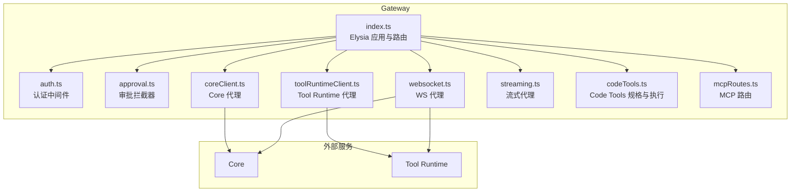
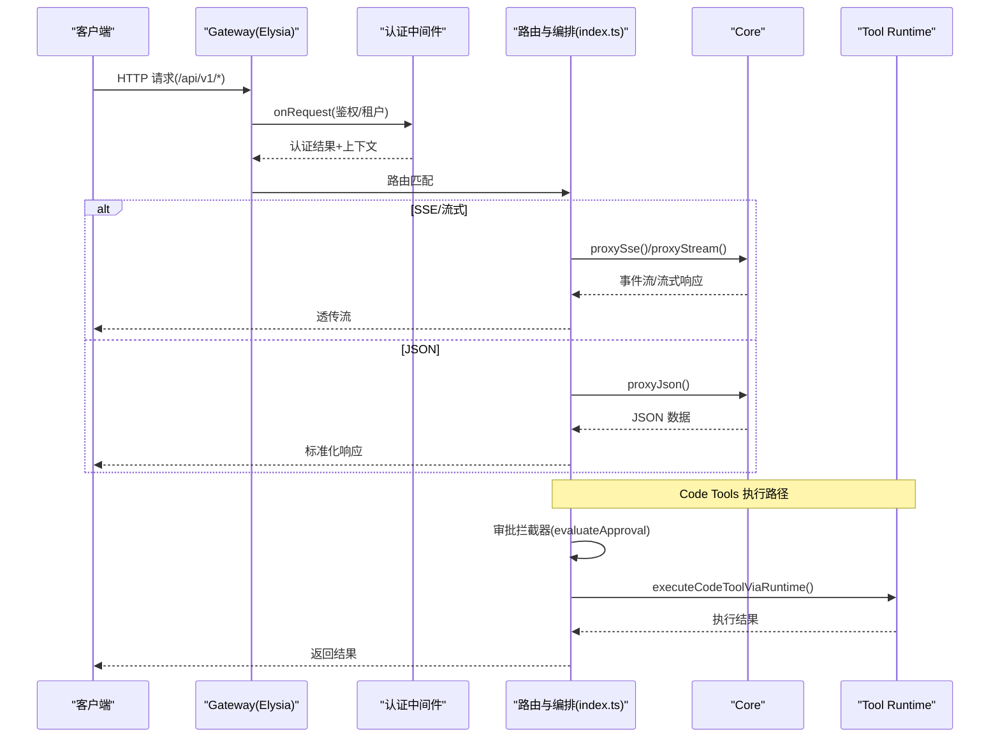
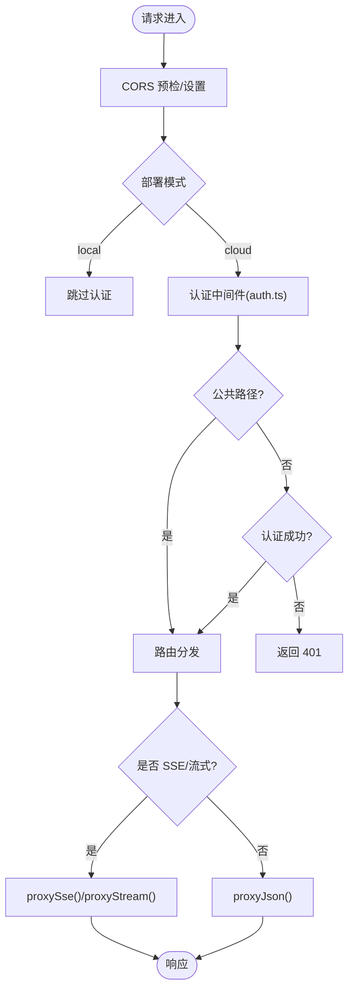
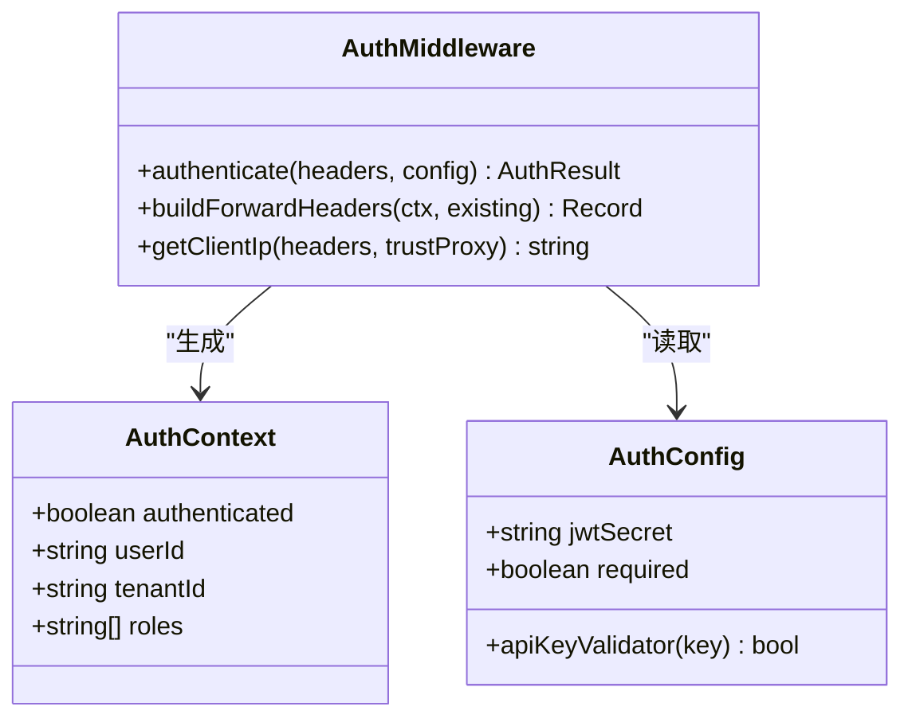
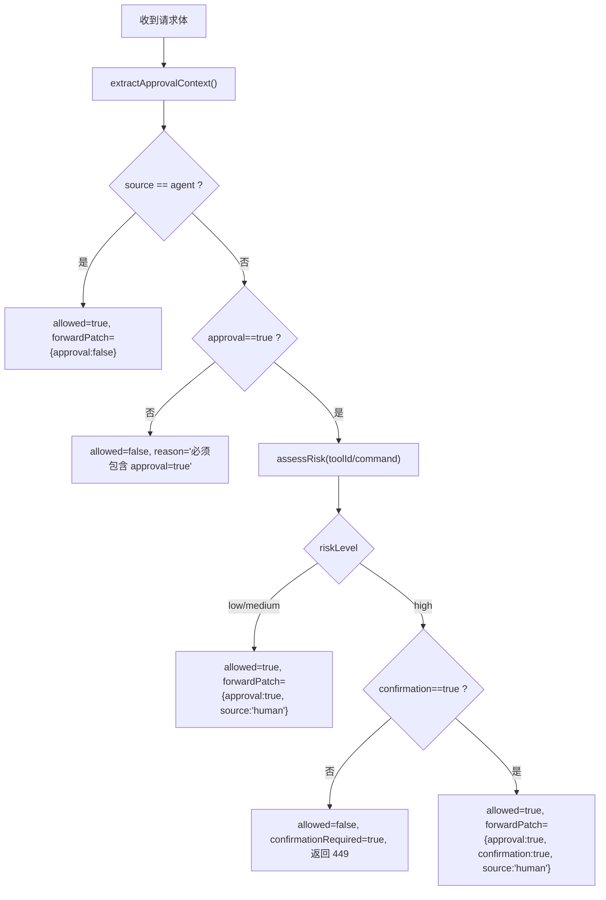
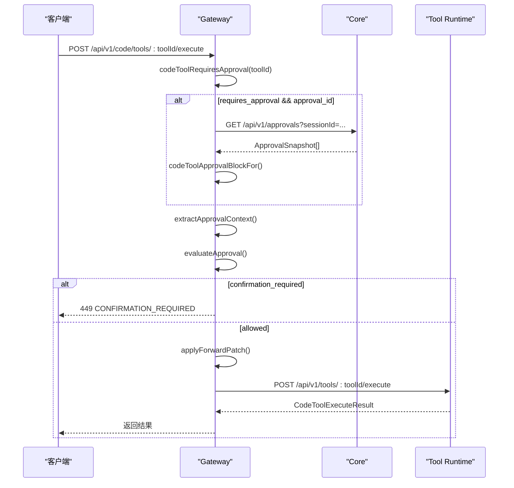
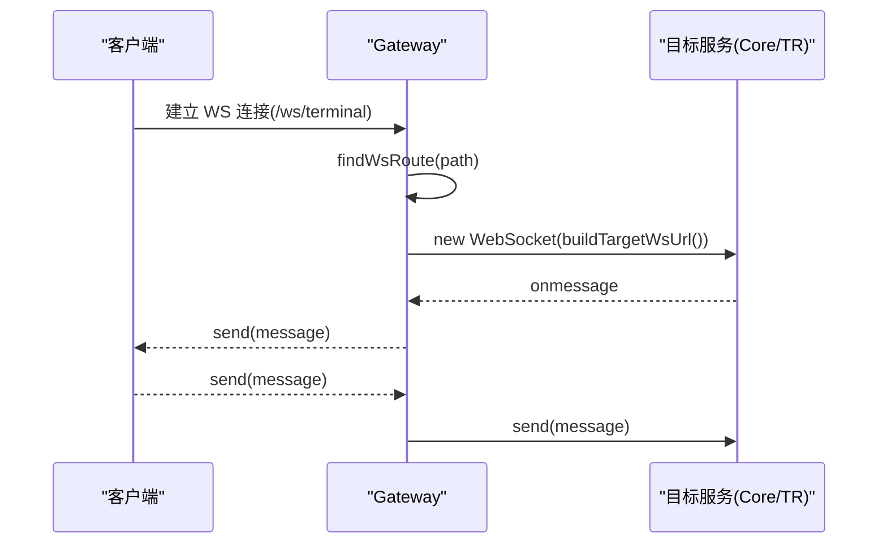
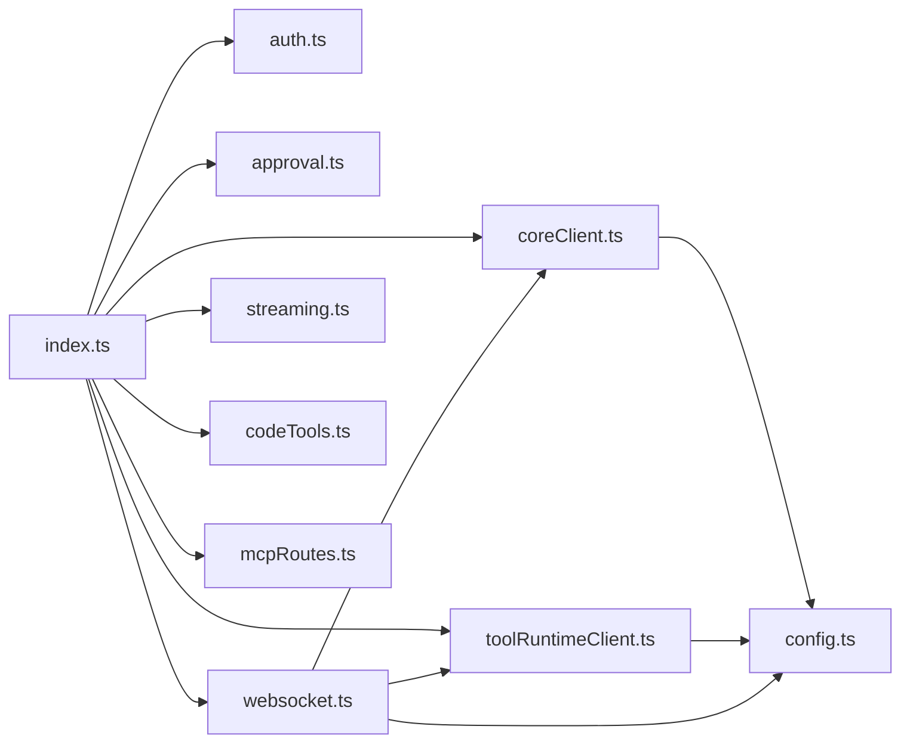

# Gateway 网关服务

<cite>
**本文引用的文件**
- [index.ts](file://TinadecGateway/src/index.ts)
- [auth.ts](file://TinadecGateway/src/auth.ts)
- [approval.ts](file://TinadecGateway/src/approval.ts)
- [config.ts](file://TinadecGateway/src/config.ts)
- [coreClient.ts](file://TinadecGateway/src/coreClient.ts)
- [toolRuntimeClient.ts](file://TinadecGateway/src/toolRuntimeClient.ts)
- [websocket.ts](file://TinadecGateway/src/websocket.ts)
- [streaming.ts](file://TinadecGateway/src/streaming.ts)
- [codeTools.ts](file://TinadecGateway/src/codeTools.ts)
- [package.json](file://TinadecGateway/package.json)
- [AGENTS.md](file://TinadecGateway/AGENTS.md)
- [gateway-extraction-and-tool-bridge.md](file://docs/gateway-extraction-and-tool-bridge.md)
</cite>

## 目录
1. [简介](#简介)
2. [项目结构](#项目结构)
3. [核心组件](#核心组件)
4. [架构总览](#架构总览)
5. [详细组件分析](#详细组件分析)
6. [依赖关系分析](#依赖关系分析)
7. [性能与可扩展性](#性能与可扩展性)
8. [故障排查指南](#故障排查指南)
9. [结论](#结论)
10. [附录：客户端集成与最佳实践](#附录客户端集成与最佳实践)

## 简介
本文件为 TinadecGateway 网关服务的完整技术文档。该网关基于 Elysia（Bun 运行时）实现，承担以下职责：
- 鉴权与租户上下文注入（云端模式支持 API Key / JWT HS256）
- BFF 组合（Model Center / Agent Center 聚合视图）
- 协议转换（HTTP/JSON、SSE、WebSocket、流式 HTTP）
- 请求转发与响应转换（代理到 Core 与 Tool Runtime）
- 审批拦截器（人类操作二次确认与高风险命令保护）
- MCP 路由透传（列表由 Core 提供，执行由 Tool Runtime 处理）

网关不直接执行文件、Git、Shell、PTY 或 MCP 操作，所有工具执行均通过 Tool Runtime 完成。

## 项目结构
TinadecGateway 是一个独立的 Bun 包，入口为 src/index.ts，采用模块化组织：
- 配置与运行模式：src/config.ts
- 认证与租户上下文：src/auth.ts
- 审批拦截器：src/approval.ts
- 协议与代理：
  - Core 代理：src/coreClient.ts
  - Tool Runtime 代理：src/toolRuntimeClient.ts
  - WebSocket 代理：src/websocket.ts
  - 流式 HTTP：src/streaming.ts
- 业务路由与编排：src/index.ts
- Code Tools 规格与执行桥接：src/codeTools.ts
- MCP 路由：src/mcp/mcpRoutes.ts

**图表来源**
- [index.ts:107-800](file://TinadecGateway/src/index.ts#L107-L800)
- [auth.ts:1-273](file://TinadecGateway/src/auth.ts#L1-L273)
- [approval.ts:1-235](file://TinadecGateway/src/approval.ts#L1-L235)
- [coreClient.ts:1-110](file://TinadecGateway/src/coreClient.ts#L1-L110)
- [toolRuntimeClient.ts:1-126](file://TinadecGateway/src/toolRuntimeClient.ts#L1-L126)
- [websocket.ts:1-140](file://TinadecGateway/src/websocket.ts#L1-L140)
- [streaming.ts:1-54](file://TinadecGateway/src/streaming.ts#L1-L54)
- [codeTools.ts:1-570](file://TinadecGateway/src/codeTools.ts#L1-L570)
- [mcpRoutes.ts](file://TinadecGateway/src/mcp/mcpRoutes.ts)

**章节来源**
- [index.ts:1-800](file://TinadecGateway/src/index.ts#L1-L800)
- [package.json:1-22](file://TinadecGateway/package.json#L1-L22)
- [AGENTS.md:1-144](file://TinadecGateway/AGENTS.md#L1-L144)

## 核心组件
- 配置模块（config.ts）
  - 部署模式：local/cloud
  - 监听端口与主机名
  - Core/Tool Runtime URL
  - 认证配置（API Key/JWT Secret/required）
  - CORS 额外来源、超时、反向代理信任
- 认证中间件（auth.ts）
  - 本地模式跳过认证；云端模式支持 API Key 与 Bearer JWT（HS256）
  - 从 JWT claims 或头提取 tenant_id/user_id，并注入下游请求头
- 审批拦截器（approval.ts）
  - 人类操作 approval=true 透传；高风险命令二次确认（返回 449）
  - 风险等级评估（high/medium/low），Agent 请求走 Core 审批门
- 代理客户端（coreClient.ts / toolRuntimeClient.ts）
  - JSON/SSE/流式 HTTP 代理
  - 统一错误码（CORE_UNREACHABLE、TOOL_RUNTIME_UNREACHABLE 等）
- WebSocket 代理（websocket.ts）
  - 路由表映射（terminal→Tool Runtime，debug/collaboration→Core）
  - 消息双向透传处理器（当前 index.ts WS 路由仍为桩）
- 流式代理（streaming.ts）
  - 大文件与日志流的无缓冲透传
- Code Tools（codeTools.ts）
  - 工具规格发布（/api/v1/code/tools）
  - 执行前校验 Core 审批状态，再经审批拦截器，最终代理到 Tool Runtime

**章节来源**
- [config.ts:1-115](file://TinadecGateway/src/config.ts#L1-L115)
- [auth.ts:1-273](file://TinadecGateway/src/auth.ts#L1-L273)
- [approval.ts:1-235](file://TinadecGateway/src/approval.ts#L1-L235)
- [coreClient.ts:1-110](file://TinadecGateway/src/coreClient.ts#L1-L110)
- [toolRuntimeClient.ts:1-126](file://TinadecGateway/src/toolRuntimeClient.ts#L1-L126)
- [websocket.ts:1-140](file://TinadecGateway/src/websocket.ts#L1-L140)
- [streaming.ts:1-54](file://TinadecGateway/src/streaming.ts#L1-L54)
- [codeTools.ts:1-570](file://TinadecGateway/src/codeTools.ts#L1-L570)

## 架构总览
Gateway 作为薄代理 BFF/API 层，位于 Desktop 与 Core/Tool Runtime 之间，负责协议转换、鉴权、审批拦截与请求转发。

**图表来源**
- [index.ts:107-800](file://TinadecGateway/src/index.ts#L107-L800)
- [auth.ts:46-112](file://TinadecGateway/src/auth.ts#L46-L112)
- [coreClient.ts:38-101](file://TinadecGateway/src/coreClient.ts#L38-L101)
- [toolRuntimeClient.ts:44-126](file://TinadecGateway/src/toolRuntimeClient.ts#L44-L126)
- [approval.ts:145-197](file://TinadecGateway/src/approval.ts#L145-L197)
- [codeTools.ts:439-462](file://TinadecGateway/src/codeTools.ts#L439-L462)

## 详细组件分析

### Elysia 路由与协议分层
- 健康与就绪检查：/api/v1/health、/api/v1/readiness、/api/v1/model-readiness、/api/v1/tool-layer-readiness
- 会话与编排：/api/v1/sessions/*、/api/v1/sessions/:sessionId/invoke-stream（SSE）、/api/v1/events（SSE）
- 审批管理：/api/v1/approvals*
- 工具与搜索：/api/v1/tools/*、/api/v1/tools/search
- Code Tools：/api/v1/code/tools、/api/v1/code/tools/:toolId/execute
- Model/Agent Center：概览聚合接口
- Market/Extensions：市场与扩展管理
- Debug Studio：调试追踪、指标、模拟
- MCP：服务器列表与工具查询（代理到 Core/Tool Runtime）

**图表来源**
- [index.ts:107-800](file://TinadecGateway/src/index.ts#L107-L800)
- [auth.ts:46-112](file://TinadecGateway/src/auth.ts#L46-L112)
- [coreClient.ts:93-101](file://TinadecGateway/src/coreClient.ts#L93-L101)
- [streaming.ts:25-37](file://TinadecGateway/src/streaming.ts#L25-L37)

**章节来源**
- [index.ts:156-800](file://TinadecGateway/src/index.ts#L156-L800)

### 认证与租户上下文
- 支持两种认证方式：
  - API Key：通过 x-api-key 头，使用 apiKeyValidator 验证
  - Bearer Token：JWT HS256，使用 WebCrypto 验签，fail-closed（未配置密钥拒绝）
- 从 JWT claims 或头注入 tenant_id/user_id，并通过 buildForwardHeaders 注入下游请求头
- 本地模式完全跳过认证

**图表来源**
- [auth.ts:16-27](file://TinadecGateway/src/auth.ts#L16-L27)
- [auth.ts:46-112](file://TinadecGateway/src/auth.ts#L46-L112)
- [auth.ts:227-254](file://TinadecGateway/src/auth.ts#L227-L254)
- [config.ts:41-48](file://TinadecGateway/src/config.ts#L41-L48)

**章节来源**
- [auth.ts:1-273](file://TinadecGateway/src/auth.ts#L1-L273)
- [config.ts:65-106](file://TinadecGateway/src/config.ts#L65-L106)

### 审批系统与拦截器
- 人类操作（source=human, approval=true）：低风险/中风险直接透传；高风险需 confirmation=true 二次确认（返回 449）
- Agent 请求（source=agent, approval=false）：不拦截，交由 Core 审批门处理
- 风险等级评估依据工具 ID 与命令文本
- 将审批补丁合并到请求体后转发至 Tool Runtime

**图表来源**
- [approval.ts:91-110](file://TinadecGateway/src/approval.ts#L91-L110)
- [approval.ts:115-133](file://TinadecGateway/src/approval.ts#L115-L133)
- [approval.ts:145-197](file://TinadecGateway/src/approval.ts#L145-L197)
- [approval.ts:203-224](file://TinadecGateway/src/approval.ts#L203-L224)

**章节来源**
- [approval.ts:1-235](file://TinadecGateway/src/approval.ts#L1-L235)

### Code Tools 规格与执行流程
- 规格发布：GET /api/v1/code/tools 返回工具 ID 与规范（含 requires_approval、approval_summary、language_support）
- 执行入口：POST /api/v1/code/tools/:toolId/execute
  - 若工具需要审批且携带 approval_id，先调用 Core 审批快照校验
  - 经过审批拦截器评估风险与二次确认
  - 将 forwardPatch 合并后，通过 executeCodeToolViaRuntime 代理到 Tool Runtime

**图表来源**
- [index.ts:351-400](file://TinadecGateway/src/index.ts#L351-L400)
- [codeTools.ts:350-420](file://TinadecGateway/src/codeTools.ts#L350-L420)
- [codeTools.ts:439-462](file://TinadecGateway/src/codeTools.ts#L439-L462)
- [approval.ts:145-197](file://TinadecGateway/src/approval.ts#L145-L197)

**章节来源**
- [codeTools.ts:1-570](file://TinadecGateway/src/codeTools.ts#L1-L570)
- [index.ts:324-400](file://TinadecGateway/src/index.ts#L324-L400)

### WebSocket 连接与实时通信
- 路由映射：
  - /ws/terminal → Tool Runtime /ws/terminal
  - /ws/debug → Core /api/v1/debug/ws
  - /ws/collaboration → Core /ws/collaboration
- 目标 URL 构建：根据 target(core/tool_runtime) 选择基础 URL，并将 http(s) 转换为 ws(s)
- 消息透传：createWsProxyHandlers 在客户端与目标间双向转发
- 现状说明：index.ts 中的 WS 路由目前为桩，尚未启用真正的代理逻辑

**图表来源**
- [websocket.ts:35-45](file://TinadecGateway/src/websocket.ts#L35-L45)
- [websocket.ts:72-74](file://TinadecGateway/src/websocket.ts#L72-L74)
- [websocket.ts:93-139](file://TinadecGateway/src/websocket.ts#L93-L139)

**章节来源**
- [websocket.ts:1-140](file://TinadecGateway/src/websocket.ts#L1-L140)
- [index.ts:107-800](file://TinadecGateway/src/index.ts#L107-L800)

### 流式 HTTP 与大文件传输
- 用于大文件上传/下载与实时日志流
- 透传请求与响应的 body 流，不做缓冲
- 设置必要的流式响应头（no-cache、keep-alive、x-accel-buffering=no）

**章节来源**
- [streaming.ts:1-54](file://TinadecGateway/src/streaming.ts#L1-L54)

### MCP 路由
- 服务器列表与工具查询代理到 Core
- 执行由 Tool Runtime 处理（保持现有路由不变）

**章节来源**
- [index.ts:581-595](file://TinadecGateway/src/index.ts#L581-L595)
- [mcpRoutes.ts](file://TinadecGateway/src/mcp/mcpRoutes.ts)

## 依赖关系分析
- 模块内聚与耦合
  - index.ts 高度依赖 auth、approval、coreClient、toolRuntimeClient、websocket、streaming、codeTools、mcpRoutes
  - coreClient 与 toolRuntimeClient 仅依赖 config
  - websocket 依赖 config、coreClient、toolRuntimeClient
- 外部依赖
  - Elysia（HTTP 框架）
  - Bun 原生 WebSocket、WebCrypto、Fetch API
- 潜在循环依赖
  - 当前模块单向依赖，未发现循环引用

**图表来源**
- [index.ts:23-58](file://TinadecGateway/src/index.ts#L23-L58)
- [coreClient.ts:1-10](file://TinadecGateway/src/coreClient.ts#L1-L10)
- [toolRuntimeClient.ts:1-14](file://TinadecGateway/src/toolRuntimeClient.ts#L1-L14)
- [websocket.ts:15-18](file://TinadecGateway/src/websocket.ts#L15-L18)

**章节来源**
- [index.ts:23-58](file://TinadecGateway/src/index.ts#L23-L58)
- [config.ts:1-115](file://TinadecGateway/src/config.ts#L1-L115)

## 性能与可扩展性
- 无状态代理：Gateway 不存储业务状态，便于横向扩展
- 流式处理：SSE 与流式 HTTP 避免全量缓冲，降低内存占用
- 超时控制：requestTimeoutMs 可配置，默认 120s
- 反向代理信任：云端模式信任 X-Forwarded-* 头，适配负载均衡
- 建议优化
  - 在负载均衡层启用连接复用与 Keep-Alive
  - 对 Core/Tool Runtime 的并发请求进行限流与熔断
  - 针对 SSE/WS 场景调整上游代理缓冲区（如 Nginx 的 proxy_buffering off）

[本节为通用指导，无需特定文件来源]

## 故障排查指南
- 常见错误码与定位
  - CORE_UNREACHABLE / TOOL_RUNTIME_UNREACHABLE：网络不可达或后端服务宕机
  - CORE_INVALID_RESPONSE / TOOL_RUNTIME_INVALID_RESPONSE：非 JSON 响应
  - AUTH_INVALID_API_KEY / AUTH_INVALID_TOKEN / AUTH_REQUIRED：认证失败或缺少认证头
  - CONFIRMATION_REQUIRED：高风险操作需要二次确认（449）
  - CODE_TOOL_NOT_FOUND：Code Tool 不存在或未注册
- 诊断步骤
  - 检查环境变量与配置（TINADEC_CORE_URL、TINADEC_TOOL_RUNTIME_URL、TINADEC_GATEWAY_MODE）
  - 查看健康端点 /api/v1/health 与 /api/v1/doctor
  - 验证 JWT 签名与过期时间（alg=HS256，exp/nbf）
  - 审查审批快照与 approval_id 是否匹配
  - 对于 WS 问题，确认路由映射与目标服务可达性

**章节来源**
- [coreClient.ts:38-87](file://TinadecGateway/src/coreClient.ts#L38-L87)
- [toolRuntimeClient.ts:44-97](file://TinadecGateway/src/toolRuntimeClient.ts#L44-L97)
- [auth.ts:46-112](file://TinadecGateway/src/auth.ts#L46-L112)
- [approval.ts:203-224](file://TinadecGateway/src/approval.ts#L203-L224)
- [index.ts:156-178](file://TinadecGateway/src/index.ts#L156-L178)

## 结论
TinadecGateway 以极简的薄代理设计实现了多协议接入、鉴权、审批拦截与请求转发，确保 Core 与 Tool Runtime 的安全与一致性。其无状态特性与流式处理能力使其具备良好的可扩展性与性能表现。未来可在负载均衡、熔断限流与监控方面进一步增强。

[本节为总结，无需特定文件来源]

## 附录：客户端集成与最佳实践
- 认证
  - 云端模式：Authorization: Bearer <jwt> 或 x-api-key
  - 本地模式：无需认证
- 请求头
  - 可选 x-tenant-id、x-user-id（由 Gateway 注入，客户端无需手动设置）
- SSE 与流式
  - 使用 text/event-stream 与 keep-alive 头部
  - 避免缓存，设置 no-cache
- 审批流程
  - 人类操作：approval=true；高风险操作需 confirmation=true
  - Agent 操作：不带 approval=true，交由 Core 审批门
- Code Tools
  - 先获取 /api/v1/code/tools 规格，再按 requires_approval 决定是否携带 approval_id
- 错误处理
  - 捕获 401/449/502 等状态码，区分认证、审批与后端不可达
- 部署与环境变量
  - TINADEC_GATEWAY_MODE、TINADEC_GATEWAY_PORT、TINADEC_CORE_URL、TINADEC_TOOL_RUNTIME_URL
  - TINADEC_GATEWAY_AUTH_REQUIRED、TINADEC_GATEWAY_JWT_SECRET、TINADEC_GATEWAY_API_KEY
  - TINADEC_GATEWAY_CORS_ORIGINS、TINADEC_GATEWAY_TIMEOUT_MS

**章节来源**
- [config.ts:65-106](file://TinadecGateway/src/config.ts#L65-L106)
- [auth.ts:46-112](file://TinadecGateway/src/auth.ts#L46-L112)
- [approval.ts:145-197](file://TinadecGateway/src/approval.ts#L145-L197)
- [codeTools.ts:335-348](file://TinadecGateway/src/codeTools.ts#L335-L348)
- [AGENTS.md:61-73](file://TinadecGateway/AGENTS.md#L61-L73)
- [gateway-extraction-and-tool-bridge.md:1-200](file://docs/gateway-extraction-and-tool-bridge.md#L1-L200)