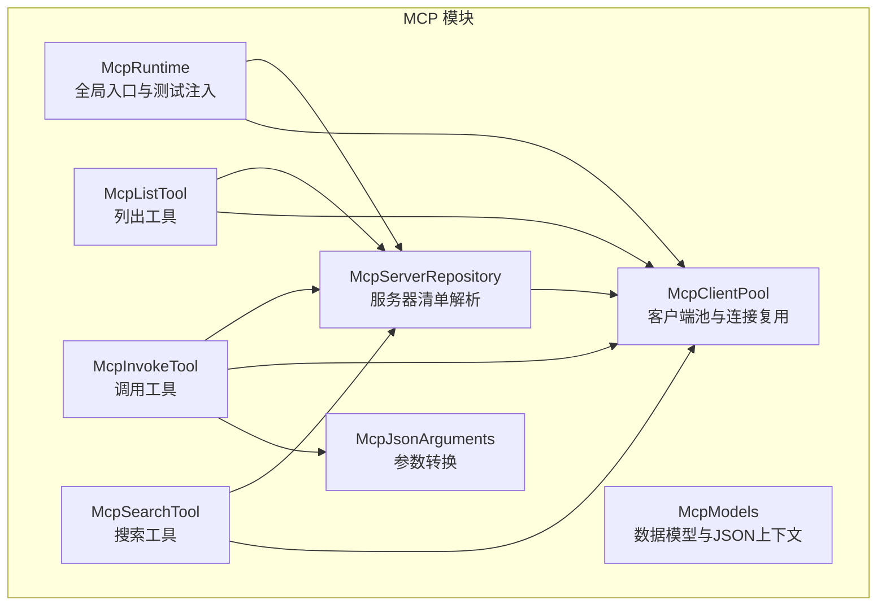
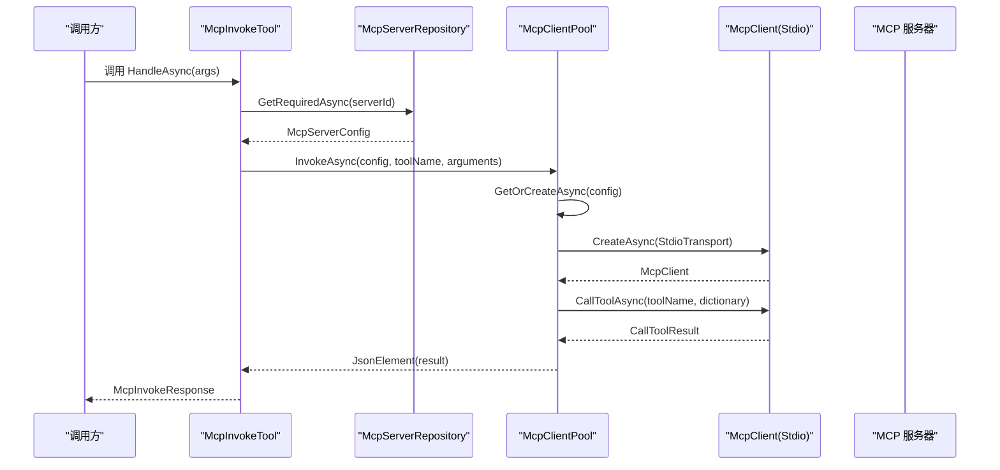
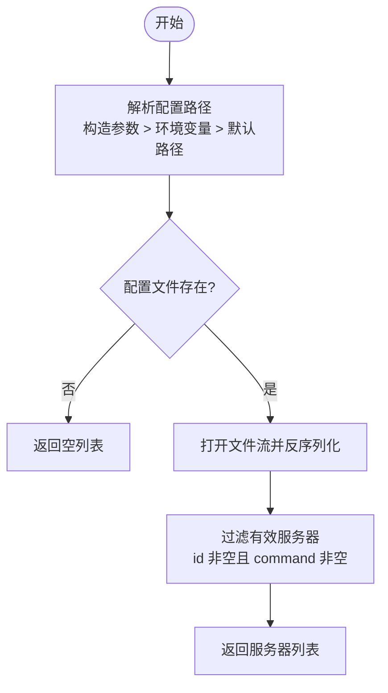
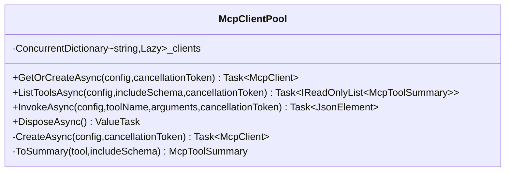
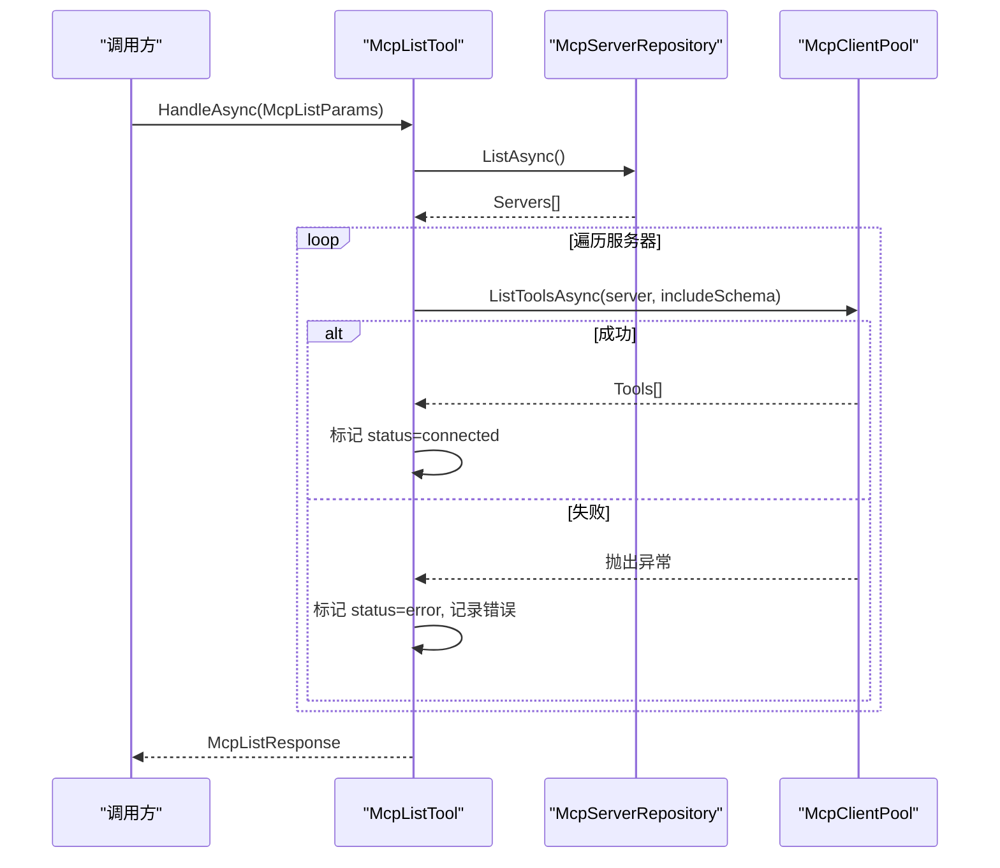
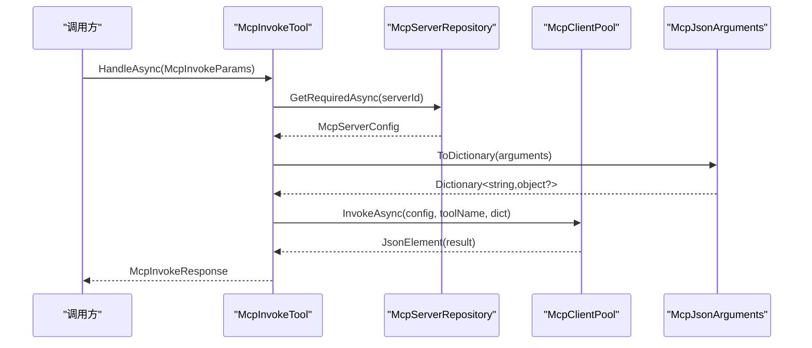
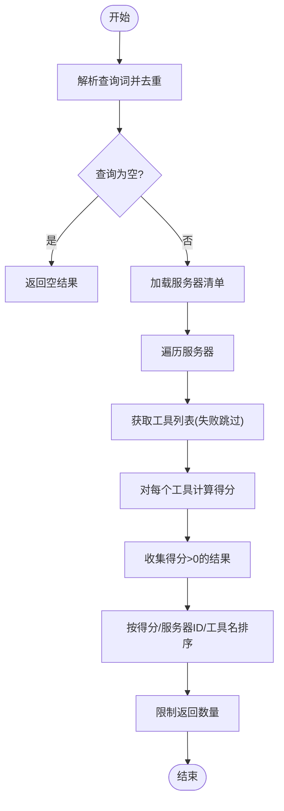
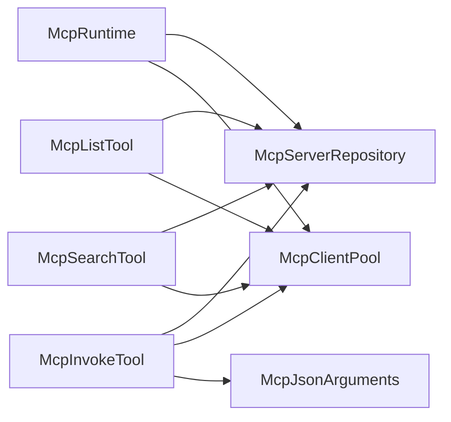

# MCP 集成

<cite>
**本文引用的文件**   
- [McpClientPool.cs](file://TinadecTools/Tools/Mcp/McpClientPool.cs)
- [McpRuntime.cs](file://TinadecTools/Tools/Mcp/McpRuntime.cs)
- [McpServerRepository.cs](file://TinadecTools/Tools/Mcp/McpServerRepository.cs)
- [McpInvokeTool.cs](file://TinadecTools/Tools/Mcp/McpInvokeTool.cs)
- [McpListTool.cs](file://TinadecTools/Tools/Mcp/McpListTool.cs)
- [McpSearchTool.cs](file://TinadecTools/Tools/Mcp/McpSearchTool.cs)
- [McpModels.cs](file://TinadecTools/Tools/Mcp/McpModels.cs)
- [McpJsonArguments.cs](file://TinadecTools/Tools/Mcp/McpJsonArguments.cs)
- [.mcp.json](file://.mcp.json)
- [mcp-mock-server.js](file://tests/TinadecTools.Tests/fixtures/mcp-mock-server.js)
- [McpPassThroughTests.cs](file://tests/TinadecTools.Tests/McpPassThroughTests.cs)
</cite>

## 目录
1. [简介](#简介)
2. [项目结构](#项目结构)
3. [核心组件](#核心组件)
4. [架构总览](#架构总览)
5. [详细组件分析](#详细组件分析)
6. [依赖关系分析](#依赖关系分析)
7. [性能与可用性](#性能与可用性)
8. [故障排查指南](#故障排查指南)
9. [结论](#结论)
10. [附录：开发指南与示例](#附录开发指南与示例)

## 简介
本模块实现了对 MCP（Model Context Protocol）的客户端集成，提供以下能力：
- MCP 服务器发现：从配置文件加载并校验服务器清单。
- 工具列表获取：连接 MCP 服务器并枚举可用工具，支持可选 schema 返回。
- 服务重载：通过环境变量或构造参数动态切换配置路径，测试场景可注入替换实例。
- 客户端池管理：基于进程内连接复用，按服务器标识缓存 McpClient 实例，失败自动清理。
- 调用转发：将工具调用参数转换为协议所需格式，透传结果并统一错误封装。
- 搜索与筛选：对工具名和描述进行加权打分排序，快速定位目标工具。

该模块以 C# 实现，使用 System.Text.Json 进行 JSON 序列化，并通过 ModelContextProtocol 库与 MCP 服务器通信（默认采用 Stdio 传输）。

## 项目结构
MCP 相关代码位于 TinadecTools/Tools/Mcp 目录下，包含运行时、仓库、客户端池、工具入口以及数据模型等。根目录 .mcp.json 为示例配置（注意：当前实现主要读取 mcp_servers.json，见“服务器发现”章节说明）。

图表来源
- [McpServerRepository.cs:1-53](file://TinadecTools/Tools/Mcp/McpServerRepository.cs#L1-L53)
- [McpClientPool.cs:1-89](file://TinadecTools/Tools/Mcp/McpClientPool.cs#L1-L89)
- [McpRuntime.cs:1-19](file://TinadecTools/Tools/Mcp/McpRuntime.cs#L1-L19)
- [McpListTool.cs:1-42](file://TinadecTools/Tools/Mcp/McpListTool.cs#L1-L42)
- [McpInvokeTool.cs:1-39](file://TinadecTools/Tools/Mcp/McpInvokeTool.cs#L1-L39)
- [McpSearchTool.cs:1-87](file://TinadecTools/Tools/Mcp/McpSearchTool.cs#L1-L87)
- [McpModels.cs:1-115](file://TinadecTools/Tools/Mcp/McpModels.cs#L1-L115)
- [McpJsonArguments.cs:1-37](file://TinadecTools/Tools/Mcp/McpJsonArguments.cs#L1-L37)

章节来源
- [McpServerRepository.cs:1-53](file://TinadecTools/Tools/Mcp/McpServerRepository.cs#L1-L53)
- [McpClientPool.cs:1-89](file://TinadecTools/Tools/Mcp/McpClientPool.cs#L1-L89)
- [McpRuntime.cs:1-19](file://TinadecTools/Tools/Mcp/McpRuntime.cs#L1-L19)
- [McpModels.cs:1-115](file://TinadecTools/Tools/Mcp/McpModels.cs#L1-L115)

## 核心组件
- McpServerRepository：负责从配置文件读取并过滤有效的服务器配置，支持通过环境变量覆盖配置路径。
- McpClientPool：维护每个服务器的 McpClient 实例，懒创建、异常时移除并重试；提供 ListToolsAsync 与 InvokeAsync。
- McpRuntime：暴露 Repository 与 ClientPool 的全局访问点，并提供测试注入方法。
- McpListTool / McpInvokeTool / McpSearchTool：对外暴露的工具函数，分别用于列举、调用与搜索 MCP 工具。
- McpModels：定义所有请求/响应/配置的数据结构与 JSON 源生成上下文。
- McpJsonArguments：将 JsonElement 参数转换为字典，适配协议调用。

章节来源
- [McpServerRepository.cs:1-53](file://TinadecTools/Tools/Mcp/McpServerRepository.cs#L1-L53)
- [McpClientPool.cs:1-89](file://TinadecTools/Tools/Mcp/McpClientPool.cs#L1-L89)
- [McpRuntime.cs:1-19](file://TinadecTools/Tools/Mcp/McpRuntime.cs#L1-L19)
- [McpListTool.cs:1-42](file://TinadecTools/Tools/Mcp/McpListTool.cs#L1-L42)
- [McpInvokeTool.cs:1-39](file://TinadecTools/Tools/Mcp/McpInvokeTool.cs#L1-L39)
- [McpSearchTool.cs:1-87](file://TinadecTools/Tools/Mcp/McpSearchTool.cs#L1-L87)
- [McpModels.cs:1-115](file://TinadecTools/Tools/Mcp/McpModels.cs#L1-L115)
- [McpJsonArguments.cs:1-37](file://TinadecTools/Tools/Mcp/McpJsonArguments.cs#L1-L37)

## 架构总览
下图展示了从工具调用到 MCP 服务器的端到端流程，包括配置解析、连接复用、工具枚举与调用。

图表来源
- [McpInvokeTool.cs:1-39](file://TinadecTools/Tools/Mcp/McpInvokeTool.cs#L1-L39)
- [McpServerRepository.cs:1-53](file://TinadecTools/Tools/Mcp/McpServerRepository.cs#L1-L53)
- [McpClientPool.cs:1-89](file://TinadecTools/Tools/Mcp/McpClientPool.cs#L1-L89)

## 详细组件分析

### 服务器发现与配置解析（McpServerRepository）
- 配置路径解析优先级：构造参数 > 环境变量 TINADEC_TOOLS_MCP_CONFIG > 默认 mcp_servers.json。
- 读取并反序列化为 McpServersFile，过滤无效条目（需包含 id 与 command）。
- 提供 ListAsync 与 GetRequiredAsync 两种查询方式。

图表来源
- [McpServerRepository.cs:1-53](file://TinadecTools/Tools/Mcp/McpServerRepository.cs#L1-L53)

章节来源
- [McpServerRepository.cs:1-53](file://TinadecTools/Tools/Mcp/McpServerRepository.cs#L1-L53)

### 客户端池与连接复用（McpClientPool）
- 使用 ConcurrentDictionary<string, Lazy<Task<McpClient>>> 按服务器 Id 缓存连接。
- GetOrCreateAsync 懒创建连接；若创建失败则移除缓存项并抛出异常，便于上层重试或降级。
- ListToolsAsync 调用 client.ListToolsAsync，并将结果映射为 McpToolSummary（可选 includeSchema）。
- InvokeAsync 将 JsonElement 参数转换为字典，调用 CallToolAsync，并序列化结果为 JsonElement。
- DisposeAsync 遍历并释放已创建的客户端。

图表来源
- [McpClientPool.cs:1-89](file://TinadecTools/Tools/Mcp/McpClientPool.cs#L1-L89)

章节来源
- [McpClientPool.cs:1-89](file://TinadecTools/Tools/Mcp/McpClientPool.cs#L1-L89)

### 工具列举（McpListTool）
- 读取服务器清单，逐个尝试连接并获取工具列表。
- 成功时标记状态为 connected，失败捕获异常并记录 warn，状态标记为 error 并附带错误信息。
- 支持 includeSchema 控制是否返回输入 schema。

图表来源
- [McpListTool.cs:1-42](file://TinadecTools/Tools/Mcp/McpListTool.cs#L1-L42)
- [McpServerRepository.cs:1-53](file://TinadecTools/Tools/Mcp/McpServerRepository.cs#L1-L53)
- [McpClientPool.cs:1-89](file://TinadecTools/Tools/Mcp/McpClientPool.cs#L1-L89)

章节来源
- [McpListTool.cs:1-42](file://TinadecTools/Tools/Mcp/McpListTool.cs#L1-L42)

### 工具调用（McpInvokeTool）
- 根据 serverId 查找服务器配置，调用 ClientPool.InvokeAsync 执行工具。
- 成功返回包含 result 的响应；失败捕获异常并返回 Success=false 与错误消息。
- 参数转换由 McpJsonArguments.ToDictionary 完成，确保对象/数组/基本类型正确映射。

图表来源
- [McpInvokeTool.cs:1-39](file://TinadecTools/Tools/Mcp/McpInvokeTool.cs#L1-L39)
- [McpServerRepository.cs:1-53](file://TinadecTools/Tools/Mcp/McpServerRepository.cs#L1-L53)
- [McpClientPool.cs:1-89](file://TinadecTools/Tools/Mcp/McpClientPool.cs#L1-L89)
- [McpJsonArguments.cs:1-37](file://TinadecTools/Tools/Mcp/McpJsonArguments.cs#L1-L37)

章节来源
- [McpInvokeTool.cs:1-39](file://TinadecTools/Tools/Mcp/McpInvokeTool.cs#L1-L39)
- [McpJsonArguments.cs:1-37](file://TinadecTools/Tools/Mcp/McpJsonArguments.cs#L1-L37)

### 工具搜索（McpSearchTool）
- 对 query 分词后，遍历所有服务器并获取工具列表（失败跳过）。
- 对每个工具计算得分：名称精确匹配权重最高，前缀次之，包含最低；描述参与加权。
- 最终按得分降序、serverId 与工具名升序排序，限制返回数量。

图表来源
- [McpSearchTool.cs:1-87](file://TinadecTools/Tools/Mcp/McpSearchTool.cs#L1-L87)

章节来源
- [McpSearchTool.cs:1-87](file://TinadecTools/Tools/Mcp/McpSearchTool.cs#L1-L87)

### 数据模型与 JSON 上下文（McpModels）
- 定义服务器配置、工具摘要、各工具的请求/响应模型。
- 使用 System.Text.Json.SourceGeneration 预编译 JSON 序列化上下文，提升性能与稳定性。
- 包含 CallToolResult 的序列化支持，以便在调用结果中直接输出结构化内容。

章节来源
- [McpModels.cs:1-115](file://TinadecTools/Tools/Mcp/McpModels.cs#L1-L115)

## 依赖关系分析
- McpRuntime 依赖 McpServerRepository 与 McpClientPool，作为全局入口。
- 三个工具类均依赖 Repository 与 Pool，形成松耦合的调用链。
- McpClientPool 依赖 ModelContextProtocol 库进行协议交互，并使用 System.Text.Json 进行序列化。
- 测试用例通过 McpRuntime.ConfigureForTests 注入自定义配置路径与客户端池，验证端到端流程。

图表来源
- [McpRuntime.cs:1-19](file://TinadecTools/Tools/Mcp/McpRuntime.cs#L1-L19)
- [McpServerRepository.cs:1-53](file://TinadecTools/Tools/Mcp/McpServerRepository.cs#L1-L53)
- [McpClientPool.cs:1-89](file://TinadecTools/Tools/Mcp/McpClientPool.cs#L1-L89)
- [McpListTool.cs:1-42](file://TinadecTools/Tools/Mcp/McpListTool.cs#L1-L42)
- [McpInvokeTool.cs:1-39](file://TinadecTools/Tools/Mcp/McpInvokeTool.cs#L1-L39)
- [McpSearchTool.cs:1-87](file://TinadecTools/Tools/Mcp/McpSearchTool.cs#L1-L87)
- [McpJsonArguments.cs:1-37](file://TinadecTools/Tools/Mcp/McpJsonArguments.cs#L1-L37)

章节来源
- [McpRuntime.cs:1-19](file://TinadecTools/Tools/Mcp/McpRuntime.cs#L1-L19)
- [McpPassThroughTests.cs:1-87](file://tests/TinadecTools.Tests/McpPassThroughTests.cs#L1-L87)

## 性能与可用性
- 连接复用：通过 Lazy<Task<McpClient>> 避免重复创建进程与连接，降低延迟与资源消耗。
- 异常隔离：单个服务器连接失败不影响其他服务器；工具调用失败仅影响当前请求。
- 序列化优化：使用 SourceGeneration 减少反射开销，提高吞吐。
- 可扩展性：可通过环境变量或构造参数切换配置路径，便于多环境部署与测试。

[本节为通用指导，不直接分析具体文件]

## 故障排查指南
- 配置路径问题：确认环境变量 TINADEC_TOOLS_MCP_CONFIG 或默认 mcp_servers.json 是否存在且可读。
- 服务器无效：检查服务器配置是否包含 id 与 command；无效条目会被过滤。
- 连接失败：查看 McpListTool 的错误状态与日志；确认命令与参数能启动 MCP 服务器。
- 参数解析错误：确保 arguments 为 JSON 对象；McpJsonArguments 会抛出非法参数的异常。
- 工具不存在：MCP 服务器应返回未知工具错误码；检查工具名拼写与大小写。

章节来源
- [McpServerRepository.cs:1-53](file://TinadecTools/Tools/Mcp/McpServerRepository.cs#L1-L53)
- [McpListTool.cs:1-42](file://TinadecTools/Tools/Mcp/McpListTool.cs#L1-L42)
- [McpInvokeTool.cs:1-39](file://TinadecTools/Tools/Mcp/McpInvokeTool.cs#L1-L39)
- [McpJsonArguments.cs:1-37](file://TinadecTools/Tools/Mcp/McpJsonArguments.cs#L1-L37)

## 结论
本模块提供了完整的 MCP 客户端集成能力，涵盖服务器发现、工具枚举、调用转发与搜索功能，并通过客户端池实现连接复用与故障隔离。配合测试注入与环境变量，可在开发与生产环境中灵活配置与扩展。

[本节为总结，不直接分析具体文件]

## 附录：开发指南与示例

### MCP 服务器开发指南
- 协议基础：遵循 MCP 协议的 initialize、tools/list、tools/call 方法。
- 传输方式：推荐使用 Stdio 传输，通过标准输入输出交换 JSON-RPC 消息。
- 工具声明：在 tools/list 中返回工具名、描述与 inputSchema，确保字段完整。
- 错误处理：对未知工具或方法返回合适的错误码与消息，便于上层识别与提示。

章节来源
- [mcp-mock-server.js:1-75](file://tests/TinadecTools.Tests/fixtures/mcp-mock-server.js#L1-L75)

### 集成示例
- 配置服务器：在 mcp_servers.json 中定义服务器清单（id、name、command、args、env、cwd）。
- 列举工具：调用 McpListTool 获取工具列表，检查状态与错误信息。
- 调用工具：使用 McpInvokeTool 传入 serverId、toolName 与 arguments，获取结构化结果。
- 搜索工具：通过 McpSearchTool 模糊匹配工具名与描述，快速定位目标工具。

章节来源
- [McpModels.cs:1-115](file://TinadecTools/Tools/Mcp/McpModels.cs#L1-L115)
- [McpListTool.cs:1-42](file://TinadecTools/Tools/Mcp/McpListTool.cs#L1-L42)
- [McpInvokeTool.cs:1-39](file://TinadecTools/Tools/Mcp/McpInvokeTool.cs#L1-L39)
- [McpSearchTool.cs:1-87](file://TinadecTools/Tools/Mcp/McpSearchTool.cs#L1-L87)

### 关于 .mcp.json 的说明
- 根目录 .mcp.json 包含 SSE 与 npx 示例，但当前实现主要读取 mcp_servers.json。
- 如需使用 .mcp.json，请扩展 McpServerRepository 以支持新的配置格式与传输类型（如 SSE）。

章节来源
- [.mcp.json:1-14](file://.mcp.json#L1-L14)
- [McpServerRepository.cs:1-53](file://TinadecTools/Tools/Mcp/McpServerRepository.cs#L1-L53)