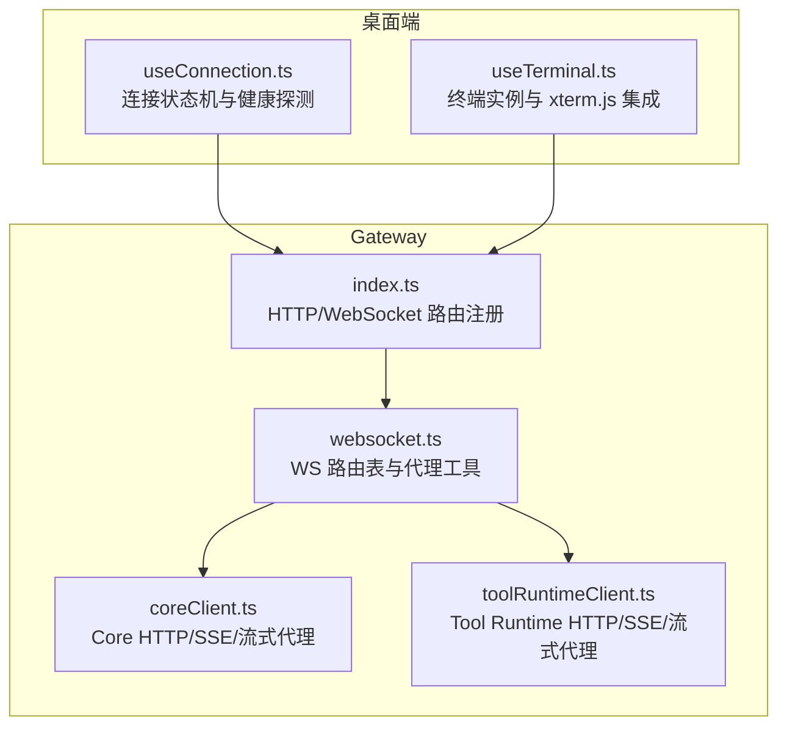
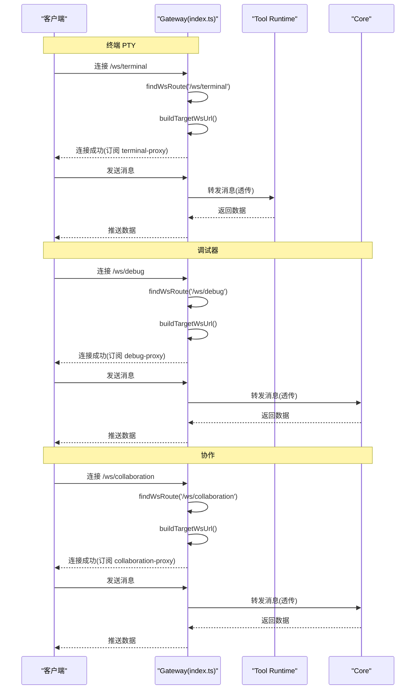
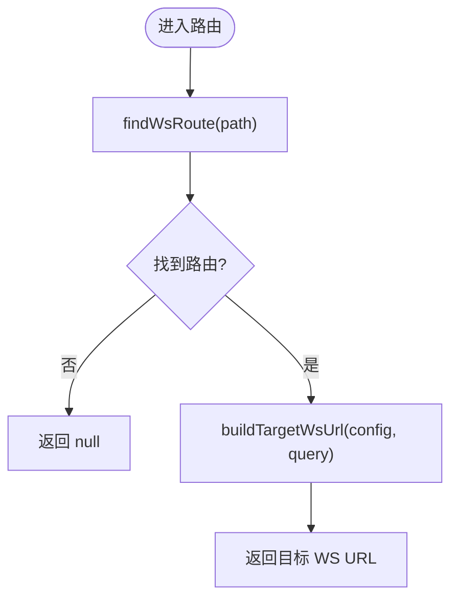
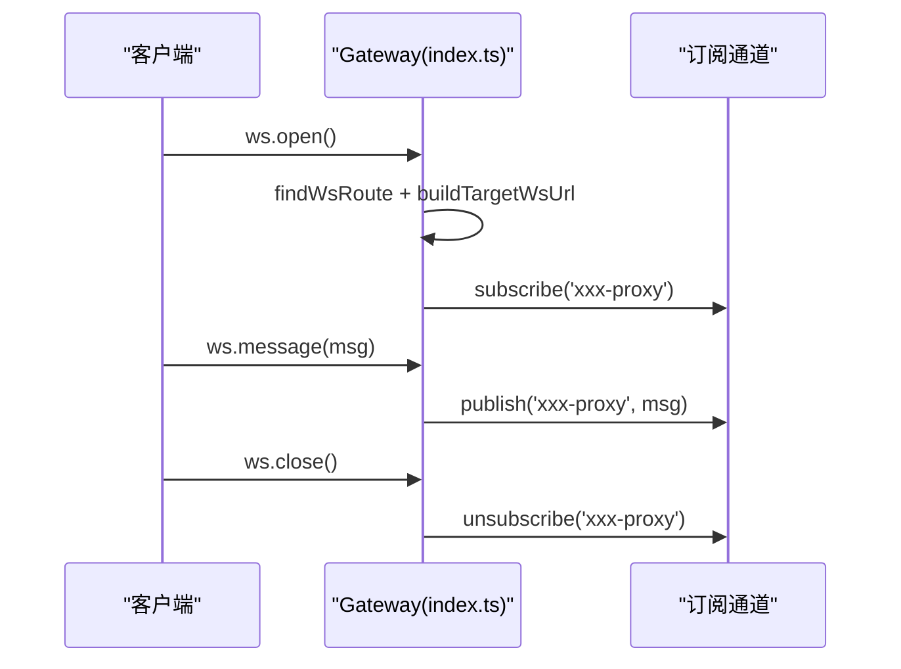
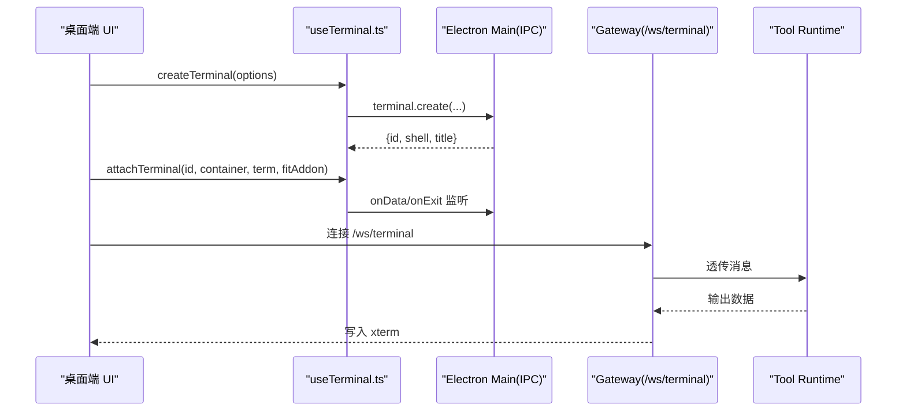
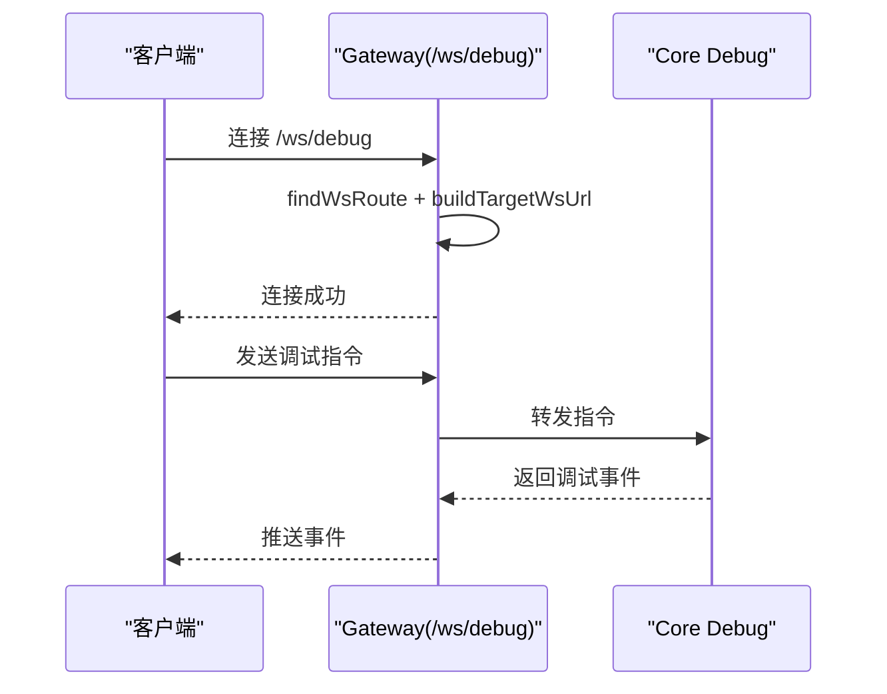
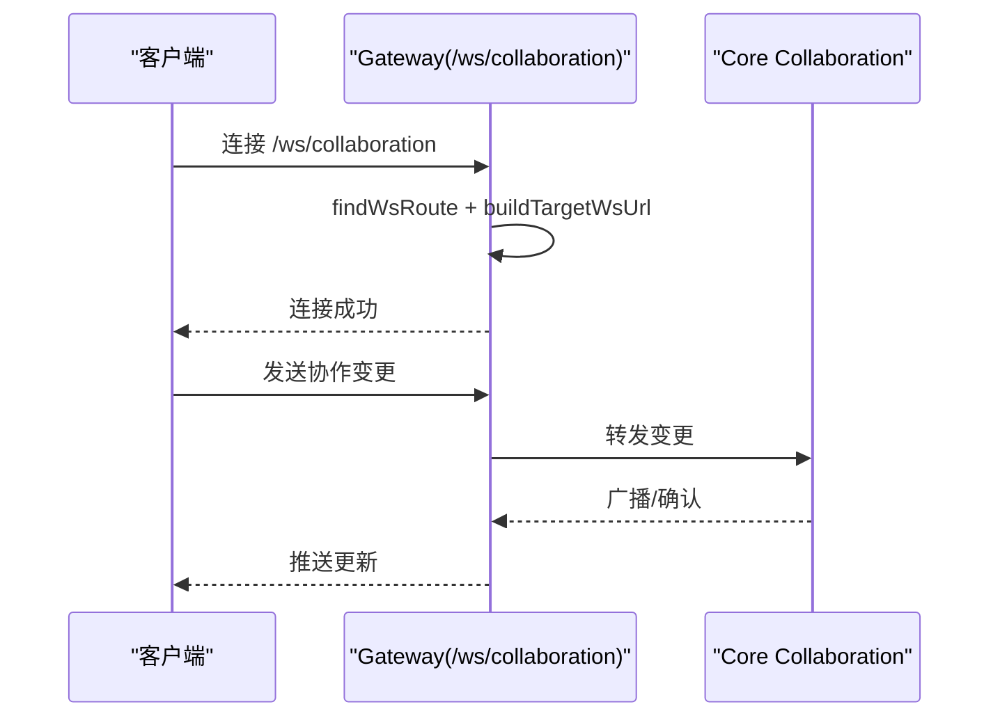
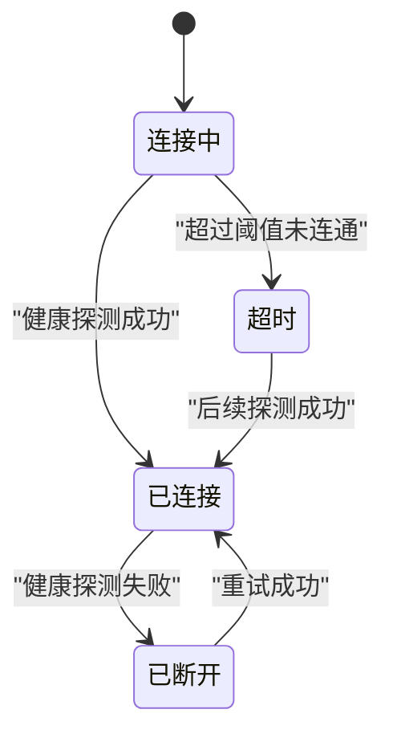
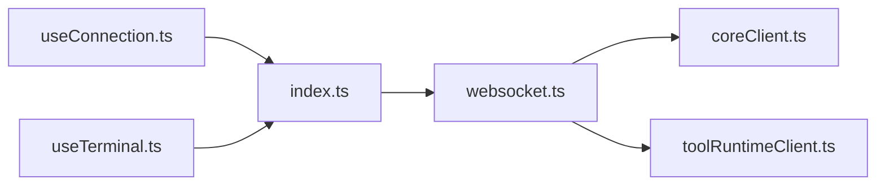

# WebSocket 通信

<cite>
**本文引用的文件**   
- [websocket.ts](file://TinadecGateway/src/websocket.ts)
- [index.ts](file://TinadecGateway/src/index.ts)
- [coreClient.ts](file://TinadecGateway/src/coreClient.ts)
- [toolRuntimeClient.ts](file://TinadecGateway/src/toolRuntimeClient.ts)
- [useConnection.ts](file://apps/desktop/src/composables/useConnection.ts)
- [useTerminal.ts](file://apps/desktop/src/composables/useTerminal.ts)
</cite>

## 目录
1. [简介](#简介)
2. [项目结构](#项目结构)
3. [核心组件](#核心组件)
4. [架构总览](#架构总览)
5. [详细组件分析](#详细组件分析)
6. [依赖关系分析](#依赖关系分析)
7. [性能考量](#性能考量)
8. [故障排查指南](#故障排查指南)
9. [结论](#结论)
10. [附录：客户端集成与最佳实践](#附录客户端集成与最佳实践)

## 简介
本文件面向 WebSocket 通信模块，系统性梳理 Gateway 中的 WebSocket 路由发现、连接管理与消息转发机制，覆盖终端会话（PTY）、调试通道与实时协作三类场景。文档同时给出连接生命周期管理、消息队列与断线重连策略建议，并提供前端客户端集成指南与常见问题排查方法。

## 项目结构
WebSocket 相关能力集中在 Gateway 的 TypeScript 代码中，通过路由表将不同路径的 WebSocket 请求分发到 Core 或 Tool Runtime 服务；桌面端通过 IPC/Composable 管理终端实例并与后端交互。

**图表来源** 
- [index.ts:820-872](file://TinadecGateway/src/index.ts#L820-L872)
- [websocket.ts:51-74](file://TinadecGateway/src/websocket.ts#L51-L74)
- [coreClient.ts:23-30](file://TinadecGateway/src/coreClient.ts#L23-L30)
- [toolRuntimeClient.ts:29-36](file://TinadecGateway/src/toolRuntimeClient.ts#L29-L36)
- [useConnection.ts:105-129](file://apps/desktop/src/composables/useConnection.ts#L105-L129)
- [useTerminal.ts:473-514](file://apps/desktop/src/composables/useTerminal.ts#L473-L514)

**章节来源**
- [index.ts:820-872](file://TinadecGateway/src/index.ts#L820-L872)
- [websocket.ts:1-140](file://TinadecGateway/src/websocket.ts#L1-L140)
- [coreClient.ts:1-110](file://TinadecGateway/src/coreClient.ts#L1-L110)
- [toolRuntimeClient.ts:1-126](file://TinadecGateway/src/toolRuntimeClient.ts#L1-L126)
- [useConnection.ts:1-138](file://apps/desktop/src/composables/useConnection.ts#L1-L138)
- [useTerminal.ts:1-515](file://apps/desktop/src/composables/useTerminal.ts#L1-L515)

## 核心组件
- WebSocket 路由表与目标 URL 构建：集中定义暴露给客户端的路径与目标服务映射，并支持查询参数透传。
- WS 代理处理器：在客户端与目标服务之间建立双向透传通道，处理消息、关闭与错误事件。
- Gateway 路由注册：为 /ws/terminal、/ws/debug、/ws/collaboration 三个端点注册 open/message/close 回调，使用订阅/发布模式进行消息转发。
- 目标服务客户端：提供 Core 与 Tool Runtime 的 HTTP/SSE/流式代理能力，用于健康检查、日志与文件传输等。
- 桌面端连接与终端：连接状态机负责健康探测与超时控制；终端 Composable 管理多实例 PTY、xterm.js 渲染与主题适配。

**章节来源**
- [websocket.ts:19-74](file://TinadecGateway/src/websocket.ts#L19-L74)
- [websocket.ts:93-139](file://TinadecGateway/src/websocket.ts#L93-L139)
- [index.ts:820-872](file://TinadecGateway/src/index.ts#L820-L872)
- [coreClient.ts:23-110](file://TinadecGateway/src/coreClient.ts#L23-L110)
- [toolRuntimeClient.ts:29-126](file://TinadecGateway/src/toolRuntimeClient.ts#L29-L126)
- [useConnection.ts:105-129](file://apps/desktop/src/composables/useConnection.ts#L105-L129)
- [useTerminal.ts:159-225](file://apps/desktop/src/composables/useTerminal.ts#L159-L225)

## 架构总览
Gateway 作为统一入口，将客户端的 WebSocket 请求按路径路由到 Core 或 Tool Runtime。终端 PTY 走 Tool Runtime，调试与协作走 Core。消息在 Gateway 内通过订阅/发布通道进行转发，保证低延迟与高吞吐。

**图表来源** 
- [index.ts:820-872](file://TinadecGateway/src/index.ts#L820-L872)
- [websocket.ts:51-74](file://TinadecGateway/src/websocket.ts#L51-L74)
- [websocket.ts:35-45](file://TinadecGateway/src/websocket.ts#L35-L45)

## 详细组件分析

### WebSocket 路由发现与目标 URL 构建
- 路由表 WS_ROUTES 定义了三个端点的目标服务与路径映射。
- findWsRoute 根据请求路径查找配置。
- buildTargetWsUrl 将 HTTP(S) 基础地址转换为 WS(WSS) 地址，并拼接查询参数。

**图表来源** 
- [websocket.ts:72-74](file://TinadecGateway/src/websocket.ts#L72-L74)
- [websocket.ts:35-45](file://TinadecGateway/src/websocket.ts#L35-L45)

**章节来源**
- [websocket.ts:51-74](file://TinadecGateway/src/websocket.ts#L51-L74)

### 连接管理与消息转发（Bun WS）
- index.ts 对每个 WS 路径注册 open/message/close 回调。
- open 阶段查找路由并构建目标 URL，随后订阅对应频道。
- message 阶段将消息发布到对应频道，由底层 WS 实现完成透传。
- close 阶段取消订阅，释放资源。

**图表来源** 
- [index.ts:820-872](file://TinadecGateway/src/index.ts#L820-L872)

**章节来源**
- [index.ts:820-872](file://TinadecGateway/src/index.ts#L820-L872)

### 终端会话（PTY）流程
- 桌面端 useTerminal 创建/附加/销毁终端实例，并通过 IPC 与主进程交互。
- Gateway 的 /ws/terminal 将客户端输入转发至 Tool Runtime，输出回推至客户端。

**图表来源** 
- [useTerminal.ts:159-225](file://apps/desktop/src/composables/useTerminal.ts#L159-L225)
- [useTerminal.ts:236-300](file://apps/desktop/src/composables/useTerminal.ts#L236-L300)
- [index.ts:820-838](file://TinadecGateway/src/index.ts#L820-L838)

**章节来源**
- [useTerminal.ts:159-300](file://apps/desktop/src/composables/useTerminal.ts#L159-L300)
- [index.ts:820-838](file://TinadecGateway/src/index.ts#L820-L838)

### 调试通道（/ws/debug）
- 路由映射到 Core 的调试端点。
- 连接建立后，客户端与 Core 之间的调试消息经 Gateway 透传。

**图表来源** 
- [index.ts:839-855](file://TinadecGateway/src/index.ts#L839-L855)
- [websocket.ts:57-61](file://TinadecGateway/src/websocket.ts#L57-L61)

**章节来源**
- [index.ts:839-855](file://TinadecGateway/src/index.ts#L839-L855)
- [websocket.ts:57-61](file://TinadecGateway/src/websocket.ts#L57-L61)

### 实时协作（/ws/collaboration）
- 路由映射到 Core 的协作端点。
- 适用于多人编辑、同步状态等场景，Gateway 仅做透传。

**图表来源** 
- [index.ts:856-872](file://TinadecGateway/src/index.ts#L856-L872)
- [websocket.ts:62-66](file://TinadecGateway/src/websocket.ts#L62-L66)

**章节来源**
- [index.ts:856-872](file://TinadecGateway/src/index.ts#L856-L872)
- [websocket.ts:62-66](file://TinadecGateway/src/websocket.ts#L62-L66)

### 连接生命周期与重连策略
- 桌面端 useConnection 维护连接状态机（connecting/connected/timeout/disconnected），周期性健康探测并在超时后降级进入主界面。
- 建议在 WS 层增加指数退避重连、心跳保活与失败快速失败策略。

**图表来源** 
- [useConnection.ts:105-129](file://apps/desktop/src/composables/useConnection.ts#L105-L129)

**章节来源**
- [useConnection.ts:105-129](file://apps/desktop/src/composables/useConnection.ts#L105-L129)

### 消息队列与背压
- Gateway 当前采用直接透传，适合低延迟场景。
- 若下游不可用或拥塞，应在 Gateway 侧引入内存队列与限流，避免雪崩。
- 建议对大消息分片与压缩，结合应用层 ACK 保障可靠性。

[本节为通用指导，不直接分析具体文件]

## 依赖关系分析
Gateway 内部模块间依赖清晰：index.ts 依赖 websocket.ts 的路由与 URL 构建；websocket.ts 依赖 coreClient.ts 与 toolRuntimeClient.ts 的基础地址解析；桌面端 useConnection.ts 与 useTerminal.ts 分别负责连接状态与终端实例管理。

**图表来源** 
- [index.ts:50](file://TinadecGateway/src/index.ts#L50)
- [websocket.ts:15-17](file://TinadecGateway/src/websocket.ts#L15-L17)
- [coreClient.ts:23-30](file://TinadecGateway/src/coreClient.ts#L23-L30)
- [toolRuntimeClient.ts:29-36](file://TinadecGateway/src/toolRuntimeClient.ts#L29-L36)
- [useConnection.ts:105-129](file://apps/desktop/src/composables/useConnection.ts#L105-L129)
- [useTerminal.ts:473-514](file://apps/desktop/src/composables/useTerminal.ts#L473-L514)

**章节来源**
- [index.ts:50](file://TinadecGateway/src/index.ts#L50)
- [websocket.ts:15-17](file://TinadecGateway/src/websocket.ts#L15-L17)
- [coreClient.ts:23-30](file://TinadecGateway/src/coreClient.ts#L23-L30)
- [toolRuntimeClient.ts:29-36](file://TinadecGateway/src/toolRuntimeClient.ts#L29-L36)
- [useConnection.ts:105-129](file://apps/desktop/src/composables/useConnection.ts#L105-L129)
- [useTerminal.ts:473-514](file://apps/desktop/src/composables/useTerminal.ts#L473-L514)

## 性能考量
- 零拷贝透传：Gateway 仅做转发，减少序列化/反序列化开销。
- 订阅/发布模型：降低点对点连接管理的复杂度，提升并发能力。
- 流式传输：SSE/流式 HTTP 用于大文件与日志，避免阻塞。
- 建议优化：
  - 增加心跳与空闲检测，及时回收死连接。
  - 对高频小消息合并与节流，降低带宽占用。
  - 针对下游不可用场景，启用本地缓存与降级响应。

[本节为通用指导，不直接分析具体文件]

## 故障排查指南
- 连接失败
  - 检查 WS 路由是否匹配：确认路径与 WS_ROUTES 一致。
  - 校验目标 URL：确保 http(s) 转 ws(s) 正确，端口与协议一致。
  - 查看健康探测：useConnection 的状态变化可帮助定位网络或服务问题。
- 消息丢失
  - 检查订阅/发布是否正确绑定，close 时是否清理。
  - 观察下游服务日志，确认是否拒绝或丢弃消息。
- 终端异常
  - 确认 xterm 尺寸与 resize 事件是否正常上报。
  - 检查 IPC 数据监听是否被移除或重复注册。
- 常见错误码
  - CORE_UNREACHABLE / TOOL_RUNTIME_UNREACHABLE：目标服务不可达。
  - CORE_INVALID_RESPONSE / TOOL_RUNTIME_INVALID_RESPONSE：非 JSON 响应。

**章节来源**
- [coreClient.ts:38-87](file://TinadecGateway/src/coreClient.ts#L38-L87)
- [toolRuntimeClient.ts:44-97](file://TinadecGateway/src/toolRuntimeClient.ts#L44-L97)
- [useConnection.ts:73-94](file://apps/desktop/src/composables/useConnection.ts#L73-L94)
- [useTerminal.ts:269-300](file://apps/desktop/src/composables/useTerminal.ts#L269-L300)

## 结论
Gateway 的 WebSocket 模块以简洁的路由表与透传机制为核心，支撑终端、调试与协作三大场景。通过订阅/发布模型与流式传输，实现了高效可靠的实时通信。结合桌面端的连接状态机与终端管理，整体方案具备良好的可扩展性与可维护性。未来可在重连、心跳、队列与限流方面进一步增强鲁棒性与性能。

[本节为总结，不直接分析具体文件]

## 附录：客户端集成与最佳实践
- 连接建立
  - 优先通过 Gateway 暴露的 /ws/* 路径建立连接，避免直连下游服务。
  - 在 open 回调中初始化业务上下文（如 session_id、trace_id）。
- 消息格式
  - 约定统一的信封结构（类型、请求 ID、序列号、时间戳），便于追踪与去重。
  - 对大消息进行分片与压缩，配合 ACK 机制保证可靠交付。
- 重连策略
  - 指数退避 + 抖动，限制最大重试次数。
  - 心跳间隔与超时阈值合理设置，避免频繁重连风暴。
- 错误处理
  - 区分网络错误与服务错误，记录诊断信息。
  - 对不可恢复错误进行告警与降级提示。
- 安全与鉴权
  - 在握手阶段传递鉴权令牌，服务端校验后再建立连接。
  - 对敏感通道（调试）限制访问来源与权限。

[本节为通用指导，不直接分析具体文件]