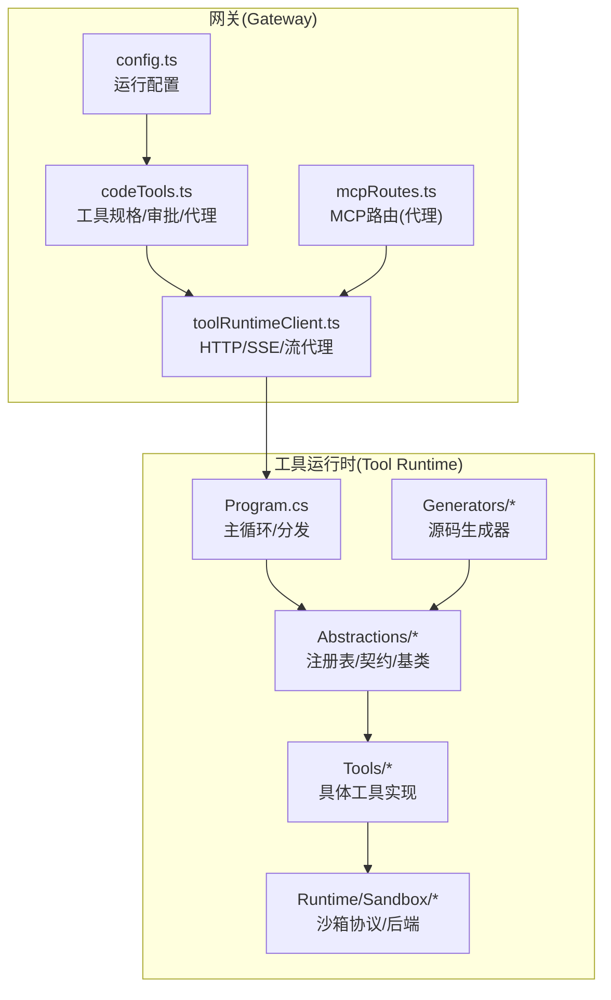
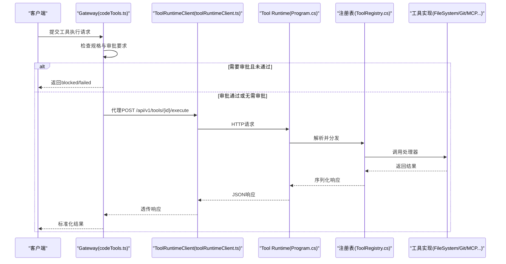
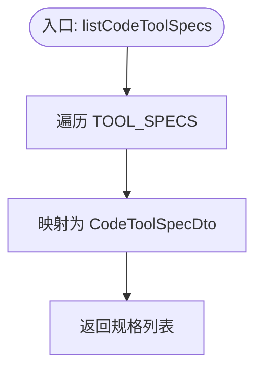
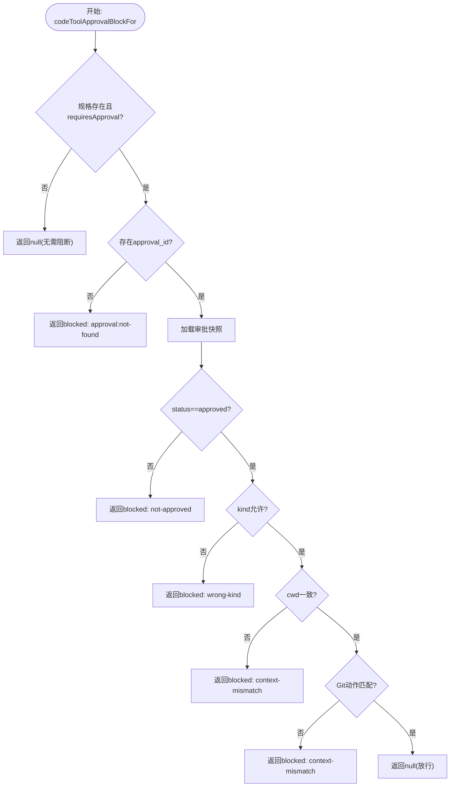
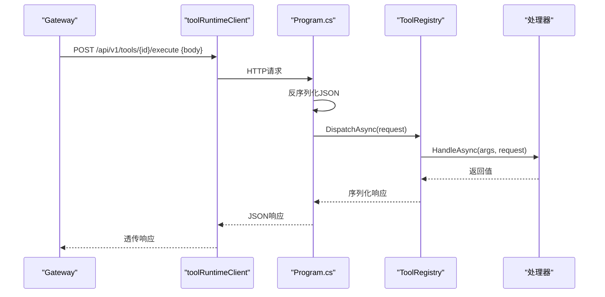
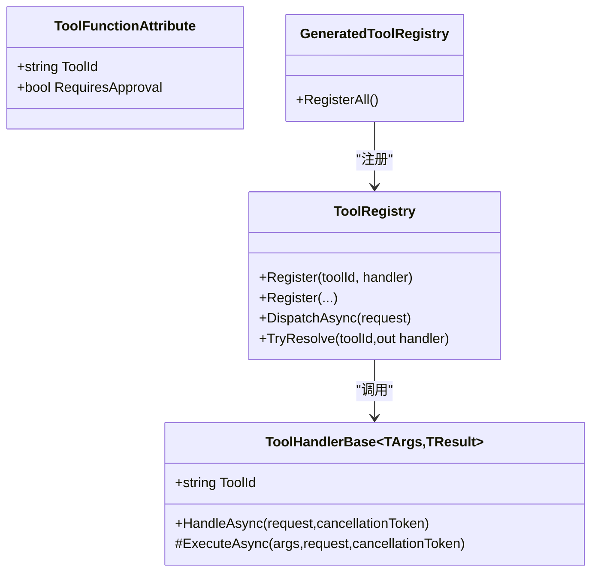
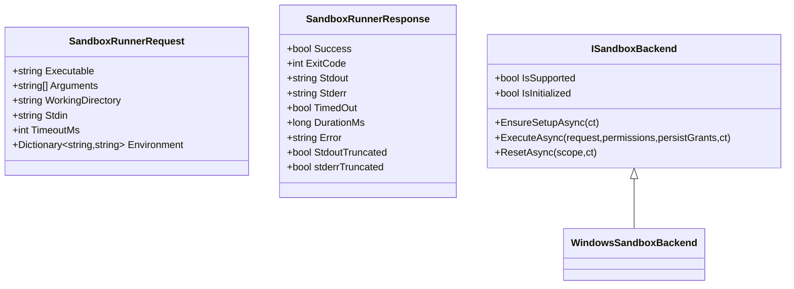
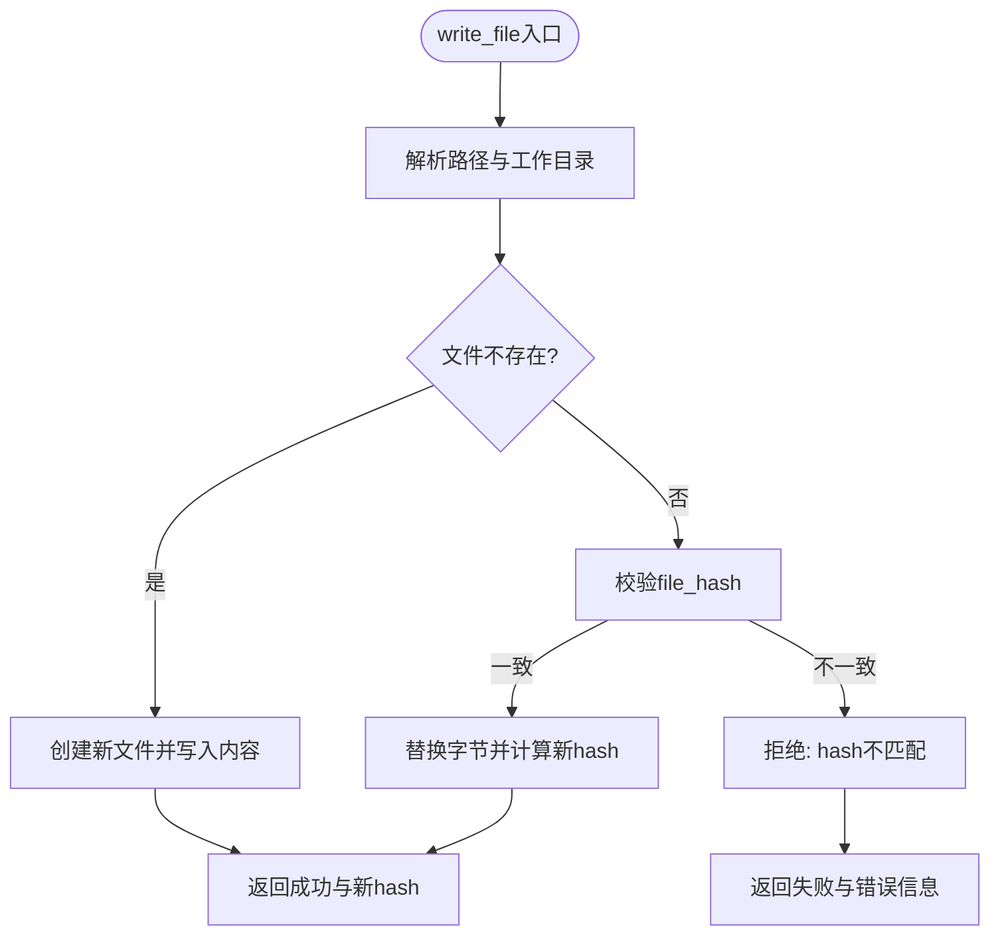
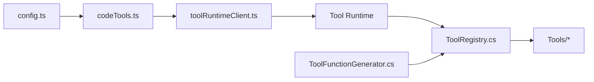

# 代码工具管理

<cite>
**本文引用的文件**   
- [codeTools.ts](file://TinadecGateway/src/codeTools.ts)
- [toolRuntimeClient.ts](file://TinadecGateway/src/toolRuntimeClient.ts)
- [config.ts](file://TinadecGateway/src/config.ts)
- [mcpRoutes.ts](file://TinadecGateway/src/mcp/mcpRoutes.ts)
- [ToolRegistry.cs](file://TinadecTools/Abstractions/ToolRegistry.cs)
- [ToolFunctionAttribute.cs](file://TinadecTools/Abstractions/ToolFunctionAttribute.cs)
- [ToolHandlerBase.cs](file://TinadecTools/Abstractions/ToolHandlerBase.cs)
- [ToolCalling.cs](file://TinadecTools/Abstractions/ToolCalling.cs)
- [Program.cs](file://TinadecTools/Program.cs)
- [SandboxContracts.cs](file://TinadecTools/Runtime/Sandbox/SandboxContracts.cs)
- [ToolConfirmations.cs](file://TinadecTools/Tools/ToolConfirmations.cs)
- [FileSystemTools.cs](file://TinadecTools/Tools/FileRW/FileSystemTools.cs)
- [GitCommitTool.cs](file://TinadecTools/Tools/Git/GitCommitTool.cs)
- [ToolFunctionGenerator.cs](file://TinadecTools.Generators/ToolFunctionGenerator.cs)
</cite>

## 目录
1. [简介](#简介)
2. [项目结构](#项目结构)
3. [核心组件](#核心组件)
4. [架构总览](#架构总览)
5. [详细组件分析](#详细组件分析)
6. [依赖关系分析](#依赖关系分析)
7. [性能考量](#性能考量)
8. [故障排查指南](#故障排查指南)
9. [结论](#结论)
10. [附录：开发规范与集成指南](#附录开发规范与集成指南)

## 简介
本模块为“代码工具管理”的完整实现，涵盖工具规格发布、审批校验、执行代理、沙箱隔离、参数验证与结果格式化等关键能力。Gateway 层仅负责规格暴露与审批门控，所有实际执行均通过 Tool Runtime 完成，确保职责清晰与安全可控。

## 项目结构
- Gateway（Node.js）
  - codeTools.ts：工具规格定义、分类、风险等级、审批拦截与执行代理
  - toolRuntimeClient.ts：对 Tool Runtime 的 HTTP/SSE/流式代理
  - config.ts：Gateway 运行配置（本地/云端模式、端口、认证、超时等）
  - mcpRoutes.ts：MCP 路由插件（纯代理模式）
- Tool Runtime（C#）
  - Abstractions：工具注册表、调用契约、基础处理器、属性标记
  - Program.cs：进程主循环，读取 JSON 请求并分发到工具处理器
  - Tools/*：具体工具实现（文件读写、Git、命令执行、MCP 等）
  - Runtime/Sandbox/*：沙箱协议与后端抽象
  - Generators：源码生成器，自动注册标注的工具方法

**图表来源** 
- [codeTools.ts:1-120](file://TinadecGateway/src/codeTools.ts#L1-L120)
- [toolRuntimeClient.ts:1-126](file://TinadecGateway/src/toolRuntimeClient.ts#L1-L126)
- [config.ts:1-115](file://TinadecGateway/src/config.ts#L1-L115)
- [mcpRoutes.ts:1-66](file://TinadecGateway/src/mcp/mcpRoutes.ts#L1-L66)
- [Program.cs:1-68](file://TinadecTools/Program.cs#L1-L68)
- [ToolRegistry.cs:1-86](file://TinadecTools/Abstractions/ToolRegistry.cs#L1-L86)
- [ToolFunctionGenerator.cs:1-101](file://TinadecTools.Generators/ToolFunctionGenerator.cs#L1-L101)

**章节来源**
- [codeTools.ts:1-120](file://TinadecGateway/src/codeTools.ts#L1-L120)
- [toolRuntimeClient.ts:1-126](file://TinadecGateway/src/toolRuntimeClient.ts#L1-L126)
- [config.ts:1-115](file://TinadecGateway/src/config.ts#L1-L115)
- [mcpRoutes.ts:1-66](file://TinadecGateway/src/mcp/mcpRoutes.ts#L1-L66)
- [Program.cs:1-68](file://TinadecTools/Program.cs#L1-L68)

## 核心组件
- 工具规格与分类
  - 在 Gateway 中集中维护工具规格，包含 id、摘要、分类、是否需审批、语言支持等
  - 分类包括 project、runtime、environment、debug、editor、git、primitive、review
- 审批门控
  - 根据工具规格判断是否需要 Core 审批；若需要，则校验 approval_id 的存在、状态、类型与作用域（如 cwd、command）
  - 未满足条件时返回 blocked 状态与证据链
- 执行代理
  - Gateway 不直接执行任何工具，统一通过 toolRuntimeClient 将请求转发至 Tool Runtime
  - 支持 JSON、SSE、流式响应
- 工具注册与分发（Tool Runtime）
  - 使用属性标记与源码生成器自动生成注册代码
  - 运行时通过 JSON 请求解析、参数反序列化、调用处理器、序列化结果返回

**章节来源**
- [codeTools.ts:204-333](file://TinadecGateway/src/codeTools.ts#L204-L333)
- [codeTools.ts:350-420](file://TinadecGateway/src/codeTools.ts#L350-L420)
- [codeTools.ts:439-462](file://TinadecGateway/src/codeTools.ts#L439-L462)
- [ToolRegistry.cs:10-86](file://TinadecTools/Abstractions/ToolRegistry.cs#L10-L86)
- [ToolFunctionGenerator.cs:1-101](file://TinadecTools.Generators/ToolFunctionGenerator.cs#L1-L101)

## 架构总览
Gateway 作为薄代理层，提供：
- 工具规格查询接口（供 BFF 组合）
- 审批状态验证（Core 审批门控）
- 执行请求代理（Tool Runtime）

Tool Runtime 作为执行引擎，提供：
- 基于 JSON 的请求/响应协议
- 工具注册表与分发
- 沙箱隔离执行（可选）
- MCP 客户端池与调用

**图表来源** 
- [codeTools.ts:439-462](file://TinadecGateway/src/codeTools.ts#L439-L462)
- [toolRuntimeClient.ts:44-97](file://TinadecGateway/src/toolRuntimeClient.ts#L44-L97)
- [Program.cs:24-61](file://TinadecTools/Program.cs#L24-L61)
- [ToolRegistry.cs:76-84](file://TinadecTools/Abstractions/ToolRegistry.cs#L76-L84)

## 详细组件分析

### 工具规格发布与分类
- 工具规格集中定义于 Gateway，包含 id、summary、category、requiresApproval、approvalSummary、language_support
- 分类覆盖项目模板、运行时探测、环境命令、调试会话、编辑器操作、Git 操作、基础原语、代码审查等
- 提供 listCodeToolIds 与 listCodeToolSpecs 用于对外暴露规格

**图表来源** 
- [codeTools.ts:339-348](file://TinadecGateway/src/codeTools.ts#L339-L348)

**章节来源**
- [codeTools.ts:204-333](file://TinadecGateway/src/codeTools.ts#L204-L333)

### 审批机制与风险等级评估
- 高风险工具（如 apply_patch、sandbox_exec、bash_environment、git_* 等）默认 requiresApproval=true
- 审批校验流程：
  - 校验 approval_id 是否存在
  - 校验 Core 审批状态是否为 approved
  - 校验审批类型是否允许（如 git 类工具需 kind=git）
  - 校验工作目录一致性（cwd）
  - 校验 Git 动作与批准命令匹配
- 未通过则返回 blocked 状态与证据链

**图表来源** 
- [codeTools.ts:354-420](file://TinadecGateway/src/codeTools.ts#L354-L420)

**章节来源**
- [codeTools.ts:354-420](file://TinadecGateway/src/codeTools.ts#L354-L420)

### 执行代理与上下文构建
- Gateway 通过 toolRuntimeClient 将请求转发至 Tool Runtime
- 请求体包含 session_id、run_id、task_node_id、approval_id、cwd、arguments、approval、confirmation、source
- Tool Runtime 主循环读取 JSON 行，反序列化为 ToolCallRequest，分发到注册表，处理完成后序列化返回

**图表来源** 
- [toolRuntimeClient.ts:44-97](file://TinadecGateway/src/toolRuntimeClient.ts#L44-L97)
- [Program.cs:24-61](file://TinadecTools/Program.cs#L24-L61)
- [ToolRegistry.cs:76-84](file://TinadecTools/Abstractions/ToolRegistry.cs#L76-L84)

**章节来源**
- [codeTools.ts:439-462](file://TinadecGateway/src/codeTools.ts#L439-L462)
- [toolRuntimeClient.ts:1-126](file://TinadecGateway/src/toolRuntimeClient.ts#L1-L126)
- [Program.cs:1-68](file://TinadecTools/Program.cs#L1-L68)

### 工具注册与参数验证
- 使用 ToolFunctionAttribute 标记静态方法，指定 toolId 与 requiresApproval
- 源码生成器扫描标注方法，生成 GeneratedToolRegistry.RegisterAll() 以批量注册
- ToolRegistry 负责按 toolId 查找处理器，进行参数反序列化与结果序列化
- ToolHandlerBase 提供非静态处理器基类，统一参数校验与序列化流程

**图表来源** 
- [ToolFunctionAttribute.cs:1-15](file://TinadecTools/Abstractions/ToolFunctionAttribute.cs#L1-L15)
- [ToolRegistry.cs:10-86](file://TinadecTools/Abstractions/ToolRegistry.cs#L10-L86)
- [ToolHandlerBase.cs:1-43](file://TinadecTools/Abstractions/ToolHandlerBase.cs#L1-L43)
- [ToolFunctionGenerator.cs:1-101](file://TinadecTools.Generators/ToolFunctionGenerator.cs#L1-L101)

**章节来源**
- [ToolFunctionAttribute.cs:1-15](file://TinadecTools/Abstractions/ToolFunctionAttribute.cs#L1-L15)
- [ToolRegistry.cs:10-86](file://TinadecTools/Abstractions/ToolRegistry.cs#L10-L86)
- [ToolHandlerBase.cs:1-43](file://TinadecTools/Abstractions/ToolHandlerBase.cs#L1-L43)
- [ToolFunctionGenerator.cs:1-101](file://TinadecTools.Generators/ToolFunctionGenerator.cs#L1-L101)

### 沙箱执行与权限控制
- 沙箱协议定义执行请求与响应结构，包括可执行文件、参数、工作目录、stdin、超时、环境变量等
- 后端抽象 ISandboxBackend 提供 ExecuteAsync、ResetAsync 等方法，支持权限白名单（读/写路径、环境变量名）
- Windows 平台提供具体实现（JobObject、ACL、DPAPI 等），其他平台回退到 UnsupportedSandboxBackend

**图表来源** 
- [SandboxContracts.cs:1-71](file://TinadecTools/Runtime/Sandbox/SandboxContracts.cs#L1-L71)

**章节来源**
- [SandboxContracts.cs:1-71](file://TinadecTools/Runtime/Sandbox/SandboxContracts.cs#L1-L71)

### 工具实现示例：文件读写与 Git 提交
- 文件读写工具：
  - ListAsync/StatAsync：列出目录、统计路径信息，支持分页游标与自然排序
  - WriteAsync：写入新文件或覆盖现有文件（需 file_hash 校验），线程安全写入锁
- Git 提交工具：
  - CommitAsync：支持 include_all、commit_staged_only、paths 三种模式，强制确认字段 confirm_commit
  - 失败时返回错误码与当前状态

**图表来源** 
- [FileSystemTools.cs:123-176](file://TinadecTools/Tools/FileRW/FileSystemTools.cs#L123-L176)

**章节来源**
- [FileSystemTools.cs:1-273](file://TinadecTools/Tools/FileRW/FileSystemTools.cs#L1-L273)
- [GitCommitTool.cs:1-149](file://TinadecTools/Tools/Git/GitCommitTool.cs#L1-L149)

### MCP 工具调用（Gateway 侧）
- Gateway 提供 MCP 路由端点，全部代理到 Tool Runtime
- 连接、断开、状态查询、工具调用均通过 proxyToolRuntimeJson 转发

**章节来源**
- [mcpRoutes.ts:1-66](file://TinadecGateway/src/mcp/mcpRoutes.ts#L1-L66)

## 依赖关系分析
- Gateway 依赖 Tool Runtime 服务地址（toolRuntimeUrl），由配置加载
- Tool Runtime 依赖 Abstractions 中的注册表与契约，以及 Tools 下的具体实现
- 源码生成器依赖编译器 API，扫描 ToolFunctionAttribute 并生成注册代码

**图表来源** 
- [config.ts:65-106](file://TinadecGateway/src/config.ts#L65-L106)
- [codeTools.ts:439-462](file://TinadecGateway/src/codeTools.ts#L439-L462)
- [ToolRegistry.cs:10-86](file://TinadecTools/Abstractions/ToolRegistry.cs#L10-L86)
- [ToolFunctionGenerator.cs:1-101](file://TinadecTools.Generators/ToolFunctionGenerator.cs#L1-L101)

**章节来源**
- [config.ts:1-115](file://TinadecGateway/src/config.ts#L1-L115)
- [codeTools.ts:1-120](file://TinadecGateway/src/codeTools.ts#L1-L120)
- [ToolRegistry.cs:10-86](file://TinadecTools/Abstractions/ToolRegistry.cs#L10-L86)
- [ToolFunctionGenerator.cs:1-101](file://TinadecTools.Generators/ToolFunctionGenerator.cs#L1-L101)

## 性能考量
- 大文件传输与日志：Tool Runtime 支持流式 HTTP 与 SSE，避免一次性加载大响应
- 并发与锁：文件写入使用读写锁保护，避免竞态
- 超时控制：沙箱执行支持超时毫秒配置，防止长时间阻塞
- 资源清理：程序退出前释放 MCP 运行时资源

[本节为通用指导，不涉及具体文件分析]

## 故障排查指南
- 常见错误
  - 工具未知：ToolRegistry.DispatchAsync 抛出异常，检查 toolId 是否正确注册
  - 参数缺失：反序列化失败或参数为空，检查请求体字段与 Required 约束
  - 审批失败：blocked 状态与证据链提示缺少 approval_id、状态非 approved、类型不匹配或 cwd 不一致
  - Tool Runtime 不可达：proxyToolRuntimeJson 返回 502，检查 toolRuntimeUrl 与服务可用性
- 定位建议
  - 查看 Tool Runtime 控制台输出与 NLog 日志
  - 检查 Gateway 配置（端口、URL、认证、超时）
  - 核对工具规格与审批快照（approval_id、kind、cwd、command）

**章节来源**
- [ToolRegistry.cs:76-84](file://TinadecTools/Abstractions/ToolRegistry.cs#L76-L84)
- [ToolCalling.cs:9-32](file://TinadecTools/Abstractions/ToolCalling.cs#L9-L32)
- [codeTools.ts:354-420](file://TinadecGateway/src/codeTools.ts#L354-L420)
- [toolRuntimeClient.ts:44-97](file://TinadecGateway/src/toolRuntimeClient.ts#L44-L97)
- [Program.cs:44-59](file://TinadecTools/Program.cs#L44-L59)

## 结论
本模块通过 Gateway 薄代理与 Tool Runtime 强执行分离，实现了工具规格的集中管理、严格的审批门控、安全的沙箱执行与清晰的参数/结果契约。开发者可通过属性标记快速扩展工具，系统自动生成注册代码，降低集成成本。整体架构具备良好的可扩展性与可观测性，适合复杂工程场景下的代码工具编排与治理。

[本节为总结性内容，不涉及具体文件分析]

## 附录：开发规范与集成指南
- 工具开发规范
  - 使用 ToolFunctionAttribute 标注静态方法，指定 toolId 与 requiresApproval
  - 参数与结果类型需具备 JsonSourceGenerationContext 支持
  - 变更型工具必须要求确认字段（如 confirm_commit），并通过 ToolConfirmations.Require 校验
- 集成步骤
  - 在 Tools 目录下新增工具实现，添加属性标注
  - 重新编译以触发源码生成器，GeneratedToolRegistry.RegisterAll() 自动注册
  - 在 Gateway 的 TOOL_SPECS 中添加规格（如需对外暴露）
  - 配置 Tool Runtime 地址与认证策略（云端模式）
- 调试方法
  - 启用 NLog 日志，观察工具调用与异常堆栈
  - 使用 Gateway 配置打印 toolRuntimeUrl，验证连通性
  - 针对审批问题，检查 Core 审批快照与 allowedApprovalKindsForTool 映射

**章节来源**
- [ToolFunctionAttribute.cs:1-15](file://TinadecTools/Abstractions/ToolFunctionAttribute.cs#L1-L15)
- [ToolConfirmations.cs:1-12](file://TinadecTools/Tools/ToolConfirmations.cs#L1-L12)
- [ToolFunctionGenerator.cs:1-101](file://TinadecTools.Generators/ToolFunctionGenerator.cs#L1-L101)
- [codeTools.ts:204-333](file://TinadecGateway/src/codeTools.ts#L204-L333)
- [config.ts:65-106](file://TinadecGateway/src/config.ts#L65-L106)