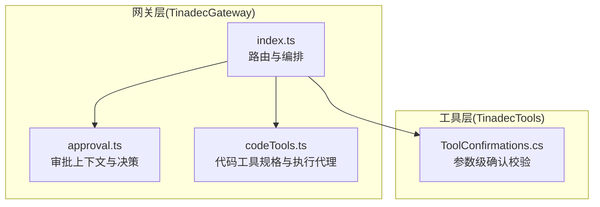
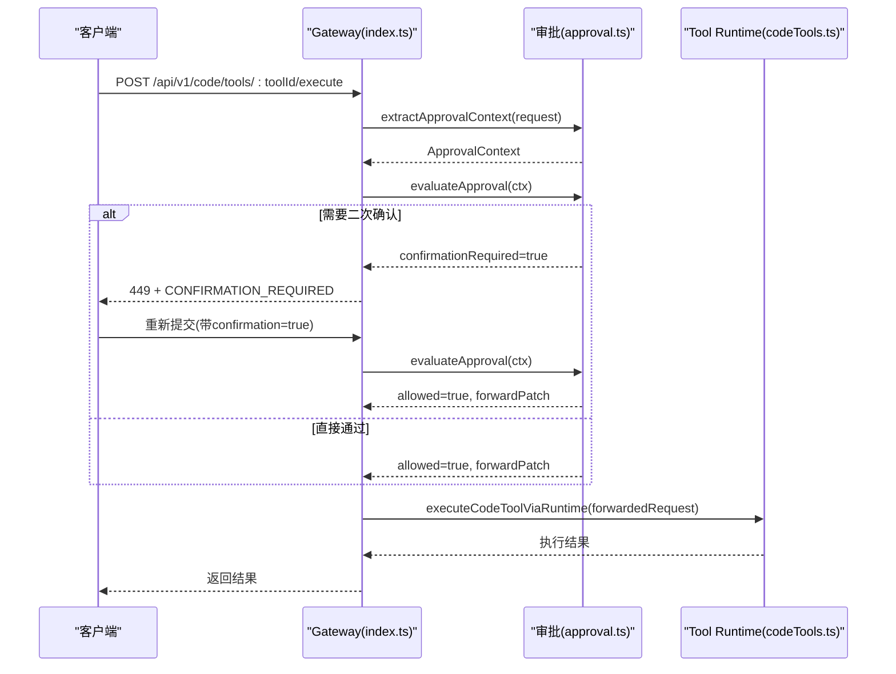
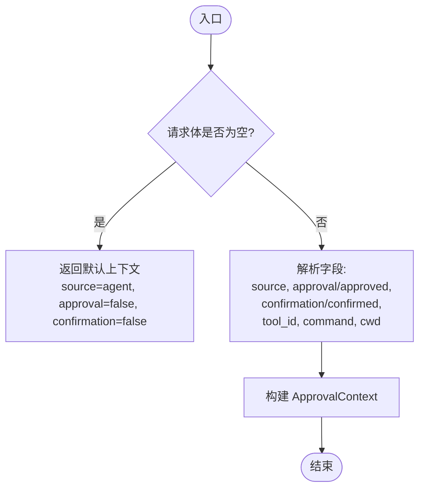
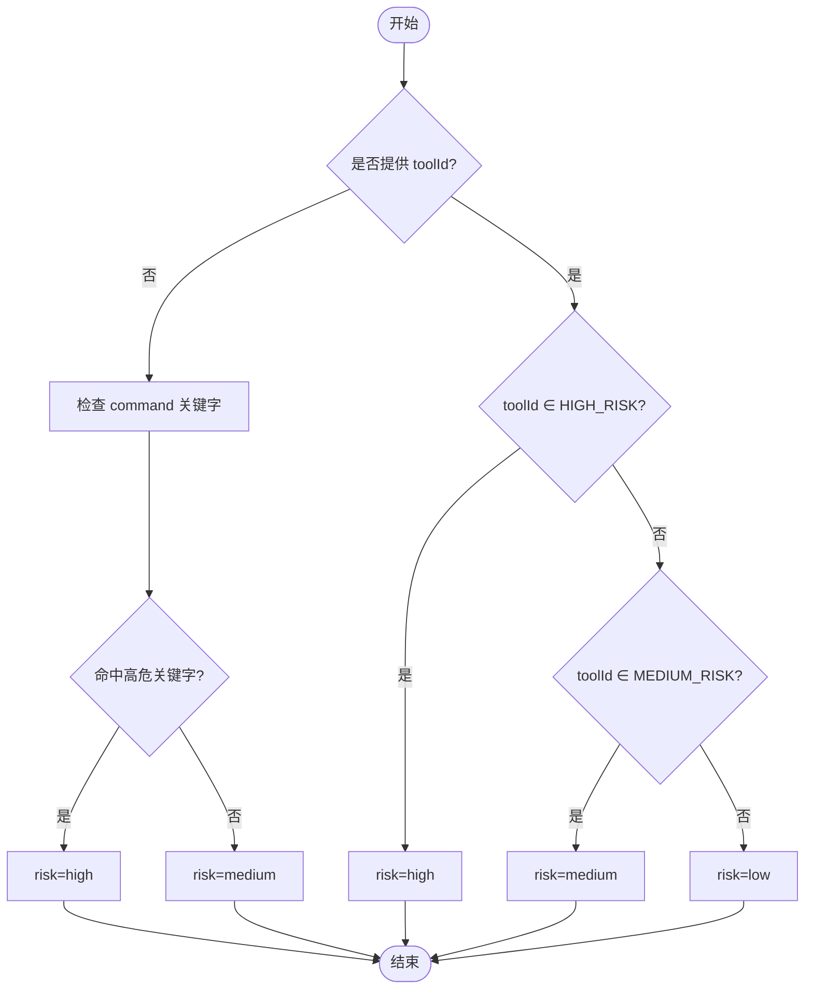
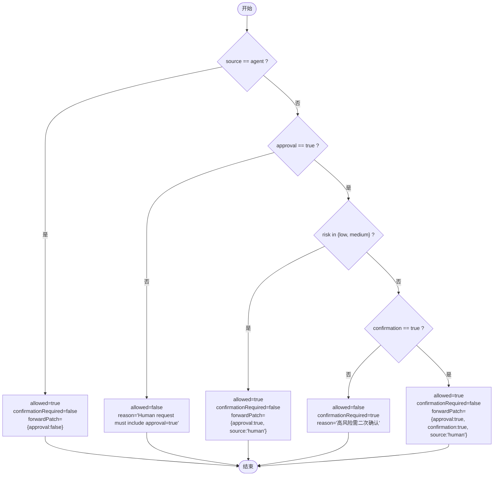
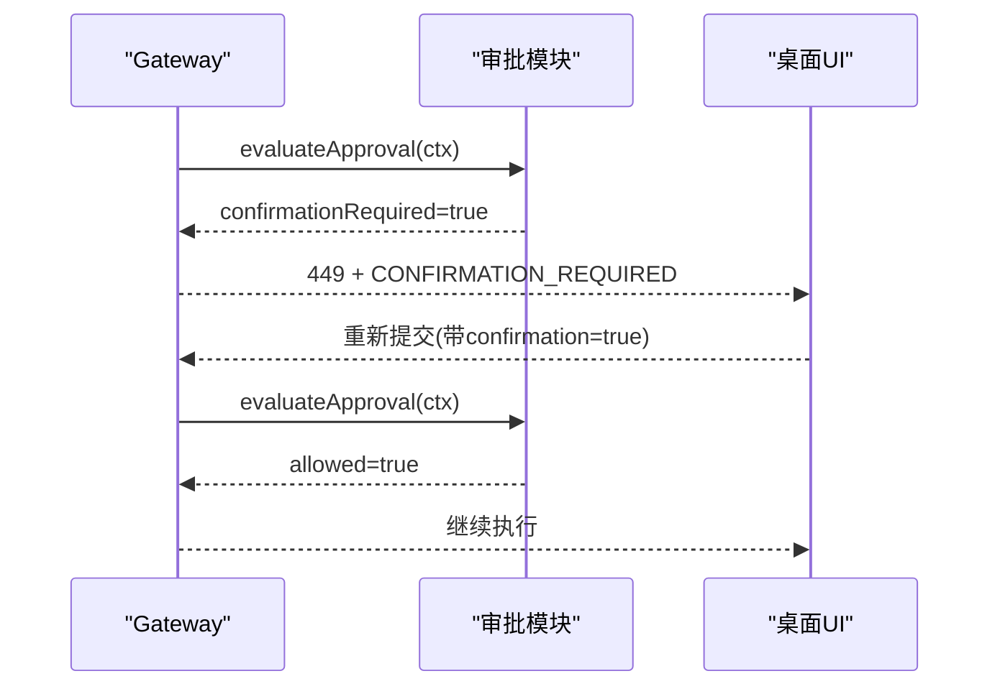
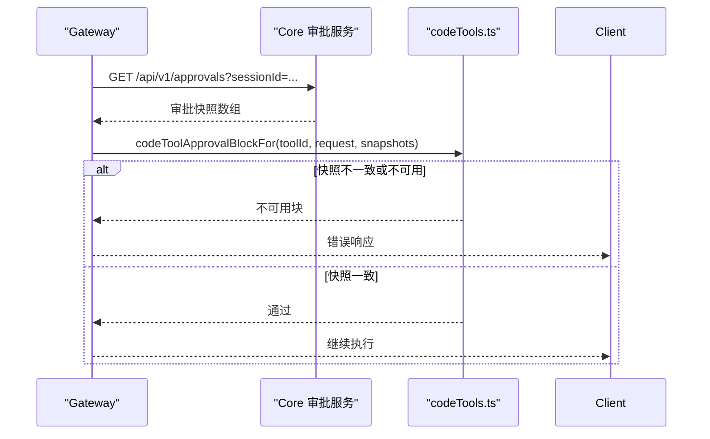
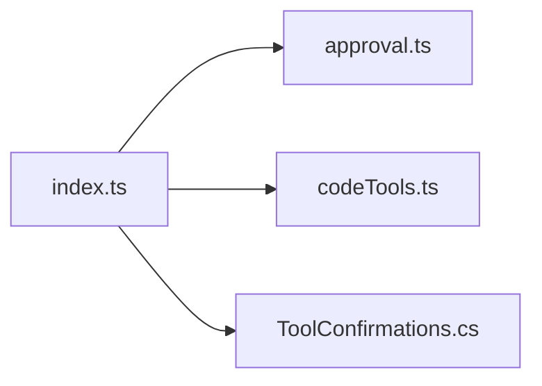

# 审批门控系统

<cite>
**本文引用的文件**   
- [approval.ts](file://TinadecGateway/src/approval.ts)
- [index.ts](file://TinadecGateway/src/index.ts)
- [codeTools.ts](file://TinadecGateway/src/codeTools.ts)
- [ToolConfirmations.cs](file://TinadecTools/Tools/ToolConfirmations.cs)
- [ToolConfirmationsTests.cs](file://tests/TinadecTools.Tests/ToolConfirmationsTests.cs)
</cite>

## 目录
1. [简介](#简介)
2. [项目结构](#项目结构)
3. [核心组件](#核心组件)
4. [架构总览](#架构总览)
5. [详细组件分析](#详细组件分析)
6. [依赖关系分析](#依赖关系分析)
7. [性能考虑](#性能考虑)
8. [故障排查指南](#故障排查指南)
9. [结论](#结论)
10. [附录](#附录)

## 简介
本文件面向“审批门控系统”的设计与实现，聚焦以下目标：
- 审批上下文提取：从请求体中抽取来源、人类操作标记、二次确认标记及工具/命令上下文。
- 风险评估算法：基于工具 ID 与命令文本判定风险等级（低/中/高）。
- 决策引擎实现：依据来源与风险等级决定放行、拒绝或要求二次确认，并生成透传补丁。
- 高风险操作的二次确认机制：通过特定状态码与响应体驱动桌面端弹窗确认。
- 审批状态管理与决策缓存策略：结合 Core 的审批接口进行快照校验与一致性保障。
- 审批规则配置与扩展：通过工具白名单与代码工具规格声明进行可配置化。
- 审批历史追踪：借助事件流与调试接口记录审批与执行轨迹。
- 工作流设计模式与集成指南：提供 Gateway 到 Tool Runtime 的端到端流程与对接要点。

## 项目结构
审批门控相关能力主要分布在 Gateway 层与 Tools 层：
- Gateway 层负责 HTTP 路由、鉴权、协议转换、审批拦截与转发。
- Tools 层在工具执行前进行参数级确认校验，作为二次确认的最后一道防线。

图表来源 
- [index.ts:350-400](file://TinadecGateway/src/index.ts#L350-L400)
- [approval.ts:91-197](file://TinadecGateway/src/approval.ts#L91-L197)
- [codeTools.ts:306-306](file://TinadecGateway/src/codeTools.ts#LL306-L306)
- [ToolConfirmations.cs:1-12](file://TinadecTools/Tools/ToolConfirmations.cs#L1-L12)

章节来源
- [index.ts:350-400](file://TinadecGateway/src/index.ts#L350-L400)
- [approval.ts:1-235](file://TinadecGateway/src/approval.ts#L1-L235)
- [codeTools.ts:306-306](file://TinadecGateway/src/codeTools.ts#L306-L306)
- [ToolConfirmations.cs:1-12](file://TinadecTools/Tools/ToolConfirmations.cs#L1-L12)

## 核心组件
- 审批上下文提取器：从请求体解析来源、人类操作标记、二次确认标记、工具 ID、命令与工作目录等。
- 风险评估器：根据工具 ID 与命令文本匹配规则集，输出风险等级。
- 决策引擎：综合来源与风险等级，输出允许/拒绝/需二次确认，并生成透传到下游的补丁。
- 二次确认响应构建：返回特定状态码与结构化数据，驱动 UI 弹窗。
- 工具参数确认：在工具执行前强制校验 confirm_* 字段，缺失则抛出异常阻断执行。

章节来源
- [approval.ts:91-197](file://TinadecGateway/src/approval.ts#L91-L197)
- [approval.ts:203-224](file://TinadecGateway/src/approval.ts#L203-L224)
- [ToolConfirmations.cs:1-12](file://TinadecTools/Tools/ToolConfirmations.cs#L1-L12)

## 架构总览
下图展示了“代码工具执行”的审批门控流程：Gateway 路由接收请求 → 审批上下文提取 → 风险评估 → 决策引擎 → 二次确认（如需）→ 合并补丁 → 代理至 Tool Runtime 执行。

图表来源 
- [index.ts:350-400](file://TinadecGateway/src/index.ts#L350-L400)
- [approval.ts:91-197](file://TinadecGateway/src/approval.ts#L91-L197)
- [approval.ts:203-224](file://TinadecGateway/src/approval.ts#L203-L224)
- [codeTools.ts:306-306](file://TinadecGateway/src/codeTools.ts#L306-L306)

## 详细组件分析

### 审批上下文提取
- 输入：HTTP 请求体（可能为空）。
- 处理：识别 source（human/agent）、approval/approved、confirmation/confirmed，以及 tool_id、command、cwd。
- 输出：ApprovalContext，供后续评估使用。

图表来源 
- [approval.ts:91-110](file://TinadecGateway/src/approval.ts#L91-L110)

章节来源
- [approval.ts:91-110](file://TinadecGateway/src/approval.ts#L91-L110)

### 风险评估算法
- 输入：toolId 与可选 command。
- 规则：
  - 无 toolId 时检查 command 关键字（如 rm -rf、format、del /f、git push/commit/merge 等），命中则高风险；否则中等风险。
  - 有 toolId 时按集合判定：HIGH_RISK_TOOL_IDS → 高风险；MEDIUM_RISK_TOOL_IDS → 中风险；其余低风险。
- 输出：RiskLevel（low/medium/high）。

图表来源 
- [approval.ts:115-133](file://TinadecGateway/src/approval.ts#L115-L133)

章节来源
- [approval.ts:115-133](file://TinadecGateway/src/approval.ts#L115-L133)

### 决策引擎
- 输入：ApprovalContext。
- 规则：
  - Agent 请求：不拦截，允许通过，附带 approval=false 补丁。
  - 人类请求但缺少 approval=true：拒绝。
  - 人类低/中风险：直接通过，附带 approval=true、source=human 补丁。
  - 人类高风险且未确认：需二次确认（返回 confirmationRequired=true）。
  - 人类高风险且已确认：允许通过，附带 approval=true、confirmation=true、source=human 补丁。
- 输出：ApprovalResult（allowed、confirmationRequired、riskLevel、reason、forwardPatch）。

图表来源 
- [approval.ts:145-197](file://TinadecGateway/src/approval.ts#L145-L197)

章节来源
- [approval.ts:145-197](file://TinadecGateway/src/approval.ts#L145-L197)

### 二次确认机制
- 触发条件：人类高风险操作且未携带 confirmation=true。
- 响应格式：状态码 449，包含 code、message、risk_level、tool_id、command、cwd 与 warning 信息。
- 交互流程：桌面端收到 449 后弹出警告，用户确认后以 confirmation=true 重发请求。

图表来源 
- [approval.ts:203-224](file://TinadecGateway/src/approval.ts#L203-L224)
- [index.ts:370-384](file://TinadecGateway/src/index.ts#L370-L384)

章节来源
- [approval.ts:203-224](file://TinadecGateway/src/approval.ts#L203-L224)
- [index.ts:370-384](file://TinadecGateway/src/index.ts#L370-L384)

### 审批状态管理与决策缓存策略
- 代码工具执行前，若 requiresApproval 为真且请求携带 approval_id，则调用 Core 的 /api/v1/approvals 获取快照，并通过 codeToolApprovalBlockFor 校验一致性。
- 当 Core 不可用时，返回“不可用”块，避免误执行。
- 该机制确保审批快照与执行上下文一致，防止过期决策被重用。

图表来源 
- [index.ts:89-105](file://TinadecGateway/src/index.ts#L89-L105)
- [codeTools.ts:306-306](file://TinadecGateway/src/codeTools.ts#L306-L306)

章节来源
- [index.ts:89-105](file://TinadecGateway/src/index.ts#L89-L105)
- [codeTools.ts:306-306](file://TinadecGateway/src/codeTools.ts#L306-L306)

### 审批规则配置与自定义扩展
- 高风险/中风险工具集合：在 approval.ts 中以 Set 维护，便于集中管理。
- 代码工具规格：codeTools.ts 中声明 requiresApproval 与 approvalSummary，用于前端展示与后端控制。
- 扩展建议：新增工具时更新集合与规格声明；对命令级规则可通过命令关键字扩展 assessRisk。

章节来源
- [approval.ts:54-86](file://TinadecGateway/src/approval.ts#L54-L86)
- [codeTools.ts:306-306](file://TinadecGateway/src/codeTools.ts#L306-L306)

### 工具参数级确认（二次确认兜底）
- ToolConfirmations.Require 强制要求 confirm_* 字段非空，缺失则抛出异常，阻止工具执行。
- 测试覆盖 null、空白字符串、空字符串等边界情况。

章节来源
- [ToolConfirmations.cs:1-12](file://TinadecTools/Tools/ToolConfirmations.cs#L1-L12)
- [ToolConfirmationsTests.cs:1-20](file://tests/TinadecTools.Tests/ToolConfirmationsTests.cs#L1-L20)

## 依赖关系分析
- index.ts 引入 approval.ts 的上下文提取、评估、响应构建与补丁合并函数。
- index.ts 在代码工具执行路径中调用 codeTools.ts 的规格查询与执行代理。
- ToolConfirmations.cs 被各 mutating 工具调用，作为最终安全护栏。

图表来源 
- [index.ts:34-48](file://TinadecGateway/src/index.ts#L34-L48)
- [index.ts:350-400](file://TinadecGateway/src/index.ts#L350-L400)
- [ToolConfirmations.cs:1-12](file://TinadecTools/Tools/ToolConfirmations.cs#L1-L12)

章节来源
- [index.ts:34-48](file://TinadecGateway/src/index.ts#L34-L48)
- [index.ts:350-400](file://TinadecGateway/src/index.ts#L350-L400)
- [ToolConfirmations.cs:1-12](file://TinadecTools/Tools/ToolConfirmations.cs#L1-L12)

## 性能考虑
- 审批评估为纯内存计算，复杂度 O(1)，开销极低。
- 二次确认仅在高风险场景触发，减少 UI 交互成本。
- 审批快照拉取为远程调用，应结合会话维度缓存以减少重复请求。
- 建议在高频工具执行路径增加本地决策缓存（按 toolId+command 哈希），并设置合理 TTL。

## 故障排查指南
- 常见问题：
  - 人类请求缺少 approval=true：会被拒绝，检查上游是否注入人类操作标记。
  - 高风险操作未确认：返回 449，检查桌面端是否正确提示并回传 confirmation=true。
  - 代码工具审批快照不可用：检查 Core 审批服务连通性与权限。
  - 工具参数缺失 confirm_*：工具执行抛异常，检查调用方是否传递确认字段。
- 定位方法：
  - 查看 Gateway 日志中的 APPROVAL_DENIED 与 CONFIRMATION_REQUIRED 响应。
  - 通过调试接口 /api/v1/debug/simulate/approval-decision 模拟审批决策。
  - 使用 /api/v1/events 与 /api/v1/debug/traces 跟踪审批与执行链路。

章节来源
- [index.ts:370-384](file://TinadecGateway/src/index.ts#L370-L384)
- [index.ts:796-800](file://TinadecGateway/src/index.ts#L796-L800)

## 结论
本审批门控系统通过“上下文提取—风险评估—决策引擎—二次确认—参数级校验”的多层防护，确保人类操作的高风险变更得到充分确认，同时保持 Agent 自动化流程的顺畅。配合 Core 审批快照校验与事件追踪，形成闭环的可审计、可扩展的安全执行体系。

## 附录
- 集成要点：
  - 在 Desktop 发起的人类操作中注入 approval=true。
  - 高风险操作由 UI 引导用户确认，回传 confirmation=true。
  - 代码工具执行前校验 approval_id 与快照一致性。
- 扩展建议：
  - 新增高风险工具时更新 HIGH_RISK_TOOL_IDS 与 codeTools.ts 规格。
  - 对命令级风险扩展 assessRisk 的关键字匹配。
  - 引入更细粒度的租户/用户维度的审批策略。