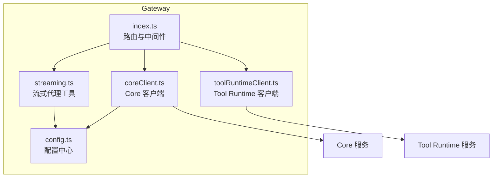
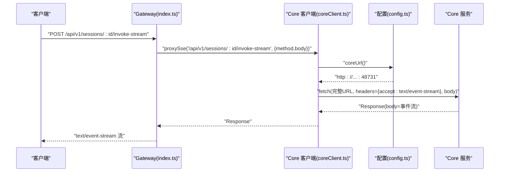
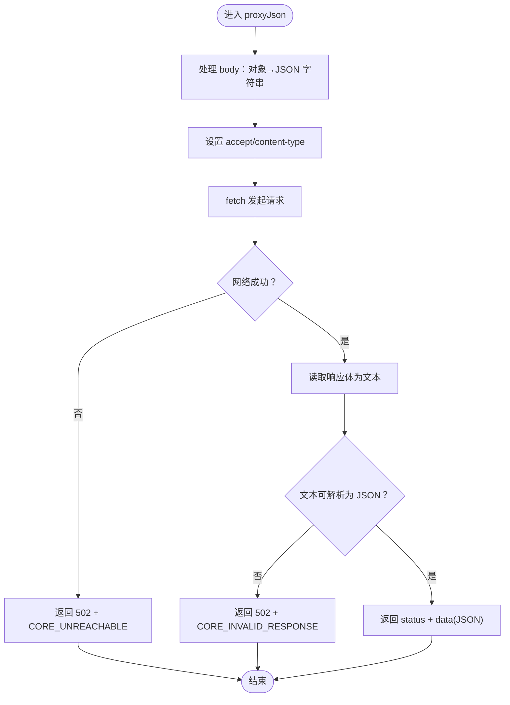
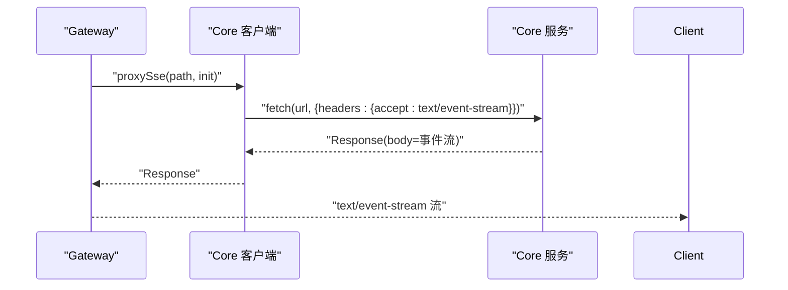
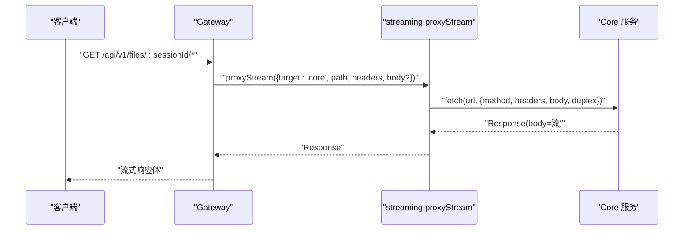
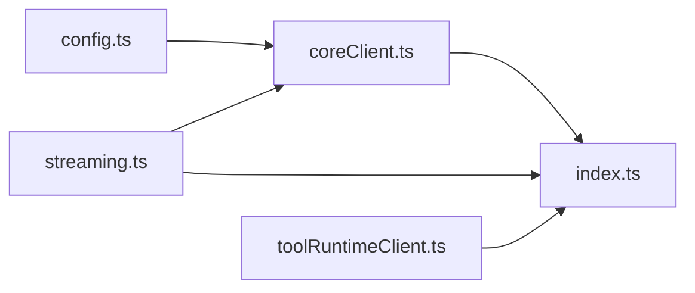

# Core 客户端代理

<cite>
**本文引用的文件**   
- [coreClient.ts](file://TinadecGateway/src/coreClient.ts)
- [config.ts](file://TinadecGateway/src/config.ts)
- [streaming.ts](file://TinadecGateway/src/streaming.ts)
- [index.ts](file://TinadecGateway/src/index.ts)
- [toolRuntimeClient.ts](file://TinadecGateway/src/toolRuntimeClient.ts)
</cite>

## 目录
1. [简介](#简介)
2. [项目结构](#项目结构)
3. [核心组件](#核心组件)
4. [架构总览](#架构总览)
5. [详细组件分析](#详细组件分析)
6. [依赖关系分析](#依赖关系分析)
7. [性能与超时配置](#性能与超时配置)
8. [故障排查指南](#故障排查指南)
9. [结论](#结论)
10. [附录：使用示例与最佳实践](#附录使用示例与最佳实践)

## 简介
本文件面向 Core 客户端代理，系统性说明 Gateway 到 Core 的 HTTP/SSE/流式 HTTP 代理实现。重点覆盖：
- JSON 请求代理（proxyJson）
- SSE 流式代理（proxySse）
- 流式 HTTP 代理（proxyStream）
- 连接配置与端点构造（coreUrl、coreEndpoint）
- 错误处理与响应解析机制
- 超时设置、错误恢复策略与性能优化建议
- 具体使用示例与最佳实践

## 项目结构
Core 客户端代理位于 TinadecGateway 的 src 目录下，核心文件包括：
- coreClient.ts：Core 客户端封装，提供 URL 构建与三类代理方法
- config.ts：运行时配置加载，包含 Core URL、超时等
- streaming.ts：通用流式 HTTP 代理与响应头设置
- index.ts：网关路由层，调用 Core/Tool Runtime 客户端进行转发
- toolRuntimeClient.ts：Tool Runtime 客户端（用于对比与扩展）

图表来源
- [index.ts:1-120](file://TinadecGateway/src/index.ts#L1-L120)
- [coreClient.ts:1-110](file://TinadecGateway/src/coreClient.ts#L1-L110)
- [streaming.ts:1-54](file://TinadecGateway/src/streaming.ts#L1-L54)
- [toolRuntimeClient.ts:1-126](file://TinadecGateway/src/toolRuntimeClient.ts#L1-L126)
- [config.ts:1-115](file://TinadecGateway/src/config.ts#L1-L115)

章节来源
- [coreClient.ts:1-110](file://TinadecGateway/src/coreClient.ts#L1-L110)
- [config.ts:1-115](file://TinadecGateway/src/config.ts#L1-L115)
- [streaming.ts:1-54](file://TinadecGateway/src/streaming.ts#L1-L54)
- [index.ts:1-953](file://TinadecGateway/src/index.ts#L1-L953)
- [toolRuntimeClient.ts:1-126](file://TinadecGateway/src/toolRuntimeClient.ts#L1-L126)

## 核心组件
- coreUrl()：从配置读取 Core 基础 URL，供端点拼接使用
- coreEndpoint(path)：基于 base URL 拼接完整端点 URL
- proxyJson(path, options)：JSON 请求代理，自动序列化 body、设置 accept/content-type，并解析返回 JSON；网络异常或非法响应返回 502
- proxySse(path, init)：SSE 请求代理，设置 accept=text/event-stream，返回原始 Response 以便上层透传 body
- proxyStream(path, init)：流式 HTTP 代理，直接透传 body 流，适用于大文件与日志

章节来源
- [coreClient.ts:22-110](file://TinadecGateway/src/coreClient.ts#L22-L110)

## 架构总览
Gateway 作为薄代理层，将 HTTP/JSON、SSE、WebSocket、流式 HTTP 统一转发至 Core 或 Tool Runtime。Core 客户端负责与 Core 通信，Streaming 模块负责通用流式转发。

图表来源
- [index.ts:231-243](file://TinadecGateway/src/index.ts#L231-L243)
- [coreClient.ts:93-101](file://TinadecGateway/src/coreClient.ts#L93-L101)
- [config.ts:23-30](file://TinadecGateway/src/config.ts#L23-L30)

章节来源
- [index.ts:231-243](file://TinadecGateway/src/index.ts#L231-L243)
- [coreClient.ts:93-101](file://TinadecGateway/src/coreClient.ts#L93-L101)
- [config.ts:23-30](file://TinadecGateway/src/config.ts#L23-L30)

## 详细组件分析

### coreUrl() 与 coreEndpoint()
- coreUrl()：从配置单例中获取 Core 基础 URL，默认来自环境变量 TINADEC_CORE_URL
- coreEndpoint(path)：使用 new URL(path, base) 拼接绝对路径，避免相对路径歧义

用途
- 所有 Core 客户端方法均通过 coreEndpoint 生成目标 URL，保证一致性

章节来源
- [coreClient.ts:22-30](file://TinadecGateway/src/coreClient.ts#L22-L30)
- [config.ts:65-115](file://TinadecGateway/src/config.ts#L65-L115)

### proxyJson() 请求处理逻辑、错误处理与响应解析
流程要点
- 参数处理：body 可为对象、字符串或未定义；对象会被 JSON.stringify
- 请求头：默认 accept=application/json；当存在 body 时设置 content-type=application/json
- 网络异常捕获：catch 分支返回 502，code=CORE_UNREACHABLE，message 包含 Core URL 与错误信息
- 响应解析：先读取 text，再尝试 JSON.parse；非 JSON 返回 502，code=CORE_INVALID_RESPONSE，message 截断前 200 字符

复杂度与性能
- 时间复杂度 O(n)（n 为响应体长度），空间复杂度 O(n)（需缓冲文本后解析）
- 适合中小体量 JSON 响应；超大响应建议使用流式接口

图表来源
- [coreClient.ts:38-87](file://TinadecGateway/src/coreClient.ts#L38-L87)

章节来源
- [coreClient.ts:38-87](file://TinadecGateway/src/coreClient.ts#L38-L87)

### proxySse() SSE 流式代理
- 设置 accept=text/event-stream
- 返回原始 Response，由上层路由设置响应头并透传 body
- 典型用法：/api/v1/sessions/:sessionId/invoke-stream 与 /api/v1/events

图表来源
- [coreClient.ts:93-101](file://TinadecGateway/src/coreClient.ts#L93-L101)
- [index.ts:231-243](file://TinadecGateway/src/index.ts#L231-L243)
- [index.ts:278-286](file://TinadecGateway/src/index.ts#L278-L286)

章节来源
- [coreClient.ts:93-101](file://TinadecGateway/src/coreClient.ts#L93-L101)
- [index.ts:231-243](file://TinadecGateway/src/index.ts#L231-L243)
- [index.ts:278-286](file://TinadecGateway/src/index.ts#L278-L286)

### proxyStream() 流式 HTTP 代理
- 直接透传 RequestInit，支持 duplex 半双工以发送流式请求体
- 常用于大文件上传/下载与实时日志流
- 配合 setStreamHeaders 设置合适的响应头（no-cache、keep-alive、x-accel-buffering=no）

图表来源
- [streaming.ts:25-37](file://TinadecGateway/src/streaming.ts#L25-L37)
- [index.ts:874-904](file://TinadecGateway/src/index.ts#L874-L904)

章节来源
- [streaming.ts:25-37](file://TinadecGateway/src/streaming.ts#L25-L37)
- [index.ts:874-904](file://TinadecGateway/src/index.ts#L874-L904)

### 连接配置与超时设置
- 配置来源：config.ts 的 loadConfig() 读取环境变量
- Core URL：TINADEC_CORE_URL，默认 http://127.0.0.1:48731
- 全局超时：TINADEC_GATEWAY_TIMEOUT_MS，默认 120_000 ms
- 部署模式：local/cloud，影响监听地址、认证、CORS、信任反向代理头等

注意
- 当前 fetch 未显式设置 timeout，超时控制依赖运行环境或上游代理；如需细粒度控制，可在调用处传入 signal（AbortController）

章节来源
- [config.ts:65-115](file://TinadecGateway/src/config.ts#L65-L115)

### 错误恢复策略
- 网络不可达：返回 502，code=CORE_UNREACHABLE
- 非 JSON 响应：返回 502，code=CORE_INVALID_RESPONSE
- 上层路由对 502 的处理：健康检查等接口会透传状态码与数据；业务接口应结合重试/降级策略

建议
- 在调用层实现指数退避重试（限次、限频）
- 对关键接口增加熔断与短路保护
- 对 SSE/流式场景增加断线重连与心跳检测

章节来源
- [coreClient.ts:56-87](file://TinadecGateway/src/coreClient.ts#L56-L87)

### 性能优化建议
- 小响应：优先使用 proxyJson，减少前端解析开销
- 大响应/长时任务：使用 proxySse 或 proxyStream，避免全量缓冲
- 头部最小化：仅传递必要 header，避免冗余
- 连接复用：保持 keep-alive，减少握手开销
- 缓存控制：对静态资源启用缓存，对动态流禁用缓存（no-cache）

[本节为通用指导，不直接分析具体文件]

## 依赖关系分析
- coreClient.ts 依赖 config.ts 获取 coreUrl
- streaming.ts 依赖 coreClient.ts 的 coreEndpoint
- index.ts 组合 coreClient.ts 与 streaming.ts 完成路由转发
- toolRuntimeClient.ts 与 coreClient.ts 结构对称，便于统一扩展

图表来源
- [coreClient.ts:22-30](file://TinadecGateway/src/coreClient.ts#L22-L30)
- [streaming.ts:8-9](file://TinadecGateway/src/streaming.ts#L8-L9)
- [index.ts:24-51](file://TinadecGateway/src/index.ts#L24-L51)
- [toolRuntimeClient.ts:28-36](file://TinadecGateway/src/toolRuntimeClient.ts#L28-L36)

章节来源
- [coreClient.ts:22-30](file://TinadecGateway/src/coreClient.ts#L22-L30)
- [streaming.ts:8-9](file://TinadecGateway/src/streaming.ts#L8-L9)
- [index.ts:24-51](file://TinadecGateway/src/index.ts#L24-L51)
- [toolRuntimeClient.ts:28-36](file://TinadecGateway/src/toolRuntimeClient.ts#L28-L36)

## 性能与超时配置
- 超时：通过环境变量 TINADEC_GATEWAY_TIMEOUT_MS 控制，默认 120 秒
- 连接：keep-alive 与 no-cache 的组合确保长连接与实时性
- 流式：避免内存峰值，降低 GC 压力
- 并发：在高并发下建议在上游负载均衡器做限流与队列

章节来源
- [config.ts:103-105](file://TinadecGateway/src/config.ts#L103-L105)
- [streaming.ts:42-53](file://TinadecGateway/src/streaming.ts#L42-L53)

## 故障排查指南
常见问题与定位
- 无法连接 Core：检查 TINADEC_CORE_URL 是否正确、网络可达性与防火墙规则
- 响应非 JSON：确认 Core 返回内容类型与编码，必要时查看原始文本
- 流式中断：检查服务端是否主动关闭、代理层是否缓冲、客户端是否及时消费
- 超时：调整 TINADEC_GATEWAY_TIMEOUT_MS 或在调用方使用 AbortController

排查步骤
- 查看健康检查接口返回，确认 Core 可用性
- 使用 curl/wget 验证端到端连通性
- 在 Gateway 日志中检索 502 错误码与消息
- 对 SSE/流式接口抓包，观察事件流与传输大小

章节来源
- [coreClient.ts:56-87](file://TinadecGateway/src/coreClient.ts#L56-L87)
- [index.ts:157-178](file://TinadecGateway/src/index.ts#L157-L178)

## 结论
Core 客户端代理以简洁、稳定的方式实现了 JSON、SSE 与流式 HTTP 的统一代理能力。通过 coreUrl/coreEndpoint 集中管理端点，通过 proxyJson/proxySse/proxyStream 覆盖常见场景，配合配置与错误处理形成完整的网关代理方案。建议在调用层补充重试、熔断与监控，进一步提升稳定性与可观测性。

[本节为总结，不直接分析具体文件]

## 附录：使用示例与最佳实践

- 获取 Core 基础 URL
  - 使用 coreUrl() 获取配置中的 Core 地址
  - 参考路径：[coreClient.ts:22-25](file://TinadecGateway/src/coreClient.ts#L22-L25)

- 构建完整端点
  - 使用 coreEndpoint(path) 拼接绝对路径
  - 参考路径：[coreClient.ts:27-30](file://TinadecGateway/src/coreClient.ts#L27-L30)

- 代理 JSON 请求
  - 调用 proxyJson(path, { method, body, headers })
  - 自动处理序列化与解析，异常返回 502
  - 参考路径：[coreClient.ts:38-87](file://TinadecGateway/src/coreClient.ts#L38-L87)

- 代理 SSE 流
  - 调用 proxySse(path, { method, headers, body })
  - 上层设置 content-type=text/event-stream 并透传 body
  - 参考路径：[coreClient.ts:93-101](file://TinadecGateway/src/coreClient.ts#L93-L101)、[index.ts:231-243](file://TinadecGateway/src/index.ts#L231-L243)

- 代理流式 HTTP
  - 调用 streaming.proxyStream({ target:'core', path, headers, body? })
  - 使用 setStreamHeaders 设置响应头
  - 参考路径：[streaming.ts:25-37](file://TinadecGateway/src/streaming.ts#L25-L37)、[streaming.ts:42-53](file://TinadecGateway/src/streaming.ts#L42-L53)、[index.ts:874-904](file://TinadecGateway/src/index.ts#L874-L904)

- 配置与超时
  - 通过环境变量配置 Core URL 与超时
  - 参考路径：[config.ts:65-115](file://TinadecGateway/src/config.ts#L65-L115)

- 最佳实践
  - 小响应用 JSON，大响应/长任务用 SSE/流式
  - 合理设置超时与重试策略
  - 对关键接口增加监控与告警
  - 谨慎透传敏感头，遵循最小权限原则

[本节为使用指导，不直接分析具体文件]