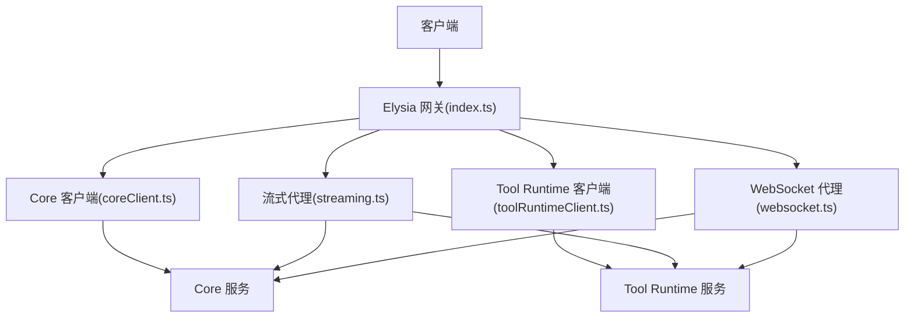
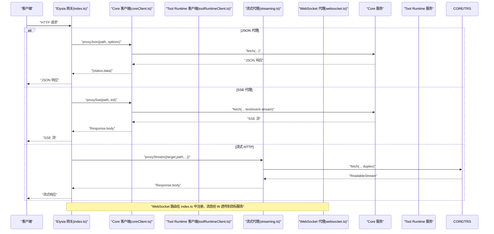
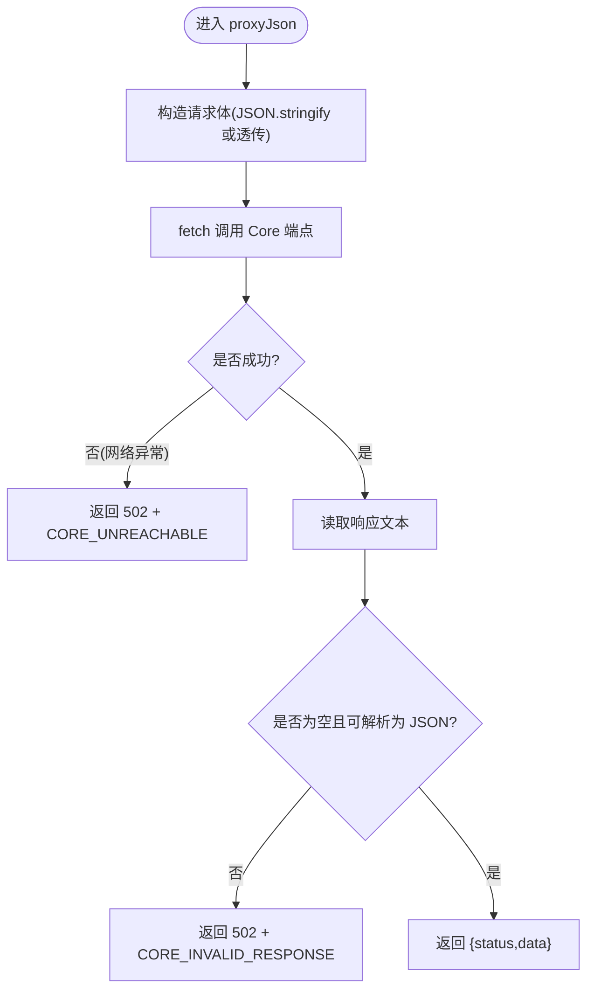
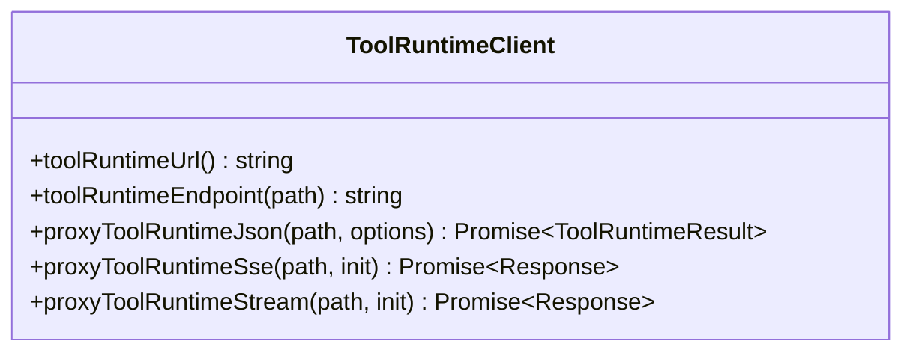
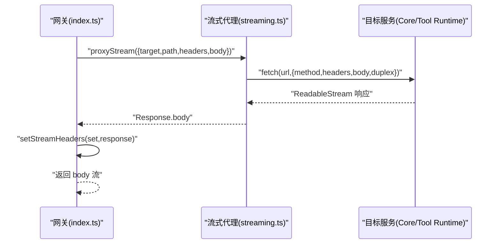
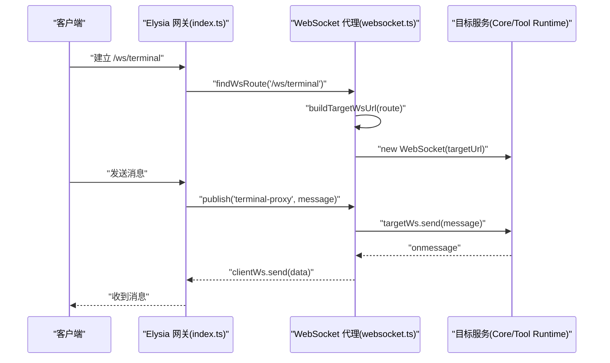
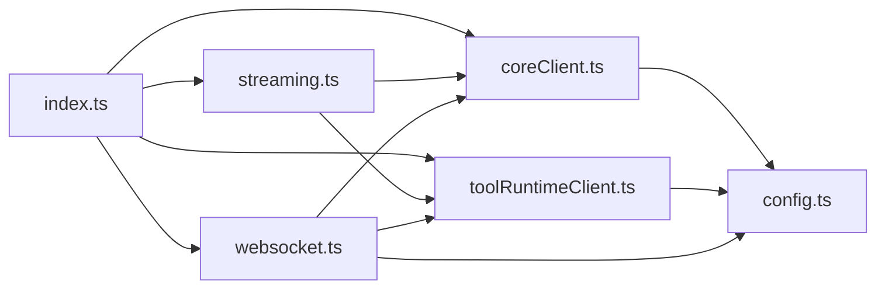

# 客户端代理

<cite>
**本文引用的文件**   
- [coreClient.ts](file://TinadecGateway/src/coreClient.ts)
- [toolRuntimeClient.ts](file://TinadecGateway/src/toolRuntimeClient.ts)
- [streaming.ts](file://TinadecGateway/src/streaming.ts)
- [websocket.ts](file://TinadecGateway/src/websocket.ts)
- [config.ts](file://TinadecGateway/src/config.ts)
- [index.ts](file://TinadecGateway/src/index.ts)
</cite>

## 目录
1. [简介](#简介)
2. [项目结构](#项目结构)
3. [核心组件](#核心组件)
4. [架构总览](#架构总览)
5. [详细组件分析](#详细组件分析)
6. [依赖关系分析](#依赖关系分析)
7. [性能与配置优化](#性能与配置优化)
8. [故障排查指南](#故障排查指南)
9. [结论](#结论)

## 简介
本文件聚焦于 Gateway 的“客户端代理模块”，即 Gateway 作为 HTTP/SSE/WebSocket/流式 HTTP 的统一入口，将请求转发到 Core 服务与 Tool Runtime 服务，并对响应进行必要的转换与透传。该模块涵盖：
- Core 与 Tool Runtime 的 HTTP 客户端实现（JSON、SSE、流式）
- 请求转发机制与响应转换逻辑
- WebSocket 反向代理（终端、调试、协作）
- 连接池、超时、重试与错误恢复策略的现状与建议
- 代理配置与性能调优指南

## 项目结构
Gateway 使用 Elysia 框架提供路由与中间件，核心代理能力由以下模块组成：
- coreClient.ts：Core 服务的 JSON/SSE/流式代理
- toolRuntimeClient.ts：Tool Runtime 服务的 JSON/SSE/流式代理
- streaming.ts：通用流式代理与响应头设置
- websocket.ts：WebSocket 路由与消息透传
- config.ts：运行期配置加载与环境变量
- index.ts：路由注册、认证、CORS、健康检查、SSE/WS/流式端点编排

图表来源
- [index.ts:107-953](file://TinadecGateway/src/index.ts#L107-L953)
- [coreClient.ts:1-110](file://TinadecGateway/src/coreClient.ts#L1-L110)
- [toolRuntimeClient.ts:1-126](file://TinadecGateway/src/toolRuntimeClient.ts#L1-L126)
- [streaming.ts:1-54](file://TinadecGateway/src/streaming.ts#L1-L54)
- [websocket.ts:1-140](file://TinadecGateway/src/websocket.ts#L1-L140)

章节来源
- [index.ts:1-953](file://TinadecGateway/src/index.ts#L1-L953)
- [config.ts:1-115](file://TinadecGateway/src/config.ts#L1-L115)

## 核心组件
- Core 客户端（coreClient.ts）
  - 提供 coreUrl() 与 coreEndpoint(path) 构建目标 URL
  - proxyJson(path, options)：JSON 请求代理，统一返回 { status, data }
  - proxySse(path, init)：SSE 请求代理，返回原始 Response
  - proxyStream(path, init)：流式 HTTP 代理，用于大文件/日志
- Tool Runtime 客户端（toolRuntimeClient.ts）
  - 提供 toolRuntimeUrl() 与 toolRuntimeEndpoint(path)
  - proxyToolRuntimeJson(path, options)：JSON 代理，返回 { status, data }
  - proxyToolRuntimeSse(path, init)：SSE 代理
  - proxyToolRuntimeStream(path, init)：流式 HTTP 代理
- 流式代理（streaming.ts）
  - proxyStream(options)：根据 target(core/tool_runtime) 选择目标并发起 fetch
  - setStreamHeaders(set, sourceResponse)：设置合适的流式响应头
- WebSocket 代理（websocket.ts）
  - buildTargetWsUrl(config, query)：构建 ws/wss 目标地址
  - WS_ROUTES：定义 /ws/terminal、/ws/debug、/ws/collaboration 的路由映射
  - createWsProxyHandlers(targetUrl)：创建双向透传的消息处理器
- 配置（config.ts）
  - loadConfig()/getConfig()：从环境变量加载部署模式、端口、主机名、Core/Tool Runtime URL、认证、CORS、超时等
  - requestTimeoutMs：全局请求超时配置项

章节来源
- [coreClient.ts:1-110](file://TinadecGateway/src/coreClient.ts#L1-L110)
- [toolRuntimeClient.ts:1-126](file://TinadecGateway/src/toolRuntimeClient.ts#L1-L126)
- [streaming.ts:1-54](file://TinadecGateway/src/streaming.ts#L1-L54)
- [websocket.ts:1-140](file://TinadecGateway/src/websocket.ts#L1-L140)
- [config.ts:1-115](file://TinadecGateway/src/config.ts#L1-L115)

## 架构总览
Gateway 通过 Elysia 暴露统一的 API 层，所有对 Core 和 Tool Runtime 的请求均经过对应的客户端模块进行转发。SSE 与流式传输保持低延迟与低内存占用；WebSocket 用于实时交互场景。

图表来源
- [index.ts:232-286](file://TinadecGateway/src/index.ts#L232-L286)
- [coreClient.ts:38-101](file://TinadecGateway/src/coreClient.ts#L38-L101)
- [toolRuntimeClient.ts:44-125](file://TinadecGateway/src/toolRuntimeClient.ts#L44-L125)
- [streaming.ts:25-37](file://TinadecGateway/src/streaming.ts#L25-L37)
- [websocket.ts:51-74](file://TinadecGateway/src/websocket.ts#L51-L74)

## 详细组件分析

### Core 客户端（coreClient.ts）
- 功能要点
  - coreUrl()/coreEndpoint(path)：基于配置生成目标 URL
  - proxyJson：封装 fetch，自动设置 accept/content-type，解析 JSON 或返回 502 错误体
  - proxySse/proxyStream：透传 Response 给调用方，便于流式处理
- 错误处理
  - 网络异常：返回 502，code=CORE_UNREACHABLE
  - 非 JSON 响应：返回 502，code=CORE_INVALID_RESPONSE
- 数据流
  - 入参：path + options(method/body/headers)
  - 出参：{ status, data } 或 Response

图表来源
- [coreClient.ts:38-87](file://TinadecGateway/src/coreClient.ts#L38-L87)

章节来源
- [coreClient.ts:1-110](file://TinadecGateway/src/coreClient.ts#L1-L110)

### Tool Runtime 客户端（toolRuntimeClient.ts）
- 功能要点
  - toolRuntimeUrl()/toolRuntimeEndpoint(path)：构建 Tool Runtime 目标 URL
  - proxyToolRuntimeJson：与 Core 客户端一致的 JSON 代理接口
  - proxyToolRuntimeSse/proxyToolRuntimeStream：SSE 与流式透传
- 错误处理
  - 网络异常：返回 502，code=TOOL_RUNTIME_UNREACHABLE
  - 非 JSON 响应：返回 502，code=TOOL_RUNTIME_INVALID_RESPONSE

图表来源
- [toolRuntimeClient.ts:28-125](file://TinadecGateway/src/toolRuntimeClient.ts#L28-L125)

章节来源
- [toolRuntimeClient.ts:1-126](file://TinadecGateway/src/toolRuntimeClient.ts#L1-L126)

### 流式代理（streaming.ts）
- 功能要点
  - proxyStream：根据 target 选择 Core 或 Tool Runtime 端点，支持 duplex 半双工流式请求体
  - setStreamHeaders：复制 content-type，设置 no-cache、keep-alive、x-accel-buffering=no 等头部
- 适用场景
  - 大文件上传/下载、实时日志流

图表来源
- [streaming.ts:25-53](file://TinadecGateway/src/streaming.ts#L25-L53)
- [index.ts:874-904](file://TinadecGateway/src/index.ts#L874-L904)

章节来源
- [streaming.ts:1-54](file://TinadecGateway/src/streaming.ts#L1-L54)
- [index.ts:874-904](file://TinadecGateway/src/index.ts#L874-L904)

### WebSocket 代理（websocket.ts）
- 功能要点
  - buildTargetWsUrl：将 http(s) 转换为 ws(s)，拼接路径与查询参数
  - WS_ROUTES：/ws/terminal→Tool Runtime，/ws/debug 与 /ws/collaboration→Core
  - createWsProxyHandlers：创建客户端与目标之间的双向消息透传处理器
- 路由与消息流
  - index.ts 中注册 /ws/* 路由，消息通过 publish/subscribe 透传到目标服务

图表来源
- [websocket.ts:35-74](file://TinadecGateway/src/websocket.ts#L35-L74)
- [index.ts:822-872](file://TinadecGateway/src/index.ts#L822-L872)

章节来源
- [websocket.ts:1-140](file://TinadecGateway/src/websocket.ts#L1-L140)
- [index.ts:822-872](file://TinadecGateway/src/index.ts#L822-L872)

### 配置与运行时（config.ts）
- 关键配置项
  - mode：local/cloud
  - port/hostname：监听端口与地址
  - coreUrl/toolRuntimeUrl：后端服务地址
  - auth：API Key/JWT 验证开关
  - corsExtraOrigins：额外允许的 CORS 来源
  - requestTimeoutMs：请求超时（毫秒）
  - trustProxy：是否信任反向代理头
- 单例 getConfig()：避免重复加载

章节来源
- [config.ts:1-115](file://TinadecGateway/src/config.ts#L1-L115)

## 依赖关系分析
- index.ts 依赖 coreClient.ts、toolRuntimeClient.ts、streaming.ts、websocket.ts、config.ts
- coreClient.ts 与 toolRuntimeClient.ts 均依赖 config.ts
- streaming.ts 依赖 coreClient.ts 与 toolRuntimeClient.ts 的 endpoint 函数
- websocket.ts 依赖 config.ts 与 coreClient.ts/toolRuntimeClient.ts 的 url 函数

图表来源
- [index.ts:23-57](file://TinadecGateway/src/index.ts#L23-L57)
- [coreClient.ts:7](file://TinadecGateway/src/coreClient.ts#L7)
- [toolRuntimeClient.ts:13](file://TinadecGateway/src/toolRuntimeClient.ts#L13)
- [streaming.ts:8-9](file://TinadecGateway/src/streaming.ts#L8-L9)
- [websocket.ts:15-17](file://TinadecGateway/src/websocket.ts#L15-L17)

章节来源
- [index.ts:1-953](file://TinadecGateway/src/index.ts#L1-L953)
- [coreClient.ts:1-110](file://TinadecGateway/src/coreClient.ts#L1-L110)
- [toolRuntimeClient.ts:1-126](file://TinadecGateway/src/toolRuntimeClient.ts#L1-L126)
- [streaming.ts:1-54](file://TinadecGateway/src/streaming.ts#L1-L54)
- [websocket.ts:1-140](file://TinadecGateway/src/websocket.ts#L1-L140)
- [config.ts:1-115](file://TinadecGateway/src/config.ts#L1-L115)

## 性能与配置优化
当前实现特点与建议：
- 连接池管理
  - 现状：直接使用原生 fetch，未显式配置连接池；Bun 环境默认复用 TCP 连接，具备一定连接复用能力
  - 建议：在高并发场景下，可通过进程级连接池或外部负载均衡器优化连接复用与限流
- 超时处理
  - 现状：config.ts 提供 requestTimeoutMs，但当前客户端未直接使用该值；SSE/流式未设置超时
  - 建议：在 proxyJson/proxySse/proxyStream 中引入 AbortController 与 setTimeout，按 requestTimeoutMs 控制超时
- 重试机制
  - 现状：未实现自动重试
  - 建议：对幂等 GET 请求增加指数退避重试；对 POST/PUT 谨慎重试，需结合业务幂等性
- 错误恢复策略
  - 现状：网络异常与非 JSON 响应返回 502 并附带 code/message
  - 建议：区分可重试错误（如 5xx、网络抖动）与不可重试错误（如 4xx），上层根据 code 决定重试或降级
- 流式优化
  - 现状：setStreamHeaders 已设置 no-cache、keep-alive、x-accel-buffering=no
  - 建议：针对大文件传输启用分块编码与断点续传；监控背压与内存峰值
- 配置优化
  - 合理设置 requestTimeoutMs（例如长耗时任务适当增大）
  - 云端模式下开启 trustProxy，正确解析 X-Forwarded-* 头
  - 调整 CORS 白名单以匹配前端域名

[本节为通用指导，不直接分析具体文件]

## 故障排查指南
- 常见问题定位
  - Core/Tool Runtime 不可达：检查 coreUrl/toolRuntimeUrl 是否正确，网络连通性与防火墙策略
  - 非 JSON 响应：确认后端返回内容类型与字符集，必要时在客户端打印前 200 字节
  - SSE 中断：检查 keep-alive 与代理层缓冲设置，确保 x-accel-buffering=no
  - WebSocket 断开：检查路由映射 WS_ROUTES 与目标服务 ws 端点路径一致性
- 诊断步骤
  - 查看健康检查端点：/api/v1/health、/api/v1/tool-runtime/health
  - 使用浏览器开发者工具观察 SSE/WS 事件与网络请求
  - 在 index.ts 中增加请求/响应日志（生产环境谨慎）

章节来源
- [coreClient.ts:56-87](file://TinadecGateway/src/coreClient.ts#L56-L87)
- [toolRuntimeClient.ts:66-97](file://TinadecGateway/src/toolRuntimeClient.ts#L66-L97)
- [streaming.ts:42-53](file://TinadecGateway/src/streaming.ts#L42-L53)
- [websocket.ts:51-74](file://TinadecGateway/src/websocket.ts#L51-L74)
- [index.ts:157-178](file://TinadecGateway/src/index.ts#L157-L178)

## 结论
客户端代理模块通过清晰的职责划分与统一的协议抽象，实现了 Core 与 Tool Runtime 的高效转发与流式传输。当前实现简洁可靠，适合本地与云端部署。未来可在连接池、超时控制、重试与错误分类方面进一步增强，以提升高并发下的稳定性与可观测性。