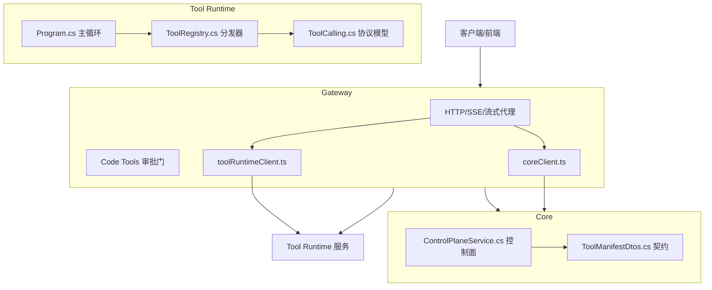
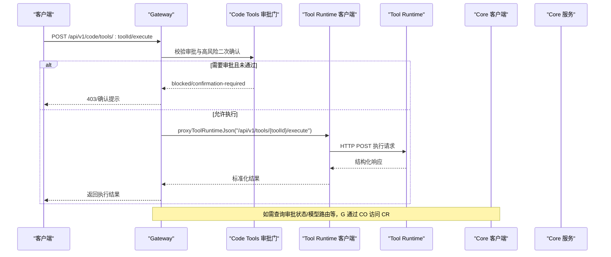
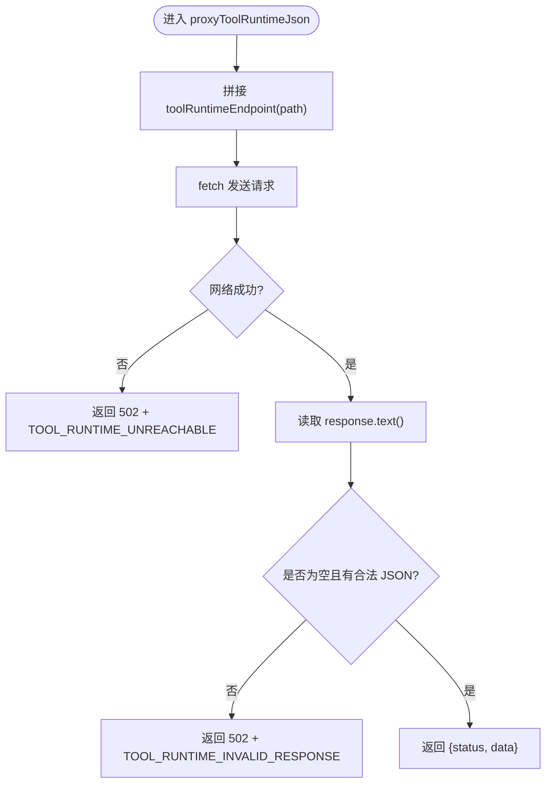
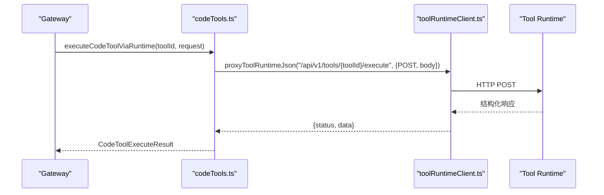
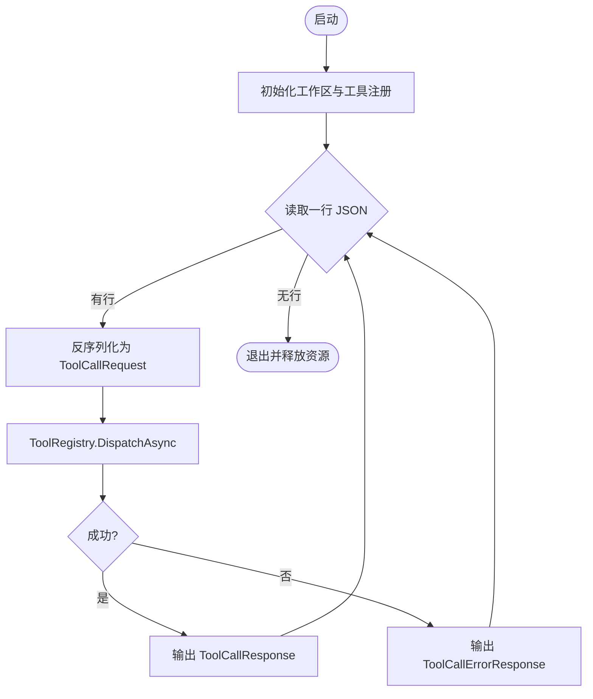
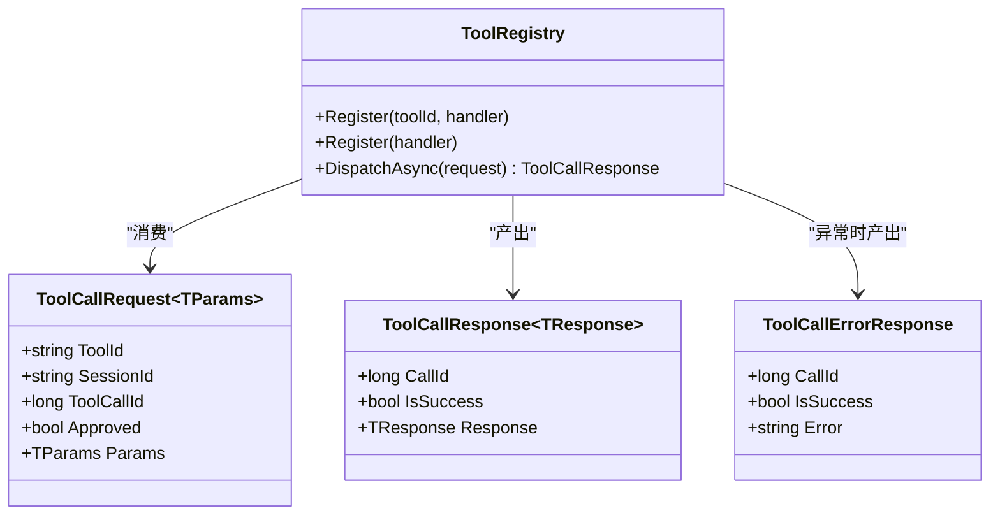
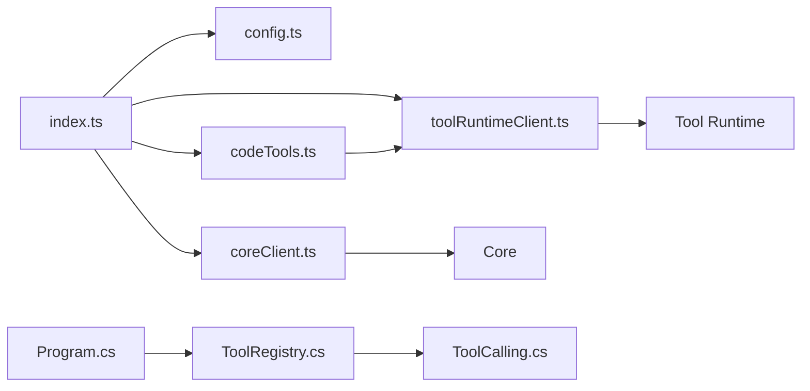

# 工具运行时客户端

<cite>
**本文引用的文件**   
- [toolRuntimeClient.ts](file://TinadecGateway/src/toolRuntimeClient.ts)
- [coreClient.ts](file://TinadecGateway/src/coreClient.ts)
- [config.ts](file://TinadecGateway/src/config.ts)
- [index.ts](file://TinadecGateway/src/index.ts)
- [codeTools.ts](file://TinadecGateway/src/codeTools.ts)
- [Program.cs](file://TinadecTools/Program.cs)
- [ToolRegistry.cs](file://TinadecTools/Abstractions/ToolRegistry.cs)
- [ToolCalling.cs](file://TinadecTools/Abstractions/ToolCalling.cs)
- [ControlPlaneService.cs](file://TinadecCore/Runtime/ControlPlaneService.cs)
- [ToolManifestDtos.cs](file://TinadecCore/Contracts/Dtos/ToolManifestDtos.cs)
</cite>

## 目录
1. [简介](#简介)
2. [项目结构](#项目结构)
3. [核心组件](#核心组件)
4. [架构总览](#架构总览)
5. [详细组件分析](#详细组件分析)
6. [依赖关系分析](#依赖关系分析)
7. [性能与可靠性](#性能与可靠性)
8. [故障排除指南](#故障排除指南)
9. [结论](#结论)
10. [附录：调用示例与最佳实践](#附录调用示例与最佳实践)

## 简介
本文件面向“工具运行时客户端”的实现与使用，聚焦于 Gateway 到 Tool Runtime 的 HTTP/SSE 代理能力、工具执行的生命周期管理、状态跟踪与结果返回机制，以及与 Core 服务的交互（工具注册、发现与调用）。文档同时覆盖错误处理、重试策略、超时控制与资源清理策略，并提供端到端调用示例与排障建议。

## 项目结构
- Gateway（Bun/TS）：提供统一的 HTTP API、认证、CORS、SSE/流式转发，以及 Code Tools 审批门与规格发布；通过 toolRuntimeClient.ts 将工具执行请求转发至 Tool Runtime。
- Tool Runtime（C#）：以控制台进程方式运行，按行协议接收 JSON 工具调用请求，经 ToolRegistry 分发到具体处理器，输出结构化响应。
- Core（C#）：提供控制面能力（如审批、模型路由、Agent 配置等），Gateway 通过 coreClient.ts 进行 JSON/SSE/流式代理。

**图表来源** 
- [index.ts:107-168](file://TinadecGateway/src/index.ts#L107-L168)
- [toolRuntimeClient.ts:44-97](file://TinadecGateway/src/toolRuntimeClient.ts#L44-L97)
- [coreClient.ts:38-87](file://TinadecGateway/src/coreClient.ts#L38-L87)
- [Program.cs:24-61](file://TinadecTools/Program.cs#L24-L61)
- [ToolRegistry.cs:76-84](file://TinadecTools/Abstractions/ToolRegistry.cs#L76-L84)
- [ToolCalling.cs:9-32](file://TinadecTools/Abstractions/ToolCalling.cs#L9-L32)
- [ControlPlaneService.cs:14-27](file://TinadecCore/Runtime/ControlPlaneService.cs#L14-L27)
- [ToolManifestDtos.cs:48-59](file://TinadecCore/Contracts/Dtos/ToolManifestDtos.cs#L48-L59)

**章节来源**
- [index.ts:107-168](file://TinadecGateway/src/index.ts#L107-L168)
- [config.ts:65-106](file://TinadecGateway/src/config.ts#L65-L106)

## 核心组件
- Tool Runtime 客户端（toolRuntimeClient.ts）
  - 提供 JSON 代理、SSE 代理与流式 HTTP 代理方法，统一构造 URL、设置 Accept 头、处理非 JSON 响应与网络异常。
- Core 客户端（coreClient.ts）
  - 提供 JSON/SSE/流式代理方法，用于健康检查、事件流、调试与模型/Agent 管理等。
- 配置（config.ts）
  - 集中加载部署模式、端口、主机、Core/Tool Runtime URL、认证、CORS、超时与反向代理信任等。
- Gateway 路由与编排（index.ts）
  - 定义对外 API，组合认证、CORS、SSE 转发、Code Tools 审批门、MCP 路由、调试与 Agent/Model Center 聚合视图。
- Code Tools 模块（codeTools.ts）
  - 维护工具规格、审批校验、高风险二次确认、并通过 toolRuntimeClient 将执行请求转发给 Tool Runtime。
- Tool Runtime 主循环（Program.cs）
  - 从标准输入逐行读取 JSON 请求，反序列化为 ToolCallRequest，经 ToolRegistry.DispatchAsync 分发给处理器，输出 ToolCallResponse 或错误响应。
- 工具注册与协议（ToolRegistry.cs, ToolCalling.cs）
  - 注册处理器、参数反序列化、审批标志校验、统一响应封装。

**章节来源**
- [toolRuntimeClient.ts:1-126](file://TinadecGateway/src/toolRuntimeClient.ts#L1-L126)
- [coreClient.ts:1-110](file://TinadecGateway/src/coreClient.ts#L1-L110)
- [config.ts:1-115](file://TinadecGateway/src/config.ts#L1-L115)
- [index.ts:107-168](file://TinadecGateway/src/index.ts#L107-L168)
- [codeTools.ts:439-462](file://TinadecGateway/src/codeTools.ts#L439-L462)
- [Program.cs:24-61](file://TinadecTools/Program.cs#L24-L61)
- [ToolRegistry.cs:76-84](file://TinadecTools/Abstractions/ToolRegistry.cs#L76-L84)
- [ToolCalling.cs:9-32](file://TinadecTools/Abstractions/ToolCalling.cs#L9-L32)

## 架构总览
Gateway 作为薄代理层，不直接执行任何工具操作，所有工具执行均通过 toolRuntimeClient 转发至 Tool Runtime。对于需要审批的高风险操作，Gateway 在 codeTools 中完成审批门验证后，再转发执行。Core 负责控制面数据（如审批、模型路由、Agent 配置等），Gateway 通过 coreClient 进行 JSON/SSE/流式代理。

**图表来源** 
- [index.ts:351-400](file://TinadecGateway/src/index.ts#L351-L400)
- [codeTools.ts:439-462](file://TinadecGateway/src/codeTools.ts#L439-L462)
- [toolRuntimeClient.ts:44-97](file://TinadecGateway/src/toolRuntimeClient.ts#L44-L97)
- [coreClient.ts:38-87](file://TinadecGateway/src/coreClient.ts#L38-L87)

## 详细组件分析

### Tool Runtime 客户端（toolRuntimeClient.ts）
- 功能要点
  - 统一构建 Tool Runtime 基础 URL 与完整端点。
  - JSON 代理：自动设置 accept/content-type，捕获网络异常与非 JSON 响应，返回统一 {status, data}。
  - SSE 代理：设置 accept=text/event-stream，透传 Response body。
  - 流式 HTTP：透传 RequestInit，适合大文件/日志传输。
- 错误处理
  - 网络不可达：返回 502 + TOOL_RUNTIME_UNREACHABLE。
  - 非 JSON 响应：返回 502 + TOOL_RUNTIME_INVALID_RESPONSE。
- 超时与重试
  - 当前实现未内置超时与重试；可通过上层 RequestInit 注入 fetch 选项或在网关层封装。

**图表来源** 
- [toolRuntimeClient.ts:44-97](file://TinadecGateway/src/toolRuntimeClient.ts#L44-L97)

**章节来源**
- [toolRuntimeClient.ts:1-126](file://TinadecGateway/src/toolRuntimeClient.ts#L1-L126)

### Core 客户端（coreClient.ts）
- 功能要点
  - 统一构建 Core URL 与端点。
  - JSON/SSE/流式代理方法与 Tool Runtime 客户端一致，便于 Gateway 对 Core 的统一访问。
- 错误处理
  - 网络不可达：返回 502 + CORE_UNREACHABLE。
  - 非 JSON 响应：返回 502 + CORE_INVALID_RESPONSE。

**章节来源**
- [coreClient.ts:1-110](file://TinadecGateway/src/coreClient.ts#L1-L110)

### 配置（config.ts）
- 关键配置项
  - mode：local/cloud
  - port/hostname：监听地址
  - coreUrl/toolRuntimeUrl：下游服务地址
  - auth：API Key/JWT 与 required
  - corsExtraOrigins：额外允许的源
  - requestTimeoutMs：请求超时（毫秒）
  - trustProxy：是否信任反向代理头
- 运行时单例 getConfig() 确保配置只加载一次。

**章节来源**
- [config.ts:1-115](file://TinadecGateway/src/config.ts#L1-L115)

### Gateway 路由与编排（index.ts）
- 健康检查与就绪性探针：统一代理到 Core。
- SSE 事件流：/api/v1/events 与 /api/v1/sessions/:sessionId/invoke-stream。
- Code Tools 执行入口：/api/v1/code/tools/:toolId/execute，集成审批门与高风险二次确认，最终通过 toolRuntimeClient 转发。
- MCP、Agent/Model Center、调试等：均为对 Core 的 JSON/SSE/流式代理。

**章节来源**
- [index.ts:157-178](file://TinadecGateway/src/index.ts#L157-L178)
- [index.ts:232-243](file://TinadecGateway/src/index.ts#L232-L243)
- [index.ts:351-400](file://TinadecGateway/src/index.ts#L351-L400)

### Code Tools 模块（codeTools.ts）
- 工具规格：维护 id、summary、category、requiresApproval、approvalSummary、language_support。
- 审批门：校验 approval_id 是否存在、状态是否为 approved、kind 是否匹配、cwd 与命令是否一致。
- 执行流程：executeCodeToolViaRuntime 调用 toolRuntimeClient 将请求转发到 Tool Runtime。
- 结果封装：统一返回 {tool_id, status, summary, evidence, data, requires_approval, approval_summary}。

**图表来源** 
- [codeTools.ts:439-462](file://TinadecGateway/src/codeTools.ts#L439-L462)
- [toolRuntimeClient.ts:44-97](file://TinadecGateway/src/toolRuntimeClient.ts#L44-L97)

**章节来源**
- [codeTools.ts:204-333](file://TinadecGateway/src/codeTools.ts#L204-L333)
- [codeTools.ts:439-462](file://TinadecGateway/src/codeTools.ts#L439-L462)

### Tool Runtime 主循环（Program.cs）
- 主循环从 Console.In 逐行读取 JSON 请求。
- 反序列化为 ToolCallRequest<JsonElement>，调用 ToolRegistry.DispatchAsync。
- 成功时输出 ToolCallResponse<JsonElement>；异常时输出 ToolCallErrorResponse。
- 进程退出前释放 McpRuntime。

**图表来源** 
- [Program.cs:24-61](file://TinadecTools/Program.cs#L24-L61)

**章节来源**
- [Program.cs:1-68](file://TinadecTools/Program.cs#L1-L68)

### 工具注册与协议（ToolRegistry.cs, ToolCalling.cs）
- ToolRegistry
  - 支持泛型注册处理器，自动处理 Approved 标志、参数反序列化与响应封装。
  - DispatchAsync 根据 toolId 解析处理器并调用。
- ToolCalling
  - 定义 ToolCallRequest/Response/ErrorResponse 的 JSON 字段映射与 SourceGenerationContext。

**图表来源** 
- [ToolRegistry.cs:10-84](file://TinadecTools/Abstractions/ToolRegistry.cs#L10-L84)
- [ToolCalling.cs:9-68](file://TinadecTools/Abstractions/ToolCalling.cs#L9-L68)

**章节来源**
- [ToolRegistry.cs:1-86](file://TinadecTools/Abstractions/ToolRegistry.cs#L1-86)
- [ToolCalling.cs:1-83](file://TinadecTools/Abstractions/ToolCalling.cs#L1-L83)

### 与 Core 服务交互（ControlPlaneService.cs, ToolManifestDtos.cs）
- ControlPlaneService 提供 Provider/Routes/Prompts/Agents/Approvals 等控制面接口，Gateway 通过 coreClient 代理访问。
- ToolManifestDtos 定义工具清单、风险等级、能力前缀等契约，供 Gateway 展示与决策。

**章节来源**
- [ControlPlaneService.cs:14-70](file://TinadecCore/Runtime/ControlPlaneService.cs#L14-L70)
- [ToolManifestDtos.cs:1-60](file://TinadecCore/Contracts/Dtos/ToolManifestDtos.cs#L1-L60)

## 依赖关系分析
- Gateway 依赖
  - config.ts：运行时配置
  - coreClient.ts：Core 服务代理
  - toolRuntimeClient.ts：Tool Runtime 代理
  - codeTools.ts：Code Tools 规格与审批门
  - index.ts：路由与编排
- Tool Runtime 依赖
  - Program.cs：主循环与生命周期
  - ToolRegistry.cs：工具分发
  - ToolCalling.cs：协议模型
- Core 依赖
  - ControlPlaneService.cs：控制面逻辑
  - ToolManifestDtos.cs：契约定义

**图表来源** 
- [index.ts:107-168](file://TinadecGateway/src/index.ts#L107-L168)
- [codeTools.ts:439-462](file://TinadecGateway/src/codeTools.ts#L439-L462)
- [toolRuntimeClient.ts:44-97](file://TinadecGateway/src/toolRuntimeClient.ts#L44-L97)
- [coreClient.ts:38-87](file://TinadecGateway/src/coreClient.ts#L38-L87)
- [Program.cs:24-61](file://TinadecTools/Program.cs#L24-L61)
- [ToolRegistry.cs:76-84](file://TinadecTools/Abstractions/ToolRegistry.cs#L76-L84)
- [ToolCalling.cs:9-32](file://TinadecTools/Abstractions/ToolCalling.cs#L9-L32)

**章节来源**
- [index.ts:107-168](file://TinadecGateway/src/index.ts#L107-L168)
- [codeTools.ts:439-462](file://TinadecGateway/src/codeTools.ts#L439-L462)
- [toolRuntimeClient.ts:44-97](file://TinadecGateway/src/toolRuntimeClient.ts#L44-L97)
- [coreClient.ts:38-87](file://TinadecGateway/src/coreClient.ts#L38-L87)
- [Program.cs:24-61](file://TinadecTools/Program.cs#L24-L61)
- [ToolRegistry.cs:76-84](file://TinadecTools/Abstractions/ToolRegistry.cs#L76-L84)
- [ToolCalling.cs:9-32](file://TinadecTools/Abstractions/ToolCalling.cs#L9-L32)

## 性能与可靠性
- 超时控制
  - 配置项 requestTimeoutMs 可用于上层封装（例如为 fetch 添加 AbortController），当前 toolRuntimeClient 与 coreClient 未内置超时。
- 重试机制
  - 当前未实现自动重试；建议在网关层对幂等 GET 请求增加指数退避重试。
- 流式传输
  - SSE 与流式 HTTP 适用于长任务与大数据传输，避免内存峰值。
- 资源清理
  - Tool Runtime 在 finally 块中释放 McpRuntime，避免资源泄漏。
- 并发与背压
  - Gateway 基于 Elysia/Bun，具备高并发能力；上游应合理限制并发与队列长度。

[本节为通用指导，不直接分析具体文件]

## 故障排除指南
- 常见错误码与含义
  - TOOL_RUNTIME_UNREACHABLE：Tool Runtime 不可达（网络/端口/防火墙问题）。
  - TOOL_RUNTIME_INVALID_RESPONSE：Tool Runtime 返回非 JSON。
  - CORE_UNREACHABLE/CORE_INVALID_RESPONSE：Core 不可达或非 JSON。
  - APPROVAL_DENIED：审批门拒绝（缺少/无效 approval_id、kind 不匹配、cwd 不一致等）。
- 排查步骤
  - 检查 config.ts 中的 coreUrl 与 toolRuntimeUrl 是否正确。
  - 确认 Tool Runtime 进程已启动并可被 Gateway 访问。
  - 查看 Core 健康检查与健康探针接口是否可用。
  - 对 Code Tools 执行，先获取 approvals 列表，确认 approval_id 与状态。
  - 若出现参数解析失败，检查请求体字段类型是否与 Tool Runtime 期望一致。
- 日志与诊断
  - Tool Runtime 使用 NLog 记录调试与警告信息。
  - Gateway 健康检查 /api/v1/health 可快速判断 Gateway/Core/Tool Runtime 连通性。

**章节来源**
- [toolRuntimeClient.ts:66-97](file://TinadecGateway/src/toolRuntimeClient.ts#L66-L97)
- [coreClient.ts:56-87](file://TinadecGateway/src/coreClient.ts#L56-L87)
- [index.ts:157-178](file://TinadecGateway/src/index.ts#L157-L178)
- [codeTools.ts:354-420](file://TinadecGateway/src/codeTools.ts#L354-L420)
- [Program.cs:45-61](file://TinadecTools/Program.cs#L45-L61)

## 结论
Tool Runtime 客户端在 Gateway 中承担“纯代理”职责，结合 Code Tools 审批门实现对高风险操作的治理。Core 提供控制面能力，Gateway 通过统一的 JSON/SSE/流式代理屏蔽差异。整体架构清晰、职责分离明确，便于扩展与维护。建议在网关层补充超时与重试策略，提升鲁棒性与用户体验。

[本节为总结性内容，不直接分析具体文件]

## 附录：调用示例与最佳实践
- 工具执行（Code Tools）
  - 路径：POST /api/v1/code/tools/:toolId/execute
  - 请求体：包含 session_id/run_id/task_node_id/approval_id/cwd/arguments/source 等字段。
  - 响应：CodeToolExecuteResult（status 可为 completed/stubbed/blocked/failed）。
- 事件流（SSE）
  - 路径：GET /api/v1/events?session_id=...
  - 用途：订阅系统事件与工具执行进度。
- 健康检查
  - 路径：GET /api/v1/health
  - 用途：快速判断 Gateway/Core/Tool Runtime 连通性。
- 最佳实践
  - 对高风险工具务必携带 approval_id，并确保 kind 与 cwd 匹配。
  - 对长耗时任务优先使用 SSE/流式接口。
  - 在网关层实现幂等请求的重试与超时控制。
  - 监控 Tool Runtime 进程存活与资源占用，必要时重启。

**章节来源**
- [index.ts:351-400](file://TinadecGateway/src/index.ts#L351-L400)
- [index.ts:279-286](file://TinadecGateway/src/index.ts#L279-L286)
- [index.ts:157-178](file://TinadecGateway/src/index.ts#L157-L178)
- [codeTools.ts:439-462](file://TinadecGateway/src/codeTools.ts#L439-L462)