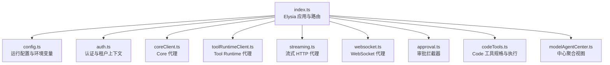
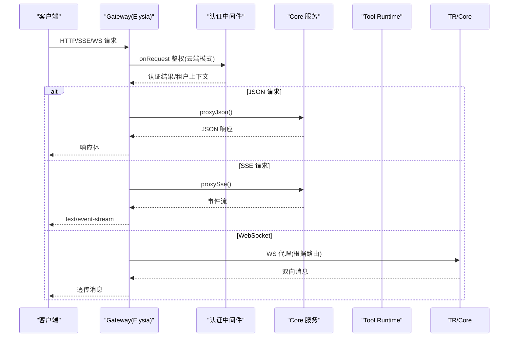
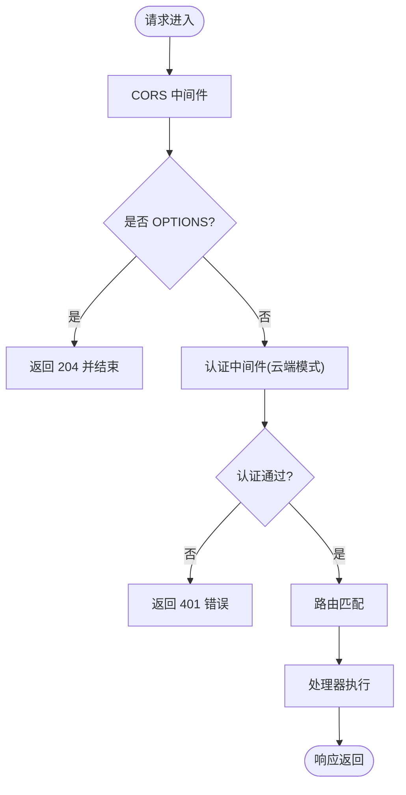
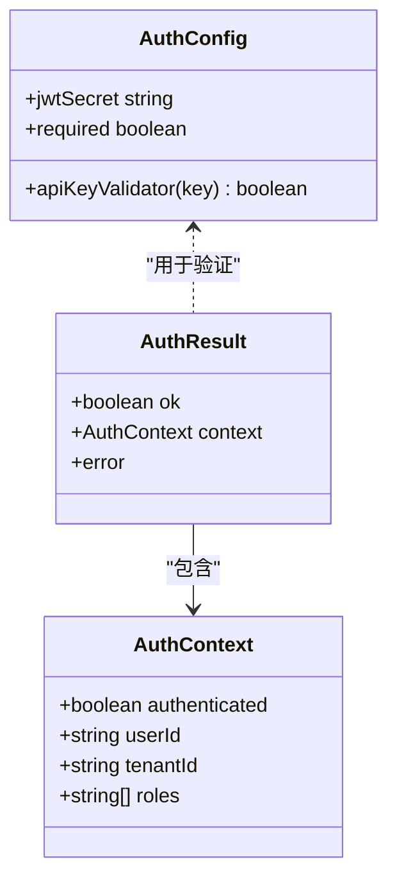
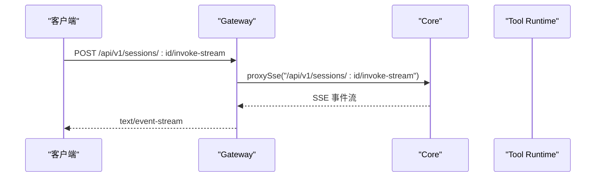
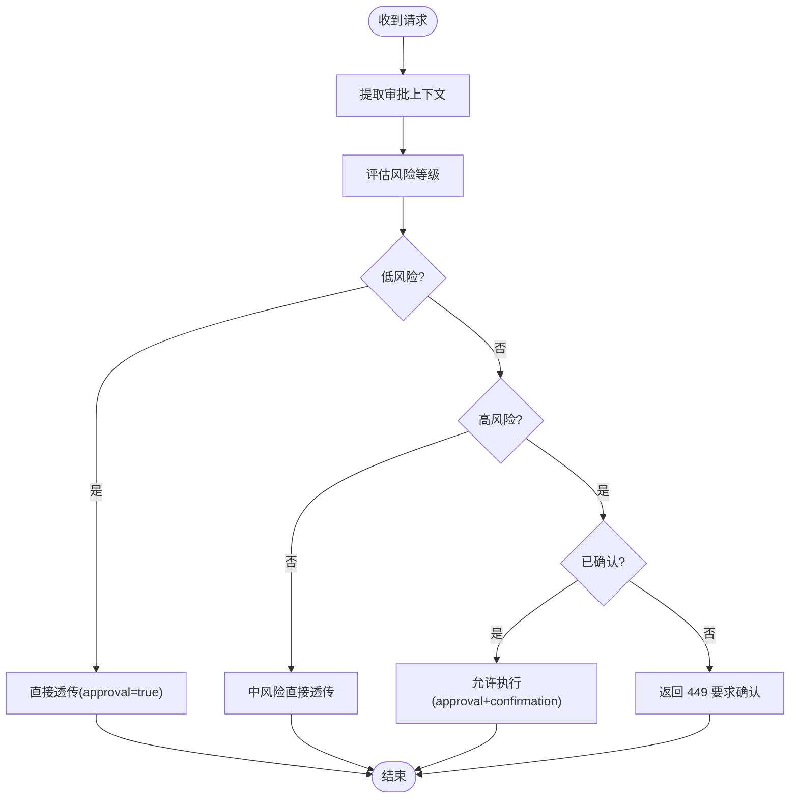
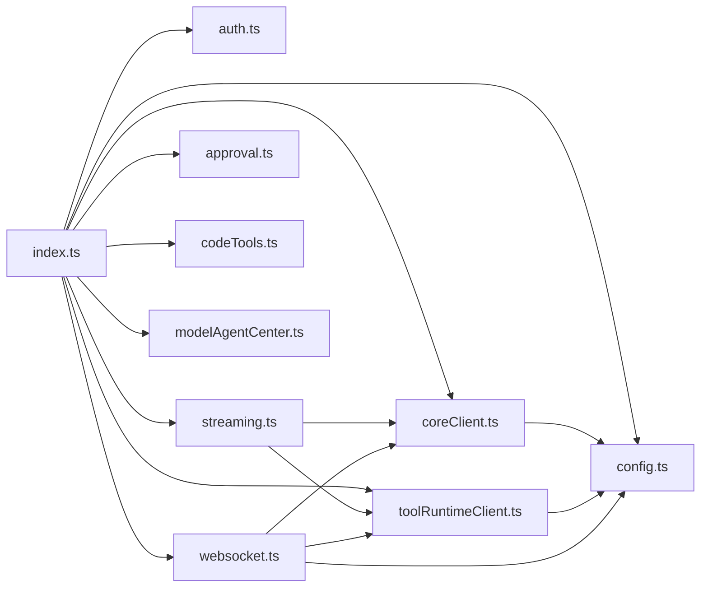

# 核心服务与路由

<cite>
**本文引用的文件**   
- [index.ts](file://TinadecGateway/src/index.ts)
- [config.ts](file://TinadecGateway/src/config.ts)
- [auth.ts](file://TinadecGateway/src/auth.ts)
- [coreClient.ts](file://TinadecGateway/src/coreClient.ts)
- [toolRuntimeClient.ts](file://TinadecGateway/src/toolRuntimeClient.ts)
- [streaming.ts](file://TinadecGateway/src/streaming.ts)
- [websocket.ts](file://TinadecGateway/src/websocket.ts)
- [approval.ts](file://TinadecGateway/src/approval.ts)
- [codeTools.ts](file://TinadecGateway/src/codeTools.ts)
- [modelAgentCenter.ts](file://TinadecGateway/src/modelAgentCenter.ts)
- [package.json](file://TinadecGateway/package.json)
- [bunfig.toml](file://TinadecGateway/bunfig.toml)
- [AGENTS.md](file://TinadecGateway/AGENTS.md)
- [README.md](file://README.md)
</cite>

## 目录
1. [简介](#简介)
2. [项目结构](#项目结构)
3. [核心组件](#核心组件)
4. [架构总览](#架构总览)
5. [详细组件分析](#详细组件分析)
6. [依赖关系分析](#依赖关系分析)
7. [性能考量](#性能考量)
8. [故障排查指南](#故障排查指南)
9. [结论](#结论)
10. [附录](#附录)

## 简介
本文件面向 Gateway 核心服务的实现与使用，聚焦 Elysia 框架的初始化配置、中间件管道、CORS 处理、请求生命周期管理；记录健康检查端点、状态监控与系统诊断接口；说明本地模式与云端模式的配置差异、环境变量设置与部署选项；并提供完整的 API 路由注册机制与请求处理流程说明。Gateway 作为薄 BFF/代理层，不执行业务逻辑，仅负责鉴权、协议转换、流式转发与聚合视图。

## 项目结构
Gateway 基于 Bun + Elysia 构建，入口为 src/index.ts，通过模块化拆分实现认证、代理、流式传输、WebSocket、审批拦截与中心聚合等能力。关键文件职责如下：
- index.ts：Elysia 应用初始化、中间件链、路由注册、启动监听
- config.ts：运行配置加载（本地/云端）、环境变量解析、单例配置
- auth.ts：认证与租户上下文提取、JWT HS256 验签、反向代理头处理
- coreClient.ts / toolRuntimeClient.ts：Core 与 Tool Runtime 的 HTTP/SSE/流式代理
- streaming.ts：流式 HTTP 透传与响应头设置
- websocket.ts：WebSocket 路由映射与目标 URL 构建
- approval.ts：人类操作审批门控与高风险二次确认
- codeTools.ts：Code 工具规格、审批验证与执行代理
- modelAgentCenter.ts：Model/Agent Center 无状态聚合视图

**图表来源** 
- [index.ts:107-948](file://TinadecGateway/src/index.ts#L107-L948)
- [config.ts:65-114](file://TinadecGateway/src/config.ts#L65-L114)
- [auth.ts:46-112](file://TinadecGateway/src/auth.ts#L46-L112)
- [coreClient.ts:38-101](file://TinadecGateway/src/coreClient.ts#L38-L101)
- [toolRuntimeClient.ts:44-125](file://TinadecGateway/src/toolRuntimeClient.ts#L44-L125)
- [streaming.ts:25-53](file://TinadecGateway/src/streaming.ts#L25-L53)
- [websocket.ts:51-74](file://TinadecGateway/src/websocket.ts#L51-L74)
- [approval.ts:145-197](file://TinadecGateway/src/approval.ts#L145-L197)
- [codeTools.ts:335-348](file://TinadecGateway/src/codeTools.ts#L335-L348)
- [modelAgentCenter.ts:517-535](file://TinadecGateway/src/modelAgentCenter.ts#L517-L535)

**章节来源**
- [index.ts:1-953](file://TinadecGateway/src/index.ts#L1-L953)
- [package.json:1-22](file://TinadecGateway/package.json#L1-L22)
- [bunfig.toml:1-13](file://TinadecGateway/bunfig.toml#L1-L13)
- [AGENTS.md:1-144](file://TinadecGateway/AGENTS.md#L1-L144)
- [README.md:1-120](file://README.md#L1-L120)

## 核心组件
- Elysia 应用初始化与中间件管道
  - CORS 中间件：按 Origin 白名单动态设置响应头，支持预检请求快速返回
  - 认证中间件：云端模式下校验 API Key/JWT，注入租户上下文；本地模式跳过
  - 路由注册：RESTful 端点、SSE、WebSocket、流式 HTTP 统一挂载
- 配置与环境变量
  - 本地模式：监听 127.0.0.1，无认证，无租户上下文
  - 云端模式：监听 0.0.0.0，支持 API Key/JWT、租户、反向代理头信任
- 健康检查与诊断
  - /api/v1/health：网关自身健康 + Core 健康合并
  - /api/v1/doctor、/api/v1/readiness、/api/v1/model-readiness、/api/v1/model-catalog-readiness、/api/v1/tool-layer-readiness：诊断与就绪状态透传
- 协议分层
  - HTTP/JSON：普通命令与查询
  - SSE：统一事件流（会话 invoke-stream、events）
  - WebSocket：终端、调试、协作
  - 流式 HTTP：大文件与日志

**章节来源**
- [index.ts:107-188](file://TinadecGateway/src/index.ts#L107-L188)
- [index.ts:157-193](file://TinadecGateway/src/index.ts#L157-L193)
- [config.ts:65-106](file://TinadecGateway/src/config.ts#L65-L106)
- [auth.ts:46-112](file://TinadecGateway/src/auth.ts#L46-L112)

## 架构总览
Gateway 作为薄代理，将客户端请求按协议分发到 Core 或 Tool Runtime，并在必要时进行鉴权、审批拦截与数据聚合。

**图表来源** 
- [index.ts:107-188](file://TinadecGateway/src/index.ts#L107-L188)
- [coreClient.ts:38-101](file://TinadecGateway/src/coreClient.ts#L38-L101)
- [toolRuntimeClient.ts:44-125](file://TinadecGateway/src/toolRuntimeClient.ts#L44-L125)
- [websocket.ts:51-74](file://TinadecGateway/src/websocket.ts#L51-L74)

## 详细组件分析

### Elysia 初始化与中间件管道
- 初始化顺序：CORS → 认证 → MCP 路由 → 健康/诊断 → 业务路由 → 启动监听
- CORS 策略：允许本地开发、Electron file://、Tauri 域名及自定义额外来源；OPTIONS 预检直接返回 204
- 认证策略：云端模式对非公开路径进行鉴权，失败返回 401；成功则注入租户上下文
- 启动监听：读取端口与主机名，输出运行模式与后端地址

**图表来源** 
- [index.ts:107-155](file://TinadecGateway/src/index.ts#L107-L155)
- [index.ts:948-953](file://TinadecGateway/src/index.ts#L948-L953)

**章节来源**
- [index.ts:107-155](file://TinadecGateway/src/index.ts#L107-L155)
- [index.ts:948-953](file://TinadecGateway/src/index.ts#L948-L953)

### CORS 处理
- 允许的 Origin 列表包含本地回环、localhost、file://、tauri:// 及通配符域名
- 预检请求自动填充允许方法与头部，缓存时间 86400s
- 正常请求附加 Access-Control-Allow-Origin/Credentials/Vary

**章节来源**
- [index.ts:66-139](file://TinadecGateway/src/index.ts#L66-L139)

### 认证与租户上下文
- 支持 API Key（x-api-key）与 Bearer JWT（HS256）两种认证方式
- JWT 验签使用 WebCrypto，严格限制算法为 HS256，fail-closed 策略
- 从 JWT claims 或 x-tenant-id 提取租户 ID，注入下游请求头
- 本地模式完全跳过认证

**图表来源** 
- [auth.ts:16-48](file://TinadecGateway/src/auth.ts#L16-L48)
- [auth.ts:46-112](file://TinadecGateway/src/auth.ts#L46-L112)

**章节来源**
- [auth.ts:46-112](file://TinadecGateway/src/auth.ts#L46-L112)
- [auth.ts:133-178](file://TinadecGateway/src/auth.ts#L133-L178)

### 健康检查与诊断接口
- /api/v1/health：合并 Core 健康信息，附加 gateway、mode、core_url、tool_runtime_url
- /api/v1/doctor、/api/v1/readiness、/api/v1/model-readiness、/api/v1/model-catalog-readiness、/api/v1/tool-layer-readiness：透传 Core 诊断与就绪状态

**章节来源**
- [index.ts:157-193](file://TinadecGateway/src/index.ts#L157-L193)

### 请求生命周期管理与路由注册
- RESTful 路由：Projects、Sessions、Approvals、Tools、Prompt Fragments、Model Center、Agent Center、Market、Extensions、MCP、ACP、Debug Studio 等
- SSE 路由：会话 invoke-stream、全局 events
- WebSocket 路由：/ws/terminal、/ws/debug、/ws/collaboration
- 流式 HTTP：文件下载、日志流

**图表来源** 
- [index.ts:232-243](file://TinadecGateway/src/index.ts#L232-L243)
- [coreClient.ts:93-101](file://TinadecGateway/src/coreClient.ts#L93-L101)

**章节来源**
- [index.ts:194-904](file://TinadecGateway/src/index.ts#L194-L904)

### 流式 HTTP 代理
- 用于大文件与日志流，Gateway 透传请求与响应的 body 流，不做缓冲
- 设置合适的响应头（content-type、cache-control、connection、x-accel-buffering）

**章节来源**
- [streaming.ts:25-53](file://TinadecGateway/src/streaming.ts#L25-L53)
- [index.ts:874-904](file://TinadecGateway/src/index.ts#L874-L904)

### WebSocket 代理
- 路由表定义终端、调试、协作三类 WS 端点到目标服务的映射
- 构建目标 WS URL（http→ws），支持查询参数透传
- 当前 index.ts 中的 WS 路由为桩实现，需结合 websocket.ts 的 createWsProxyHandlers 启用双向代理

**章节来源**
- [websocket.ts:51-74](file://TinadecGateway/src/websocket.ts#L51-L74)
- [index.ts:822-872](file://TinadecGateway/src/index.ts#L822-L872)

### 审批拦截器（人类操作）
- 评估请求风险等级（低/中/高），低风险直接透传，高风险需要二次确认
- 返回 449 提示 UI 弹窗，用户确认后带 confirmation=true 再次提交
- Agent 请求不走此拦截器，由 Core 审批门处理

**图表来源** 
- [approval.ts:145-197](file://TinadecGateway/src/approval.ts#L145-L197)

**章节来源**
- [approval.ts:145-197](file://TinadecGateway/src/approval.ts#L145-L197)
- [index.ts:921-946](file://TinadecGateway/src/index.ts#L921-L946)

### Code Tools 规格与执行
- /api/v1/code/tools：发布工具规格（ID、摘要、分类、是否需要审批等）
- /api/v1/code/tools/:toolId/execute：先验证 Core 审批状态，再经审批拦截器，最后代理到 Tool Runtime 执行
- 所有执行均通过 toolRuntimeClient 代理，Gateway 不直接执行任何工具

**章节来源**
- [codeTools.ts:335-348](file://TinadecGateway/src/codeTools.ts#L335-L348)
- [codeTools.ts:439-462](file://TinadecGateway/src/codeTools.ts#L439-L462)
- [index.ts:324-400](file://TinadecGateway/src/index.ts#L324-L400)

### Model/Agent Center 聚合视图
- GET /api/v1/model-center/overview：聚合供应商、连接、模型、CLI/ACP 运行时、就绪状态与诊断
- GET /api/v1/agent-center/overview：在 Model Center 基础上增加 Agent 绑定信息与共享路由警告
- 无状态聚合，不持久化数据，递归剥离敏感字段

**章节来源**
- [modelAgentCenter.ts:517-535](file://TinadecGateway/src/modelAgentCenter.ts#L517-L535)
- [index.ts:452-461](file://TinadecGateway/src/index.ts#L452-L461)

## 依赖关系分析
Gateway 模块间依赖清晰，核心依赖如下：
- index.ts 依赖 config、auth、coreClient、toolRuntimeClient、streaming、websocket、approval、codeTools、modelAgentCenter
- coreClient 与 toolRuntimeClient 依赖 config 获取基础 URL
- streaming 依赖 coreClient 与 toolRuntimeClient 构造目标 URL
- websocket 依赖 config、coreClient、toolRuntimeClient 构建 WS URL

**图表来源** 
- [index.ts:23-57](file://TinadecGateway/src/index.ts#L23-L57)
- [coreClient.ts:7-30](file://TinadecGateway/src/coreClient.ts#L7-L30)
- [toolRuntimeClient.ts:13-36](file://TinadecGateway/src/toolRuntimeClient.ts#L13-L36)
- [streaming.ts:8-10](file://TinadecGateway/src/streaming.ts#L8-L10)
- [websocket.ts:15-17](file://TinadecGateway/src/websocket.ts#L15-L17)

**章节来源**
- [index.ts:23-57](file://TinadecGateway/src/index.ts#L23-L57)

## 性能考量
- 流式代理：大文件与日志采用流式透传，避免内存峰值
- SSE：保持长连接，减少握手开销
- 认证中间件：云端模式按需验签，本地模式跳过以提升性能
- 超时控制：可通过环境变量调整请求超时时间
- 无状态设计：Gateway 不存储状态，便于横向扩展

[本节为通用指导，无需特定文件引用]

## 故障排查指南
- 健康检查失败：检查 /api/v1/health 返回的 core_url 与 tool_runtime_url 是否正确
- 认证失败：确认云端模式下是否配置了 TINADEC_GATEWAY_JWT_SECRET 或 TINADEC_GATEWAY_API_KEY
- 审批拦截：高风险操作需二次确认，检查请求是否携带 confirmation=true
- WebSocket 未连接：当前 WS 路由为桩实现，需启用 websocket.ts 的双向代理逻辑
- 流式响应异常：检查响应头是否包含必要的 cache-control、connection、x-accel-buffering

**章节来源**
- [index.ts:157-193](file://TinadecGateway/src/index.ts#L157-L193)
- [auth.ts:46-112](file://TinadecGateway/src/auth.ts#L46-L112)
- [approval.ts:145-197](file://TinadecGateway/src/approval.ts#L145-L197)
- [AGENTS.md:110-113](file://TinadecGateway/AGENTS.md#L110-L113)

## 结论
Gateway 以 Elysia 为核心，提供统一的鉴权、协议转换、流式转发与聚合视图能力。其无状态设计与清晰的模块边界使其易于扩展与维护。通过环境变量灵活切换本地/云端模式，满足开发与生产环境的差异化需求。建议在生产环境中启用认证、租户隔离与反向代理头信任，并结合健康检查与诊断接口进行持续监控。

[本节为总结性内容，无需特定文件引用]

## 附录

### 环境变量与部署选项
- TINADEC_GATEWAY_MODE：local（默认）或 cloud
- TINADEC_GATEWAY_PORT：监听端口（默认 48730）
- TINADEC_CORE_URL：Core 服务 URL（默认 http://127.0.0.1:48731）
- TINADEC_TOOL_RUNTIME_URL：Tool Runtime 服务 URL（默认 http://127.0.0.1:48732）
- TINADEC_GATEWAY_AUTH_REQUIRED：云端模式是否必须认证（默认 true）
- TINADEC_GATEWAY_JWT_SECRET：JWT 验证密钥
- TINADEC_GATEWAY_API_KEY：API Key
- TINADEC_GATEWAY_CORS_ORIGINS：额外 CORS 来源（逗号分隔）
- TINADEC_GATEWAY_TIMEOUT_MS：请求超时（默认 120000ms）

**章节来源**
- [config.ts:65-106](file://TinadecGateway/src/config.ts#L65-L106)
- [AGENTS.md:61-72](file://TinadecGateway/AGENTS.md#L61-L72)

### 常用命令
- 开发：cd TinadecGateway && bun run dev
- 构建：cd TinadecGateway && bun run build
- 测试：cd TinadecGateway && bun test

**章节来源**
- [package.json:7-12](file://TinadecGateway/package.json#L7-L12)
- [AGENTS.md:130-143](file://TinadecGateway/AGENTS.md#L130-L143)