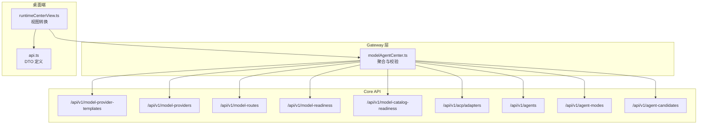
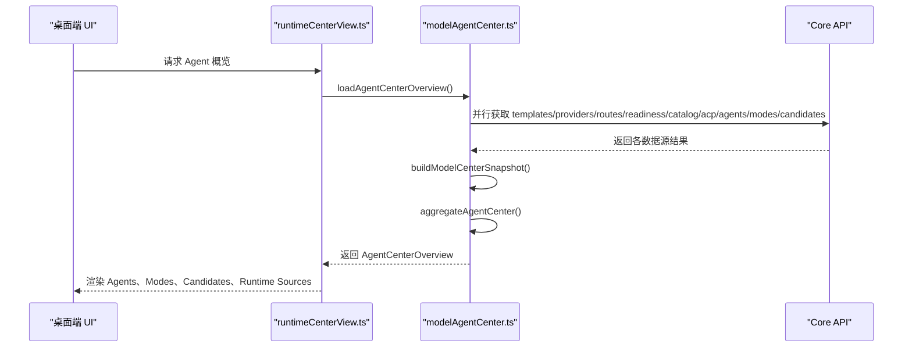
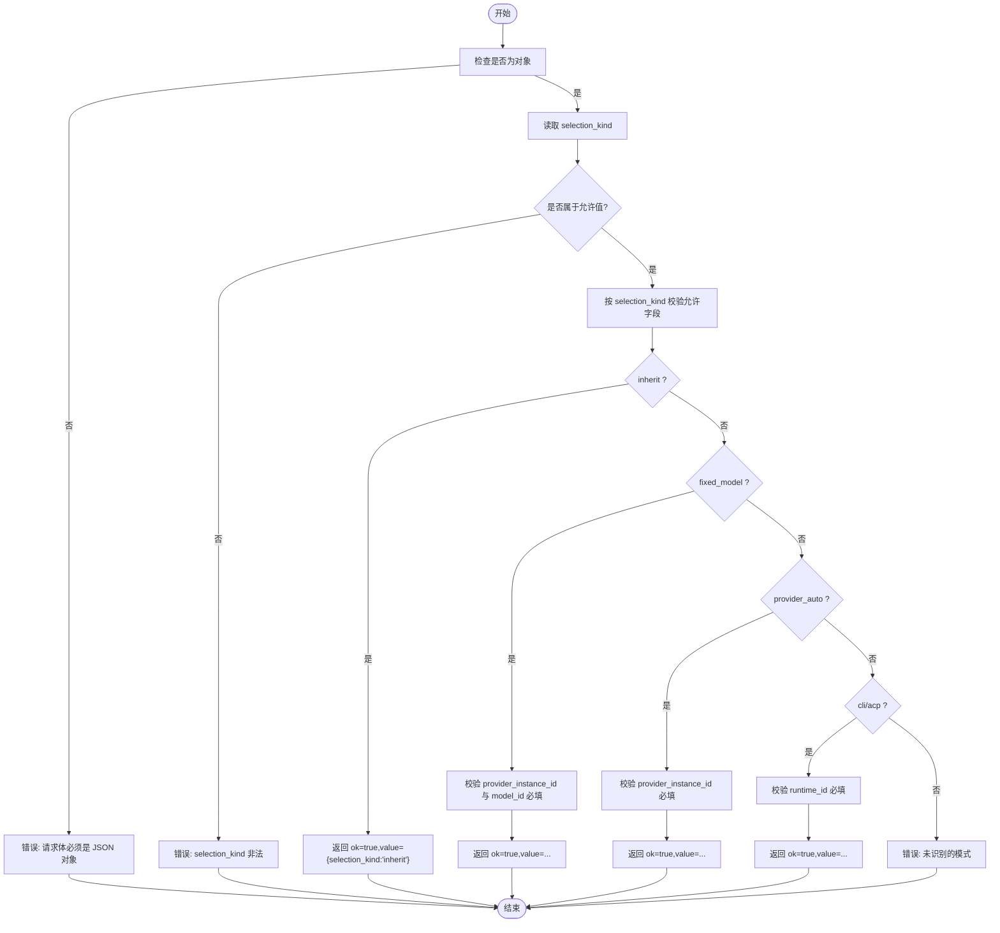
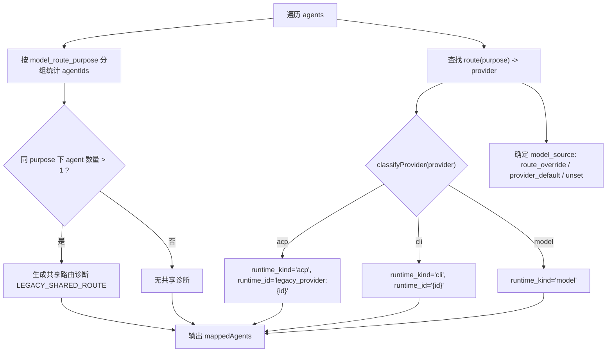
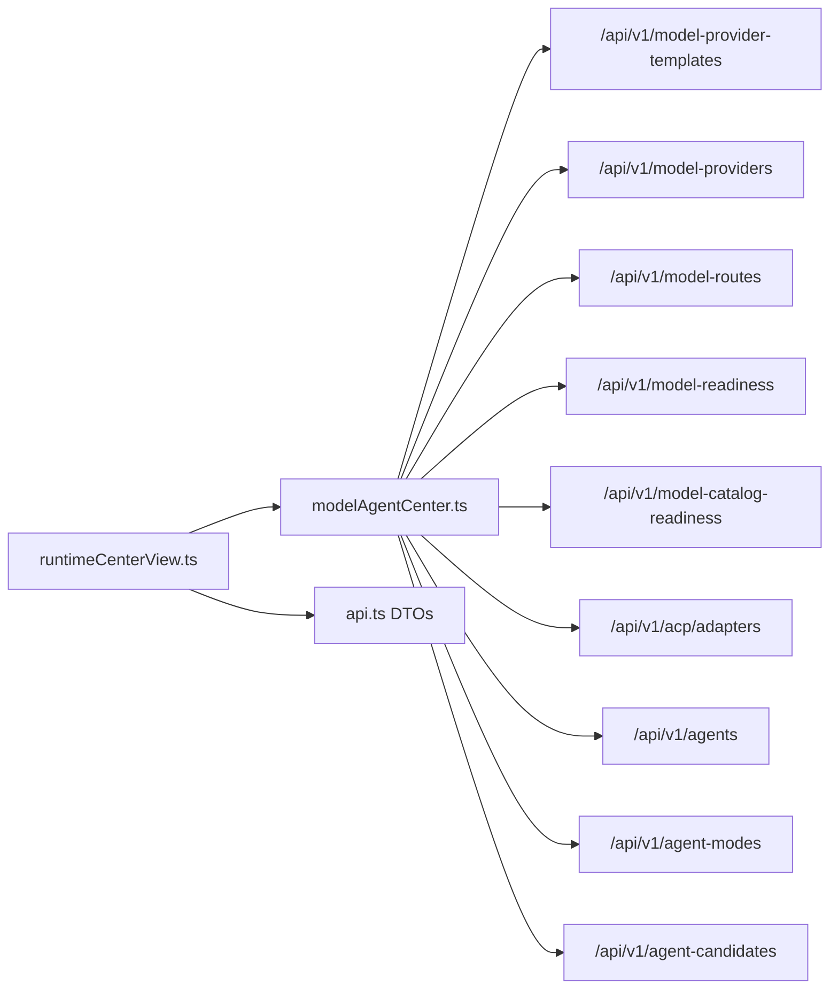

# Agent 中心管理

<cite>
**本文引用的文件**
- [modelAgentCenter.ts](file://TinadecGateway/src/modelAgentCenter.ts)
- [runtimeCenterView.ts](file://apps/desktop/src/runtimeCenterView.ts)
- [api.ts](file://apps/desktop/src/api.ts)
- [modelAgentCenter.test.ts](file://TinadecGateway/src/modelAgentCenter.test.ts)
</cite>

## 目录
1. [简介](#简介)
2. [项目结构](#项目结构)
3. [核心组件](#核心组件)
4. [架构总览](#架构总览)
5. [详细组件分析](#详细组件分析)
6. [依赖关系分析](#依赖关系分析)
7. [性能考虑](#性能考虑)
8. [故障排除指南](#故障排除指南)
9. [结论](#结论)
10. [附录](#附录)

## 简介
本文件面向 Agent 中心管理功能，聚焦以下目标：
- 运行时绑定机制：解释继承、固定模型、提供者自动、CLI、ACP 等绑定模式及其校验与写入流程。
- 模式切换与资源管理：说明 Agent 的 mode/candidates 聚合、运行时来源（providers/models/cli_runtimes/acp_runtimes）组织方式。
- 路由目的映射与共享路由警告：阐述 model_route_purpose 到 provider/route 的映射规则及共享路由场景下的只读限制与告警。
- 数据结构契约：完整记录 AgentCenterOverview、AgentRuntimeBindingInput 等关键接口字段与约束。
- 配置示例与排障：提供常见配置要点与问题定位方法。

## 项目结构
Agent 中心能力由 Gateway 层的数据聚合与校验逻辑，以及桌面端视图层的展示与交互组成：
- Gateway 层（TinadecGateway/src/modelAgentCenter.ts）：负责从 Core 拉取模板、提供者、路由、就绪状态、ACP 适配器等数据，聚合为 Model/Agent Center Overview，并实现绑定输入校验与写操作占位。
- 桌面端（apps/desktop/src/runtimeCenterView.ts、apps/desktop/src/api.ts）：定义 DTO 类型、将后端数据转换为 UI 可用的行/选项，并提供绑定摘要与共享路由警告辅助函数。

图表来源
- [modelAgentCenter.ts:807-880](file://TinadecGateway/src/modelAgentCenter.ts#L807-L880)
- [runtimeCenterView.ts:1-172](file://apps/desktop/src/runtimeCenterView.ts#L1-L172)
- [api.ts:500-557](file://apps/desktop/src/api.ts#L500-L557)

章节来源
- [modelAgentCenter.ts:1-1059](file://TinadecGateway/src/modelAgentCenter.ts#L1-L1059)
- [runtimeCenterView.ts:1-172](file://apps/desktop/src/runtimeCenterView.ts#L1-L172)
- [api.ts:500-557](file://apps/desktop/src/api.ts#L500-L557)

## 核心组件
- AgentCenterOverview：Agent 中心概览的核心数据结构，包含 agents、modes、candidates、runtime_sources、readiness、capabilities、diagnostics 等字段。
- AgentRuntimeBindingInput：运行时绑定的输入契约，支持 inherit、fixed_model、provider_auto、cli、acp 五种选择模式。
- 聚合器 aggregateAgentCenter：将 Core 原始数据转换为 AgentCenterOverview，完成路由目的映射、运行时分类、共享路由诊断生成。
- 校验器 validateAgentRuntimeBindingInput：对绑定输入进行严格校验，返回 ok/value 或 errors。
- 视图工具 runtimeCenterView：提供绑定摘要、共享路由警告提取、运行时来源汇总等前端辅助方法。

章节来源
- [modelAgentCenter.ts:185-200](file://TinadecGateway/src/modelAgentCenter.ts#L185-L200)
- [modelAgentCenter.ts:372-459](file://TinadecGateway/src/modelAgentCenter.ts#L372-L459)
- [modelAgentCenter.ts:461-515](file://TinadecGateway/src/modelAgentCenter.ts#L461-L515)
- [runtimeCenterView.ts:151-172](file://apps/desktop/src/runtimeCenterView.ts#L151-L172)
- [api.ts:507-557](file://apps/desktop/src/api.ts#L507-L557)

## 架构总览
Agent 中心通过 Gateway 聚合 Core 的多项数据源，形成统一的 AgentCenterOverview；桌面端基于该概览渲染界面并进行用户交互。

图表来源
- [modelAgentCenter.ts:527-535](file://TinadecGateway/src/modelAgentCenter.ts#L527-L535)
- [modelAgentCenter.ts:807-880](file://TinadecGateway/src/modelAgentCenter.ts#L807-L880)
- [modelAgentCenter.ts:372-459](file://TinadecGateway/src/modelAgentCenter.ts#L372-L459)

## 详细组件分析

### AgentCenterOverview 数据结构
- agents：Agent 列表，每个元素包含 id/name/layer/agent_type/mode/description/model_route_purpose/allowed_tools/capabilities/system_prompt/enabled/is_built_in/updated_at 以及 runtime_binding。
- modes：Agent 模式集合（Array<Record<string, unknown>>），用于描述不同模式的执行策略与预算策略等。
- candidates：候选 Agent 集合（Array<Record<string, unknown>>），由其他 Agent 生成，供评估与提升。
- runtime_sources：运行时来源聚合，包括 providers、models、cli_runtimes、acp_runtimes。
- readiness：模型与目录就绪状态。
- capabilities：中心能力标志，如 agent_runtime_binding_write、acp_adapter_read 等。
- diagnostics：诊断信息，包含共享路由警告、可选能力不可用等。

章节来源
- [modelAgentCenter.ts:185-193](file://TinadecGateway/src/modelAgentCenter.ts#L185-L193)
- [api.ts:541-557](file://apps/desktop/src/api.ts#L541-L557)

### AgentRuntimeBindingInput 验证逻辑
- selection_kind 必须为 inherit/fixed_model/provider_auto/cli/acp 之一。
- 每种模式允许字段：
  - inherit：仅 selection_kind。
  - fixed_model：selection_kind + provider_instance_id + model_id。
  - provider_auto：selection_kind + provider_instance_id。
  - cli：selection_kind + runtime_id。
  - acp：selection_kind + runtime_id。
- 校验失败时返回 { ok: false; errors: [...] }；成功时返回 { ok: true; value: ... }。

图表来源
- [modelAgentCenter.ts:461-515](file://TinadecGateway/src/modelAgentCenter.ts#L461-L515)

章节来源
- [modelAgentCenter.ts:461-515](file://TinadecGateway/src/modelAgentCenter.ts#L461-L515)
- [modelAgentCenter.test.ts:231-259](file://TinadecGateway/src/modelAgentCenter.test.ts#L231-L259)

### 运行时分类算法与路由目的映射
- 运行时分类 classifyProvider：根据 provider.capabilities 与 connection_kind 判断为 acp/cli/model 三类。
- 路由目的映射：以 agent.model_route_purpose 为键查找 route，再关联 provider 实例，从而确定 runtime_kind、runtime_id、provider_display_name、model_id、model_source。
- 共享路由诊断：同一 purpose 被多个 Agent 使用时，标记 LEGACY_SHARED_ROUTE 警告，并将绑定设为只读。

图表来源
- [modelAgentCenter.ts:372-459](file://TinadecGateway/src/modelAgentCenter.ts#L372-L459)
- [modelAgentCenter.ts:752-757](file://TinadecGateway/src/modelAgentCenter.ts#L752-L757)

章节来源
- [modelAgentCenter.ts:372-459](file://TinadecGateway/src/modelAgentCenter.ts#L372-L459)
- [modelAgentCenter.ts:752-757](file://TinadecGateway/src/modelAgentCenter.ts#L752-L757)

### 共享路由警告机制
- 当某 model_route_purpose 被多个 Agent 共享时，生成诊断 code='LEGACY_SHARED_ROUTE'，message 提示只读，并附带 shared_agent_ids。
- 前端可通过 legacyRouteWarning 快速提取警告信息，用于 UI 提示。

章节来源
- [modelAgentCenter.ts:386-397](file://TinadecGateway/src/modelAgentCenter.ts#L386-L397)
- [runtimeCenterView.ts:161-167](file://apps/desktop/src/runtimeCenterView.ts#L161-L167)

### 运行时来源管理与视图转换
- runtime_sources.providers：API 连接资源，包含 driver/base_url/model/capabilities/status 等。
- runtime_sources.models：已配置的模型，来源于 provider 默认模型或 route 覆盖。
- runtime_sources.cli_runtimes：CLI 运行时，来源于 provider_instance。
- runtime_sources.acp_runtimes：ACP 运行时，来源于 adapter 或 legacy_provider。
- 视图层 providersFromOverview 将 api_connections/cli_runtimes/legacy_acp 统一为 ProviderInstanceDto，便于 UI 展示。

章节来源
- [modelAgentCenter.ts:178-183](file://TinadecGateway/src/modelAgentCenter.ts#L178-L183)
- [modelAgentCenter.ts:668-687](file://TinadecGateway/src/modelAgentCenter.ts#L668-L687)
- [runtimeCenterView.ts:88-99](file://apps/desktop/src/runtimeCenterView.ts#L88-L99)

### 绑定写入与能力标志
- agentRuntimeBindingWriteResult：当前 Core 尚未支持持久化 per-agent 绑定，返回 501 并标注 agent_runtime_binding_write=false。
- 若输入无效，返回 400 并标注 AGENT_RUNTIME_BINDING_INVALID。

章节来源
- [modelAgentCenter.ts:206-243](file://TinadecGateway/src/modelAgentCenter.ts#L206-L243)
- [modelAgentCenter.test.ts:261-281](file://TinadecGateway/src/modelAgentCenter.test.ts#L261-L281)

## 依赖关系分析
- Gateway 层依赖 Core 的多项 API：模板、提供者、路由、就绪、ACP 适配器、Agent/Modes/Candidates。
- 桌面端依赖 API 定义的 DTO，并通过 runtimeCenterView 进行数据转换与展示。

图表来源
- [modelAgentCenter.ts:807-880](file://TinadecGateway/src/modelAgentCenter.ts#L807-L880)
- [runtimeCenterView.ts:1-172](file://apps/desktop/src/runtimeCenterView.ts#L1-L172)
- [api.ts:500-557](file://apps/desktop/src/api.ts#L500-L557)

章节来源
- [modelAgentCenter.ts:807-880](file://TinadecGateway/src/modelAgentCenter.ts#L807-L880)
- [runtimeCenterView.ts:1-172](file://apps/desktop/src/runtimeCenterView.ts#L1-L172)
- [api.ts:500-557](file://apps/desktop/src/api.ts#L500-L557)

## 性能考虑
- 并行加载：loadCenterInputs 使用 Promise.all 并发获取所有必要与可选数据源，减少整体延迟。
- 可选能力降级：对于 404/501 的可选能力，转为诊断而非失败，保证概览可用性与鲁棒性。
- 数据清洗：sanitizeUnknown/sanitizeRecord 过滤敏感字段，避免泄露并降低传输体积。

章节来源
- [modelAgentCenter.ts:807-880](file://TinadecGateway/src/modelAgentCenter.ts#L807-L880)
- [modelAgentCenter.ts:1008-1028](file://TinadecGateway/src/modelAgentCenter.ts#L1008-L1028)

## 故障排除指南
- 绑定输入无效：检查 selection_kind 是否在允许集合内，且对应字段齐全；参考 validateAgentRuntimeBindingInput 的错误提示。
- 共享路由只读：若 model_route_purpose 被多个 Agent 共享，绑定为只读；需调整路由目的或解耦 Agent。
- 能力不可用：查看 diagnostics 中的 CORE_CAPABILITY_UNAVAILABLE，确认可选能力（如 agent_modes、agent_candidates、acp_adapters）的状态。
- 写入不支持：当前 agent_runtime_binding_write=false，写入会返回 501；等待后续版本支持或采用替代方案。

章节来源
- [modelAgentCenter.ts:461-515](file://TinadecGateway/src/modelAgentCenter.ts#L461-L515)
- [modelAgentCenter.ts:386-397](file://TinadecGateway/src/modelAgentCenter.ts#L386-L397)
- [modelAgentCenter.ts:206-243](file://TinadecGateway/src/modelAgentCenter.ts#L206-L243)
- [modelAgentCenter.test.ts:231-281](file://TinadecGateway/src/modelAgentCenter.test.ts#L231-L281)

## 结论
Agent 中心管理通过 Gateway 的数据聚合与严格的绑定校验，提供了清晰的运行时绑定语义与丰富的概览信息。共享路由警告与能力降级机制增强了系统的可观测性与健壮性。未来在支持 per-agent 绑定写入后，可进一步扩展动态绑定与模式切换能力。

## 附录
- 配置示例（概念性说明）：
  - inherit：适用于沿用全局路由目的的简单场景。
  - fixed_model：指定 provider_instance_id 与 model_id，锁定具体模型。
  - provider_auto：指定 provider_instance_id，由系统自动选择模型。
  - cli/acp：指定 runtime_id，指向 CLI 或 ACP 运行时。
- 常见问题：
  - 字段缺失或多余：确保 selection_kind 与对应字段一致。
  - 共享路由导致只读：调整 model_route_purpose 或拆分 Agent。
  - 能力不可用：检查 Core 能力与网络连通性。